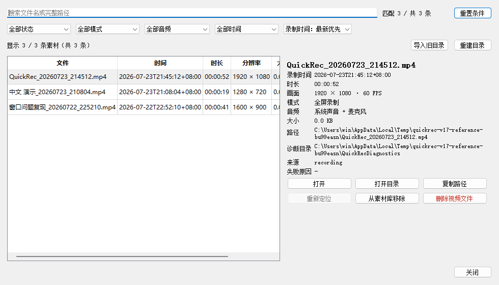
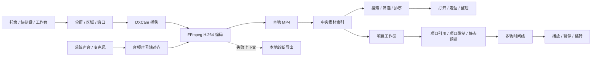

# QuickRec Full

> 面向 Windows 的本地屏幕录制、素材管理与项目创作工具。支持全屏、区域和
> 窗口录制，四类音频模式、中央素材库、项目工作区、可播放多轨时间线、
> 诊断导出，以及单显示器 1080p120 全屏录制能力。

[](https://github.com/NzyZzz1998/QuickRec/releases/tag/v1.9.2)


## 版本状态

| 产品线 | 状态 | 分支 / 标签 | 说明 |
| --- | --- | --- | --- |
| QuickRec Full v1.9.2 | **当前正式版** | `master` / `v1.9.2` | 可播放多轨时间线 |
| QuickRec Full v1.9.1 | 历史稳定版 | `v1.9.1` | 项目素材预览与基础使用闭环 |
| QuickRec Full v1.9 | 历史稳定版 | `v1.9` | 项目工作区基础 |
| QuickRec Full v1.8 | 历史稳定版 | `v1.8` | 统一工作台、视觉改版和 1080p120 |
| QuickRec Lite | 独立维护 | `E:\codex\QuickRec-Lite` | 轻量产品线，不属于本工作区 |

v1.9.2 已完成开发、自动化门禁、D10 GUI 与真实媒体验收和正式发布。
v1.9.1 是当前直接回滚点。

- [下载 QuickRec Full v1.9.2](https://github.com/NzyZzz1998/QuickRec/releases/tag/v1.9.2)
- [查看当前事实入口](doc/current.md)
- [查看 v1.9.2 发布进度](doc/releases/v1.9.2/progress.md)
- [查看 v1.9.2 验收记录](doc/releases/v1.9.2/manual-verification.md)

## v1.9.2 正式版本

v1.9.2 将项目素材扩展为可保存、可恢复、可播放的多轨时间线：

- 项目页通过“进入剪辑”打开独立、默认最大化的剪辑工作台。
- 默认一条视频轨和一条音频轨，两类轨道分别最多 8 条。
- 支持素材加入、原生拖入、片段拖动、吸附、轨道管理和同素材多次使用。
- 每个离散操作自动保存，支持最多 50 步撤销和重做。
- 使用 PyAV 提供播放、暂停、随机跳转、固定视频覆盖和固定音频混合。
- 支持素材缺失、重新定位、只读、损坏恢复和外部修改冲突保护。
- 通过 8+8 轨、100 片段、30 分钟和四路音频实际听音验收。

正式发布包：

```text
EXE: E:\QRtest\QuickRec-v1.9.2-release-dist\QuickRec\QuickRec.exe
EXE SHA256: 5383A34E50F963E224AF67D299B58B3903FDBC84F4A5CAA3B955B9C4AE75A5FA
ZIP: E:\QRtest\QuickRec-v1.9.2-win-x64.zip
ZIP SHA256: AA4D234F0AA4E3B8342B29A5AABD7CD9A76E45BCF140696748A1A9A490848BA1
状态: D10 通过，正式发布
```

详细资料：

- [v1.9.2 PRD](doc/releases/v1.9.2/prd.md)
- [v1.9.2 实施计划](doc/releases/v1.9.2/dev_plan.md)
- [v1.9.2 进度看板](doc/releases/v1.9.2/progress.md)
- [v1.9.2 自动验证](doc/releases/v1.9.2/verification.md)
- [v1.9.2 GUI 验收](doc/releases/v1.9.2/manual-verification.md)
- [v1.9.2 发布说明](doc/releases/v1.9.2/release-notes.md)
- [v1.9.2 变更日志](doc/releases/v1.9.2/changelog.md)

## v1.9.1 正式版本

v1.9.1 在 v1.9 项目工作区基础上补齐项目素材预览和基础使用闭环：

- 项目素材列表和详情区提供静态首帧预览。
- 支持未生成、排队、生成中、可用、失败、缓存失效、缺失和待关联状态。
- 支持刷新单条预览及批量重建项目预览。
- 支持从项目页打开视频、定位所在目录，以及跳转并选中全局素材库记录。
- 素材库保留项目来源和返回上下文。
- 首帧缓存独立于项目与素材索引，默认上限 500 MiB，可安全删除和重建。
- 录制开始时暂停启动新预览任务，退出时受控结束任务和 FFmpeg 子进程。

正式发布包：

```text
EXE: E:\QRtest\QuickRec-v1.9.1-rc6-dist\QuickRec\QuickRec.exe
EXE SHA256: 33B7DB1EB96007D75BF933D5600EE813A03ED42390CAE3A93EAD0960B9C6C7D9
ZIP: E:\QRtest\QuickRec-v1.9.1-win-x64.zip
ZIP SHA256: FD859E4EA0065119BE06C382BCE3FA2C76774DB23711C21023F0A95A1F61F588
状态: D8 通过，正式发布
```

详细资料：

- [v1.9.1 PRD](doc/releases/v1.9.1/prd.md)
- [v1.9.1 实施计划](doc/releases/v1.9.1/dev_plan.md)
- [v1.9.1 进度看板](doc/releases/v1.9.1/progress.md)
- [v1.9.1 自动验证](doc/releases/v1.9.1/verification.md)
- [v1.9.1 GUI 验收](doc/releases/v1.9.1/manual-verification.md)
- [v1.9.1 发布说明](doc/releases/v1.9.1/release-notes.md)
- [v1.9.1 变更日志](doc/releases/v1.9.1/changelog.md)

## v1.9 正式版本

v1.9 在 v1.8 工作台中新增本地项目工作区基础：

- 工作台新增“项目”一级页面。
- 支持创建、原地打开、重命名、说明编辑、归档、恢复和安全删除项目。
- 素材以稳定 ID 引用加入一个或多个项目，不复制、移动或接管原视频。
- 支持从项目上下文发起全屏、区域和窗口录制，并分别反馈视频保存、素材入库和项目关联结果。
- 支持项目缺失重新定位、损坏备份恢复、只读约束和外部修改冲突保护。
- 删除项目默认不处理视频；只有可证明独占的素材允许选择，并且只进入 Windows 回收站。

正式发布包：

```text
EXE: E:\QRtest\QuickRec-v1.9-dist-r8\QuickRec\QuickRec.exe
EXE SHA256: CFE6BC6D4FC342039A0B410B4CF80FC9A34BAD47908F671AE9161FC63F7A9D47
ZIP: E:\QRtest\QuickRec-v1.9-win-x64.zip
ZIP SHA256: B683D051D8D0442B3503F8C5AD9FAE96F8D5538510E890E98F48EB3A1562F446
状态: D8 24/24 通过，正式发布
```

详细资料：

- [v1.9 PRD](doc/releases/v1.9/prd.md)
- [v1.9 实施计划](doc/releases/v1.9/dev_plan.md)
- [v1.9 进度看板](doc/releases/v1.9/progress.md)
- [v1.9 自动验证](doc/releases/v1.9/verification.md)
- [v1.9 GUI 验收](doc/releases/v1.9/manual-verification.md)
- [v1.9 发布说明](doc/releases/v1.9/release-notes.md)
- [v1.9 变更日志](doc/releases/v1.9/changelog.md)

## 产品界面

下图来自当前实际素材库界面。v1.8 将录制、素材库、设置和诊断统一并入工作台，
素材库不再作为独立用户窗口。



v1.8 高保真交互原型与逐页面实现核对：

- [工作台交互原型](doc/releases/v1.8/prototype/index.html)
- [原型与组件规范](doc/releases/v1.8/prototype/prototype-design.md)
- [实际实现视觉核对](doc/releases/v1.8/visual-verification.md)

## 核心能力

### 录制

- 全屏、区域和窗口三种录制模式。
- 无声、系统声音、麦克风、系统声音＋麦克风四种音频模式。
- 托盘、全局快捷键、倒计时和浮动录制工具栏。
- FFmpeg H.264 实时编码，支持录制状态、磁盘空间和编码失败降级。
- 输出视频不叠加 QuickRec 自绘光标；点击高亮仅作为桌面实时提示。

### 素材库

- 使用 `%APPDATA%\QuickRec\recordings.json` 维护跨保存路径中央索引。
- 记录时长、分辨率、FPS、录制模式、音频模式和文件大小。
- 支持关键词搜索、状态/模式/音频/时间筛选和结果排序。
- 支持历史迁移、手动导入、目录重建、备份恢复和文件重新定位。
- 支持复制路径、仅移除索引，以及将受控视频移入 Windows 回收站。
- 索引写入失败不会改写“视频已保存”的事实，可通过待入库机制重试。

### 项目工作区与时间线（v1.9-v1.9.2）

- 使用 `%APPDATA%\QuickRec\projects.json` 维护中央项目发现索引。
- 每个项目使用独立 `project.qrproj` 保存详情和素材稳定 ID 引用。
- 支持同一素材加入多个项目，从单个项目移除不会删除视频或全局素材记录。
- 支持默认或自定义项目位置、外部项目原地登记和最近项目查询。
- 支持项目缺失、损坏、只读和外部冲突恢复。
- 项目文件和选择的独占视频只进入 Windows 回收站，不提供永久删除路径。
- 项目素材提供静态首帧、状态反馈、刷新和批量重建。
- 支持打开文件、定位目录和项目与素材库之间的上下文跳转。
- 支持独立剪辑工作台、视频轨/音频轨、片段编排、自动保存和 50 步撤销重做。
- 支持播放、暂停、随机跳转、固定视频覆盖、固定音频混合和资源受控释放。
- 支持 8+8 轨、100 片段和 30 分钟时间线。

### 设置与诊断

- 保存路径、质量、FPS、音频、倒计时、快捷键和开机自启配置。
- 复制诊断信息、打开日志目录、导出诊断文件和自定义诊断目录。
- 配置采用原子写入；保存失败时保留原配置并提供明确反馈。

## 工作流程



视频保存与素材索引是两条独立结果：视频成功生成后，即使索引或元数据处理失败，
QuickRec 也不会误报视频保存失败。

## v1.8 正式版本

v1.8 包含两条正式产品主线：

1. **Full 工作台基础壳与视觉改版**
   - 固定侧栏统一承接录制、素材库、设置和诊断。
   - 工作台单实例、关闭隐藏、页面状态保持和离屏位置修正。
   - 区域选择器、窗口选择器、倒计时和录制工具栏继续作为独立浮动界面。

2. **单显示器 1080p120 全屏录制**
   - 设置提供 30、60、120 FPS；新安装仍默认 30 FPS。
   - 首次选择 120 FPS 时执行真实硬件能力检测。
   - 快速校验检查显示刷新率、检测缓存、FFmpeg、保存目录和磁盘空间。
   - 区域和窗口录制最高 60 FPS，不会覆盖已保存的全屏 120 设置。
   - 性能不足时保留视频并展示实际平均 FPS、最低 FPS 和稳定性告警。

正式发布包已经通过三次 1080p120 技术门禁、三档 DPI、四类音频、10 分钟漂移、
音画绝对偏移、自动化回归和主要 GUI 链路。
详细证据见 [v1.8 verification](doc/releases/v1.8/verification.md)。

```text
发布资产：QuickRec-v1.8-win-x64.zip
EXE SHA256：8BDB84FB08198E927C722E41AC37276A796AD168C55183EE6C24194F2BFE7EA6
ZIP SHA256：78AD1AA5EABCE77211607CE7135C9656923892B5D9C837F92E4EF6C961B10B27
```

## 快速运行

要求：Windows、Python 3.12，以及项目根目录下可用的 `ffmpeg/ffmpeg.exe` 和
`ffmpeg/ffprobe.exe`。

```powershell
cd E:\codex\QuickRec
python -m pip install -r requirements.txt
python -m pip install -r requirements-dev.txt
python src/main.py
```

应用启动后默认驻留系统托盘。通过托盘菜单或双击托盘图标打开工作台。

## 测试与质量门禁

```powershell
python -m pytest -q
python -m pytest --cov=src --cov-report=term-missing --cov-fail-under=80 -q
python -m pytest -m packaging -q
python -m ruff check src tests scripts
python -m mypy
python -m compileall -q src scripts
```

当前 v1.9.2 的最终验证结果：

- 全量测试：`867 passed, 27 deselected, 56 subtests passed`
- Packaging：`15 passed`
- 总体覆盖率：`83.56%`
- 时间线核心增量覆盖率：`86.44%`
- 播放与页面协调增量覆盖率：`82.23%`
- Ruff、mypy、compileall、UTF-8 和 `git diff --check`：通过
- 100%、125%、150% DPI：通过
- 音画最大绝对偏移：`18.229 ms`，门槛 `40 ms`
- 10 分钟漂移增量：`-8.333 ms`，门槛 `20 ms`
- QuickRec Lite：未修改

硬件冒烟：

```powershell
python scripts/hardware_smoke.py --output-dir E:\QRtest --duration 3 --mode fullscreen
```

## 打包

```powershell
python -m PyInstaller build_std.spec --clean --noconfirm
```

默认输出目录：

```text
dist/QuickRec/
```

## 文档导航

```text
doc/
├── current.md                 # 当前正式版本事实入口
├── product/                   # 产品级长期文档
├── releases/
│   ├── v1.4.1/                # 诊断导出发布资料
│   ├── v1.5/                  # 最近录制
│   ├── v1.6/                  # 中央素材库
│   ├── v1.6.1/                # 待入库恢复补丁
│   ├── v1.7/                  # 历史稳定版本
│   ├── v1.8/                  # 历史稳定版本
│   ├── v1.9/                  # 历史稳定版本
│   ├── v1.9.1/                # 历史稳定版本
│   └── v1.9.2/                # 当前正式版本
├── technical/
├── verification/
├── prototypes/
└── archive/
```

v1.8 的主要文档：

- [PRD](doc/releases/v1.8/prd.md)
- [实施计划](doc/releases/v1.8/dev_plan.md)
- [进度看板](doc/releases/v1.8/progress.md)
- [自动化验证](doc/releases/v1.8/verification.md)
- [GUI 手动验收](doc/releases/v1.8/manual-verification.md)
- [缺陷记录](doc/releases/v1.8/bugfix-log.md)
- [发布说明](doc/releases/v1.8/release-notes.md)
- [变更日志](doc/releases/v1.8/changelog.md)

v1.9.2 当前文档入口见 [doc/releases/v1.9.2/progress.md](doc/releases/v1.9.2/progress.md)。

## 发布与回滚

- 当前正式 Release：[QuickRec Full v1.9.2](https://github.com/NzyZzz1998/QuickRec/releases/tag/v1.9.2)
- v1.9.2 ZIP SHA256：`AA4D234F0AA4E3B8342B29A5AABD7CD9A76E45BCF140696748A1A9A490848BA1`
- v1.9.2 直接代码和发布包回滚点：`v1.9.1`
- 从 v1.8 回滚至 v1.7 前，如配置中 `fps=120`，应先改为 `60`；视频和素材索引无需删除。
- `v1.4.1` tag 固定指向诊断导出发布提交 `16c7dce`，未被移动或重写。

QuickRec Lite 已拆分到 `E:\codex\QuickRec-Lite`，Full 与 Lite 的代码、文档、发布包和
版本标签独立维护。
