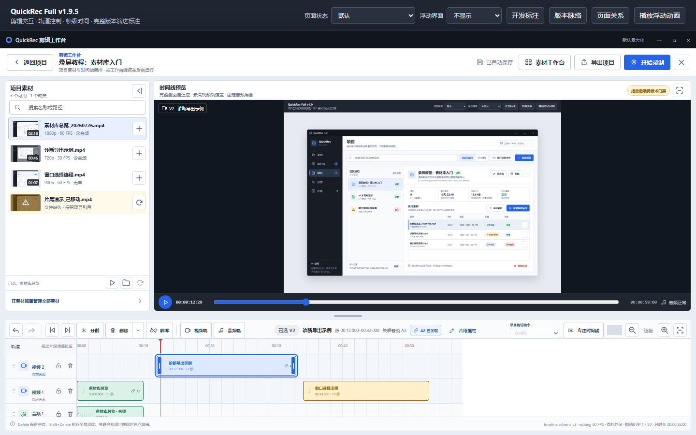
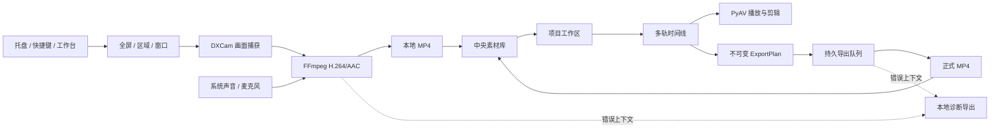

# QuickRec Full

> 面向 Windows 的本地录屏与创作工具。把屏幕录制、素材管理、项目编排、
> 多轨剪辑和 MP4 导出放进同一个桌面工作流。

[](https://github.com/NzyZzz1998/QuickRec/releases/tag/v1.9.5)


[下载正式版](https://github.com/NzyZzz1998/QuickRec/releases/tag/v1.9.5)
· [当前事实源](doc/current.md)
· [发布身份清单](release-manifest.json)
· [v1.9.5 验收结果](doc/releases/v1.9.5/manual-verification.md)
· [版本文档](doc/releases/)

## 从录制到成片

| 录制 | 管理 | 创作 | 导出 |
| --- | --- | --- | --- |
| 全屏、区域、窗口 | 跨目录中央素材库 | 项目与多轨时间线 | 持久导出队列 |
| 30、60、120 FPS | 搜索、筛选、重新定位 | 播放、裁剪、分割、波纹 | H.264/AAC MP4 |
| 四类音频模式 | 首帧预览与恢复 | 8 条视频轨 + 8 条音频轨 | 校验、取消、重试、恢复 |

下图为 v1.9.5 剪辑工作台高保真交互原型，用于页面实现与验收对照。正式发布包的
GUI、真实媒体和 DPI 证据见
[D9 手动验收记录](doc/releases/v1.9.5/manual-verification.md)。



## 当前版本

| 版本 | 状态 | 分支 / 标签 | 核心内容 |
| --- | --- | --- | --- |
| v1.9.5 | 当前正式版 | `master` / `v1.9.5` | 剪辑快捷键、音视频解绑、智能拖放、帧级编辑 |
| v1.9.4 | 历史稳定版 | tag `v1.9.4` | 持久导出队列与本地成片闭环 |
| QuickRec Lite | 独立产品线 | `E:\codex\QuickRec-Lite` | 轻量录制，不属于本工作区 |

v1.9.5 已完成自动化门禁与 D9 验收：`31/31` 项全部通过，当前没有发布阻塞。
正式发布包与完成验收并锁定身份的 RC3 二进制一致。

### v1.9.5 核心能力

- 统一播放、逐帧、逐秒、分割、删除、波纹删除、关联、撤销和重做快捷键。
- 支持关联音视频原子解绑、严格重新关联，以及解绑后的独立编辑。
- `Delete` 普通删除并保留空隙，`Shift+Delete` 执行全局波纹删除。
- 素材拖入时间线时提供落点预览、帧级吸附、类型校验、冲突反馈和条件性自动建轨。
- 项目使用 30、60 或 120 FPS 编辑基准，提供 `HH:MM:SS:FF` 和统一帧边界换算。
- 录制工具栏跟随实际录制屏幕，并定位在屏幕中上安全区。
- 导出成功、取消或中断后，只清理可精确归属的临时文件。

> **跨版本编辑警告**
>
> v1.9.5 项目与 v1.9.4 及更早版本不保证向下编辑兼容。跨版本操作前请备份
> `.qrproj` 和 `.bak`，不要在多个版本间反复打开并保存同一生产项目。

当前版本的 [PRD](doc/releases/v1.9.5/prd.md)、
[进度看板](doc/releases/v1.9.5/progress.md)、
[自动验证](doc/releases/v1.9.5/verification.md) 和
[验收追溯矩阵](doc/releases/v1.9.5/acceptance-matrix.md) 均可直接查阅。

## 核心能力

### 屏幕录制

- 全屏、区域和窗口三种录制模式。
- 无声、系统声音、麦克风、系统声音加麦克风四种音频模式。
- 托盘入口、全局快捷键、倒计时和浮动录制工具栏。
- FFmpeg H.264 实时编码，以及磁盘空间、设备和编码异常反馈。
- 单显示器 1080p120 全屏录制能力检测；区域和窗口录制最高 60 FPS。
- 输出视频不叠加 QuickRec 自绘光标；点击高亮仅作为桌面实时提示。

### 中央素材库

- 使用 `%APPDATA%\QuickRec\recordings.json` 维护跨保存路径索引。
- 记录时长、分辨率、FPS、录制模式、音频模式和文件大小。
- 支持关键词搜索、条件筛选、排序、分页和缺失状态。
- 支持历史迁移、手动导入、目录重建、备份恢复和文件重新定位。
- 支持打开文件、定位目录、复制路径、仅移除索引和移入 Windows 回收站。
- 视频保存与索引写入相互独立，索引失败不会改写“视频已保存”的事实。

### 项目与多轨剪辑

- 使用 `%APPDATA%\QuickRec\projects.json` 维护项目发现索引。
- 每个项目使用独立 `project.qrproj`，素材以稳定 ID 引用，不复制原始视频。
- 支持项目创建、打开、重命名、归档、恢复、只读保护和外部冲突处理。
- 支持静态首帧、项目素材刷新、批量重建和素材库上下文跳转。
- 独立剪辑工作台提供视频轨、音频轨、时间标尺、播放头、缩放和滚动。
- 支持播放、暂停、随机跳转、裁剪、分割、轨道锁和全局波纹。
- 支持 8 条视频轨、8 条音频轨、100 个片段和 30 分钟时间线。
- 每个离散操作自动保存，并保留最多 50 步撤销与重做。

### 正式导出

- 从 timeline schema v2 冻结不可变 `ExportPlan`。
- 支持最高 4K 画布与 30、60、120 FPS H.264/AAC MP4。
- 使用最高视频轨固定覆盖，并动态混合最多 8 路活动音频。
- 单工作线程持久队列支持进度、取消、诊断、重试和中断恢复。
- 默认不覆盖已有目标；显式覆盖使用可恢复事务。
- FFprobe 验证通过后原子提交成片，并自动加入中央素材库。

### 设置与诊断

- 保存路径、质量、FPS、音频、倒计时、快捷键和开机自启。
- 配置采用原子写入，保存失败时保留原配置并显示明确反馈。
- 支持复制诊断信息、打开日志目录、导出诊断文件和自定义诊断目录。
- 所有诊断数据保存在本地，不提供云上传。

## 工作流



## 快速开始

### 使用正式发布包

1. 从 [QuickRec Full v1.9.5 Release](https://github.com/NzyZzz1998/QuickRec/releases/tag/v1.9.5)
   下载 `QuickRec-v1.9.5-win-x64.zip`。
2. 解压到可写目录。
3. 运行 `QuickRec.exe`。
4. 应用默认驻留系统托盘；双击托盘图标或选择“打开工作台”进入主界面。

发布包已包含运行所需的 FFmpeg 和 FFprobe，不需要单独安装 Python。

### 从源码运行

要求：Windows、Python 3.12，以及仓库 `ffmpeg/` 目录中的 `ffmpeg.exe` 和
`ffprobe.exe`。

```powershell
cd E:\codex\QuickRec
python -m pip install -r requirements.txt
python src/main.py
```

开发与测试依赖：

```powershell
python -m pip install -r requirements-dev.txt
```

## 快捷键

### 录制快捷键

录制快捷键可以在设置页修改。

| 默认快捷键 | 操作 |
| --- | --- |
| `Ctrl+Shift+R` | 开始全屏录制 |
| `Ctrl+Shift+A` | 开始区域录制 |
| `Ctrl+Shift+W` | 开始窗口录制 |
| `Ctrl+Shift+P` | 暂停或继续 |
| `Ctrl+Shift+S` | 停止并保存 |

### v1.9.5 剪辑快捷键

这些快捷键仅在剪辑工作台获得合适焦点时生效，不会覆盖文本输入、菜单或弹窗操作。

| 快捷键 | 操作 |
| --- | --- |
| `Space` | 播放或暂停 |
| `Left` / `Right` | 前进或后退一帧 |
| `Shift+Left` / `Shift+Right` | 前进或后退一秒 |
| `Ctrl+B` | 在播放头处分割 |
| `Delete` | 普通删除，保留空隙 |
| `Shift+Delete` | 全局波纹删除 |
| `Ctrl+L` | 解绑或打开严格重新关联 |
| `Ctrl+Z` / `Ctrl+Y` | 撤销或重做 |
| `Esc` | 取消当前候选、拖放或弹窗 |

## 内部自动化 CLI

`QuickRecCLI.exe` 面向开发、CI 和发布验收，默认使用隔离工作区，不作为普通用户的
完整命令行产品。

```powershell
QuickRecCLI.exe doctor --json
QuickRecCLI.exe probe "E:\Videos\sample.mp4" --json
QuickRecCLI.exe project validate "E:\Projects\demo\project.qrproj" --json
QuickRecCLI.exe timeline validate "E:\Projects\demo\project.qrproj" --json
```

CLI 不能替代托盘交互、区域或窗口框选、DPI 检查和真实音频听测。

## 测试与质量

```powershell
python -m pytest -q
python -m pytest --cov=src --cov-report=term-missing --cov-fail-under=80 -q
python -m pytest -m packaging -q
python -m ruff check src tests scripts
python -m mypy
python -m compileall -q src scripts
```

v1.9.5 正式发布验证结果：

| 门禁 | 结果 |
| --- | --- |
| 全量测试 | `1425 passed, 32 deselected, 72 subtests passed` |
| Packaging | `20 passed` |
| 总体覆盖率 | `84.14%` |
| v1.9.5 领域核心增量覆盖率 | `95.24%` |
| v1.9.5 UI 协调增量覆盖率 | `97.75%` |
| Ruff / Mypy / Compileall | 通过 |
| GUI、真实媒体与 DPI | D9 `31/31` 项全部通过 |
| QuickRec Lite | 未修改 |

使用 HECATE GS03 完成麦克风和“系统声音+麦克风”真实录制与听音：两类输出
均为 H.264/AAC，麦克风样本可听见口述，双音频样本可同时听见系统测试音与
口述。详细证据见
[v1.9.5 手动验收记录](doc/releases/v1.9.5/manual-verification.md)。

硬件冒烟：

```powershell
python scripts/hardware_smoke.py --output-dir E:\QRtest --duration 3 --mode fullscreen
```

<details>
<summary>v1.9.5 发布包身份</summary>

```text
QuickRec.exe
705B227FE33F31D4EE650334D607CAAA919FC3D1B44C633CEA1E5B75B3B4A226

QuickRecCLI.exe
1133802A8BB999B7CE198BB9EBF3F4F9D7C8160C9C9798C0248E28F940F0E386

ffmpeg.exe
5AF82A0D4FE2B9EAE211B967332EA97EDFC51C6B328CA35B827E73EAC560DC0D

ffprobe.exe
192A1D6899059765AC8C39764FC3148D4E6049955956DC2029F81F4BD6A8972D

QuickRec-v1.9.5-win-x64.zip
0B4F90B0202B2F0296B463BFF196B04E7C0BCA6709A245037E390AC1B7185D59
```

</details>

## 打包

```powershell
python -m PyInstaller build_std.spec --clean --noconfirm
```

默认输出到 `dist/QuickRec/`。发布前还需要基于最终提交重新构建、锁定哈希并完成
Packaging 与 GUI 验收，不能直接复用过期候选包身份。

## 项目结构

```text
QuickRec/
├── src/
│   ├── recorder/      # 捕获、音频、编码与录制状态
│   ├── services/      # 素材、项目、时间线与播放领域服务
│   ├── exporting/     # 导出计划、队列、执行与提交
│   ├── ui/            # 工作台、剪辑工作台与浮动窗口
│   ├── cli/           # 内部自动化 CLI
│   └── utils/         # 文件、元数据、迁移与安全操作
├── tests/             # 单元、UI、集成、硬件与打包测试
├── scripts/           # 冒烟、覆盖率和发布辅助脚本
├── ffmpeg/            # 随包分发的 FFmpeg / FFprobe
├── doc/
│   ├── current.md     # 当前事实入口
│   ├── releases/      # 各版本 PRD、计划、验证与发布资料
│   ├── technical/     # 技术研究和架构资料
│   └── archive/       # 历史需求池与归档
└── build_std.spec     # PyInstaller 构建入口
```

## 文档导航

| 文档 | 用途 |
| --- | --- |
| [doc/current.md](doc/current.md) | 当前正式版、产物与回滚事实 |
| [v1.9.5 PRD](doc/releases/v1.9.5/prd.md) | 当前版本需求合同 |
| [v1.9.5 dev plan](doc/releases/v1.9.5/dev_plan.md) | 实施顺序、影响范围与门禁 |
| [v1.9.5 progress](doc/releases/v1.9.5/progress.md) | 最小任务与当前状态 |
| [v1.9.5 verification](doc/releases/v1.9.5/verification.md) | 自动验证与候选包身份 |
| [v1.9.5 manual verification](doc/releases/v1.9.5/manual-verification.md) | GUI、真实媒体和 DPI 证据 |
| [v1.9.5 acceptance matrix](doc/releases/v1.9.5/acceptance-matrix.md) | PRD 到验收证据追溯 |
| [v1.9.5 release notes](doc/releases/v1.9.5/release-notes.md) | 当前正式版发布说明 |

<details>
<summary>历史稳定版本</summary>

| 版本 | 主要里程碑 |
| --- | --- |
| [v1.9.4](doc/releases/v1.9.4/) | 持久导出队列与正式成片 |
| [v1.9.3](doc/releases/v1.9.3/) | 基础剪辑、全局波纹与 CLI |
| [v1.9.2](doc/releases/v1.9.2/) | 可播放多轨时间线 |
| [v1.9.1](doc/releases/v1.9.1/) | 项目素材首帧预览 |
| [v1.9](doc/releases/v1.9/) | 项目工作区基础 |
| [v1.8](doc/releases/v1.8/) | 统一工作台与 1080p120 |
| [v1.7](doc/releases/v1.7/) | 素材搜索、筛选与排序 |
| [v1.6](doc/releases/v1.6/) | 中央素材库 |
| [v1.5](doc/releases/v1.5/) | 最近录制 |
| [v1.4.1](doc/releases/v1.4.1/) | 诊断导出 |

</details>

## 数据安全与回滚

- 录制视频、项目文件、素材索引、导出结果和诊断信息均保存在本地。
- 项目通过稳定 ID 引用素材，不会因为加入项目而复制或接管原视频。
- “仅移除索引”不会删除视频；受控删除进入 Windows 回收站，不使用永久删除。
- v1.9.5 的代码与发布包直接回滚点为 `v1.9.4`。
- 回滚前关闭 QuickRec、QuickRecCLI、FFmpeg 和 FFprobe，并保留 `.qrproj`、
  `.bak`、中央索引、视频和已完成导出。
- `v1.4.1` tag 固定指向诊断导出发布提交 `16c7dce`，不得移动或重写。

QuickRec Lite 位于独立工作区 `E:\codex\QuickRec-Lite`，Full 与 Lite 的代码、
配置、文档、发布包和版本标签分别维护。
