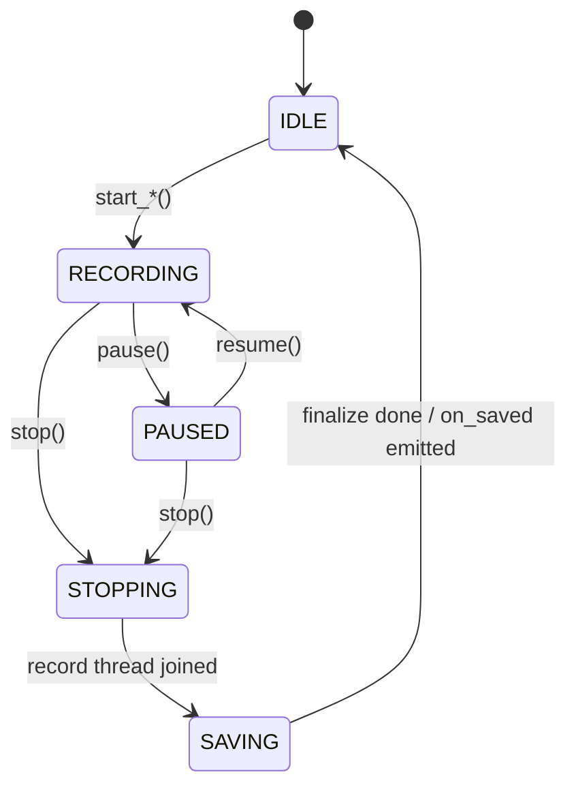
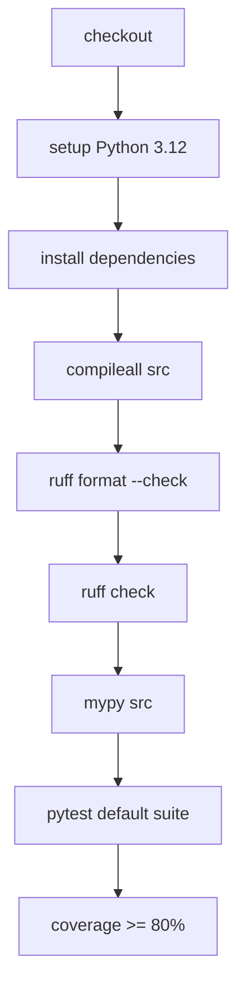
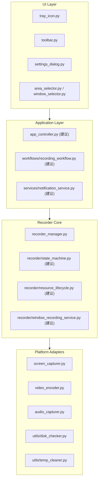
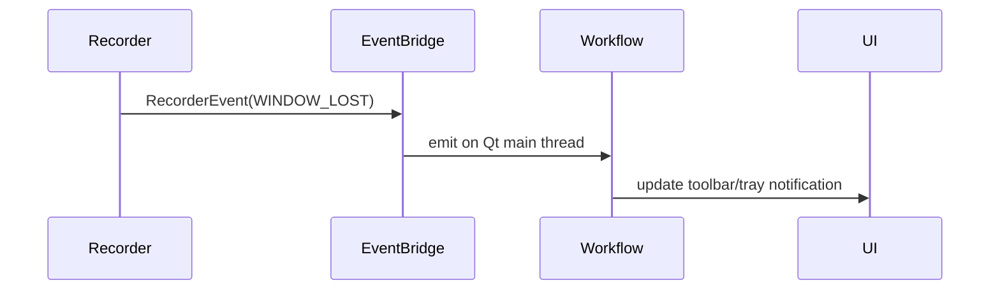
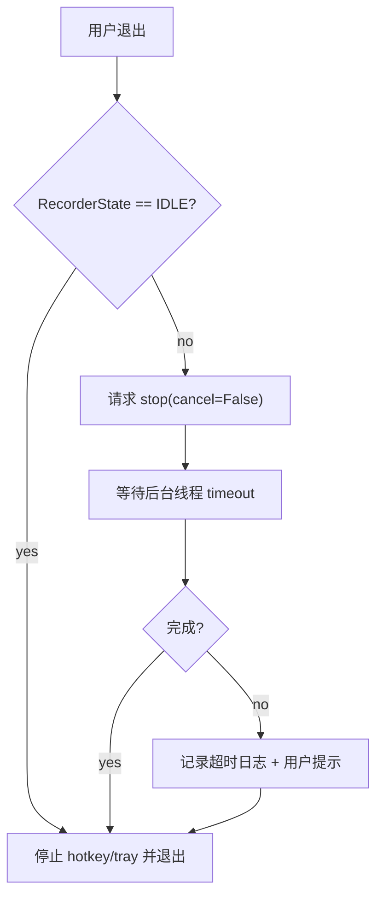
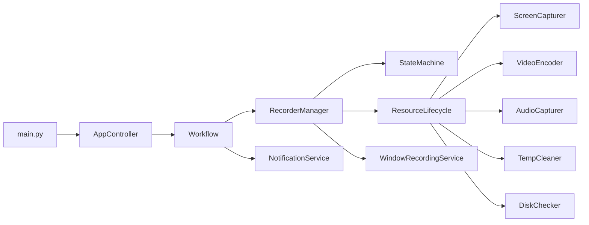

# QuickRec v1.4 详细技术设计文档

> 版本: v1.4
> 创建时间: 2026-07-04
> 状态: 已完成 / 待发布
> 前置版本: v1.3（详见 Tec-design-v1.3.md）

---

## 1. 版本概述

### 1.1 v1.4 新增/变更目标清单

v1.4 是稳定性与工程化大型优化版本，不新增用户可见功能。目标是在 v1.3 已有能力基础上，补齐测试、CI、架构边界、异常路径和发布质量。当前实现已完成并通过发布前验证。

| 编号 | 目标 | 说明 | PRD 编号 |
|-----|------|------|---------|
| Q1 | 测试基线修复 | 默认测试恢复全绿：`175 passed / 23 deselected`；区分默认测试、UI 测试、硬件/系统集成测试 | Q1 |
| Q2 | 工程化配置 | 新增统一 `pyproject.toml`，固化 pytest、coverage、ruff、mypy 配置 | Q2 |
| Q3 | GitHub Actions CI | CI 执行 compile、lint、mypy、默认测试和 coverage，失败时阻断合并 | Q3 |
| Q4 | 架构解耦 | 拆分 `main.py` 与 `recorder_manager.py` 的职责，建立更清晰的应用、工作流、状态机、服务边界 | Q4 |
| Q5 | 公共事件接口 | 录制状态、保存完成、保存失败、窗口丢失、录制失败等必须通过公开接口传递 | Q5 |
| Q6 | 运行时稳定性 | 补齐 FFmpeg、临时文件、系统计时器、磁盘监控、退出流程、特殊窗口、连续录制等异常路径 | Q6 |
| Q7 | 发布质量 | PyInstaller 打包可复现，冒烟验证可执行；稳定性优先恢复 cv2，体积记录为 `257.74MB` | Q7 |

**关键设计决策**：

1. **先工程基线，后架构重构**：M1 修复测试基线，M2 固化自动化质量门槛，M3 再做架构解耦，M4 用运行时稳定性和发布验证收口。
2. **测试分层**：pytest marker 固定为 `unit`、`ui`、`hardware`、`packaging`。默认 CI 不依赖真实桌面硬件能力，硬件相关测试单独运行。
3. **类型检查工具**：v1.4 指定使用 `mypy`，先覆盖核心模块，允许按阶段收紧。
4. **CI 平台**：指定 GitHub Actions。
5. **架构拆分为建议方案**：文档列出建议文件名和模块边界，实现时可根据代码实际调整，但必须满足边界和验收要求。
6. **打包体积目标调整为稳定性优先**：曾尝试移除 cv2 达到 `186.36MB`，但 dxcam 默认捕获链路依赖 cv2；最终恢复 OpenCV，排除 `opencv_videoio_ffmpeg*.dll`，发布体积记录为 `257.74MB`。

### 1.2 v1.4 不包含

- 录制历史管理窗口。
- 多显示器录制选择。
- 编码参数 UI（CRF / preset）和高级用户设置。
- 视频剪辑、拼接、裁剪等后处理功能。
- 外置 FFmpeg。
- 替换 OpenCV、Qt、FFmpeg 等核心依赖来达成体积目标。
- 新增特殊窗口录制兼容能力；v1.4 只要求失败稳定、提示清晰、日志可诊断、不崩溃。

---

## 2. 模块设计

### 2.1 测试基线设计 — 更新

**职责**：恢复可可信的测试基线，为后续架构解耦提供回归保护。

**现状问题**：

| 问题 | 现象 | 处理方向 |
|-----|------|---------|
| VideoEncoder 旧接口测试 | 旧测试按 3 参数构造，v1.3 实现已要求 `ffmpeg_path` | 更新夹具，增加 FFmpeg 路径缺失、启动失败、编码失败测试 |
| RecorderManager stop 语义漂移 | 旧测试期待 `stop()` 同步返回 mp4，现实现为异步停止 | 明确异步契约，测试状态变化和 on_saved 回调 |
| ScreenCapturer 生命周期测试漂移 | 旧测试未显式 `start()` 即 `capture_frame()` | 拆分生命周期单测和真实 dxcam 捕获测试 |
| 硬件依赖未隔离 | dxcam / 音频 / Windows 桌面能力影响默认测试稳定性 | 使用 marker 隔离 `hardware` 测试 |

**pytest marker 设计**：

```toml
[tool.pytest.ini_options]
markers = [
  "unit: pure logic tests without Qt, hardware, or subprocess side effects",
  "ui: tests that require QApplication or PyQt widgets",
  "hardware: tests that require Windows desktop, dxcam, audio device, or real screen capture",
  "packaging: PyInstaller/package smoke tests",
]
```

**测试目录治理规则**：

1. 测试文件不再逐个手写 `sys.path.insert(0, ...)`；统一由 `pyproject.toml` 或测试运行入口处理。
2. 默认测试集只包含稳定、可重复、无需真实桌面设备的测试。
3. 真实 dxcam、音频设备、托盘、全局快捷键、PyInstaller 产物验证必须使用 marker 标识。
4. 对 FFmpeg、dxcam、pyaudio、soundcard、pystray 等外部依赖优先使用 mock/fake 测试核心状态流。
5. 测试名称必须表达行为，例如 `test_stop_transitions_to_saving_then_idle`，避免只表达实现细节。

默认测试命令建议：

```bash
python -m pytest -m "not hardware and not packaging"
```

硬件测试命令建议：

```bash
python -m pytest -m hardware
```

覆盖率目标：

```bash
python -m pytest -m "not hardware and not packaging" --cov=src --cov-report=term-missing --cov-fail-under=80
```

**测试夹具建议**：

```python
@pytest.fixture
def fake_config(tmp_path):
    config = ConfigManager.__new__(ConfigManager)
    config.config_path = tmp_path / "config.json"
    config._config = {
        **ConfigManager.defaults,
        "save_path": str(tmp_path),
        "quality": "low",
        "fps": 30,
        "audio_source": "none",
    }
    return config


@pytest.fixture
def fake_ffmpeg(tmp_path):
    exe = tmp_path / "ffmpeg.exe"
    exe.write_text("", encoding="utf-8")
    return str(exe)
```

**VideoEncoder 测试边界**：

| 用例 | 类型 | 说明 |
|-----|------|------|
| 构造命令参数 | unit | mock `subprocess.Popen`，验证 `rawvideo/bgr24/libx264/CRF/preset` |
| FFmpeg 路径缺失 | unit | 期望抛出可诊断异常或返回明确失败 |
| pipe 断开 | unit | mock stdin write 抛 BrokenPipeError，`write_frame()` 返回 False |
| 真实编码 | hardware | 写入少量帧，验证输出 MP4 可读 |

**RecorderManager 异步 stop 测试边界**：



`stop()` 不再被测试为同步返回最终路径；测试应等待状态或回调事件，而不是假设文件立即存在。

### 2.2 工程化配置设计 — 新增

**职责**：集中管理测试、格式化、lint、类型检查、覆盖率配置，避免散落在命令行和测试文件中。

**建议文件**：`pyproject.toml`

**配置范围**：

| 工具 | 用途 | v1.4 要求 |
|-----|------|----------|
| pytest | 测试发现、marker、默认过滤 | 明确 marker，统一测试路径 |
| coverage / pytest-cov | 覆盖率统计 | 总覆盖率 `>= 80%` |
| ruff | lint + format | CI 必跑 |
| mypy | 类型检查 | 先覆盖核心模块，按阶段收紧 |

**导入路径要求**：

测试不应长期依赖每个文件内的 `sys.path.insert(0, ...)`。v1.4 应通过工程配置或包结构统一解决 `src` 导入路径，测试文件只表达测试意图。

**建议配置草案**：

```toml
[tool.pytest.ini_options]
testpaths = ["tests"]
pythonpath = ["src"]
addopts = "-ra"
markers = [
  "unit: pure logic tests",
  "ui: PyQt widget tests",
  "hardware: Windows desktop/audio/dxcam tests",
  "packaging: PyInstaller/package smoke tests",
]

[tool.coverage.run]
source = ["src"]
branch = true
omit = [
  "src/rthook_dllpath.py",
]

[tool.coverage.report]
show_missing = true
fail_under = 80

[tool.ruff]
target-version = "py312"
line-length = 100

[tool.ruff.lint]
select = ["E", "F", "I", "B", "UP"]

[tool.mypy]
python_version = "3.12"
ignore_missing_imports = true
warn_unused_ignores = true
no_implicit_optional = true
```

**ruff 收紧策略**：

- M2 阶段先保证新增配置可运行。
- 对历史代码可先采用局部忽略或较小规则集。
- 架构拆分后的新增模块必须按新规则编写。
- 不为了 lint 大规模改动无关 UI 样式代码。

### 2.3 GitHub Actions CI 设计 — 新增

**职责**：将 v1.4 质量门槛自动化，保证默认分支可重复验证。

**建议文件**：`.github/workflows/ci.yml`

**CI 阶段**：



**默认 CI 不包含**：

- 真实 dxcam 屏幕捕获。
- 真实音频设备捕获。
- PyInstaller 完整打包。

这些能力通过 `hardware` / `packaging` marker 和发布前 checklist 验证。

**CI 配置草案**：

```yaml
name: CI

on:
  push:
    branches: [master]
  pull_request:

jobs:
  test:
    runs-on: windows-latest
    steps:
      - uses: actions/checkout@v4
      - uses: actions/setup-python@v5
        with:
          python-version: "3.12"
      - name: Install dependencies
        run: |
          python -m pip install --upgrade pip
          python -m pip install -r requirements.txt
          python -m pip install pytest-cov ruff mypy
      - name: Compile
        run: python -m compileall -q src
      - name: Ruff format
        run: python -m ruff format --check .
      - name: Ruff lint
        run: python -m ruff check .
      - name: Mypy
        run: python -m mypy src
      - name: Tests
        run: python -m pytest -m "not hardware and not packaging" --cov=src --cov-report=term-missing --cov-fail-under=80
```

**CI 成功标准**：

- 所有步骤返回 0。
- 默认测试不依赖真实屏幕录制、系统声音设备或托盘交互。
- 失败日志能定位到 compile / lint / type / test / coverage 的具体阶段。

### 2.4 架构解耦设计 — 重构

**职责**：降低 `main.py` 和 `recorder_manager.py` 的职责集中度，明确 UI、录制工作流、录制引擎、平台适配层之间的边界。

**目标架构**：



**建议模块边界**：

| 建议模块 | 职责 | 说明 |
|---------|------|------|
| `app_controller.py` | Qt 应用生命周期、启动、退出收尾 | 可从 `main.py` 拆出 |
| `workflows/recording_workflow.py` | 全屏/区域/窗口录制流程编排，倒计时、暂停、停止、保存结果 | 可复用三种录制模式状态流 |
| `services/notification_service.py` | 托盘通知、错误提示、保存完成提示 | 统一用户提示文案 |
| `recorder/state_machine.py` | RecorderState 合法转移 | 可纯单元测试 |
| `recorder/resource_lifecycle.py` | dxcam、FFmpeg、音频、临时目录、系统计时器生命周期 | 连续录制和退出稳定性核心 |
| `recorder/window_recording_service.py` | 窗口句柄、窗口区域、窗口丢失和特殊窗口失败判断 | 降低 `RecorderManager` 体积 |

**强制边界要求**：

- UI 层不得访问 recorder 私有字段，例如 `_window_lost_bridge`。
- 状态变化、保存完成、保存失败、窗口丢失、录制失败必须通过公开事件、回调或信号接口传递。
- `RecorderManager` 应更偏向录制引擎门面，而不是同时承担所有状态机、资源管理和 UI 事件转发。

**建议类职责草案**：

```python
class AppController:
    """应用生命周期协调器。

    负责 QApplication、托盘、快捷键、设置窗口和退出流程的装配。
    不直接处理录制细节。
    """

    def start(self) -> int: ...
    def request_exit(self) -> None: ...


class RecordingWorkflow:
    """录制流程编排器。

    负责全屏/区域/窗口录制入口、倒计时、暂停、停止、取消和结果处理。
    """

    def start_fullscreen(self) -> None: ...
    def start_region(self, region: tuple[int, int, int, int]) -> None: ...
    def start_window(self, hwnd: int) -> None: ...
    def pause_resume(self) -> None: ...
    def stop(self, cancel: bool = False) -> None: ...


class RecorderStateMachine:
    """录制状态机。只处理状态转移，不操作 UI 和外部资源。"""

    def can_start(self) -> bool: ...
    def transition(self, event: str) -> RecorderState: ...
```

**拆分顺序建议**：

1. 先提取纯逻辑状态机，测试成本最低。
2. 再提取通知服务，不改变录制核心行为。
3. 再提取录制工作流，替换 `main.py` 中重复流程。
4. 最后收窄 `RecorderManager`，拆资源生命周期和窗口录制服务。

### 2.5 公共事件接口设计 — 新增

**职责**：为 UI 和录制核心之间建立稳定契约。

**建议事件**：

| 事件 | 参数 | 触发时机 |
|-----|------|---------|
| `state_changed` | old_state, new_state | 录制状态转移 |
| `recording_saved` | output_path, file_size_mb | 最终 MP4 保存成功 |
| `recording_failed` | reason, detail | 捕获、编码、混流、保存失败 |
| `window_lost` | reason | 目标窗口关闭或最小化 |
| `disk_warning` | free_mb, level | 录制前或录制中磁盘空间不足 |

事件实现可继续使用 PyQt `pyqtSignal`，也可在核心层使用回调/轻量事件对象，再由 Qt 桥接到主线程。具体实现留给开发阶段决定。

**事件对象草案**：

```python
from dataclasses import dataclass
from enum import Enum


class RecorderEventType(Enum):
    STATE_CHANGED = "state_changed"
    RECORDING_SAVED = "recording_saved"
    RECORDING_FAILED = "recording_failed"
    WINDOW_LOST = "window_lost"
    DISK_WARNING = "disk_warning"


@dataclass(frozen=True)
class RecorderEvent:
    type: RecorderEventType
    payload: dict
```

**Qt 桥接原则**：

- recorder 核心可以产生普通 Python 事件。
- Qt 层通过 bridge 将事件转发到主线程。
- UI 只订阅公开事件，不读取 recorder 私有字段。



### 2.6 运行时稳定性设计 — 更新

**职责**：让异常路径有清晰、可诊断、可恢复的行为。

| 场景 | v1.4 设计要求 | 验收 |
|-----|--------------|------|
| FFmpeg 路径为空或不可执行 | 启动录制前明确失败，提示用户并写日志 | 不在线程中静默崩溃 |
| FFmpeg 启动失败 | 捕获异常，触发 `recording_failed` | UI 收到失败提示 |
| FFmpeg 编码中断 | `write_frame` 返回失败后停止录制并进入失败/保存失败路径 | 不产生卡死线程 |
| `cleanup_stale()` | 应在应用启动流程中真实调用 | 崩溃残留 session 可被清理 |
| `timeBeginPeriod(1)` | 与 `timeEndPeriod(1)` 配对 | 退出后释放系统计时器设置 |
| 录制中磁盘空间不足 | 周期性检查保存磁盘空间，低于阈值提示或停止保存 | 不等到最终 move 才失败 |
| 退出流程 | 等待后台线程，超时后记录并提示 | 不无限卡退出 |
| 连续录制 | 至少连续 3 轮录制无资源锁死 | 自动或手工冒烟通过 |
| 特殊窗口失败 | 明确提示不可录制原因 | 不崩溃、不长时间阻塞主线程 |

**FFmpeg 启动前检查伪代码**：

```python
def validate_encoder(ffmpeg_path: str) -> tuple[bool, str]:
    if not ffmpeg_path:
        return False, "FFmpeg 路径为空"
    if not os.path.isfile(ffmpeg_path):
        return False, f"FFmpeg 不存在: {ffmpeg_path}"
    return True, ""
```

**录制中磁盘监控伪代码**：

```python
class DiskSpaceMonitor:
    def __init__(self, save_path: str, interval_sec: int = 30):
        self._save_path = save_path
        self._interval_sec = interval_sec

    def check(self) -> tuple[str, int]:
        status, free_mb = DiskChecker.check_before_recording(self._save_path)
        return status, free_mb
```

磁盘持续监控不要求每帧检查，建议以低频定时器或录制循环节流检查实现，避免明显 IO 开销。

**退出流程设计**：



### 2.7 打包体积与发布验证设计 — 优化

**职责**：让打包可复现、产物可冒烟、体积有记录。

**目标**：PyInstaller 产物可复现、可启动、可验收，并记录体积构成。

**约束**：

- 不外置 FFmpeg。
- 不替换核心依赖。
- 不为了体积破坏全屏、区域、窗口录制、托盘、设置、音频等现有能力。

**可尝试方向**：

- PyInstaller excludes 精细化。
- 不必要资源和插件裁剪。
- UPX / strip 配置评估。
- 打包产物体积构成记录。

发布文档必须记录：

- 当前体积。
- 主要体积构成。
- 已尝试的优化项。
- 未达成原因。
- 后续可选方案。

**体积记录格式建议**：

| 项目 | 大小 | 说明 |
|-----|------|------|
| dist/QuickRec 总大小 | 257.74MB | 稳定性优先，保留 cv2 |
| FFmpeg | 94.67MB | 不允许外置 |
| OpenCV / cv2 | 71.38MB | dxcam 默认 processor 依赖 |
| NumPy / numpy.libs | 25.83MB | OpenCV / dxcam 依赖 |
| Qt / PyQt5 | 35.91MB | UI 必需 |
| 其他 | 约 30MB | PIL、pystray、soundcard、Python runtime 等 |

发布时体积目标按稳定性优先收口。后续 lite 分支可重新评估更小 FFmpeg 构建、opencv-python-headless 或替换捕获后端，但不进入 v1.4 发布范围。

---

## 3. 新增依赖

### 3.1 运行时依赖

无新增运行时依赖。

### 3.2 开发依赖

| 依赖 | 用途 | 说明 |
-----|------|------|
| pytest-cov | 覆盖率统计 | 用于 `>= 80%` 门槛 |
| ruff | lint + format | CI 必跑 |
| mypy | 类型检查 | 先覆盖核心模块 |

---

## 4. 项目架构更新

### 4.1 目录结构变化（建议）

```text
QuickRec/
├── .github/
│   └── workflows/
│       └── ci.yml                 # v1.4 新增：GitHub Actions
├── pyproject.toml                 # v1.4 新增：工程配置
├── src/
│   ├── main.py                    # 保留入口，职责收窄
│   ├── app_controller.py          # 建议新增：应用生命周期
│   ├── workflows/
│   │   └── recording_workflow.py  # 建议新增：录制流程编排
│   ├── services/
│   │   └── notification_service.py# 建议新增：通知服务
│   └── recorder/
│       ├── recorder_manager.py    # 保留门面，职责收窄
│       ├── state_machine.py       # 建议新增：状态机
│       ├── resource_lifecycle.py  # 建议新增：资源生命周期
│       └── window_recording_service.py # 建议新增：窗口录制服务
└── tests/
    ├── ...                        # 现有测试更新 marker 和夹具
```

> 上述文件名为建议方案，实际实现可调整；但职责边界和验收目标不可省略。

### 4.2 模块依赖关系更新



---

## 5. 模块测试计划

| 测试层 | marker | 覆盖内容 | CI 默认 |
|-------|--------|----------|--------|
| 纯逻辑测试 | `unit` | 配置、文件命名、状态机、磁盘判断、事件接口 | 是 |
| UI 测试 | `ui` | Toolbar、SettingsDialog、Selector 信号和基础状态 | 是，需 headless Qt 配置 |
| 硬件/系统测试 | `hardware` | dxcam、真实屏幕捕获、音频设备、全局快捷键 | 否 |
| 打包测试 | `packaging` | PyInstaller 构建和产物冒烟 | 否，发布前运行 |

v1.4 完成时默认测试必须全绿，coverage 总覆盖率必须 `>= 80%`。

---

## 6. 开发里程碑

| 阶段 | 目标 | 完成标准 |
|-----|------|---------|
| M1 | 工程基线修复 | 默认 pytest 全绿；marker 生效；coverage 接入 |
| M2 | CI / Lint / 类型检查 | GitHub Actions 跑通 compile、ruff、mypy、pytest、coverage |
| M3 | 架构解耦 | 核心职责拆分完成；UI 不再访问 recorder 私有字段；事件接口明确 |
| M4 | 运行时稳定性与发布收口 | 异常路径可诊断；连续录制通过；打包冒烟完成；体积有记录 |

---

## 7. 风险与应对

| 风险 | 影响 | 应对 |
|-----|------|------|
| 测试修复范围扩大 | M1 时间变长 | 先修默认测试，再隔离 hardware/packaging |
| mypy 初期噪音较多 | 类型检查难以一次性全绿 | 先覆盖核心模块，配置允许逐步收紧 |
| 架构解耦引入回归 | 影响已有录制流程 | M1/M2 先建立回归网，M3 小步拆分 |
| GitHub Actions 无真实桌面 | 无法覆盖 dxcam / 音频 / 托盘完整行为 | 硬件和打包测试通过 marker 与发布 checklist 执行 |
| 打包体积 `< 200MB` 无法达成 | 影响原体积目标 | 已改为稳定性优先；记录体积构成，恢复 cv2，继续排除 OpenCV videoio ffmpeg |
| 特殊窗口不可录制 | 用户仍可能遇到失败 | v1.4 不承诺新增兼容，只保证提示稳定、不崩溃、日志可诊断 |
