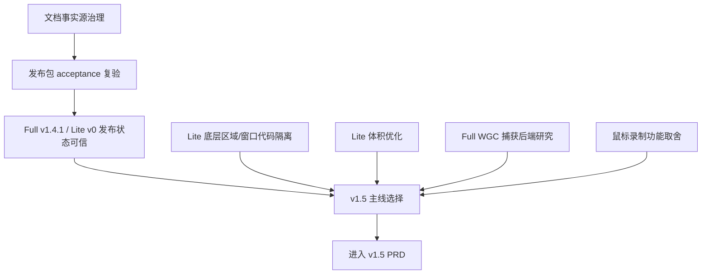

# /idea 需求池 - 2026-07-09

## 总体判断

本需求池来源于 QuickRec Full / Lite 拆分后的 project review。当前证据主要来自本地仓库文件、README、`doc/current.md`、release notes、progress、dev plan、verification、代码扫描、发布产物路径和 Git 分支/tag 状态。

## 2026-07-10 后续确认

用户已对 IDEA-006 和 IDEA-007 的关键边界做出补充确认：

- IDEA-006 中“鼠标录制功能全面砍掉”具体指 **自绘光标**，不包含鼠标点击高亮；Full v1.5 中鼠标点击高亮保留。
- IDEA-007 的 v1.5 主线按 **QuickRec Full 产品未来演进目标** 推进，版本方向收敛为“Full 捕获体验与创作者工作台地基版”。
- Full 工作台第一步选择 **录制历史 / 素材入库**。
- WGC / 新捕获后端在 v1.5 只作为技术研究 spike，不替换默认捕获链路。
- 已据此新建 `doc/releases/v1.5/`，并输出 `prd.md` 方案收敛版。

下方原始压力测试保留为 2026-07-09 的需求池判断记录，其中“待澄清”状态以本节后续确认为准。

本轮不直接写 PRD，也不把 review 发现直接当成确定需求。结论上：

- **应该直接修文档**：文档事实源治理，尤其是 Full 当前分支口径修正提交、Lite `progress.md` 拆分后状态修正。
- **应该进入 /acceptance**：Full v1.4.1 / Lite v0 发布包复验。发布包是否“最终可发布”必须靠实际 GUI、日志和产物证据，不应在 `/idea` 阶段判定。
- **值得继续验证**：Lite 底层区域/窗口代码隔离、Lite 体积优化、Full 新捕获后端研究。
- **信息不足，不应直接推进**：QuickRec Full / Lite 鼠标录制功能全面砍掉、QuickRec v1.5 需求落地。两者都需要先明确目标和边界，否则很容易把“想法”误写成大范围需求。

## 当前版本主线判断

### Full

- 当前工作区：`E:\codex\QuickRec`
- 当前分支：`master`
- 当前发布点：`v1.4.1`
- 当前能力重点：v1.4 稳定性基线 + v1.4.1 诊断导出能力
- 当前最该保护：录制主链路、诊断导出、发布文档事实一致性

### Lite

- 当前工作区：`E:\codex\QuickRec-Lite`
- 当前分支：`lite-master`
- 当前发布点：`lite-v0`
- 当前能力重点：全屏录制、原生分辨率、60fps、四种音频模式
- 当前最该保护：轻量边界、用户入口裁剪、不要重新混入 Full 能力

## 为什么不是直接进入 v1.5 PRD

当前候选点里既有文档治理、发布验收、Lite 维护债，也有 Full 捕获后端研究和鼠标录制取舍。它们不是同一类需求，不能直接塞进一个 v1.5 PRD。v1.5 需要先选主线，例如：

- 稳定性与发布治理版；
- Full 捕获体验研究版；
- Lite 维护与体积收敛版；
- 鼠标/光标能力裁剪版；
- 或 Full / Lite 同步文档和质量门槛治理版。

没有主线前，v1.5 只能作为候选方向，不应直接落地开发。

## 需求总览

| ID | 原始需求 | 类型 | 证据等级 | 价值判断 | 当前阶段 | 压力测试分数 | 结论 | 最小下一步 |
| --- | --- | --- | --- | --- | --- | ---: | --- | --- |
| IDEA-001 | Lite 是否需要隔离或删除区域/窗口录制底层代码 | 技术债 / 产品边界 | 中 | 待验证偏中价值 | Lite v0 后维护期 | 28/40 | 继续验证 | 做保留、隔离、删除三案对比 |
| IDEA-002 | Lite 打包体积是否继续优化 | 工程优化 / 产品气质 | 中 | 中价值但不阻断 | Lite v0.1+ | 26/40 | 继续验证 | 保留体积报告，做可逆体积实验 |
| IDEA-003 | Full 是否研究 WGC 等新捕获后端 | 技术研究 / 稳定性 | 中 | 待验证偏中价值 | Full 后续研究期 | 25/40 | 继续验证 | 写捕获后端 research brief，不直接改主链路 |
| IDEA-004 | 文档事实源治理是否需要规则化 | 文档治理 / 交接效率 | 强 | 高价值 | 立即可做 | 34/40 | 直接修文档 | 修正 Full/Lite 当前事实源和 checklist |
| IDEA-005 | Full v1.4.1 / Lite v0 是否需要再次进入发布包 acceptance 复验 | 发布验收 / 信任 | 强 | 高价值 | 发布前收口 | 33/40 | 进入 /acceptance | 用打包产物实际验证并补证据 |
| IDEA-006 | QuickRec Full / Lite 鼠标录制功能全面砍掉 | 方案 / 功能裁剪 | 弱 | 信息不足 | 待澄清 | 18/40 | 先澄清，不进入 PRD | 确认“鼠标录制”具体指什么 |
| IDEA-007 | 继续推动 QuickRec v1.5 的需求进行落地 | 版本目标 / 方案集合 | 弱-中 | 信息不足但值得收敛 | 版本规划前置 | 24/40 | 先做版本主线选择 | 先确认 v1.5 主线，再进入 /prd |

## 依赖关系



## 三档范围方案

| 方案 | 范围 | 适用情况 | 判断 |
| --- | --- | --- | --- |
| 最小方案 | 只修文档事实源 + 做 Full/Lite 发布包复验 | 当前最稳，能马上减少接手混乱和发布风险 | 推荐先做 |
| 推荐方案 | 最小方案 + 进入 `/idea` 后选择一个 v1.5 主线 | 需要继续推进 v1.5，但不想把范围失控 | 推荐 |
| 过大方案 | 同时做 Lite 底层删除、体积优化、WGC、鼠标全面砍掉、v1.5 PRD | 风险大，多个方向互相抢资源 | 不建议 |

## 需求详情

### IDEA-001 Lite 是否需要隔离或删除区域/窗口录制底层代码

- 原始输入：Lite 是否需要隔离或删除区域/窗口录制底层代码。
- 输入类型：技术债 / 产品边界 / 方案。
- 产品问题：Lite 当前用户可见能力只保留全屏录制，但底层仍保留区域/窗口录制代码。真正问题不是“代码存在”，而是它是否会造成 Lite 后续维护混淆、入口误回归、测试负担、体积优化受阻。
- 证据盘点：
  - `E:\codex\QuickRec-Lite\README.md` 和 `doc/current.md` 明确 Lite v0 不包含区域录制、窗口录制。
  - 代码扫描显示 Lite 仍有 `src/main.py` 的 `_on_start_region` / `_on_start_window`、`src/ui/tray_icon.py` 的区域/窗口信号桥、`src/recorder/recorder_manager.py` 的窗口/区域相关底层。
  - `tests/test_tray_icon.py` 和 `tests/test_settings_dialog.py` 验证用户入口被隐藏。
  - 反证：Lite v0 文档明确“暂不删除底层代码，只移除用户可见入口”，这是为了降低拆分初期回归风险。
- 证据等级：中。能证明底层残留存在，也能证明入口被隐藏；但没有证据证明它已经造成真实 bug。
- 价值判断：待验证偏中价值。
- 当前阶段：Lite v0 后维护期，适合做技术方案评估，不适合直接删除。

#### 压力测试

| 维度 | 分数 | 证据/理由 |
| --- | ---: | --- |
| 用户痛点强度 | 3 | 用户不会直接看到底层代码，但可能间接受入口误回归或体积影响。 |
| 目标用户/场景清晰度 | 4 | 目标是 Lite 维护者和未来 Lite 用户，场景是 Lite v0.1 继续迭代。 |
| 证据强度 | 3 | 有代码与文档证据，但缺少真实事故。 |
| 频率/紧迫性 | 3 | 每次 Lite 迭代都可能遇到，但当前不阻塞使用。 |
| 核心目标贡献 | 4 | 直接服务 Lite 轻量边界。 |
| 差异化/替代方案 | 3 | 可以先做隔离或测试约束，不必直接删除。 |
| 成本可控性 | 3 | 隔离成本可控；直接删除可能牵连测试和底层状态机。 |
| 验证速度 | 5 | 可通过导入扫描、入口测试、打包体积对比快速验证。 |

总分：28/40，部分通过。证据强度 3 分，允许继续验证；成本可控性 3 分，不建议直接删除。

- 结论：继续验证。
- 最小下一步：做三案对比。
  - A. 保留底层代码，只加强入口不可见测试。
  - B. 将区域/窗口入口和底层导入隔离为 Full-only。
  - C. Lite 分支删除区域/窗口底层代码。
- 进入 PRD 条件：确认选择 B 或 C，并明确影响文件、回滚方式、必须测试范围。

### IDEA-002 Lite 打包体积是否继续优化

- 原始输入：Lite 打包体积是否继续优化。
- 输入类型：工程优化 / 产品气质 / 技术债。
- 产品问题：Lite 定位轻量，但当前打包产物约 257.89MB，与 Full 约 257.82MB 接近。问题不是体积数字本身，而是 Lite 的轻量定位是否需要在分发体积和依赖数量上体现。
- 证据盘点：
  - `dist/QuickRec` 体积扫描显示 Lite 产物约 257.89MB。
  - Lite release notes 写明体积低于 200MB 是目标，但不作为 Lite v0 阻断项。
  - 过往已有 FFmpeg/UPX/headless 体积实验记录，但未进入稳定包。
  - 反证：体积优化可能引入杀软误报、FFmpeg 能力缺失、OpenCV/dxcam 兼容问题。
- 证据等级：中。体积事实明确，但缺少真实用户下载/安装阻力数据。
- 价值判断：中价值，但不阻断当前版本。
- 当前阶段：Lite v0.1+ 可继续做可逆实验。

#### 压力测试

| 维度 | 分数 | 证据/理由 |
| --- | ---: | --- |
| 用户痛点强度 | 3 | 大体积影响下载和“轻量”观感，但当前没有真实用户反馈。 |
| 目标用户/场景清晰度 | 3 | 面向首次下载、分发、更新场景。 |
| 证据强度 | 3 | 有体积数据和历史实验，缺少用户侧数据。 |
| 频率/紧迫性 | 2 | 下载时发生，使用中不高频。 |
| 核心目标贡献 | 4 | 支撑 Lite 产品气质。 |
| 差异化/替代方案 | 3 | 可用文档说明、压缩包、依赖实验替代。 |
| 成本可控性 | 3 | 可做实验，但稳定验证成本不低。 |
| 验证速度 | 5 | 体积、启动、smoke、杀软反馈可快速检查。 |

总分：26/40，部分通过。建议继续验证，不进入阻断型 PRD。

- 结论：继续验证。
- 最小下一步：保留稳定包不动，建立 Lite v0.1 体积实验表，逐项尝试 FFmpeg 变体、PyInstaller exclude、依赖延迟导入，并要求每项必须有启动、全屏录制、四音频模式验证。
- 进入 PRD 条件：确认具体目标，例如“低于 220MB 且不降低录制/音频能力”，否则不要写成强需求。

### IDEA-003 Full 是否研究 WGC 等新捕获后端

- 原始输入：Full 是否研究 WGC 等新捕获后端。
- 输入类型：技术研究 / 稳定性 / 捕获体验。
- 产品问题：Full 当前窗口录制基于现有捕获链路，历史上出现过 4K/窗口移动/鼠标光标异常等问题。WGC 等捕获后端可能改善窗口捕获、光标原生捕获和现代 Windows 兼容性，但会引入新依赖、新兼容性矩阵和重写风险。
- 证据盘点：
  - 过往 review 和测试讨论中有窗口移动画面、鼠标光标异常、4K 场景不可验证等问题。
  - `doc/releases/v1.4/capture-backend-research.md` 已存在捕获后端研究资料。
  - 当前 v1.4.1 已通过验收，不应在发布收口阶段重写捕获链路。
  - 反证：WGC 是否适合当前 Python/PyQt/PyInstaller 体系仍待技术 spike。
- 证据等级：中。问题有历史证据，但新后端价值需要技术验证。
- 价值判断：待验证偏中价值。
- 当前阶段：Full 后续研究期，不适合直接进入开发。

#### 压力测试

| 维度 | 分数 | 证据/理由 |
| --- | ---: | --- |
| 用户痛点强度 | 4 | 窗口录制不可用会影响 Full 核心能力。 |
| 目标用户/场景清晰度 | 4 | Full 用户的窗口录制、教程录制、多窗口工作流。 |
| 证据强度 | 3 | 有历史内部证据，但缺少新后端验证数据。 |
| 频率/紧迫性 | 3 | 对窗口录制用户重要，但不是 Lite 主线。 |
| 核心目标贡献 | 4 | 直接关系 Full 专业能力。 |
| 差异化/替代方案 | 3 | 可先优化现有链路或提供限制说明。 |
| 成本可控性 | 1 | 捕获后端替换风险高，影响面大。 |
| 验证速度 | 3 | 可做 spike，但完整验证需要多设备/多窗口。 |

总分：25/40，部分通过。成本可控性 1 分触发拆小要求，不能直接进入完整 PRD。

- 结论：继续验证。
- 最小下一步：写 research brief 或技术 spike，目标只回答三个问题：
  - WGC 是否能稳定捕获窗口和光标。
  - PyInstaller 后是否可用。
  - 与 dxcam 现有链路如何并存或回退。
- 进入 PRD 条件：spike 证明 WGC 在至少 3 类窗口、2 种 DPI/分辨率、全屏/窗口/音频组合下有明显收益。

### IDEA-004 文档事实源治理是否需要规则化

- 原始输入：文档事实源治理是否需要规则化。
- 输入类型：文档治理 / 交接效率 / 发布治理。
- 产品问题：拆分后已经有 `doc/current.md` 作为事实入口，但仍出现 Full 当前分支修正未提交、Lite `progress.md` 保留开发期旧路径和未完成 checklist 的情况。问题不是文档不够多，而是“哪个文档代表当前事实”仍会漂移。
- 证据盘点：
  - Full 工作区有 3 个未提交文档修正：`README.md`、`doc/current.md`、`doc/releases/v1.4.1/README.md`。
  - Lite `doc/releases/lite-v0/progress.md` 仍写 `doc/lite/**` 旧路径、`lite-test` 待合并、tag 待准备等开发期状态。
  - Full/Lite 当前 README 和 current 已经比较清楚，说明治理方向有效。
- 证据等级：强。事实冲突可从本地文件和 Git status 直接验证。
- 价值判断：高价值。
- 当前阶段：立即可做。

#### 压力测试

| 维度 | 分数 | 证据/理由 |
| --- | ---: | --- |
| 用户痛点强度 | 4 | 直接影响下一次模型和用户判断当前状态。 |
| 目标用户/场景清晰度 | 5 | 目标是项目维护者和后续 agent，场景是接手、发布、规划。 |
| 证据强度 | 5 | 有明确文件和状态证据。 |
| 频率/紧迫性 | 4 | 每次跨线程/跨工作区都会用到。 |
| 核心目标贡献 | 4 | 支撑 Full/Lite 拆分后的长期维护。 |
| 差异化/替代方案 | 4 | 可以用 current + release README + checklist 最小治理。 |
| 成本可控性 | 4 | 主要是文档修正和规则，不改业务代码。 |
| 验证速度 | 4 | 可用 rg、git status、人工阅读快速验证。 |

总分：34/40，通过。

- 结论：直接修文档。
- 最小下一步：
  - 提交 Full 当前分支文档修正。
  - 修正 Lite `progress.md` 顶部状态和旧路径说明，将开发期 checklist 标注为历史执行记录。
  - 增加一个轻量“事实源检查清单”：README、current、release README、progress、tag、branch、dist 路径必须一致。

### IDEA-005 Full v1.4.1 / Lite v0 是否需要再次进入发布包 acceptance 复验

- 原始输入：Full v1.4.1 / Lite v0 是否需要再次进入发布包 acceptance 复验。
- 输入类型：发布验收 / 质量门槛 / 信任。
- 产品问题：文档显示 Full v1.4.1 和 Lite v0 都已有验收记录和发布包，但本轮 `/review` 和 `/idea` 没有实际启动 exe。若要给“最终可发布”结论，必须基于真实打包产物、GUI、日志和输出文件证据。
- 证据盘点：
  - Full `doc/releases/v1.4.1/progress.md` 和 `acceptance-checklist.md` 显示通过 / 可发布。
  - Lite `release-notes.md` 和 `test-cases.md` 显示打包产物启动、全屏录制、四音频模式通过。
  - `dist/QuickRec/QuickRec.exe` 在 Full 和 Lite 两个工作区均存在。
  - 反证：当前回合未实际启动 exe，不能替代 acceptance。
- 证据等级：强。是否需要 acceptance 的判断来自发布流程本身和本地路径证据。
- 价值判断：高价值。
- 当前阶段：发布前收口。

#### 压力测试

| 维度 | 分数 | 证据/理由 |
| --- | ---: | --- |
| 用户痛点强度 | 5 | 发布包不可用会直接破坏信任。 |
| 目标用户/场景清晰度 | 5 | 发布前最终确认。 |
| 证据强度 | 4 | 有文档和产物路径证据；缺少本轮实际运行证据。 |
| 频率/紧迫性 | 5 | 每次发布前都需要。 |
| 核心目标贡献 | 5 | 直接支撑发布可信度。 |
| 差异化/替代方案 | 4 | 可按最小清单复验，不必全量重测。 |
| 成本可控性 | 3 | GUI 和音频验证有成本，但可拆最小范围。 |
| 验证速度 | 2 | 需要实际桌面、音频、日志和文件证据，不能纯文档判断。 |

总分：33/40，通过。验证速度较低，但这正是 `/acceptance` 的职责。

- 结论：进入 `/acceptance`。
- 最小下一步：对 Full 和 Lite 分别做最小发布包复验。
  - Full：启动、托盘、诊断入口、导出诊断、全屏/区域/窗口、四音频模式、异常诊断。
  - Lite：启动、托盘、设置页裁剪、全屏录制、四音频模式、确认无区域/窗口入口。

### IDEA-006 QuickRec Full / Lite 鼠标录制功能全面砍掉

- 原始输入：QuickRec Full / Lite 鼠标录制功能全面砍掉。
- 输入类型：方案 / 功能裁剪 / 可能的体验修复。
- 产品问题：当前表达存在歧义。“鼠标录制功能”可能指：
  - 鼠标点击高亮；
  - 录制画面里的系统光标；
  - 窗口录制里的光标叠加/替换素材；
  - 所有与鼠标可视化相关的能力。
- 证据盘点：
  - 历史对话中，窗口录制曾出现鼠标比例不对、大鼠标闪现等问题。
  - Lite v0 已移除鼠标点击高亮入口，并在设置保存中强制 `mouse_highlight=False`。
  - Full 仍有 `src/ui/click_highlighter.py` 和 `mouse_highlight` 配置。
  - 反证：录屏工具通常需要显示系统光标，全面砍掉可能降低教程录制可用性。
- 证据等级：弱。能证明“鼠标相关能力曾有问题”，但不能证明“所有鼠标录制都应该全面砍掉”。
- 价值判断：信息不足。
- 当前阶段：待澄清。

#### 压力测试

| 维度 | 分数 | 证据/理由 |
| --- | ---: | --- |
| 用户痛点强度 | 3 | 鼠标异常会严重影响观感，但如果砍掉系统光标也可能损害教程录制。 |
| 目标用户/场景清晰度 | 2 | 未明确是 Full、Lite、窗口录制、点击高亮还是所有鼠标可视化。 |
| 证据强度 | 2 | 主要来自历史内部反馈，没有当前复验证据。 |
| 频率/紧迫性 | 2 | 不清楚当前版本是否仍复现。 |
| 核心目标贡献 | 2 | 对 Lite 可能是减负，对 Full 可能伤害功能完整性。 |
| 差异化/替代方案 | 3 | 更小方案是禁用点击高亮、保留系统光标、暂停自绘光标。 |
| 成本可控性 | 2 | “全面砍掉”影响面不明，可能牵涉配置、UI、录制体验和测试。 |
| 验证速度 | 2 | 需要明确范围后再录制对比。 |

总分：18/40，信息不足。证据强度 2 分触发证据闸门，不能进入 PRD。

- 结论：先澄清，不进入 PRD。
- 必须确认的问题：
  - 这里的“鼠标录制功能”具体指鼠标点击高亮，还是指录制结果里显示系统光标？
  - 是 Full 和 Lite 都砍，还是 Lite 砍、Full 保留？
  - 是否允许保留系统原生光标，但删除自绘高亮/替换素材？
- 临时建议：Lite 继续保持无鼠标高亮；Full 暂不新增鼠标增强功能。是否删除 Full 点击高亮，需要单独确认。

### IDEA-007 继续推动 QuickRec v1.5 的需求进行落地

- 原始输入：继续推动 QuickRecV1.5 的需求进行落地。
- 输入类型：版本目标 / 方案集合 / 路线图前置。
- 产品问题：v1.5 不是一个单需求，而是一个版本容器。当前还没有明确 v1.5 要解决的主问题，因此不能直接写 PRD 或进入实现。
- 证据盘点：
  - 当前 review 产生多个候选方向：文档治理、发布验收、Lite 隔离/体积优化、Full 捕获后端、鼠标能力取舍。
  - Full v1.4.1 与 Lite v0 刚完成拆分，当前更需要先确认发布状态和产品线边界。
  - 反证：若直接推动 v1.5，容易把多个不同性质的事情打包成过大版本。
- 证据等级：弱-中。方向来自项目内部 review，但缺少用户目标、版本主线、优先级确认。
- 价值判断：信息不足但值得收敛。
- 当前阶段：版本规划前置。

#### 压力测试

| 维度 | 分数 | 证据/理由 |
| --- | ---: | --- |
| 用户痛点强度 | 3 | 有多个真实候选问题，但未选主痛点。 |
| 目标用户/场景清晰度 | 2 | v1.5 面向 Full 用户、Lite 用户还是维护者尚未确定。 |
| 证据强度 | 3 | 有项目 review 证据，但缺少用户反馈或版本目标。 |
| 频率/紧迫性 | 3 | 拆分后确实需要下一轮，但不等于马上开发。 |
| 核心目标贡献 | 4 | v1.5 可承接稳定性和体验优化。 |
| 差异化/替代方案 | 3 | 可先做 product brief 或路线图，不必直接 PRD。 |
| 成本可控性 | 2 | 未定范围时成本不可控。 |
| 验证速度 | 4 | 通过一次版本主线选择会很快收敛。 |

总分：24/40，部分通过。成本可控性 2 分触发拆小要求，不能直接落地开发。

- 结论：先做版本主线选择，再进入 `/prd`。
- 最小下一步：从以下 v1.5 主线中选一个：
  - A. Full 稳定性与诊断增强版；
  - B. Full 窗口/光标/捕获体验研究版；
  - C. Lite v0.1 维护与体积收敛版；
  - D. 文档事实源与发布流程治理版；
  - E. Full + Lite 同步质量门槛版。
- 进入 PRD 条件：确认 v1.5 只承接一个主线，最多带 1-2 个支线，不把所有候选点一次塞进版本。

## 最终分流建议

| 去向 | 事项 | 理由 | 最小下一步 |
| --- | --- | --- | --- |
| 现在直接做 | 文档事实源治理 | 证据强、成本低、避免后续 agent 混乱 | 修 Full 3 个文档提交；修 Lite progress 当前状态 |
| 进入 /acceptance | Full v1.4.1 / Lite v0 发布包复验 | 发布可信度必须靠实际产物证据 | 实际启动 exe，检查托盘、录制、音频、诊断或裁剪入口 |
| 继续验证 | Lite 底层区域/窗口代码隔离 | 是真实维护风险，但缺少事故证据 | 做三案对比和导入/体积/测试影响分析 |
| 继续验证 | Lite 体积优化 | 体积目标有意义，但不阻断发布 | 做可逆体积实验，不动稳定包 |
| 继续验证 | Full WGC 新捕获后端 | 可能解决窗口录制问题，但成本高 | 写 research brief / spike |
| 暂不做 | 鼠标录制功能全面砍掉 | 范围不清，可能误伤教程录制核心体验 | 先回答鼠标功能具体指什么 |
| 进入 /prd 前澄清 | QuickRec v1.5 落地 | v1.5 是版本容器，不是单需求 | 先选 v1.5 主线 |

## 需要用户确认的问题

1. “鼠标录制功能全面砍掉”里的鼠标录制具体指什么：点击高亮、自绘光标、系统光标，还是所有鼠标可视化能力？
2. 这件事是否同时影响 Full 和 Lite，还是 Lite 保持无鼠标高亮、Full 保留教程录制需要的系统光标？
3. QuickRec v1.5 想优先解决哪条主线：Full 稳定性、Full 捕获体验、Lite 维护体积、文档发布治理，还是其他方向？

## 下一阶段建议

推荐下一步先做两件小事：

1. 直接修文档事实源：把 Full 当前文档修正提交，并修 Lite `progress.md` 的拆分后状态。
2. 对 v1.5 先做主线确认，不要直接写完整 PRD。

## 可直接发送的下一条提示词

```text
mypm /prd

基于 doc/archive/ideas/mypm-idea-pool-2026-07-09.md，请先进入 v1.5 版本主线收敛阶段，不要直接写完整 PRD。

请先围绕以下候选主线提问并帮助我选择：
1. Full 稳定性与诊断增强版
2. Full 窗口 / 光标 / 捕获体验研究版
3. Lite v0.1 维护与体积收敛版
4. 文档事实源与发布流程治理版
5. Full + Lite 同步质量门槛版

要求：
- 不要猜测我的意图。
- 先问会影响版本范围的关键问题。
- 明确本次 v1.5 不做什么。
- 只有在我确认主线后再写 PRD。
```
