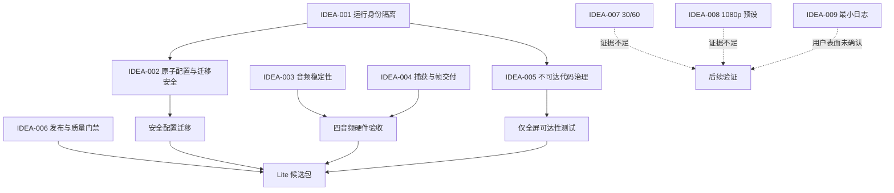

# /idea 需求池：QuickRec Lite v0.1

## 追踪信息

- 当前状态：需求池已完成，等待进入 `/prd` 澄清
- 目标版本：QuickRec Lite v0.1
- 上游来源：`doc/archive/reviews/quickrec-lite-full-backport-review-2026-08-11.md`
- 下游承接：Lite v0.1 PRD
- 当前事实源：`README.md`、`doc/current.md`、`doc/releases/lite-v0/`
- Lite 基线：`lite-test@11874bf`，稳定分支 `lite-master@cfaee3e`，发布点 `lite-v0@c15940e`
- Full 对照：正式基线 `master@42302a3`（v1.9.5），后续工程线 `test@fc312c0`
- 最后更新：2026-08-11

> 本文评分用于暴露证据与取舍，不是统计结论。Review 发现只有经过本需求池分流后，才可能进入正式 PRD。

## 总体判断

- 本次来源：Full/Lite 拆分后的代码、文档、CI 和发布工程对照 Review。
- 本版本唯一产品主线：**Full/Lite 运行身份隔离**。
- 工程支撑一：**录制稳定性白名单回迁**，包含原子配置、音频、捕获停止、帧调度和磁盘估算。
- 工程支撑二：**不可达代码与独立发布门禁治理**，包含区域/窗口代码分阶段删除、固定依赖、Lite 构建事实和增量质量门禁。
- 直接进入 `/prd`：IDEA-001；IDEA-002 至 IDEA-006 只能作为上述两个支撑模块承接，不得升级为多条产品主线。
- 现在直接做：只修文档中的开发分支和最新 CI 事实；业务代码仍等待 PRD。
- 继续验证：IDEA-007、IDEA-008、IDEA-009。
- 暂不做：工作台、素材库、项目、时间线、剪辑、导出队列、Full 诊断中心、区域/窗口录制、120 FPS、高刷新率、WGC、AI、云同步。

### 为什么不是“给 Lite 增加更多 Full 功能”

Lite 的核心价值不是少付出成本就获得 Full，而是以更少入口、更少状态和更低维护负担完成全屏录制。身份冲突、配置假成功、音频选择错误和停止卡住会损害这一核心价值；工作台、素材管理和高级录制模式则会改变它。因此本轮只回迁不会增加用户工作流的可靠性能力。

## 证据映射

| 来源证据 | 对应候选需求 | 证据等级 | 说明 |
| --- | --- | --- | --- |
| `src/config.py:53-57`、`src/utils/temp_cleaner.py:23`、`src/utils/autostart.py:16` | IDEA-001 | 强 | 配置、临时目录和开机启动仍与 Full 同名 |
| `src/ui/tray_icon.py:204-232`、`build_std.spec:163,184` | IDEA-001 | 强 | 通知、托盘和发布包身份仍为 QuickRec |
| `src/config.py:84-92`、`src/ui/settings_dialog.py:234-257` | IDEA-002 | 强 | 保存失败被吞掉，UI 无条件按成功关闭 |
| `src/recorder/audio_capturer.py:165-176,206-223` | IDEA-003 | 强 | loopback 依赖名称匹配，存在错选设备路径 |
| `src/recorder/recorder_manager.py:617-642` | IDEA-003 | 强 | 双音频使用 `amerge`，没有完整对齐合同 |
| `src/recorder/screen_capturer.py:40-65,124-130` | IDEA-004 | 强 | 静态帧与停止仍使用早期同步实现 |
| `src/recorder/recorder_manager.py:501-515` | IDEA-004 | 强 | 追帧后仍额外提交一帧 |
| `src/main.py:35-41,68-141,216-365`、`build_std.spec:33,40,44-46` | IDEA-005 | 强 | 区域/窗口代码仍在运行图和打包图 |
| `.github/workflows/ci.yml:67-89`、`requirements.txt:14-16` | IDEA-006 | 强 | FFmpeg 与部分依赖版本仍可能漂移 |
| `pyproject.toml:15-21,32-44,59-70` | IDEA-006 | 强 | 总覆盖率通过，但关键协调与硬件边界被排除 |
| Lite 固定原生分辨率和 60 FPS 合同 | IDEA-007、IDEA-008 | 中 | 风险在 PRD 中已记录，但缺少真实用户失败数据 |
| Lite 当前只有标准输出日志 | IDEA-009 | 中 | 排障能力弱，但尚无 Lite 问题量和使用频率证据 |

## Full 来源追溯

| 能力 | 首次引入提交 | 首个正式版本 | 当前证据状态 | Lite 处理 |
| --- | --- | --- | --- | --- |
| 单实例与 `QuickRec.Full` / `QuickRec.Lite` ID | `68cdb99` | v1.9.3 | 正式版本、自动测试 | 可适配回迁 |
| 原子配置保存与结果对象 | `3939e18` | v1.8 | 正式版本、自动测试 | 可直接适配 |
| 默认扬声器设备 ID 匹配 | `8a1ee47` | v1.6.1 | 正式版本、自动测试 | 需 Lite 真实设备复验 |
| 双音频立体声 `amix` | `8a1ee47` | v1.6.1 | 正式版本、真实媒体测试 | 需 Lite 四音频复验 |
| 音视频时间对齐 | `74edc75` | v1.8 | 正式版本、自动与真实媒体证据 | 需 Lite 长时听测 |
| 统一帧调度与 FPS 磁盘估算 | `3939e18` | v1.8 | 正式版本、自动测试 | 可适配回迁 |
| 非阻塞捕获停止 | `42192cf` | v1.9 | 正式版本、自动测试 | 需 Lite 硬件 smoke |
| 静态桌面首帧/最后帧回退 | `68cdb99` | v1.9.3 | 正式版本、自动测试 | 需 Lite 硬件 smoke |
| 增量覆盖门禁 | `91ab91c` | v1.9.2 | 正式版本、CI | 适配 Lite 模块组 |
| 固定 FFmpeg staging、release manifest | `e7b5ba6` | 尚无正式 tag | Full 发布后工程线验证 | 必须先做 Lite 独立验证 |

## 需求总览

| ID | 标题 | 类型 | 证据等级 | 压力测试 | 置信度 | 分档结论 | 依赖关系 | 建议去向 | 最小下一步 |
| --- | --- | --- | --- | --- | --- | --- | --- | --- | --- |
| IDEA-001 | Full/Lite 运行身份隔离与安全迁移 | 产品主线 | 强 | 34/40 | 高 | 高价值 | IDEA-002、IDEA-006 | 进入 `/prd` | 确认命名、迁移白名单和快捷键策略 |
| IDEA-002 | 原子配置保存与失败回滚 | 工程支撑一 | 强 | 35/40 | 高 | 高价值 | IDEA-001 | 纳入 v0.1 PRD | 明确配置与注册表事务边界 |
| IDEA-003 | 音频稳定性白名单回迁 | 工程支撑一 | 强 | 32/40 | 中高 | 高价值 | IDEA-006 | 纳入 v0.1 PRD | 先做 Lite 四音频受控复验 |
| IDEA-004 | 捕获停止、帧调度与磁盘估算 | 工程支撑一 | 强 | 32/40 | 中高 | 高价值 | IDEA-006 | 纳入 v0.1 PRD | 分模块回迁并执行硬件 smoke |
| IDEA-005 | 区域/窗口不可达代码分阶段删除 | 工程支撑二 | 强 | 29/40 | 中高 | 中价值 | IDEA-001、IDEA-006 | 纳入 v0.1 工程支撑 | 先建立可达性与打包边界测试 |
| IDEA-006 | Lite 可复现发布与增量质量门禁 | 工程支撑二 | 强 | 30/40 | 中高 | 中价值 | 全部实现项 | 纳入 v0.1 工程支撑 | 固定 Lite 依赖与候选包事实 |
| IDEA-007 | 30/60 FPS 二档选择 | 产品增强 | 弱 | 20/40 | 低 | 待验证 | 配置、捕获、验收 | 继续验证 | 收集低性能设备失败证据 |
| IDEA-008 | 原生/1080p 安全预设 | 产品增强 | 中弱 | 21/40 | 低 | 待验证 | UI、缩放、编码 | 继续验证 | 复现高分辨率下的性能问题 |
| IDEA-009 | 最小本地日志与复制最近错误 | 产品/支持增强 | 中弱 | 25/40 | 中低 | 部分通过 | 日志、隐私、UI | 继续验证 | 先统计 Lite 排障场景和所需字段 |

## 依赖关系



## 三档范围方案

| 档位 | 内容 | 适合阶段 | 主要风险 |
| --- | --- | --- | --- |
| 最小方案 | 只做产品 ID、配置/临时目录、单实例、包名和通知隔离，加原子配置保存 | 能解决最直接冲突 | 音频、捕获和旧代码债务继续遗留 |
| 推荐方案 | 主线 IDEA-001，加工程支撑 IDEA-002 至 IDEA-006；产品界面能力保持不变 | Lite v0.1 | 硬件回归和迁移边界较多，必须分阶段验收 |
| 过大方案 | 推荐方案再加入 30/60、1080p、日志 UI、体积低于 200 MB | 不适合 v0.1 | 同时改变产品合同、媒体链路和发布目标，难以定位回归 |

推荐采用 **推荐方案**，但按里程碑逐个合并，不把所有 Full 差异一次性复制进 Lite。

## 回迁方式判断

### 可直接适配回迁

- `SingleInstanceGuard` 的产品 ID 隔离机制。
- `ConfigSaveResult`、候选配置、临时文件和原子替换机制。
- `due_frame_count()` 帧调度函数。
- FPS 感知磁盘估算。
- 增量 coverage 的分组门禁思路。

“直接适配”不等于复制整个 Full 模块。Lite 只保留全屏、固定 60 FPS 和已有设置所需接口。

### 必须先做 Lite 独立验证

- 默认扬声器 ID 匹配：需要覆盖当前机器存在多个输出设备的情形。
- 双音频 `amix` 与时间对齐：需要四音频实际录制、FFprobe 和听测。
- 静态桌面回退与非阻塞停止：需要 dxcam 0.3.0 的真实硬件 smoke。
- 区域/窗口代码删除：需要可达性、打包和连续录制回归。
- 固定 FFmpeg staging 和 release manifest：来源尚未进入 Full 正式 tag，Lite 需独立 CI 验证。

### 会改变 Lite 产品心智

- 30/60 FPS 设置会新增性能选择和支持矩阵。
- 1080p 预设会新增输出质量选择和缩放语义。
- “复制最近错误”若进入设置或托盘，会新增诊断入口；完整诊断中心更明确不适合 Lite。

这些能力即使有合理性，也不能作为稳定性回迁自动进入 v0.1。

## 需求详情

### IDEA-001 Full/Lite 运行身份隔离与安全迁移

- 原始输入：隔离产品 ID、单实例、进程/包名、配置、临时目录、开机启动、通知、版本事实、快捷键和迁移。
- 产品问题：同机运行 Full 与 Lite 时，两条产品线会争用或共享运行身份和用户状态。
- 目标用户/场景：同时保留 Full 与 Lite，或从拆分前版本升级的 Windows 用户。
- 当前替代方案：用户手工只运行一个版本、修改快捷键或清理配置，成本高且不可发现。
- 本地证据：配置、临时目录、注册表、通知和包名均仍使用 `QuickRec`；Full 已有不同产品 ID 的单实例服务。
- Full 来源版本：单实例与 Lite ID 始于 `68cdb99`，首个正式版本 v1.9.3。
- 用户价值：消除配置覆盖、互斥误判、通知混淆、开机启动指向错误和快捷键争用。
- 回归风险：高，涉及用户状态和启动链路；迁移必须只复制，不移动或删除旧数据。
- 硬件依赖：低；需要真实 Windows 注册表、通知和双进程验收。
- 迁移风险：高；`save_path`、快捷键和 `auto_start` 是否迁移会产生不同副作用。
- 推荐方案：独立身份加一次性安全白名单复制；默认不迁移 `auto_start`，快捷键是否迁移留到 PRD 确认。
- 结论：进入 `/prd`，作为唯一产品主线。

| 痛点 | 场景 | 证据 | 紧迫 | 贡献 | 替代 | 成本 | 验证 | 总分 |
| --- | --- | --- | --- | --- | --- | --- | --- | --- | --- |
| 4 | 5 | 4 | 3 | 5 | 5 | 3 | 5 | 34/40 |

### IDEA-002 原子配置保存与失败回滚

- 产品问题：设置写入失败时，Lite 仍关闭窗口并表现为成功，可能造成磁盘、内存和注册表不一致。
- 本地证据：`ConfigManager.save()` 吞掉异常；设置页无条件发出 `config_saved` 并 `accept()`。
- Full 来源版本：`3939e18`，首个正式版本 v1.8。
- 用户价值：保护保存路径、音频模式、快捷键和开机启动设置，避免假成功。
- 回归风险：中；需明确内存快照、注册表回滚和临时文件清理。
- 硬件依赖：低；Windows 注册表回滚需要真实验收。
- 迁移风险：中；它是 IDEA-001 安全迁移的前置保护。
- 结论：纳入稳定性工程支撑，不单独成为产品主线。

| 痛点 | 场景 | 证据 | 紧迫 | 贡献 | 替代 | 成本 | 验证 | 总分 |
| --- | --- | --- | --- | --- | --- | --- | --- | --- | --- |
| 4 | 5 | 4 | 3 | 5 | 5 | 4 | 5 | 35/40 |

### IDEA-003 音频稳定性白名单回迁

- 产品问题：Lite 明确承诺四种音频模式，但系统声可能匹配到错误 loopback，双音频可能出现异常声道或时间偏移。
- 本地证据：名称前缀匹配和 `amerge` 路径仍存在；Full 已有设备 ID、`amix` 和时间戳对齐实现。
- Full 来源版本：设备选择和立体声混合 `8a1ee47`（v1.6.1）；时间对齐 `74edc75`（v1.8）。
- 用户价值：直接提高 Lite 核心录制结果的可信度。
- 回归风险：中高；不同声卡、采样率和通道布局差异明显。
- 硬件依赖：高；必须真实录制无声、系统声、麦克风和双音频。
- 迁移风险：低；不改变持久数据，只改变运行期选择和混音。
- 结论：进入 v0.1 稳定性支撑，但实现前先做 Lite 受控回迁试验。

| 痛点 | 场景 | 证据 | 紧迫 | 贡献 | 替代 | 成本 | 验证 | 总分 |
| --- | --- | --- | --- | --- | --- | --- | --- | --- | --- |
| 4 | 5 | 4 | 3 | 5 | 4 | 3 | 4 | 32/40 |

### IDEA-004 捕获停止、帧调度与磁盘估算

- 产品问题：静态桌面、停止录制和帧交付是全屏录制核心路径，早期实现可能等待旧帧、同步阻塞或过量提交编码帧。
- 本地证据：Lite 使用 `get_latest_frame()`、同步 `stop/release`，追帧后额外写帧；FPS 参数未参与磁盘估算。
- Full 来源版本：帧调度和磁盘估算 `3939e18`（v1.8）；非阻塞停止 `42192cf`（v1.9）；静态桌面回退 `68cdb99`（v1.9.3）。
- 用户价值：降低录制卡住、停止迟滞、时长/FPS 偏差和空间估算偏差。
- 回归风险：高；直接触及 dxcam 和编码循环。
- 硬件依赖：高；必须验证静态桌面、动态桌面、快速停止、连续录制和长时录制。
- 迁移风险：低；不迁移用户数据。
- 结论：进入 v0.1 稳定性支撑，必须拆成三个小改动验证。

| 痛点 | 场景 | 证据 | 紧迫 | 贡献 | 替代 | 成本 | 验证 | 总分 |
| --- | --- | --- | --- | --- | --- | --- | --- | --- | --- |
| 4 | 5 | 4 | 3 | 5 | 4 | 3 | 4 | 32/40 |

### IDEA-005 区域/窗口不可达代码分阶段删除

- 产品问题：Lite 用户看不到区域/窗口入口，但相关 UI、桥接、运行分支和打包项仍需维护和测试。
- 用户价值：降低未来误暴露、回归面和维护认知；对当前录制体验没有直接新增价值。
- 本地证据：`main.py`、`tray_icon.py` 和 `build_std.spec` 均保留完整引用。
- Full 来源版本：不属于 Full 回迁，而是 Lite v0 PRD 已计划的 v0.1 治理。
- 回归风险：中高；共享 `RecorderManager` 和历史测试可能隐藏依赖。
- 硬件依赖：中；删除后必须重跑全屏与四音频候选包验收。
- 迁移风险：无用户数据迁移风险。
- 结论：采用分阶段删除，不保留为永久隐藏实现，也不建设跨仓共享包。

| 痛点 | 场景 | 证据 | 紧迫 | 贡献 | 替代 | 成本 | 验证 | 总分 |
| --- | --- | --- | --- | --- | --- | --- | --- | --- | --- |
| 3 | 4 | 4 | 3 | 4 | 4 | 3 | 4 | 29/40 |

#### 三种治理方案比较

| 方案 | 优点 | 缺点 | 判断 |
| --- | --- | --- | --- |
| A 保留隐藏代码 | 短期改动最少 | 技术债和误暴露风险持续存在 | 不作为 v0.1 终态 |
| B 隔离成共享或遗留模块 | 表面运行图更清楚 | 两个工作区形成共享依赖，发布和所有权更复杂 | 不推荐 |
| C 分阶段删除 | 每步可测试、可回滚，最终边界最干净 | 需要多轮回归，短期工作量中等 | 推荐 |

推荐顺序：先锁定仅全屏可达性，再删除桥接和专属 UI，再移除 spec 项，最后评估 `RecorderManager` 内部模式分支。任何阶段失败都停在最近通过点，不做一次性大删除。

### IDEA-006 Lite 可复现发布与增量质量门禁

- 产品问题：依赖和 FFmpeg 来源漂移会让同一提交生成不同候选包；当前 81.68% 覆盖率排除了部分高风险模块。
- 本地证据：CI 使用未固定 Chocolatey FFmpeg；音频和开发依赖采用下限；Mypy 只检查 9 个文件。
- Full 来源版本：增量 coverage `91ab91c`（v1.9.2）；固定 staging 与 release manifest `e7b5ba6` 尚未进入正式 tag。
- 用户价值：间接但重要，可稳定复现发布包并降低“测试通过、打包失败”的概率。
- 回归风险：中；固定 FFmpeg 或依赖可能改变包体与运行兼容性。
- 硬件依赖：中；候选包仍要实际启动和录制。
- 迁移风险：低；不触及用户数据。
- 结论：纳入第二工程支撑；Full 发布后工程线只能借鉴模式，不能直接复制结论。

| 痛点 | 场景 | 证据 | 紧迫 | 贡献 | 替代 | 成本 | 验证 | 总分 |
| --- | --- | --- | --- | --- | --- | --- | --- | --- | --- |
| 3 | 4 | 4 | 3 | 4 | 4 | 3 | 5 | 30/40 |

### IDEA-007 30/60 FPS 二档选择

- 产品问题假设：固定原生 60 FPS 可能让低性能设备录制不稳，30 FPS 可提供安全退路。
- 当前证据：Lite PRD 已记录弱硬件风险，但没有 Lite 用户失败率、设备分布或真实反馈。
- 用户价值：可能提高兼容性，但会增加设置、迁移、支持和验收矩阵。
- 回归风险：中；需要重新定义默认值、旧配置和输出合同。
- 硬件依赖：高；必须在低性能设备上证明 30 FPS 能解决真实失败。
- 结论：证据强度 1 分触发闸门，只能继续验证，不能进入 v0.1 PRD。

| 痛点 | 场景 | 证据 | 紧迫 | 贡献 | 替代 | 成本 | 验证 | 总分 |
| --- | --- | --- | --- | --- | --- | --- | --- | --- | --- |
| 2 | 3 | 1 | 2 | 3 | 2 | 4 | 3 | 20/40 |

### IDEA-008 原生/1080p 安全预设

- 产品问题假设：高分辨率屏幕按原生尺寸录制会增加编码压力和文件体积。
- 当前证据：技术上成立，Lite 也记录过高分辨率风险，但尚无 Lite 真实失败样本或用户对清晰度的取舍证据。
- 用户价值：可能提升 1440p/4K 设备稳定性，但会新增输出尺寸语义和缩放验收。
- 回归风险：中高；涉及缩放质量、宽高比、奇数尺寸和 UI 选择。
- 硬件依赖：高；需要高分辨率设备和长时录制样本。
- 结论：继续验证；若未来进入版本，应与 30/60 一并重新定义“Lite 安全录制预设”，不能零散添加。

| 痛点 | 场景 | 证据 | 紧迫 | 贡献 | 替代 | 成本 | 验证 | 总分 |
| --- | --- | --- | --- | --- | --- | --- | --- | --- | --- |
| 2 | 3 | 2 | 2 | 3 | 3 | 3 | 3 | 21/40 |

### IDEA-009 最小本地日志与复制最近错误

- 产品问题假设：Lite 录制失败后缺少可持久化上下文，远程排障依赖用户复制控制台文本。
- 当前证据：代码主要使用标准日志，没有 Lite 专属诊断文件；但没有失败工单数量、排障时长或用户是否愿意使用复制入口的数据。
- 用户价值：可降低支持成本，但一旦增加入口、目录和隐私说明，就形成新的产品表面。
- 回归风险：低到中；主要是日志轮转、路径隐私、文件占用和打包行为。
- 硬件依赖：低；需通过受控 FFmpeg/音频失败验证日志质量。
- 推荐缩小方案：先提供默认关闭云上传的本地滚动日志，不提供 Full 诊断中心；“复制最近错误”是否进入 UI 等待证据。
- 结论：25/40 但证据强度仅 2 分，触发证据闸门，当前只能继续验证。

| 痛点 | 场景 | 证据 | 紧迫 | 贡献 | 替代 | 成本 | 验证 | 总分 |
| --- | --- | --- | --- | --- | --- | --- | --- | --- | --- |
| 3 | 4 | 2 | 2 | 3 | 3 | 4 | 4 | 25/40 |

## 承重假设与最小实验

| 假设 ID | 承重主张 | 当前状态 | 最小实验 | 继续条件 | 停止/转向条件 |
| --- | --- | --- | --- | --- | --- |
| H-001 | Full 与 Lite 必须能同机、同时运行且状态完全隔离 | 部分支持：产品拆分和代码冲突已证实，缺少正式候选包证据 | 用隔离测试包同时启动 Full/Lite，比较互斥锁、进程、配置、临时目录、通知、注册表和快捷键 | 所有身份对象可独立，迁移不修改 Full 数据 | 任一共享对象无法安全拆分时缩小迁移范围并重新确认 |
| H-002 | Full 音频稳定性实现可在 Lite 固定 60 FPS 链路无损回迁 | 部分支持：Full 正式证据充分，Lite 硬件未知 | 使用 Lite 包执行四音频、多个输出设备和长时双音频录制 | 四模式可播放，设备选择正确，音画偏移满足现有稳定基线 | 任一模式回退或设备兼容下降时拆分回迁项，不整体上线 |
| H-003 | 静态回退、非阻塞停止和统一帧调度能降低失败且不引入新卡顿 | 部分支持：Full 自动测试，Lite 硬件未知 | 静态桌面、动态桌面、快速停止、连续启动和长时录制对照 | 无卡住、时长/FPS 正常、资源可释放 | 出现黑帧、重复帧、停止失败时回退对应单项 |
| H-004 | 分阶段删除区域/窗口代码不会影响全屏共享链路 | 未知 | 每阶段运行可达性测试、全量测试、packaging 和全屏四音频 smoke | 每阶段均通过且包内不再包含目标模块 | 发现共享契约时停在该层，只隔离不继续删除 |
| H-005 | 30/60、1080p 或日志 UI 是当前用户问题而非产品完整性冲动 | 未知 | 收集真实 Lite 使用反馈、失败日志和硬件复现；实验阈值在执行前由用户确认 | 出现可重复失败，且更小治理无法解决 | 只有主观偏好或 Full 对标时继续排除出 v0.1 |

## 进入 `/prd` 的推荐范围

### 唯一产品主线

**Full/Lite 运行身份隔离与安全配置迁移**：

- `QuickRec.Lite` 产品 ID 和单实例互斥。
- 独立 EXE/包名、配置目录、临时目录、开机启动项和通知身份。
- 独立版本事实源和 Lite 发布事实。
- Full/Lite 快捷键冲突检测与明确反馈。
- 仅在 Lite 配置不存在时提供一次性安全白名单复制。
- 不移动、不删除、不覆盖 Full 配置、视频或其他数据。

### 工程支撑一

**稳定性白名单回迁**：IDEA-002、IDEA-003、IDEA-004。每项按 Full 来源提交单独适配和验证，不复制 Full 工作台依赖。

### 工程支撑二

**不可达代码与独立发布门禁**：IDEA-005、IDEA-006。采用分阶段删除，建立 Lite 独立依赖、构建、哈希、coverage、Ruff、Mypy、CI 和 packaging 事实。

### 明确不进入 v0.1 PRD

- IDEA-007 30/60 FPS。
- IDEA-008 原生/1080p 安全预设。
- IDEA-009 的用户可见复制错误入口和任何 Full 诊断中心能力。
- 低于 200 MB 的硬发布阻断。

## 验收依赖

1. Full 与 Lite 同机安装、同时启动、独立录制和独立退出。
2. 产品 ID、进程、包名、配置、临时目录、注册表、通知和版本事实逐项核对。
3. Full 旧配置存在时的白名单复制、取消、失败和重复启动幂等性。
4. 配置写入、临时写入和原子替换失败时零假成功，注册表状态可回滚。
5. 无声、系统声、麦克风、双音频真实录制、FFprobe 和听测。
6. 静态桌面、动态桌面、快速停止、连续录制和长时全屏录制。
7. 删除区域/窗口代码后的运行图、打包图和全屏回归。
8. 固定来源 FFmpeg、候选 EXE 与 ZIP 哈希、release manifest 和 packaging smoke。
9. 新改模块增量 coverage、Ruff、Mypy、compileall 和全量 pytest。
10. QuickRec Full 工作区、配置和发布点保持不变。

## 进入 `/prd` 前仍需确认的问题

1. Lite 正式 EXE/进程名采用 `QuickRec-Lite.exe`、`QuickRecLite.exe` 还是其他名称。
2. 配置与临时目录采用 `QuickRec-Lite`、`QuickRecLite` 还是 `%APPDATA%\QuickRec\Lite` 层级。
3. 首次迁移白名单是否只包含保存路径和音频模式；快捷键是否迁移；`auto_start` 是否明确禁止自动迁移。
4. Lite 默认保存目录是否改为 `Videos\QuickRec Lite`，还是继续与 Full 共用用户选择的视频目录。
5. Full 与 Lite 同时运行时快捷键冲突采用改默认值、启动时提示，还是允许用户选择后再注册。
6. 区域/窗口治理是否确认采用“桥接与 UI -> 打包项 -> 内部模式分支”的分阶段删除顺序。
7. 固定 FFmpeg staging 是否允许先作为 v0.1 候选包门禁验证，再决定是否纳入正式发布流程。

## 下一阶段建议

- 推荐下一步：进入 Lite v0.1 `/prd` 澄清，优先回答上述 7 个会改变身份、迁移和安全合同的问题。
- 需要准备的材料：无需新增用户功能数据；需要确认命名、迁移白名单、默认保存目录和快捷键策略。
- 停止条件：在这些身份和迁移问题确认前，不实现业务代码，不复制 Full 全部模块。

### 可直接发送的提示词

```text
mypm /prd

项目：E:\codex\QuickRec-Lite
版本：QuickRec Lite v0.1
需求池：doc/archive/ideas/mypm-idea-pool-lite-v0.1-2026-08-11.md

请为 QuickRec Lite v0.1“Full/Lite 运行身份隔离与稳定性收口”进入 PRD 澄清阶段，
先不要直接编写完整 PRD。

唯一产品主线：隔离产品 ID、单实例、进程/包名、配置目录、临时目录、开机启动项、
通知身份、版本事实源和快捷键，并提供不移动、不删除、不覆盖 Full 数据的安全配置迁移。

工程支撑最多两个：
1. 原子配置保存、音频设备匹配、双音频混合与时间对齐、静态桌面回退、非阻塞停止、
   统一帧调度和 FPS 感知磁盘估算的白名单回迁。
2. 区域/窗口不可达代码分阶段删除，以及 Lite 独立依赖、FFmpeg staging、release manifest、
   增量质量门禁、CI 和 packaging 收口。

请先通过提问确认 EXE/进程名、目录命名、迁移白名单、默认保存目录、快捷键冲突策略、
不可达代码删除顺序和固定 FFmpeg staging 的正式发布边界。任何不明确之处必须提问。

明确不做：30/60 FPS 选择、1080p 预设、用户可见诊断入口、工作台、素材库、项目、
时间线、剪辑、导出队列、区域/窗口录制、120 FPS、高刷新率、WGC、AI、云同步、
QuickRec Full 业务改动和以低于 200 MB 为发布阻断。

本轮只完成需求澄清，不实现代码、不编写 dev plan、不提交、不推送、不打 tag。
```
