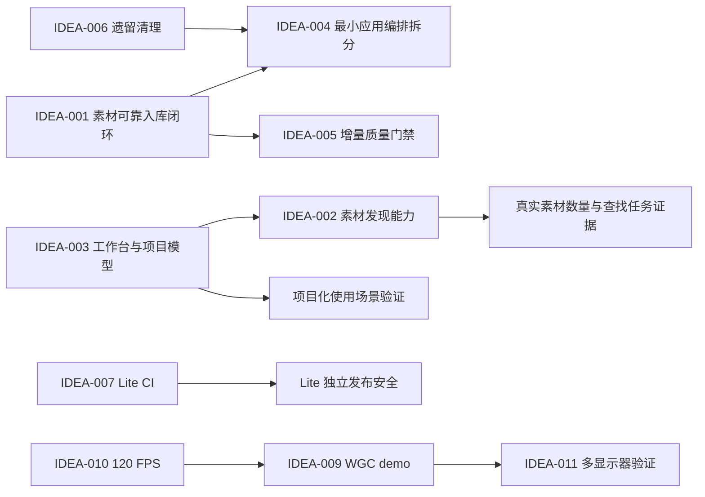

# QuickRec Full v1.6 发布后需求池

## 追踪信息

- 当前状态：`IDEA-001` 已完成 PRD 澄清并形成 v1.6.1 正式 PRD；其他候选保持原分流
- 目标版本：QuickRec Full v1.6.1
- 上游来源：2026-07-15 QuickRec Full v1.6 发布后项目 Review
- 下游承接：`doc/releases/v1.6.1/prd.md`；`IDEA-004`、`IDEA-005` 仅作为工程支撑进入影响范围
- 当前事实源：`doc/current.md`、`doc/releases/v1.6/`、当前代码与 GitHub Release
- 最后更新：2026-07-15

## 总体判断

- 本次来源：v1.6 已发布能力、D7 验收遗留、代码结构、质量门禁和历史 Full Workbench 规划。
- 推荐版本主线：**素材可靠入库闭环**。让已经成功保存、但中央索引写入失败的素材，在结果条关闭和应用重启后仍然可发现、可重试、可恢复。
- 推荐工程支撑一：围绕本次主线做 `QuickRecApp` 最小职责拆分，不全量重写 `RecorderManager`。
- 推荐工程支撑二：把本次新增和受影响模块纳入 ruff、mypy、coverage，不追求一次覆盖全部历史 UI 与硬件代码。
- 直接进入 PRD：`IDEA-001`。
- 现在直接治理：`IDEA-006` 遗留模块清理、`IDEA-007` Lite 独立 CI；执行前仍需做一次依赖确认。
- 继续验证：`IDEA-002`、`IDEA-003`、`IDEA-008`、`IDEA-009`、`IDEA-011`。
- 暂不做：`IDEA-010` 120 FPS 正式能力。
- 明确不进入下一版本：AI、完整剪辑、导出队列、云同步、SQLite 迁移和完整工作台一次性交付。

## 为什么不是完整工作台

v1.6 已建立中央素材索引，但项目模型、用户对项目化管理的真实频率、素材搜索行为和工作台入口心智尚无真实使用数据。直接建设完整工作台会同时引入项目模型、页面导航、素材归属、编辑状态、导出状态和迁移规则，成本可控性不足。下一版本应先完成一个用户可以明确感知、可快速验收、不会破坏现有托盘工作流的小闭环。

## 证据映射

| 来源证据 | 对应候选需求 | 证据等级 | 说明 |
| --- | --- | --- | --- |
| `bugfix-log.md` 的 `GAP-V16-D7-003` | IDEA-001 | 强 | 结果条关闭后没有持久重试入口，已经过验收复现和产品决策确认 |
| 中央素材库最多 200 条且只有加载更多 | IDEA-002 | 中 | 结构上存在查找成本，但没有真实使用量和查找失败数据 |
| Full Workbench 历史原型与产品规划 | IDEA-003 | 弱 | 有方向和原型，没有真实用户采用证据 |
| `main.py` 823 行、`RecorderManager` 822 行 | IDEA-004 | 强 | 编排职责集中，新增素材恢复状态会继续增加入口复杂度 |
| coverage、ruff、mypy 明确排除多个核心模块 | IDEA-005 | 强 | 当前 80% 门槛不能代表完整 UI、音频和捕获链路 |
| v1.5 最近录制、自绘光标模块只被旧测试或打包清单引用 | IDEA-006 | 强 | 运行时已被 v1.6 素材库和无自绘光标方案替代 |
| CI 只覆盖 Full `master` | IDEA-007 | 强 | Lite 有独立发布线但没有独立自动化门禁 |
| 目录重建串行 FFprobe，单文件超时 1.5 秒 | IDEA-008 | 中 | 存在最坏耗时风险，但没有真实目录性能数据 |
| v1.5 WGC spike 与窗口捕获历史问题 | IDEA-009 | 中 | 技术风险真实，但当前 dxcam 主链路已稳定 |
| 当前产品只提供 30/60 FPS | IDEA-010 | 弱 | 没有目标用户、硬件分布或 120 FPS 使用场景证据 |
| 历史 4K/DPI/窗口移动讨论与多显示器未正式覆盖 | IDEA-011 | 中 | 有兼容性风险线索，但缺真实多显示器设备矩阵证据 |

## 需求总览

| ID | 标题 | 类型 | 证据等级 | 评分 | 置信度 | 分档结论 | 建议去向 | 最小下一步 |
| --- | --- | --- | --- | ---: | --- | --- | --- | --- |
| IDEA-001 | 持久待入库与重试入口 | 产品问题 | 强 | 35/40 | 高 | 高价值 | 已进入 v1.6.1 PRD | 需求已收敛，等待 PRD 确认后进入开发承接 |
| IDEA-002 | 素材搜索、筛选和最小分类 | 产品需求 | 中 | 25/40 | 中 | 中价值但证据闸门未过 | 继续验证 | 统计素材数量并观察 5 次真实查找任务 |
| IDEA-003 | Full 工作台基础壳与项目模型 | 产品方案 | 弱 | 20/40 | 中低 | 信息不足 | 原型验证 | 先验证项目化管理是否比全局素材库更高频 |
| IDEA-004 | QuickRecApp / RecorderManager 最小拆分 | 工程支撑 | 强 | 31/40 | 高 | 中高价值 | 作为支撑进入 PRD | 只拆本次恢复链路涉及的应用编排边界 |
| IDEA-005 | 扩大质量门禁真实覆盖范围 | 工程支撑 | 强 | 33/40 | 高 | 高价值 | 作为支撑进入 PRD | 为本次改动模块设增量门禁，不全量清债 |
| IDEA-006 | 清理 v1.5 最近录制和自绘光标遗留 | 直接治理 | 强 | 28/40 | 高 | 中价值 | 现在直接治理 | 先证明运行时、迁移和打包均不依赖再删除 |
| IDEA-007 | Lite 独立 CI | 产品线治理 | 强 | 32/40 | 高 | 高价值 | 现在直接治理 | 为 `lite-master` 增加最小测试与编译工作流 |
| IDEA-008 | 目录重建性能验证 | 技术验证 | 中 | 23/40 | 中 | 待验证 | 继续验证 | 建立 10/50/200 文件基准与取消延迟记录 |
| IDEA-009 | WGC 最小 demo | 技术验证 | 中 | 23/40 | 中 | 待验证 | 技术 spike | 独立脚本对比 dxcam，不接入运行时开关 |
| IDEA-010 | 120 FPS 能力 | 技术方案 | 弱 | 14/40 | 低 | 当前未通过 | 暂不做 | 先收集目标场景、硬件和编码负载证据 |
| IDEA-011 | 多显示器兼容性验证 | 技术验证 | 中 | 24/40 | 中 | 小范围验证 | 继续验证 | 建立显示器排列、DPI 和跨屏窗口测试矩阵 |

## 依赖关系



## 三档范围方案

| 档位 | 内容 | 判断 | 风险 |
| --- | --- | --- | --- |
| 最小方案 | 持久待入库记录、素材库恢复入口、重试成功/失败反馈、幂等与重启保持 | 可完成，但产品改善较窄 | 容易只修恢复而不改善可发现性 |
| 推荐方案 | 最小方案 + QuickRecApp 恢复编排边界 + 受影响模块质量门禁；不加入搜索与项目模型 | 推荐作为下一版本 | 需要控制恢复状态与中央索引的一致性 |
| 过大方案 | 持久重试 + 搜索筛选 + 标签收藏 + 项目模型 + 工作台壳 + WGC | 不建议 | 状态、页面和数据模型同时扩张，难以在一轮可靠验收 |

## 需求详情

### IDEA-001 持久待入库与重试入口

- 产品问题：视频已经成功保存，但索引写入失败后，结果条 5 秒关闭会让恢复入口永久消失。
- 目标用户 / 场景：磁盘、权限、文件占用或索引异常恢复后，希望把已保存视频重新加入素材库的用户。
- 当前替代方案：手动导入目录或重建目录；操作路径更重，也无法直接解释哪一条录制曾入库失败。
- 证据盘点：D7 已稳定复现；`GAP-V16-D7-003` 明确记录；属于核心信任和数据可发现性问题。
- 价值判断：高价值，适合作为唯一产品主线。
- 结论：已完成 PRD 澄清，由 `doc/releases/v1.6.1/prd.md` 承接。
- 最小下一步：确认待处理记录保存位置、素材库入口、重启恢复、清理规则、重复入库和源文件丢失行为。

| 维度 | 分数 | 证据 / 理由 |
| --- | ---: | --- |
| 痛点强度 | 5 | 视频存在但产品内不可见，影响用户信任 |
| 人群 / 场景清晰度 | 5 | 索引失败且视频保存成功的场景明确 |
| 证据强度 | 5 | 验收复现、日志和产品决策均已记录 |
| 频率 / 紧迫性 | 3 | 低频异常，但一旦发生恢复成本高 |
| 核心目标贡献 | 5 | 直接补齐 v1.6 素材库可靠性 |
| 差异化 / 替代方案 | 4 | 目录重建可绕过，但路径重、语义不准确 |
| 成本可控性 | 4 | 可复用素材库、索引服务和结果条事件 |
| 验证速度 | 4 | 权限或写入失败夹具可快速复验 |

### IDEA-002 素材搜索、筛选和最小分类

- 产品问题：素材增长后，仅按时间排序和加载更多可能难以快速找到目标。
- 目标用户 / 场景：拥有几十到两百条素材、跨目录查找特定录制的创作者。
- 当前替代方案：按时间浏览、打开目录后使用资源管理器搜索。
- 证据盘点：结构性问题明确，但没有实际素材数量、搜索频率或查找失败反馈。
- 价值判断：中价值，证据不足以直接进入 PRD。
- 结论：继续验证，不进入下一版本推荐范围。
- 最小下一步：记录一周真实素材规模，并完成 5 次“按名称、模式、时间寻找素材”的任务观察。

| 维度 | 分数 | 证据 / 理由 |
| --- | ---: | --- |
| 痛点强度 | 3 | 数量大时明显，当前规模未知 |
| 人群 / 场景清晰度 | 4 | 重度录制用户场景明确 |
| 证据强度 | 2 | 只有项目结构与产品推断，触发证据闸门 |
| 频率 / 紧迫性 | 2 | 尚无使用频率 |
| 核心目标贡献 | 4 | 直接改善素材库可用性 |
| 差异化 / 替代方案 | 3 | 资源管理器可部分替代 |
| 成本可控性 | 3 | 搜索简单，标签和收藏会扩大数据模型 |
| 验证速度 | 4 | 可用任务观察快速验证 |

### IDEA-003 Full 工作台基础壳与项目模型

- 产品问题：全局素材库无法表达同一教程、课程或内容项目中的素材归属和连续工作流。
- 目标用户 / 场景：连续录制多个片段，并按项目管理、编辑和导出的创作者。
- 当前替代方案：文件夹命名和外部剪辑软件项目。
- 证据盘点：有历史高保真原型和长期方向，但没有真实项目创建频率或用户反馈。
- 价值判断：长期可能高价值，当前仍是方案先行。
- 结论：只做问题验证或原型复核，不进入完整 PRD。
- 最小下一步：用现有 Full 原型让 3 个真实录制任务对比“全局素材库”和“项目工作台”。

| 维度 | 分数 | 证据 / 理由 |
| --- | ---: | --- |
| 痛点强度 | 2 | 项目化痛点尚未从真实使用中出现 |
| 人群 / 场景清晰度 | 4 | 创作者多片段场景清楚 |
| 证据强度 | 2 | 只有历史规划和内部原型 |
| 频率 / 紧迫性 | 2 | 当前使用频率未知 |
| 核心目标贡献 | 4 | 符合 Full 长期演进方向 |
| 差异化 / 替代方案 | 2 | 文件夹和外部编辑器可替代 |
| 成本可控性 | 1 | 项目模型和导航会扩张全局状态 |
| 验证速度 | 3 | 原型可验证，但真实习惯需要观察 |

### IDEA-004 QuickRecApp / RecorderManager 最小职责拆分

- 产品问题：入口与录制管理类职责持续集中，新增恢复状态会增加回调、资源和状态耦合。
- 证据盘点：两个核心文件均超过 800 行；入口直接编排托盘、热键、录制、设置、诊断和素材库。
- 价值判断：高维护价值，但不能脱离产品主线做全量重构。
- 结论：作为 IDEA-001 的支撑模块进入 PRD 影响范围。
- 最小下一步：只提取“素材入库结果与恢复编排”边界，并保持录制 API 不变。

| 维度 | 分数 | 证据 / 理由 |
| --- | ---: | --- |
| 痛点强度 | 4 | 已明显增加修改和回归半径 |
| 人群 / 场景清晰度 | 5 | 维护者新增录制后处理功能时发生 |
| 证据强度 | 5 | 代码规模、依赖和历史规划直接证明 |
| 频率 / 紧迫性 | 4 | 每次新增功能都会接触入口编排 |
| 核心目标贡献 | 4 | 支撑恢复主线稳定落地 |
| 差异化 / 替代方案 | 3 | 可继续堆叠，但维护成本持续上升 |
| 成本可控性 | 3 | 最小拆分可控，全量重写不可控 |
| 验证速度 | 3 | 依赖现有回归测试和架构边界测试 |

### IDEA-005 扩大 ruff、mypy、coverage 的真实覆盖范围

- 产品问题：当前质量数字不能覆盖入口、全部 UI、音频捕获和屏幕捕获等高风险代码。
- 证据盘点：`pyproject.toml` 明确列出 coverage omit、ruff exclude 和 mypy files 白名单。
- 价值判断：高工程价值，应采用增量门禁，避免一次性清理全部历史问题。
- 结论：作为第二个工程支撑模块进入 PRD。
- 最小下一步：新增代码不得加入排除名单；IDEA-001 涉及文件必须进入三类门禁。

| 维度 | 分数 | 证据 / 理由 |
| --- | ---: | --- |
| 痛点强度 | 4 | 门禁盲区会降低回归可信度 |
| 人群 / 场景清晰度 | 5 | 开发、Review 和发布阶段均受影响 |
| 证据强度 | 5 | 配置文件直接证实排除范围 |
| 频率 / 紧迫性 | 4 | 每次开发和 CI 都发生 |
| 核心目标贡献 | 5 | 支撑下一版可靠发布 |
| 差异化 / 替代方案 | 3 | 手动验收可补偿，但成本高且不稳定 |
| 成本可控性 | 3 | 增量策略可控，全量清债不可控 |
| 验证速度 | 4 | CI 结果可立即验证 |

### IDEA-006 清理 v1.5 最近录制和自绘光标遗留

- 产品问题：运行时已切换到素材库和无自绘光标链路，但旧模块、测试和打包 hidden import 仍会误导维护者。
- 证据盘点：运行时代码没有引用 `RecentRecordingsDialog` 和 `recording_history`；`cursor_overlay` 主要由旧测试和打包清单引用。
- 价值判断：中等维护价值，不应占用产品版本主线。
- 结论：作为独立直接治理任务；删除前做导入、迁移和 PyInstaller 依赖审计。

| 维度 | 分数 | 证据 / 理由 |
| --- | ---: | --- |
| 痛点强度 | 3 | 不影响用户，但显著增加认知噪声 |
| 人群 / 场景清晰度 | 5 | 维护和打包时持续出现 |
| 证据强度 | 5 | 引用扫描已确认 |
| 频率 / 紧迫性 | 3 | 每次架构 Review 和打包维护受影响 |
| 核心目标贡献 | 3 | 间接降低下一版复杂度 |
| 差异化 / 替代方案 | 3 | 也可保留并明确 deprecated |
| 成本可控性 | 3 | 删除简单，但需防止破坏兼容测试 |
| 验证速度 | 3 | 全量测试和打包可验证 |

### IDEA-007 Lite 独立 CI

- 产品问题：Lite 是独立发布线，但提交到 `lite-master` 时没有自动编译、静态检查和核心测试门禁。
- 证据盘点：当前 GitHub Actions 仅监听 Full `master` 和历史基线分支。
- 价值判断：高治理价值，范围小，不应混入 Full 产品 PRD。
- 结论：现在直接治理，单独在 Lite 工作区实施和验收。

| 维度 | 分数 | 证据 / 理由 |
| --- | ---: | --- |
| 痛点强度 | 4 | 可能把回归直接带入 Lite 发布分支 |
| 人群 / 场景清晰度 | 5 | Lite 每次提交和发布 |
| 证据强度 | 5 | 工作流触发配置直接证明 |
| 频率 / 紧迫性 | 3 | 当前 Lite 迭代频率较低 |
| 核心目标贡献 | 4 | 保护独立产品线稳定性 |
| 差异化 / 替代方案 | 3 | 可人工跑测试，但不可持续 |
| 成本可控性 | 4 | 复用现有 CI，范围较小 |
| 验证速度 | 4 | 推送测试分支即可验证 |

### IDEA-008 目录重建性能验证

- 产品问题：串行 FFprobe 在大目录中可能造成长时间等待，取消响应也可能受单文件超时影响。
- 证据盘点：实现逐个探测，单文件超时 1.5 秒；没有 10/50/200 文件真实耗时。
- 价值判断：先验证，不能直接以并发重写为需求。
- 结论：继续验证。
- 最小下一步：建立固定编码、损坏和中文路径混合样本，记录总耗时、P95 单文件耗时和取消延迟。

| 维度 | 分数 | 证据 / 理由 |
| --- | ---: | --- |
| 痛点强度 | 3 | 最坏情况明显，但尚无真实慢反馈 |
| 人群 / 场景清晰度 | 3 | 大目录重建用户 |
| 证据强度 | 2 | 只有代码路径推断 |
| 频率 / 紧迫性 | 2 | 重建是低频恢复操作 |
| 核心目标贡献 | 3 | 改善恢复体验 |
| 差异化 / 替代方案 | 3 | 进度与取消可缓解 |
| 成本可控性 | 3 | 基准简单，并发实现风险中等 |
| 验证速度 | 4 | 可用受控文件快速量化 |

### IDEA-009 WGC 最小 demo

- 产品问题：dxcam 对特殊窗口、窗口移动和未来多显示器场景存在能力边界。
- 证据盘点：历史窗口录制问题和 WGC spike 支撑技术风险，但 v1.6 默认链路已稳定。
- 价值判断：适合独立技术验证，不适合作为下一版产品主线。
- 结论：技术 spike；不增加后端开关，不替换默认 dxcam。
- 最小下一步：独立 demo 对比普通窗口、UWP、硬件加速窗口、移动和最小化场景。

| 维度 | 分数 | 证据 / 理由 |
| --- | ---: | --- |
| 痛点强度 | 3 | 特殊窗口兼容问题真实但不是普遍主路径 |
| 人群 / 场景清晰度 | 3 | 录制特殊窗口和多屏用户 |
| 证据强度 | 3 | 有历史问题与技术文档 |
| 频率 / 紧迫性 | 2 | 当前默认链路已通过验收 |
| 核心目标贡献 | 3 | 改善未来捕获兼容性 |
| 差异化 / 替代方案 | 3 | dxcam 和全屏录制可绕过部分问题 |
| 成本可控性 | 2 | 正式接入复杂，独立 demo 可控 |
| 验证速度 | 4 | demo 可快速比较 |

### IDEA-010 120 FPS 能力

- 产品问题：部分游戏或高动态内容可能希望超过 60 FPS。
- 证据盘点：只有能力想象，没有用户反馈、目标硬件、编码负载或观看场景数据。
- 价值判断：当前不建议。
- 结论：暂不做，不进入下一版本。
- 最小下一步：只有出现明确用户样本后，再以 1080p/120 的捕获、编码、丢帧和文件大小做硬件 spike。

| 维度 | 分数 | 证据 / 理由 |
| --- | ---: | --- |
| 痛点强度 | 1 | 当前 60 FPS 没有已知投诉 |
| 人群 / 场景清晰度 | 2 | 仅能推断游戏录制用户 |
| 证据强度 | 1 | 无用户或行为证据 |
| 频率 / 紧迫性 | 1 | 未知 |
| 核心目标贡献 | 2 | 提升性能上限，不改善当前素材主线 |
| 差异化 / 替代方案 | 2 | 60 FPS 对多数场景足够 |
| 成本可控性 | 2 | 涉及捕获、编码、磁盘和硬件矩阵 |
| 验证速度 | 3 | 单机 spike 可做，但代表性有限 |

### IDEA-011 多显示器兼容性验证

- 产品问题：显示器排列、不同 DPI、跨屏窗口和输出选择可能造成坐标或尺寸错误。
- 证据盘点：历史 4K/DPI 和窗口移动问题提供线索；v1.6 只完成三档单环境 DPI 验收。
- 价值判断：值得验证，但不承诺下一版正式支持全部矩阵。
- 结论：继续验证。
- 最小下一步：覆盖双屏左右/上下排列、主副屏交换、100%/150% 混合 DPI、跨屏窗口和独立输出选择。

| 维度 | 分数 | 证据 / 理由 |
| --- | ---: | --- |
| 痛点强度 | 3 | 错位会直接影响录制结果 |
| 人群 / 场景清晰度 | 4 | 多显示器与混合 DPI 用户明确 |
| 证据强度 | 3 | 有历史问题，但缺当前设备证据 |
| 频率 / 紧迫性 | 2 | 用户占比未知 |
| 核心目标贡献 | 3 | 改善捕获兼容性和信任 |
| 差异化 / 替代方案 | 2 | 可暂时只在主屏录制 |
| 成本可控性 | 3 | 测试可控，正式支持可能复杂 |
| 验证速度 | 4 | 有设备即可快速建立矩阵 |

## 最终分流

### 进入 PRD

- `IDEA-001` 持久待入库与重试入口。
- `IDEA-004` 作为工程支撑，只允许最小职责拆分。
- `IDEA-005` 作为工程支撑，只扩大受影响模块门禁。

### 现在直接治理

- `IDEA-006` 清理确认无运行时依赖的 v1.5 最近录制和自绘光标遗留。
- `IDEA-007` 在 QuickRec Lite 工作区建立独立 CI。

### 继续验证

- `IDEA-002` 素材搜索、筛选和最小分类。
- `IDEA-003` Full 工作台基础壳与项目模型。
- `IDEA-008` 目录重建性能。
- `IDEA-009` WGC 最小 demo。
- `IDEA-011` 多显示器兼容性。

### 暂不做

- `IDEA-010` 120 FPS。
- AI、完整剪辑、导出队列、云同步、完整诊断中心和 SQLite 迁移。

## 下一阶段建议

- 推荐下一步：进入 `/prd` 澄清，仅处理 `IDEA-001`，并把 `IDEA-004`、`IDEA-005` 限定为支撑项。
- 必须先确认：待入库记录位置、持久入口位置、自动/手动重试策略、清理时机、源文件丢失行为和历史上限。
- 不应在 PRD 中顺带加入搜索、项目模型、WGC 或 120 FPS。

可直接发送：

```text
mypm /prd

项目：E:\codex\QuickRec
需求池：doc/archive/ideas/mypm-idea-pool-post-v1.6-2026-07-15.md

请为 IDEA-001“持久待入库与重试入口”进入 PRD 澄清阶段，先不要直接写完整 PRD。

版本范围：
- 唯一产品主线：素材可靠入库闭环。
- 工程支撑一：QuickRecApp 最小职责拆分，不全量重写 RecorderManager。
- 工程支撑二：扩大本次受影响模块的 ruff、mypy、coverage 门禁。

明确不做：
- 搜索、标签、收藏和项目模型。
- 完整工作台、剪辑、导出队列、AI 和云同步。
- WGC、120 FPS 和多显示器正式支持。
- SQLite 迁移和复杂恢复中心。

请先通过提问确认待入库记录位置、持久入口、重试策略、清理规则、源文件丢失行为和保留上限。任何不明确的地方必须向我提问。
```
