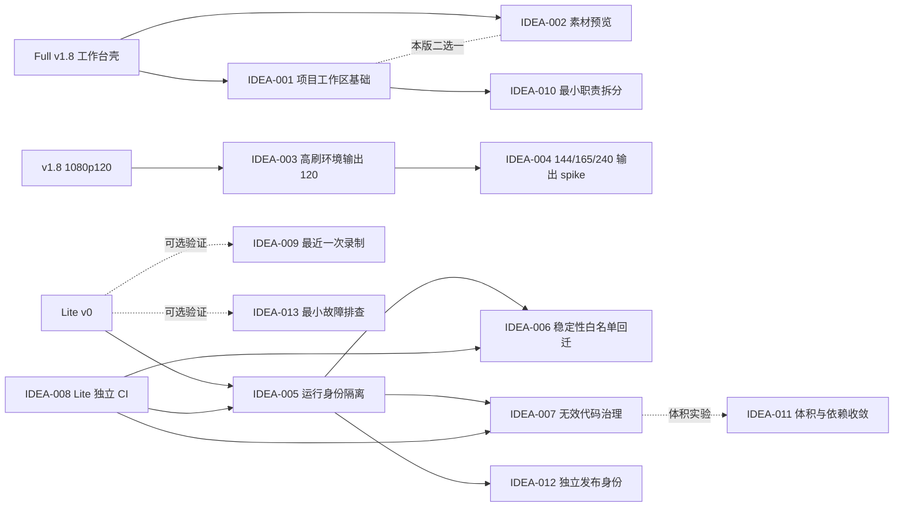

# /idea 需求池：QuickRec Full v1.8 发布后与 Lite v0.1

## 追踪信息

- 当前状态：需求池，尚未进入 PRD。
- 目标版本：
  - QuickRec Full 下一版本候选。
  - 高刷新率独立技术验证轨。
  - QuickRec Lite v0.1 候选。
- 上游来源：
  - `E:\codex\QuickRec\doc\current.md`
  - `E:\codex\QuickRec\doc\releases\v1.8\release-notes.md`
  - `E:\codex\QuickRec\doc\releases\v1.8\120fps-spike.md`
  - `E:\codex\QuickRec\doc\archive\ideas\mypm-idea-pool-v1.8-2026-07-23.md`
  - `E:\codex\QuickRec-Lite\doc\current.md`
  - `E:\codex\QuickRec-Lite\doc\releases\lite-v0\`
  - Full 与 Lite 当前代码、CI 和打包配置只读检查。
- 下游承接：分别进入 Full `/prd`、高刷新率技术 spike、Lite v0.1 `/prd` 或直接治理。
- 当前事实源：
  - Full：`E:\codex\QuickRec\doc\current.md`
  - Lite：`E:\codex\QuickRec-Lite\doc\current.md`
- 最后更新：2026-07-26。

## 入口判断

本轮入口为 `/idea`。目标是判断三个独立产品方向是否真实、是否值得继续以及最小下一步，不直接生成 PRD，不把 Full、高刷新率和 Lite 合并成同一个版本。

## 总体判断

### 三条路线必须分开

1. **Full 产品路线**：下一版本只选择“项目工作区基础”作为产品主线；素材预览继续验证，不与项目工作区同时进入正式版本。
2. **高刷新率技术路线**：先补齐 120 FPS 在 144/165/240/300Hz 显示环境中的兼容验证；144/165/240 FPS 正式输出只做技术 spike，不形成版本承诺。
3. **Lite v0.1 路线**：以运行身份隔离为产品与工程主线，配套独立 CI、白名单式稳定性回迁和无效底层代码治理；不把 Full 工作台、素材库或高帧率能力搬入 Lite。

### 推荐分流

- **进入 Full `/prd` 澄清**：`IDEA-001` 项目工作区基础。
- **作为 Full PRD 的工程边界**：`IDEA-010` 工作台与素材库最小职责拆分；它不是第二条产品主线。
- **继续验证，不进入 Full PRD**：`IDEA-002` 素材预览。
- **进入独立技术验证**：`IDEA-003` 高刷显示环境下稳定输出 120 FPS。
- **暂不进入产品版本**：`IDEA-004` 144/165/240 FPS 正式输出。
- **进入 Lite v0.1 `/prd` 澄清**：`IDEA-005` Full/Lite 运行身份隔离。
- **作为 Lite v0.1 支撑模块**：`IDEA-006` 稳定性能力白名单回迁、`IDEA-007` 无效底层代码治理、`IDEA-012` 独立版本与发布身份。
- **现在直接治理**：`IDEA-008` Lite 独立 CI，以及 Lite v0 过期进度口径。
- **继续验证**：`IDEA-009` Lite 最近一次录制入口、`IDEA-011` Lite 打包体积收敛、`IDEA-013` Lite 最小故障排查入口。

## 证据映射

| 来源证据 | 对应候选 | 证据等级 | 说明 |
|---|---|---|---|
| Full v1.8 已发布四页工作台，但明确不包含项目模型、预览、多轨和导出队列 | IDEA-001、IDEA-002 | 强 | 工作台壳已经建立，下一层内容仍是独立候选 |
| `WorkbenchWindow` 只有录制、素材库、设置、诊断四个页面；素材库详情只提供系统播放器“打开” | IDEA-001、IDEA-002 | 强 | 代码确认当前不存在项目工作区和内嵌预览 |
| 历史 Full Workbench 原型包含项目、片段和预览概念，但尚无项目化使用数据 | IDEA-001、IDEA-002 | 中 | 证明长期方向存在，不等于用户价值已经验证 |
| v1.8 正式门禁仅覆盖单显示器 1920×1080@120Hz；开发机日常为 2560×1440@300Hz | IDEA-003、IDEA-004 | 强 | 高刷环境存在，但高于 120 FPS 的正式输出尚无门禁 |
| 设置、能力检测、捕获指标和录制配置均以 `120` 为固定产品边界 | IDEA-003、IDEA-004 | 强 | 144/165/240 不是简单增加下拉选项 |
| Full 与 Lite 都读写 `%APPDATA%\QuickRec\config.json`，共用 `%TEMP%\QuickRec` 和注册表自启动名 `QuickRec` | IDEA-005 | 强 | 两个产品同时安装或运行时存在配置、自启动和临时数据互相影响风险 |
| Lite 配置保存仍直接覆盖 JSON，Full 已使用临时文件、`fsync` 和原子替换 | IDEA-006 | 强 | Full 已经修复的配置可靠性能力没有回迁 Lite |
| Lite `main.py` 仍导入区域、窗口和高亮模块；打包 spec 仍强制包含对应 hidden imports | IDEA-007 | 强 | “入口已裁剪”不等于运行依赖和打包依赖已经隔离 |
| Lite CI 只监听 `master` 和 `v1.4-engineering-baseline`，不监听 `lite-master` / `lite-test` | IDEA-008 | 强 | Lite 当前提交不能获得自己的分支门禁 |
| Lite 结果条已可打开文件和文件夹，但没有持久历史；没有用户反馈证明需要素材管理 | IDEA-009 | 弱 | 可验证“结果条消失后找文件”的问题，但不能借机引入素材库 |
| Full 的 `main.py`、`workbench_pages.py` 和 `material_library_dialog.py` 已承载较多协调与界面职责 | IDEA-010 | 强 | 项目模型加入前需要明确最小边界，否则新主线会继续堆入现有大类 |
| Lite v0 打包约 257.89 MB，其中 FFmpeg、OpenCV、PyQt5 和 NumPy 是主要体积来源 | IDEA-011 | 强 | 体积问题真实，但 Lite v0 已明确“不作为阻断验收” |
| Lite 仍使用 `QuickRec` 可执行文件、包目录和发布称谓，缺少与 Full 可共存的独立版本身份 | IDEA-012 | 强 | 仅隔离配置还不足以形成独立安装、发布和问题定位边界 |
| Lite 没有 Full 诊断导出能力，也缺少用户故障数据证明需要完整诊断中心 | IDEA-013 | 弱 | 可以验证最小“打开日志目录/复制版本信息”，不能直接回迁诊断中心 |
| Lite `current.md` 认定 v0 已完成，`progress.md` 仍写待合并、待 tag | 直接治理 | 强 | 事实源不一致，属于文档治理，不是需求 |

## 需求总览

| ID | 标题 | 路线 | 证据等级 | 压力测试 | 置信度 | 分档结论 | 建议去向 | 最小下一步 |
|---|---|---|---|---:|---|---|---|---|
| IDEA-001 | Full 项目工作区基础 | Full | 中 | 27/40 | 中 | 部分通过 | 进入范围受限的 `/prd` 澄清 | 只定义项目创建、打开、素材归属和本地持久化 |
| IDEA-002 | 素材静态首帧或轻量预览 | Full | 弱 | 22/40 | 中低 | 信息不足 | 继续验证 | 对比文件名、静态首帧和系统播放器的识别效率 |
| IDEA-003 | 高刷显示环境稳定输出 120 FPS | 高刷新率 | 中 | 29/40 | 中高 | 部分通过 | 独立技术验证 | 在 144/165/240/300Hz 下重复 1080p120 门禁 |
| IDEA-004 | 144/165/240 FPS 正式输出 | 高刷新率 | 弱 | 17/40 | 中 | 信息不足 | 暂不做产品版本，只做 spike | 测试 dxcam、CPU 编码和磁盘链路的极限 |
| IDEA-005 | Full/Lite 运行身份隔离 | Lite | 强 | 34/40 | 高 | 通过 | Lite v0.1 `/prd` | 定义配置、临时目录、自启动和迁移边界 |
| IDEA-006 | Full 稳定性能力白名单回迁 | Lite | 中强 | 31/40 | 中高 | 部分通过 | Lite v0.1 支撑模块 | 先列允许回迁清单，不做分支整体同步 |
| IDEA-007 | Lite 无效底层代码与打包依赖治理 | Lite | 强 | 32/40 | 高 | 通过 | Lite v0.1 支撑模块 | 建立运行依赖图后逐模块删除或隔离 |
| IDEA-008 | Lite 独立 CI | Lite | 强 | 38/40 | 高 | 通过 | 现在直接治理 | CI 改为覆盖 Lite 分支、PR 和 packaging smoke |
| IDEA-009 | Lite 最近一次录制入口 | Lite | 弱 | 22/40 | 低 | 信息不足 | 继续验证 | 只验证托盘打开最近一个文件是否解决问题 |
| IDEA-010 | Full 工作台与素材库最小职责拆分 | Full 支撑 | 强 | 34/40 | 高 | 通过 | 随 `IDEA-001` 进入工程影响边界 | 先抽离项目协调接口，不全量重写应用 |
| IDEA-011 | Lite 打包体积与依赖收敛 | Lite 验证 | 强 | 27/40 | 中 | 部分通过 | 独立体积实验，不阻断 v0.1 | 逐项验证 OpenCV、FFmpeg 和无效模块的可移除性 |
| IDEA-012 | Lite 独立版本与发布身份 | Lite 支撑 | 强 | 34/40 | 高 | 通过 | Lite v0.1 支撑模块 | 统一应用名、版本、包名、产物名和发布说明 |
| IDEA-013 | Lite 最小故障排查入口 | Lite 验证 | 弱 | 27/40 | 中低 | 信息不足 | 继续验证 | 先验证“打开日志目录＋复制版本信息”能否满足排查 |

## 依赖关系

## 三条路线的范围方案

### Full 下一版本

| 档位 | 内容 | 判断 |
|---|---|---|
| 最小方案 | 工作台增加项目列表与项目详情占位，只保存项目名称和素材引用 | 可快速验证项目心智，但业务闭环较弱 |
| 推荐方案 | 项目创建、打开、重命名、归档；素材加入/移出项目；本地项目文件；全局素材库仍保留；仅做支撑该链路的最小职责拆分 | 推荐进入 PRD 澄清 |
| 过大方案 | 推荐方案同时加入预览、多轨、时间线、剪辑和导出队列 | 不建议，状态模型和媒体链路同时扩张 |

### 高刷新率

| 档位 | 内容 | 判断 |
|---|---|---|
| 最小方案 | 在 144/165/240/300Hz 显示模式下仍输出 1080p120，验证检测、节流和同步 | 推荐立即做技术验证 |
| 推荐方案 | 最小方案加长时四音频验证和高刷环境诊断报告 | 验证通过后再决定是否形成维护版本 |
| 过大方案 | 同时正式输出 144、165、240 FPS，并承诺区域、窗口、多显示器和 4K | 不建议 |

### Lite v0.1

| 档位 | 内容 | 判断 |
|---|---|---|
| 最小方案 | 运行身份隔离、Lite CI 修正、Lite v0 文档事实源收口 | 必须完成 |
| 推荐方案 | 最小方案 + 独立版本/包名/发布身份 + 原子配置保存等白名单稳定性回迁 + 无效区域/窗口/光标打包依赖治理 | 推荐作为 Lite v0.1 |
| 过大方案 | 推荐方案再加入工作台、素材库、区域/窗口录制、120 FPS 和诊断中心 | 破坏 Lite 产品定位，不建议 |

## 需求详情

### IDEA-001 Full 项目工作区基础

- 原始输入：Full 工作台下一层内容，在项目工作区基础与素材预览之间只选一个。
- 输入类型：产品路线 / 长期工作台演进。
- 产品问题：跨多次录制完成同一创作任务时，现有全局素材库无法表达素材属于哪个创作任务。
- 目标用户 / 场景：教程、演示、课程和内容创作者在多次录制后按一个任务归集素材。
- 当前替代方案：在文件系统中手动建立目录，或依赖文件名和全局搜索。
- 证据盘点：
  - 已确认：v1.8 已具备统一工作台和中央素材库。
  - 已确认：历史原型长期包含项目、片段和后续多轨方向。
  - 缺失：没有真实项目数量、跨目录整理频率或用户项目化行为数据。
- 价值判断：中价值、战略相关，但必须从最小项目模型开始。
- 当前阶段：Full 工作台从“统一入口”向“承接创作任务”演进的合理下一步。
- 结论：作为 Full 唯一产品主线进入 `/prd` 澄清；成本闸门要求禁止顺带加入预览、多轨、剪辑或导出。
- 最小下一步：确认项目文件位置、素材引用方式、素材能否属于多个项目、删除与归档语义。

| 维度 | 分数 | 证据 / 理由 |
|---|---:|---|
| 痛点强度 | 3 | 全局素材库不能表达创作任务，但尚无量化使用数据 |
| 人群 / 场景清晰度 | 4 | 多次录制完成教程或演示的场景明确 |
| 证据强度 | 3 | 产品路线和现有壳明确，用户行为证据不足 |
| 频率 / 紧迫性 | 3 | 对重度创作者可能高频，对普通录制用户较低 |
| 核心目标贡献 | 5 | 直接推动 Full 创作者工作台演进 |
| 差异化 / 替代方案 | 3 | 文件夹可替代，但不能提供应用内项目状态 |
| 成本可控性 | 2 | 数据模型、迁移、删除和引用边界需要严格收敛 |
| 验证速度 | 4 | 可先通过原型和本地项目文件验证 |

总分 `27/40`。成本可控性只有 2 分，触发范围拆分门禁，只允许最小项目工作区进入 PRD。

### IDEA-002 素材静态首帧或轻量预览

- 产品问题：相似文件名和大量素材下，仅靠文本详情可能难以确认内容。
- 当前替代方案：点击“打开”，使用系统默认播放器查看。
- 证据盘点：界面没有预览是事实，但没有打开频率、误选率或整理耗时数据。
- 价值判断：可能有用，但静态首帧、短片预览和内嵌播放器是三种不同成本的方案。
- 结论：本轮不进入 Full PRD。
- 最小下一步：使用 20 个相似素材，分别用文件名、静态首帧和系统播放器完成识别任务，记录耗时与误选。

| 维度 | 分数 | 证据 / 理由 |
|---|---:|---|
| 痛点强度 | 2 | 当前有系统播放器替代 |
| 人群 / 场景清晰度 | 3 | 大量相似素材场景明确 |
| 证据强度 | 2 | 只有界面事实和历史判断 |
| 频率 / 紧迫性 | 2 | 没有打开次数或误选数据 |
| 核心目标贡献 | 3 | 改善素材发现，但不是工作台下一层唯一答案 |
| 差异化 / 替代方案 | 2 | 外部播放器已经可用 |
| 成本可控性 | 3 | 静态首帧可控，内嵌播放成本明显更高 |
| 验证速度 | 5 | 人工识别任务可快速验证 |

总分 `22/40`，证据强度 2 分触发证据闸门，结论最高为继续验证。

### IDEA-003 高刷显示环境稳定输出 120 FPS

- 产品问题：v1.8 正式门禁只覆盖 120Hz 显示模式，不能证明 144/165/240/300Hz 下检测、采样和固定 120 FPS 输出保持稳定。
- 目标用户 / 场景：使用高刷显示器，但只需要稳定录制 120 FPS 的用户。
- 当前替代方案：手动把显示器切换为 120Hz 后录制。
- 证据盘点：开发环境本身支持 300Hz；现有门禁和实现具备可复用基础，但尚无多刷新率矩阵。
- 价值判断：中高价值技术兼容项，不等于增加新的输出帧率。
- 结论：进入独立技术验证，不与 Full 产品主线共用版本承诺。
- 最小下一步：在 144、165、240、300Hz 下各执行三次 1080p120 门禁并验证四类音频抽样。

| 维度 | 分数 | 证据 / 理由 |
|---|---:|---|
| 痛点强度 | 3 | 当前用户可能需要切刷新率，尚无失败反馈 |
| 人群 / 场景清晰度 | 4 | 高刷显示器用户录制 120 FPS |
| 证据强度 | 3 | 有真实硬件和现有门禁，缺少矩阵证据 |
| 频率 / 紧迫性 | 3 | 高刷硬件常见性不在本仓库中量化 |
| 核心目标贡献 | 4 | 加固 v1.8 已发布能力 |
| 差异化 / 替代方案 | 4 | 手动切换刷新率体验差且容易忘记恢复 |
| 成本可控性 | 3 | 主要是验证和少量检测兼容，不承诺新输出档位 |
| 验证速度 | 5 | 当前机器可切换多档刷新率验证 |

总分 `29/40`，适合技术验证，不直接写产品 PRD。

### IDEA-004 144/165/240 FPS 正式输出

- 产品问题：部分高刷用户可能希望输出帧率与显示刷新率一致。
- 证据盘点：当前只有产品方向判断；实现、阈值、自检缓存、编码和音画同步均固定围绕 120 FPS。
- 主要风险：CPU 编码吞吐、重复帧识别、磁盘占用、长时音画同步和硬件差异。
- 结论：不进入下一正式版本，只允许独立 spike。
- 最小下一步：先测试 1080p144、165、240 的源更新率、编码 backlog、CPU、文件大小和 10 分钟漂移。

| 维度 | 分数 | 证据 / 理由 |
|---|---:|---|
| 痛点强度 | 2 | 120 FPS 已满足高帧率录制基础需求 |
| 人群 / 场景清晰度 | 3 | 高刷游戏和动态内容场景明确 |
| 证据强度 | 1 | 没有用户反馈或成功门禁 |
| 频率 / 紧迫性 | 2 | 未证明用户必须输出到原生刷新率 |
| 核心目标贡献 | 3 | 相关但不是 Full 工作台产品主线 |
| 差异化 / 替代方案 | 3 | 120 FPS 是现有替代 |
| 成本可控性 | 1 | 捕获、编码、同步和发布矩阵都显著扩大 |
| 验证速度 | 2 | 需要多轮真实硬件和长时验证 |

总分 `17/40`，证据和成本闸门均未通过。

### IDEA-005 Full/Lite 运行身份隔离

- 产品问题：Full 与 Lite 同时安装或运行时可能覆盖配置、自启动项和临时数据，用户无法把它们当作独立产品使用。
- 已确认冲突：
  - 两者均使用 `%APPDATA%\QuickRec\config.json`。
  - 两者均使用 `%TEMP%\QuickRec`。
  - 两者均使用注册表自启动名 `QuickRec`。
  - 默认视频目录和文件名前缀相同。
- 价值判断：高价值、真实问题，是 Lite 独立产品线成立的前提。
- 结论：作为 Lite v0.1 唯一主线进入 `/prd` 澄清。
- 最小下一步：确认是否迁移旧 Lite 配置、共用视频目录是否允许、进程互斥和自启动项如何命名。

| 维度 | 分数 | 证据 / 理由 |
|---|---:|---|
| 痛点强度 | 4 | 可能覆盖配置并产生错误启动目标 |
| 人群 / 场景清晰度 | 5 | 同机安装 Full 与 Lite |
| 证据强度 | 5 | 代码路径直接确认 |
| 频率 / 紧迫性 | 3 | 只影响双产品共存用户，但一旦发生影响较大 |
| 核心目标贡献 | 5 | 决定 Lite 能否成为独立产品线 |
| 差异化 / 替代方案 | 5 | 不能依赖用户手动隔离 APPDATA |
| 成本可控性 | 3 | 需要兼容迁移，但边界可以明确 |
| 验证速度 | 4 | 可用隔离环境和双包共存测试 |

总分 `34/40`，通过。

### IDEA-006 Full 稳定性能力白名单回迁

- 产品问题：Lite 基于旧稳定点，未获得 Full 后续已经验证的部分保存、音频和失败降级修复。
- 已确认差距：
  - Lite 配置直接覆盖 JSON，异常仅打印；Full 使用候选副本、临时文件、`fsync` 和原子替换。
  - Full 后续录制、编码、磁盘检查和音频链路存在大量稳定性增量。
- 风险：直接合并 Full 会把工作台、素材库、120 FPS 和复杂配置一起带入 Lite。
- 结论：只允许白名单回迁，作为 Lite v0.1 支撑模块。
- 推荐白名单：配置原子保存、明确保存失败结果、与四音频直接相关的已验证修复、视频保存与后处理失败语义分离。
- 排除：素材库、诊断页、工作台、120 FPS、区域和窗口能力。

| 维度 | 分数 | 证据 / 理由 |
|---|---:|---|
| 痛点强度 | 4 | 配置损坏和录制后处理异常影响基本可信度 |
| 人群 / 场景清晰度 | 5 | 所有 Lite 用户 |
| 证据强度 | 4 | 代码差异和 Full 历史修复明确 |
| 频率 / 紧迫性 | 4 | 保存配置、录制和音频是高频主链路 |
| 核心目标贡献 | 5 | 直接支撑 Lite“少而稳定” |
| 差异化 / 替代方案 | 4 | 用户无法自行补偿配置原子性 |
| 成本可控性 | 2 | 宽泛回迁会引入大范围分支耦合 |
| 验证速度 | 3 | 需要自动化和四音频硬件回归 |

总分 `31/40`。成本闸门要求先形成回迁白名单，禁止整体同步 Full。

### IDEA-007 Lite 无效底层代码与打包依赖治理

- 产品问题：Lite 用户入口已裁剪，但源码、测试和打包仍承担区域、窗口和旧光标链路的维护与体积成本。
- 已确认：
  - `main.py` 仍导入并持有区域、窗口、高亮对象。
  - Recorder 和 workflow 仍暴露窗口录制能力。
  - 打包 spec 和 packaging 测试仍要求 `cursor_overlay`、`area_selector`、`window_selector`、`window_highlighter`。
- 结论：进入 Lite v0.1 支撑模块，但要先证明不可达和无迁移依赖。
- 最小下一步：生成入口到模块的静态依赖图，分为“删除”“隔离”“兼容保留”三类，再逐批移除。

| 维度 | 分数 | 证据 / 理由 |
|---|---:|---|
| 痛点强度 | 3 | 不直接阻塞用户，但长期侵蚀轻量路线 |
| 人群 / 场景清晰度 | 4 | Lite 维护、打包和回归 |
| 证据强度 | 5 | 源码、测试和 spec 均可定位 |
| 频率 / 紧迫性 | 3 | 每次维护和打包都会承担 |
| 核心目标贡献 | 4 | 支撑 Lite 依赖边界和可维护性 |
| 差异化 / 替代方案 | 5 | 仅隐藏入口不能解决打包依赖 |
| 成本可控性 | 3 | 分批治理可控，直接删除风险高 |
| 验证速度 | 5 | 依赖检查、自动化、打包和硬件 smoke 可验证 |

总分 `32/40`，通过，但属于工程支撑而不是产品主线。

### IDEA-008 Lite 独立 CI

- 产品问题：Lite 分支提交不会触发与产品线匹配的 CI，回归可能在打包前才暴露。
- 已确认：Lite CI 只监听 `master` 和 `v1.4-engineering-baseline`，不监听 `lite-master` 或 `lite-test`。
- 结论：直接治理，不需要 PRD。
- 最小下一步：调整触发分支，加入 PR、coverage、packaging smoke，并明确真实硬件仍由本地验收承担。

| 维度 | 分数 | 证据 / 理由 |
|---|---:|---|
| 痛点强度 | 4 | 当前 Lite 提交缺少远端门禁 |
| 人群 / 场景清晰度 | 5 | Lite 开发、合并和发布 |
| 证据强度 | 5 | CI 文件直接确认 |
| 频率 / 紧迫性 | 4 | 每次 push 和 PR 都受影响 |
| 核心目标贡献 | 5 | 独立产品线必须有独立质量门禁 |
| 差异化 / 替代方案 | 5 | 只靠本地手工执行不可靠 |
| 成本可控性 | 5 | YAML 调整和验证范围清晰 |
| 验证速度 | 5 | 推送测试分支即可验证 |

总分 `38/40`，通过，建议现在直接治理。

### IDEA-009 Lite 最近一次录制入口

- 产品问题：结果条消失后，用户可能需要快速重新打开刚刚录制的文件。
- 最小方案：托盘只保留“打开最近一次录制”，不建立历史索引、素材库或数据库。
- 证据盘点：现有结果条已经提供打开文件和目录，没有用户反馈证明持久入口缺失。
- 结论：继续验证，不进入 Lite v0.1 默认范围。
- 最小下一步：记录用户在结果条消失后通过资源管理器查找最近文件的频率和耗时。

| 维度 | 分数 | 证据 / 理由 |
|---|---:|---|
| 痛点强度 | 2 | 当前可打开保存目录 |
| 人群 / 场景清晰度 | 3 | 录制后重新打开文件 |
| 证据强度 | 1 | 没有反馈或行为数据 |
| 频率 / 紧迫性 | 2 | 发生频率未知 |
| 核心目标贡献 | 3 | 与轻量录制相关，但不是稳定性前提 |
| 差异化 / 替代方案 | 2 | 保存目录和结果条可替代 |
| 成本可控性 | 4 | 只保存最近路径时成本较小 |
| 验证速度 | 5 | 可通过少量真实使用记录验证 |

总分 `22/40`，证据闸门未通过。

### IDEA-010 Full 工作台与素材库最小职责拆分

- 工程问题：`QuickRecApp`、工作台页面协调和素材库对话框已经承载较多状态、事件与界面逻辑；直接加入项目模型会继续扩大现有类的职责。
- 边界：只抽离项目工作区需要的查询、状态和协调接口，不重写录制核心，不把所有窗口改造成新架构。
- 结论：作为 `IDEA-001` 的工程约束和支撑任务，不单独成为产品主线。
- 最小下一步：在 PRD 中先定义项目工作区与全局素材库的数据边界，在 dev plan 中再确定可测试的最小拆分点。

| 维度 | 分数 | 证据 / 理由 |
|---|---:|---|
| 痛点强度 | 4 | 继续堆叠会明显放大后续维护和回归成本 |
| 人群 / 场景清晰度 | 5 | 直接服务项目工作区实现与现有素材库兼容 |
| 证据强度 | 5 | 大文件、职责和调用关系可由当前代码确认 |
| 频率 / 紧迫性 | 4 | 项目模型开发前必须明确边界 |
| 核心目标贡献 | 5 | 决定 Full 工作台下一层能力能否稳定落地 |
| 差异化 / 替代方案 | 3 | 可继续在原类中开发，但长期成本更高 |
| 成本可控性 | 3 | 最小接口拆分可控，全量重写不可控 |
| 验证速度 | 5 | 单元测试、回归和依赖检查可以快速验证 |

总分 `34/40`，通过。它只能作为工程支撑，不得借机全量重构。

### IDEA-011 Lite 打包体积与依赖收敛

- 工程问题：Lite v0 打包体积约 257.89 MB，与“轻量”产品心智存在落差。
- 已知构成：FFmpeg、OpenCV、PyQt5 和 NumPy 是主要体积来源；区域、窗口和旧光标模块还可能带来额外打包依赖。
- 约束：体积仍不作为 v0.1 发布阻断，不允许为了数字目标降低录制、四音频或视频兼容性。
- 结论：在 `IDEA-007` 完成依赖治理后做独立体积实验，不直接承诺 `<200 MB`。
- 最小下一步：逐项形成“可移除、可替换、必须保留”矩阵，并分别运行打包、硬件录制和播放验证。

| 维度 | 分数 | 证据 / 理由 |
|---|---:|---|
| 痛点强度 | 2 | 影响下载和产品心智，但当前未阻断使用 |
| 人群 / 场景清晰度 | 4 | Lite 下载、安装和更新用户 |
| 证据强度 | 5 | 已有实际包体和依赖占用数据 |
| 频率 / 紧迫性 | 3 | 每次发布都会发生，但不属于录制主链路 |
| 核心目标贡献 | 4 | 与 Lite 轻量定位直接相关 |
| 差异化 / 替代方案 | 4 | 保留完整依赖可稳定运行，但无法改善包体 |
| 成本可控性 | 2 | OpenCV、FFmpeg 和捕获链路高度相关，误删风险高 |
| 验证速度 | 3 | 每个实验都需要重新打包和真实硬件验证 |

总分 `27/40`，部分通过。只进入技术验证，不纳入 v0.1 阻断验收。

### IDEA-012 Lite 独立版本与发布身份

- 产品问题：Lite 虽已有独立分支和文档，但可执行文件、包目录、产品名称和发布识别仍大量沿用 `QuickRec`，用户和维护者难以区分 Full/Lite 产物。
- 与 `IDEA-005` 的区别：`IDEA-005` 解决运行数据和系统资源冲突；本项解决版本号、应用名、包名、产物名、日志头和发布说明的一致身份。
- 结论：作为 Lite v0.1 支撑模块，与运行身份隔离共同验收。
- 最小下一步：明确 `QuickRec Lite` 的应用标题、进程/互斥名、产物目录、压缩包名、版本来源和升级兼容口径。

| 维度 | 分数 | 证据 / 理由 |
|---|---:|---|
| 痛点强度 | 4 | 同机使用、问题反馈和发布物选择容易混淆 |
| 人群 / 场景清晰度 | 5 | Lite 安装、升级、验收和故障排查 |
| 证据强度 | 5 | 当前打包产物、名称和文档可直接确认 |
| 频率 / 紧迫性 | 3 | 每次安装、启动和发布都会触达 |
| 核心目标贡献 | 5 | 独立产品线必须具备独立身份 |
| 差异化 / 替代方案 | 5 | 仅靠目录名或分支名无法替代运行时和发布身份 |
| 成本可控性 | 3 | 涉及兼容与迁移，但范围可以列举 |
| 验证速度 | 4 | 双包共存、版本展示和产物检查可直接验收 |

总分 `34/40`，通过。

### IDEA-013 Lite 最小故障排查入口

- 产品问题：Lite 保留四类音频和硬件捕获能力，发生设备、FFmpeg 或保存错误时，用户缺少稳定的本地排查入口。
- 最小候选：打开日志目录、复制 Lite 版本与基础运行信息；不做诊断导出中心，不回迁 Full 的诊断页面。
- 证据缺口：当前没有 Lite 用户故障提交量、排查耗时或“找不到日志”的真实反馈。
- 结论：继续验证，暂不进入 v0.1 默认范围。
- 最小下一步：用一轮真实音频/FFmpeg 故障排查记录验证最小入口能否显著减少人工定位步骤。

| 维度 | 分数 | 证据 / 理由 |
|---|---:|---|
| 痛点强度 | 3 | 硬件失败时影响较大，但发生频率未知 |
| 人群 / 场景清晰度 | 4 | 音频、FFmpeg 和保存异常用户 |
| 证据强度 | 2 | 有 Full 历史经验，缺 Lite 实际反馈 |
| 频率 / 紧迫性 | 3 | 可能在硬件差异环境出现 |
| 核心目标贡献 | 4 | 有助于维持 Lite 稳定、可排查 |
| 差异化 / 替代方案 | 3 | 用户可手动找日志，但路径不够稳定 |
| 成本可控性 | 4 | 最小入口成本可控 |
| 验证速度 | 4 | 可通过受控异常和用户排查流程验证 |

总分 `27/40`，但证据强度仅 `2`，触发证据闸门，最高结论为继续验证。

## 明确非目标

以下内容不进入本轮推荐的 Full 项目工作区 PRD，也不进入 Lite v0.1：

- 多显示器和 4K 正式支持；
- WGC、NVENC、QSV、AMF 等捕获或硬件编码正式接入；
- 144/165/240 FPS 正式产品输出；
- 素材预览、静态首帧、完整工作台、时间线、多轨、剪辑和导出队列；
- AI、字幕、摘要、章节、标签和云同步；
- Lite 区域/窗口录制、120 FPS、素材库或 Full 诊断中心；
- Full/Lite 全量架构重写或整分支代码同步。

## 直接治理项

以下事项不应包装成新版本产品需求：

1. 更新 Lite `progress.md`，使其与 `current.md`、`lite-v0` tag 和远端分支状态一致。
2. 修正 Lite release notes 中已经失效的旧 `doc/lite/...` 链接。
3. 调整 Lite CI 触发分支，避免 `lite-master` / `lite-test` 不运行门禁。
4. 为后续清理建立 Full/Lite 共享修复白名单，禁止通过复制整棵目录回迁。
5. 为 Lite 建立唯一版本来源，避免 README、窗口标题、包名和 release notes 各自维护版本号。

## 下一阶段建议

### Full

进入 `/prd` 澄清时只承接 `IDEA-001`，并把 `IDEA-010` 作为工程边界而非第二产品主线。必须先确认：

- 项目文件位置与格式；
- 素材是否允许属于多个项目；
- 项目删除、归档和素材移除语义；
- 全局素材库与项目素材视图的关系；
- 未来多轨兼容边界；
- 最小职责拆分允许触及的模块及禁止全量重写的边界；
- 明确排除预览、时间线、剪辑和导出队列。

### 高刷新率

不写产品 PRD，先建立独立技术 spike：

- 输出仍固定为 1080p120；
- 显示环境覆盖 144/165/240/300Hz；
- 复用 v1.8 源更新率、编码交付、backlog、FFprobe 和音画同步门禁；
- spike 通过后再判断是否需要维护版本；
- 144/165/240 FPS 输出另开实验，不形成发布承诺。

### Lite

Lite v0.1 的推荐顺序：

1. 直接修正 CI 和文档事实源。
2. 进入运行身份隔离 `/prd`。
3. 将独立版本、应用名和发布产物身份作为同一版本的支撑模块。
4. 在 dev plan 中加入稳定性白名单回迁。
5. 在 CI 生效后分批治理无效底层模块。
6. 体积优化和最小故障排查先验证，不作为 v0.1 阻断。
7. 不加入工作台、素材库、120 FPS 或其他产品增强。
