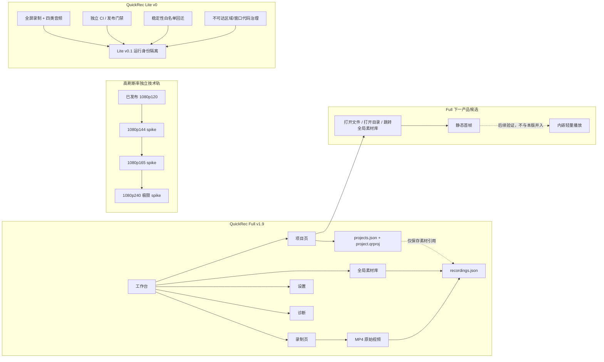

# /idea 需求池：QuickRec Full v1.9 发布后下一阶段

## 追踪信息

- 当前状态：需求池，尚未进入 PRD。
- 入口：`/idea`。
- 评估日期：2026-07-27。
- 产品工作区：
  - QuickRec Full：`E:\codex\QuickRec`
  - QuickRec Lite：`E:\codex\QuickRec-Lite`
- 当前事实：
  - Full 当前正式版本为 `v1.9`，tag 指向提交 `9034e65`。
  - Full 当前 `master` / `test` 均指向 `cc58df9`，工作区干净。
  - Lite 当前分支为 `lite-master`，HEAD 为 `2035900`，工作区干净。
  - Lite `lite-v0` tag 指向提交 `c15940e`。
- 上游依据：
  - `README.md`
  - `doc/current.md`
  - `doc/releases/v1.8/120fps-spike.md`
  - `doc/releases/v1.9/`
  - `doc/archive/ideas/mypm-idea-pool-post-v1.8-2026-07-26.md`
  - Full 与 Lite 当前代码、测试、CI 和打包配置。
- 本文不构成版本承诺，不实现代码，不把三个产品方向合并为同一个版本。

## 入口判断

本轮是 `/idea`，目标是判断问题是否真实、候选方案是否值得继续、当前应该进入 PRD、技术验证还是直接治理。

本轮候选超过 2 个，因此使用 Markdown 需求池承接。项目 Review 和代码缺口只能证明“当前没有某项能力”或“工程边界存在问题”，不能单独证明用户一定需要某个方案。

## 总体判断

### 三条路线必须独立

1. **Full 产品路线**：唯一产品主线推荐为“项目内素材静态首帧识别与基础使用闭环”。静态首帧是主增量，打开文件、打开目录和跳转全局素材库是不可缺少的基础动作，不单独算第二条产品主线。
2. **高刷新率技术路线**：1080p144、165、240 FPS 均只进入分级技术 spike。当前没有证据支持任何档位形成正式版本承诺，也不能把容器标称 FPS 当成真实源更新能力。
3. **Lite v0.1 产品路线**：唯一产品主线为 Full/Lite 运行身份隔离。稳定性回迁、不可达代码治理和独立 CI 只作为支撑项，不允许借机引入 Full 功能。

### 最终分流

- **进入 Full `/prd`**：`FULL-002` 项目内静态首帧识别与基础使用闭环。
- **随 Full PRD 进入工程影响边界**：`FULL-004` 最小职责拆分、`FULL-005` 增量质量门禁。
- **不单独进入 PRD，但作为最低操作基线**：`FULL-001` 打开文件、打开目录和跳转全局素材库。
- **继续验证**：`FULL-003` 内嵌轻量播放。
- **进入独立技术 spike**：`HFR-000` 通用高帧率门禁工具、`HFR-144` 1080p144。
- **按前置结果继续验证**：`HFR-165` 1080p165。
- **暂不做正式能力，仅保留极限验证点**：`HFR-240` 1080p240。
- **进入 Lite v0.1 `/prd`**：`LITE-001` Full/Lite 运行身份隔离。
- **作为 Lite v0.1 支撑项**：`LITE-002` 稳定性能力白名单回迁、`LITE-003` 区域/窗口不可达代码治理。
- **现在直接治理**：`LITE-004` Lite 独立 CI 与发布门禁，以及本文“直接治理”章节中的事实源问题。

## 当前产品与模块关系



## 证据映射

| 证据 | 证据状态 | 支持的判断 |
| --- | --- | --- |
| Full v1.9 项目页的素材表仅包含“文件、状态、模式、路径”，当前操作只有添加和从项目移除 | 已确认 / 强 | 项目已经能归集素材，但不能直接识别和继续使用单条素材 |
| 全局素材库已有“打开”“打开目录”“加入项目”等操作 | 已确认 / 强 | 最小操作能力可复用，不需要重新发明文件操作 |
| Full 打包配置明确排除 `PyQt5.QtMultimedia` 和 `PyQt5.QtMultimediaWidgets` | 已确认 / 强 | 内嵌播放不是简单增加一个按钮，会扩大发布依赖与运行状态 |
| 当前没有项目素材识别耗时、误选率、打开播放器频率等行为数据 | 已确认 / 反证 | “必须做播放器”没有足够用户证据 |
| v1.8 正式门禁只证明 1920×1080@120 FPS；三次源更新和编码交付达到门禁 | 已确认 / 强 | 120 FPS 是已验证基线，144/165/240 尚未被证明 |
| 设置、自检、录制配置和指标阈值均围绕固定的 `120` 实现 | 已确认 / 强 | 新帧率不是添加下拉项，需要通用化门禁和状态模型 |
| 高帧率输入使用 YUV420P 管道，编码器使用 `libx264`，队列上限为 8 | 已确认 / 强 | 更高帧率会直接增加颜色转换、内存带宽、管道和 CPU 编码压力 |
| 没有 144/165/240 的真实源更新、长时音频和文件大小证据 | 已确认 / 反证 | 三个档位只能进入 spike，不能形成产品承诺 |
| Full 和 Lite 都使用 `%APPDATA%\QuickRec\config.json`、`%TEMP%\QuickRec` 和自启动名 `QuickRec` | 已确认 / 强 | 两个产品无法形成可靠的并行安装和运行边界 |
| Full 和 Lite 的可执行文件、包目录、通知身份仍都叫 `QuickRec` | 已确认 / 强 | 进程、通知、安装包和问题反馈身份容易混淆 |
| Lite 没有 `src/version.py`，但 Full 已有单一版本事实源 | 已确认 / 强 | Lite 缺少稳定的运行时和发布版本身份 |
| Lite `main.py` 仍导入区域/窗口选择和高亮模块，打包 spec 仍强制包含这些模块 | 已确认 / 强 | “入口隐藏”没有形成真正的 Lite 代码与包边界 |
| Lite CI 只监听 `master` 和旧基线，不监听 `lite-master` / `lite-test` | 已确认 / 强 | Lite 当前提交缺少独立自动门禁 |
| Lite 已有音频预检和 FFmpeg 基础错误处理 | 已确认 / 反证 | 稳定性回迁必须先做差异审计，不能重复搬运或整体同步 Full |

## 需求总览

| ID | 候选 | 路线 | 证据强度 | 用户价值 | 成本 | 主要风险 | 压力测试 | 当前分流 |
| --- | --- | --- | --- | --- | --- | --- | ---: | --- |
| FULL-001 | 基础打开与跳转动作 | Full | 中 | 中 | 低 | 只能“使用”，不能快速“识别” | 29/40 | 作为最低基线，不单独立项 |
| FULL-002 | 静态首帧 + 基础使用闭环 | Full | 中 | 中高 | 中 | 缩略图缓存、失效和性能 | 31/40 | 推荐进入范围受限的 `/prd` |
| FULL-003 | 内嵌轻量播放 | Full | 弱 | 潜在高 | 高 | 编解码、音频焦点、打包和状态复杂 | 23/40 | 继续验证，暂不进入 PRD |
| FULL-004 | 项目页/素材库/应用最小职责拆分 | Full 支撑 | 强 | 工程高 | 中 | 过度抽象或变相重写 | 34/40 | 随 FULL-002 进入工程边界 |
| FULL-005 | 受影响模块增量质量门禁 | Full 支撑 | 强 | 工程高 | 中低 | 指标好看但遗漏真实链路 | 35/40 | 随 FULL-002 进入工程边界 |
| HFR-000 | 通用高帧率 spike 与门禁工具 | 技术 | 强 | 技术高 | 中 | 工具先行变成架构改造 | 34/40 | 技术验证前置 |
| HFR-144 | 1080p144 正式输出可行性 | 技术 | 中 | 待验证 | 中高 | 源更新和 CPU 编码不足 | 25/40 | 第一档 spike |
| HFR-165 | 1080p165 正式输出可行性 | 技术 | 弱 | 待验证 | 高 | 长时积压和音画漂移 | 19/40 | 仅在 144 通过后验证 |
| HFR-240 | 1080p240 正式输出可行性 | 技术 | 弱 | 待验证 | 极高 | 当前 dxcam + libx264 路线高概率触顶，尚未实测 | 13/40 | 暂不做产品能力，保留极限测试 |
| LITE-001 | Full/Lite 运行身份隔离 | Lite | 强 | 高 | 中 | 旧共享配置迁移和双版本共存 | 37/40 | 推荐进入 Lite v0.1 `/prd` |
| LITE-002 | Full 稳定性能力白名单回迁 | Lite 支撑 | 中强 | 高 | 中 | 误带 Full 产品依赖 | 30/40 | 作为 v0.1 支撑项 |
| LITE-003 | 区域/窗口不可达代码治理 | Lite 支撑 | 强 | 工程中高 | 中 | 误删全屏共享捕获基础 | 32/40 | 作为 v0.1 支撑项 |
| LITE-004 | Lite 独立 CI 与发布门禁 | Lite 支撑 | 强 | 高 | 低 | 同仓分支触发条件配置错误 | 39/40 | 现在直接治理 |

---

# 需求池一：Full 项目内素材使用闭环

## 真实产品问题

Full v1.9 已经解决“素材属于哪个项目”，但还没有解决“用户在项目里如何快速确认这条素材是什么，并继续使用它”。

当前项目页只显示文件名、状态、模式和路径。用户需要离开项目语境或依赖文件名判断内容。这里至少包含两个不同问题：

1. **识别问题**：多条名称相似的素材中，哪一条是自己需要的内容。
2. **使用问题**：确认后如何打开文件、定位目录或回到全局素材库完成更多操作。

三个候选方案不是同等替代关系，而是逐层增加：

```text
FULL-001 基础动作
    -> 解决继续使用，但识别仍依赖文件名
FULL-002 基础动作 + 静态首帧
    -> 同时改善识别和继续使用
FULL-003 基础动作 + 静态首帧/播放界面 + 内嵌播放器
    -> 进一步解决动态内容判断，但引入完整媒体播放状态
```

## FULL-001 只提供打开文件、打开目录和跳转全局素材库

- 输入类型：最小功能方案。
- 证据强度：中。
- 用户价值：中。
- 成本：低。
- 主要风险：它能减少操作步数，但用户仍需逐个打开外部播放器才能识别相似素材。
- 验证依赖：
  - 项目素材行能通过稳定 `material_id` 跳转并选中全局素材。
  - 缺失文件、待关联素材和已归档项目有明确禁用或失败反馈。
  - 20 条相似素材下记录完成识别任务的点击次数和耗时。
- 结论：是真问题的必要底座，但不足以作为下一版本唯一产品主线。
- 最小下一步：把三项操作作为 FULL-002 的基础验收，不单独建立版本。

| 维度 | 分数 | 证据 / 理由 |
| --- | ---: | --- |
| 用户痛点强度 | 3 | 当前项目页确实缺少素材使用动作，但可从全局素材库绕行 |
| 用户/场景清晰度 | 4 | 项目中确认素材后继续操作的场景明确 |
| 证据强度 | 3 | 代码缺口明确，缺少真实点击与误选数据 |
| 频率/紧迫性 | 3 | 重度项目用户会高频发生，轻度用户频率未知 |
| 核心目标贡献 | 4 | 直接补项目使用闭环，但不解决快速识别 |
| 差异化/替代方案 | 2 | 文件系统和全局素材库可以绕行 |
| 成本可控性 | 5 | 现有素材库已有同类动作和文件状态处理 |
| 验证速度 | 5 | 可用小样本项目快速完成 GUI 对比 |

总分 `29/40`，部分通过。它应作为基线，不应包装成一个看似完整的新版本。

## FULL-002 增加静态首帧

- 输入类型：产品方案 / 项目素材识别能力。
- 证据强度：中。
- 用户价值：中高。
- 成本：中。
- 主要风险：
  - 首帧不一定代表视频关键内容。
  - 需要定义缩略图生成、缓存、损坏、失效、文件移动和清理规则。
  - 大量素材同步生成缩略图可能阻塞 UI。
- 验证依赖：
  - 使用已有 FFmpeg/FFprobe 生成静态 PNG，不引入播放器运行时。
  - 以受控的 20 条和 50 条相似素材比较“仅文件名”和“首帧 + 文件名”的识别耗时与误选。
  - 验证中文路径、空格路径、损坏视频、缺失文件、长视频和竖屏视频。
  - 验证缩略图异步加载、缓存上限、缓存失效和 DPI。
- 推荐范围：
  - 项目素材列表或详情中显示静态首帧。
  - 同时提供打开文件、打开目录和跳转全局素材库。
  - 首帧生成失败时保留文本列表和操作能力，不阻断项目打开。
  - 不自动播放、不播放声音、不增加进度条和播放状态。
- 结论：推荐作为 Full 下一版本唯一产品主线进入范围受限的 `/prd`。
- 最小下一步：先确认首帧展示位置、生成时机、缓存位置和失败降级，再编写 PRD。

| 维度 | 分数 | 证据 / 理由 |
| --- | ---: | --- |
| 用户痛点强度 | 4 | 项目内素材识别是项目从“归档”走向“使用”的关键缺口 |
| 用户/场景清晰度 | 4 | 同一项目多次录制、文件名相似的识别场景明确 |
| 证据强度 | 3 | 现状缺口和产品目标明确，缺少行为数据 |
| 频率/紧迫性 | 3 | 对项目用户中高频，对普通录屏用户无影响 |
| 核心目标贡献 | 5 | 直接构成项目内素材使用闭环 |
| 差异化/替代方案 | 4 | 比逐个打开外部播放器更轻，且明显小于内嵌播放 |
| 成本可控性 | 3 | 可复用 FFmpeg，但缓存和异步加载必须收敛 |
| 验证速度 | 5 | 原型与受控素材识别任务能快速给出失败信号 |

总分 `31/40`，部分通过。证据强度为 3，可以进入最小 PRD，但不支持扩大到播放器或时间线。

## FULL-003 增加内嵌轻量播放

- 输入类型：大功能方案。
- 证据强度：弱。
- 用户价值：潜在高，但尚未证实。
- 成本：高。
- 主要风险：
  - 当前打包明确排除 `PyQt5.QtMultimedia`，接入后需要重新验证 Windows 解码后端和分发依赖。
  - 会新增播放、暂停、定位、音量、音频焦点、窗口隐藏、文件缺失、解码失败和多实例状态。
  - 播放器生命周期会与录制音频、托盘、工作台关闭语义产生新耦合。
  - 容易从“轻量确认”滑向预览器、时间线或剪辑器。
- 当前替代方案：系统默认播放器已经能完成完整播放。
- 验证依赖：
  - 先证明静态首帧仍无法满足多数识别任务。
  - 记录项目用户打开外部播放器的频率、耗时和中断程度。
  - 做不进入生产代码的交互原型或最小技术 demo，验证打包体积、解码兼容和音频焦点。
- 结论：当前不进入 PRD，继续验证。
- 进入 PRD 的证据闸门：
  - 静态首帧识别任务失败率仍明显偏高；或
  - 用户需要判断动作、声音或时间段，且外部播放器切换成为稳定高频阻塞。

| 维度 | 分数 | 证据 / 理由 |
| --- | ---: | --- |
| 用户痛点强度 | 4 | 动态内容判断确实可能需要播放 |
| 用户/场景清晰度 | 4 | 识别动作、声音和具体片段的场景明确 |
| 证据强度 | 2 | 没有行为数据证明当前替代方案不可接受 |
| 频率/紧迫性 | 3 | 可能高频，但未测量 |
| 核心目标贡献 | 4 | 能增强项目素材使用，但不是最小解 |
| 差异化/替代方案 | 2 | 系统播放器已经可完成，静态首帧更轻 |
| 成本可控性 | 1 | 编解码、音频、打包和状态范围明显扩大 |
| 验证速度 | 3 | 原型容易，真实打包与兼容验证较慢 |

总分 `23/40`。证据强度小于 3 且成本可控性为 1，触发双重闸门，最高只能进入继续验证。

## FULL-004 项目页、素材库和 QuickRecApp 最小职责拆分

- 输入类型：工程支撑。
- 证据强度：强。
- 当前证据：
  - `src/main.py` 约 1463 行，负责工作台、页面、录制、素材入库和项目联动。
  - `src/ui/project_page.py` 约 1004 行，同时负责查询、展示、文件操作和项目素材联动。
  - `src/ui/material_library_dialog.py` 约 1033 行，既是可嵌入页面又保留对话框语义。
- 用户价值：间接但重要，降低下一功能继续堆入大类后的回归风险。
- 成本：中。
- 风险：把“最小拆分”做成全量架构重写。
- 推荐边界：
  - 抽离项目素材查询/动作协调接口。
  - 页面只负责 UI 状态和用户事件。
  - 复用现有素材服务和项目服务，不复制索引逻辑。
  - 不重写 QuickRecApp、WorkbenchWindow 或 MaterialLibraryDialog。
- 压力测试：`34/40`。
  - 分项：痛点 3、场景 5、证据 5、频率 4、主线贡献 5、替代 4、成本 4、验证 4。
- 结论：通过，作为 FULL-002 的工程支撑边界，不成为第二条产品主线。

## FULL-005 受影响协调模块增量质量门禁

- 输入类型：工程支撑。
- 证据强度：强。
- 用户价值：间接高。
- 成本：中低。
- 风险：只提高数字，不覆盖真实异步缩略图、文件失效和页面切换链路。
- 推荐边界：
  - 新增或修改的项目素材协调、缩略图生成/缓存和页面状态模块，语句覆盖率不低于 80%。
  - 受影响模块进入 Ruff 与 Mypy。
  - 加入真实 FFmpeg 缩略图集成样本和 packaging smoke。
  - GUI 仍需验证 20/50 条素材、失败降级和 100%/125%/150% DPI。
- 压力测试：`35/40`。
  - 分项：痛点 3、场景 5、证据 5、频率 4、主线贡献 5、替代 4、成本 4、验证 5。
- 结论：通过，随 FULL-002 进入工程影响边界。

## Full 三档范围

| 档位 | 内容 | 判断 |
| --- | --- | --- |
| 最小方案 | 只增加打开文件、打开目录、跳转并选中全局素材 | 可直接开发，但不足以成为下一版本主线 |
| 推荐方案 | 最小方案 + 异步静态首帧 + 缓存与失败降级 + 最小职责拆分与质量门禁 | 推荐进入 `/prd` |
| 过大方案 | 推荐方案 + 内嵌播放器 + 时间线/多轨/剪辑/导出队列/AI | 不进入本轮 |

## Full 主线结论

**推荐唯一产品主线：项目内素材静态首帧识别与基础使用闭环。**

这条路线同时解决“看得出是什么”和“确认后继续使用”，又不引入完整播放器状态。内嵌播放保留为后续验证项；只有静态首帧被真实使用证据证明不足时，才重新进入 `/idea`。

---

# 需求池二：高刷新率独立技术验证

## 当前技术基线

已确认的正式能力是单显示器 `1920×1080@120 FPS`。v1.8 技术门禁三次正式重复结果为：

| 运行 | 源更新平均 FPS | 源更新最低 1 秒 | 编码交付平均 FPS | 最大 backlog | 结论 |
| --- | ---: | ---: | ---: | ---: | --- |
| 1 | 120.196 | 119 | 119.996 | 8.732 ms | 通过 |
| 2 | 120.119 | 120 | 119.919 | 8.228 ms | 通过 |
| 3 | 120.363 | 120 | 119.963 | 8.115 ms | 通过 |

当前实现仍然固定围绕 120：

- 设置只提供 `30 / 60 / 120`。
- 自检固定创建 120 FPS 捕获和编码器。
- 能力缓存、提示、录制配置和指标阈值包含 120 专用语义。
- 捕获目标达到 120 后才启用高帧率路径。
- 编码仍使用 `libx264`，高帧率队列上限为 8。

因此 144/165/240 不能只增加三个下拉选项。

## 理论吞吐提示

以下只是 `1920×1080` 单帧数据量乘目标 FPS 的理论吞吐，不是实测性能，也不是最终 H.264 文件大小：

| 目标 | BGR 捕获帧理论吞吐 | YUV420P 管道理论吞吐 | 相对 120 FPS |
| --- | ---: | ---: | ---: |
| 120 | 711.9 MiB/s | 356.0 MiB/s | 1.00× |
| 144 | 854.3 MiB/s | 427.1 MiB/s | 1.20× |
| 165 | 978.9 MiB/s | 489.5 MiB/s | 1.38× |
| 240 | 1423.8 MiB/s | 711.9 MiB/s | 2.00× |

这说明 240 FPS 会把当前颜色转换、内存复制和编码管道推到约 120 FPS 的两倍负载。最终压缩文件大小受画面变化、CRF 和编码效率影响，必须实测，不能按表格直接推算。

## HFR-000 通用高帧率门禁工具

- 输入类型：技术验证支撑。
- 证据强度：强。
- 用户价值：不直接对用户交付，但能避免把“标称 FPS”误判为真实能力。
- 成本：中。
- 风险：工具通用化演变成正式产品配置重写。
- 最小范围：
  - 目标 FPS 参数化。
  - 阈值按目标 FPS 明确定义，不继续硬编码 114/108。
  - 分开记录真实源更新、编码交付和容器 FPS。
  - 记录队列积压、颜色转换耗时、FFmpeg 退出和 FFprobe 结果。
  - 输出隔离证据目录，不写入用户素材索引。
- 压力测试：`34/40`。
  - 分项：痛点 3、场景 5、证据 5、频率 3、主线贡献 4、替代 5、成本 4、验证 5。
- 结论：作为 spike 前置，不作为产品需求。

## HFR-144 1080p144

- 证据强度：中。
- 用户价值：待验证。144Hz 硬件常见不等于用户需要 144 FPS 文件。
- 成本：中高。
- 主要风险：源更新达不到 144、CPU 编码持续积压、长时音画漂移。
- 验证依赖：
  - 真实 `1920×1080@144Hz` 输出环境。
  - 足够动态且可复现的画面源。
  - 三次短门禁、四类音频、10 分钟双音频和 FFprobe。
- 压力测试：`25/40`。
  - 分项：痛点 3、场景 4、证据 3、频率 2、主线贡献 3、替代 3、成本 3、验证 4。
- 结论：部分通过，作为第一档独立 spike，不进入产品 PRD。

## HFR-165 1080p165

- 证据强度：弱。
- 用户价值：待验证。
- 成本：高。
- 主要风险：比 144 更容易出现持续积压、重复帧和长时漂移。
- 前置条件：HFR-144 全部门禁通过，且未通过降低阈值或隐藏失败实现。
- 压力测试：`19/40`。
  - 分项：痛点 2、场景 4、证据 2、频率 2、主线贡献 2、替代 2、成本 2、验证 3。
- 结论：只在 144 通过后继续验证，不独立进入产品版本。

## HFR-240 1080p240

- 证据强度：弱。
- 用户价值：尚无仓库内用户证据。
- 成本：极高。
- 主要风险：
  - 当前管道理论负载约为 120 FPS 的两倍。
  - `libx264` CPU 编码可能成为确定性瓶颈。
  - 8 帧队列在 240 FPS 下只覆盖约 33 ms 的帧量。
  - 长时录制文件体积、温度、系统调度和音画同步风险显著增加。
- 前置条件：165 全部门禁通过。
- 压力测试：`13/40`。
  - 分项：痛点 2、场景 3、证据 1、频率 1、主线贡献 2、替代 1、成本 1、验证 2。
- 结论：当前未通过产品压力测试。只保留为确认现有 `dxcam + libx264` 路线极限的终点，不形成正式承诺。

## 分级验证矩阵

每一档都必须先通过短门禁，再允许进入音频和长时验证：

| 阶段 | 验证内容 | 通过后才能进入 |
| --- | --- | --- |
| S0 | 通用门禁工具、动态源、源更新与编码交付分离 | 144 短门禁 |
| S1 | 144 FPS，5 秒 × 3 次，FFprobe、backlog、文件大小 | 144 四音频 |
| S2 | 144 四类音频各 30 秒，双音频 10 分钟同步 | 165 短门禁 |
| S3 | 165 FPS，重复 S1/S2 | 240 短门禁 |
| S4 | 240 FPS，先做无声短门禁 | 决定是否值得另立硬件编码/WGC 需求池 |

每档必须覆盖：

1. 真实源更新平均值和最低连续 1 秒。
2. 编码交付平均值和最低连续 1 秒。
3. 队列最大积压和持续积压时长。
4. FFmpeg 正常结束，FFprobe 可解析帧率、时长和分辨率。
5. 30 秒与 10 分钟文件大小。
6. 无声、系统声音、麦克风、系统声音 + 麦克风。
7. 双音频 10 分钟起始偏移和漂移增量。
8. 取消、磁盘不足、编码失败和恢复后的环境清理。

## 停止条件

以下任一情况出现，当前档位停止，不通过降阈值把它写成成功：

- 容器 FPS 达标但真实源更新不达标。
- 编码队列持续积压。
- FFmpeg 无法正常结束或文件不可解析。
- 30 秒或 10 分钟录制出现不可接受的音画偏移或漂移。
- 需要引入 NVENC/QSV/AMF/WGC 才能继续。

如果 144 或 165 在 `dxcam + libx264` 下失败，应如实记录当前路线边界。硬件编码或 WGC 必须回到新的 `/idea`，不能在本 spike 中自动扩张。

## 高刷新率结论

- 144：第一优先技术验证档。
- 165：仅在 144 通过后验证。
- 240：仅作为路线极限测试，当前不建议承诺。
- 三档均不进入下一 Full 产品版本，也不进入 Lite。

---

# 需求池三：QuickRec Lite v0.1

## Lite 唯一产品主线

**Full/Lite 运行身份隔离。**

当前 Lite 在功能文档上已经独立，但运行时仍与 Full 共用多个关键身份。只要用户在同一台机器安装或运行两者，就可能出现配置互相覆盖、自启动项互相替换、通知无法区分和发布包误认。

这是真问题，不需要先增加 Lite 功能来证明。

## LITE-001 Full/Lite 运行身份隔离

- 输入类型：产品边界 / 稳定性基础。
- 证据强度：强。
- 用户价值：高。
- 成本：中。
- 主要风险：
  - 旧 Lite v0 与 Full 曾共用 `%APPDATA%\QuickRec`，不能自动搬走或删除旧目录。
  - 改可执行文件名、自启动名和通知身份后要验证升级、卸载和双版本共存。
  - 若迁移规则过宽，可能把 Full 的工作台或素材配置带入 Lite。
- 验证依赖：
  - 同机同时安装 Full 与 Lite。
  - 分别修改配置、启用开机启动、产生通知和录制。
  - 验证两个进程、配置、日志、临时文件和发布产物互不覆盖。
- 压力测试：`37/40`。
  - 分项：痛点 5、场景 5、证据 5、频率 4、主线贡献 5、替代 5、成本 4、验证 4。
- 结论：通过，推荐进入 Lite v0.1 `/prd`。

### 身份隔离范围

| 身份维度 | 当前状态 | v0.1 目标方向 |
| --- | --- | --- |
| 配置目录 | Full/Lite 均为 `%APPDATA%\QuickRec` | Lite 使用独立目录，例如 `%APPDATA%\QuickRec-Lite` |
| 临时目录 | Full/Lite 均可能使用 `%TEMP%\QuickRec` | Lite 使用独立临时目录 |
| EXE/进程名 | 都是 `QuickRec.exe` | Lite 使用可辨识的独立进程名 |
| 分发目录/ZIP | 都容易以 QuickRec 命名 | Lite 产物名称必须包含 `Lite` 和版本 |
| 自启动注册表项 | 都使用 `QuickRec` | Lite 使用独立自启动名 |
| 托盘与通知 | 名称、标题和 `app_id` 仍是 QuickRec | Lite 名称、标题和通知身份明确带 `Lite` |
| 版本事实源 | Lite 没有 `src/version.py` | Lite 建立单一运行时版本事实源 |
| 日志命名空间 | 大量 logger 仍为 `QuickRec` | Lite 日志可以明确辨识产品身份 |
| 发布事实源 | 有 tag 和本地包，无独立 GitHub Release | 定义 Lite 分支、tag、包名和 Release 门禁 |

### 旧配置迁移原则

1. 不移动、不删除 `%APPDATA%\QuickRec`。
2. Lite 首次启动只允许复制白名单配置到新目录。
3. 迁移前明确提示旧目录可能属于 Full。
4. 只复制 Lite 可理解的设置，例如保存路径、音频源和 Lite 快捷键。
5. 不复制 Full 素材库、项目、诊断、自检或工作台状态。
6. 迁移失败时继续使用 Lite 默认配置，不破坏 Full 数据。

## LITE-002 Full 稳定性能力白名单回迁

- 输入类型：工程支撑。
- 证据强度：中强。
- 用户价值：高。
- 成本：中。
- 主要风险：以“稳定性”名义把 Full 产品模块和依赖整体搬入 Lite。
- 当前反证：Lite 已经存在音频预检、FFmpeg 启动失败处理和部分硬件 smoke，不能重复实现。
- 候选白名单：
  1. 配置原子写入、保存失败返回和内存回滚。
  2. 录制结束时的捕获、编码和 FFmpeg 进程释放差异审计。
  3. 音频预检只做行为对齐和回归，不整体复制 Full 音频模块。
  4. FFmpeg 打包存在性、可执行性和基础录制产物检查。
  5. 崩溃或保存失败时保留视频优先的语义日志。
- 明确排除：
  - 工作台、素材库、项目、诊断中心。
  - FFprobe 元数据体系，除非 Lite 的具体门禁证明必需。
  - 120 FPS、自检缓存和高刷新率。
  - Full 配置文件整体复制。
- 压力测试：`30/40`。
  - 分项：痛点 4、场景 4、证据 4、频率 4、主线贡献 4、替代 3、成本 3、验证 4。
- 结论：部分通过，作为 Lite v0.1 支撑项。先做逐文件差异审计，再形成最终白名单。

## LITE-003 区域/窗口不可达代码治理

- 输入类型：工程治理。
- 证据强度：强。
- 用户价值：间接中高。
- 成本：中。
- 当前证据：
  - `src/main.py` 仍导入 AreaSelector、WindowSelector 和 WindowHighlighter。
  - 区域/窗口快捷键桥、回调和录制方法仍存在。
  - `build_std.spec` 仍强制包含区域/窗口相关 UI。
  - 用户入口被裁剪，但代码和打包依赖没有形成相同边界。
- 主要风险：
  - 区域/窗口代码可能与全屏共用捕获、工具栏和保存流程，直接删除可能破坏 Lite 主链路。
- 推荐治理顺序：
  1. 建立 Lite 全屏入口和打包模块可达性测试。
  2. 标记区域/窗口独有模块与共享模块。
  3. 先移除不可达入口、桥接和 hidden imports。
  4. 再删除确认无共享依赖的选择器、高亮和专项测试。
  5. 全量、packaging、硬件 smoke 和四音频回归通过后才算完成。
- 压力测试：`32/40`。
  - 分项：痛点 3、场景 5、证据 5、频率 3、主线贡献 4、替代 4、成本 4、验证 4。
- 结论：通过，作为 Lite v0.1 支撑项；不单独包装成产品版本。

## LITE-004 Lite 独立 CI 与发布门禁

- 输入类型：直接工程治理。
- 证据强度：强。
- 用户价值：高。
- 成本：低。
- 当前问题：
  - Lite CI 只监听 `master` 和 `v1.4-engineering-baseline`。
  - 不监听 `lite-master`、`lite-test` 或 Lite tag。
  - 当前 workflow 仍使用 `actions/checkout@v4` 和 `actions/setup-python@v5`，已有运行时弃用提醒。
- 推荐最小范围：
  - `lite-master` / `lite-test` push。
  - 针对 Lite 分支的 Pull Request。
  - compileall、Ruff、Mypy、pytest + coverage。
  - `lite-test`、`lite-master` 和 `lite-v*` 的 packaging smoke。
  - 包名、EXE 名、版本号、FFmpeg 和身份隔离断言。
  - 更新 GitHub Actions 主版本，关闭 Node 20 弃用提醒。
- 压力测试：`39/40`。
  - 分项：痛点 4、场景 5、证据 5、频率 5、主线贡献 5、替代 5、成本 5、验证 5。
- 结论：通过，现在直接治理；不需要作为独立产品 PRD。

## Lite v0.1 继续排除

以下能力不进入 Lite v0.1：

- 工作台。
- 素材库。
- 项目。
- 诊断中心。
- 区域录制。
- 窗口录制。
- 120 FPS。
- 144/165/240 FPS。
- 高刷新率自检。
- Full 的项目、素材和诊断数据。

## Lite v0.1 三档范围

| 档位 | 内容 | 判断 |
| --- | --- | --- |
| 最小方案 | 配置目录、进程/包名、自启动、通知和版本身份隔离 | 必须完成 |
| 推荐方案 | 最小方案 + 白名单稳定性回迁 + 不可达代码治理 + 独立 CI/发布门禁 | 推荐作为 Lite v0.1 |
| 过大方案 | 推荐方案再加入工作台、素材库、诊断、区域/窗口或高帧率 | 破坏 Lite 定位，不做 |

---

# 现在直接治理

以下问题不需要包装成产品需求：

| 治理项 | 证据 | 动作 | 产品版本关系 |
| --- | --- | --- | --- |
| Full README 测试数据冲突 | 顶部为 `642 passed / 85.76%`，后部仍为 `523 passed / 85.39%` | 统一为 v1.9 正式证据 | 独立文档提交 |
| Full/Lite GitHub Actions 弃用提醒 | workflow 仍使用 `checkout@v4` / `setup-python@v5` | 升级 action 并复跑 CI | 独立 CI 提交 |
| Lite CI 分支触发错误 | 未覆盖 `lite-master` / `lite-test` | 修正分支、PR 和 Lite tag 触发 | Lite v0.1 前置 |
| Lite progress 状态过期 | 仍写“待打包/待合并 tag” | 对齐 `lite-v0` 已完成事实 | 独立文档提交 |
| Lite 文档旧路径 | package report 仍指向 `E:\codex\QuickRec`，部分链接仍是拆分前文件名 | 修正到 `E:\codex\QuickRec-Lite` 与当前 release 目录 | 独立文档提交 |
| 远端仓库产品描述口径 | 默认分支是 Full，但历史描述可能仍强调轻量录屏 | 对齐 Full 主仓与 Lite 分支说明 | 仓库设置治理 |

这些治理项可以先做，但必须使用独立提交，不能混入 Full 产品主线、高刷新率 spike 或 Lite 身份隔离的业务提交。

# 最终路线顺序

## 主序列

1. **直接治理**：修正文档事实源、Actions 版本和 Lite CI 触发。
2. **Full 下一产品版本**：以 FULL-002“项目内静态首帧识别与基础使用闭环”进入 `/prd`；FULL-004/005 只作为两个工程支撑模块。
3. **Lite v0.1**：独立进入 `/prd`，先完成运行身份隔离，再承接稳定性白名单和不可达代码治理。
4. **高刷新率 spike**：使用独立分支、脚本和证据目录，按 144 -> 165 -> 240 的闸门顺序推进，不绑定任何产品版本。

## 可并行边界

高刷新率 spike 可以在 Full PRD 范围锁定后并行取证，但不得：

- 改写 Full 下一产品版本的范围。
- 修改 Lite。
- 因 144/165/240 的技术结果阻塞项目素材闭环。
- 未经新的 `/idea` 和 `/prd` 就进入设置页或正式发布承诺。

# 最终结论

## Full

- 真问题：项目能归集素材，但项目内识别和继续使用仍断裂。
- 推荐主线：**静态首帧 + 打开文件/目录 + 跳转全局素材库**。
- 暂不做：内嵌轻量播放。

## 高刷新率

- 真问题：当前只证明 120 FPS，不能推断 144/165/240。
- 推荐动作：独立、分级、可停止的技术 spike。
- 当前不形成任何新 FPS 产品承诺。

## Lite

- 真问题：文档已拆分，但运行身份尚未真正隔离。
- 推荐主线：**Lite v0.1 运行身份隔离**。
- 支撑项：稳定性白名单、不可达代码治理、独立 CI。
- 继续排除所有 Full 工作台与高帧率能力。

# 最小下一步

1. 用户确认 Full 是否按 `FULL-002` 进入 PRD 澄清。
2. Full PRD 只确认首帧展示、生成/缓存、失败降级和三项基础操作。
3. Lite 使用另一条独立 `/prd` 对话确认身份命名和旧配置迁移。
4. 高刷新率先输出技术 spike 计划，不写产品 PRD。
