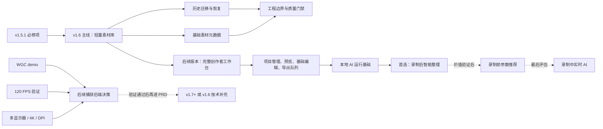

# QuickRec Full v1.6 /idea 需求池

> 日期：2026-07-10
> 来源：QuickRec Full v1.5 深度 Review、v1.5 PRD/验收/发布资料、当前代码、GitHub Actions 失败日志
> 状态：需求发现与价值判断，不是 PRD，不代表已经承诺开发

## 1. 总体判断

- 当前产品阶段：QuickRec Full v1.5 已发布，产品正在从单次录制工具进入“录制结果可管理”的打磨期。
- v1.5.1 前置修复：先修复远端 CI、开机自启测试隔离和诊断版本号，不让发布债进入 v1.6。
- v1.6 唯一推荐主线：**最近录制升级为跨保存路径的轻量素材库**。
- 支撑模块一：历史迁移、损坏恢复、重建和文件重新定位。
- 支撑模块二：围绕本轮改动做必要的模块边界拆分，并扩大 ruff、mypy、coverage 的真实覆盖范围。
- 技术验证项：WGC、120 FPS、多显示器与 4K/DPI，只做可证伪的实验，不承诺进入 v1.6 正式功能。
- 工作台路线：v1.6 只建设完整创作者工作台的素材基础，不在一个版本中一次性交付项目管理、预览、基础编辑和导出队列。
- AI 路线：录制后智能整理是优先候选，但必须等完整创作者工作台验收通过后再实现；v1.6 仅记录产品边界和架构约束，不进入开发验收。
- 暂不做：SQLite、云同步、用户可见捕获后端切换，以及把完整工作台或 AI 能力一次性塞入 v1.6。

### 已确认的 AI 路线决策

- 产品载体：QuickRec Full 桌面创作者工作台，不新建 Web 管理后台。
- 长期运行方式：本地与云端混合；首个 AI 版本只做本地模型，云端仅保留未来扩展边界。
- 首个交付方向：录制后智能整理，包含字幕、摘要、章节和标签。
- 触发方式：用户在素材详情中手动触发，不默认上传、不自动消耗算力。
- 结果保存：写入素材库，同时生成字幕和结构化旁车文件；删除 AI 结果不得影响原视频。
- 模型交付：按需下载，CPU 必须可用，兼容 GPU 时允许自动加速。
- 语言范围：中文为主，兼容中英混合，不承诺首版完整多语言质量。
- 强制前置：项目管理、素材库、预览、基础编辑和导出队列全部完成并通过验收。

## 2. v1.5.1 必修项

这些事项有直接缺陷证据，不进入 v1.6 需求竞争，也不占用 v1.6 主线名额。

| ID | 必修项 | 证据 | 最小修复 | 完成标准 |
| --- | --- | --- | --- | --- |
| FIX-001 | 修复 CI 中开机自启测试失败 | CI #3 在 `tests/test_v1_2.py::TestAutostart::test_enable_and_disable` 失败；测试真实修改 HKCU | 实现安全创建注册表键；测试改为 mock/隔离，不操作真实用户注册表 | 本地与 GitHub Actions 均通过，测试前后用户注册表不变 |
| FIX-002 | 修复诊断版本号仍为 `v1.4.x` | `src/main.py` 固定写入旧版本，测试也固化旧值 | 建立单一版本事实源，诊断、README、构建共用 | v1.5.1 诊断导出显示正确版本 |
| FIX-003 | 发布事实与 Git 状态收口 | 本地 `release-notes.md` 显示修改但工作树哈希与索引相同；Release URL/ZIP SHA 未进入当前事实入口 | 刷新 Git 索引并补充 Release URL、ZIP SHA | `git status` 干净，current 可追踪 Release 与资产 |

## 3. 证据映射

| 来源证据 | 对应候选需求 | 证据等级 | 能支持的判断 | 不能支持的判断 |
| --- | --- | --- | --- | --- |
| v1.5 历史文件随 `save_path` 存放 | IDEA-001、IDEA-002 | 强 | 切换保存路径会切换历史视图，数据天然分散 | 不能证明所有用户都会频繁切换路径 |
| `duration_sec` 可空且当前主流程未写入 | IDEA-003 | 强 | 素材信息不完整 | 不能证明缩略图、标签等高级信息也必须做 |
| `main.py` 712 行、`recorder_manager.py` 803 行，无循环依赖 | IDEA-004 | 强 | 核心编排职责偏多，但现有模块关系仍可理解 | 不能证明需要一次性重构全部代码 |
| coverage 排除 main/UI/真实捕获，ruff/mypy 只覆盖部分文件 | IDEA-005 | 强 | 当前质量门禁存在明显盲区 | 不能把名义覆盖率直接等同于真实风险率 |
| v1.5 WGC spike 与历史窗口/光标问题 | IDEA-006 | 中 | WGC 值得做小实验 | 不能证明 WGC 一定优于 dxcam 或应替换主链路 |
| 设置页只允许 30/60 FPS，dxcam 固定 target 60 | IDEA-007 | 中偏弱 | 当前产品能力上限明确为 60 FPS | 不能证明目标用户确实需要 120 FPS |
| `output_idx=0`、主显示器分辨率 API、历史 4K/DPI 问题 | IDEA-008 | 中 | 当前不支持多显示器选择，4K/DPI 有历史风险 | 缺少当前多显示器/4K 硬件复验和用户频率数据 |

当前缺少的数据：

- 最近录制窗口实际打开频率、保存路径切换频率、缺失记录比例。
- 用户是否需要跨目录找素材，以及当前绕过方式需要多少操作。
- 60 FPS 是否真实限制游戏、高动态内容或慢动作后期场景。
- 多显示器、4K、150%/200% DPI 的真实用户占比和失败率。
- WGC Python/WinRT 方案的打包体积、CPU/GPU、丢帧、窗口兼容数据。

AI 方向当前只有产品规划意图，尚缺少以下证据：

- 用户是否愿意等待本地分析，以及可接受的处理时长。
- 中文和中英混合语音在目标设备上的识别准确率、CPU 占用和内存峰值。
- 摘要、章节和标签是否能减少素材整理时间，以及用户是否会持续使用。
- 本地模型下载大小、失败恢复、模型升级、许可证和离线安装成本。
- 完整创作者工作台的数据模型是否足以承载 AI 任务和结果。

## 4. 需求总览

| ID | 标题 | 类型 | 证据等级 | 分数 | 分档结论 | 建议去向 | 最小下一步 |
| --- | --- | --- | --- | ---: | --- | --- | --- |
| IDEA-001 | 跨保存路径轻量素材库 | 产品主线 | 中强 | 30/40 | 部分通过，可进入最小 PRD | v1.6 主线 | 定义中央索引、旧数据迁移和范围边界 |
| IDEA-002 | 历史迁移、损坏恢复、重建与重新定位 | 数据可靠性 | 强 | 30/40 | 部分通过，作为主线支撑 | v1.6 支撑一 | 先设计恢复状态与迁移回滚 |
| IDEA-003 | 补齐时长、分辨率等元数据 | 产品体验/数据 | 中强 | 30/40 | 部分通过，合并进主线 | v1.6 主线内 | 只补录制时可直接获得的字段 |
| IDEA-004 | 拆分 QuickRecApp / RecorderManager | 技术债 | 强 | 29/40 | 部分通过，必须限定拆分 | v1.6 支撑二 | 只拆本轮会触及的历史服务与最终化边界 |
| IDEA-005 | 扩大 ruff、mypy、coverage 真实覆盖 | 工程质量 | 强 | 38/40 | 通过 | v1.6 支撑二 | 先纳入新增模块和高风险纯逻辑路径 |
| IDEA-006 | WGC 捕获后端最小 demo | 技术实验 | 中 | 24/40 | 部分通过，仅做 spike | 继续验证 | 独立 demo、独立打包、不得接主链路 |
| IDEA-007 | 120 FPS 能力验证 | 性能实验 | 弱 | 20/40 | 信息不足 | 继续验证 | 先定义场景和性能门槛，再做硬件 smoke |
| IDEA-008 | 多显示器与 4K/DPI 兼容性 | 兼容性实验 | 中 | 21/40 | 信息不足 | 继续验证 | 获取硬件/远程测试环境后做矩阵 |
| IDEA-009 | 录制前 AI 参数推荐 | AI 产品候选 | 弱 | 18/40 | 信息不足 | 后续验证 | 先用规则预设验证场景价值，摄像头布局另立基础能力 |
| IDEA-010 | 录制中实时识别、降噪与关键内容捕捉 | AI 产品候选 | 弱 | 14/40 | 未通过当前阶段 | 暂不做 | 先验证录制后处理，避免影响录制稳定性 |
| IDEA-011 | 录制后字幕、摘要、章节与标签 | AI 产品候选 | 弱 | 25/40 | 部分通过，受证据闸门限制 | 工作台完成后验证 | 用本地模型对受控样本做离线原型 |
| IDEA-012 | 本地 AI 模型运行与旁车结果基础 | AI 技术支撑 | 弱 | 22/40 | 信息不足 | 工作台完成后技术验证 | 验证按需下载、CPU 基线、失败恢复和结果格式 |

## 5. 依赖关系



依赖判断：

- v1.5.1 必修项是版本规划前置，不应与 v1.6 同包开发。
- IDEA-001 是产品主线；IDEA-002、IDEA-003 是它的数据基础，不能各自膨胀成独立系统。
- IDEA-004 只能按主线需要做局部拆分；IDEA-005 为拆分和数据迁移提供安全网。
- IDEA-006 至 IDEA-008 不依赖素材库，可以并行研究，但失败不阻塞 v1.6 发布。
- IDEA-009 至 IDEA-012 都不进入 v1.6 开发范围；IDEA-011 是 AI 方向的首选价值验证项。
- 完整创作者工作台是 AI 的产品前置，稳定素材 ID、元数据和旁车文件约定是技术前置。
- 摄像头布局依赖尚不存在的摄像头采集与画面编排能力，不能伪装成“AI 参数推荐”的一个字段。

## 6. 三档范围方案

| 档位 | 内容 | 优点 | 风险 | 判断 |
| --- | --- | --- | --- | --- |
| 最小方案 | 仅修 v1.5.1；v1.6 只做中央历史索引和旧 JSON 迁移 | 风险最低，最快形成跨路径价值 | 素材信息仍偏薄，缺失文件处理不完整 | 可作为时间受限备选 |
| 推荐方案 | 中央索引 + 旧数据迁移/恢复/重建 + 重新定位 + 时长/分辨率基础元数据 + 必要质量门禁 | 完整解决“录制结果散落且不可持续管理”，延续 v1.5 主线 | 需要严格控制数据迁移和 UI 范围 | 推荐进入 `/prd` |
| 过大方案 | 推荐方案 + SQLite + 完整工作台 + 本地模型运行时 + 字幕/摘要/章节/标签 + 实时 AI + WGC + 120 FPS + 多显示器 | 看起来完整 | 范围失控，录制稳定性、工作区和 AI 三条高风险链路互相阻塞 | 不建议 |

## 7. 需求详情

### IDEA-001 跨保存路径轻量素材库

- 原始输入：最近录制升级为跨保存路径的轻量素材库。
- 输入类型：产品需求 / 工作流效率。
- 产品问题：用户切换保存路径后，看不到此前路径中的最近录制；Full 的“素材入库”无法形成连续入口。
- 目标用户 / 场景：需要多目录保存录屏、回找最近素材、继续打开或整理录制结果的 Full 用户。
- 当前替代方案：在资源管理器中逐目录查找，或反复切换 QuickRec 保存路径。
- 证据盘点：实现和 PRD 均确认历史按当前保存路径读取；v1.5 release notes 已将其列为限制。缺少真实打开频率和多用户反馈。
- 价值判断：中高价值，是 v1.5 “素材入库地基”的自然下一步。
- 当前阶段：适合 Full v1.6 打磨期。
- 依赖关系：依赖 IDEA-002；包含 IDEA-003 的最小字段集。
- 结论：作为 v1.6 唯一产品主线进入最小 PRD。
- 最小下一步：定义中央 JSON 索引位置、目录来源、去重规则、v1.5 迁移和非目标。

| 维度 | 分数 | 证据 / 理由 |
| --- | ---: | --- |
| 痛点强度 | 4 | 历史分散会破坏素材连续性，但不影响视频本身保存。 |
| 人群 / 场景清晰度 | 4 | 多保存路径、回找素材场景明确。 |
| 证据强度 | 3 | 实现限制已确认，缺少使用频率和多用户反馈。 |
| 频率 / 紧迫性 | 3 | 对频繁切换目录的用户明显，其他用户较低频。 |
| 核心目标贡献 | 5 | 直接延续 Full 创作者工作台地基。 |
| 差异化 / 替代方案 | 4 | 中央索引是合理小解，比数据库和完整项目库轻。 |
| 成本可控性 | 3 | 可用 JSON 完成，但需要兼容迁移和去重。 |
| 验证速度 | 4 | 用两个保存目录和旧版 JSON 即可快速验收。 |

总分：30/40。证据和成本均达到 3 分，可进入范围受控的 PRD。

### IDEA-002 历史迁移、损坏恢复、重建与文件重新定位

- 原始输入：历史索引迁移、损坏恢复、重建与文件重新定位。
- 输入类型：数据可靠性 / 信任。
- 产品问题：v1.5 JSON 损坏后加载失败；下一次新增记录会以空列表继续保存，旧索引可能被覆盖。文件移动后只能显示缺失或移除，不能恢复关联。
- 目标用户 / 场景：升级 v1.6、移动视频、历史文件损坏或改变目录结构的用户。
- 当前替代方案：手动找文件、移除索引，或放弃旧历史；视频文件本身不受影响。
- 证据盘点：代码路径可直接证明损坏加载和后续保存行为；缺失状态已有用户验收。
- 价值判断：中高价值，但必须作为素材库支撑，不做独立“恢复中心”。
- 当前阶段：适合与 IDEA-001 同版。
- 依赖关系：前置于中央索引正式切换。
- 结论：进入 v1.6 支撑模块。
- 最小下一步：定义备份、隔离损坏文件、迁移幂等、目录扫描上限、重新定位交互和回滚。

| 维度 | 分数 | 证据 / 理由 |
| --- | ---: | --- |
| 痛点强度 | 4 | 索引丢失不损坏视频，但会损害素材管理信任。 |
| 人群 / 场景清晰度 | 4 | 升级、移动文件、JSON 损坏场景明确。 |
| 证据强度 | 4 | 代码行为和缺失状态均已确认。 |
| 频率 / 紧迫性 | 2 | 属于低频高风险边界。 |
| 核心目标贡献 | 5 | 决定素材库是否可长期维护。 |
| 差异化 / 替代方案 | 4 | 备份、重建、重新定位是比数据库更小的方案。 |
| 成本可控性 | 3 | 可拆为迁移、恢复、重新定位三个小任务。 |
| 验证速度 | 4 | 可用受控损坏 JSON 和移动文件快速验证。 |

总分：30/40。频率低，但证据强且直接支撑主线，作为支撑项通过。

### IDEA-003 补齐时长、分辨率等素材元数据

- 原始输入：补齐时长、分辨率等素材元数据。
- 输入类型：产品体验 / 数据完整性。
- 产品问题：当前记录已有 `duration_sec` 字段但主流程未传值，最近录制难以承担素材识别任务。
- 目标用户 / 场景：在多个相似文件中快速判断哪条录制值得打开。
- 当前替代方案：逐个打开视频，或只凭文件名、时间和大小判断。
- 证据盘点：字段和 UI 缺口已确认；尚无证据支撑缩略图、标签、收藏等扩展字段。
- 价值判断：中价值，适合作为 IDEA-001 的字段补齐，不单独立项。
- 当前阶段：适合 v1.6。
- 依赖关系：由录制会话在保存时提供，不应依赖额外 `ffprobe` 扫描全部视频。
- 结论：合并进主线。
- 最小下一步：只记录录制时已经知道的时长、输出宽高、FPS、模式、音频和文件大小。

| 维度 | 分数 | 证据 / 理由 |
| --- | ---: | --- |
| 痛点强度 | 3 | 不阻塞使用，但影响素材识别效率。 |
| 人群 / 场景清晰度 | 4 | 多条录制结果比较场景清楚。 |
| 证据强度 | 3 | 字段缺口明确，用户使用价值尚缺行为数据。 |
| 频率 / 紧迫性 | 4 | 每条录制都会产生元数据。 |
| 核心目标贡献 | 4 | 让“最近录制”真正接近轻量素材库。 |
| 差异化 / 替代方案 | 3 | 可打开视频查看，但效率较低。 |
| 成本可控性 | 4 | 优先使用录制时已有信息，避免额外解析依赖。 |
| 验证速度 | 5 | 新录制一条即可核对 JSON 与 UI。 |

总分：30/40。通过范围闸门，但必须并入主线，不扩为媒体分析系统。

### IDEA-004 拆分 QuickRecApp / RecorderManager

- 原始输入：拆分 QuickRecApp / RecorderManager。
- 输入类型：工程治理 / 维护成本。
- 产品问题：新增历史、诊断或捕获后端时都需要继续修改大型编排类，回归面扩大。
- 目标用户 / 场景：项目维护者和后续开发模型进行版本迭代。
- 当前替代方案：继续在现有类中增加方法，依靠大量 mock 测试保护。
- 证据盘点：两个文件分别约 712/803 行；内部模块无循环依赖，说明可以增量拆分而不必推倒重来。
- 价值判断：中高维护价值，但“全面重构”成本不可控。
- 当前阶段：只允许作为 v1.6 主线的局部支撑。
- 依赖关系：与 IDEA-005 同步；优先抽取历史服务、版本信息和录制最终化边界。
- 结论：限定拆分，不能独立成为 v1.6 主线。
- 最小下一步：只拆本轮会修改的职责，每次拆分要求行为测试保持不变。

| 维度 | 分数 | 证据 / 理由 |
| --- | ---: | --- |
| 痛点强度 | 4 | 已影响新增功能的理解和回归成本。 |
| 人群 / 场景清晰度 | 4 | 维护者与版本开发场景清楚。 |
| 证据强度 | 5 | 文件规模、职责和依赖图均有直接证据。 |
| 频率 / 紧迫性 | 4 | 每次新增能力都会触及。 |
| 核心目标贡献 | 4 | 支撑素材库和未来捕获后端，但不直接产生用户价值。 |
| 差异化 / 替代方案 | 3 | 可继续堆代码，但维护风险上升。 |
| 成本可控性 | 2 | 全量重构风险高，触发拆小闸门。 |
| 验证速度 | 3 | 可依靠现有测试验证局部拆分。 |

总分：29/40。成本 2 分触发拆小要求，只允许局部承接。

### IDEA-005 扩大 ruff、mypy、coverage 真实覆盖

- 原始输入：扩大 ruff、mypy、coverage 的真实覆盖范围。
- 输入类型：工程质量 / 发布信任。
- 产品问题：当前名义 coverage 超过 80%，但 `main.py`、UI、音频捕获和屏幕捕获被排除；mypy 只检查 9 个文件。CI 又在发布后出现红灯。
- 目标用户 / 场景：维护者提交、合并和发布版本时需要可信门禁。
- 当前替代方案：依赖本地定向测试和大量 GUI/硬件人工验收。
- 证据盘点：配置、CI 失败和本地覆盖报告均提供强证据。
- 价值判断：高价值。
- 当前阶段：v1.5.1 先修红灯，v1.6 继续扩大真实覆盖。
- 依赖关系：支撑 IDEA-002 和 IDEA-004。
- 结论：进入 v1.6 支撑模块，但按模块逐步纳入，不追求一次全覆盖。
- 最小下一步：先纳入 `recording_history.py`、最近录制 UI 的纯逻辑、版本源和拆分后的服务层。

| 维度 | 分数 | 证据 / 理由 |
| --- | ---: | --- |
| 痛点强度 | 5 | 发布提交 CI 已失败，直接影响发布信任。 |
| 人群 / 场景清晰度 | 5 | 每次提交、合并和发布都会触发。 |
| 证据强度 | 5 | CI、配置和本地报告均可审计。 |
| 频率 / 紧迫性 | 5 | 当前已经发生，不是未来假设。 |
| 核心目标贡献 | 5 | 直接保障数据迁移和架构调整。 |
| 差异化 / 替代方案 | 4 | 人工验收不能替代静态与自动化门禁。 |
| 成本可控性 | 4 | 可按模块逐步取消排除。 |
| 验证速度 | 5 | 本地与 CI 可即时验证。 |

总分：38/40。通过，v1.5.1 与 v1.6 分阶段承接。

### IDEA-006 WGC 捕获后端最小 demo

- 原始输入：WGC 捕获后端最小 demo。
- 输入类型：技术方案验证。
- 产品问题：dxcam 在窗口移动、DPI、多显示器和原生光标方面存在历史边界，但尚未证明 WGC 能以可接受成本改善。
- 目标用户 / 场景：窗口录制、教程录制、复杂 DPI/窗口场景用户。
- 当前替代方案：继续使用 dxcam、窗口移动冻结和不绘制自绘光标。
- 证据盘点：历史问题和官方 API 能力是中等证据；缺少 Python demo、性能和打包数据。
- 价值判断：待验证偏中价值。
- 当前阶段：只适合独立 spike。
- 依赖关系：未来若通过，需先有捕获后端接口；不依赖 v1.6 素材库。
- 结论：继续验证，不进入 v1.6 正式 PRD。
- 最小下一步：单文件 demo 验证窗口移动、系统光标、遮挡、最小化、FPS 和 PyInstaller。

| 维度 | 分数 | 证据 / 理由 |
| --- | ---: | --- |
| 痛点强度 | 3 | 历史窗口/光标问题真实，但 v1.5 已有可接受降级。 |
| 人群 / 场景清晰度 | 3 | 窗口录制用户明确，频率未知。 |
| 证据强度 | 3 | 有历史问题和 API 线索，无可运行 demo。 |
| 频率 / 紧迫性 | 2 | 当前默认链路已可发布。 |
| 核心目标贡献 | 3 | 改善捕获体验，但不是素材库主线。 |
| 差异化 / 替代方案 | 3 | dxcam 冻结策略仍可继续使用。 |
| 成本可控性 | 3 | 限定 demo 可控，正式替换不可控。 |
| 验证速度 | 4 | 最小 demo 可较快证伪。 |

总分：24/40。只通过 spike，不进入功能 PRD。

### IDEA-007 120 FPS 能力验证

- 原始输入：120 FPS 能力验证。
- 输入类型：性能需求 / 技术实验。
- 产品问题：当前设置和捕获链路上限为 60 FPS；尚不清楚用户是否需要高动态录制或慢动作素材。
- 目标用户 / 场景：高刷新率游戏、高动态操作、后期慢放用户；当前用户规模未知。
- 当前替代方案：60 FPS 录制。
- 证据盘点：能力上限有直接代码证据，用户价值主要来自单次历史讨论，没有性能数据。
- 价值判断：待验证。
- 当前阶段：不进入 v1.6 正式功能。
- 依赖关系：需先验证捕获、编码、磁盘、音频同步和硬件门槛。
- 结论：继续验证。
- 最小下一步：选 1080p 和原生分辨率各做 30/60/120 FPS 对比，记录实际帧数、丢帧、CPU/GPU、文件大小和音画同步。

| 维度 | 分数 | 证据 / 理由 |
| --- | ---: | --- |
| 痛点强度 | 2 | 目前没有证据证明 60 FPS 造成明显不可用。 |
| 人群 / 场景清晰度 | 3 | 高动态场景可描述，但目标用户规模未知。 |
| 证据强度 | 2 | 只有能力上限和单次意向，触发证据闸门。 |
| 频率 / 紧迫性 | 2 | 当前发布能力可用。 |
| 核心目标贡献 | 2 | 与素材库主线弱相关。 |
| 差异化 / 替代方案 | 3 | 60 FPS 对多数录屏场景已足够。 |
| 成本可控性 | 3 | 实验可控，正式支持会扩大性能矩阵。 |
| 验证速度 | 3 | 有合适硬件即可验证。 |

总分：20/40。证据强度 2 分，最高只能判定为继续验证。

### IDEA-008 多显示器与 4K/DPI 兼容性

- 原始输入：多显示器与 4K/DPI 兼容性。
- 输入类型：兼容性需求 / 技术验证。
- 产品问题：当前固定 `output_idx=0`，原生分辨率也只读取主显示器；历史上出现过 4K/DPI 和窗口缩放问题。
- 目标用户 / 场景：多屏办公、4K 显示器、150%/200% 缩放、跨屏窗口录制用户。
- 当前替代方案：只录主显示器，手动把窗口移到主屏，或使用 1080p 输出。
- 证据盘点：代码边界和历史问题明确；当前缺少 4K/多屏硬件环境和失败率数据。
- 价值判断：可能有价值，但证据不足。
- 当前阶段：先建立硬件矩阵，不进入 v1.6 正式 PRD。
- 依赖关系：与 WGC demo 共享验证矩阵，但不能绑定 WGC 方案。
- 结论：继续验证。
- 最小下一步：通过真实硬件或远程测试机完成双屏、4K、150%/200% DPI 的 dxcam 基线记录，再决定需求。

| 维度 | 分数 | 证据 / 理由 |
| --- | ---: | --- |
| 痛点强度 | 3 | 对目标用户影响明显，但当前可回退主屏/1080p。 |
| 人群 / 场景清晰度 | 3 | 场景明确，用户占比未知。 |
| 证据强度 | 3 | 有代码和历史问题，缺当前硬件复现。 |
| 频率 / 紧迫性 | 2 | 当前测试环境无法证明高频。 |
| 核心目标贡献 | 3 | 属于 Full 捕获完整性，但不是本轮素材主线。 |
| 差异化 / 替代方案 | 3 | 主屏录制和降分辨率可临时替代。 |
| 成本可控性 | 2 | 多硬件、多 DPI、跨屏矩阵较大。 |
| 验证速度 | 2 | 当前缺少目标硬件，触发验证优先闸门。 |

总分：21/40。成本和验证速度均为 2 分，只保留为验证项。

### IDEA-009 录制前 AI 参数推荐

- 原始输入：AI 根据场景自动配置分辨率、音频设置和摄像头布局。
- 输入类型：AI 产品方案 / 录制前体验。
- 产品问题：非专业用户可能不知道会议、课程、演示或游戏场景应选择什么参数，但当前没有配置失败率或用户反馈证明这是高频痛点。
- 当前替代方案：场景预设、推荐默认值和参数说明可以用更低成本解决大部分问题。
- 证据盘点：只有产品规划意图；当前项目没有摄像头采集与布局链路，因此“摄像头布局”不能纳入首轮参数推荐。
- 价值判断：可能有价值，但 AI 未必是最小解。
- 当前阶段：完整工作台完成后再验证，不进入 v1.6。
- 结论：信息不足，先验证规则预设是否已经足够。
- 最小下一步：整理 3 个高频录制场景，比较固定预设、规则推荐和模型推荐的差异。

| 维度 | 分数 | 证据 / 理由 |
| --- | ---: | --- |
| 痛点强度 | 2 | 尚无参数配置导致失败或放弃录制的数据。 |
| 人群 / 场景清晰度 | 3 | 会议、课程和演示场景可描述。 |
| 证据强度 | 1 | 当前仅有产品意图。 |
| 频率 / 紧迫性 | 1 | v1.5 已能通过默认参数完成录制。 |
| 核心目标贡献 | 3 | 长期可降低配置门槛，但不是工作区基础主线。 |
| 差异化 / 替代方案 | 2 | 场景预设和规则引擎是更小替代方案。 |
| 成本可控性 | 3 | 仅做推荐可控，自动改参数与摄像头布局不可控。 |
| 验证速度 | 3 | 可用静态原型和场景任务快速比较。 |

总分：18/40。证据强度 1 分触发证据闸门，只能进入后续验证。

### IDEA-010 录制中实时识别、降噪与关键内容捕捉

- 原始输入：录制时实时语音识别、降噪和关键内容捕捉。
- 输入类型：AI 产品方案 / 实时媒体处理。
- 产品问题：用户可能希望边录边得到文本和重点，但当前没有证据说明实时结果比录制后处理更有价值。
- 当前替代方案：保持录制链路稳定，结束后异步识别、降噪分析和提取重点。
- 证据盘点：只有方向设想；没有延迟、资源占用、降噪质量、音画同步或目标硬件数据。
- 价值判断：长期可能有价值，当前风险明显高于收益证据。
- 当前阶段：不进入 v1.6，也不作为首个 AI 版本。
- 结论：当前未通过，待录制后智能整理验证成功后重新判断。
- 最小下一步：未来只做独立离线样本实验，不接入实时录制线程。

| 维度 | 分数 | 证据 / 理由 |
| --- | ---: | --- |
| 痛点强度 | 2 | 尚未证明用户必须在录制中看到结果。 |
| 人群 / 场景清晰度 | 3 | 会议和课程场景明确，但任务优先级未知。 |
| 证据强度 | 1 | 没有用户、性能或质量证据。 |
| 频率 / 紧迫性 | 1 | 不做不影响当前录制主链路。 |
| 核心目标贡献 | 2 | 与未来 AI 方向相关，但会威胁录制稳定性。 |
| 差异化 / 替代方案 | 2 | 录制后异步处理是明显更小方案。 |
| 成本可控性 | 1 | 实时音频、模型推理和录制资源竞争风险高。 |
| 验证速度 | 2 | 需要多硬件、长录制和音画同步矩阵。 |

总分：14/40。成本与证据均未过门槛，当前不建议推进。

### IDEA-011 录制后字幕、摘要、章节与标签

- 原始输入：录制完成后自动分析内容，生成摘要、字幕、章节和标签。
- 输入类型：AI 产品候选 / 素材整理效率。
- 产品问题：长录制完成后难以快速理解、检索和复用，创作者需要重复播放并手工整理。
- 目标用户 / 场景：完成课程、演示、访谈或会议录制后，在素材详情中主动整理单条视频。
- 当前替代方案：外部转写工具、播放器手工定位、人工写摘要和文件名。
- 证据盘点：与创作者工作台方向一致，场景清晰；但没有真实整理耗时、使用频率或本地模型效果数据。
- 已确认范围：首版本地处理、手动触发、中文为主兼容中英混合，输出字幕和结构化旁车文件。
- 价值判断：四项 AI 候选中优先级最高，但仍需原型验证。
- 当前阶段：完整工作台验收通过后再进入技术原型，不进入 v1.6 正式 PRD。
- 结论：部分通过，受证据闸门限制。
- 最小下一步：用 5 类受控录制样本评估字幕准确率、章节可用性、摘要忠实度、标签有效率和整理耗时变化。

| 维度 | 分数 | 证据 / 理由 |
| --- | ---: | --- |
| 痛点强度 | 3 | 长视频整理成本客观存在，但尚无本项目用户数据。 |
| 人群 / 场景清晰度 | 4 | 创作者在录制完成后的素材整理场景明确。 |
| 证据强度 | 2 | 有产品路线和明确场景，缺真实用户与效果数据。 |
| 频率 / 紧迫性 | 3 | 对重度录制用户可能高频，对轻度用户未知。 |
| 核心目标贡献 | 4 | 直接支持完整创作者工作台的素材复用价值。 |
| 差异化 / 替代方案 | 3 | 外部工具可替代，但会打断本地工作流。 |
| 成本可控性 | 2 | 四类结果、模型管理和硬件差异仍需拆分验证。 |
| 验证速度 | 4 | 可先对固定视频离线跑模型，无需接录制主链路。 |

总分：25/40。证据强度 2 分，最高只能判定为小范围验证，不能直接进入完整 PRD。

### IDEA-012 本地 AI 模型运行与旁车结果基础

- 原始输入：混合 AI 架构，首版只使用按需下载的本地模型，CPU 可运行并支持 GPU 加速。
- 输入类型：AI 技术支撑 / 发布与资源治理。
- 产品问题：若没有统一模型生命周期和任务状态，AI 功能会污染主安装包、阻塞 UI，并产生不可恢复的半成品结果。
- 当前替代方案：让用户手动安装模型或依赖外部工具，但使用门槛和可维护性较差。
- 证据盘点：边界已由产品决策确认；尚无模型选型、许可证、包体、CPU 耗时、GPU 兼容和失败恢复数据。
- 价值判断：是 IDEA-011 的必要支撑，不应独立包装成用户功能。
- 当前阶段：完整工作台完成后做技术验证，不进入 v1.6。
- 结论：信息不足，先定义接口和数据兼容约束，不提前实现空框架。
- 最小下一步：验证一个按需下载模型在 CPU 环境下的下载、校验、取消、恢复、删除和单文件离线处理闭环。

| 维度 | 分数 | 证据 / 理由 |
| --- | ---: | --- |
| 痛点强度 | 3 | 模型管理失败会直接破坏 AI 功能可用性。 |
| 人群 / 场景清晰度 | 4 | 首次使用、离线处理和释放磁盘空间场景明确。 |
| 证据强度 | 2 | 有明确产品决策，缺真实模型与硬件测试。 |
| 频率 / 紧迫性 | 2 | 在 AI 实现前不紧迫。 |
| 核心目标贡献 | 4 | 是本地 AI 能力的基础。 |
| 差异化 / 替代方案 | 2 | 手动安装可替代，但体验和维护较差。 |
| 成本可控性 | 2 | 下载、校验、硬件后端和许可证带来持续维护成本。 |
| 验证速度 | 3 | 单模型闭环可以独立 spike。 |

总分：22/40。证据不足且成本仅 2 分，只进入工作台完成后的技术验证。

## 8. 最终分流

### v1.5.1 必修

- FIX-001 CI / 开机自启实现与测试隔离。
- FIX-002 统一版本事实源，修复诊断版本号。
- FIX-003 Git 状态与发布事实收口。

### 进入 v1.6 `/prd`

- 主线：IDEA-001 跨保存路径轻量素材库。
- 主线内字段：IDEA-003 的时长、分辨率、FPS、模式、音频、文件大小。
- 支撑一：IDEA-002 的迁移、备份、损坏恢复、重建和重新定位。
- 支撑二：IDEA-004 的最小必要拆分 + IDEA-005 的质量门禁扩展。

### 继续验证

- IDEA-006 WGC demo。
- IDEA-007 120 FPS。
- IDEA-008 多显示器与 4K/DPI。
- IDEA-009 录制前 AI 参数推荐：完整工作台完成后，优先用规则预设与 AI 推荐做对比验证。
- IDEA-011 录制后字幕、摘要、章节与标签：完整工作台完成后的首选 AI 原型。
- IDEA-012 本地 AI 运行基础：随 IDEA-011 做单模型技术验证，不提前建设平台。

### 暂不做

- SQLite 或其他数据库。
- 缩略图批量生成和媒体分析中心。
- 在 v1.6 一次性交付完整工作台、基础编辑和导出队列。
- IDEA-010 录制中实时识别、降噪与关键内容捕捉。
- 摄像头采集与布局、云端 AI、账号、计费和内容上传。
- 收藏、云同步和完整媒体分析中心。
- dxcam/WGC 用户可见切换。
- 将 120 FPS、多显示器和 WGC 同时塞进 v1.6 发布范围。

### 后续产品路线

1. v1.6 建立跨路径素材库、可靠索引和完整元数据，作为工作区数据基础。
2. 后续版本逐步完成项目管理、素材预览、基础编辑和导出队列，并独立验收完整创作者工作台。
3. 工作台通过验收后，先验证 IDEA-012 本地运行基础与 IDEA-011 录制后智能整理。
4. 录制后整理证明真实价值后，再判断 IDEA-009 录制前推荐是否需要 AI。
5. IDEA-010 实时 AI 最后评估，不得影响录制稳定性和原始素材保存。

## 9. 进入 `/prd` 的推荐范围

推荐 PRD 名称：**QuickRec Full v1.6 轻量素材库基础版**。

PRD 应定义：

1. 中央素材索引的存储位置、字段和上限。
2. v1.5 分目录历史向中央索引的兼容迁移和幂等规则。
3. JSON 损坏备份、恢复失败反馈和不覆盖旧索引原则。
4. 文件缺失后的重新定位、目录重建和去重。
5. 录制时直接写入时长、分辨率、FPS、模式、音频和大小。
6. 最近录制窗口升级后的入口、列表、空状态、失败状态和取消/关闭行为。
7. 只为本轮需求做必要的服务层拆分与质量门禁扩展。

PRD 明确不做：

- 数据库、云同步、剪辑、导出队列、项目系统和完整工作台的一次性交付。
- 本地模型下载、AI 任务、字幕、摘要、章节、标签和任何云端 AI 接口。
- WGC、120 FPS、多显示器正式支持。
- 全量重写 QuickRecApp / RecorderManager。

进入 PRD 前还需用户确认：

1. 中央索引是否默认位于 `%APPDATA%\QuickRec\recordings.json`。
2. 是否只自动迁移当前保存路径，还是允许用户选择其他旧保存目录导入。
3. “重新定位”是选择单个文件，还是允许选择目录批量重建；推荐先支持目录重建 + 单项重新定位。
4. 素材库是否仍限制最近 50 条；推荐中央索引提升到 200 条，但 UI 默认只展示最近 50 条。

## 10. 下一阶段建议

- 推荐下一步：先完成 v1.5.1 最小修复和 CI 绿灯，再进入 v1.6 PRD 澄清。
- 需要准备：本需求池、v1.5 PRD、当前 `recordings.json` 样本、两个不同保存路径的迁移样本。
- 风险：如果不先修 CI 和版本事实，v1.6 的数据迁移与架构改动会建立在不可信门禁上。
- AI 路线判断：本轮只沉淀后续约束，不为尚未验证的模型能力预建空 UI、空服务或配置项。

可直接发送的提示词：

```text
mypm /prd

项目：E:\codex\QuickRec
需求池：doc/archive/ideas/mypm-idea-pool-v1.6-2026-07-10.md

请为“QuickRec Full v1.6 轻量素材库基础版”进入 PRD 澄清阶段，先不要直接写完整 PRD。

推荐范围：
- 唯一主线：跨保存路径中央素材索引。
- 支撑一：v1.5 历史迁移、损坏恢复、重建和文件重新定位。
- 支撑二：最小必要模块拆分与质量门禁扩展。
- 元数据：时长、分辨率、FPS、模式、音频、文件大小。

明确不做：
- SQLite、云同步、剪辑、导出队列、完整工作台的一次性交付。
- AI 模型、字幕、摘要、章节、标签和实时 AI；仅保留未来兼容的数据边界。
- WGC、120 FPS、多显示器正式支持。
- 全量重写 QuickRecApp / RecorderManager。

请先通过提问确认中央索引位置、迁移目录范围、重新定位方式和历史保留上限。任何不明确的地方都必须向我提问。
```
