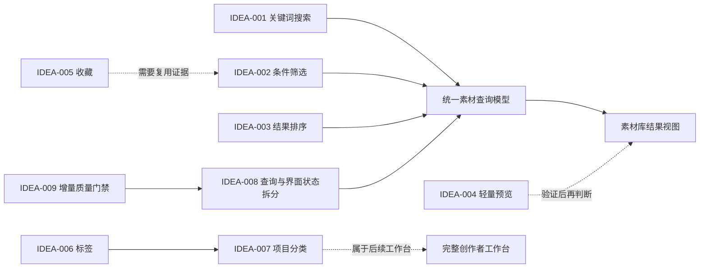

# QuickRec Full v1.7 素材发现与轻整理需求池

## 追踪信息

- 当前状态：`/idea` 需求池，待用户确认分流
- 目标版本：QuickRec Full v1.7
- 上游来源：本次项目深度 Review 的 `REV-1704`、`REV-1705`、`REV-1706`、`REV-1709`
- 上游文件：`doc/current.md`、`doc/archive/ideas/mypm-idea-pool-post-v1.6-2026-07-15.md`
- 下游承接：用户确认后，仅将推荐主线和两个工程支撑模块送入 `/prd`
- 当前事实源：当前代码、`doc/current.md`、`doc/releases/v1.6.1/`、v1.6.1 受控验收索引与截图
- 最后更新：2026-07-17

## 1. 总体判断

### 1.1 版本主线

v1.7 推荐只保留一个产品主线：

> **素材发现与轻整理：让用户在最多 200 条、跨多个保存路径的中央素材中，更快找到目标录制。**

推荐主线由三个紧密相连的动作构成：

1. 搜索：用户已知道文件名或路径线索时，直接缩小结果。
2. 筛选：用户只知道状态、录制模式、音频、来源或时间范围时，按条件缩小结果。
3. 排序：用户需要在结果中找到最新、最早、最长或最大的素材时，改变观察顺序。

这三项共同解决同一个任务，不拆成三个版本，也不扩张为完整工作台。

### 1.2 工程支撑上限

v1.7 最多保留两个工程支撑模块：

1. **素材查询与界面状态最小拆分**：避免继续把查询、分页、选中态和操作反馈堆入 700 行的 `MaterialLibraryDialog`。
2. **受影响模块质量门禁扩展**：只覆盖本次新增查询、状态和 UI 协调代码，不在一个版本中清完全部历史技术债。

### 1.3 为什么不是其他方向

- 轻量预览有潜在价值，但当前“打开文件”已经提供替代路径，尚无证据证明内嵌预览能显著减少整理时间。
- 收藏、标签和项目分类都需要用户主动维护新状态；当前没有真实整理行为、复用频率或分类失败证据。
- 项目分类会引入项目生命周期、素材归属、迁移和删除语义，是完整工作台的数据模型，不是轻量分类控件。
- AI、剪辑、导出队列、云同步、WGC 和 120 FPS 与本版“找到已有素材”的任务无直接依赖，明确排除。

### 1.4 当前分流

- 推荐进入 `/prd`：`IDEA-001` 搜索、`IDEA-002` 筛选、`IDEA-003` 排序，作为同一条产品主线统一定义。
- 作为工程支撑进入 `/prd`：`IDEA-008` 素材查询与界面状态拆分、`IDEA-009` 增量质量门禁。
- 继续验证：`IDEA-004` 轻量预览、`IDEA-005` 收藏。
- 暂不进入 v1.7：`IDEA-006` 标签、`IDEA-007` 项目分类。
- 版本前置治理：先校准 v1.6.1 发布事实和已清理视频证据，不把该治理伪装成 v1.7 需求。

## 2. 证据与数据边界

### 2.1 已有证据

| 来源证据 | 对应候选 | 证据等级 | 能支持的判断 | 不能支持的判断 |
|---|---|---|---|---|
| 真实素材库只有表格、详情和“加载更多 50 条”，没有搜索、筛选和排序控件 | IDEA-001/002/003 | 中 | 当前只能按时间逐行浏览 | 不能证明用户每天都会搜索 |
| 中央素材索引上限为 200 条，服务按 50 条分页 | IDEA-001/002/003 | 中 | 素材量增长后存在浏览成本 | 不能证明 200 条不足或必须换数据库 |
| v1.6.1 受控索引包含 1、4、10、11、14 条样本，并有 200 条容量夹具 | 全部 | 中 | 可建立不同量级的可重复验证 | 不是目标用户长期真实使用数据 |
| 数据模型已有文件名、路径、状态、时间、模式、音频、来源、时长、分辨率、FPS 和大小 | IDEA-001/002/003 | 强 | 推荐查询范围不需要新增 schema | 不能直接证明收藏、标签或项目字段有价值 |
| 真实素材库截图出现列宽拥挤和横向滚动，未选择状态占用大面积详情区 | IDEA-001/002/004 | 中 | 当前大量浏览和预览体验有限 | 单张截图不能证明用户持续受阻 |
| Full 原型已画出搜索栏、工作台导航和项目页面，但文档明确其为长期方向 | IDEA-004/006/007 | 弱 | 方向已经被表达 | 原型不等于用户证据，也不等于应实现 |
| `MaterialLibraryDialog` 约 700 行，`QuickRecApp` 约 797 行 | IDEA-008 | 强 | 继续增加查询状态会扩大耦合 | 不证明需要全面重写应用架构 |
| coverage、ruff、mypy 排除或仅覆盖部分主应用、UI、音频和捕获模块 | IDEA-009 | 强 | 当前质量数字不能代表完整 GUI 链路 | 不要求在 v1.7 一次覆盖全部历史模块 |

### 2.2 最小数据地图

| 对象 | 当前实现 |
|---|---|
| 正式素材索引 | `%APPDATA%\QuickRec\recordings.json` |
| 素材主键 | `MaterialItem.id` |
| 可查询文本 | `file_name`、`file_path`、`directory` |
| 可筛选字段 | `status`、`mode`、`audio_source`、`source_type`、`created_at` |
| 可排序字段 | `created_at`、`duration_sec`、`file_size_bytes`、`file_name` |
| 当前容量 | 最多 200 条正式素材 |
| 当前读取 | 服务层按 `offset + limit` 返回，UI 每次加载 50 条 |
| 当前存储技术 | 本地 JSON，原子写入、备份恢复、去重和容量保护 |

推荐范围内的搜索、筛选和排序可以在内存中完成，不需要 SQLite、全文索引或后台服务。

### 2.3 当前缺少的数据

- 没有真实素材总量、日均新增量或达到 50/100/200 条所需时间。
- 没有用户查找素材的频率、平均耗时、错误打开次数和放弃次数。
- 没有证据说明用户更常记得文件名、时间、录制模式还是项目语义。
- 没有收藏复用率、标签维护意愿或项目化录制频率。
- 当前只有项目 review、受控验收数据和产品负责人体验，不代表广泛用户行为。

## 3. 需求总览

| ID | 标题 | 类型 | 证据等级 | 评分 | 置信度 | 分档结论 | 依赖关系 | 建议去向 | 最小下一步 |
|---|---|---|---|---:|---|---|---|---|---|
| IDEA-001 | 素材关键词搜索 | 产品主线 | 中 | 33/40 | 中高 | 通过 | 现有素材字段 | 进入 `/prd` | 定义字段、匹配规则和无结果状态 |
| IDEA-002 | 素材条件筛选 | 产品主线 | 中 | 31/40 | 中 | 部分通过 | 现有枚举与查询状态 | 与搜索共同进入 `/prd` | 收敛到 4-5 个高价值条件 |
| IDEA-003 | 素材结果排序 | 产品主线补充 | 中偏弱 | 27/40 | 中 | 部分通过，触发证据闸门 | 搜索/筛选结果集 | 仅作为主线小能力 | 先保留时间、时长、大小三类排序 |
| IDEA-004 | 轻量预览 | 产品候选 | 弱 | 24/40 | 中低 | 部分通过，成本闸门未过 | 解码、缩略图缓存或播放器 | 继续验证 | 对比外部播放器、静态首帧和内嵌播放 |
| IDEA-005 | 收藏素材 | 产品候选 | 弱 | 21/40 | 低 | 信息不足 | 新字段、写入和筛选 | 继续验证 | 观察是否存在反复打开同一素材 |
| IDEA-006 | 自定义标签 | 产品候选 | 弱 | 18/40 | 低 | 信息不足 | 标签模型、编辑交互、迁移 | 暂不做 | 先记录用户实际使用的分类词汇 |
| IDEA-007 | 项目分类 | 工作台方案 | 弱 | 14/40 | 低 | 未通过 | 项目模型与生命周期 | 暂不做 | 先验证项目化录制是否高频 |
| IDEA-008 | 素材查询与界面状态拆分 | 工程支撑 | 强 | 36/40 | 高 | 通过 | IDEA-001/002/003 | 作为支撑进入 `/prd` | 只提取查询模型和界面协调边界 |
| IDEA-009 | 受影响模块增量质量门禁 | 工程支撑 | 强 | 36/40 | 高 | 通过 | 本次新增代码 | 作为支撑进入 `/prd` | 为新增查询和 UI 状态定义门禁 |

## 4. 依赖关系



## 5. 三档范围方案

| 档位 | 内容 | 判断 | 主要风险 |
|---|---|---|---|
| 最小方案 | 文件名关键词搜索、状态筛选、时间排序、清空条件、结果计数和无结果状态 | 可开发，但只能证明基础查找链路 | 条件过少，用户仍需频繁逐行浏览 |
| 推荐方案 | 文件名/路径搜索；状态、模式、音频、来源、时间筛选；时间/时长/大小排序；条件组合、重置、结果计数、空状态和加载更多一致性 | 推荐作为 v1.7 唯一产品主线 | 需要定义组合逻辑、分页语义和状态恢复 |
| 过大方案 | 推荐方案 + 内嵌播放器 + 缩略图缓存 + 收藏 + 标签 + 项目模型 + 工作台导航 | 不建议 | 同时引入媒体解码、持久字段、分类心智和新信息架构 |

推荐方案不新增数据库、不改正式素材容量、不重写素材索引、不建设工作台壳。

## 6. 需求详情

### IDEA-001 素材关键词搜索

- 原始输入：搜索。
- 输入类型：效率问题 / 产品能力。
- 产品问题：用户记得文件名片段或保存目录线索时，只能在最多 200 条跨路径素材中逐行浏览。
- 目标用户 / 场景：已有几十条以上素材、需要快速找回某次录制的个人创作者。
- 当前替代方案：按时间浏览、加载更多、打开资源管理器后再搜索。
- 证据盘点：真实界面没有搜索入口；字段和容量已确认；缺少长期真实搜索频率。
- 数据分析：`file_name`、`file_path` 和 `directory` 已存在，无需 schema 迁移。
- 价值判断：高价值候选，是素材库从“保存结果列表”走向“可使用工具”的最短路径。
- 当前阶段：适合 v1.7。
- 压力测试分数：33/40。
- 判断置信度：中高。
- 低分项：真实频率和用户行为数据。
- 结论：通过，进入 `/prd` 澄清。
- 最小下一步：确认搜索字段、大小写、空格、中文、路径匹配、清空、无结果和与分页的关系。

| 维度 | 分数 | 证据 / 理由 |
|---|---:|---|
| 痛点强度 | 3 | 当前可绕过，但素材量增长后浏览成本持续上升 |
| 人群 / 场景清晰度 | 5 | 跨目录素材中按已知线索找录制的任务明确 |
| 证据强度 | 3 | 代码、容量和 UI 缺口已确认，缺真实使用统计 |
| 频率 / 紧迫性 | 3 | 预计随素材量增长，当前受控样本只有 14 条 |
| 核心目标贡献 | 5 | 直接服务 v1.7 素材发现主线 |
| 差异化 / 替代方案 | 4 | 资源管理器可替代，但会丢失状态、模式和诊断上下文 |
| 成本可控性 | 5 | 200 条以内内存匹配，边界小且可回滚 |
| 验证速度 | 5 | 可用 50/100/200 条夹具快速比较查找耗时 |

### IDEA-002 素材条件筛选

- 原始输入：筛选。
- 输入类型：效率问题 / 产品能力。
- 产品问题：用户不记得文件名，只记得“窗口录制、双音频、缺失文件或某段时间”时，无法按这些语义缩小范围。
- 目标用户 / 场景：按录制属性和状态回找素材的创作者。
- 当前替代方案：逐行查看详情或依赖文件名和时间猜测。
- 证据盘点：现有模型字段完整，UI 没有筛选；缺少字段使用频率排序。
- 数据分析：推荐只使用已有枚举和时间字段，不新增分类数据。
- 价值判断：中高价值，应与搜索组成同一任务链路。
- 当前阶段：适合 v1.7，但必须控制筛选项数量。
- 压力测试分数：31/40。
- 判断置信度：中。
- 低分项：真实筛选频率、默认条件和组合心智。
- 结论：部分通过，与搜索共同进入 `/prd`，不单独扩张为高级查询器。
- 最小下一步：优先验证状态、模式、音频、来源、时间五类条件，删除低使用率条件。

| 维度 | 分数 | 证据 / 理由 |
|---|---:|---|
| 痛点强度 | 3 | 影响查找效率但不阻塞素材打开 |
| 人群 / 场景清晰度 | 4 | 按属性回找场景清晰，具体高频条件未确认 |
| 证据强度 | 3 | 数据字段和 UI 缺口已确认 |
| 频率 / 紧迫性 | 3 | 随素材增长上升，当前缺行为数据 |
| 核心目标贡献 | 5 | 直接支撑素材发现主线 |
| 差异化 / 替代方案 | 4 | 文件系统无法直接按录制模式、音频和状态筛选 |
| 成本可控性 | 4 | 内存过滤可控，但组合状态会增加 UI 测试量 |
| 验证速度 | 5 | 受控夹具可快速覆盖所有组合和空结果 |

### IDEA-003 素材结果排序

- 原始输入：排序。
- 输入类型：体验优化 / 产品能力。
- 产品问题：当前固定按录制时间倒序，用户无法快速找最长、最大或最早素材。
- 目标用户 / 场景：搜索或筛选后进一步比较素材的用户。
- 当前替代方案：浏览列值并人工比较，或在资源管理器按文件属性排序。
- 证据盘点：固定排序已确认，但没有用户主动要求改变顺序的证据。
- 数据分析：已有时间、时长、大小字段；部分旧记录字段可能为空。
- 价值判断：中价值的小能力，不应独立成为版本目标。
- 当前阶段：仅适合作为搜索/筛选的补充。
- 压力测试分数：27/40；证据强度 2 分触发证据闸门。
- 判断置信度：中。
- 低分项：痛点、频率和证据。
- 结论：部分通过，只保留时间、时长、大小三类简单排序。
- 最小下一步：在搜索任务测试中观察用户是否主动比较这些字段。

| 维度 | 分数 | 证据 / 理由 |
|---|---:|---|
| 痛点强度 | 2 | 固定时间排序仍可完成核心任务 |
| 人群 / 场景清晰度 | 4 | 比较最长、最大或最早素材的场景可描述 |
| 证据强度 | 2 | 只有结构 review，没有真实反馈 |
| 频率 / 紧迫性 | 2 | 未证明是高频动作 |
| 核心目标贡献 | 4 | 能完善搜索和筛选结果浏览 |
| 差异化 / 替代方案 | 3 | 资源管理器可替代一部分 |
| 成本可控性 | 5 | 现有字段内存排序成本低 |
| 验证速度 | 5 | 可快速验证顺序、空值和稳定性 |

### IDEA-004 轻量预览

- 原始输入：轻量预览。
- 输入类型：体验需求 / 媒体能力方案。
- 产品问题：用户需要确认画面内容时必须打开外部播放器，可能打断连续整理流程。
- 目标用户 / 场景：文件名和元数据不足以辨认内容时快速确认素材。
- 当前替代方案：点击“打开”，使用系统默认播放器。
- 证据盘点：真实界面没有画面预览；没有用户反馈证明外部播放器切换成本明显。
- 数据分析：索引没有缩略图字段；实现可能涉及 FFmpeg 抽帧、缓存生命周期或内嵌播放依赖。
- 价值判断：可能有价值，但“静态首帧”和“内嵌播放器”成本差异很大。
- 当前阶段：先验证，不进入推荐范围。
- 压力测试分数：24/40；证据强度和成本均为 2 分，触发双重闸门。
- 判断置信度：中低。
- 低分项：证据、替代方案和成本。
- 结论：继续验证。
- 最小下一步：用 5 个素材对比外部播放器、静态首帧、短时内嵌播放的任务耗时和识别正确率。

| 维度 | 分数 | 证据 / 理由 |
|---|---:|---|
| 痛点强度 | 3 | 外部播放器会打断流程，但仍可完成任务 |
| 人群 / 场景清晰度 | 4 | 快速辨认内容的任务清晰 |
| 证据强度 | 2 | 只有 UI 缺口与产品判断 |
| 频率 / 紧迫性 | 3 | 可能随素材量增长，但未统计 |
| 核心目标贡献 | 4 | 支持素材发现，但不是最小入口 |
| 差异化 / 替代方案 | 2 | 系统播放器已经可用 |
| 成本可控性 | 2 | 抽帧、缓存、解码和打包体积存在风险 |
| 验证速度 | 4 | 可先用原型和受控视频比较，不必立即开发 |

### IDEA-005 收藏素材

- 原始输入：收藏。
- 输入类型：轻整理需求。
- 产品问题：用户可能需要长期保留少量高频素材入口，避免每次重新搜索。
- 目标用户 / 场景：反复打开同一录制、模板素材或参考素材的用户。
- 当前替代方案：固定文件夹、文件名标记、资源管理器快捷方式。
- 证据盘点：当前没有反复打开同一素材的数据或反馈。
- 数据分析：需要新增持久布尔字段、排序或筛选语义及迁移默认值。
- 价值判断：待验证。
- 当前阶段：不进入 v1.7 推荐范围。
- 压力测试分数：21/40；证据强度 1 分触发证据闸门。
- 判断置信度：低。
- 低分项：痛点、证据、频率和替代方案。
- 结论：继续验证。
- 最小下一步：记录 10 次真实素材打开任务，确认是否存在重复打开同一素材的行为。

| 维度 | 分数 | 证据 / 理由 |
|---|---:|---|
| 痛点强度 | 2 | 目前只是潜在效率问题 |
| 人群 / 场景清晰度 | 3 | 复用场景可描述，但用户是否存在未知 |
| 证据强度 | 1 | 没有用户反馈或行为数据 |
| 频率 / 紧迫性 | 2 | 未证明重复打开频率 |
| 核心目标贡献 | 3 | 属于轻整理，但不直接解决首次查找 |
| 差异化 / 替代方案 | 2 | 文件夹和快捷方式可替代 |
| 成本可控性 | 4 | 单字段可控，但会引入写入和迁移语义 |
| 验证速度 | 4 | 可通过人工任务记录快速取证 |

### IDEA-006 自定义标签

- 原始输入：标签。
- 输入类型：分类方案。
- 产品问题：用户可能希望用多个自定义维度组织同一素材。
- 目标用户 / 场景：跨项目、跨主题复用大量素材的重度创作者。
- 当前替代方案：目录、文件名、系统标签或后续搜索条件。
- 证据盘点：没有标签词汇、维护意愿、复用频率或跨分类需求证据。
- 数据分析：需要标签规范化、编辑、删除、筛选、迁移和空标签行为。
- 价值判断：低置信度，当前更像“工作台应该有”的方案冲动。
- 当前阶段：不适合 v1.7。
- 压力测试分数：18/40；证据和成本闸门未过。
- 判断置信度：低。
- 低分项：证据、痛点、频率和维护成本。
- 结论：暂不做。
- 最小下一步：先观察用户实际在文件名或目录中使用哪些分类词，再判断固定筛选是否已经足够。

| 维度 | 分数 | 证据 / 理由 |
|---|---:|---|
| 痛点强度 | 2 | 当前没有证明分类失败 |
| 人群 / 场景清晰度 | 3 | 重度创作者场景合理，但不是当前已证用户 |
| 证据强度 | 1 | 仅有长期工作台规划 |
| 频率 / 紧迫性 | 2 | 未确认标签维护频率 |
| 核心目标贡献 | 3 | 能支持整理，但不是素材发现最小解 |
| 差异化 / 替代方案 | 2 | 搜索、筛选和目录可替代一部分 |
| 成本可控性 | 2 | 数据和交互生命周期明显扩张 |
| 验证速度 | 3 | 可用纸面分类任务验证，但仍需真实样本 |

### IDEA-007 项目分类

- 原始输入：项目分类。
- 输入类型：完整工作台数据模型方案。
- 产品问题：用户可能希望把多次录制归入同一创作项目，并继续进入编辑和导出。
- 目标用户 / 场景：围绕同一作品持续录制、编辑和导出的创作者。
- 当前替代方案：保存目录、文件命名和外部剪辑软件项目。
- 证据盘点：只有 Full 原型和长期路线，没有真实项目数量、素材归属冲突或项目切换频率。
- 数据分析：需要项目 ID、生命周期、素材归属、删除/归档、迁移和跨项目复用规则。
- 价值判断：长期方向合理，但当前问题和范围均不成熟。
- 当前阶段：不适合 v1.7。
- 压力测试分数：14/40，未通过。
- 判断置信度：低。
- 低分项：证据、频率、成本和验证速度。
- 结论：暂不做，不进入 PRD。
- 最小下一步：先记录 5 次真实录制任务是否自然形成多素材项目，再做工作台原型任务测试。

| 维度 | 分数 | 证据 / 理由 |
|---|---:|---|
| 痛点强度 | 2 | 尚未证明用户因缺项目而无法完成任务 |
| 人群 / 场景清晰度 | 2 | 创作者方向明确，当前真实使用模式未知 |
| 证据强度 | 1 | 只有规划和原型 |
| 频率 / 紧迫性 | 1 | 没有项目化使用频率 |
| 核心目标贡献 | 3 | 符合长期 Full 路线，但超出本版轻整理 |
| 差异化 / 替代方案 | 2 | 文件夹和外部剪辑项目可替代 |
| 成本可控性 | 1 | 数据模型、导航和生命周期范围过大 |
| 验证速度 | 2 | 需要真实项目任务或高保真原型验证 |

### IDEA-008 素材查询与界面状态最小拆分

- 输入类型：工程支撑。
- 工程问题：素材库窗口同时承担查询、分页、异步任务、选中态、详情和文件操作，继续增加搜索条件会放大耦合。
- 证据盘点：`MaterialLibraryDialog` 约 700 行，`QuickRecApp` 约 797 行，问题已由当前源码确认。
- 价值判断：高价值，但只服务 v1.7，不全面重构。
- 压力测试：36/40；痛点 4、场景 5、证据 5、频率 4、主线贡献 5、替代方案 4、成本 4、验证速度 5。
- 结论：作为第一个工程支撑进入 `/prd`。
- 最小下一步：定义只读查询条件、查询结果和 UI 状态模型；文件操作继续复用现有服务。

### IDEA-009 受影响模块增量质量门禁

- 输入类型：工程支撑。
- 工程问题：当前 coverage 排除 `main.py` 和全部 UI，ruff 排除大部分 UI，mypy 只覆盖 15 个源文件，整体数字不能证明新增素材查询 UI 的质量。
- 证据盘点：`pyproject.toml` 配置和本次 83.99% 覆盖率结果已确认。
- 价值判断：高价值，适合作为新增代码的完成条件。
- 压力测试：36/40；痛点 4、场景 5、证据 5、频率 4、主线贡献 5、替代方案 4、成本 4、验证速度 5。
- 结论：作为第二个工程支撑进入 `/prd`。
- 最小下一步：新查询模块必须纳入 ruff/mypy/coverage；被修改的素材库 UI 增加搜索、筛选、排序、空状态和组合状态测试。

## 7. 最小证据补强计划

在 `/prd` 前不要求建设埋点系统，先用个人项目可承受的受控任务补证：

1. 构造 50、100、200 条受控素材索引。
2. 设计 5 类查找任务：文件名片段、时间范围、录制模式、音频模式、缺失/待入库状态。
3. 对比当前基线和搜索/筛选原型的完成时间、点击次数、错误打开次数。
4. 记录用户首先想到的查找线索，决定默认搜索字段和筛选排序优先级。
5. 若搜索/筛选使至少 4/5 类任务更快完成且没有明显状态困惑，允许进入完整 PRD。
6. 预览、收藏、标签和项目分类分别收集自己的证据，不共享搜索能力的分数。

## 8. 范围保护

v1.7 推荐范围明确不包含：

- SQLite、全文搜索引擎、云索引或账号系统。
- 完整工作台导航、项目生命周期、剪辑、导出队列。
- AI 字幕、摘要、章节、标签推荐或实时 AI。
- WGC、120 FPS、多显示器正式支持。
- 缩略图缓存和内嵌播放器，除非 IDEA-004 补证后单独获批。
- 收藏、标签和项目分类，除非对应证据闸门单独通过。
- 全面重写 `QuickRecApp`、`RecorderManager` 或素材库服务。
- QuickRec Lite 的任何功能变更。

## 9. 最终建议

### 9.1 推荐进入 `/prd`

以一个 PRD 定义：

> **QuickRec Full v1.7 素材发现与轻整理：搜索 + 筛选 + 排序。**

工程支撑只允许：

1. 素材查询与界面状态最小拆分。
2. 受影响模块增量质量门禁。

### 9.2 继续验证

- 轻量预览：先比较外部播放器、静态首帧和内嵌播放。
- 收藏：先证明存在反复打开同一素材的行为。

### 9.3 暂不做

- 标签。
- 项目分类。
- 完整工作台。
- 本版边界外的 AI、剪辑、导出队列、云同步、WGC 和 120 FPS。

### 9.4 进入 PRD 前置

1. 先完成 v1.6.1 发布事实收口，避免 v1.7 建立在未关闭版本状态上。
2. 用户确认推荐主线是否只包含搜索、筛选和排序。
3. 用户确认轻量预览、收藏、标签和项目分类均不进入 v1.7 正式范围。
4. 用户确认工程支撑严格限制为两项。

## 10. 下一阶段提示词

```text
mypm /prd

项目：E:\codex\QuickRec
需求池：doc/archive/ideas/mypm-idea-pool-v1.7-2026-07-17.md

请为 QuickRec Full v1.7“素材发现与轻整理”进入 PRD 澄清阶段，先不要直接写完整 PRD。

推荐产品主线仅包含：素材关键词搜索、条件筛选和结果排序。
工程支撑最多两个：素材查询与界面状态最小拆分、受影响模块增量质量门禁。

明确不做：轻量预览、收藏、标签、项目分类、完整工作台、AI、剪辑、导出队列、云同步、WGC 和 120 FPS。

请先通过提问确认搜索字段、匹配方式、筛选项、排序项、分页关系和条件状态是否需要跨窗口保持。任何不明确的地方都必须向我提问。
```
