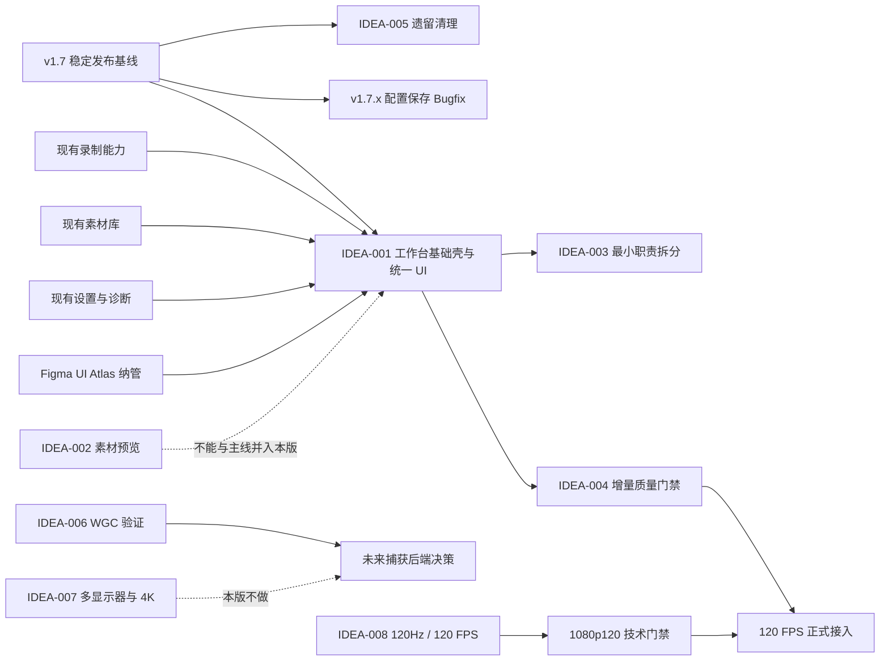

# QuickRec Full v1.8 `/idea` 需求池

## 追踪信息

- 当前状态：`/idea` 已完成，等待确认后进入 PRD 澄清
- 目标版本：QuickRec Full v1.8
- 上游来源：v1.7 发布后项目 Review、v1.7 正式发布资料、当前代码与工程配置
- 下游承接：`IDEA-001`、`IDEA-008` 携带 `IDEA-003`、`IDEA-004` 进入 v1.8 PRD
- 当前事实源：`doc/current.md`、`doc/releases/v1.7/progress.md`、`doc/releases/v1.7/verification.md`
- 最后更新：2026-07-23

## 入口与阶段判断

- 入口：`/idea`
- 当前阶段：v1.7 已正式发布，v1.8 处于需求发现与价值判断阶段
- 本文职责：判断问题是否真实、是否值得现在推进、版本如何取舍
- 本文不负责：编写 PRD、设计最终交互、拆开发任务或修改业务代码
- 进入开发授权：未获得；当前不进入实现

## 总体判断

### v1.8 双产品主线

1. **Full 工作台基础壳与统一 UI。**
2. **120Hz 及以上显示环境兼容与 120 FPS 正式录制能力。**

用户于 2026-07-23 明确放宽原“一条产品主线”约束，要求工作台和高刷新率能力同时进入 v1.8。工作台只统一承接现有录制、素材库、设置和诊断；高刷新率主线要求 QuickRec 在 120Hz 及以上单显示器环境正常运行，并正式提供 120 FPS 录制选项。多显示器和 4K 不进入本版。

这一决策代表产品负责人主动接受更大的版本范围，但不改变证据判断：120 FPS 当前仍缺真实性能基线，必须先通过技术门禁，再进入正式接入；“决定推进”不等于“技术可行性已经验证”。

### 最多两个工程支撑

1. **QuickRecApp / MaterialLibraryDialog 最小职责拆分**：只拆出工作台接入所需的窗口协调、页面状态和素材查询展示边界，不重写录制核心。
2. **受影响范围的质量门禁扩展**：将本轮新增或修改的工作台、页面协调与配置交互代码纳入 ruff、mypy、coverage 和 CI。

### 为什么素材预览仍不进入本版

- 当前用户已经可以通过“打开文件”调用系统播放器，虽然跳转成本存在，但主任务可完成。
- 仓库中没有素材预览使用频率、打开文件频率或用户流失数据。
- 静态首帧和内嵌播放是两种成本差异明显的方案，当前尚未证明哪一种是最小必要解。
- v1.8 已因高刷新率能力扩展为双主线；再加入预览会继续扩大媒体解码、缓存、打包和 GUI 验收范围。

### 明确分流

- 进入 `/prd`：`IDEA-001` 工作台基础壳与统一 UI、`IDEA-008` 120Hz 环境兼容与 120 FPS 正式录制。
- 作为 PRD 工程支撑：`IDEA-003` 最小职责拆分、`IDEA-004` 质量门禁扩展。
- 现在直接治理：`IDEA-005` 已确认无运行时依赖的旧模块和过期打包项；v1.7 文档事实源校准；Figma 插件纳管决策。
- v1.7.x Bugfix：配置保存失败仍显示成功并关闭设置窗口的问题。
- 继续验证但不进入 v1.8：`IDEA-002` 素材预览、`IDEA-006` WGC。
- 暂不做：`IDEA-007` 多显示器与 4K。

## 版本边界

### v1.8 可以包含

- Full 主工作台窗口。
- 录制、素材库、设置、诊断的统一导航与状态承接。
- 托盘入口与工作台入口的双向协调。
- 当前素材库、查询、待入库和文件操作能力的页面化承接。
- 录制中、暂停、保存中、保存成功和索引失败等现有状态的统一反馈。
- 120Hz、144Hz、165Hz 等高刷新率单显示器环境兼容。
- 用户可选 120 FPS 录制，并生成实际高帧率视频。
- 120 FPS 不可用或无法持续时的明确提示、失败保护和安全回退。
- 为本轮接入所需的最小职责拆分和增量质量门禁。

### v1.8 明确不包含

- 项目模型、项目列表或项目归属。
- 时间线、多轨剪辑、裁剪、分割、转场或特效。
- 导出任务、导出队列或重新编码工作流。
- AI、字幕、摘要、章节、标签或云同步。
- 素材静态首帧或内嵌播放。
- WGC 正式接入、捕获后端切换开关。
- 多显示器正式支持或跨屏窗口能力。
- 4K 录制性能承诺、4K120 或 4K 高帧验收。
- QuickRec Lite 改动。
- QuickRecApp、RecorderManager 或素材库的全量重写。

## 证据映射

| 来源证据 | 对应候选 | 证据等级 | 说明 |
| --- | --- | --- | --- |
| `doc/current.md:6-7,37` | 全部 | 强 | v1.7 已正式发布，v1.8 可以从稳定发布点开展发现阶段 |
| `doc/releases/v1.7/release-notes.md:8,22-23` | IDEA-001、IDEA-002、IDEA-006、IDEA-008 | 强 | v1.7 明确未包含工作台、预览、WGC 和 120 FPS，这些仍是候选而非遗留未完成项 |
| `figma-plugin/README.md:24-42` | IDEA-001、IDEA-005 | 中 | 已有覆盖现有产品链路、57 个控件契约和窗口尺寸的 UI Atlas，但目录尚未纳入 Git |
| `src/main.py:127`，文件约 934 行 | IDEA-003 | 强 | `QuickRecApp` 同时承接启动、托盘、录制、设置、素材库和反馈协调 |
| `src/ui/material_library_dialog.py:67`，文件约 924 行 | IDEA-003 | 强 | 素材库窗口集中承接查询、展示、文件操作和多类恢复交互 |
| `src/recorder/recorder_manager.py:55`，文件约 828 行 | IDEA-003 | 强 | 录制核心同样较大，但本版只允许按接入边界最小拆分，不全量重构 |
| `pyproject.toml:15-20,32-50,62-85` | IDEA-004 | 强 | coverage 排除主入口和全部 UI，ruff 排除多项核心 UI，mypy 只覆盖部分文件且跳过导入 |
| `.github/workflows/ci.yml:3-7,24-37` | IDEA-004 | 强 | CI 仍包含旧分支名，不覆盖 `test`，且没有 packaging 门禁 |
| `build_std.spec:45`、`src/recorder/cursor_overlay.py` | IDEA-005 | 强 | 自绘光标模块仍在打包 hidden import 中，运行时搜索仅命中旧测试和打包配置 |
| `src/ui/recent_recordings_dialog.py`、`src/utils/recording_history.py` | IDEA-005 | 强 | v1.5 最近录制模块只被彼此和旧测试引用，当前产品入口已升级为素材库 |
| `doc/releases/v1.5/capture-backend-spike.md:9,47-60` | IDEA-006、IDEA-007 | 中 | WGC、4K、DPI 和多显示器存在历史风险线索，但没有形成当前正式能力证据 |
| `src/recorder/screen_capturer.py:43,46,92-93,119` | IDEA-007、IDEA-008 | 强 | 当前固定 `output_idx=0`、目标 60 FPS，并以主显示器 API 获取尺寸；120 FPS 需要改动真实捕获链路 |
| 用户于 2026-07-23 明确要求 120Hz 环境兼容和 120 FPS 正式录制 | IDEA-008 | 中 | 形成明确产品决策和单个用户需求证据，但仍缺硬件分布、性能和音画同步数据 |
| `src/config.py:108-116`、`src/ui/settings_dialog.py:347-382` | 独立 Bugfix | 强 | 保存异常被吞掉，设置窗口仍发出成功信号并关闭；开机自启副作用发生在持久化之前 |

### 当前缺少的数据

- 用户从托盘进入录制、素材库、设置和诊断的实际频率。
- 用户是否因入口分散而迷失、重复打开窗口或放弃任务。
- 用户点击“打开文件”进入外部播放器的频率与返回成本。
- 高刷用户的具体分辨率、显卡、CPU、内容类型和实际输出用途。
- 1080p120 的实际捕获率、丢帧、CPU/GPU、编码吞吐、文件体积和音画同步数据。

缺少上述数据不阻止工作台壳进入 PRD。120 FPS 因产品负责人明确决策可以进入 PRD，但必须先设置可证伪的技术门禁；门禁未通过时不得进入正式功能实现。素材预览和 WGC 仍不能直接进入开发。

## 需求总览

| ID | 标题 | 类型 | 证据等级 | 压力测试 | 置信度 | 分档结论 | 建议去向 | 最小下一步 |
| --- | --- | --- | --- | ---: | --- | --- | --- | --- |
| IDEA-001 | Full 工作台基础壳与统一 UI | 产品主线 | 中 | 28/40 | 中 | 部分通过，范围收敛后可推进 | 进入 `/prd` | 澄清入口、页面承载、窗口生命周期和状态同步 |
| IDEA-002 | 素材轻量预览或静态首帧 | 产品候选 | 弱 | 22/40 | 中低 | 信息不足 | 继续验证 | 对比静态首帧、系统播放器和内嵌播放的真实任务成本 |
| IDEA-003 | QuickRecApp / MaterialLibraryDialog 最小职责拆分 | 工程支撑 | 强 | 34/40 | 高 | 通过 | 随主线进入 `/prd` | 只列出工作台接入所需的职责边界与禁止重构区 |
| IDEA-004 | 扩大 ruff、mypy、coverage 和 CI 真实覆盖 | 工程支撑 | 强 | 35/40 | 高 | 通过 | 随主线进入 `/prd` | 为受影响文件设增量门禁并修正 CI 分支矩阵 |
| IDEA-005 | 清理自绘光标、最近录制及过期打包配置 | 直接治理 | 强 | 32/40 | 高 | 通过 | 现在直接治理 | 证明无运行时和迁移依赖后，用独立提交删除 |
| IDEA-006 | WGC 捕获后端最小验证 | 技术验证 | 中 | 21/40 | 中 | 信息不足 | 继续验证 | 独立 demo 对比 dxcam，不接入正式运行时 |
| IDEA-007 | 多显示器与 4K 兼容性矩阵 | 技术验证 | 中 | 21/40 | 中 | 信息不足 | 暂不做 | 保留历史证据，不占用 v1.8 资源 |
| IDEA-008 | 120Hz 环境兼容与 120 FPS 正式录制 | 产品主线 / 高风险技术能力 | 中偏弱 | 22/40 | 中 | 证据不足但已作战略推进决策 | 条件式进入 `/prd` | 先定义 1080p120 技术门禁、失败保护和验收矩阵 |

## 产品候选取舍

| 判断项 | 工作台基础壳与统一 UI | 120Hz 环境与 120 FPS 录制 | 素材预览或静态首帧 |
| --- | --- | --- | --- |
| 用户问题 | 现有能力散落在托盘、结果条和多个独立窗口 | 高刷新率显示环境无法选择与显示刷新率匹配的录制帧率 | 用户必须调用系统播放器查看视频内容 |
| 当前替代方案 | 继续使用托盘菜单和独立对话框 | 继续录制 60 FPS，或使用专业高帧录制工具 | 使用系统播放器 |
| 当前证据 | 代码结构、现有入口、产品路线和 UI Atlas | 用户明确要求、当前硬编码 60 FPS；缺真实 120 FPS 性能数据 | 产品直觉和外部播放器跳转成本 |
| 对 v1.8 的贡献 | 建立 Full 后续页面能力的稳定容器 | 提升高刷场景录制能力，属于录制核心升级 | 改善素材识别，但不解决整体入口结构 |
| 成本与风险 | 中高，边界可按现有能力控制 | 高，涉及捕获、编码、音画同步、配置、打包和硬件差异 | 静态首帧中等，内嵌播放更高 |
| 验证速度 | 原型和 GUI 状态矩阵可快速验证 | 必须先做 1080p120 真实硬件 benchmark | 可用小样本识别任务验证 |
| 压力测试结论 | 28/40，进入 PRD | 22/40，证据不足但由产品负责人接受风险后条件式进入 PRD | 22/40，只继续验证 |
| v1.8 分流 | 产品主线一 | 产品主线二 | 不进入本版 |

工作台和高刷新率能力可以并行规划，但必须拆成独立里程碑与独立发布门禁。素材预览仍不得通过“页面完整性”顺带进入 v1.8。

## 依赖关系



说明：

- `IDEA-005` 和配置保存 Bugfix 应以独立变更完成，不包装成工作台价值。
- `IDEA-003`、`IDEA-004` 服务于 `IDEA-001`，不能扩张为全项目重构或一次性清债。
- `IDEA-008` 与工作台壳没有代码交付依赖，必须独立分阶段；一条主线失败不能用另一条主线的进度掩盖。
- WGC、多显示器和 4K 不进入 v1.8，不能成为 120 FPS 的隐式附加范围。

## 三档范围方案

| 档位 | 内容 | 判断 | 主要风险 |
| --- | --- | --- | --- |
| 最小方案 | 工作台主窗口与统一导航；仅验证 120Hz 环境兼容，120 FPS 保持技术 spike | 范围最稳，但不满足用户已确认的正式 120 FPS 目标 | 高帧能力仍停留在研究状态 |
| 推荐方案 | 工作台承接现有四类能力；保留托盘常驻；完成必要职责拆分和门禁；先通过 1080p120 技术门禁，再开放 120 FPS 选项 | 推荐进入 `/prd` | 双主线使开发、打包和 GUI 验收周期明显增加 |
| 过大方案 | 推荐方案再加入素材预览、项目模型、剪辑、导出队列、AI、WGC、多显示器、4K120 | 不建议 | 产品、数据、捕获、媒体处理和 UI 同时扩张，无法形成可信验收边界 |

## 需求详情

### IDEA-001 Full 工作台基础壳与统一 UI

- 原始输入：为 QuickRec Full 建立工作台基础壳，统一现有录制、素材库、设置和诊断。
- 输入类型：产品方向 / 交互架构方案。
- 产品问题：Full 的能力已经从单一录制扩展到素材管理和诊断，但入口仍主要依赖托盘、结果条及多个独立对话框，缺少统一的任务位置和状态承接。
- 目标用户 / 场景：持续使用 QuickRec Full 录制、回看素材、调整设置和排查问题的创作者。
- 当前替代方案：通过托盘菜单分别打开各项能力；主任务可以完成，但窗口关系和返回路径分散。
- 证据盘点：
  - 已确认：录制、素材库、设置、诊断均已存在并通过历史版本验收。
  - 已确认：`QuickRecApp` 和素材库窗口承担较多协调职责。
  - 中等证据：Figma UI Atlas 已表达完整产品链路和 57 个控件契约。
  - 缺口：没有真实用户行为数据证明入口分散造成的完成率损失。
- 价值判断：中高价值，但必须以“统一承接现有能力”为边界。
- 当前阶段：适合 v1.7 发布后的产品结构打磨期。
- 结论：部分通过，作为 v1.8 产品主线之一进入 PRD。
- 最小下一步：PRD 澄清主入口、启动行为、页面清单、托盘共存、窗口生命周期、录制中可用性、失败反馈和关闭语义。

压力测试：

| 维度 | 分数 | 证据 / 理由 |
| --- | ---: | --- |
| 用户痛点强度 | 3 | 入口分散增加认知成本，但暂无用户放弃或失败数据 |
| 人群 / 场景清晰度 | 4 | Full 创作者在录制、管理素材、设置和诊断间切换的场景明确 |
| 证据强度 | 3 | 有代码、现有入口和原型证据，缺真实用户行为证据 |
| 频率 / 紧迫性 | 3 | 高频用户可能经常切换，但当前主流程仍可完成 |
| 核心目标贡献 | 5 | 直接决定 Full 后续页面能力的承载方式 |
| 差异化 / 替代方案 | 3 | 托盘与独立窗口仍是可用替代，工作台不是唯一解 |
| 成本可控性 | 3 | 严格不加新业务能力时可控，若顺带重构则迅速失控 |
| 验证速度 | 4 | 可通过原型和桌面 GUI 任务快速验证 |

总分：**28/40**。成本和证据均达到 3 分，没有触发禁止推进闸门；只允许收敛后进入 PRD。

### IDEA-002 素材轻量预览或静态首帧

- 原始输入：在素材库中提供轻量预览或静态首帧。
- 输入类型：产品需求 / 方案二选一。
- 产品问题：素材名称和元数据不足以快速辨认内容，用户可能需要打开外部播放器。
- 目标用户 / 场景：拥有相似文件名或大量录制素材，需要快速辨认内容的用户。
- 当前替代方案：双击或点击“打开文件”，使用系统播放器。
- 证据盘点：
  - 已确认：素材库目前没有预览。
  - 反证：外部播放器已经能完成查看任务。
  - 缺口：没有打开频率、返回成本、误选率或用户反馈数据。
- 价值判断：可能有价值，但当前证据不足以与工作台壳争夺主线。
- 当前阶段：继续验证。
- 结论：不进入 v1.8；后续优先验证静态首帧是否已经足够。
- 最小下一步：选取 20 个相似素材，用文件名、静态首帧和外部播放器完成识别任务，比较耗时与误选。

压力测试：

| 维度 | 分数 | 证据 / 理由 |
| --- | ---: | --- |
| 用户痛点强度 | 2 | 存在跳转成本，但没有阻塞证据 |
| 人群 / 场景清晰度 | 3 | 大量相似录制素材的场景合理 |
| 证据强度 | 2 | 主要来自产品判断，没有用户数据 |
| 频率 / 紧迫性 | 3 | 素材整理用户可能高频遇到，当前未统计 |
| 核心目标贡献 | 3 | 改善素材识别，但不解决 Full 入口结构 |
| 差异化 / 替代方案 | 2 | 系统播放器是现成替代方案 |
| 成本可控性 | 3 | 静态首帧可控，内嵌播放成本明显更高 |
| 验证速度 | 4 | 可用小样本人工任务快速对比 |

总分：**22/40**。证据强度 2 分触发证据闸门，最高只能判定为继续验证。

### IDEA-003 QuickRecApp / MaterialLibraryDialog 最小职责拆分

- 原始输入：最小拆分 `QuickRecApp` 和 `MaterialLibraryDialog`。
- 输入类型：工程支撑。
- 产品问题：工作台接入会继续增加窗口协调和状态同步；如果仍堆入现有大类，后续修改风险和测试成本会持续增长。
- 目标用户 / 场景：维护 QuickRec Full、扩展页面和处理回归的开发者。
- 当前替代方案：继续在现有类中增加信号、窗口引用和状态分支。
- 证据盘点：`main.py` 约 934 行，素材库对话框约 924 行，录制管理器约 828 行；职责集中是已确认工程事实。
- 价值判断：高价值工程支撑。
- 当前阶段：随工作台主线进行最小拆分，不提前全量重构。
- 结论：通过，作为 v1.8 两个工程支撑之一。
- 最小下一步：在 PRD 影响范围中列出必须抽离的窗口协调、页面状态和素材查询展示职责，并列出禁止触碰的录制核心。

压力测试：

| 维度 | 分数 | 证据 / 理由 |
| --- | ---: | --- |
| 用户痛点强度 | 4 | 虽非直接用户功能，但集中职责会放大工作台回归风险 |
| 人群 / 场景清晰度 | 5 | 维护者接入工作台页面时直接发生 |
| 证据强度 | 5 | 文件规模、类边界和调用关系均可由代码确认 |
| 频率 / 紧迫性 | 4 | 工作台每增加一个页面都会触碰协调层 |
| 核心目标贡献 | 5 | 是工作台可维护接入的直接支撑 |
| 差异化 / 替代方案 | 4 | 可以最小抽离，不需要全量重写 |
| 成本可控性 | 3 | 边界可控，但必须防止重构扩散 |
| 验证速度 | 4 | 可通过契约测试、UI 测试和回归验证 |

总分：**34/40**，通过。它是工程支撑，不得独立扩张为“架构重写版本”。

### IDEA-004 扩大 ruff、mypy、coverage 和 CI 真实覆盖

- 原始输入：扩大质量工具和 CI 的真实覆盖范围。
- 输入类型：工程支撑 / 工程治理。
- 产品问题：当前名义上的 80% coverage 不包括主入口和全部 UI；ruff 与 mypy 也跳过多项高风险文件，CI 分支配置已经落后于当前流程。
- 目标用户 / 场景：开发工作台页面、修改窗口协调和准备候选包的维护者。
- 当前替代方案：继续依赖局部测试与人工验收兜底。
- 证据盘点：`pyproject.toml` 和 CI 配置直接证明覆盖盲区与分支过期。
- 价值判断：高价值，直接降低主线回归风险。
- 当前阶段：随受影响模块增量扩展，不要求一次清完所有历史问题。
- 结论：通过，作为 v1.8 第二个工程支撑。
- 最小下一步：建立 v1.8 受影响文件清单，为新增工作台和修改页面设置门禁；CI 覆盖 `master`、`test` 和 packaging。

压力测试：

| 维度 | 分数 | 证据 / 理由 |
| --- | ---: | --- |
| 用户痛点强度 | 4 | 门禁盲区会降低发布可靠性和维护信任 |
| 人群 / 场景清晰度 | 5 | 每次提交、合并和候选包构建都会触发 |
| 证据强度 | 5 | 配置文件直接证明排除范围和旧分支 |
| 频率 / 紧迫性 | 4 | 工作台会增加当前未覆盖的 UI 和协调代码 |
| 核心目标贡献 | 5 | 直接保护 v1.8 主线 |
| 差异化 / 替代方案 | 4 | 增量纳管是比全量清债更小的方案 |
| 成本可控性 | 3 | 历史文件可能暴露旧问题，必须按批次纳入 |
| 验证速度 | 5 | 工具和 CI 结果可直接判断 |

总分：**35/40**，通过。只做增量纳管，不把全项目零告警作为 v1.8 前置条件。

### IDEA-005 清理自绘光标、v1.5 最近录制及过期打包配置

- 原始输入：删除已失去产品入口的旧实现和打包引用。
- 输入类型：直接治理 / 技术债清理。
- 产品问题：旧模块仍存在于源码、测试和打包清单中，会误导维护者，也可能继续增加打包与回归成本。
- 目标用户 / 场景：维护、打包和排查录制链路的开发者。
- 当前替代方案：保留文件并依赖文档说明“当前不使用”。
- 证据盘点：
  - 自绘光标运行时搜索只命中模块本身、旧测试和 `build_std.spec`。
  - 最近录制对话框与旧索引工具只被彼此和旧测试引用。
  - v1.6 起产品入口和中央索引已经升级为素材库。
- 价值判断：中价值且低风险，适合独立治理。
- 当前阶段：在 v1.8 功能分支前或独立提交中完成。
- 结论：通过，但不作为 v1.8 产品功能或工程支撑计数。
- 最小下一步：先用静态依赖、迁移测试、全量测试和 packaging 证明无依赖，再删除模块、旧测试和 hidden import；保留历史文档。

压力测试：

| 维度 | 分数 | 证据 / 理由 |
| --- | ---: | --- |
| 用户痛点强度 | 3 | 主要影响维护和包体，不直接阻塞用户 |
| 人群 / 场景清晰度 | 4 | 打包、重构和故障排查场景明确 |
| 证据强度 | 5 | 运行时引用和产品入口状态均可确认 |
| 频率 / 紧迫性 | 3 | 工作台改造前清理可减少误判 |
| 核心目标贡献 | 3 | 间接降低 v1.8 干扰，不是主线价值 |
| 差异化 / 替代方案 | 5 | 独立删除是明确最小方案 |
| 成本可控性 | 4 | 依赖验证后范围有限，可回滚 |
| 验证速度 | 5 | 全量测试和打包可快速证伪 |

总分：**32/40**，通过。建议直接治理，而不是写入产品 PRD。

### IDEA-006 WGC 捕获后端最小验证

- 原始输入：验证 WGC 是否能改善窗口捕获、DPI 和原生光标边界。
- 输入类型：技术验证。
- 产品问题：dxcam 在特殊窗口、窗口移动、多显示器和原生光标方面存在历史边界。
- 当前替代方案：继续使用已经发布验证的 dxcam 主链路，并保持窗口移动冻结和无自绘光标策略。
- 证据盘点：历史问题与 spike 文档构成中等证据；当前 v1.7 主链稳定构成反证。
- 价值判断：值得继续研究，但不适合进入 v1.8 正式运行时。
- 结论：信息不足，继续独立 spike。
- 最小下一步：独立 demo 对比窗口类型、DPI、CPU/GPU、帧率、音画同步、打包体积和失败恢复；不得增加用户可见后端开关。

压力测试：

| 维度 | 分数 | 证据 / 理由 |
| --- | ---: | --- |
| 用户痛点强度 | 3 | 历史边界真实，但当前稳定版已有可接受策略 |
| 人群 / 场景清晰度 | 3 | 特殊窗口和复杂显示环境明确，用户规模未知 |
| 证据强度 | 3 | 有历史问题和研究文档，无现代实现对比数据 |
| 频率 / 紧迫性 | 2 | 当前发布链路未出现普遍阻塞 |
| 核心目标贡献 | 2 | 与工作台壳没有直接依赖 |
| 差异化 / 替代方案 | 3 | dxcam 仍是稳定替代 |
| 成本可控性 | 2 | WinRT、打包、兼容和回归矩阵成本较高 |
| 验证速度 | 3 | 独立 demo 可验证，但需要真实桌面环境 |

总分：**21/40**。只进入技术验证，不进入 v1.8 PRD。

### IDEA-007 多显示器与 4K 兼容性矩阵

- 原始输入：验证多显示器、跨屏窗口和 4K/DPI 兼容性。
- 输入类型：兼容性技术验证。
- 产品问题：当前捕获固定 `output_idx=0`，原生分辨率读取主显示器；多屏和 4K 环境存在能力缺口。
- 当前替代方案：使用主显示器录制，并通过现有 DPI 适配与窗口冻结策略规避部分边界。
- 证据盘点：代码限制与历史问题明确；缺少真实双屏、混合 DPI 和 4K 设备矩阵。
- 价值判断：问题可能真实，但用户规模和失败率不足以支持正式功能。
- 产品决策：用户于 2026-07-23 明确本版不做多显示器与 4K。
- 结论：信息不足且不符合本版优先级，暂不做。
- 最小下一步：保留历史代码限制和研究证据；除非出现真实阻塞反馈，不占用 v1.8 验证资源。

压力测试：

| 维度 | 分数 | 证据 / 理由 |
| --- | ---: | --- |
| 用户痛点强度 | 3 | 对目标环境用户可能阻塞，但当前发生率未知 |
| 人群 / 场景清晰度 | 4 | 多屏办公、4K 和混合 DPI 场景明确 |
| 证据强度 | 3 | 代码限制强，真实环境数据不足 |
| 频率 / 紧迫性 | 2 | 未获得用户占比与失败率 |
| 核心目标贡献 | 3 | 属于录制兼容性，但不支撑工作台壳 |
| 差异化 / 替代方案 | 2 | 主屏录制是有限替代，不能覆盖全部用户 |
| 成本可控性 | 2 | 硬件与排列矩阵较大 |
| 验证速度 | 2 | 当前缺少稳定硬件环境 |

总分：**21/40**。不进入 v1.8，后续是否重开由真实用户反馈决定。

### IDEA-008 120Hz 环境兼容与 120 FPS 正式录制

- 原始输入：v1.8 同时支持 120Hz 及以上显示环境，并正式提供 120 FPS 录制。
- 输入类型：产品主线 / 高风险性能能力。
- 产品问题：当前越来越多录制场景运行在 120Hz 及以上显示器上，但 QuickRec 捕获链路固定 60 FPS，不能输出 120 FPS 视频。
- 当前替代方案：使用当前 30/60 FPS，或使用面向游戏录制的专业工具。
- 证据盘点：
  - 强事实：当前 `screen_capturer.py` 固定 `target_fps=60`，设置页只提供既有帧率选项。
  - 中等证据：用户明确要求本版推进，并以高刷新率显示器普及作为产品判断。
  - 证据缺口：没有硬件分布、目标内容、真实 1080p120 捕获率、丢帧、编码负载和音画同步数据。
- 价值判断：战略价值由产品负责人确认，但技术可行性和普适性仍待验证。
- 当前阶段：条件式进入 PRD；先技术门禁，后正式实现。
- 结论：产品负责人接受范围和风险后推进，但不得绕过证据闸门直接承诺发布。
- 最小下一步：在 PRD 中先定义 1080p120 技术 spike、通过阈值、硬件不支持行为、实际帧率容差、失败保护和发布阻塞条件。

压力测试：

| 维度 | 分数 | 证据 / 理由 |
| --- | ---: | --- |
| 用户痛点强度 | 3 | 用户明确认为高刷新率环境应得到匹配能力，但尚无失败率数据 |
| 人群 / 场景清晰度 | 4 | 120Hz 及以上单显示器、高速桌面或游戏录制场景明确 |
| 证据强度 | 2 | 有单个明确用户需求和代码限制，没有性能与用户分布数据 |
| 频率 / 紧迫性 | 3 | 对目标用户每次录制都会生效，目标用户占比未知 |
| 核心目标贡献 | 4 | 直接扩展 QuickRec 的核心录制能力 |
| 差异化 / 替代方案 | 2 | 已有专业游戏录制工具 |
| 成本可控性 | 1 | 捕获、编码、磁盘、音画同步和硬件差异风险高 |
| 验证速度 | 3 | 可先做 1080p120 spike，但正式兼容仍需硬件矩阵 |

总分：**22/40**。证据强度 2 分和成本 1 分仍触发闸门；按常规应只验证。由于用户明确作出战略推进决策，本项可条件式进入 PRD，但 PRD 必须把“技术 spike 通过”设置为正式开发前门禁，不能将决策写成已验证事实。

## 独立 v1.7.x Bugfix

### BUG-1801 配置保存失败仍显示成功

- 证据状态：代码路径已确认；需要失败注入测试完成运行时复现。
- 现象：
  - `ConfigManager.save()` 捕获所有异常后只输出文本，不返回失败也不抛出异常。
  - 设置窗口无论保存是否成功，都会发出 `config_saved`、关闭窗口。
  - 开机自启注册表副作用发生在配置持久化之前，失败时没有回滚。
- 用户影响：用户可能认为保存成功，重启后配置却未生效；开机自启状态还可能与配置文件不一致。
- 分流：独立 v1.7.x Bugfix，不包装为 v1.8 工作台价值，不占用产品主线或工程支撑名额。
- 最小修复前置：
  1. 补充配置目录不可写、写入异常和开机自启副作用失败测试。
  2. 明确保存事务返回值或异常契约。
  3. 只有持久化成功后才发出成功信号并关闭窗口。
  4. 失败时保持窗口、显示错误并避免不一致副作用。

## 现在直接治理

以下事项不需要进入产品 PRD：

1. **v1.7 文档事实源校准**
   - `README.md:79` 仍把 `doc/releases/v1.6.1/` 写成当前发布文档。
   - `doc/current.md:43-68` 同时保留 v1.6.1“当前版本文档”和 v1.7 当前文档，过程记录仍指向 v1.6.1。
   - `doc/releases/v1.7/manual-verification.md:10` 仍写正式版为 v1.6.1，且 `V17-S4`、`V17-S5`、`V17-F1`～`F4`、`V17-O4` 仍为待验证，与 progress/verification 的正式发布结论冲突。
   - 最小动作：只基于已有证据做发布后状态审计和文档校准，不重新执行完整验收。

2. **Figma 插件纳管决策**
   - `figma-plugin/` 当前为未跟踪目录。
   - 它可以作为 v1.8 PRD 原型输入，但在纳入 Git 或明确归档之前，不应被视为正式设计事实源。
   - 最小动作：验证生成结果后，选择“纳入仓库”或“移入明确 archive”，不得长期悬空。

3. **旧模块和打包配置清理**
   - 按 `IDEA-005` 独立执行。
   - 不删除历史 PRD、验收或发布文档。
   - 不改变 v1.7 tag、发布包或 QuickRec Lite。

## 最终分流

### 进入 `/prd`

- `IDEA-001` Full 工作台基础壳与统一 UI。
- `IDEA-008` 120Hz 环境兼容与 120 FPS 正式录制；先建立技术门禁，再决定正式接入。
- 携带工程支撑：
  - `IDEA-003` QuickRecApp / MaterialLibraryDialog 最小职责拆分。
  - `IDEA-004` 受影响范围质量门禁扩展。

### 现在直接做

- v1.7 文档事实源校准。
- Figma 插件纳管或归档决策。
- `IDEA-005` 旧模块与过期打包项清理。

这些治理动作需要独立提交，不与 v1.8 产品提交混合。

### v1.7.x Bugfix

- `BUG-1801` 配置保存失败反馈与事务一致性。

### 继续验证

- `IDEA-002` 素材预览或静态首帧。
- `IDEA-006` WGC 独立 demo。

### 暂不做

- `IDEA-007` 多显示器与 4K。
- 项目模型、剪辑、导出队列、AI、云同步。
- 素材预览作为第三条 v1.8 产品主线。

## 进入 PRD 前必须澄清

1. 工作台从托盘菜单、结果条还是应用启动时进入；是否保留双击托盘图标行为。
2. 启动 QuickRec 时默认只常驻托盘，还是自动打开工作台。
3. 录制、素材库、设置和诊断是嵌入主窗口页面，还是部分能力继续使用系统或独立对话框。
4. 工作台关闭是隐藏到托盘还是退出应用。
5. 录制中、暂停、保存中和索引失败时，哪些页面和操作可用。
6. 重复点击入口时是否复用同一个工作台实例。
7. 主窗口尺寸、最小尺寸、三档 DPI 和多窗口前后层级规则。
8. v1.8 是否更新现有 Figma UI Atlas 为工作台页面原型，以及 `figma-plugin/` 的正式归属。
9. 120 FPS 的正式验收分辨率；建议先以单显示器 `1920×1080 @ 120Hz+` 为发布基线。
10. 120 FPS 选项是始终显示、按硬件探测显示，还是选择后执行能力自检。
11. 实际捕获帧率、连续丢帧、CPU/GPU、编码延迟、磁盘吞吐和音画同步的通过阈值。
12. 硬件无法维持 120 FPS 时是阻止开始、明确降级到 60 FPS，还是录制后提示；不得静默伪装为 120 FPS。
13. 120 FPS 是否覆盖全屏、区域和窗口三种模式，以及四类音频组合的最低验收矩阵。
14. 120Hz/144Hz/165Hz 环境下使用 30/60 FPS 时，录制节奏和 UI 是否仍保持正常。

## 下一阶段建议

- 推荐下一步：进入 `/prd` 澄清阶段，同时承接 `IDEA-001` 和 `IDEA-008`，但拆成独立里程碑与门禁；`IDEA-003`、`IDEA-004` 作为影响范围约束。
- 需要准备：
  - 工作台启动与关闭偏好。
  - 页面嵌入和独立窗口的取舍。
  - 托盘与工作台的默认关系。
  - Figma 插件是否纳入正式仓库。
  - 可用于 120Hz+ / 1080p120 验证的显示器与硬件环境。
  - 可接受的实际帧率容差、降级和失败策略。

可直接发送：

```text
mypm /prd

项目：E:\codex\QuickRec
需求池：doc/archive/ideas/mypm-idea-pool-v1.8-2026-07-23.md

请为 QuickRec Full v1.8“工作台基础壳与 120 FPS 录制”进入 PRD 澄清阶段，先不要直接写完整 PRD。

产品主线一：
- 工作台统一承接现有录制、素材库、设置和诊断能力。

产品主线二：
- 支持 120Hz 及以上单显示器环境。
- 正式提供 120 FPS 录制选项。
- 先完成 1080p120 技术门禁，再决定正式接入。

工程支撑：
- QuickRecApp / MaterialLibraryDialog 最小职责拆分。
- 受影响范围的 ruff、mypy、coverage 和 CI 门禁扩展。

明确不做：
- 素材预览或静态首帧。
- 项目模型、剪辑、导出队列和 AI。
- WGC、多显示器和 4K 正式能力。
- QuickRec Lite 改动。
- 全量架构重写。

请先通过提问确认工作台启动入口、默认启动行为、页面嵌入方式、托盘共存、关闭语义、录制中状态和窗口实例规则；同时确认 120 FPS 的分辨率基线、模式范围、硬件探测、帧率容差、性能阈值、音画同步、失败提示和安全降级。任何不明确的地方都必须向我提问。
```
