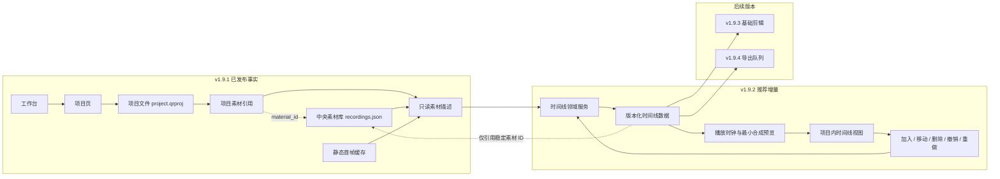
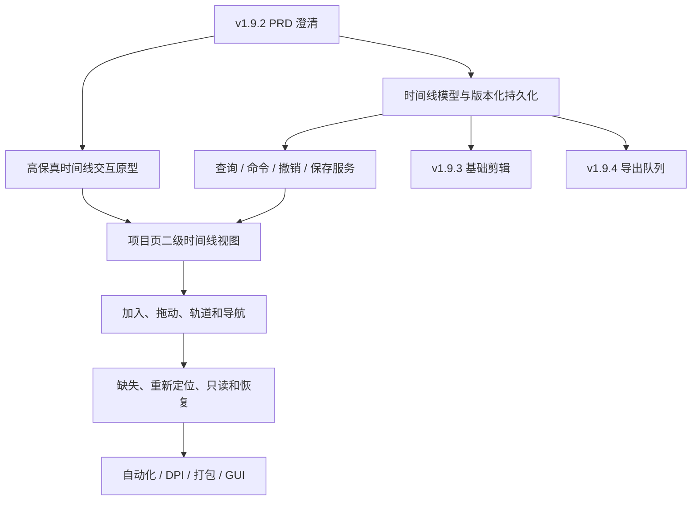

# /idea 需求池：QuickRec Full v1.9.2 多轨时间线基础

## 追踪信息

- 当前状态：需求池，推荐范围尚未进入 PRD。
- 入口：`/idea`。
- 目标版本：QuickRec Full v1.9.2。
- 评估日期：2026-07-27。
- 产品工作区：`E:\codex\QuickRec`。
- 当前正式版本：v1.9.1。
- 当前事实源：
  - `README.md`
  - `doc/current.md`
  - `doc/releases/v1.9/`
  - `doc/releases/v1.9.1/`
- 上游来源：
  - `doc/releases/v1.9/prd.md`
  - `doc/releases/v1.9.1/prd.md`
  - `doc/archive/ideas/mypm-idea-pool-post-v1.9-2026-07-27.md`
  - 当前项目、素材、静态预览、工作台和打包实现。
- 下游承接：确认后进入 v1.9.2 `/prd` 澄清。
- 本文不构成开发授权，不实现代码，不修改 QuickRec Lite。

## 入口判断

本轮是 `/idea`，目标是判断 v1.9.2“多轨时间线基础”解决的真实问题、合理的最小范围，以及哪些看似完整的能力会提前滑入 v1.9.3 或 v1.9.4。

候选项超过 2 个，因此使用 Markdown 需求池承接。仓库事实能够证明“当前项目只能归集和识别素材，不能表达素材的顺序、层级和时间关系”。产品负责人确认最小播放属于正常可用产品闭环，但当前仍没有用户行为数据证明复杂轨道控制或专业剪辑交互是本版刚需。

## 总体判断

### 真问题

v1.9 和 v1.9.1 已分别完成项目归集、静态首帧识别和基础文件操作，但项目文件仍只能回答“项目里有哪些素材”，不能回答：

- 素材按照什么顺序使用；
- 哪些素材处于同一时间位置；
- 哪些素材属于视频层或音频层；
- 同一素材是否在项目中被使用多次；
- 后续剪辑和导出应读取哪一份稳定编排事实。

这是通向 v2.0 完整工作台的真实结构缺口。证据主要来自已发布路线、当前数据模型和实现边界，属于**中等偏强项目证据**。产品负责人进一步确认：只完成结构编排但不能播放，不足以作为正常可用的 v1.9.2 产品交付。因此本版需要形成最小播放闭环，但仍不能借“可播放”扩大成剪辑器。

### 唯一产品主线

**推荐 v1.9.2 唯一产品主线：项目内可持久化、可播放的多轨时间线。**

它应让用户在同一个项目上下文中：

1. 从项目素材加入时间线；
2. 建立视频轨与音频轨的结构边界；
3. 通过拖动调整片段实例的轨道、顺序和时间位置；
4. 使用时间刻度、水平缩放、滚动和播放头检查布局；
5. 在工作台中播放、暂停和跳转时间线；
6. 按固定、可解释的最小规则呈现重叠视频并同步播放音频；
7. 自动、原子地保存编排；
8. 在素材缺失或重新定位后保持时间线引用稳定；
9. 关闭并重新打开项目后恢复同一编排。

方案 B“可持久化多轨编排基础”作为内部前置里程碑和失败回退边界，不作为 v1.9.2 面向用户的最终发布目标。可播放仅包含验证编排所需的播放、暂停、跳转和固定合成规则，不包含剪辑、可调混音、转场、特效或正式导出。

### 最多两个工程支撑模块

1. **时间线与播放运行时的最小职责拆分**：从 `ProjectPage` 和 `QuickRecApp` 抽离时间线读写、命令、播放时钟和状态协调，不全量重写既有页面。
2. **受影响模块增量质量门禁**：覆盖时间线迁移、原子保存、撤销重做、缺失素材、拖动状态、播放同步和打包 GUI。

### 最终分流

- **进入 `/prd`**：方案 C“可播放多轨时间线”，采用严格最小播放边界。
- **作为内部前置里程碑**：方案 B“可持久化多轨编排基础”；B 通过后才能进入播放运行时实现。
- **随 PRD 进入产品范围**：项目内二级时间线视图、视频/音频轨结构、片段实例、加入与拖动、时间标尺、缩放滚动、播放头、播放/暂停/跳转、固定视频层级规则、固定增益音频同步、原子保存、最小撤销重做、缺失与重新定位兼容。
- **随 PRD 进入工程影响边界**：最小职责拆分、增量质量门禁。
- **开发前技术门禁**：播放后端、寻址精度、音画同步、重叠视频规则、固定音频混合、打包依赖和资源释放。
- **后续版本**：裁剪、分割、变速、转场、可调音量、静音、波形、关键帧、正式剪辑和导出。
- **暂不做**：AI、字幕、云同步、WGC、高刷新率扩展和 QuickRec Lite 改动。

## 证据映射

| 来源证据 | 证据状态 | 对应判断 |
| --- | --- | --- |
| v1.9 PRD 已固定 v1.9.2 为“多轨时间线基础”，并明确不得提前混入完整剪辑和导出队列 | 已确认 / 强 | 版本路线成立，但仍需收敛“基础”的准确边界 |
| `project.qrproj` 当前只保存项目素材引用、元数据快照和 `extensions`，没有轨道、片段和时间位置 | 已确认 / 强 | 时间线需要新的持久化事实边界，不能只做 UI |
| `ProjectMaterialDescriptor` 已提供素材 ID、源路径、时长、分辨率、FPS、音频模式和可空预览路径 | 已确认 / 强 | v1.9.2 已有稳定只读输入，不应重复读取或复制素材索引逻辑 |
| v1.9.1 测试明确断言只读描述对象不包含 `track_id` 和 `timeline_position` | 已确认 / 强 | 轨道数据应由 v1.9.2 独立建立，不能污染素材描述对象 |
| 项目页已经支持静态首帧、打开文件、打开目录和素材库往返 | 已确认 / 强 | 这些能力继续作为源素材确认与播放失败降级路径，但不能替代整条时间线播放 |
| `ProjectPage` 约 1597 行、`QuickRecApp` 约 1598 行、`MaterialLibraryDialog` 约 1104 行 | 已确认 / 强 | 时间线继续直接堆入现有类会扩大协调耦合 |
| `WorkbenchWindow` 已有“项目”一级页面和单实例页面路由 | 已确认 / 强 | 时间线天然依附选中项目，不需要新增一级导航 |
| PyInstaller 当前明确排除 `PyQt5.QtMultimedia` 和 `Qt5Multimedia` | 已确认 / 强 | 内嵌播放会改变依赖、打包、音频焦点和验收范围 |
| 项目文件和项目索引已经具备原子写入、备份恢复、外部修改和只读保护 | 已确认 / 强 | 时间线保存应复用既有事务语义，而不是建立第二套保存体系 |
| v1.9.1 已验证 200 条项目素材加载、三档 DPI 和中文空格路径 | 已确认 / 中强 | 时间线可以继承素材规模基线，但轨道节点性能仍需独立验证 |
| 当前没有时间线使用频率、拖动次数、项目常见轨道数量或用户播放需求数据 | 已确认 / 反证 | 不能证明复杂播放器、无限轨道或专业编辑交互是当前刚需 |

## 当前对象与推荐关系

## 需求总览

| ID | 标题 | 类型 | 证据等级 | 压力测试 | 分档结论 | 依赖关系 | 建议去向 | 最小下一步 |
| --- | --- | --- | --- | ---: | --- | --- | --- | --- |
| IDEA-001 | 项目页内二级时间线视图 | 产品结构 | 强 | 35/40 | 高价值 | 工作台、项目选择 | 进入 PRD | 原型验证素材/时间线切换 |
| IDEA-002 | 视频轨与音频轨同时建立 | 数据与交互 | 中 | 30/40 | 中价值 | 素材音频元数据、时间线模型 | 进入 PRD 澄清 | 确认嵌入音频的逻辑映射 |
| IDEA-003 | 素材加入时间线与片段实例 | 核心能力 | 中强 | 34/40 | 高价值 | 稳定素材 ID | 进入 PRD | 定义重复使用和默认放置 |
| IDEA-004 | 拖动、排序与跨轨移动 | 核心交互 | 中 | 31/40 | 中高价值 | 轨道与片段模型 | 进入 PRD | 原型验证冲突与落点规则 |
| IDEA-005 | 时间标尺、播放头、缩放与滚动 | 导航交互 | 中 | 31/40 | 中高价值 | 时间单位、布局性能、播放时钟 | 进入 PRD | 播放头与最小播放同步 |
| IDEA-006 | 时间线持久化、迁移和兼容 | 数据基础 | 强 | 35/40 | 高价值 | 项目原子存储、备份 | 进入 PRD | 比较扩展块与 schema v2 |
| IDEA-007 | 缺失、移动与重新定位兼容 | 稳定性 | 强 | 34/40 | 高价值 | 中央素材索引、稳定 ID | 进入 PRD | 固定“保留片段、不改位置”语义 |
| IDEA-008 | 最小可播放时间线 | 核心能力 | 中 | 32/40 | 范围受限通过 | 媒体时钟、解码、音频焦点 | 进入 PRD并设置技术门禁 | 先验证播放后端和同步 |
| IDEA-009 | 最小撤销重做与自动保存 | 数据安全 | 中强 | 31/40 | 中高价值 | 命令层、原子写入 | 进入 PRD | 确认历史范围与保存时机 |
| IDEA-010 | v1.9.3/v1.9.4 数据边界 | 架构边界 | 强 | 34/40 | 高价值 | 稳定轨道/片段 ID | 进入 PRD | 只定义必要标识与时间单位 |
| IDEA-011 | 时间线领域与 UI 最小职责拆分 | 工程支撑 | 强 | 36/40 | 高价值 | ProjectPage、QuickRecApp | 随主线进入 | 先建立领域服务接口 |
| IDEA-012 | 受影响模块增量质量门禁 | 工程支撑 | 强 | 37/40 | 高价值 | CI、packaging、GUI | 随主线进入 | 建立数据、交互和打包矩阵 |

## 三档范围方案

### 方案 A：静态单轨顺序板

内容：

- 在项目页展示一条视频顺序带；
- 素材可以加入、移除和拖动排序；
- 不建立音频轨、自由时间位置、重叠、播放头或正式时间线数据；
- 按列表顺序保存。

优点：

- 成本低，较快得到可见结果；
- 可以验证用户是否愿意在 QuickRec 内安排素材顺序；
- 几乎不引入媒体播放与多轨状态。

缺点：

- 本质更接近故事板或播放列表，不是“多轨时间线基础”；
- v1.9.3 仍需重做轨道、片段实例和时间位置模型；
- 同一素材多次使用、音频层和跨轨重叠均没有稳定边界。

压力测试：

| 维度 | 分数 | 证据 / 理由 |
| --- | ---: | --- |
| 痛点强度 | 3 | 能表达顺序，但不能表达层级和时间关系 |
| 人群 / 场景清晰度 | 4 | 教程、演示和多段录制排序场景明确 |
| 证据强度 | 3 | 项目模型缺口明确，但没有行为数据 |
| 频率 / 紧迫性 | 3 | 是 v2.0 路线依赖，不是当前发布故障 |
| 核心目标贡献 | 2 | 没有真正建立多轨基础 |
| 差异化 / 替代方案 | 2 | 项目素材列表排序即可近似替代 |
| 成本可控性 | 5 | 范围小、容易回滚 |
| 验证速度 | 5 | 原型和少量 GUI 即可验证 |

总分 `27/40`，部分通过。适合作为原型降级方案，不推荐成为 v1.9.2 正式主线。

### 方案 B：可持久化多轨编排基础

内容：

- 时间线作为“项目”页内的二级视图，与项目素材共享同一项目上下文；
- 同时建立视频轨和音频轨的结构类型；
- 每次使用素材创建独立片段实例，同一素材可被引用多次；
- 支持加入、移除、水平移动、兼容轨道间移动和轨道排序；
- 完整素材默认按源时长占据时间，不提供裁剪、分割或变速；
- 提供时间标尺、水平缩放、滚动和结构性播放头；
- 使用稳定素材 ID 解析当前文件与缺失状态；
- 每个离散操作原子保存，保存失败回滚 UI 和内存状态；
- 提供最小会话内撤销、重做；
- 不进行多轨实时播放、混音、剪辑或导出。

优点：

- 真正建立 v1.9.3 和 v1.9.4 可以复用的项目事实源；
- 用户可以表达顺序、层级和时间关系；
- 复用 v1.9.1 的静态预览、素材详情和系统播放器，控制媒体依赖；
- 可通过数据、原型、GUI 和项目重开形成独立验收闭环。

缺点：

- 没有同步播放和导出，当前用户价值主要是“编排与保存”，不是完成作品；
- 音频轨与包含内嵌音频的视频素材之间需要明确逻辑映射；
- 拖动、自动保存、外部修改和撤销之间存在事务复杂度；
- 若数据模型不稳，后续剪辑和导出会被迫迁移。

压力测试：

| 维度 | 分数 | 证据 / 理由 |
| --- | ---: | --- |
| 痛点强度 | 4 | 当前项目不能表达任何使用顺序或层级 |
| 人群 / 场景清晰度 | 5 | 多段录制围绕同一教程或演示进行编排 |
| 证据强度 | 3 | 代码和路线证据明确，缺少真实行为数据 |
| 频率 / 紧迫性 | 4 | 是 v2.0 前剪辑和导出的必要依赖 |
| 核心目标贡献 | 5 | 直接完成 v1.9.2 版本目标 |
| 差异化 / 替代方案 | 4 | 文件夹和项目素材列表无法表达时间关系 |
| 成本可控性 | 3 | 范围中高，但可以用禁止播放/剪辑控制 |
| 验证速度 | 5 | 数据往返、原型、GUI 和重开可快速证伪 |

总分 `33/40`，通过。它是方案 C 的必要前置里程碑，但由于缺少播放闭环，不再作为 v1.9.2 面向用户的最终发布范围。若播放技术门禁失败，产品负责人需要决定延期播放能力或重新授权以 B 作为阶段性版本，不能自动把 B 宣称为完整 v1.9.2。

### 方案 C：可播放多轨时间线

内容：

- 方案 B 全部内容；
- 工作台内的预览画面与统一播放时钟；
- 播放、暂停、跳转和播放头驱动画面；
- 同一时间存在多个视频片段时，按轨道层级使用固定的全画面覆盖规则；
- 同一时间存在多个音频片段时，按固定增益同步播放；
- 处理预缓冲、寻址失败、素材缺失、音频焦点和子进程/解码资源释放；
- 打包引入经过验证的最小媒体运行时。

优点：

- 用户能直接验证素材顺序与时间关系；
- v1.9.3 的剪辑体验更容易建立；
- 产品感知完整度最高。

缺点：

- 会同时引入解码、渲染、时钟、同步、音频设备、焦点和打包问题；
- “最小播放”很容易扩张为多轨合成预览和基础剪辑；
- 当前 PyInstaller 明确排除 Qt Multimedia，发布面会显著变化；
- 必须先完成播放后端技术门禁，不能先写 UI 再倒逼底层方案。

压力测试：

| 维度 | 分数 | 证据 / 理由 |
| --- | ---: | --- |
| 痛点强度 | 5 | 产品负责人确认不能播放的时间线不足以形成正常可用产品 |
| 人群 / 场景清晰度 | 5 | 检查顺序、动作和声音的场景明确 |
| 证据强度 | 3 | 有产品决策和工作流逻辑证据，但仍缺真实用户行为数据 |
| 频率 / 紧迫性 | 4 | 每次编排确认都依赖播放，且是后续剪辑前置 |
| 核心目标贡献 | 5 | 直接决定 v1.9.2 是否形成用户闭环 |
| 差异化 / 替代方案 | 4 | 逐个打开系统播放器不能验证整条时间线 |
| 成本可控性 | 2 | 风险高，但可通过固定合成规则和 B/C 分阶段控制 |
| 验证速度 | 4 | 可用受控素材快速验证后端、同步、寻址和打包 |

总分 `32/40`，范围受限通过。成本可控性低于 3，触发拆分闸门：C 可以作为 v1.9.2 产品目标进入 `/prd`，但实施必须先完成方案 B，再通过独立播放后端技术门禁，不能把播放器、剪辑和导出同时开发。

## 推荐方案的关键决策

### IDEA-001 项目页内二级时间线视图

- 产品问题：时间线只有在选中项目后才有明确上下文；新增一级“时间线”页面会重复项目选择和返回状态。
- 推荐：保留“项目”一级导航，在项目详情中建立“素材 / 时间线”二级视图。
- 状态要求：
  - 切换二级视图不丢失项目和素材选择；
  - 返回项目列表后可以恢复最后打开的二级视图；
  - 项目缺失、损坏、只读或归档时，时间线继承同一状态并按规则禁用写操作；
  - 不在“素材库”一级页复制完整时间线。
- 结论：进入 PRD。

### IDEA-002 视频轨与音频轨同时建立

- 产品问题：只建立视频轨会在 v1.9.3 立刻面临音频模型迁移；直接实现混音又会扩大范围。
- 推荐：
  - 数据和 UI 同时识别 `video` 与 `audio` 两类轨道；
  - 默认至少显示一个视频轨和一个音频轨；
  - 本版只建立素材引用、位置、持续时间和关联关系；
  - 不提供音量、静音、声像、波形、淡入淡出或混音；
  - 视频文件中的内嵌音频如何映射为关联音频片段，必须在 PRD 中单独确认。
- 反证：当前中央素材主要是 MP4，尚无独立音频素材管理事实源。
- 结论：进入 PRD 澄清，不把“有音频轨”表述为“已支持音频编辑”。

### IDEA-003 素材加入时间线与片段实例

- 产品问题：项目素材引用按 `material_id` 去重，但时间线必须允许同一素材被使用多次。
- 推荐：
  - 项目素材仍是可用源集合；
  - 每次“加入时间线”生成稳定、独立的 `clip_id`；
  - 片段引用 `material_id`，不复制源路径和视频文件；
  - 默认追加到当前目标轨道末尾；
  - 同一素材可以产生多个片段实例；
  - 从项目移除素材前，如果时间线仍引用该素材，必须明确反馈和处理引用。
- 结论：进入 PRD。

### IDEA-004 拖动、排序与轨道布局

- 推荐最小交互：
  - 从项目素材区拖入兼容轨道；
  - 在轨道中水平移动；
  - 在同类型轨道间垂直移动；
  - 调整轨道顺序；
  - 拖动期间显示目标时间和落点；
  - 无效落点不修改数据。
- PRD 必须确认：
  - 同一轨道是否允许片段重叠；
  - 是否吸附到前后片段边缘、播放头和整秒；
  - 跨视频/音频类型是否绝对禁止；
  - 空轨删除和含片段轨删除语义。
- 本版不允许通过拖动改变源入点、出点或播放速度。
- 结论：进入 PRD，并以高保真交互原型作为实现前门禁。

### IDEA-005 时间标尺、播放头、缩放与滚动

- 推荐进入：
  - 时间标尺；
  - 水平缩放；
  - 水平滚动；
  - 点击时间位置移动播放头；
  - 播放时播放头、当前时间和预览画面同步；
  - 当前时间和总时长文本；
  - 长项目下稳定的坐标换算。
- 推荐排除：
  - 音频波形；
  - 逐帧解码；
  - J/K/L 等专业剪辑快捷键体系。
- 结论：进入 PRD。播放头同时服务布局定位和最小播放，但不承接逐帧剪辑或专业快捷键体系。

### IDEA-006 时间线持久化、迁移与兼容

- 当前事实：
  - `.qrproj` schema 为 1；
  - 项目文件保存 `extensions` 并能往返保留未知扩展；
  - v1.9.1 对不支持的顶层 schema 会拒绝读取；
  - 项目保存已经具备原子写入与备份。
- 候选：
  1. 项目 schema 升级为 v2 并增加顶层 `timeline`；
  2. 在版本化、命名空间化的 `extensions` 中保存时间线；
  3. 新建独立时间线文件。
- 推荐倾向：PRD 优先验证“版本化扩展块”。它能让 v1.9.1 回滚后继续读取项目基础信息并保留未知数据，同时避免项目文件与独立时间线文件双写不一致。
- 不建议：无 schema 的自由字典，或只在 UI 内存中保存布局。
- 必须满足：
  - 明确时间线子 schema 版本；
  - 旧项目无感得到空时间线；
  - 未知新版本只读或拒绝写入，不静默覆盖；
  - 保存失败保持磁盘、内存和 UI 一致；
  - 备份恢复保留时间线；
  - 回滚到 v1.9.1 不删除时间线扩展。
- 结论：进入 PRD，最终存储方案必须在开发前锁定。

### IDEA-007 缺失、移动与重新定位兼容

- 推荐：
  - 时间线片段只引用稳定 `material_id`；
  - 素材路径由中央素材索引和项目素材描述解析；
  - 素材缺失时保留片段、轨道和时间位置；
  - 使用缺失占位，不自动收缩后续时间线；
  - 全局素材重新定位成功后，所有引用同一素材 ID 的片段同步恢复；
  - 重新定位不产生新 `clip_id`，不改变片段位置；
  - 素材从全局索引移除后保留明确的待关联状态。
- 结论：进入 PRD，直接复用 v1.9/v1.9.1 的稳定素材 ID 与恢复链路。

### IDEA-008 最小可播放时间线

- 产品判断：产品负责人确认，只有轨道和位置但不能播放的时间线不足以作为正常可用产品。系统播放器可以确认单个源文件，不能连续验证时间线顺序、重叠和音频同步。
- 推荐最小能力：
  - 工作台内预览画面；
  - 播放、暂停、跳转；
  - 播放头与当前时间同步；
  - 当前时间上的最高视频轨全画面显示；
  - 当前活动音频按固定增益播放；
  - 缺失片段跳过并给出明确状态；
  - 播放结束、切换项目、关闭工作台和退出应用时释放资源。
- 明确禁止：
  - 画中画、缩放、旋转、透明度和位置变换；
  - 音量、静音、淡入淡出、声像和波形编辑；
  - 实时特效、转场和颜色处理；
  - 把预览播放结果作为正式导出文件。
- 开发前技术门禁：
  - 对至少 2 个候选播放后端做受控 demo；
  - 验证 H.264 MP4、中文空格路径、连续播放、跳转、双视频层级和双音频同步；
  - 验证打包产物、资源释放和异常恢复；
  - 后端无法满足门禁时停止播放实现，不在 UI 层伪造通过。
- 结论：进入 v1.9.2 PRD，作为方案 C 的发布必需能力。

### IDEA-009 最小撤销重做与自动保存

- 产品问题：拖动和轨道操作频率高，单次误操作比项目创建/重命名更常见；没有撤销会放大数据安全风险。
- 推荐：
  - 每个离散命令在成功落点后进入会话内撤销栈；
  - 撤销和重做只覆盖本进程的时间线结构命令；
  - 每个成功命令使用现有项目原子保存；
  - 保存失败时回滚内存和 UI，不把失败命令加入历史；
  - 外部项目文件变化后清空或失效当前撤销栈；
  - 不实现跨进程永久历史。
- PRD 必须确认：
  - 历史数量或内存上限；
  - 连续拖动是否合并为一个命令；
  - 删除轨道、删除片段和批量操作的撤销粒度；
  - 自动保存反馈和失败恢复入口。
- 结论：作为数据安全基线进入 PRD，不升级为完整编辑历史系统。

### IDEA-010 为剪辑和导出保留数据边界

- 推荐必要边界：
  - 稳定 `track_id`；
  - 稳定 `clip_id`；
  - `material_id` 引用；
  - 轨道类型与顺序；
  - 片段时间线起点和持续时间；
  - 使用整数时间单位，避免浮点累计误差；
  - 可版本化扩展字段。
- 本版不提前定义：
  - 裁剪入点和出点的正式交互；
  - 分割父子关系；
  - 速度、转场、滤镜、音量、关键帧；
  - 编码参数和导出任务；
  - AI 分析数据。
- 结论：进入 PRD。只冻结后续无法轻易迁移的身份和时间基础，不提前冻结完整剪辑 schema。

### IDEA-011 时间线领域与 UI 最小职责拆分

- 当前证据：`ProjectPage`、`QuickRecApp` 和 `MaterialLibraryDialog` 已是大型协调类，继续直接堆入时间线状态会增加页面、文件和素材索引之间的隐式耦合。
- 推荐最小边界：
  - 时间线领域模型与校验；
  - 时间线查询和命令服务；
  - 原子持久化适配；
  - 页面状态协调器；
  - `ProjectPage` 仅持有二级视图和用户事件；
  - `QuickRecApp` 仅负责页面路由和跨模块协调。
- 不做：
  - 全量重写 `QuickRecApp`；
  - 重写项目、素材库和录制服务；
  - 引入数据库、事件总线或插件架构。
- 结论：作为第一个工程支撑模块进入。

### IDEA-012 受影响模块增量质量门禁

- 推荐范围：
  - 时间线领域与持久化模块语句覆盖率不低于 85%；
  - 新增或修改的页面协调模块语句覆盖率不低于 80%；
  - 项目总体覆盖率继续不低于 80%；
  - Ruff、Mypy、Compileall 和 `git diff --check`；
  - v1 项目无时间线升级、未知时间线版本、损坏恢复和回滚保留；
  - 加入、重复使用、移动、无效落点、删除、撤销、重做和保存失败；
  - 缺失、重新定位、外部修改和只读项目；
  - 0、1、20、50、200 片段结构性能；
  - 960×640 最小窗口与 100%、125%、150% DPI；
  - PyInstaller packaging smoke；
  - QuickRec Lite 未修改。
- 结论：作为第二个工程支撑模块进入。

## 依赖关系与实施顺序

## 推荐范围

### 最小推荐

- 项目页内“素材 / 时间线”二级视图；
- 一个视频轨和一个音频轨的结构类型；
- 项目素材加入时间线；
- 同一素材可产生多个片段实例；
- 全时长片段；
- 片段水平移动、同类轨道间移动和轨道排序；
- 时间标尺、水平缩放、滚动和播放头；
- 版本化、可回滚保留的项目时间线数据；
- 缺失和重新定位兼容；
- 原子保存与最小撤销重做；
- 工作台内预览画面；
- 播放、暂停、跳转和播放头同步；
- 重叠视频按轨道层级固定全画面覆盖；
- 活动音频按固定增益同步播放；
- 静态首帧继续用于列表与未播放状态；
- 两个工程支撑模块。

### 推荐但需在 PRD 中确认

- 默认轨道数量和最大轨道数量；
- 内嵌音频与音频轨的关联方式；
- 同轨片段重叠规则；
- 吸附规则；
- 时间单位；
- 扩展块与顶层 schema v2 的最终取舍；
- 自动保存和撤销历史上限；
- 从项目移除仍被时间线引用的素材时如何处理。
- 播放后端及其打包方式；
- 预览寻址精度、启动延迟和音画同步门槛；
- 素材缺失、解码失败和音频设备不可用时的播放规则；
- 播放期间修改时间线时暂停、重建还是增量更新。

### 过大范围

- 可调多轨视频合成；
- 可调音频混音；
- 音频波形；
- 裁剪、分割、变速、转场、滤镜；
- 专业快捷键体系；
- 导出任务和编码参数；
- AI、字幕、标签和云同步。

## 风险与反证

| 风险 | 等级 | 说明 | 最小控制 |
| --- | --- | --- | --- |
| 播放后端无法满足打包与同步门禁 | 高 | C 无法形成可信发布闭环 | 先做独立技术 demo，通过后才接入 UI |
| 可播放范围滑向剪辑器 | 高 | 播放容易带入音量、转场、变换和导出 | 固定视频层级和音频增益，禁止可调参数 |
| 音频轨语义提前扩张 | 高 | “有音频轨”容易被理解为支持混音 | 只建立结构和关联，不提供音频参数 |
| 数据模型锁错 | 高 | 后续剪辑和导出会继承错误模型 | PRD 锁定稳定 ID、时间单位、迁移和回滚 |
| 项目页继续膨胀 | 高 | 当前类已经较大 | 时间线领域、命令和状态独立模块 |
| 频繁自动保存冲突 | 中高 | 拖动、外部修改和备份可能互相影响 | 离散命令、原子保存、失败回滚和冲突检测 |
| 大量片段下 UI 卡顿 | 中 | 现有 200 素材测试不等于时间线节点性能 | 0/1/20/50/200 片段专项性能门禁 |
| 路线驱动替代用户证据 | 中 | 当前主要证据来自规划、代码和产品负责人判断 | PRD 原型必须验证核心编排与播放任务，不扩张成剪辑器 |

## 最终结论

### 产品判断

- **问题真实**：项目已能归集和识别素材，但不能表达使用顺序、层级和时间关系。
- **证据等级**：中等偏强。项目与代码证据充分，产品负责人已确认可播放闭环，真实用户行为数据仍不足。
- **推荐方案**：方案 C“可播放多轨时间线”。
- **版本主线**：建立项目内多轨结构、片段实例、编排交互、可靠持久化和严格受限的播放闭环。
- **内部里程碑**：方案 B 必须先独立通过，再进入播放运行时。
- **不进入本版**：剪辑、可调混音、转场、特效和导出。

### 为什么不是其他方案

- 方案 A 太轻，会把 v1.9.2 做成素材排序板，无法为 v1.9.3 提供稳定多轨事实源。
- 方案 B 是必要技术基础，但用户无法连续验证编排结果，不足以作为正常可用的最终产品版本。
- 方案 C 具备完整的“加入素材 -> 编排 -> 播放确认 -> 保存项目”闭环；通过 B/C 分阶段、播放后端门禁和固定合成规则控制成本。

### 下一阶段

推荐进入 v1.9.2 `/prd` 澄清，优先确认：

1. 视频/音频轨和内嵌音频映射；
2. 默认轨道、轨道上限和重叠规则；
3. 拖动落点与吸附；
4. 版本化持久化与回滚；
5. 自动保存、撤销和外部修改冲突；
6. 播放后端、媒体时钟和打包技术门禁；
7. 视频层级、固定音频混合和异常降级；
8. 播放、跳转、音画同步和资源释放验收标准；
9. 时间单位与后续剪辑/导出边界；
10. 高保真原型与 GUI 验收门禁。

在这些问题确认前，不编写完整 PRD，不实现时间线。
