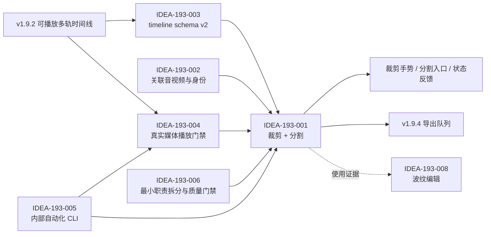

# /idea 需求池：QuickRec Full v1.9.3 基础剪辑与自动化 CLI

## 追踪信息

- 当前状态：需求池已确认；正式选择方案 B，待进入 `/prd` 澄清，播放准确性技术门禁尚未关闭。
- 入口：`/idea`。
- 目标版本：QuickRec Full v1.9.3。
- 评估日期：2026-07-28。
- 产品工作区：`E:\codex\QuickRec`。
- 当前正式版本：v1.9.2。
- 当前基线：
  - 分支：`master`。
  - HEAD：`91ab91cba324658d9bfadb7016a31f8e4e380efb`。
  - tag：`v1.9.2`。
- 当前事实源：
  - `README.md`
  - `doc/current.md`
  - `doc/releases/v1.9.2/`
- 上游来源：
  - `doc/releases/v1.9.2/prd.md`
  - `doc/releases/v1.9.2/dev_plan.md`
  - `doc/releases/v1.9.2/progress.md`
  - `doc/releases/v1.9.2/verification.md`
  - `doc/releases/v1.9.2/release-notes.md`
  - v1.9.2 时间线模型、命令、查询、播放、界面、测试、CI 和打包实现。
- 下游承接：进入 v1.9.3 `/prd` 澄清。
- 独立变更保护：工作区现有 `doc/current.md` 和
  `doc/technical/v2.0-repository-attribution-governance.md` 属于 v2.0
  贡献归属治理，不属于本需求池，不得混入 v1.9.3。
- 产品线边界：QuickRec Lite 不属于本轮范围，未作修改。
- 本文不构成开发授权，不实现代码，不编写 PRD、dev plan 或 progress。

## 入口判断

入口判断：`/idea`。

本轮需要判断的不是“能否给时间线再加几个按钮”，而是 v1.9.2 的可播放多轨时间线能否安全升级为用户可理解、数据可回滚、播放边界可信，并可被 v1.9.4 导出稳定读取的基础剪辑事实源。

候选项超过 2 个，因此使用 Markdown 需求池承接。当前证据足以证明“完整素材片段无法表达用户需要的局部内容”是版本路线中的真实结构缺口；但没有用户行为统计证明波纹编辑、专业快捷键或公开 CLI 是当前刚需。因此本轮必须控制为一个产品主线、两个工程支撑，并把真实媒体精度作为实现前门禁。

## 总体判断

### 真问题

v1.9.2 已经允许用户把完整素材放入多条视频轨和音频轨，调整时间位置并播放，但每个片段仍被 schema v1 限制为：

- `source_start_us` 必须为 0；
- `source_duration_us` 必须等于完整素材时长；
- `timeline_duration_us` 必须等于完整素材时长；
- 用户不能去除片头、片尾或把一段素材拆成多个独立片段。

这意味着时间线现在能表达“素材放在哪里”，却不能表达“实际使用素材的哪一段”。若 v1.9.4 直接读取这份数据进行导出，导出层将被迫自行猜测剪辑范围，或者继续只能导出完整素材，均不符合稳定、无歧义的数据边界。

该问题有**强项目证据和中等用户证据**：

- 强项目证据来自已发布路线、当前 schema 校验和 v1.9.4 的确定依赖；
- 中等用户证据来自“可播放时间线之后需要基础剪辑”的连续产品决策；
- 当前缺少真实用户剪辑频率、常用裁剪长度、分割次数和失败率数据，不能据此扩大到波纹编辑或专业剪辑器。

### 唯一产品主线

**已确认 v1.9.3 唯一产品主线：方案 B，支持片段边缘裁剪和按播放头分割，不支持波纹编辑。**

最小完整闭环应包含：

1. 调整片段源入点和源出点；
2. 在合法播放头位置分割片段；
3. 视频与其关联音频原子地联合裁剪、联合分割；
4. 非波纹编辑，其他片段的时间位置不自动改变；
5. 同轨继续禁止重叠；
6. 裁剪、分割后立即按新源范围播放、暂停和跳转；
7. 每个离散操作进入既有撤销、重做和原子保存体系；
8. 保存失败时界面、内存、磁盘和撤销栈零副作用；
9. 旧项目无感读取，第一次成功剪辑时再写入 timeline schema v2；
10. 回滚到 v1.9.2 时，v2 时间线被只读保留，不破坏项目和素材基础信息；
11. v1.9.4 导出只需读取稳定片段范围，不重新解释剪辑语义。

### 最多两个工程支撑模块

1. **统一内部自动化 CLI**：建立稳定的服务级命令入口，用于 CI、Codex 自动验证、候选包检查和发布验收；不作为普通用户的完整公开 CLI。
2. **剪辑职责最小拆分与增量质量门禁**：抽离剪辑领域命令、手势状态和必要片段操作组件，扩展 Ruff、Mypy、Coverage、Packaging 和 GUI 门禁；不全量重写现有大类。

### 不进入本版

- 波纹编辑；
- 变速、转场、滤镜、关键帧和视频变换；
- 音量、静音、声像、淡入淡出和波形；
- 正式导出和导出队列；
- 面向普通用户的完整公开 CLI；
- AI、字幕、摘要和云同步；
- WGC 和新的高刷新率能力；
- QuickRec Lite 改动；
- 全量架构重写。

## 证据映射

| 来源证据 | 证据状态 | 对应判断 |
| --- | --- | --- |
| v1.9.2 PRD 明确把 v1.9.3 定义为“基于既有片段身份增加裁剪、分割等受控命令” | 已确认 / 强 | 基础剪辑符合既定路线，不是临时扩张 |
| `src/utils/timeline_model.py` 中 `TIMELINE_SCHEMA_VERSION = 1`，并强制完整源范围 | 已确认 / 强 | v1.9.3 不能继续使用 schema v1 写入局部源范围 |
| `TimelineClip` 已有 `source_start_us`、`source_duration_us`、`clip_id`、`material_id` 和 `link_group_id` | 已确认 / 强 | 数据基础已经预留，不需要重建项目模型 |
| `src/services/timeline_query.py` 已按 `source_start_us + 片段内偏移` 生成播放源位置 | 已确认 / 强 | 查询算术支持局部源范围，但不能证明真实解码精度 |
| `tests/test_timeline_query.py` 覆盖了非零源入点的查询结果 | 已确认 / 中强 | 逻辑计算已验证，真实视频和音频边界仍需补证 |
| 真实 PyAV 集成测试只使用 `source_start_us = 0`，seek 后只断言可解码和音频非零 | 已确认 / 强反证 | 尚未证明非关键帧入点和音频采样边界准确 |
| `_AvAudioDecoder` 向前 seek 后把内部游标直接设为目标时间，未见基于解码帧 PTS 丢弃目标前样本的明确逻辑 | 已确认实现 / 风险假设 | 存在提前声音或边界偏差风险，但当前不能直接判定为 Bug |
| `TimelineCommandService` 已有候选模型、原子保存、待重试保存和 50 步撤销重做 | 已确认 / 强 | 剪辑命令应复用现有事务，不建立第二套保存体系 |
| 现有时间线画布只处理整片段拖动，没有裁剪手柄或分割手势状态 | 已确认 / 强 | v1.9.3 需要新增受控交互状态，但不能把领域规则塞入画布 |
| `TimelineCommandService` 1494 行、`TimelineEditorWindow` 1940 行、`TimelineCanvas` 725 行 | 已确认 / 强 | 直接继续堆叠会放大维护和测试成本，需要最小拆分 |
| 仓库已有多个独立脚本，但 `src/main.py` 没有统一 CLI 路由 | 已确认 / 强 | 自动验证入口分散、参数和报告合同不统一 |
| v1.9.2 发布证据包含 867 项测试通过、总体覆盖率 83.56%、打包测试 15 项通过 | 已确认 / 强 | v1.9.3 可沿用成熟质量基线，但不能以旧测试替代新剪辑门禁 |
| 当前没有真实用户裁剪次数、分割频率、波纹编辑需求或公开 CLI 使用数据 | 已确认 / 反证 | 不能把方案 C 或公开 CLI 直接判定为正式需求 |

## 数据证据包

- 决策问题：v1.9.3 应做到哪一级基础剪辑，哪些能力必须先验证。
- 数据 / 来源：版本文档、代码契约、自动化测试、发布验收和模块规模。
- 统计对象与粒度：当前仓库中的时间线数据结构、命令、真实媒体集成测试和发布测试结果。
- 时间范围：v1.9.2 发布基线及 2026-07-28 当前工作区。
- 数据新鲜度：代码和发布资料均为当前版本；缺少真实用户行为统计。
- 数据质量与代表性：
  - 对“当前实现能做什么、不能做什么”代表性高；
  - 对“用户是否需要波纹编辑、使用频率多高”代表性低。
- 关键发现：
  - 方案 B 与既有路线、数据预留和 v1.9.4 依赖直接对应；
  - schema v2 是数据安全要求，不是可选优化；
  - 查询层支持非零源入点，但真实媒体边界精度尚未证明；
  - CLI 的直接价值是降低验证摩擦，不是增加面向用户的功能面。
- 不能推出的结论：
  - 不能证明波纹编辑是 v1.9.3 刚需；
  - 不能证明当前 PyAV 音频 seek 已达到裁剪边界精度；
  - 不能证明普通用户需要公开 CLI；
  - 不能从单元测试数量推导 GUI 剪辑体验已经可用。
- 对时机的影响：
  - 方案 B 可以进入 `/prd`；
  - 播放准确性必须先做技术门禁；
  - 方案 C 和公开 CLI 暂不进入正式范围。

## 三档产品方案压力测试

### 方案 A：仅支持片段边缘裁剪

内容：

- 调整片段源入点和源出点；
- 视频与关联音频联合裁剪；
- 不支持按播放头分割；
- 非波纹编辑，其他片段位置不变。

优点：

- 范围小，能解决大部分片头和片尾冗余；
- 复用当前片段身份和拖动框架；
- 真实媒体门禁样本相对容易构造。

缺点：

- 无法把素材中间的多段有效内容拆开复用；
- 用户仍需重复加入同一素材并手工计算多个源范围；
- v1.9.4 导出前仍缺少基础分段语义；
- 作为“基础剪辑”产品闭环偏弱。

| 维度 | 分数 | 证据 / 理由 |
| --- | ---: | --- |
| 痛点强度 | 4 | 片头片尾冗余是明确剪辑问题，但只覆盖一部分场景 |
| 人群 / 场景清晰度 | 4 | 教程、演示和录屏素材的边缘清理场景明确 |
| 证据强度 | 3 | 路线和数据结构支持，缺少用户行为数据 |
| 频率 / 紧迫性 | 3 | 是后续导出前置，但不是当前发布故障 |
| 核心目标贡献 | 3 | 形成局部源范围，仍缺少基础分段 |
| 差异化 / 替代方案 | 2 | 重复加入素材可部分绕过，但操作成本高 |
| 成本可控性 | 4 | 范围较小，可在现有命令体系内实现 |
| 验证速度 | 4 | 可用受控媒体和打包 GUI 较快验证 |

总分：`27/40`，部分通过。适合作为内部最小里程碑或降级边界，不推荐单独作为 v1.9.3 正式产品范围。

### 方案 B：边缘裁剪 + 按播放头分割

内容：

- 支持片段源入点和源出点裁剪；
- 支持在合法播放头位置分割片段；
- 关联视频和音频原子联合操作；
- 非波纹编辑；
- 同轨不重叠，其他片段时间位置不自动改变；
- 保持稳定素材引用和可回滚身份；
- 裁剪、分割后立即按新源范围播放。

优点：

- 用户可以删除头尾、提取中间段并重复使用同一素材；
- 能形成用户可理解的最小剪辑闭环；
- v1.9.4 可直接读取明确的源范围和片段边界；
- 不引入波纹编辑的全局位置联动和复杂冲突。

缺点：

- 需要 schema v2、身份规则、手势、播放精度和迁移完整闭环；
- 分割关联音视频时必须原子地创建新身份；
- 非波纹模式会留下空白，需要明确产品反馈；
- 成本显著高于方案 A，但仍可拆成技术门禁、领域命令和 GUI 三段。

| 维度 | 分数 | 证据 / 理由 |
| --- | ---: | --- |
| 痛点强度 | 4 | 解决无法选择素材局部内容的核心缺口 |
| 人群 / 场景清晰度 | 5 | 在项目时间线内清理录屏、拆分讲解段落，任务明确 |
| 证据强度 | 3 | 路线和代码证据强，真实用户行为证据仍不足 |
| 频率 / 紧迫性 | 4 | 是 v1.9.4 导出前的必要产品边界 |
| 核心目标贡献 | 5 | 直接把可播放时间线推进为基础可剪辑时间线 |
| 差异化 / 替代方案 | 4 | 外部编辑器可替代，但会中断 QuickRec 项目闭环 |
| 成本可控性 | 3 | 成本中等，需严格禁止波纹和高级剪辑 |
| 验证速度 | 4 | 可用真实媒体矩阵、CLI 和 GUI 定向验证 |

总分：`32/40`，通过压力测试。证据强度为 3，刚好满足进入 `/prd` 的门槛；技术门禁未关闭前不得直接进入完整 GUI 实现。

### 方案 C：裁剪 + 分割 + 波纹编辑

内容：

- 包含方案 B；
- 裁剪、删除或移动片段时自动移动后续片段；
- 需要跨轨、关联音频、锁定轨道和空白区的全局联动规则。

优点：

- 连续叙事剪辑效率更高；
- 更接近成熟剪辑器的操作预期；
- 后续删除片段和紧凑排列更自然。

缺点：

- 一次操作可能修改大量片段，保存失败、撤销和冲突的爆炸半径大；
- 多轨波纹需要轨道锁定、同步锁、选择范围和跨轨策略；
- 与本版“不做专业剪辑器”的边界冲突；
- 当前没有用户证据证明其必要性。

| 维度 | 分数 | 证据 / 理由 |
| --- | ---: | --- |
| 痛点强度 | 3 | 提升效率，但不是最小剪辑闭环成立条件 |
| 人群 / 场景清晰度 | 3 | 重度连续剪辑用户明确，QuickRec 当前用户分布未知 |
| 证据强度 | 2 | 主要来自成熟剪辑器惯例，缺少本项目用户证据 |
| 频率 / 紧迫性 | 2 | 可在方案 B 后观察，当前不阻塞基本剪辑 |
| 核心目标贡献 | 3 | 有帮助，但会把版本推向更完整剪辑器 |
| 差异化 / 替代方案 | 3 | 手工移动可替代，效率较低 |
| 成本可控性 | 1 | 跨轨全局联动、撤销和事务风险高 |
| 验证速度 | 2 | 边界组合多，真实 GUI 验收成本高 |

总分：`19/40`，仅建议继续验证。证据强度低于 3、成本可控性低于 3，触发双重门槛，不能进入 v1.9.3 正式 PRD。

## 推荐产品契约

### 裁剪语义

- 裁剪只改变选中片段或其关联音视频组。
- 裁剪保持 `clip_id`、`material_id` 和现有 `link_group_id`。
- 调整源入点时，片段时间线起点保持不变，片段时长缩短。
- 调整源出点时，片段时间线起点保持不变，片段时长缩短。
- 本版不自动移动后续片段，不填补空白。
- 候选结果必须在提交前完整校验；无效拖动不写项目。

### 分割语义

- 只允许在片段内部的合法播放头位置分割。
- 左片段保留原 `clip_id`，右片段生成新 `clip_id`。
- 两个结果继续引用同一 `material_id`。
- 无关联音频时，只分割当前片段。
- 有关联音频时，视频和音频必须在同一时间点原子分割。
- 左侧关联音视频保留原 `link_group_id`，右侧关联音视频获得新的
  `link_group_id`。
- 分割不要求新增强制父子字段；来源范围、稳定素材 ID 和新片段 ID
  已足以支持播放与导出。
- 若未来确需审计来源，可在片段 `extensions` 中增加可选来源信息，
  不把谱系字段冻结为本版必需契约。

### 约束与失败

- 同轨继续禁止重叠。
- 片段不得越过素材源范围。
- 片段最小时长必须在 PRD 中明确，建议以“至少一个有效视频帧，并满足音频最小可解码范围”为基础，而不是任意固定毫秒。
- 分割点过近、位于边界、素材缺失、项目只读、未知 schema 或保存待处理时，操作禁用或给出明确失败。
- 保存失败沿用候选模型事务：界面、内存、项目文件和撤销栈保持原状态。
- 每次连续手势只形成一个撤销命令。
- 撤销和重做必须原子恢复关联视频、音频和所有身份。

## timeline schema v2 判断

### 是否必须升级

**必须升级为 timeline schema v2。**

理由：

1. schema v1 明确拒绝非零 `source_start_us`；
2. schema v1 要求片段覆盖完整源素材；
3. 若 v1.9.3 在 schema v1 下写入局部源范围，v1.9.2 会把数据判定为损坏，而不是安全地只读保留；
4. schema v2 可以复用 v1.9.2 已验证的“未知新版本只读、原始扩展往返保留”机制。

### 推荐迁移语义

- 项目顶层 `ProjectFile.schema_version` 继续保持 1，本版只升级
  `ProjectFile.extensions["quickrec.timeline"].schema_version`。
- 打开 schema v1 项目时，在内存中按兼容模型读取，不因查看或播放自动改写文件。
- 第一次成功执行 v1.9.3 裁剪或分割命令时，把候选时间线持久化为 schema v2。
- 保存前保留项目 `.bak`，并继续使用现有原子写入和外部修改冲突检查。
- schema v1 到 v2 的转换失败时，保持原文件不变并进入可理解的只读或失败状态。
- v1.9.2 回滚读取 schema v2 时进入只读，保留原始时间线扩展；项目名称、素材引用和其他扩展仍可安全读取。
- 未知项目扩展、未知时间线字段、轨道扩展和片段扩展必须往返保留。
- 不通过删除、重建或展开为独立文件完成迁移。

### 时间与身份

- 持久化时间单位继续使用非负整数微秒。
- 不把帧编号设为主时间基准，因为项目可能包含不同 FPS 的素材和音频。
- UI 可以按素材 FPS 计算吸附和帧级显示，但落盘事实仍为整数微秒。
- v2 允许 `source_start_us >= 0`，并要求
  `source_start_us + source_duration_us <= 素材时长`。
- 对正常速度片段，
  `timeline_duration_us == source_duration_us`；变速属于后续 schema 扩展。
- `clip_id` 表示时间线片段实例，`material_id` 表示源素材，
  `link_group_id` 只表示当前需要原子联动的音视频组。

## 播放准确性技术门禁

### 当前证据边界

- 已证明：查询层能够计算非零源位置。
- 已证明：当前 PyAV 后端可以播放、暂停、随机跳转 QuickRec H.264/AAC MP4。
- 已证明：中文和空格路径已有基础集成测试。
- 未证明：非关键帧裁剪入点的首帧是否准确。
- 未证明：音频 seek 后是否严格丢弃目标时间前的样本。
- 未证明：分割边界前后是否无重复帧、跳帧、提前声音或残留声音。
- 未证明：这些行为在 PyInstaller 候选包中与源码环境一致。

### 风险判断

当前 `_AvAudioDecoder` 在向前 seek 后把内部游标设为目标时间，但代码中未见使用解码帧 PTS 显式裁掉目标前样本。该事实构成**高风险假设**，不是已经确认的缺陷。必须通过带可测音频脉冲和帧标记的真实媒体证明或推翻。

### 最小门禁矩阵

1. 非关键帧位置的视频裁剪预览；
2. 非零 `source_start_us` 的视频首帧准确性；
3. 非零 `source_start_us` 的音频起点准确性；
4. 分割边界前后无明显重复帧、漏帧、提前声音和残留声音；
5. 两个连续片段无意外空洞；
6. 关联视频和音频联合分割后保持同步；
7. 中文和空格路径；
8. QuickRec 自身生成的 H.264/AAC MP4；
9. 源码和 PyInstaller 环境结果一致；
10. 30 秒和 10 分钟样本；
11. 多次播放、暂停、跳转、项目切换和退出后无残留音频或子进程；
12. 既有门槛继续适用：
    - 随机跳转不超过 500 毫秒；
    - 暂停响应不超过 200 毫秒；
    - 音画绝对偏差不超过 40 毫秒；
    - 10 分钟漂移增量不超过 20 毫秒。

### 决策门槛

- **继续**：真实媒体和候选包均能在约定容差内还原源入点，连续片段边界无可感知重复、漏播或残留。
- **缩小**：视频边界准确但音频边界不达标时，停止联合音视频正式实现，先修播放后端；不得静默改成只裁视频。
- **停止 / 转向**：当前 PyAV 路线无法通过且替代后端会显著扩大包体、许可证或架构范围时，v1.9.3 停在技术决策点，由用户重新授权，不用 UI 演示冒充完成。

## 工程支撑一：统一内部自动化 CLI

### 产品定位

CLI 解决的是开发、CI 和验收过程中入口分散、报告不可机器读取、隔离依赖人工保证的问题。它不为普通用户建立第二套产品界面，也不通过模拟按钮调用业务逻辑。

### 推荐最小命令

```text
QuickRecCLI doctor --json
QuickRecCLI record --mode fullscreen --duration 3 --fps 60 --audio none
QuickRecCLI probe <video> --json
QuickRecCLI project validate <project.qrproj>
QuickRecCLI timeline validate <project.qrproj>
QuickRecCLI smoke --suite editing --evidence-dir <path>
```

### 推荐形态

- 推荐在同一分发目录提供独立的内部 `QuickRecCLI.exe`。
- 不推荐使用 GUI subsystem 的 `QuickRec.exe --cli`，因为标准输出、退出码和无界面运行语义不稳定。
- 不推荐只提供 `python -m ...`，因为它无法验证候选包身份和打包依赖。
- CLI 不创建桌面快捷方式、不加入普通用户菜单，文档明确标记为内部自动化接口。

### 合同

- 每个命令有稳定退出码和版本化 JSON 报告。
- JSON 至少包含：
  - `schema_version`
  - 命令和参数摘要
  - 源码 / frozen 身份
  - 应用版本、构建 SHA 或可用的构建身份
  - 开始和结束时间
  - 成功、失败、取消、超时或依赖缺失状态
  - 脱敏后的证据路径
  - 分项检查和错误分类
- 有明确超时，超时后停止子进程并保留可诊断证据。
- 默认禁止写入真实 APPDATA、配置、中央索引和用户输出目录。
- `record` 和 `smoke` 必须显式提供隔离根目录或由 CLI 创建一次性受控目录。
- 日志不输出完整环境变量、硬件序列号或不必要的完整用户路径。
- 不提供无确认的删除项目、删除素材、清空索引或覆盖项目命令。
- 服务调用直接复用录制、媒体、项目和时间线服务，不启动完整工作台模拟点击。

### CLI 不能替代

- 托盘菜单和结果条交互；
- 区域和窗口框选体验；
- 100%、125%、150% DPI 和视觉布局；
- 真实系统声音、麦克风和双音频听音；
- GUI 的拖动、裁剪手柄、分割反馈和确认弹窗；
- 发布前真实打包 GUI 手动验收。

## 工程支撑二：最小职责拆分与质量门禁

### 推荐拆分

1. **剪辑领域变换**：
   - 从现有 `TimelineCommandService` 中分离纯候选模型变换；
   - 提供裁剪、分割、关联组解析和身份生成；
   - 不自行写磁盘，不拥有撤销栈。
2. **命令与事务协调**：
   - 现有 `TimelineCommandService` 继续负责只读检查、候选校验、原子保存、待重试保存、撤销和重做；
   - 不在领域变换中复制项目事务。
3. **手势状态**：
   - 从 `TimelineCanvas` 抽离裁剪手势、候选边界和取消状态；
   - 画布继续负责绘制、命中测试和发出意图，不直接修改时间线数据。
4. **片段操作组件**：
   - 可建立最小片段操作栏或属性组件，承接分割、源范围和状态反馈；
   - `TimelineEditorWindow` 继续负责窗口、会话和播放协调，不实现剪辑不变量。

### 禁止借机重写

- 不全量重写 `QuickRecApp`；
- 不全量重写 `WorkbenchWindow`；
- 不全量重写 `ProjectPage`；
- 不全量重写 `TimelineEditorWindow`；
- 不全量重写 `RecorderManager`；
- 不改变录制、素材库和项目基础存储的所有权边界。

### 质量门禁

- schema v1/v2 读取、延迟迁移、未知字段保留和回滚；
- 裁剪、分割、联合音视频和身份不变量；
- 同轨不重叠、边界和最小时长；
- 保存失败零副作用；
- 撤销、重做和连续手势合并；
- 非零源入点真实播放；
- 中文和空格路径；
- CLI 隔离、退出码、JSON schema 和超时；
- Packaging 中 GUI 与 CLI 的依赖和身份；
- 项目总体语句覆盖率不低于 80%；
- 新增剪辑核心模块语句覆盖率不低于 85%；
- 新增页面与手势协调模块语句覆盖率不低于 80%；
- Ruff、Mypy、Compileall、`git diff --check`；
- 源码、候选包、GUI、真实媒体和三档 DPI；
- QuickRec Lite 工作区保持未修改。

## 承重假设与最小实验

| 假设 ID | 承重主张 | 若何时失败 | 当前证据 | 状态 | 最小实验 | 继续阈值 | 停止 / 转向阈值 |
| --- | --- | --- | --- | --- | --- | --- | --- |
| H-193-01 | 方案 B 足以形成可理解的基础剪辑闭环 | 用户完成中段提取仍必须依赖外部编辑器或波纹语义 | 路线和任务闭环支持，缺少用户行为数据 | 部分支持 | 用可点击原型完成“去头尾、切出中段、撤销恢复”三任务 | 三任务均无需额外专业概念即可完成 | 必须加入大量轨道联动才能完成时，缩小或重新定义版本 |
| H-193-02 | 当前播放后端能准确播放非零源入点 | 视频边界偏差超过一帧，或音频偏差/残留超过门槛 | 查询算术支持；真实边界未测 | 未知 | 帧编号视频、音频脉冲、连续片段、30 秒和 10 分钟真实媒体矩阵 | 源码和候选包均满足边界、同步和资源门槛 | 当前后端无法通过且修复会扩大为后端重写时停止 |
| H-193-03 | timeline schema v2 可无损延迟迁移 | 打开旧项目即改写、未知字段丢失，或 v1.9.2 回滚覆盖 v2 | 未知版本只读和扩展往返已有测试 | 已支持 | v1 打开不写、首次剪辑写 v2、v1.9.2 回滚只读、备份恢复矩阵 | 所有文件哈希和未知字段行为符合合同 | 任一破坏性改写或字段丢失即阻塞 |
| H-193-04 | 关联音视频可以通过现有 link group 原子编辑 | 分割后身份歧义、音视频不能共同撤销，或单边保存 | 现有 link group 校验和原子命令支持 | 部分支持 | 构造关联/非关联、缺失音轨、保存失败和撤销重做测试 | 每次操作只产生合法组且失败零副作用 | 需要引入复杂同步锁或全局波纹时缩小范围 |
| H-193-05 | 内部 CLI 能复用服务而不启动完整 GUI | 命令必须依赖工作台按钮或真实用户目录才能执行 | 脚本已有服务直调经验，但入口分散 | 部分支持 | 先实现 `doctor/probe/timeline validate` 的源码和 frozen 原型合同 | 无 GUI、隔离数据、稳定 JSON/退出码、候选包可运行 | 必须复制业务逻辑或污染用户数据时重新设计服务边界 |

## 需求总览

| ID | 标题 | 类型 | 证据等级 | 压力测试 | 置信度 | 分档结论 | 依赖关系 | 建议去向 | 最小下一步 |
| --- | --- | --- | --- | ---: | --- | --- | --- | --- | --- |
| IDEA-193-001 | 边缘裁剪与按播放头分割 | 产品主线 | 中强 | 32/40 | 中高 | 高价值、范围受控 | schema v2、播放门禁 | 进入 `/prd` | 确认剪辑交互和最小时长 |
| IDEA-193-002 | 关联音视频原子剪辑与身份规则 | 产品契约 | 强 | 35/40 | 高 | 高价值 | link group、事务命令 | 随主线进入 | 冻结 trim/split 身份不变量 |
| IDEA-193-003 | timeline schema v2 延迟迁移与回滚 | 数据契约 | 强 | 36/40 | 高 | 必需门禁 | 项目扩展、备份、旧版只读 | 随主线进入 | 先写迁移和回滚失败测试 |
| IDEA-193-004 | 非零源入点播放准确性门禁 | 技术门禁 | 中强 | 32/40 | 中 | 必须先验证 | PyAV、真实媒体、Packaging | 继续验证后进入实现 | 执行真实媒体 spike |
| IDEA-193-005 | 统一内部自动化 CLI | 工程支撑一 | 强 | 31/40 | 中高 | 中高价值 | 服务接口、打包、隔离 | 随主线进入 | 冻结命令、JSON 和退出码合同 |
| IDEA-193-006 | 剪辑职责最小拆分与增量质量门禁 | 工程支撑二 | 强 | 31/40 | 高 | 范围受限通过 | 命令、画布、编辑窗口、CI | 随主线进入 | 只抽离剪辑变换和手势状态 |
| IDEA-193-007 | v1.9.2 事实源状态治理 | 直接治理 | 强 | 31/40 | 高 | 文档治理，不占产品主线 | progress、verification | 独立处理 | 修正已被验证覆盖的陈旧状态 |
| IDEA-193-008 | 波纹编辑 | 后续产品能力 | 弱 | 19/40 | 中 | 待验证 | 方案 B、轨道锁定、同步锁 | 暂不做 | v1.9.3 后收集真实使用证据 |
| IDEA-193-009 | 面向普通用户的完整公开 CLI | 产品扩展 | 弱 | 15/40 | 低 | 当前不建议 | 内部 CLI、用户研究、支持合同 | 暂不做 | 先验证内部自动化价值 |
| IDEA-193-010 | 变速、转场、滤镜、正式导出等完整剪辑能力 | 范围外集合 | 弱 | 9/40 | 高 | 过大 | v1.9.3、v1.9.4 路线 | 后续版本 | 保持非目标 |

## 压力测试评分总表

| ID | 痛点 | 场景 | 证据 | 频率 | 目标贡献 | 替代方案 | 成本可控 | 验证速度 | 总分 |
| --- | ---: | ---: | ---: | ---: | ---: | ---: | ---: | ---: | ---: |
| IDEA-193-001 | 4 | 5 | 3 | 4 | 5 | 4 | 3 | 4 | 32 |
| IDEA-193-002 | 5 | 5 | 4 | 4 | 5 | 5 | 3 | 4 | 35 |
| IDEA-193-003 | 5 | 5 | 5 | 3 | 5 | 5 | 3 | 5 | 36 |
| IDEA-193-004 | 5 | 5 | 3 | 4 | 5 | 5 | 2 | 3 | 32 |
| IDEA-193-005 | 3 | 5 | 4 | 4 | 4 | 4 | 3 | 4 | 31 |
| IDEA-193-006 | 4 | 5 | 5 | 3 | 4 | 4 | 2 | 4 | 31 |
| IDEA-193-007 | 2 | 5 | 5 | 3 | 3 | 4 | 4 | 5 | 31 |
| IDEA-193-008 | 3 | 3 | 2 | 2 | 3 | 3 | 1 | 2 | 19 |
| IDEA-193-009 | 2 | 2 | 1 | 1 | 2 | 2 | 2 | 3 | 15 |
| IDEA-193-010 | 1 | 2 | 1 | 1 | 1 | 2 | 0 | 1 | 9 |

说明：

- `IDEA-193-004` 和 `IDEA-193-006` 的成本可控性低于 3，不能因为总分较高而直接扩大实现，必须分别采用技术 spike 和最小拆分。
- `IDEA-193-008` 的证据强度低于 3、成本可控性低于 3，最高只能判定为继续验证。
- `IDEA-193-007` 的用户痛点低于 3，不得包装成产品主线；它只适合独立文档治理。

## 依赖关系



## 三档版本范围

| 档位 | 内容 | 优点 | 主要缺口 / 风险 | 建议 |
| --- | --- | --- | --- | --- |
| 最小 | 方案 A：仅边缘裁剪；schema v2；关联音视频；最小测试 | 快、风险较低 | 无法从素材中间拆段，基础剪辑闭环偏弱 | 仅作内部里程碑或门禁失败后的重新决策边界 |
| 推荐 | 方案 B：裁剪 + 分割；非波纹；schema v2；播放门禁；内部 CLI；最小职责拆分和质量门禁 | 用户价值、后续导出和成本平衡最好 | 真实媒体边界精度必须先通过 | 推荐进入 `/prd` |
| 过大 | 方案 C，加波纹、专业快捷键、高级音频、变速、转场、正式导出或公开 CLI | 看起来更完整 | 跨轨联动、事务、打包和验收范围失控 | v1.9.3 暂不做 |

## 各候选详细分流

### IDEA-193-001 边缘裁剪与按播放头分割

- 输入类型：产品能力。
- 产品问题：完整素材片段不能表达实际使用范围。
- 目标用户 / 场景：在 QuickRec 项目中清理录屏头尾、提取中段并继续编排的创作者。
- 当前替代方案：外部编辑器，或重复加入素材后手工布置完整片段；前者中断工作台闭环，后者不能真正限制源范围。
- 用户价值：高。
- 成本：中高，但可按数据、命令、GUI 分阶段。
- 主要风险：边界精度、关联音视频、迁移和撤销。
- 验证依赖：schema v2、真实媒体门禁、候选包 GUI。
- 结论：进入 `/prd`。
- 最小下一步：确认裁剪手柄、分割入口、最小时长、吸附和失败反馈。

### IDEA-193-002 关联音视频原子剪辑与身份规则

- 输入类型：产品数据契约。
- 产品问题：视频与内嵌音频若被单边修改，会产生播放和导出歧义。
- 当前证据：现有时间线已用 `link_group_id` 建立一对一关联和原子移动。
- 用户价值：高，用户不应手工修复默认同步关系。
- 成本：中，需覆盖关联缺失、保存失败和撤销。
- 主要风险：分割后复用错误 link group，导致跨片段误联动。
- 结论：作为主线 P0 契约进入 `/prd`。
- 最小下一步：确认“左保留、右新建”的 clip/link 身份规则。

### IDEA-193-003 timeline schema v2 延迟迁移与回滚

- 输入类型：数据安全和兼容。
- 产品问题：schema v1 无法合法表示局部源范围。
- 当前证据：代码校验和未知版本只读机制均已明确。
- 用户价值：间接但关键，避免项目损坏和回滚丢数据。
- 成本：中，可复用扩展往返、备份和原子保存。
- 主要风险：只查看项目就改写，或旧版误判损坏。
- 结论：主线不可缺少的数据门禁。
- 最小下一步：先写 v1 只读打开、首次编辑写 v2、v1.9.2 回滚和未知字段往返测试。

### IDEA-193-004 非零源入点播放准确性门禁

- 输入类型：技术验证。
- 产品问题：若预览边界不可信，用户看到的剪辑结果与未来导出可能不一致。
- 当前证据：查询算术通过；真实解码边界证据不足。
- 用户价值：高，直接影响剪辑信任。
- 成本：高，涉及可测媒体、音频采样和候选包。
- 主要风险：当前音频 seek 实现可能提前播放目标前样本。
- 结论：继续验证；通过后才能进入正式 UI 实现。
- 最小下一步：制作帧编号 + 音频脉冲样本，执行源码和 frozen 对照 spike。

### IDEA-193-005 统一内部自动化 CLI

- 输入类型：工程支撑。
- 工程问题：硬件、媒体、项目和时间线验证脚本入口分散，报告和隔离合同不统一。
- 当前证据：仓库已有多个独立 `argparse` 脚本，GUI 入口没有统一 CLI。
- 用户价值：间接；提升测试速度、发布可信度和 Agent 可操作性。
- 成本：中，前提是复用服务而非复制业务。
- 主要风险：CLI 与 GUI 产生两套逻辑，或默认污染用户数据。
- 结论：作为工程支撑一随主线进入。
- 最小下一步：先冻结 `doctor/probe/project validate/timeline validate` 的 JSON 和退出码合同，再接录制与 editing smoke。

### IDEA-193-006 剪辑职责最小拆分与增量质量门禁

- 输入类型：工程支撑。
- 工程问题：命令服务、编辑窗口和画布继续增长会让剪辑规则、手势和协调难以独立测试。
- 当前证据：三个核心模块分别为 1494、1940 和 725 行。
- 用户价值：间接；降低回归和保存错误风险。
- 成本：中高，若失控会变成架构重写。
- 主要风险：借拆分改变既有所有权，延误产品主线。
- 结论：范围受限进入；只抽离剪辑领域变换、手势状态和必要片段操作组件。
- 最小下一步：在 dev plan 中先画清输入、输出、事务和 UI 责任，不按文件行数机械拆类。

### IDEA-193-007 v1.9.2 事实源状态治理

- 输入类型：直接治理。
- 问题：已发布验证资料与个别历史 progress 勾选状态可能存在陈旧口径。
- 当前证据：发布 verification 已证明部分历史待办，progress 仍可能保留旧状态。
- 用户价值：低到中，主要帮助后续模型和发布接手。
- 成本：低。
- 结论：独立文档提交直接治理，不占 v1.9.3 产品范围，不与 v2.0 贡献归属文档混提。
- 最小下一步：按 tag、verification 和 release notes 对照修正，不重写历史验收证据。

### IDEA-193-008 波纹编辑

- 输入类型：产品扩展。
- 产品问题：非波纹编辑后用户需要手工移动后续片段。
- 当前证据：成熟剪辑器惯例，缺少 QuickRec 用户使用证据。
- 用户价值：对重度编辑用户较高，对当前轻量基础剪辑未知。
- 成本：高。
- 结论：v1.9.3 暂不做。
- 最小下一步：在方案 B 发布后记录裁剪/分割后手工移动次数和用户反馈，再重新进入 `/idea`。

### IDEA-193-009 面向普通用户的完整公开 CLI

- 输入类型：产品扩展。
- 产品问题：当前没有证据证明普通用户需要用命令行操作 QuickRec。
- 当前证据：仅有开发和验收效率诉求。
- 用户价值：未知。
- 成本：中高，涉及长期兼容、帮助文档、安全和支持合同。
- 结论：暂不做；内部 CLI 不承诺公开稳定 API。
- 最小下一步：内部 CLI 至少运行一个版本，再评估真实外部需求。

### IDEA-193-010 完整剪辑与导出能力集合

- 输入类型：范围扩张。
- 产品问题：这些能力分别属于 v1.9.4 或 2.0 之后，不是 v1.9.3 的最小问题。
- 当前证据：版本路线已明确分阶段。
- 结论：保持非目标。

## 直接治理、PRD、验证和暂不做

### 现在直接治理

- 对照 v1.9.2 verification 和 release notes 修正陈旧 progress 状态；
- 保持 v2.0 贡献归属治理文档为独立变更；
- 若继续处理重复实例 / 双托盘问题，应走独立 Bugfix，不包装进基础剪辑；
- 不改业务代码，不占 v1.9.3 产品主线。

### 进入 `/prd`

- 方案 B：边缘裁剪 + 按播放头分割；
- 关联音视频原子剪辑和身份不变量；
- timeline schema v2 延迟迁移、兼容和回滚；
- 非波纹、同轨不重叠、边界和最小时长规则；
- 撤销、重做、自动保存和保存失败回滚；
- 缺失、重新定位、只读、损坏和外部冲突；
- 为 v1.9.4 保留稳定、无歧义的源范围读取契约；
- 两个工程支撑模块。

### 继续验证

- 非零源入点视频和音频准确性；
- 分割边界连续播放；
- 30 秒和 10 分钟音画同步；
- 源码和 PyInstaller 一致性；
- CLI frozen 形态、隔离和 JSON 合同。

### 暂不做

- 波纹编辑；
- 公开 CLI；
- 高级剪辑、正式导出和 AI；
- 新捕获后端、高刷扩展和 Lite 改动。

## 进入 `/prd` 的推荐范围

已确认 v1.9.3 PRD 只承接：

### 一个产品主线

**项目时间线中的边缘裁剪、按播放头分割和联合音视频基础剪辑闭环。**

### 两个工程支撑

1. 统一内部自动化 CLI；
2. 剪辑职责最小拆分与受影响范围质量门禁。

### 实现前硬门禁

1. timeline schema v2 延迟迁移和 v1.9.2 回滚测试先通过；
2. 非零源入点真实视频、音频和连续片段播放 spike 先通过；
3. 技术门禁失败时停下，不用方案 A 或纯 UI 演示自动替代正式范围。

## 仍需在 `/prd` 澄清的问题

1. 裁剪的正式入口采用片段两侧手柄、片段属性数值输入，还是两者同时提供。
2. 播放头分割的按钮位置、快捷键和边界禁用规则。
3. 最小时长按一帧、固定毫秒还是“视频帧 + 音频可解码范围”的组合规则。
4. 裁剪是否默认吸附源帧边界；不同 FPS 素材如何显示精度。
5. 关联音视频是否在 v1.9.3 永远联合编辑，是否明确不提供取消关联。
6. 缺失素材上的裁剪/分割是否全部禁用，并保留哪些只读范围信息。
7. schema v1 项目执行非剪辑结构命令时是否继续保存 v1，还是统一在首次任何时间线写入时升级 v2。
8. 保存失败出现 pending save 时，新的裁剪手势如何被锁定和恢复。
9. 分割成功后的默认选中项、播放头位置和滚动定位。
10. 技术门禁的首帧容差是否明确为不超过一帧，音频边界是否沿用 40 毫秒上限。
11. 内部 CLI 最终打包为独立 `QuickRecCLI.exe`，还是采用其他不启动 GUI 的控制台入口。
12. CLI JSON schema 版本、退出码范围、默认超时和隔离根目录参数名称。
13. `record` 命令本版是否只承诺全屏，区域和窗口继续留给 GUI 验收。
14. editing smoke 是否允许生成受控项目副本，严禁直接修改输入项目。
15. v1.9.4 导出读取的最小片段接口是否只包含素材解析、源范围、时间范围、轨道顺序和关联关系。

## 下一阶段建议

- 推荐下一步：进入 v1.9.3 `/prd` 澄清，先锁定上述 15 个问题。
- PRD 类型：正式推进型 PRD，但带两个前置技术验证门禁。
- PRD 不应把技术门禁写成已经通过，也不应提前定义波纹、导出或公开 CLI。
- 在 PRD 确认后，再进入原型、dev plan 和 progress；当前不应直接实现。
