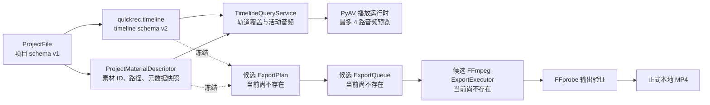
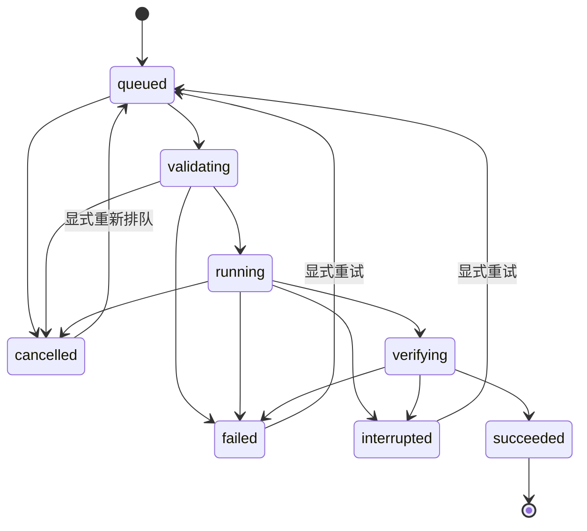
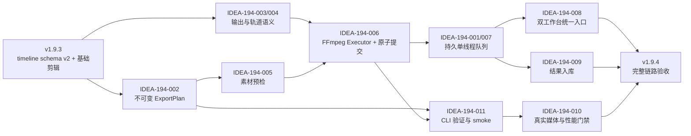

# /idea 需求池：QuickRec Full v1.9.4 导出队列与完整链路验收

## 追踪信息

- 入口判断：`/idea`
- 当前状态：需求池已形成，尚未进入正式 PRD
- 目标版本：QuickRec Full v1.9.4
- 当前正式基线：v1.9.3
- 当前基线提交：`bfa36435f8ba30bb00f0bbaf95e8cfc9b1e13b8b`
- 当前基线 tag：`v1.9.3`
- 上游来源：
  - `doc/releases/v1.9.2/prd.md`
  - `doc/releases/v1.9.3/prd.md`
  - `doc/releases/v1.9.3/dev_plan.md`
  - `doc/releases/v1.9.3/progress.md`
  - `doc/releases/v1.9.3/verification.md`
  - `doc/releases/v1.9.3/release-notes.md`
  - v1.9.3 发布后项目 Review
- 下游承接：确认本需求池后进入 v1.9.4 `/prd` 澄清
- 当前事实源：`README.md`、`doc/current.md`、v1.9.3 正式发布文档及当前 master 代码
- 最后更新：2026-07-29
- 范围保护：
  - 本文不是 PRD，不冻结最终字段、状态枚举、FFmpeg 参数或 UI 文案。
  - QuickRec Lite 不属于本轮范围。
  - `doc/technical/` 下现有 v2.0 独立未跟踪文档不属于本需求池，不得混入 v1.9.4。

## 入口判断

`/idea`

当前要解决的是“v1.9.4 应以什么最小、可信的方式交付正式导出”，而不是直接设计实现细节或开始编码。

## 总体判断

### 真问题

QuickRec Full 已形成“录制 -> 素材库 -> 项目 -> 时间线 -> 裁剪与分割”的本地创作链路，但项目成果仍不能在 QuickRec 内生成正式 MP4。用户必须依赖外部编辑器完成最后一步，项目工作台尚未闭环。

这是一个真实且与既定版本路线直接相关的问题：

1. v1.9.2 与 v1.9.3 已连续把 v1.9.4 定义为“读取稳定时间线事实并生成正式输出”。
2. timeline schema v2 已能表达轨道、片段、素材、时间位置、源范围和关联音视频。
3. 当前代码没有正式的 `ExportPlan`、`ExportJob`、`ExportQueue` 或 `ExportExecutor` 领域。
4. 录制编码、缩略图生成和音频混合中的 FFmpeg 调用不能直接冒充项目导出链路。

### 唯一产品主线

推荐进入 v1.9.4 的唯一产品主线是：

> 从项目 timeline schema v2 创建不可变导出计划，通过单工作线程持久队列生成、验证并原子提交本地 MP4，同时提供进度、取消、失败诊断、重试和应用重启恢复。

### 最多两个工程支撑模块

1. 不可变 `ExportPlan` 与独立 FFmpeg `ExportExecutor`。
2. QuickRecCLI、CI、Packaging、Coverage 与真实媒体导出门禁。

### 为什么不选其他方向

- 单次同步导出能生成文件，但不能满足持久队列、重启恢复和失败重试目标。
- 并发导出会争用 CPU、磁盘、FFmpeg 和音频混合资源，当前没有用户证据证明其价值。
- 硬件编码、公开高级编码参数、云同步和 AI 都会显著扩大兼容、支持和发布成本。

### 当前结论

- 进入 `/prd`：单工作线程持久导出队列及其完整安全链路。
- 继续技术验证：FFmpeg filter graph、八路音频、长项目、取消与崩溃恢复、长路径。
- 需要 PRD 澄清：输出规格、自动入库、任务恢复启动规则、队列上限。
- 暂不做：并发导出、硬件编码、公开高级参数、云同步、AI、Lite 改动。

## 产品问题

### 目标用户

- 已使用 QuickRec 完成录制、素材整理和时间线编排的本地创作者。
- 需要把项目结果交付为可播放 MP4，但不希望再到外部软件重复编排的用户。

### 核心场景

1. 用户在剪辑工作台确认时间线内容。
2. 用户创建导出任务并选择最小输出设置。
3. QuickRec 冻结本次导出输入。
4. 任务进入队列并依次执行。
5. 用户可以查看进度、取消、诊断失败并重试。
6. 通过验证的 MP4 原子提交到目标目录。
7. 应用关闭、崩溃或系统重启后，任务事实仍可恢复。

### 不做会怎样

- 项目、时间线和基础剪辑仍停留在“只能预览”的中间状态。
- 用户必须转到外部编辑器重新导入素材或重建编排。
- v2.0 完整工作台缺少最关键的结果出口。

## 当前对象与数据流

## 证据映射

| 来源证据 | 对应候选需求 | 证据等级 | 说明 |
| --- | --- | --- | --- |
| v1.9.2、v1.9.3 PRD 均把 v1.9.4 定义为正式导出版本 | 产品主线 | 强 | 版本路线连续且明确 |
| `timeline_model.py` 已保存稳定轨道、片段、素材、源范围和关联组 | `ExportPlan` | 强 | 导出输入具备结构化事实 |
| v1.9.3 已验证裁剪、分割、全局波纹、撤销重做和原子保存 | 快照与导出语义 | 强 | 时间线编辑结果已经持久化 |
| `timeline_query.py` 已定义最高视频轨覆盖与活动音频查询 | 画面和音频语义 | 中强 | 可复用规则，但尚未转成 FFmpeg filter graph |
| 时间线模型允许每类最多 8 条轨道 | 八路音频导出 | 中强 | 数据模型支持，真实导出尚未验证 |
| PyAV 预览后端当前最多混合 4 路音频 | 预览与导出一致性 | 强反证 | 直接导出 8 路会与当前预览存在语义差异 |
| `media_metadata.py` 已有 source/frozen FFmpeg、FFprobe 定位与错误分类 | 依赖解析与输出验证 | 强 | 可复用基础能力 |
| `project_store.py` 已使用备份、临时文件、`fsync` 和 `os.replace` | 队列存储与原子提交 | 中强 | 有可参考模式，但不是导出实现 |
| 待入库录制已有持久 JSON、状态、重试和损坏恢复模式 | 持久队列 | 中强 | 能证明项目已有类似基础，不代表可直接复用领域模型 |
| QuickRecCLI 已有隔离目录、JSON 合同、稳定退出码和 frozen smoke | 导出 CLI | 强 | 适合扩展，不需要新建第二套 CLI |
| CI 已覆盖 Windows、FFmpeg/FFprobe、Packaging、Coverage | 导出质量门禁 | 强 | 可承接新 smoke，但真实长项目仍需本机证据 |
| 当前仓库没有正式导出领域或相关测试 | 全部导出候选 | 强 | 说明本版不是小型 UI 补丁 |
| 尚无导出使用频率、队列长度或并发诉求数据 | 队列规模、并发 | 弱 | 不支持并发队列或复杂调度 |

## 数据证据包

- 决策问题：v1.9.4 应采用哪种导出执行方式，才能闭合项目创作链路且不扩大为专业渲染系统。
- 数据 / 来源：本地代码、正式版本文档、测试与 CI 配置。
- 统计对象与粒度：模块、数据契约、测试能力和发布路径；不包含真实用户行为样本。
- 时间范围：截至 v1.9.3 正式发布。
- 数据新鲜度：2026-07-29 本地 master 代码与正式文档。
- 数据质量与代表性：
  - 工程事实证据强。
  - 用户导出频率、常用输出规格、平均项目规模和并发诉求没有遥测。
- 关键发现：
  - 时间线数据基础已具备。
  - 正式导出领域完全缺失。
  - 预览最多 4 路音频，模型允许 8 路，存在一致性门禁。
  - 现有 FFmpeg 调用分别服务录制和缩略图，缺少长任务状态、取消、验证和原子提交。
- 反证 / 替代解释：
  - 用户可以继续使用外部编辑器导出。
  - 如果用户只偶尔导出，单次同步导出可能暂时够用。
  - 当前没有证据支持并发导出或复杂调度。
- 不能推出的结论：
  - 不能从代码路线推断用户一定需要同时排多个任务。
  - 不能从预览播放正常推断 FFmpeg 导出一定音画一致。
  - 不能从短样本推断 30 分钟、100 片段和八路音频稳定。
- 对价值与时机的影响：
  - “生成正式 MP4”价值成立。
  - “持久单工作线程队列”适合作为最小可靠实现。
  - 并发、硬件编码和公开高级参数缺少证据。

## 三种执行方案压力测试

### 方案 A：单次同步导出

内容：

- 用户在剪辑工作台发起导出。
- 当前窗口直接等待 FFmpeg 完成。
- 不建立持久任务队列。
- 应用退出或崩溃后只保留临时文件和日志。

优点：

- 实现成本最低。
- 状态和 UI 较少。
- 可快速证明单个项目能生成 MP4。

缺点：

- 长项目会让用户感觉工作台被占用。
- 无法可靠表达排队、重启恢复和失败重试。
- 不符合已经明确的“导出队列与完整链路”目标。
- 后续升级队列仍需重做任务身份和持久化。

| 维度 | 分数 | 证据 / 理由 |
| --- | ---: | --- |
| 用户痛点强度 | 4 | 能解决无正式输出的问题 |
| 目标用户 / 场景清晰度 | 5 | 项目完成后导出 MP4 的场景明确 |
| 证据强度 | 3 | 路线与工程证据充分，用户等待容忍度未知 |
| 频率 / 紧迫性 | 3 | 导出是闭环关键，但实际频率未知 |
| 核心目标贡献 | 3 | 能生成文件，但不能完成队列和恢复目标 |
| 差异化 / 替代方案 | 2 | 可用外部编辑器或稍后升级队列替代 |
| 成本可控性 | 5 | 范围最小 |
| 验证速度 | 5 | 很快可验证单项目导出 |

总分：`30/40`，部分通过。

结论：可以作为内部导出执行 spike，不足以作为 v1.9.4 正式产品范围。

### 方案 B：单工作线程持久队列

内容：

- 允许创建多个持久任务。
- 任意时刻最多运行一个导出任务。
- 每个任务冻结不可变 `ExportPlan`。
- 支持进度、取消、失败诊断、重试和重启恢复。
- 导出完成后使用 FFprobe 验证并原子提交。

优点：

- 直接解决长任务等待、结果可信和失败恢复问题。
- 避免多个 FFmpeg 同时争用 CPU、磁盘和内存。
- 状态和持久化可复用于 v2.0 工作台。
- 队列执行、CLI 和 CI 可以分层验证。

缺点：

- 相比方案 A 增加任务模型、持久化、恢复和 UI。
- 需要冻结快照与素材变更检测。
- 取消、崩溃和临时文件清理必须按数据安全能力实现。

| 维度 | 分数 | 证据 / 理由 |
| --- | ---: | --- |
| 用户痛点强度 | 5 | 解决正式输出、长任务和失败可恢复三个核心问题 |
| 目标用户 / 场景清晰度 | 5 | 项目导出、后台等待和失败重试均明确 |
| 证据强度 | 4 | 路线、现有状态存储和 CLI 提供较强工程证据 |
| 频率 / 紧迫性 | 4 | 是 v2.0 完整工作台前的关键出口 |
| 核心目标贡献 | 5 | 完整命中 v1.9.4 目标 |
| 差异化 / 替代方案 | 5 | 是满足持久队列目标的合理最小解 |
| 成本可控性 | 3 | 成本中高，但可分 ExportPlan、Executor、Queue、UI 四段 |
| 验证速度 | 4 | 可用 CLI、短样本和失败注入逐层验证 |

总分：`35/40`，通过。

结论：推荐进入 `/prd`。

### 方案 C：并发持久队列

内容：

- 多个导出任务同时运行。
- 需要并发数、资源调度、优先级和任务隔离。

优点：

- 理论上可提高多任务吞吐。

缺点：

- 多个软件编码任务会争用 CPU、内存和磁盘。
- 进度、取消、失败和资源回收组合显著增加。
- 当前没有用户数据证明并发需求。
- 与“明确不做并发导出”边界冲突。

| 维度 | 分数 | 证据 / 理由 |
| --- | ---: | --- |
| 用户痛点强度 | 2 | 只有重度批量用户可能明显受益 |
| 目标用户 / 场景清晰度 | 2 | 当前没有批量导出用户画像 |
| 证据强度 | 1 | 没有行为或任务量证据 |
| 频率 / 紧迫性 | 1 | 不阻塞单项目闭环 |
| 核心目标贡献 | 1 | 单工作线程已经满足版本主线 |
| 差异化 / 替代方案 | 1 | 顺序排队是更小替代方案 |
| 成本可控性 | 0 | 资源调度与故障组合不可控 |
| 验证速度 | 1 | 真实压力矩阵成本高 |

总分：`9/40`，未通过。

结论：v1.9.4 暂不做。

## 推荐产品契约

以下内容是进入 PRD 的推荐起点，不是最终需求合同。

### 1. 任务输入

- 创建任务时冻结不可变 `ExportPlan`。
- `ExportPlan` 至少引用：
  - 项目身份与项目文件版本；
  - timeline schema 版本；
  - 有序轨道和片段；
  - `clip_id`、`material_id`、`link_group_id`；
  - 时间线位置与源范围；
  - 素材解析路径和内容变化指纹；
  - 输出规格、目标路径和计划哈希。
- 任务运行时不得静默读取最新项目并改变输出。
- 项目后续编辑不影响已经排队的任务。
- 需要使用最新项目时，创建新任务或显式生成新的计划修订。

### 2. 画面规则

- 多个视频片段同时有效时，沿用当前时间线的固定轨道层级。
- 最高有效视频轨全画面覆盖，不自动合成画中画。
- 上层素材缺失、损坏或指纹变化时，预检阻止任务，不静默显示下层视频。
- 时间线明确空白区输出黑场。
- 只有音频而没有视频的区间输出黑场并保留音频。
- 视频按统一输出画布缩放，推荐保持宽高比并使用黑边，不默认裁切。
- 输出分辨率和 FPS 必须在 PRD 中冻结为有限预设，不开放任意 FFmpeg 参数。

### 3. 音频规则

- 所有有效音频轨按固定规则混合。
- 时间线允许最多 8 条音频轨，正式导出目标也应覆盖最多 8 条。
- 当前 PyAV 预览最多混合 4 路，不能直接宣称预览与导出一致。
- v1.9.4 必须在以下二者中选择并验证一种：
  1. 把预览运行时同步扩展到 8 路；
  2. 明确预览 4 路、导出 8 路的差异，并提供可审计提示。
- 推荐优先尝试统一到 8 路，若资源门禁不通过再返回 PRD 重新决策。
- FFmpeg 最终混音必须防止削波，但不得改变各轨相对关系。

### 4. 素材变化规则

- 缺失、损坏、不可解析、内容被覆盖或指纹不一致的素材默认阻止任务。
- 不允许静默跳过损坏素材。
- 不允许用黑场替代本应存在但已损坏的视频。
- 用户完成重新定位或恢复素材后，可以重新生成计划或显式重试。
- 中途发生解码失败时任务失败，保留诊断，不提交不完整正式文件。

### 5. 输出安全

- 默认不覆盖已有文件。
- 目标冲突时使用安全后缀或要求用户重新确认，具体规则在 PRD 中冻结。
- 临时文件与最终文件位于同一目标卷，便于原子提交。
- FFmpeg 成功退出后仍必须执行 FFprobe 验证。
- 验证至少检查：
  - 容器可解析；
  - 预期视频流存在；
  - 有音频的计划存在音频流；
  - 时长在允许误差内；
  - 输出文件非空。
- 只有验证通过后才把临时文件原子提交为最终文件。
- 取消、失败或崩溃不得覆盖已有正式文件。

### 6. 队列和恢复

推荐候选状态机：

- 队列事实使用独立、版本化、原子写入的持久存储。
- `queued` 任务在正常启动后可继续排队。
- 启动时发现 `validating`、`running` 或 `verifying` 的旧任务，统一标记为 `interrupted`。
- 不继续使用崩溃前的部分 FFmpeg 进程或临时输出。
- `interrupted` 任务必须由用户显式重试，避免启动应用后意外占用资源。
- 重试必须保持任务身份和尝试历史，不生成重复成功记录。
- 取消运行中任务时先终止子进程，再清理本次临时文件。

### 7. UI 承载

- 剪辑工作台提供“导出”主入口，负责创建任务。
- Full 工作台提供统一“导出队列”页面或一级可发现入口。
- 队列至少显示：
  - 项目与输出名称；
  - 状态；
  - 进度；
  - 已用时间与预计剩余时间；
  - 输出路径；
  - 最近失败原因；
  - 取消、重试、打开文件、打开目录和查看诊断。
- 关闭剪辑工作台不取消任务。
- 退出 QuickRec 时必须说明运行中任务会被中断，不能静默丢失。
- 任务成功后是否自动加入中央素材库需要单独确认。

## 候选需求总览

| ID | 标题 | 类型 | 证据等级 | 压力测试 | 置信度 | 分档结论 | 依赖关系 | 建议去向 | 最小下一步 |
| --- | --- | --- | ---: | ---: | --- | --- | --- | --- | --- |
| IDEA-194-001 | 单工作线程持久导出队列 | 产品主线 | 中强 | 35/40 | 高 | 高价值、推荐 | 全部导出支撑 | 进入 `/prd` | 冻结任务与恢复语义 |
| IDEA-194-002 | 不可变 ExportPlan 与任务快照 | 工程支撑一 | 强 | 36/40 | 高 | 必需契约 | timeline schema v2 | 进入 `/prd` | 冻结快照字段和变更检测 |
| IDEA-194-003 | 最小输出画布、分辨率与 FPS 合同 | 产品契约 | 中 | 31/40 | 中 | 部分通过 | ExportPlan、FFmpeg | PRD 澄清 | 比较有限输出预设 |
| IDEA-194-004 | 视频覆盖与最多 8 路音频导出 | 产品契约 / 技术门禁 | 中 | 32/40 | 中 | 必须先验证 | 时间线查询、filter graph | 继续验证后进入 | 完成真实媒体 spike |
| IDEA-194-005 | 缺失、损坏和变更素材预检 | 数据安全 | 强 | 36/40 | 高 | 必需门禁 | 素材解析、指纹、重新定位 | 进入 `/prd` | 冻结阻止和恢复规则 |
| IDEA-194-006 | 临时输出、FFprobe 验证和原子提交 | 数据安全 | 强 | 38/40 | 高 | 必需门禁 | ExportExecutor、磁盘 | 进入 `/prd` | 先写失败注入测试 |
| IDEA-194-007 | 状态机、持久化、取消和重启恢复 | 产品主线 | 中强 | 35/40 | 高 | 高价值、推荐 | 队列存储、Executor | 进入 `/prd` | 冻结唯一状态合同 |
| IDEA-194-008 | 工作台与剪辑工作台导出入口 | UI 主链路 | 中 | 32/40 | 中高 | 推荐 | 队列、计划、状态机 | 进入 `/prd` | 输出页面关系与原型 |
| IDEA-194-009 | 成功结果自动加入中央素材库或项目 | 产品扩展 | 弱 | 25/40 | 中低 | 仅部分通过 | 素材库、项目引用、幂等 | PRD 澄清 | 确认只入库还是同时入项目 |
| IDEA-194-010 | 30 分钟、100 片段、8 路音频和路径门禁 | 技术门禁 | 中强 | 32/40 | 中高 | 必须验证 | Executor、Packaging、磁盘 | 继续验证 | 建立受控压力样本 |
| IDEA-194-011 | QuickRecCLI export validate / smoke | 工程支撑二 | 强 | 33/40 | 高 | 推荐 | ExportPlan、Executor、隔离 | 进入 `/prd` | 冻结 CLI 合同 |
| IDEA-194-012 | 并发导出队列 | 范围扩张 | 弱 | 9/40 | 高 | 未通过 | 资源调度 | 暂不做 | 单工作线程上线后再取证 |
| IDEA-194-013 | 硬件编码与公开高级编码参数 | 范围扩张 | 弱 | 14/40 | 中高 | 当前不建议 | 硬件矩阵、支持合同 | 暂不做 | 不占用 v1.9.4 |

## 压力测试评分总表

| ID | 痛点 | 场景 | 证据 | 频率 | 目标贡献 | 替代方案 | 成本可控 | 验证速度 | 总分 |
| --- | ---: | ---: | ---: | ---: | ---: | ---: | ---: | ---: | ---: |
| IDEA-194-001 | 5 | 5 | 4 | 4 | 5 | 5 | 3 | 4 | 35 |
| IDEA-194-002 | 5 | 5 | 5 | 4 | 5 | 5 | 3 | 4 | 36 |
| IDEA-194-003 | 5 | 5 | 3 | 4 | 5 | 4 | 2 | 3 | 31 |
| IDEA-194-004 | 5 | 5 | 3 | 4 | 5 | 5 | 2 | 3 | 32 |
| IDEA-194-005 | 5 | 5 | 5 | 4 | 5 | 5 | 3 | 4 | 36 |
| IDEA-194-006 | 5 | 5 | 5 | 4 | 5 | 5 | 4 | 5 | 38 |
| IDEA-194-007 | 5 | 5 | 4 | 4 | 5 | 5 | 3 | 4 | 35 |
| IDEA-194-008 | 4 | 5 | 3 | 4 | 5 | 4 | 3 | 4 | 32 |
| IDEA-194-009 | 3 | 4 | 2 | 3 | 3 | 3 | 3 | 4 | 25 |
| IDEA-194-010 | 5 | 5 | 4 | 3 | 5 | 5 | 2 | 3 | 32 |
| IDEA-194-011 | 3 | 5 | 5 | 3 | 4 | 4 | 4 | 5 | 33 |
| IDEA-194-012 | 2 | 2 | 1 | 1 | 1 | 1 | 0 | 1 | 9 |
| IDEA-194-013 | 2 | 3 | 1 | 2 | 2 | 2 | 1 | 1 | 14 |

说明：

- `IDEA-194-003`、`IDEA-194-004` 和 `IDEA-194-010` 的成本可控性低于 3，不能仅凭总分进入完整实现，必须先技术验证或缩小输出合同。
- `IDEA-194-009` 的证据强度低于 3，最高只能作为 PRD 澄清项，不能默认自动入库和自动加入项目。
- `IDEA-194-012`、`IDEA-194-013` 触发证据与成本双重门槛，v1.9.4 暂不做。

## 候选项详细判断

### IDEA-194-001 单工作线程持久导出队列

- 原始输入：提供持久导出队列、进度、取消、失败诊断、重试和应用重启恢复。
- 产品问题：长时间导出不能只依赖一个同步窗口和一次性进程状态。
- 证据强度：中强。
- 用户价值：高，直接完成项目成果出口。
- 成本：中高。
- 主要风险：状态漂移、重复执行、崩溃后临时文件和任务事实不一致。
- 验证依赖：队列存储、失败注入、进程终止、应用重启和候选包。
- 结论：进入 `/prd`。

### IDEA-194-002 不可变 ExportPlan 与任务快照

- 产品问题：若排队任务运行时读取最新项目，同一任务会因用户继续编辑而生成不可预测结果。
- 证据强度：强。
- 用户价值：高，保证导出可重复、可诊断。
- 成本：中。
- 主要风险：快照遗漏素材指纹或输出参数，仍会产生隐式漂移。
- 验证依赖：项目变更、素材移动、内容覆盖、重试和计划哈希测试。
- 结论：作为工程支撑一进入 `/prd`。

### IDEA-194-003 最小输出画布、分辨率与 FPS 合同

- 产品问题：当前项目没有正式导出画布和输出 profile，FFmpeg 不能自行猜测。
- 证据强度：中。
- 用户价值：高。
- 成本：中高，主要来自异构素材和缩放规则。
- 主要风险：跟随素材产生不稳定输出，或开放参数过多导致支持面失控。
- 验证依赖：不同分辨率、30/60/120 FPS、空白区、纯音频区和长项目样本。
- 推荐：采用有限预设，不开放自由 FFmpeg 参数。
- 结论：进入 PRD 澄清，不在 `/idea` 阶段冻结具体预设。

### IDEA-194-004 视频覆盖与最多 8 路音频导出

- 产品问题：正式输出必须与时间线编排语义一致。
- 证据强度：中。
- 用户价值：高。
- 成本：高。
- 主要风险：
  - FFmpeg filter graph 与当前 PyAV 预览不一致；
  - 八路混音削波；
  - 素材边界处出现重复帧、漏帧或音频残留。
- 验证依赖：双视频覆盖、八路音频、空白区、裁剪源范围、30 秒和 30 分钟样本。
- 结论：先技术验证，通过后随主线进入。

### IDEA-194-005 缺失、损坏和变更素材预检

- 产品问题：静默跳过素材会生成“成功但内容错误”的成品。
- 证据强度：强。
- 用户价值：高，属于结果可信和数据安全。
- 成本：中。
- 主要风险：只检查路径而没有检测内容覆盖；重新定位后旧计划仍引用旧事实。
- 验证依赖：缺失、损坏、同名覆盖、中文路径、重新定位和项目编辑矩阵。
- 结论：P0 数据安全门禁。

### IDEA-194-006 临时输出、FFprobe 验证和原子提交

- 产品问题：FFmpeg 返回成功不等于最终文件完整、可解析或位于正确路径。
- 证据强度：强。
- 用户价值：高，避免覆盖、半成品和误报成功。
- 成本：中低，项目已有原子项目文件写入模式可参考。
- 主要风险：跨卷移动失去原子性、磁盘耗尽、取消清理误删用户文件。
- 验证依赖：目标冲突、磁盘不足、FFmpeg 非零退出、FFprobe 失败、取消和崩溃。
- 结论：P0 数据安全门禁。

### IDEA-194-007 状态机、持久化、取消和重启恢复

- 产品问题：异步任务若没有唯一状态合同，UI、日志、存储和重试会各自解释任务。
- 证据强度：中强。
- 用户价值：高。
- 成本：中高。
- 主要风险：把中断错误恢复为运行中，或在重启后自动消耗资源。
- 验证依赖：每个状态的合法迁移、重复事件、进程崩溃和应用重启。
- 结论：进入 `/prd`，必须冻结唯一状态合同。

### IDEA-194-008 工作台与剪辑工作台导出入口

- 产品问题：用户需要从正在编辑的项目创建任务，也需要在统一工作台管理长期任务。
- 证据强度：中。
- 用户价值：高。
- 成本：中。
- 主要风险：两个窗口出现两套任务事实或重复实例。
- 验证依赖：单实例队列页、同一任务状态、窗口关闭、托盘和重启。
- 结论：随主线进入 PRD 和高保真原型。

### IDEA-194-009 成功结果自动加入中央素材库或项目

- 产品问题：导出后用户可能希望继续管理或再次使用结果。
- 证据强度：弱到中。
- 用户价值：中。
- 成本：中。
- 主要风险：
  - 自动加入当前项目形成递归创作引用；
  - 重试或恢复产生重复素材记录；
  - 用户只想交付文件而不想污染素材库。
- 验证依赖：可点击原型、成功任务幂等入库、重复重试和项目自引用保护。
- 推荐候选：验证成功后自动加入中央素材库，但不自动加入当前项目；提供显式“加入当前项目”操作。
- 结论：在 PRD 中确认，不得当作已确定规则。

### IDEA-194-010 真实媒体和性能门禁

- 产品问题：短样本和单轨测试不能证明正式导出稳定。
- 证据强度：中强。
- 用户价值：间接但关键。
- 成本：高。
- 主要风险：100 片段 filter graph、30 分钟资源占用、八路混音和长路径。
- 验证依赖：
  - 0/1/100 片段；
  - 30 分钟时间线；
  - 1/4/8 路音频；
  - 中文、空格和长路径；
  - 取消、磁盘不足和重启；
  - source 与 PyInstaller 候选包。
- 结论：技术门禁，不单独占产品主线。

### IDEA-194-011 QuickRecCLI export validate / smoke

- 工程问题：若每次导出都依赖 GUI 手动点击，状态、失败和真实媒体回归成本过高。
- 证据强度：强。
- 用户价值：间接，提升发布可信度和回归速度。
- 成本：中。
- 主要风险：CLI 复制 GUI 逻辑或污染真实用户环境。
- 验证依赖：源码与 frozen 候选包、隔离目录、超时、失败注入和 JSON schema 回归。
- 推荐最小命令：
  - `QuickRecCLI export validate <project.qrproj> --json`
  - `QuickRecCLI export smoke <project.qrproj> --output-dir <path> --evidence-dir <path> --json`
- 合同要求：
  - 复用同一 `ExportPlan` 和 `ExportExecutor`；
  - 稳定 JSON schema 和退出码；
  - 隔离 APPDATA、输出和证据目录；
  - 支持超时与取消；
  - 报告候选包身份、计划哈希和结果哈希；
  - 默认不修改输入项目和真实素材库。
- 结论：作为工程支撑二进入 `/prd`。

### IDEA-194-012 并发导出队列

- 证据强度：弱。
- 用户价值：未知。
- 成本：极高。
- 主要风险：软件编码任务资源争用、进度失真和故障组合。
- 验证依赖：真实任务量、并发收益、CPU/内存/磁盘压力和多进程恢复证据；当前均缺失。
- 结论：v1.9.4 暂不做。

### IDEA-194-013 硬件编码与公开高级编码参数

- 证据强度：弱。
- 用户价值：可能较高，但当前没有硬件矩阵和用户 profile 证据。
- 成本：高。
- 主要风险：NVENC/QSV/AMF 兼容、码率质量、驱动差异和支持成本。
- 验证依赖：硬件矩阵、驱动版本、质量/码率基线、候选包和真实用户设备数据；当前均不足。
- 结论：暂不做；先交付可验证的软件编码基线。

## 承重假设与最小实验

| 假设 ID | 承重主张 | 若何时失败 | 支持 / 反证 | 当前状态 | 最小实验 | 继续阈值 | 停止 / 转向阈值 |
| --- | --- | --- | --- | --- | --- | --- | --- |
| H-194-01 | 单工作线程持久队列足以满足 v1.9.4 | 用户必须同时运行多个任务才能完成常见工作 | 没有并发证据；顺序队列资源风险更低 | 部分支持 | 原型演练“连续创建 3 个任务、取消 1 个、重启后恢复” | 用户能理解并完成任务，不要求并发 | 真实工作流稳定证明顺序队列不可接受时再回 `/idea` |
| H-194-02 | timeline schema v2 可无歧义生成 ExportPlan | 同一时间点的画面、音频或源范围存在多种解释 | 模型和查询已有稳定规则；FFmpeg 映射未做 | 部分支持 | 对固定项目生成计划 JSON，并与逐时间点查询对照 | 所有片段、覆盖、空白和关联音频唯一 | 任一同一项目产生不同合法解释即停止 PRD 成文 |
| H-194-03 | 现有 FFmpeg 路线能处理 100 片段、30 分钟和 8 路音频 | filter graph 过长、内存失控、混音削波或音画漂移超限 | FFmpeg/FFprobe 已打包；没有正式导出证据 | 未知 | 独立 ExportExecutor spike，覆盖 1/4/8 音频和 30 分钟样本 | 完成、可解析、同步达标、资源可释放 | 需要全量更换媒体后端或硬件编码才能通过时缩小或延期 |
| H-194-04 | 快照加素材指纹能避免排队任务漂移 | 文件被原地覆盖后仍被当作同一素材，或重试读取新项目 | 项目有稳定 ID，但当前素材快照不是导出指纹合同 | 未知 | 排队后编辑项目、移动文件、同名覆盖、重新定位 | 任务要么复现原计划，要么在预检中明确阻止 | 任何静默输出不同内容即阻塞 |
| H-194-05 | 自动加入中央素材库不会制造重复和循环引用 | 重试产生重复记录，或自动加入当前项目造成自引用 | 素材库有中央索引和幂等基础；用户意图未确认 | 未知 | 原型比较“不自动入库”与“只入中央库” | 用户能找到结果且无重复、无当前项目自引用 | 用户明确反对自动入库时改为显式操作 |

## 依赖关系

## 三档版本范围

| 档位 | 内容 | 优点 | 主要缺口 / 风险 | 建议 |
| --- | --- | --- | --- | --- |
| 最小 | 单次同步导出、固定 profile、无持久队列 | 最快证明 FFmpeg 能生成文件 | 不满足队列、重启恢复和失败重试 | 仅作为内部技术 spike |
| 推荐 | 不可变计划、单工作线程持久队列、有限输出预设、严格预检、FFprobe 验证、原子提交、取消/重试/恢复、统一 UI、CLI 门禁 | 形成可信的项目到 MP4 闭环 | 八路音频与长项目必须先过门禁 | 推荐进入 `/prd` |
| 过大 | 并发、硬件编码、任意参数、云同步、AI、复杂优先级和分布式恢复 | 功能看起来完整 | 用户证据不足，兼容和发布矩阵失控 | v1.9.4 暂不做 |

## 直接治理、PRD、验证和暂不做

### 现在直接治理

- 不需要为了 `/idea` 修改业务代码。
- 保持 v2.0 独立架构文档与 v1.9.4 产品线分离。
- 后续若发现 v1.9.3 文档链接或事实源口径错误，可作为独立文档治理，不占导出主线。

### 进入 `/prd`

- 单工作线程持久导出队列。
- 不可变 `ExportPlan` 和任务快照。
- 输出画布、有限分辨率/FPS 预设与黑场规则。
- 固定视频覆盖和音频混合语义。
- 缺失、损坏、覆盖、重新定位素材的严格预检。
- 临时文件、FFprobe 验证和原子提交。
- 唯一状态机、进度、取消、失败诊断、重试和重启恢复。
- 剪辑工作台创建任务，Full 工作台管理队列。
- 导出结果入库策略。
- QuickRecCLI export validate / smoke。

### 继续验证

- FFmpeg filter graph 生成方式。
- 非零源入点、分割边界和全局波纹结果的真实导出。
- 多视频固定覆盖。
- 1/4/8 路音频混合、削波与同步。
- 100 片段、30 分钟、中文/空格/长路径。
- 取消、磁盘不足、崩溃、中断和重启。
- source 与 PyInstaller 候选包一致性。

### 暂不做

- 并发导出。
- 硬件编码。
- 公开高级编码参数。
- 云同步和 AI。
- 复杂优先级、计划任务或远程渲染。
- 自动把导出结果加入当前项目。
- QuickRec Lite 改动。
- 全量架构重写。

## 进入 `/prd` 的推荐范围

### 一个产品主线

**项目时间线到正式本地 MP4 的单工作线程持久导出队列。**

### 两个工程支撑

1. 不可变 `ExportPlan` 与独立 FFmpeg `ExportExecutor`。
2. QuickRecCLI、CI、Packaging、Coverage 和真实媒体导出门禁。

### 实现前硬门禁

1. 相同 `ExportPlan` 在源码和候选包中生成一致的输出语义。
2. 双视频覆盖、空白黑场、非零源入点和分割边界真实媒体验证通过。
3. 1/4/8 路音频混合与 30 分钟同步验证通过。
4. 缺失、损坏、同名覆盖和重新定位素材不会静默改变输出。
5. 取消、失败、磁盘不足和崩溃不会覆盖已有文件或误报成功。
6. FFprobe 验证与同卷原子提交通过。
7. 队列重启恢复不重复执行、不自动恢复部分文件。

## 仍需在 `/prd` 澄清的问题

1. v1.9.4 首版输出预设是否只提供 1080p30、1080p60，还是同时承接 720p 与 120 FPS。
2. 输出画布由项目级设置、创建任务时选择，还是采用固定默认并允许本次覆盖。
3. 异构素材缩放是否统一采用“完整显示 + 黑边”，是否允许任何裁切选项。
4. 有音频但无视频的区间是否固定输出黑场。
5. 八路音频是否要求预览后端同步升级到 8 路，还是允许明确、可见的预览差异。
6. 固定音频增益和最终防削波规则如何定义，是否需要响度标准。
7. 创建任务后素材被重新定位时，是更新原计划、生成计划修订，还是要求创建新任务。
8. 素材内容原地被覆盖时，使用哪些指纹判定任务输入已经改变。
9. 队列最大保留任务数和成功/失败历史保留周期。
10. 应用正常启动后是否自动执行 `queued` 任务，还是等待用户打开队列并继续。
11. 应用退出时，运行中任务是允许阻止退出、确认中断，还是提供“导出完成后退出”。
12. 失败和中断任务重试时沿用原输出路径，还是重新执行冲突命名。
13. 默认文件名、非法字符、同名冲突和用户手动覆盖的准确语义。
14. 临时文件在失败后立即清理还是保留用于诊断；保留上限和隐私边界是什么。
15. 成功结果是否默认自动加入中央素材库。
16. 是否明确禁止自动加入当前项目，只提供显式操作。
17. 导出队列在 Full 工作台中采用一级导航、项目页二级入口还是全局状态抽屉。
18. 剪辑工作台发起导出后是否自动打开队列，还是留在当前项目。
19. 进度以 FFmpeg 时间、已完成片段、预计文件大小还是组合方式计算。
20. CLI `export smoke` 是否只生成受控项目副本和测试输出，绝对禁止修改输入项目与真实素材库。
21. 长路径的正式支持边界是 Windows 长路径已启用环境，还是只承诺常规路径长度。
22. 30 分钟、100 片段、8 路音频的完成时间、峰值内存和音画同步阈值。

## 下一阶段建议

进入 `/prd` 澄清阶段，但不要直接编写完整 PRD。第一轮优先关闭以下 6 组会改变实现的决策：

1. 输出 profile、画布和 FPS。
2. 八路音频及预览一致性。
3. 快照、素材指纹和重新定位。
4. 队列启动、退出、中断和重试。
5. 文件命名、临时文件、验证和原子提交。
6. 成功结果入库与工作台入口。

只有这些决策确认后，才能冻结唯一状态合同、原型和开发前技术门禁。
