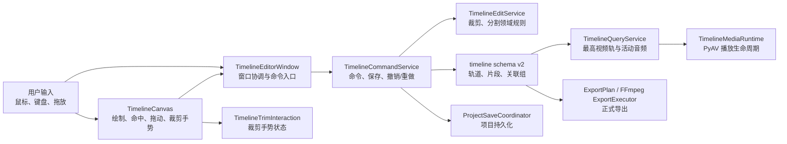
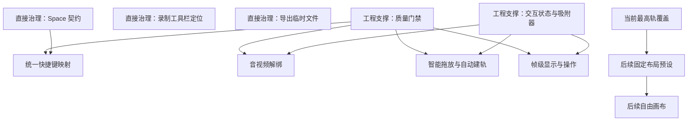

# /idea 需求池：QuickRec Full v1.9.5 剪辑交互与轨道控制增强

## 追踪信息

- 入口判断：`/idea`
- 当前状态：需求池已形成，尚未进入正式 PRD
- 候选版本：QuickRec Full v1.9.5
- 当前正式基线：v1.9.4
- 当前基线提交：`b3b8267e1950b8e2b9efc6d28d29b501189fd7af`
- 当前基线 tag：`v1.9.4`
- 最后更新：2026-07-30
- 当前事实源：
  - `README.md`
  - `doc/current.md`
  - `doc/releases/v1.9.2/`
  - `doc/releases/v1.9.3/`
  - `doc/releases/v1.9.4/`
  - 当前 `master` 代码、测试、CI 与打包配置
- 用户反馈来源：
  - 录制计时工具栏应位于实际录制屏幕中上部。
  - 剪辑工作台需要 Space 播放/暂停及常用剪辑快捷键。
  - 需要音视频解绑、独立选择和独立删除。
  - 需要更自然的素材拖入、吸附和条件性自动建轨。
  - 时间显示、跳转和编辑需要达到帧级。
  - 需要明确“同一时间多个视频”的产品语义。
- 范围保护：
  - QuickRec Lite 不属于本轮范围。
  - `doc/technical/` 中现有 v2.0 架构与贡献归属治理文档属于独立未跟踪内容，不得覆盖、撤销或混入 v1.9.5。
  - 本文不是 PRD，不冻结最终快捷键、轨道上限、自动建轨算法或帧时间码合同。
  - 本轮不修改业务代码，不提交、不推送、不打 tag、不创建 Release。

## 入口判断

`/idea`

当前需要判断的是：哪些剪辑交互是真问题，哪些能力适合组成 v1.9.5 的一条产品主线，哪些只能作为工程支撑或后续技术验证。不能因为成熟剪辑软件功能丰富，就把 QuickRec 一次扩张成完整 NLE。

## 总体判断

### 真问题

QuickRec 已具备多轨时间线、播放、裁剪、分割、全局波纹和正式导出，但时间线仍存在一组彼此关联的使用断点：

1. v1.9.2 PRD 已要求 Space 播放/暂停，当前剪辑窗口只注册了 `Ctrl+B` 和 `Delete`，实现与已发布契约不一致。
2. 关联音视频可以联合编辑，但用户无法解绑后独立选择、移动或删除。
3. 素材拖入只接受已有兼容轨道；缺少清晰落点预览、冲突解释和受控自动建轨。
4. 底层时间采用整数微秒，但时间标尺和展示主要停留在粗粒度秒级，无法支持稳定的帧级剪辑心智。
5. 多视频轨已经允许时间重叠，但预览和导出规则是“最高视频轨全画面覆盖”，并不等于多个视频同时可见。
6. 时间线窗口、命令服务和画布继续增长，若直接叠加解绑、智能拖放和帧级交互，回归风险会快速上升。

### 唯一推荐产品主线

推荐 v1.9.5 只保留一条产品主线：

> 建立一致、可预测的剪辑交互与轨道控制：补齐既有命令快捷键、支持关联音视频解绑与独立操作、提供带落点预览和条件性自动建轨的智能拖放，并以项目编辑帧率为基准提供帧级时间显示、跳转与吸附。

这四项不是四条互不相关的功能，而是同一条“让用户能够精确、连续地操作时间线”的使用链路。

### 最多两个工程支撑模块

1. 时间线交互状态、吸附规则、拖动事务与手势协调的最小职责拆分。
2. 受影响模块的 Ruff、Mypy、Coverage、CI、Packaging 与真实 GUI/媒体门禁扩展。

### 直接治理

以下事项不包装成 v1.9.5 产品卖点，建议使用独立提交先处理：

1. 补齐 Space 播放/暂停的已发布契约缺口，并处理输入框焦点冲突。
2. 录制工具栏从 `primaryScreen()` 改为跟随实际录制屏幕，并放置在屏幕中上安全区域。
3. 收口 v1.9.4 `LIMIT-194-01` 可归因临时导出文件残留。
4. 独立治理未跟踪 v2.0 文档和历史 pytest 临时目录，不混入产品提交。

### “同一时间多个视频”的当前判断

- v1.9.5 采用方案 A：继续维持最高视频轨全画面覆盖，明确这是稳定的当前语义。
- 方案 A 不解决“多个视频同时可见”，只是不扩大本版范围。
- 固定分屏/画中画预设（方案 B）具有真实价值，但必须单独验证预览、项目 schema、Undo/Redo 和 FFmpeg 导出一致性，建议进入后续版本。
- 自由位置、缩放、旋转、透明度与画布合成（方案 C）属于完整合成能力，建议留到 v2.0 后续，不进入 v1.9.5。

## 当前对象与关系



当前最值得保持的边界：

- `TimelineSession` 已与 `TimelineMediaRuntime`、`RecordingGuard` 分离，不应重新合并。
- 播放和导出共享时间线事实，但继续使用独立运行时。
- 正式编辑必须经过命令服务和项目保存协调器，不允许 UI 直接改写项目 JSON。
- 底层继续使用整数微秒，帧级只是可验证的显示、输入和吸附层。

## 本地证据映射

| 本地证据 | 判断 | 证据强度 |
| --- | --- | --- |
| `src/ui/timeline_editor_window.py:275-283` 只注册 `Ctrl+B` 和 `Delete` | Space 已发布契约未落实，快捷键入口分散 | 强 |
| v1.9.2 PRD 明确 Space 播放/暂停 | Space 应直接治理，不应重新包装为新需求 | 强 |
| `src/ui/toolbar.py:187-193` 使用 `QApplication.primaryScreen()` 且位于 `top + 10` | 多屏语义错误，中上安全区尚未实现 | 强 |
| `src/ui/timeline_canvas.py:480-505` 已吸附播放头、片段边缘与网格 | 无需重建吸附基础，但规则和反馈需抽离 | 强 |
| `src/ui/timeline_canvas.py:609-634` 处理拖放，落点仍要求既有兼容轨道 | 智能拖放和自动建轨有明确实现缺口 | 强 |
| `src/ui/timeline_canvas.py` 标尺主要为秒级，网格为 250 ms 至 5 s | 当前视觉精度不足以支撑帧级操作 | 强 |
| `src/utils/timeline_model.py:558-580` 强制关联组恰好包含一条视频和一条音频 | 解绑会改变正式数据不变量，不能只做 UI 隐藏 | 强 |
| `src/services/timeline_query.py:72-79` 只返回最高有效视频轨 | 多视频重叠当前是覆盖，不是合成 | 强 |
| v1.9.4 `ExportPlan` 使用 `highest_track_full_frame` | 预览与导出当前视频规则一致 | 强 |
| `TimelineEditorWindow` 约 2667 行、`TimelineCommandService` 约 1987 行、`TimelineCanvas` 约 1014 行 | 新交互继续堆叠会提高回归和测试成本 | 强 |
| `TimelineTrimInteraction` 已从画布中拆出 | 项目已有渐进式拆分先例 | 强 |
| Coverage/Ruff 仍排除 `toolbar.py`，Mypy 未覆盖工具栏 | 直接修改工具栏前需要补质量门禁 | 强 |
| 当前没有自由变换、布局参数或画布合成 schema | 方案 B/C 不是小型 UI 功能 | 强 |
| 尚无用户项目规模、快捷键使用率和画中画频率遥测 | 不能证明代理或自由画布应进入当前版本 | 弱 |

## 数据证据包

- 决策问题：v1.9.5 如何改善真实剪辑效率，同时避免把版本扩大为完整合成器。
- 统计对象：正式文档、代码边界、模块规模、测试/CI 配置、用户实际反馈、开源项目官方文档与代码。
- 时间范围：截至 QuickRec Full v1.9.4 正式发布和 2026-07-30 的开源资料。
- 数据质量：
  - 本地契约和实现证据强。
  - 用户反馈来自真实使用，但没有规模化行为数据。
  - 竞品证据能证明交互模式成熟，不能证明 QuickRec 用户需要全部能力。
- 关键发现：
  - 用户反馈与本地实现缺口高度重合。
  - QuickRec 已具备微秒模型、吸附、关联组、撤销重做和原子保存，不需要更换媒体引擎才能完成推荐主线。
  - 自由画布合成会同时改变播放、项目 schema、导出、UI 和验收，明显超出本版。
- 反证与替代解释：
  - 部分用户可以继续使用鼠标按钮完成播放、删除和分割。
  - 自动建轨若规则不透明，可能比手动建轨更令人困惑。
  - 帧级显示在不同源 FPS、项目 FPS 和 120 FPS 输出之间容易产生歧义。
  - 音视频解绑会降低现有联合编辑的安全性，必须提供清晰的关联状态和撤销。
- 不能推出的结论：
  - 不能从 OpenShot/Kdenlive 功能成熟推出 QuickRec 必须复制完整快捷键或轨道系统。
  - 不能从模块行数直接推出必须重写。
  - 不能从用户提出“多个视频”直接推断需要自由画布。
  - 不能从 OpenShot 代理媒体成熟推断 QuickRec 当前存在代理性能痛点。

## OpenShot 深度研究

### 研究对象

- OpenShot Qt 官方仓库：`OpenShot/openshot-qt`，本地只读研究基线 `develop@9cd2b3f`
- libopenshot 官方仓库：`OpenShot/libopenshot`，本地只读研究基线 `develop@eac81cf`
- 官方用户文档与 v3.5.1 发布说明

### 可借鉴内容

| 观察 | OpenShot 证据 | QuickRec 结论 |
| --- | --- | --- |
| 显式交互状态 | 新 QWidget 时间线使用 `DragState`、`ResizeState`、`PlayheadState`、`BoxSelectState`、`KeyframeState` | 可借鉴状态职责，不复制实现代码 |
| 独立吸附器 | `SnapHelper` 与鼠标状态、绘制分离 | 适合抽出 QuickRec `TimelineSnapService` |
| 原子事务 | `UpdateAction.transaction` 把一次多对象操作合并为一次 Undo/Redo | 适合为拖动、自动建轨、解绑建立事务 ID |
| 多选与共同裁剪 | 官方文档支持框选、范围选择和共享边缘裁剪 | 当前只作为交互方向，不进入 v1.9.5 多选范围 |
| 音视频分离 | `Separate Audio` 创建独立音频片段 | 产品语义可借鉴；QuickRec 应修改自己的关联组模型 |
| 波纹与间隙 | Slice Ripple、Ripple Delete、Remove Gap 具有明确语义 | QuickRec 已有全局波纹，本版不重新引入多种波纹模式 |
| 代理边界 | 优化预览使用代理，最终导出使用原始素材 | 适合未来性能 spike，不属于当前真问题 |
| JSON 与恢复 | 项目数据、更新历史、恢复副本和缺失素材路径均有独立机制 | 借鉴“数据事实与运行时替换分离”，不照搬结构 |
| 原生媒体引擎 | libopenshot 提供 C++ 合成、混音和 Python 绑定 | 能力完整，但与当前 PyAV/FFmpeg 栈重复 |

### 不应复制或直接引入

1. `openshot-qt` 为 GPLv3-or-later；QuickRec 当前根目录没有明确 LICENSE 文件。不得复制 GPL UI 源码或派生实现，必须只借鉴公开交互理念。
2. libopenshot 为 LGPLv3 或商业许可路线，引入前仍需完成许可证、动态链接、再分发和商业发布评估。
3. libopenshot 会带来 SWIG/Python 绑定、原生 DLL、FFmpeg/Qt/OpenCV 等打包矩阵，与现有 PyAV + FFmpeg 链路高度重叠。
4. OpenShot 自身仍存在超大窗口和时间线模块；不能把成熟项目的历史复杂度当作 QuickRec 的目标架构。
5. OpenShot 的代理、关键帧、变速、特效和自由变换超出 v1.9.5。

### 参考资料

- [OpenShot Clips：裁剪、切片、选择、音频分离与波纹语义](https://www.openshot.org/static/files/user-guide/clips.html)
- [OpenShot Preferences：快捷键、自动保存与恢复设置](https://openshot.org/static/files/user-guide/preferences.html)
- [OpenShot Files：优化预览与原始素材边界](https://www.openshot.org/static/files/user-guide/files.html)
- [libopenshot 官方说明](https://www.openshot.org/libopenshot/)
- [OpenShot v3.5.1 发布说明](https://github.com/OpenShot/openshot-qt/releases/tag/v3.5.1)

## 竞品能力映射

| 项目 | 成熟经验 | 对 v1.9.5 的意义 | 边界 |
| --- | --- | --- | --- |
| LosslessCut | 轻量快捷键、时间输入、关键帧/帧导航 | 证明“少而稳定”的快捷键和时间输入有价值 | 它明确不是完整 NLE，不作为多轨架构证据 |
| Shotcut | 系统化快捷键、吸附临时开关、播放导航 | 可用于快捷键冲突和上下文规则对照 | 不复制完整快捷键表 |
| Kdenlive | 帧级移动、时间码输入、独立音视频调整、轨道吸附和活动轨道 | 支持帧级操作、解绑和受控目标轨设计 | 其插入/覆盖/波纹多模式不进入本版 |
| OpenShot | 状态机、SnapHelper、事务 ID、音频分离、代理预览 | 支持工程支撑与解绑产品语义 | 不引入 GPL UI 代码或 libopenshot |
| Flowblade | 分离音频、同步父子关系、失步反馈、J/L cut | 支持“解绑后状态可见、可恢复”的设计 | 复杂同步编辑留后续 |
| Blender VSE | 位置、缩放、旋转和多层合成 | 证明方案 C 是完整画布领域 | 明确不进入 v1.9.5 |
| OpenTimelineIO | Timeline/Stack/Track/Clip/Gap、source range、media reference | 用于校验未来数据边界是否无歧义 | 本版不引入 OTIO 运行时依赖 |
| Olive | 实验性 NLE 架构 | 仅作探索参考 | 官方仍标注 alpha 且高度不稳定，不作为成熟证据 |

官方资料：

- [Kdenlive Editing](https://docs.kdenlive.org/en/cutting_and_assembling/editing.html)
- [Shotcut Keyboard Shortcuts](https://www.shotcut.org/howtos/keyboard-shortcuts/)
- [LosslessCut 官方文档](https://github.com/mifi/lossless-cut/blob/master/docs/index.md)
- [Flowblade Advanced Editing](https://jliljebl.github.io/flowblade/webhelp/advanced.html)
- [OpenTimelineIO Timeline Structure](https://opentimelineio.readthedocs.io/en/v0.14/tutorials/otio-timeline-structure.html)
- [Olive 官方仓库](https://github.com/olive-editor/olive)

## 用户候选能力压力测试

### 1. 录制计时工具栏位置

问题不是单纯“向下移动一点”，而是工具栏使用主显示器定位，没有跟随实际录制屏幕。

推荐语义：

- 依据当前录制目标或实际录制屏幕的可用区域定位。
- 默认水平居中，位于上边缘以下约 8% 至 12% 的安全区。
- 避免遮挡窗口标题栏、系统顶栏和区域选择边界。
- 用户拖动后的本次会话位置可以保留；下一次录制重新做可见区域校正。
- 单显示器先闭合；多显示器完整能力不借机进入本版。

结论：`直接治理`。这是定位错误和真实反馈，不需要等待完整 PRD，但必须补 `toolbar.py` 质量门禁与 GUI/DPI 验收。

### 2. 快捷键

候选范围分为两层：

- 直接治理：Space 播放/暂停，满足既有 v1.9.2 合同。
- v1.9.5 产品范围：为现有命令建立统一快捷键映射、焦点规则、菜单提示和冲突检查。

推荐最小集合只覆盖已有或本版正式能力：

- Space：播放/暂停。
- 左/右方向键：前后移动一帧。
- `Shift+左/右`：前后移动一秒。
- `Ctrl+B`：在播放头分割。
- Delete：执行当前已定义的删除语义。
- `Ctrl+Z` / `Ctrl+Y`：撤销/重做。
- 解绑命令：具体按键在 PRD 中结合冲突表确认。

暂不进入：

- J/K/L 变速与反向播放。
- 完整 Premiere 快捷键复刻。
- 用户自定义快捷键编辑器。

### 3. 音视频解绑

用户价值成立，但必须修改数据契约：

- 解绑前，视频和音频仍作为一个关联组联合移动、裁剪、分割和删除。
- 解绑后，两者保留各自 `clip_id`、`material_id`、源范围和时间位置，清除或替换正式关联关系。
- 解绑必须是一次原子命令，可撤销、可重做、可保存失败回滚。
- 解绑后允许独立选择、移动、裁剪、分割和删除。
- 删除其中一侧不得隐式删除另一侧。
- 缺失素材和重新定位仍基于 `material_id` 生效。

待 PRD 决定：是否提供“重新关联”；若不提供，撤销是本版唯一恢复方式。

结论：`进入 v1.9.5 PRD`。

### 4. 智能拖放与自动建轨

推荐只做可预测规则，不做隐式复杂编排：

1. 拖动时显示素材类型、候选起点、视频/音频落点和冲突原因。
2. 吸附继续复用播放头、片段边缘和网格；按 Alt 临时关闭。
3. 优先使用用户明确悬停的兼容轨道。
4. 仅在没有兼容轨道，或所有兼容轨道在候选区间冲突时，提示并条件性创建一组新轨道。
5. 自动建轨与加入片段必须属于同一个事务；任一步失败则全部回滚。
6. 达到轨道上限时禁止自动创建并给出明确反馈。
7. 用户取消或拖出区域时不得留下空轨道。

结论：`进入 v1.9.5 PRD`。

### 5. 帧级时间精度

底层整数微秒保持不变，新增帧级视图和操作：

- 显示 `HH:MM:SS:FF`，可切换查看总帧号。
- 左右方向键按项目编辑帧率移动一帧。
- 时间输入支持帧级跳转。
- 高缩放级别显示帧网格，低缩放级别仍按秒显示，避免视觉拥挤。
- 微秒与帧之间使用统一的有理数换算，禁止在多处自行四舍五入。
- 保存仍写整数微秒，不破坏 timeline schema v2。

关键风险：项目编辑帧率与素材源 FPS、预览 FPS、导出 FPS 不一定相同。PRD 必须冻结唯一编辑时间基准及边界舍入规则。

结论：`进入 v1.9.5 PRD`。

### 6. 同一时间多个视频

#### 方案 A：最高视频轨全画面覆盖

- 当前已实现且预览/导出一致。
- 多个视频可以在时间线上重叠，但只有最高有效轨可见。
- 不新增项目字段、合成器或导出规则。
- 不满足“多个视频同时可见”，只是当前版本的安全边界。

结论：v1.9.5 继续采用，`直接治理` 文案和状态提示，不作为新卖点。

#### 方案 B：固定分屏/画中画布局预设

- 提供少量固定模板，例如左右分屏、上下分屏、主画面 + 右下角画中画。
- 需要新增画布尺寸、布局槽位、片段到槽位映射、预览合成和 FFmpeg 导出规则。
- 用户价值比方案 A 高，复杂度远低于自由变换。
- 与本版解绑、拖放和帧级操作同时进入会显著扩大验收矩阵。

结论：`后续版本`，建议先做独立交互和导出一致性 spike。

#### 方案 C：自由位置、缩放、旋转、透明度和画布合成

- 属于完整合成器能力。
- 需要变换数据模型、画布手柄、关键帧边界、预览/导出一致性、撤销、DPI 和性能体系。
- 与 v2.0 后完整工作台方向相关，但不是 v1.9.5 的可控增量。

结论：`后续版本`，v2.0 之后再评估；当前不做。

## 架构方案压力测试

### 方案 A：保持现有 PyAV/FFmpeg，只修交互

内容：

- 在现有窗口和画布继续加入快捷键、解绑、拖放和帧级逻辑。
- 不新增交互状态机、吸附服务或事务协调器。

优点：

- 实现路径短。
- 不改变媒体链路。

缺点：

- `TimelineEditorWindow`、`TimelineCommandService` 和 `TimelineCanvas` 会继续增长。
- 自动建轨、片段落点、解绑和 Undo/Redo 容易形成跨层条件分支。
- 短期快，后续 v2.0 成本更高。

压力评分：`29/40`。可作为最小档，不推荐作为完整 v1.9.5 架构方案。

### 方案 B：保留媒体链路，抽离状态机、吸附器和原子事务

内容：

- 保留 PyAV 播放、FFmpeg 导出和 timeline schema v2。
- 新增轻量交互状态枚举或状态对象。
- 抽出统一吸附服务。
- 以事务 ID 协调“自动建轨 + 添加片段”“解绑关联组”等多对象命令。
- 画布只处理命中、绘制和输入采集；领域有效性由命令/编辑服务判断。

优点：

- 直接承接本版交互复杂度。
- 不替换稳定媒体链路。
- 适合未来多选、固定布局和更多手势。
- 可渐进实施，符合现有 `TimelineTrimInteraction` 拆分方式。

缺点：

- 需要先补行为表征测试。
- 状态、命令和保存边界必须严格，不能只移动代码。

压力评分：`36/40`。推荐。

### 方案 C：引入 libopenshot

内容：

- 使用 libopenshot 取代或叠加当前播放/合成能力。

优点：

- 自带成熟合成、混音和帧级媒体能力。
- 后续自由画布和特效扩展空间大。

缺点：

- 与当前 PyAV + FFmpeg 重复。
- 增加 SWIG、原生 DLL、许可证、包体积和 Windows 打包风险。
- 会扩大资源释放、诊断和真实媒体回归矩阵。
- 当前推荐主线不需要更换媒体引擎。

压力评分：`15/40`。不得进入 v1.9.5；仅在未来有明确能力缺口时进入独立许可与技术 spike。

## 压力测试评分规则

每项按八个维度评分，每项 0 至 5 分，总分 40：

1. 用户痛点强度
2. 目标用户 / 场景清晰度
3. 证据强度
4. 频率 / 紧迫性
5. 对版本核心目标的贡献
6. 相比替代方案的必要性
7. 成本可控性
8. 验证速度

总分不能替代证据门槛。许可证不清、数据安全不可控或无法验证的候选，即使总分较高也不得直接进入 PRD。

## 候选需求总览

| 编号 | 候选项 | 证据强度 | 评分 | 推荐分流 |
| --- | --- | --- | ---: | --- |
| GOV-195-001 | Space 契约与快捷键焦点修复 | 强 | 36/40 | 直接治理 |
| GOV-195-002 | 工具栏跟随实际录制屏幕并移至中上部 | 强 | 34/40 | 直接治理 |
| IDEA-195-001 | 既有剪辑命令统一快捷键映射 | 强 | 35/40 | 进入 v1.9.5 PRD |
| IDEA-195-002 | 关联音视频解绑与独立操作 | 强 | 35/40 | 进入 v1.9.5 PRD |
| IDEA-195-003 | 智能拖放、落点预览与条件性自动建轨 | 强 | 36/40 | 进入 v1.9.5 PRD |
| IDEA-195-004 | 帧级显示、跳转、导航和吸附 | 强 | 34/40 | 进入 v1.9.5 PRD |
| IDEA-195-005A | 维持最高视频轨全画面覆盖 | 强 | 27/40 | 直接治理 |
| IDEA-195-005B | 固定分屏/画中画布局预设 | 中 | 24/40 | 后续版本 |
| IDEA-195-005C | 自由画布合成 | 中 | 20/40 | 后续版本 |
| ENG-195-001 | 交互状态、吸附和原子事务最小拆分 | 强 | 33/40 | 进入 v1.9.5 PRD |
| ENG-195-002 | 受影响模块质量门禁扩展 | 强 | 34/40 | 进入 v1.9.5 PRD |
| SPIKE-195-001 | libopenshot 引擎集成 | 中弱 | 15/40 | 独立技术 spike |
| IDEA-195-006 | 代理媒体预览系统 | 弱 | 18/40 | 后续版本 |
| GOV-195-003 | v1.9.4 临时导出残留收口 | 强 | 30/40 | 直接治理 |
| GOV-195-004 | v2.0 未跟踪文档与 pytest 临时目录治理 | 强 | 27/40 | 直接治理 |

## 候选项详细判断

### GOV-195-001 Space 契约与快捷键焦点修复

- 问题与用户场景：剪辑工作台无法用 Space 快速播放/暂停，与既有 PRD 和常见剪辑习惯不一致。
- 本地证据：v1.9.2 PRD 已确认；窗口当前未注册 Space。
- 外部证据：Kdenlive、Shotcut、LosslessCut 均使用明确的键盘播放导航。
- 证据强度：强。
- 用户价值：高频操作直接提速。
- 开发成本：低。
- 数据与回归风险：文本输入、按钮焦点和系统对话框可能误触发。
- 许可和打包影响：无。
- 验收依赖：输入框焦点、弹窗、播放中/暂停中、只读项目和录制状态。
- 压力测试：`36/40`。
- 推荐分流：`直接治理`，独立提交，不等待完整 v1.9.5。

### GOV-195-002 工具栏跟随实际录制屏幕并移至中上部

- 问题与用户场景：工具栏当前固定使用主屏上边缘，可能不在实际录制屏幕，也容易贴边遮挡。
- 本地证据：`toolbar.py` 使用 `primaryScreen()` 和 `top + 10`。
- 外部证据：不依赖竞品；属于本地真实定位缺陷。
- 证据强度：强。
- 用户价值：录制状态更可见，降低找不到停止入口的风险。
- 开发成本：低至中。
- 数据与回归风险：区域、窗口、全屏三种录制目标和 DPI 坐标空间。
- 许可和打包影响：无。
- 验收依赖：单屏 100%/125%/150%，区域/窗口/全屏，录制屏幕变化。
- 压力测试：`34/40`。
- 推荐分流：`直接治理`。

### IDEA-195-001 既有剪辑命令统一快捷键映射

- 问题与用户场景：命令入口分散，用户难以形成稳定肌肉记忆。
- 本地证据：窗口直接创建少量 `QShortcut`，没有集中命令映射和冲突表。
- 外部证据：Shotcut、Kdenlive、LosslessCut 均把快捷键视为核心剪辑入口。
- 证据强度：强。
- 用户价值：高，尤其是分割、删除、逐帧移动和撤销。
- 开发成本：中。
- 数据与回归风险：焦点范围、按键冲突、禁用状态和菜单提示不一致。
- 许可和打包影响：无；只借鉴交互习惯，不复制代码。
- 验收依赖：窗口焦点矩阵、文本输入、弹窗、播放状态和只读/录制锁。
- 压力测试：`35/40`。
- 推荐分流：`进入 v1.9.5 PRD`。

### IDEA-195-002 关联音视频解绑与独立操作

- 问题与用户场景：用户无法删除不需要的音频、单独移动声音或保留画面。
- 本地证据：关联组被模型强制为一视频一音频且字段完全同步。
- 外部证据：OpenShot Separate Audio、Kdenlive 独立调整、Flowblade Split Audio 均证明该语义成熟。
- 证据强度：强。
- 用户价值：高，是基础剪辑后的自然下一步。
- 开发成本：中高。
- 数据与回归风险：关联不变量、波纹、裁剪、分割、Undo/Redo、保存失败和导出均受影响。
- 许可和打包影响：无。
- 验收依赖：解绑、独立删除/移动/裁剪/分割、撤销重做、重启、导出一致性。
- 压力测试：`35/40`。
- 推荐分流：`进入 v1.9.5 PRD`。

### IDEA-195-003 智能拖放、落点预览与条件性自动建轨

- 问题与用户场景：用户拖入素材时必须先理解轨道类型和冲突，失败反馈晚且不够直观。
- 本地证据：画布已有 MIME 拖放、吸附和兼容检查，但只接受已有轨道。
- 外部证据：Kdenlive 目标轨、OpenShot 拖动预览和成熟 NLE 的落点反馈。
- 证据强度：强。
- 用户价值：高，直接缩短“素材到时间线”路径。
- 开发成本：中高。
- 数据与回归风险：自动创建空轨、轨道上限、同轨冲突和多对象保存原子性。
- 许可和打包影响：无。
- 验收依赖：有/无兼容轨、满轨、冲突、取消、撤销、保存失败、中文素材路径。
- 压力测试：`36/40`。
- 推荐分流：`进入 v1.9.5 PRD`。

### IDEA-195-004 帧级显示、跳转、导航和吸附

- 问题与用户场景：秒级标尺不足以确认精确分割、裁剪和音视频边界。
- 本地证据：模型已经使用整数微秒，UI 标尺和网格仍较粗。
- 外部证据：Kdenlive 支持逐帧移动、帧级时间码与帧编号；LosslessCut 强调精确时间导航。
- 证据强度：强。
- 用户价值：高，但主要集中在剪辑工作台。
- 开发成本：中。
- 数据与回归风险：项目 FPS、素材 FPS、120 FPS 输出和舍入规则可能冲突。
- 许可和打包影响：无。
- 验收依赖：30/60/120 项目基准、长时间线、边界换算、保存往返、不同 DPI。
- 压力测试：`34/40`。
- 推荐分流：`进入 v1.9.5 PRD`。

### IDEA-195-005A 维持最高视频轨全画面覆盖

- 问题与用户场景：保证多轨重叠时预览和导出结果稳定。
- 本地证据：查询和导出均已采用最高轨覆盖。
- 外部证据：OTIO 的多轨展平也允许上层遮蔽下层。
- 证据强度：强。
- 用户价值：中，主要是稳定性而非新增能力。
- 开发成本：低。
- 数据与回归风险：低。
- 许可和打包影响：无。
- 验收依赖：双视频重叠、上层缺失/损坏和导出一致性。
- 压力测试：`27/40`。
- 推荐分流：`直接治理` 当前语义与提示；不作为“多个视频同时可见”的完成。

### IDEA-195-005B 固定分屏/画中画布局预设

- 问题与用户场景：用户希望屏幕录制与摄像头、主画面与参考画面同时可见。
- 本地证据：当前没有布局字段和预览合成器，只有最高轨覆盖。
- 外部证据：OpenShot Layout、Blender VSE/Kdenlive 合成证明模式成熟。
- 证据强度：中；真实 QuickRec 场景尚未细分。
- 用户价值：中高。
- 开发成本：高。
- 数据与回归风险：schema、预览、导出、Undo/Redo、画布尺寸和素材宽高比同时变化。
- 许可和打包影响：不需要新依赖，但 FFmpeg 图和 PyAV 预览复杂度上升。
- 验收依赖：模板原型、双视频实时预览、导出像素对照、DPI 和性能。
- 压力测试：`24/40`。
- 推荐分流：`后续版本`，先独立 spike。

### IDEA-195-005C 自由画布合成

- 问题与用户场景：用户自由摆放多个视频、摄像头和叠加内容。
- 本地证据：当前完全缺少变换模型、画布手柄和关键帧。
- 外部证据：Blender VSE、OpenShot/libopenshot 证明这是完整合成领域。
- 证据强度：中。
- 用户价值：高但场景范围大。
- 开发成本：极高。
- 数据与回归风险：极高，会贯穿项目、播放、导出、撤销和验收。
- 许可和打包影响：若坚持现有链路可控；若引入新引擎风险显著。
- 验收依赖：完整画布原型、变换精度、像素一致性、性能和长项目。
- 压力测试：`20/40`。
- 推荐分流：`后续版本`，不进入 v1.9.5。

### ENG-195-001 交互状态、吸附和原子事务最小拆分

- 问题与用户场景：不是直接用户功能，但决定复杂手势能否稳定演进。
- 本地证据：三个核心模块合计超过 5600 行，画布同时承担绘制、命中、拖动、裁剪和拖放。
- 外部证据：OpenShot 新时间线使用显式状态、SnapHelper 和事务 ID。
- 证据强度：强。
- 用户价值：间接但关键，降低交互回退。
- 开发成本：中。
- 数据与回归风险：拆分若改变时序会引入新缺陷，必须保留行为表征。
- 许可和打包影响：无；只借鉴模式。
- 验收依赖：手势状态转换、Escape 取消、失焦、连续拖动合并、保存失败零副作用。
- 压力测试：`33/40`。
- 推荐分流：`进入 v1.9.5 PRD`，作为工程支撑，不全量重写。

### ENG-195-002 受影响模块质量门禁扩展

- 问题与用户场景：工具栏仍被 Ruff/Coverage 排除，新交互矩阵需要更强保护。
- 本地证据：`pyproject.toml` 明确排除 `toolbar.py`；CI 已有增量门禁基础。
- 外部证据：OpenShot v3.5.1 发布说明显示时间线滚动、缩放、光标热点和 UI Scale 均容易回归。
- 证据强度：强。
- 用户价值：间接，降低发布后操作失效和 DPI 问题。
- 开发成本：中。
- 数据与回归风险：低。
- 许可和打包影响：无。
- 验收依赖：单元/UI/Packaging、真实媒体、三档 DPI、QuickRec Lite 未修改。
- 压力测试：`34/40`。
- 推荐分流：`进入 v1.9.5 PRD`，作为第二工程支撑。

### SPIKE-195-001 libopenshot 引擎集成

- 问题与用户场景：未来需要更完整的合成与混音引擎时可能减少自研。
- 本地证据：当前推荐功能全部可在现有 PyAV/FFmpeg 上实现，没有明确引擎阻塞。
- 外部证据：libopenshot 提供成熟 C++ 引擎和 Python 绑定。
- 证据强度：中弱。
- 用户价值：当前低，未来可能高。
- 开发成本：极高。
- 数据与回归风险：媒体语义、资源释放、打包和项目兼容均高风险。
- 许可和打包影响：重大，涉及 LGPLv3/商业许可、SWIG 和原生 DLL。
- 验收依赖：许可审计、最小播放/合成 demo、包体积、Windows 发布和崩溃恢复。
- 压力测试：`15/40`。
- 推荐分流：`独立技术 spike`，当前默认不启动。

### IDEA-195-006 代理媒体预览系统

- 问题与用户场景：大分辨率或多层素材可能导致预览不流畅。
- 本地证据：尚无 v1.9.4 用户性能数据证明代理是当前阻塞。
- 外部证据：OpenShot 和 Kdenlive 均有代理/优化预览体系。
- 证据强度：弱。
- 用户价值：潜在中高。
- 开发成本：高。
- 数据与回归风险：代理生成、失效、磁盘清理、原片导出和路径恢复。
- 许可和打包影响：可复用 FFmpeg，无新许可；包体积影响小，缓存占用大。
- 验收依赖：真实大项目性能基线、代理/原片像素和导出一致性。
- 压力测试：`18/40`。
- 推荐分流：`后续版本`，先收集性能证据。

### GOV-195-003 v1.9.4 临时导出残留收口

- 问题与用户场景：强制结束进程或系统重启可能留下 `.part.mp4`、`.filter.txt`。
- 本地证据：v1.9.4 正式文档已记录 `LIMIT-194-01`。
- 外部证据：不需要。
- 证据强度：强。
- 用户价值：中，减少磁盘垃圾和误解。
- 开发成本：中。
- 数据与回归风险：清理条件错误可能误删仍需诊断或恢复的文件。
- 许可和打包影响：无。
- 验收依赖：崩溃/重启夹具、任务归属标识、过期判断、非本任务文件保护。
- 压力测试：`30/40`。
- 推荐分流：`直接治理`，独立 Bugfix，不与时间线功能耦合。

### GOV-195-004 v2.0 未跟踪文档与 pytest 临时目录治理

- 问题与用户场景：工作区状态噪声影响接手、检查和提交边界。
- 本地证据：四份 v2.0 文档未跟踪，四个 pytest 临时目录有权限警告。
- 外部证据：不需要。
- 证据强度：强。
- 用户价值：低，工程价值中。
- 开发成本：低至中。
- 数据与回归风险：未确认来源前删除可能丢失独立治理成果。
- 许可和打包影响：无。
- 验收依赖：来源确认、归档/纳入策略、权限恢复和 git status。
- 压力测试：`27/40`。
- 推荐分流：`直接治理`，但必须单独确认，当前不修改。

## 承重假设与最小实验

| 假设 | 若不成立会怎样 | 最小证伪实验 |
| --- | --- | --- |
| H-195-01：用户需要的不只是删除整组，而是解绑后独立编辑 | 解绑会成为低频复杂功能 | 用 3 个真实场景原型验证：删麦克风、错位音频、保留画面替换声音 |
| H-195-02：条件性自动建轨比明确手动建轨更高效且可预测 | 自动化会制造空轨和时间线混乱 | 对“无兼容轨、全部冲突、达到上限、取消拖放”四组用例做可点击原型 |
| H-195-03：一个项目编辑帧率可以稳定解释 30/60/120 FPS 时间码 | 帧级显示会在素材、预览和导出之间矛盾 | 对 30、60、120 FPS 和混合源素材做微秒往返与边界舍入测试 |
| H-195-04：v1.9.5 维持最高轨覆盖不会阻断主要用户任务 | 用户真正需要的是摄像头画中画，本版价值会不足 | 让用户用实际项目说明“多个视频”的首要布局场景，并评估固定预设命中率 |
| H-195-05：状态/吸附/事务可以渐进抽离而不改变行为 | 工程支撑会变成高风险重构 | 先用现有拖动、裁剪、分割行为测试锁定输出，再抽离单一模块 |

## 依赖关系



建议实施顺序不是正式 dev plan，仅用于验证范围是否闭合：

1. 独立完成直接治理和行为表征测试。
2. 建立交互状态、吸附和事务最小边界。
3. 完成快捷键与帧级时间基准。
4. 完成音视频解绑。
5. 完成智能拖放和自动建轨。
6. 做播放、导出、保存、回滚、DPI 和打包回归。

## 三档版本范围

### 最小档

- Space 契约修复。
- 录制工具栏实际屏幕定位。
- 现有命令快捷键提示与冲突修复。
- 帧级时间显示和逐帧跳转。
- v1.9.4 临时导出残留治理。

优点：成本低、可快速发布。

缺点：没有解决音视频独立操作和素材入轨体验，版本用户价值偏碎。

### 推荐档

- 包含最小档。
- 关联音视频解绑、独立选择和独立删除。
- 智能拖放、落点预览、类型校验和条件性自动建轨。
- 时间线交互状态、吸附与原子事务最小拆分。
- 受影响模块质量门禁扩展。
- 多视频继续采用最高轨覆盖，不引入新合成语义。

优点：形成完整的“精确操作 + 轨道控制”主线，并为后续固定布局和 v2.0 留出清晰边界。

缺点：必须严格控制自动建轨和解绑的数据事务，GUI 验收量较大。

### 过大档

- 固定或自由视频合成。
- 代理媒体系统。
- libopenshot 集成。
- 多选复杂编辑、完整 Premiere 快捷键、快捷键编辑器。
- 音量、波形、变速、特效、关键帧。

结论：不进入 v1.9.5。

## 最终分流

### 直接治理

- `GOV-195-001` Space 已发布契约与焦点规则。
- `GOV-195-002` 录制工具栏实际屏幕定位和中上安全区。
- `IDEA-195-005A` 明确最高视频轨覆盖的当前语义。
- `GOV-195-003` v1.9.4 临时导出残留。
- `GOV-195-004` v2.0 文档和 pytest 临时目录，需另行确认后处理。

### 进入 v1.9.5 PRD

- `IDEA-195-001` 既有剪辑命令统一快捷键映射。
- `IDEA-195-002` 关联音视频解绑与独立操作。
- `IDEA-195-003` 智能拖放与条件性自动建轨。
- `IDEA-195-004` 帧级显示、跳转、导航和吸附。
- `ENG-195-001` 交互状态、吸附和原子事务最小拆分。
- `ENG-195-002` 受影响模块质量门禁扩展。

### 独立技术 spike

- `SPIKE-195-001` libopenshot 许可证、Windows 打包、资源释放和最小播放/合成验证。
- 仅在现有 PyAV/FFmpeg 被实证为能力阻塞时启动。

### 后续版本

- `IDEA-195-005B` 固定分屏/画中画预设。
- `IDEA-195-005C` 自由画布合成。
- `IDEA-195-006` 代理媒体预览系统。

### 暂不做

- 复制 OpenShot 完整功能或代码。
- 引入 GPL UI 源码。
- 完整 Premiere 快捷键复刻。
- 用户自定义快捷键编辑器。
- J/K/L 变速和反向播放。
- 完整多选编辑、关键帧、特效、波形、代理和自由合成。
- QuickRec Lite 改动。

## v1.9.5 推荐范围

### 唯一产品主线

**剪辑交互与轨道控制增强**

完整链路：

```text
选择素材
-> 拖入时间线并看到候选轨道、起点和冲突
-> 必要时在同一事务中自动创建兼容轨道
-> 使用帧级时间码和快捷键定位
-> 对关联音视频联合编辑或主动解绑
-> 解绑后独立选择、移动、裁剪、分割或删除
-> 撤销/重做和自动保存保持一致
-> 预览与正式导出继续遵守最高视频轨覆盖
```

### 两个工程支撑

1. 时间线交互状态、吸附器、拖动事务和手势协调的最小拆分。
2. 受影响范围 Ruff、Mypy、Coverage、CI、Packaging、真实媒体和三档 DPI 门禁。

### v1.9.5 明确非目标

- 固定分屏、画中画和自由画布。
- 视频位置、缩放、旋转、透明度和关键帧。
- 代理媒体。
- libopenshot 集成。
- J/K/L 变速播放和完整快捷键编辑器。
- 波形、音量、淡入淡出和声像。
- 新导出编码器或高刷新率扩展。
- AI、字幕、摘要、云同步。
- QuickRec Lite。
- 全量重写时间线、窗口、播放或导出架构。

## 仍需用户确认的问题

1. 解绑后是否需要提供“重新关联”，还是只允许通过撤销恢复关联。
2. 解绑后视频和音频是否保持原时间位置与源范围，默认答案建议为“保持”。
3. 自动建轨是否必须先显示提示，还是满足明确条件时可直接创建并支持撤销。
4. 视频轨和音频轨各自的上限是否继续沿用 8 条。
5. 项目编辑帧率取项目导出 FPS、首个视频 FPS，还是新增独立但受限的项目时间基准。
6. 帧级时间码对 29.97/59.94 等非整数 FPS 是否本版不承诺；QuickRec 当前正式选项为 30/60/120。
7. 快捷键本版是否只覆盖现有命令，不提供用户自定义。
8. 删除解绑后的单个视频或音频是否继续使用全局波纹，还是需要普通删除与波纹删除并存。
9. 自动建轨是否只在“无兼容轨或全部冲突”时触发，推荐为“是”。
10. 固定分屏/画中画是否确认进入 v1.9.6 或 v2.0 前独立版本，而不挤入 v1.9.5。

## 进入 `/prd` 的推荐提示词

```text
mypm /prd

项目：E:\codex\QuickRec
版本：QuickRec Full v1.9.5
需求池：
doc/archive/ideas/mypm-idea-pool-v1.9.5-2026-07-30.md

请为 v1.9.5“剪辑交互与轨道控制增强”进入 PRD 澄清阶段，先不要直接编写完整 PRD。

唯一产品主线：
- 为现有剪辑命令建立统一快捷键映射和焦点规则。
- 支持关联音视频解绑，以及解绑后的独立选择、移动、裁剪、分割和删除。
- 优化素材拖入时间线，提供吸附、落点预览、类型校验和条件性自动建轨。
- 底层继续使用整数微秒，以项目编辑帧率提供帧级显示、跳转、导航和吸附。
- 多视频重叠继续采用最高视频轨全画面覆盖；固定分屏/画中画和自由画布不进入本版。

工程支撑最多两个：
1. 时间线交互状态、吸附器、拖动事务和手势协调的最小职责拆分。
2. 受影响模块的 Ruff、Mypy、Coverage、CI、Packaging、真实媒体和 GUI/DPI 门禁。

前置直接治理必须独立处理：
- Space 播放/暂停既有契约。
- 录制工具栏跟随实际录制屏幕并移至中上安全区。
- v1.9.4 LIMIT-194-01 临时导出文件残留。

开始前实际读取：
- README.md、doc/current.md
- v1.9.2、v1.9.3、v1.9.4 正式文档
- 本需求池
- TimelineEditorWindow、TimelineCanvas、TimelineTrimInteraction
- TimelineCommandService、TimelineEditService、TimelineSession
- timeline schema v2、TimelineQueryService、播放运行时和 ExportPlan
- 项目保存、Undo/Redo、快捷键、录制工具栏、CI、coverage 和打包配置

请先通过提问确认：
1. 解绑是否支持重新关联。
2. 解绑后的身份、位置、源范围和 link_group_id 迁移规则。
3. 独立删除与全局波纹删除的关系。
4. 自动建轨的触发条件、提示方式、轨道上限和撤销语义。
5. 视频内嵌音频拖入时的视频/音频目标轨规则。
6. 项目编辑帧率的来源及 30/60/120 FPS 时间码换算。
7. 帧级跳转、吸附、输入和边界舍入规则。
8. 快捷键集合、焦点优先级、冲突和禁用状态。
9. 保存失败、项目只读、录制中、素材缺失和未知 schema 下的行为。
10. 原型、真实媒体、DPI、Packaging 和发布验收门禁。

明确不做：
- 固定分屏、画中画和自由画布合成。
- 视频变换、关键帧、波形和高级音频控制。
- 代理媒体和 libopenshot 集成。
- 完整 Premiere 快捷键复刻或快捷键编辑器。
- 新导出编码器、AI、云同步和 QuickRec Lite 改动。
- 全量架构重写。

任何不明确之处必须提问，不得猜测。完成澄清后停在正式 PRD 编写确认点，不实现代码、不编写 dev plan、不提交、不推送、不打 tag。
```
