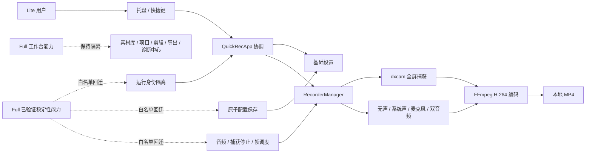

# QuickRec Lite Full 能力回迁深度 Review

> 入口判断：`/review`
> 评审日期：2026-08-11
> 主评审对象：`E:\codex\QuickRec-Lite`
> 对照对象：`E:\codex\QuickRec`
> 结论性质：评审发现与下一阶段候选，不等同于已确认需求

## 1. Review 判断

QuickRec Lite 的产品方向是成立的：它不是 Full 的功能开关，也不是删减版工作台，而是只承接全屏录制、四种音频模式、托盘控制、基础设置和本地保存的独立轻量产品线。当前最需要的不是继续增加 Full 用户功能，而是把 Full 已验证的录制稳定性和工程安全能力按白名单回迁。

建议下一阶段继续使用 **Lite v0.1**，并保持一个产品主线：**Full/Lite 运行身份隔离**。最多承接两个工程支撑模块：

1. 配置、音频、捕获停止和帧调度的稳定性白名单回迁。
2. 不可达区域/窗口代码治理，以及 Lite 独立构建和质量门禁收口。

不建议把工作台、素材库、项目、剪辑、导出队列、诊断中心、区域/窗口录制、120 FPS 或高刷能力加入 Lite。它们会改变产品心智、运行复杂度和验收成本，不属于“底层稳定性回迁”。

## 2. 评审对象与当前阶段

| 对象 | 当前事实 | 证据状态 |
| --- | --- | --- |
| Lite 工作区 | `lite-test@11874bf`，工作区干净 | 已核实：Git |
| Lite 稳定分支 | `lite-master@cfaee3e` | 已核实：Git |
| Lite 发布点 | `lite-v0@c15940e` | 已核实：Git |
| Lite 远端 CI | `31406714334` 成功，提交为 `11874bf` | 已核实：GitHub Actions |
| Full 正式基线 | `master@42302a3`，正式版本 v1.9.5 | 已核实：Git、Full README/current |
| Full 后续工程线 | `test@fc312c0`，含发布后工程治理 | 已核实：Git；不视为正式发布能力 |
| Lite 自动测试 | 232 passed，23 deselected，18 subtests passed | 本次实跑 |
| Lite 覆盖率 | 81.68%，总门禁 80% | 本次实跑 |
| Lite Ruff | 通过 | 本次实跑 |
| Lite Mypy | 9 个源文件通过 | 本次实跑；覆盖面有限 |
| Lite 打包/硬件 | 本次未重打包、未重新执行硬件录制 | 待后续 `/acceptance` |

## 3. 产品线边界

Lite 当前合同明确：

- `README.md:3-30`：Lite 是独立轻量产品线，只提供全屏录制和四种音频模式。
- `doc/releases/lite-v0/prd.md:13-34`：低心智负担、少选项、功能少而稳定，不回灌 Full 复杂能力。
- `doc/releases/lite-v0/prd.md:44-50`：区域和窗口录制不进入用户能力，系统声与麦克风保留。
- `doc/releases/lite-v0/progress.md:394-412`：素材管理、工作台、诊断中心和破坏 dxcam/cv2 稳定链路均明确排除。
- `doc/current.md:31-47`：Lite v0.1 已把运行身份隔离列为首要问题，并允许稳定性白名单回迁。

因此，“可以从 Full 回迁”应按以下规则判断：

1. 不新增用户工作流。
2. 不新增长期数据模型和管理页面。
3. 不增加录制模式或性能承诺。
4. 能降低录制失败、错误保存、身份冲突或发布漂移。
5. 有 Full 正式代码和测试证据，或先进入 Lite 独立验证。

## 4. 对象脉络



## 5. 关键发现

### F-01 运行身份仍与 Full 冲突

- 严重度：P0
- 证据状态：**已确认，代码与文档一致指向真实问题**
- 证据：`src/config.py:53-57` 使用 `%APPDATA%\QuickRec\config.json`；`src/utils/temp_cleaner.py:23` 使用 `%TEMP%\QuickRec`；`src/utils/autostart.py:16` 注册表名为 `QuickRec`；`src/ui/tray_icon.py:204-232` 仍使用 Full 的托盘名称、标题和通知 App ID；`build_std.spec:163,184` 仍输出 `QuickRec`。
- Full 参考：`src/services/single_instance.py:8-9,138` 已提供 `QuickRec.Full`、`QuickRec.Lite` 和单实例守卫，并有隔离测试。
- 影响：Full/Lite 同机安装可能共享配置、临时目录、开机启动项、通知身份、进程认知和快捷键，违背独立产品线定义。
- 分流：**进入 Lite v0.1 PRD，作为唯一产品主线**。

### F-02 配置保存失败会被 UI 当作成功

- 严重度：P0
- 证据状态：**已确认，存在数据安全与错误反馈缺陷**
- 证据：`src/config.py:84-92` 直接覆盖目标 JSON，异常只打印且不返回失败；`src/ui/settings_dialog.py:234-257` 先修改内存和注册表，再无条件发送成功信号并关闭窗口。
- Full 参考：`src/config.py:19,138,229-276` 使用候选快照、临时文件、`fsync`、`os.replace` 和结果对象；`src/ui/settings_dialog.py:563-602` 在保存失败时回滚开机启动并保持窗口打开。
- 影响：磁盘、权限或替换失败时用户会误以为设置已保存，内存、注册表和磁盘可能不一致。
- 分流：**直接 Bugfix 候选，也可作为 v0.1 稳定性支撑项**。

### F-03 系统声设备选择与双音频混合落后于 Full 稳定基线

- 严重度：P1
- 证据状态：**已确认差异；Full 有自动化证据，Lite 仍需真实设备复验**
- 证据：`src/recorder/audio_capturer.py:165-176,206-223` 依赖名称前缀匹配 loopback，可能选中错误设备；`src/recorder/recorder_manager.py:617-642` 使用 `amerge` 合并双音频，未先规范声道布局。
- Full 参考：优先按默认扬声器设备 ID 精确匹配，再按名称和首个 loopback 回退；双音频统一为立体声后使用 `amix`，并通过 `adelay` 对齐实际音频起点。对应测试见 `tests/test_audio_capturer.py:14-74`、`tests/test_recorder_manager.py:753-831`。
- 影响：多输出设备环境可能录错系统声；双音频可能形成异常声道布局或增加音画偏移。
- 分流：**进入 v0.1 稳定性白名单**，必须执行四音频真实听测和 FFprobe 证据。

### F-04 静态桌面捕获、停止和帧调度仍使用早期实现

- 严重度：P1
- 证据状态：**已确认差异；Full 有单元测试，Lite 需硬件门禁**
- 证据：`src/recorder/screen_capturer.py:40-65` 固定 60 FPS 并依赖 `get_latest_frame()`；`src/recorder/screen_capturer.py:124-130` 同步停止和释放；`src/recorder/recorder_manager.py:501-515` 在追帧后仍额外写入一帧。
- Full 参考：`ScreenCapturer.request_stop()` 非阻塞通知 DXCamera，静态桌面有首帧/最后帧回退；`frame_schedule.due_frame_count()` 统一计算应交付帧数。对应测试见 `tests/test_screen_capturer.py:238-258`、`tests/test_frame_schedule.py:1-22`。
- 影响：静态桌面可能等待旧帧，停止阶段可能卡住，快速轮询时可能过量提交编码帧。
- 分流：**进入 v0.1 稳定性白名单**；每个改动必须分批回迁并做全屏硬件 smoke。

### F-05 区域/窗口代码仍处于 Lite 运行图和打包边界

- 严重度：P1
- 证据状态：**已确认**
- 证据：`src/main.py:35-41,68-141` 仍导入、实例化并连接区域选择、窗口选择、窗口丢失和点击高亮；`src/main.py:216-365` 保留完整区域/窗口流程；`src/ui/tray_icon.py:130-161` 保留对应处理器；`build_std.spec:33,40,44-46` 明确打包这些模块。
- 影响：用户入口虽不可见，但维护面、回归面和打包图仍接近早期 Full；未来改动可能意外恢复入口。
- 限制：这些模块与 `RecorderManager`、工作流和历史测试有交叉依赖，不能按目录直接删除。
- 分流：**进入 v0.1 工程治理**。先建立“仅全屏可达”测试，再逐层移除桥接、导入、spec 项和专属测试；共享捕获代码最后处理。

### F-06 CI 已独立，但发布构建仍不完全可复现

- 严重度：P1
- 证据状态：**CI 已验证；依赖与工具链漂移已确认**
- 证据：`.github/workflows/ci.yml:20-23,50-53` 已使用新版 Actions；分支、PR 和 Lite packaging 已独立；但 `.github/workflows/ci.yml:67-89` 仍通过 Chocolatey 获取不固定版本 FFmpeg，并选取搜索到的首个二进制。`requirements.txt:14-16` 和 `requirements-dev.txt:2-5` 使用下限版本。
- Full 后续工程线参考：固定 FFmpeg staging、媒体工具哈希、release manifest 和增量覆盖脚本。该部分位于 Full `test`，不是 v1.9.5 正式发布事实，回迁前需在 Lite 独立验证。
- 影响：同一提交在不同时间可能获得不同依赖和 FFmpeg，导致包体、兼容性或测试结果漂移。
- 分流：**直接工程治理 / v0.1 发布门禁支撑**。只引入 Lite 需要的 FFmpeg，不要因 Full 使用 FFprobe 就扩大 Lite 依赖。

### F-07 81.68% 覆盖率没有覆盖最关键用户边界

- 严重度：P1
- 证据状态：**已确认**
- 证据：`pyproject.toml:15-21` 将 `src/main.py`、UI、音频捕获和屏幕捕获排除在覆盖率之外；`pyproject.toml:32-44` 的 Ruff 也排除主入口、UI 和高风险录制文件；`pyproject.toml:59-70` 的 Mypy 只覆盖 9 个源文件。
- 本次结果：总覆盖率 81.68%，232 项测试通过，但该数字不能证明运行身份、设置失败反馈、真实音频或硬件捕获已经覆盖。
- 分流：**工程支撑**。不追求一次性全量治理，只对 v0.1 新改的身份、配置、音频和捕获协调模块设置增量门禁。

### F-08 当前事实文档存在小范围陈旧

- 严重度：P2
- 证据状态：**已确认**
- 证据：`README.md:6`、`doc/current.md:7` 写当前分支为 `lite-master`，实际工作分支为 `lite-test`；`doc/current.md:28` 仍链接 CI `30248077030`，最新成功运行是 `31406714334`。
- 判断：稳定分支写 `lite-master` 本身合理，但应同时标注当前开发分支，避免 agent 把发布线和开发线混为一谈。
- 分流：**直接修文档**。

### F-09 磁盘估算接口接收 FPS，但当前实现没有使用

- 严重度：P2
- 证据状态：**已确认**
- 证据：`src/utils/disk_checker.py:36-40` 接收 `fps`，但估算只按固定码率计算；`src/utils/disk_checker.py:43-47` 调用时也未传入 Lite 固定 60 FPS。
- Full 参考：`src/utils/disk_checker.py:20,44-69` 按 FPS 和编码器调整估算。
- 影响：不会破坏 1GB/200MB 绝对门禁，但按时长估算的录制空间可能偏乐观。
- 分流：**直接治理候选**，保留现有提示体系，不新增复杂 UI。

### F-10 体积问题不能靠删除少量 UI 代码解决

- 严重度：P2
- 证据状态：**已确认数据，优化收益为推断**
- 证据：`doc/releases/lite-v0/package-size-report.md:9,61-69` 显示包体 257.89 MB，其中 FFmpeg 94.67 MB、OpenCV/cv2 71.38 MB。
- 判断：清理不可达区域/窗口代码主要降低维护复杂度，预计不会单独把产物降到 200 MB 以下。移除 cv2 曾破坏 dxcam 打包捕获，现阶段不应以体积目标替换稳定链路。
- 分流：**继续验证，非 v0.1 发布阻塞**。

## 6. Full 能力回迁矩阵

| Full 能力 | Lite 判断 | 理由 | 推荐分流 |
| --- | --- | --- | --- |
| Full/Lite 单实例与产品 ID 隔离 | 应回迁 | 独立产品线基础，不增加用户复杂度 | v0.1 主线 |
| 原子配置保存、失败反馈、注册表回滚 | 应回迁 | 防止配置损坏和假成功 | 直接 Bugfix / v0.1 |
| 默认扬声器 ID 匹配 | 应回迁 | 提升系统声设备选择可靠性 | v0.1 支撑 |
| 双音频立体声 `amix` 与时间对齐 | 应回迁 | 保持 Lite 已承诺的四音频模式稳定 | v0.1 支撑 |
| 静态桌面回退、非阻塞停止 | 应回迁 | 降低卡住和退出失败 | v0.1 支撑 |
| 统一帧调度 | 应回迁 | 改善固定 60 FPS 交付稳定性 | v0.1 支撑 |
| FPS 感知磁盘估算 | 应回迁 | 修正现有能力，不新增入口 | 直接治理 |
| 固定依赖、FFmpeg staging、release manifest | 应适配后回迁 | 提高发布可复现性 | v0.1 工程支撑 |
| 本地滚动日志 / 复制最近错误 | 需先论证 | 有排障价值，但会形成新用户表面 | `/idea` |
| 30/60 FPS 二选一 | 需先论证 | 可照顾弱硬件，但改变固定 60 的产品合同 | `/idea` |
| 原生/1080p 安全预设 | 需先论证 | 可降低高分辨率压力，但增加设置项 | `/idea` |
| 区域/窗口录制 | 不回迁 | 直接违背唯一全屏模式 | 暂不做 |
| 120 FPS / 高刷新率 | 不回迁 | 增加硬件探测、性能和验收复杂度 | 暂不做 |
| 工作台、素材库、项目、剪辑、导出 | 不回迁 | 改变 Lite 产品心智和数据模型 | 暂不做 |
| Full 诊断中心 | 不回迁 | 新页面和导出链路过重 | 暂不做 |
| 首帧、FFprobe、项目元数据 | 不回迁 | 服务于素材/项目链路，Lite 无消费场景 | 暂不做 |

## 7. 值得保留

1. **产品边界清楚**：用户入口已收敛到全屏录制，四种音频仍完整。
2. **Full/Lite 文档物理拆分正确**：Lite 不再保存 Full 历史文档副本。
3. **独立 CI 已落地**：`lite-master`、`lite-test`、PR 和 `lite-v*` packaging 均有边界。
4. **固定 60 FPS 与原生分辨率合同简单**：便于理解和支持，不宜在本轮随意增加档位。
5. **当前自动化基线稳定**：232 项测试、81.68% 总覆盖率、Ruff 和现有 Mypy 均通过。
6. **体积不作为发布阻断**：避免为了数字破坏 dxcam/cv2/FFmpeg 稳定性。

## 8. 推荐实施顺序

### M1：运行身份隔离

- 定义 `QuickRec.Lite` 产品 ID、包名、进程互斥、通知身份、开机启动项、配置目录和临时目录。
- 设计旧 `%APPDATA%\QuickRec` 配置的安全复制合同：只复制白名单设置，不移动、不删除、不覆盖 Full 数据。
- 明确 Lite/Full 快捷键冲突时的提示或启动策略。

### M2：配置与音频稳定性

- 回迁原子配置保存、结果对象、保存失败反馈和注册表回滚。
- 回迁默认扬声器 ID 匹配、立体声 `amix` 和音频时间对齐。
- 执行四种音频模式真实验收。

### M3：捕获与帧交付稳定性

- 回迁静态桌面回退、非阻塞停止和统一帧调度。
- 每个变更独立测试；最终执行全屏、静态桌面、快速停止和长时录制硬件 smoke。

### M4：不可达代码与发布门禁

- 先用可达性测试锁定“只有全屏”。
- 再移除区域/窗口桥接、专属 UI、打包项和只服务于这些能力的测试。
- 固定运行依赖和 FFmpeg 来源，加入 Lite release manifest 与候选包哈希。
- 扩展新增模块的增量覆盖、Ruff 和 Mypy 门禁。

## 9. 验收依赖

Lite v0.1 不应只依赖单元测试宣布完成，至少需要：

1. Full 与 Lite 同时安装、同时启动、分别退出，不共享互斥锁、配置、临时目录、通知和开机启动项。
2. 旧 Full 配置存在、Lite 配置不存在时的安全迁移；迁移失败时 Full 数据不变。
3. 配置目录不可写、临时文件写入失败和原子替换失败时，设置页不得假成功。
4. 全屏无声、系统声、麦克风、双音频真实录制与听测。
5. 多音频设备下的默认系统声选择。
6. 静态桌面、快速停止、连续多次录制和退出回归。
7. 源码与候选包的全屏硬件 smoke。
8. 候选包名称、进程、通知、配置与 Release 事实均明确为 QuickRec Lite。

## 10. 分流建议

### 直接治理

- 修正 README/current 的开发分支与最新 CI 事实。
- 修复 FPS 参数未参与磁盘估算的问题。
- 为下一次修改引入增量质量门禁，不追求一次性全量 lint/mypy。

### 进入 `/idea`

- Lite v0.1 运行身份隔离与安全配置迁移。
- Full 稳定性白名单的具体回迁边界。
- 区域/窗口不可达代码的分阶段删除策略。
- 30/60 FPS、1080p 安全预设和最小本地日志是否有真实用户价值。

### 进入 `/prd`

只有在 `/idea` 对身份、迁移和回迁白名单完成压力测试后，再进入 Lite v0.1 PRD。PRD 应保持一个主线，不能把所有 Full 稳定性差异包装成多个产品功能。

### 进入 `/acceptance`

当前不进入。自动化基线通过不等于新候选包已通过；完成 v0.1 实现和重新打包后，再执行同机隔离、四音频和硬件录制验收。

### 暂不做

- 区域/窗口录制、120 FPS、高刷、工作台、素材库、项目、剪辑、导出队列、Full 诊断中心。
- 为低于 200 MB 强行移除 cv2 或替换稳定媒体链路。

## 11. 下一次模型接手摘要

QuickRec Lite 当前位于 `E:\codex\QuickRec-Lite`，开发分支为 `lite-test@11874bf`，稳定分支为 `lite-master@cfaee3e`，发布点为 `lite-v0@c15940e`。工作区干净，最新远端 CI `31406714334` 成功。本次 Review 未改业务代码，自动化基线为 232 passed、81.68% coverage、Ruff 通过、Mypy 9 文件通过。

下一阶段不要回灌 Full 工作台功能。应先进入 `/idea`，围绕 Lite v0.1 的运行身份隔离、原子配置、音频/捕获稳定性白名单、不可达代码治理和独立发布门禁做压力测试。所有 Full 回迁都必须遵循“不新增用户工作流、不新增管理数据模型、不扩大录制模式”的边界。

## 12. 下一阶段提示词

```text
mypm /idea

项目：
- QuickRec Lite：E:\codex\QuickRec-Lite
- Full 对照：E:\codex\QuickRec

评审依据：
doc/archive/reviews/quickrec-lite-full-backport-review-2026-08-11.md

请为 QuickRec Lite v0.1 建立需求池并做压力测试，不直接编写 PRD。

唯一产品主线：Full/Lite 运行身份隔离。必须覆盖产品 ID、单实例、进程/包名、
配置目录、临时目录、开机启动项、通知身份、版本事实源、快捷键冲突和安全配置迁移。

工程支撑最多两个：
1. Full 稳定性能力白名单回迁：原子配置保存、保存失败回滚、默认系统声设备匹配、
   双音频立体声混合与时间对齐、静态桌面捕获回退、非阻塞停止、统一帧调度和
   FPS 感知磁盘估算。
2. 区域/窗口不可达代码治理，以及 Lite 独立依赖、FFmpeg staging、release manifest、
   增量 coverage、Ruff、Mypy、CI 和 packaging 门禁。

请逐项标注本地证据、Full 来源版本、证据强度、用户价值、回归风险、硬件依赖、
迁移风险和推荐分流。特别比较：
- 哪些 Full 能力可直接适配回迁；
- 哪些必须先做 Lite 独立 spike；
- 哪些虽然有价值但会改变 Lite 产品心智；
- 区域/窗口代码应采用保留、隔离还是分阶段删除；
- 30/60 FPS、1080p 安全预设和最小本地日志是否有足够证据进入 v0.1。

明确不做：工作台、素材库、项目、时间线、剪辑、导出队列、Full 诊断中心、
区域/窗口录制、120 FPS、高刷新率、WGC、AI、云同步和 QuickRec Full 业务改动。

最终只推荐一个产品主线和最多两个工程支撑模块，输出 Markdown 需求池、推荐范围、
验收依赖和进入 /prd 前仍需确认的问题。本轮不实现代码、不提交、不推送、不打 tag。
```
