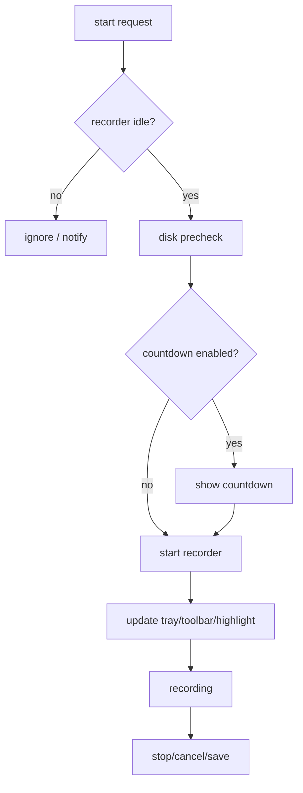
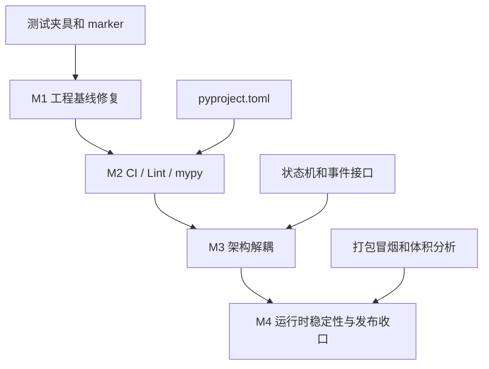

# QuickRec v1.4 开发计划

> 版本: v1.4
> 创建时间: 2026-07-04
> 状态: 已完成 / 待发布
> 前置版本: v1.3（已完成，tag v1.3）

---

## 1. 开发总览

### 1.1 v1.4 目标

v1.4 是稳定性与工程化大型优化版本，不新增用户可见功能。开发顺序严格遵循 PRD 的 M1-M4：先修测试基线，再建立 CI/Lint/类型检查，再做架构解耦，最后处理运行时稳定性和发布收口。

| 编号 | 目标 | 说明 | 涉及范围 |
|-----|------|------|---------|
| M1 | 工程基线修复 | 修复当前失败测试；建立 marker；接入 coverage `>= 80%` | tests, pyproject.toml |
| M2 | CI / Lint / mypy | GitHub Actions、ruff、mypy、默认测试自动化 | .github, pyproject.toml |
| M3 | 架构解耦 | 拆分应用控制、录制工作流、状态机、通知、资源生命周期 | src/main.py, src/recorder, 新增建议模块 |
| M4 | 运行时稳定性与发布收口 | FFmpeg、临时文件、磁盘、退出、连续录制、打包冒烟 | recorder, utils, build_std.spec, docs |

### 1.2 不变范围

| 模块/功能 | 说明 |
|----------|------|
| 用户可见功能 | 不新增录制历史、多显示器、编码参数设置、视频剪辑 |
| 运行时核心依赖 | 不外置 FFmpeg，不替换 OpenCV/Qt/FFmpeg 等核心依赖 |
| v1.3 录制能力 | 全屏、区域、窗口、音频、鼠标高亮、托盘、设置必须保持可用 |
| bugfix-log | 已更新至 Bug #60，覆盖空音频混音和 dxcam/cv2 打包问题 |
| v1.4-test-cases.md | 已新增，包含自动化测试、打包验证和发布前手动验收清单 |

### 1.3 新增依赖

#### 运行时依赖

无新增运行时依赖。

#### 开发依赖

| 依赖 | 用途 |
|-----|------|
| pytest-cov | 覆盖率统计 |
| ruff | lint + format |
| mypy | 类型检查 |

---

## 2. 开发阶段

### M1：工程基线修复

**目标**：恢复可信测试基线，为后续重构提供回归保护。

#### M1.1 VideoEncoder 测试修复

**改动量**：中

**内容**：

- 更新 `tests/test_video_encoder.py`，适配 `VideoEncoder(output_path, fps, frame_size, ffmpeg_path)`。
- 增加 FFmpeg 路径缺失、启动失败、编码失败、正常关闭测试。
- 将真实 FFmpeg 编码测试标记为 `hardware` 或单独夹具，避免默认 CI 对本机 FFmpeg 产生隐式依赖。

**详细步骤**：

1. 阅读 `src/recorder/video_encoder.py` 当前构造函数和错误处理路径。
2. 将旧测试中 `VideoEncoder(file_path, fps, frame_size)` 改为显式传入 `ffmpeg_path`。
3. 新增 mock Popen 测试，验证 FFmpeg 命令包含 `rawvideo`、`bgr24`、`libx264`、`crf=23`、`preset=superfast`、`yuv420p`。
4. 新增 BrokenPipeError 测试，确认 `write_frame()` 返回 False。
5. 将真实输出 MP4 的测试标记为 `hardware` 或拆到可单独运行的测试类。
6. 确认默认测试在没有本机 FFmpeg 的 CI 环境中不会失败。

**注意事项**：

- 不在本阶段修改编码实现，除非测试暴露真实 bug。
- 如果发现真实 bug，先记录现象，修复时同步更新 `bugfix-log.md`。
- 测试应验证接口契约，不要依赖私有字段。

**验证**：

- [ ] `VideoEncoder` 单元测试默认可稳定运行。
- [ ] 真实编码测试可通过 marker 单独运行。

#### M1.2 RecorderManager 异步 stop 测试修复

**改动量**：中

**内容**：

- 更新 `tests/test_recorder_manager.py` 中对 `stop()` 的旧同步返回预期。
- 明确 `stop()` 返回空字符串、后台完成后通过回调或事件通知保存结果。
- 增加状态流测试：RECORDING → STOPPING → SAVING → IDLE。
- 对真实 dxcam / FFmpeg 依赖使用 mock 或 marker 隔离。

**详细步骤**：

1. 梳理 `RecorderManager.stop()` 当前异步行为和 `on_saved` 回调触发位置。
2. 将旧的“stop 立即返回 mp4 路径”断言替换为状态/回调断言。
3. 使用 fake capturer / fake encoder 或 monkeypatch 隔离 dxcam 和 FFmpeg。
4. 增加取消路径测试：`stop(cancel=True)` 不应触发成功保存。
5. 增加重复 stop 测试：STOPPING/SAVING 状态下重复 stop 不应启动多个后台线程。
6. 增加 `wait_until_idle(timeout)` 测试，覆盖正常完成和超时场景。

**状态流验收**：

```text
IDLE
  -> start_fullscreen/start_region/start_window
RECORDING
  -> pause -> PAUSED
  -> stop  -> STOPPING -> SAVING -> IDLE
PAUSED
  -> resume -> RECORDING
  -> stop   -> STOPPING -> SAVING -> IDLE
```

**验证**：

- [ ] 异步停止契约被测试覆盖。
- [ ] 状态流测试不依赖真实屏幕捕获。

#### M1.3 ScreenCapturer 测试分层

**改动量**：中

**内容**：

- 修正未调用 `start()` 即 `capture_frame()` 的旧测试预期。
- 生命周期测试覆盖 `start()`、`capture_frame()`、`update_region()`、`close()`。
- 真实 dxcam 捕获测试标记为 `hardware`。

**详细步骤**：

1. 将纯生命周期测试与真实捕获测试拆开。
2. 对 `dxcam.create()` 使用 monkeypatch，模拟 camera 的 `start/get_latest_frame/stop/release`。
3. 验证 `update_region()` 在 region 不变时不重建 camera。
4. 验证 `update_region()` 失败时 `_camera` 和 `_started` 状态被清理。
5. 将真实 `capture_frame()` 形状验证移动到 `hardware` 测试。
6. 补充 close 幂等性测试。

**注意事项**：

- 默认测试不应启动真实 dxcam。
- 对私有字段的断言只允许作为过渡，后续 M3 应提供公共状态查询接口。

**验证**：

- [ ] 默认测试不因无真实桌面捕获环境失败。
- [ ] `hardware` 测试可在 Windows 桌面环境单独运行。

#### M1.4 pytest marker 与 coverage

**改动量**：小

**内容**：

- 在 `pyproject.toml` 中定义 marker：`unit`、`ui`、`hardware`、`packaging`。
- 接入 `pytest-cov`。
- 默认 coverage 目标 `>= 80%`。
- 移除或逐步减少测试文件中的 `sys.path.insert`。

**详细步骤**：

1. 新增 `pyproject.toml` 的 pytest marker 和 testpaths。
2. 设置 `pythonpath = ["src"]` 或等价导入方案。
3. 增加 coverage 配置，排除 runtime hook 等不适合统计的文件。
4. 批量给硬件相关测试添加 `@pytest.mark.hardware`。
5. 给 Qt widget 测试添加 `@pytest.mark.ui`。
6. 运行默认测试并记录 baseline。
7. 若覆盖率不足 80%，优先补状态机、配置、工具函数、错误路径测试，不为数字编写低价值 UI 快照测试。

**验证**：

- [ ] `python -m pytest -m "not hardware and not packaging"` 全绿。
- [ ] coverage `>= 80%`。

**M1 完成标准**：

- [ ] 默认测试全绿。
- [ ] 当前 11 个失败测试全部处理完毕。
- [ ] `hardware` / `packaging` 不进入默认 CI。
- [ ] coverage 接入并达到 80%。
- [ ] 测试运行说明写入 README 或后续测试文档任务清单。

### M2：CI / Lint / mypy

**目标**：将质量门槛自动化。

#### M2.1 pyproject.toml

**改动量**：小

**内容**：

- 新增 pytest 配置。
- 新增 coverage 配置。
- 新增 ruff 配置。
- 新增 mypy 配置。

**建议配置内容**：

- `[tool.pytest.ini_options]`：`testpaths`、`pythonpath`、marker、默认 `addopts`。
- `[tool.coverage.run]`：`source = ["src"]`、`branch = true`。
- `[tool.coverage.report]`：`fail_under = 80`、`show_missing = true`。
- `[tool.ruff]`：`target-version = "py312"`、`line-length = 100`。
- `[tool.mypy]`：Python 3.12、`ignore_missing_imports = true`、分阶段收紧。

**注意事项**：

- 配置应先服务 v1.4 目标，不追求一次性覆盖所有 Python 最佳实践。
- 若 ruff/mypy 对历史代码噪音过大，使用明确注释的 ignore，而不是关闭整个工具。

**验证**：

- [ ] 本地命令使用统一配置，不依赖口头约定。

#### M2.2 ruff

**改动量**：中

**内容**：

- 配置 `ruff check`。
- 配置 `ruff format --check`。
- 对历史代码可按阶段放宽部分规则，但新增代码必须满足规则。

**详细步骤**：

1. 先运行 `python -m ruff check .` 获取问题列表。
2. 区分自动可修复问题和需要人工判断的问题。
3. 对 import 顺序、未使用导入等低风险项优先修复。
4. 对会改变运行行为的规则暂缓或显式忽略。
5. 增加 `ruff format --check`，避免后续风格漂移。

**不做**：

- 不因格式化大面积重排 UI 样式字符串。
- 不在 v1.4 文档阶段执行实际源码格式化。

**验证**：

- [ ] `python -m ruff check .` 通过。
- [ ] `python -m ruff format --check .` 通过。

#### M2.3 mypy

**改动量**：中

**内容**：

- 指定 mypy 为 v1.4 类型检查工具。
- 先覆盖核心模块：config、utils、recorder 状态机/事件接口、非 UI 纯逻辑。
- 对 PyQt、pynput、dxcam 等缺失类型的第三方依赖使用合理 ignore 配置。

**详细步骤**：

1. 先配置 `ignore_missing_imports = true`，避免第三方库类型缺失阻塞。
2. 对新增的状态机、事件对象、资源生命周期模块写明确类型。
3. 对 `ConfigManager.get()` 等动态返回值保持保守类型。
4. 优先让纯逻辑模块通过 mypy。
5. UI 模块可后续逐步收紧，不作为 M2 首轮阻塞点。

**完成标准**：

- mypy 命令可在 CI 中稳定运行。
- 新增核心模块不引入明显 Any 扩散。

**验证**：

- [ ] `python -m mypy src` 或配置指定模块通过。

#### M2.4 GitHub Actions

**改动量**：小

**内容**：

- 新增 `.github/workflows/ci.yml`。
- CI 执行依赖安装、compileall、ruff、mypy、默认 pytest、coverage。


**验证**：

- [ ] GitHub Actions 能在 pull request / push 上运行。
- [ ] CI 失败能明确定位到具体阶段。

**M2 完成标准**：

- [ ] `pyproject.toml` 已合并。
- [ ] GitHub Actions 工作流已创建。
- [ ] CI 在 GitHub 上至少成功运行一次。
- [ ] CI 不运行 `hardware` / `packaging` 测试。
- [ ] README 或开发文档能说明本地如何运行同一组质量检查。

### M3：架构解耦

**目标**：降低 `main.py` 和 `recorder_manager.py` 的职责集中度，建立清晰公共接口。

#### M3.1 应用控制器拆分

**建议文件**：`src/app_controller.py`

**改动量**：中

**内容**：

- 从 `main.py` 拆出 Qt 应用生命周期、启动、退出收尾。
- `main.py` 保留入口和最小装配逻辑。

**详细步骤**：

1. 识别 `QuickRecApp.__init__()` 中的模块初始化职责。
2. 将 QApplication 创建、托盘显示、快捷键启动、退出收尾聚合到 `AppController`。
3. 将录制业务流程调用委托给 `RecordingWorkflow`。
4. 保留 `main()` 中 DPI 属性设置、异常兜底和 `sys.exit(app.run())`。

**迁移前后对比**：

| 当前 | v1.4 目标 |
|-----|----------|
| `main.py` 同时负责入口、UI 装配、录制流程、通知、退出 | `main.py` 只负责入口，`AppController` 负责应用生命周期 |
| `QuickRecApp` 直接持有所有模块并处理所有回调 | `AppController` 装配模块，`RecordingWorkflow` 处理录制流程 |

**验证**：

- [ ] 应用启动流程保持不变。
- [ ] 退出流程仍能等待后台任务并释放资源。

#### M3.2 录制工作流拆分

**建议文件**：`src/workflows/recording_workflow.py`

**改动量**：大

**内容**：

- 串联全屏/区域/窗口录制流程。
- 统一倒计时、暂停、停止、取消、保存完成处理。
- 减少三种录制模式在 `main.py` 中的重复流程。

**详细步骤**：

1. 将 `_on_start_fullscreen/_on_start_region/_on_start_window` 迁移为工作流入口。
2. 将 `_do_start_*` 合并成共享启动路径，差异由 RecordMode 或命令对象表达。
3. 将倒计时结束、ESC 取消、工具栏显示/隐藏封装为流程步骤。
4. 将 `_handle_saved`、保存失败、通知和结果条展示统一到工作流。
5. 保持原快捷键和托盘入口行为不变。

**流程草案**：



**验证**：

- [ ] 全屏、区域、窗口录制入口行为保持一致。
- [ ] 倒计时取消、暂停/继续、停止保存均有回归测试。

#### M3.3 状态机与公共事件

**建议文件**：

- `src/recorder/state_machine.py`
- `src/recorder/events.py` 或等价事件接口

**改动量**：中

**内容**：

- 明确 RecorderState 合法转移。
- 定义状态变化、保存完成、保存失败、录制失败、窗口丢失等公开事件。
- 移除 UI 对 recorder 私有字段的访问。

**详细步骤**：

1. 新增状态机模块，先只迁移状态判断和合法转移。
2. 为状态转移补单元测试。
3. 新增事件对象或公开信号适配层。
4. 将 `_window_lost_bridge` 等私有桥接改为公开事件订阅。
5. 更新 UI/workflow 调用方，确保不再读取 recorder 私有字段。

**事件列表**：

- `state_changed`
- `recording_saved`
- `recording_failed`
- `window_lost`
- `disk_warning`

**验证**：

- [ ] 非法状态转移可测试。
- [ ] UI 层不再访问 `_window_lost_bridge` 等私有字段。

#### M3.4 服务和资源生命周期拆分

**建议文件**：

- `src/services/notification_service.py`
- `src/recorder/resource_lifecycle.py`
- `src/recorder/window_recording_service.py`

**改动量**：大

**内容**：

- 通知服务统一保存成功、失败、磁盘不足、窗口不可录制提示。
- 资源生命周期服务统一管理 dxcam、FFmpeg、音频、临时目录、系统计时器。
- 窗口录制服务承接窗口区域、窗口丢失和特殊窗口失败判断。

**详细步骤**：

1. 先抽通知服务，集中 tray notification 文案。
2. 抽资源生命周期，封装 capturer/encoder/audio/temp_dir 的创建和释放顺序。
3. 将 `timeBeginPeriod(1)` 从模块 import 副作用迁移到显式生命周期。
4. 抽窗口录制服务，封装 hwnd 校验、rect 获取、最小化/关闭判断。
5. 每次抽取后运行默认测试。

**资源释放顺序建议**：

```text
stop requested
  -> stop capture loop
  -> close encoder stdin / wait ffmpeg
  -> stop audio capturer
  -> finalize or cleanup session
  -> emit saved/failed
  -> release timer period if no active recording
```

**验证**：

- [ ] 连续录制不因资源释放顺序失败。
- [ ] 特殊窗口失败不阻塞主线程、不崩溃。

**M3 完成标准**：

- [ ] `main.py` 行数和职责明显收窄。
- [ ] `RecorderManager` 不再直接承担所有流程编排和 UI 信号桥职责。
- [ ] UI 层不访问 recorder 私有字段。
- [ ] 状态机和公共事件有单元测试。
- [ ] 全屏/区域/窗口录制回归通过。

### M4：运行时稳定性与发布收口

**目标**：补齐异常路径，完成发布前验证。

#### M4.1 FFmpeg 异常路径

**改动量**：中

**内容**：

- 录制启动前检查 FFmpeg 路径。
- 捕获 Popen 启动异常。
- 编码中断时触发失败事件。
- 保存失败时用户可感知，日志可诊断。

**详细步骤**：

1. 在录制启动前调用 FFmpeg path validator。
2. 将 `subprocess.Popen` 异常转换为 `recording_failed` 事件。
3. `write_frame()` 失败时停止录制循环并进入失败收尾。
4. `_finalize()` move/mux 失败时保留日志和用户提示。
5. 增加 FFmpeg 缺失、Popen 异常、BrokenPipe 的测试。

**验证**：

- [ ] FFmpeg 缺失时不进入录制中状态。
- [ ] FFmpeg 编码失败不会卡死后台线程。

#### M4.2 临时文件和系统计时器生命周期

**改动量**：小到中

**内容**：

- 应用启动时真实调用 `TempCleaner.cleanup_stale()`。
- `timeBeginPeriod(1)` 与 `timeEndPeriod(1)` 配对。
- 退出时确保 session 目录清理。

**详细步骤**：

1. 将 `TempCleaner.cleanup_stale()` 接入应用启动路径。
2. 为 cleanup_stale 添加启动调用测试或集成验证。
3. 引入显式 timer period lifecycle 封装。
4. 应用退出和录制结束时保证 `timeEndPeriod(1)` 被调用。
5. 保留异常保护，避免 timer API 调用失败影响主流程。

**验证**：

- [ ] 崩溃残留 session 可在下次启动清理。
- [ ] 正常退出释放系统计时器。

#### M4.3 磁盘持续监控

**改动量**：中

**内容**：

- 在录制过程中周期性检查保存路径所在磁盘空间。
- 低空间时触发警告或停止保存策略。
- 不引入明显 IO 开销。

**详细步骤**：

1. 设计低频检查间隔，例如 30 秒。
2. 将检查挂入录制循环或 Qt 定时器，避免每帧 IO。
3. 低于 warn 阈值时发出 `disk_warning`。
4. 低于 block 阈值时触发安全停止或阻断继续写入策略。
5. 使用 mock `shutil.disk_usage` 测试阈值行为。

**策略待实现时确认**：

- warn：仅提示，继续录制。
- block：优先安全停止并保存已录内容；若无法保存，给出失败提示。

**验证**：

- [ ] 录制中磁盘空间不足路径可模拟测试。

#### M4.4 退出和连续录制

**改动量**：中

**内容**：

- 退出流程等待后台线程。
- 超时后记录日志并给出提示。
- 连续录制至少 3 轮验证资源释放。

**详细步骤**：

1. 为退出流程设置明确 timeout。
2. 等待录制线程、停止线程、finalize 线程结束。
3. 超时时记录线程状态和当前 recorder state。
4. 连续录制测试使用 fake capturer/encoder 优先自动化。
5. 真实连续录制作为 `hardware` 或发布前冒烟。

**验证**：

- [ ] 连续 3 轮录制不失败、不锁死 dxcam/FFmpeg。
- [ ] 退出不无限卡住。

#### M4.5 打包和体积分析

**改动量**：小到中

**内容**：

- PyInstaller 打包流程可复现。
- 打包产物冒烟：启动、托盘、设置、全屏/区域/窗口录制。
- 原体积目标 `< 200MB` 已调整为稳定性优先。
- 记录体积构成、尝试项、阻塞原因、后续方案：当前发布包 `257.74MB`，保留 cv2，排除 OpenCV videoio ffmpeg。

**详细步骤**：

1. 固化打包命令。
2. 记录打包环境：Python、PyInstaller、依赖版本。
3. 统计 dist 目录总体积和主要依赖体积。
4. 逐项评估 excludes/UPX/资源裁剪，不外置 FFmpeg，不替换核心依赖。
5. 执行打包产物冒烟 checklist。
6. 将体积结果和未达成原因写入打包记录或发布说明。

**冒烟 checklist**：

- [x] exe 可启动。
- [x] 托盘图标显示。
- [x] 设置对话框可打开并保存。
- [x] 全屏录制可开始/停止/保存。
- [x] 区域录制可选择区域并保存。
- [x] 窗口录制可选择普通窗口并保存。
- [x] 退出后无残留明显后台进程。

**验证**：

- [x] 打包产物可启动。
- [x] 发布前 checklist 完成。
- [x] 体积结果有记录。

**M4 完成标准**：

- [x] FFmpeg 异常路径可诊断。
- [x] cleanup_stale 启动接入。
- [x] timeBeginPeriod/timeEndPeriod 配对。
- [x] 磁盘持续监控策略实现。
- [x] 退出超时处理实现。
- [x] 连续录制 3 轮通过。
- [x] 打包冒烟完成。
- [x] 体积目标结果有记录。

---

## 3. 开发顺序与依赖图



**并行原则**：

- M1 内部的 VideoEncoder、RecorderManager、ScreenCapturer 测试修复可并行。
- M2 的 pyproject/ruff/mypy/CI 可以并行推进，但必须在 M1 默认测试趋稳后收紧门槛。
- M3 必须在 M1 后进行，避免无回归网重构。
- M4 依赖 M3 的公共事件和资源生命周期边界。

---

## 4. 风险与注意事项

| 风险 | 影响 | 缓解措施 |
|-----|------|---------|
| 测试修复牵出实现缺陷 | M1 范围扩大 | 先区分测试漂移和真实 bug；真实 bug 后续记录到 bugfix-log |
| ruff/mypy 一次性收紧过猛 | 大量历史代码需要机械修改 | v1.4 可先配置合理忽略，逐步收紧 |
| 架构拆分影响录制流程 | 引入回归 | 每个拆分步骤后跑默认测试；关键流程保留冒烟验证 |
| 硬件测试无法 CI 覆盖 | 默认 CI 不能证明真实录制完整可用 | 使用 marker + 发布前手工 checklist |
| 打包体积目标不确定 | `< 200MB` 可能无法达成 | 不牺牲功能；输出体积分析和后续方案 |
| 文档和实现偏离 | 后续开发可能调整文件名 | 文件清单保持建议性质，以职责边界和验收为准 |

---

## 5. 文件改动清单（建议）

| 文件 | 改动类型 | 改动量 | 说明 |
|-----|---------|--------|------|
| `doc/Tec-design-v1.4.md` | 新增 | 中 | v1.4 技术设计 |
| `doc/dev-plan-v1.4.md` | 新增 | 中 | v1.4 开发计划 |
| `pyproject.toml` | 新增 | 小 | pytest/coverage/ruff/mypy 配置 |
| `.github/workflows/ci.yml` | 新增 | 小 | GitHub Actions |
| `tests/test_video_encoder.py` | 修改 | 中 | 适配 v1.3 FFmpeg path 接口 |
| `tests/test_recorder_manager.py` | 修改 | 中 | 适配异步 stop 契约 |
| `tests/test_screen_capturer.py` | 修改 | 中 | 生命周期与 hardware marker |
| `src/main.py` | 重构 | 大 | 职责收窄，入口保留 |
| `src/app_controller.py` | 建议新增 | 中 | 应用生命周期 |
| `src/workflows/recording_workflow.py` | 建议新增 | 大 | 录制流程编排 |
| `src/services/notification_service.py` | 建议新增 | 中 | 通知统一管理 |
| `src/recorder/state_machine.py` | 建议新增 | 中 | 状态转移 |
| `src/recorder/resource_lifecycle.py` | 建议新增 | 大 | 资源生命周期 |
| `src/recorder/window_recording_service.py` | 建议新增 | 中 | 窗口录制支持逻辑 |
| `src/recorder/recorder_manager.py` | 重构 | 大 | 收窄为录制引擎门面 |
| `src/utils/temp_cleaner.py` | 修改 | 小 | 启动扫描接入配合 |
| `src/utils/disk_checker.py` | 修改 | 中 | 录制中持续监控支持 |
| `build_std.spec` | 优化 | 小到中 | 打包体积目标与冒烟验证 |

> 文件名和拆分方式为建议方案。实际实现可以调整，但必须满足 PRD 和 TecDesign 中的职责边界、质量门槛和验收目标。
