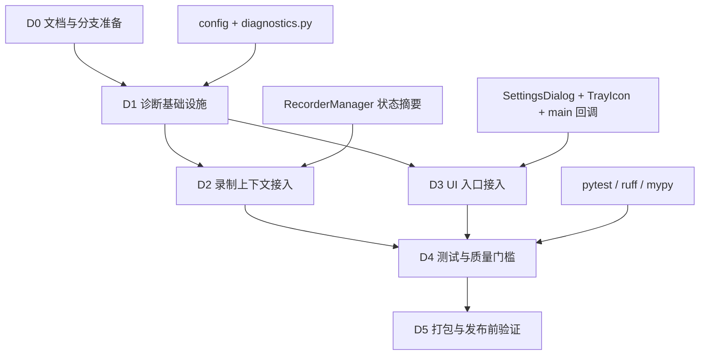

# QuickRec v1.4.x 诊断日志 / 错误导出能力开发计划

> 版本: v1.4.x  
> 创建时间: 2026-07-09  
> 状态: 已完成 / 已验收通过  
> PRD: [PRD-diagnostic-export-v1.4.x.md](PRD-diagnostic-export-v1.4.x.md)  
> 目标分支: Full `test` 开发，验收通过后合并 `master`  

---

## 1. 开发总览

### 1.1 目标

本次 v1.4.x 是 Full 版本的诊断能力补充，不改变录制主链路，不新增复杂诊断中心。目标是在录制失败、音频异常、FFmpeg 异常、保存失败、窗口捕获异常时，用户可以快速完成：

- 复制诊断信息。
- 打开日志目录。
- 导出本地诊断文件。
- 自定义诊断文件夹。

### 1.2 本次不变范围

| 范围 | 说明 |
| --- | --- |
| 录制主链路 | 不重写 dxcam、FFmpeg pipe、音频混流、窗口捕获逻辑 |
| 产品边界 | 不做云上传、不做自动修复、不做复杂诊断中心 |
| Lite 分支 | 本计划不要求 Lite v0.1 同步实现；后续可复用诊断模块 |
| 隐私策略 | 当前只保存在本地，无需脱敏，不主动发送 |
| 依赖 | 不引入新的第三方运行时依赖 |

### 1.3 现有项目脉络 Review

| 模块 | 当前状态 | 与本次关系 |
| --- | --- | --- |
| `src/main.py` | 应用装配、托盘回调、设置页入口、保存完成处理集中在入口类 | 需要接入诊断管理器、托盘回调和设置页信号 |
| `src/config.py` | 负责 AppData 配置读写和默认值 | 需要新增诊断目录配置及默认目录规则 |
| `src/ui/settings_dialog.py` | 保存路径、音频源、自启、快捷键等设置 | 需要新增“诊断”分组、目录选择和三个操作按钮 |
| `src/ui/tray_icon.py` | 托盘菜单和通知降级链 | 需要新增诊断菜单项和信号桥 |
| `src/recorder/recorder_manager.py` | 录制核心、FFmpeg、音频、窗口诊断、保存失败 | 需要暴露或记录最近诊断快照所需信息 |
| `src/recorder/events.py` | 已有 saved / failed 事件 | 可作为最近错误和保存结果的来源之一 |
| `src/recorder/audio_preflight.py` | 音频自检和降级结果 | 诊断摘要需要记录请求音频源、最终音频源、降级原因 |
| `src/recorder/window_diagnostics.py` | 窗口录制失败 reason 与诊断对象 | 诊断摘要需要纳入窗口 hwnd/title/stage/reason |
| `tests/` | 已有配置、设置页、托盘、录制核心测试 | 本次新增 diagnostics 测试并扩展现有 UI 测试 |

### 1.4 开发阶段

| 阶段 | 名称 | 目标 | 涉及范围 |
| --- | --- | --- | --- |
| D0 | 文档与分支准备 | 确认 Full v1.4.x 范围、目标分支和验收口径 | docs, git |
| D1 | 诊断基础设施 | 配置、日志文件、诊断目录、诊断摘要生成 | config, utils, logging |
| D2 | 录制上下文接入 | 汇总 FFmpeg、音频、窗口、保存失败等最近状态 | recorder, events |
| D3 | UI 入口接入 | 设置页和托盘加入复制、打开目录、导出文件 | ui, main |
| D4 | 测试与质量门槛 | 单测、UI 测试、回归命令、手动验收清单 | tests, pyproject |
| D5 | 打包与发布前验证 | 打包产物验证诊断能力，不影响原录制能力 | build, dist, docs |

---

## 2. 实施阶段

### D0：文档与分支准备

**目标**：确认本次诊断能力进入 Full v1.4.x 后续版本，避免误入 Lite 发布线。

**详细步骤**：

1. 从 Full `test` 分支开始开发。
2. 确认 `doc/PRD-diagnostic-export-v1.4.x.md` 为需求基线。
3. 确认本计划和 `progress_v1.4.x.md` 已被用户确认。
4. 检查当前工作区未提交文件，避免覆盖 Lite 文档或历史发布文档。

**验证**：

- [ ] 当前开发分支为 Full `test` 或基于 Full `test` 的工作分支。
- [ ] PRD / dev plan / progress 三份文档路径明确。

### D1：诊断基础设施

**目标**：建立诊断目录、文件日志和诊断摘要生成能力。

**建议新增文件**：

| 文件 | 类型 | 说明 |
| --- | --- | --- |
| `src/utils/diagnostics.py` | 新增 | 诊断目录、摘要生成、导出文件、打开目录 |
| `tests/test_diagnostics.py` | 新增 | 纯逻辑测试，避免真实录制依赖 |

**建议修改文件**：

| 文件 | 类型 | 说明 |
| --- | --- | --- |
| `src/config.py` | 修改 | 新增 `diagnostic_dir`、`diagnostic_keep_days` 默认值和目录解析 |
| `src/main.py` | 修改 | 初始化文件日志 handler 和诊断管理器 |

**详细步骤**：

1. 在 `ConfigManager.defaults` 中新增：
   - `diagnostic_dir`
   - `diagnostic_keep_days`
2. 设计默认诊断目录规则：
   - 未设置时为 `<save_path>/QuickRecDiagnostics`。
   - 自定义后不随保存路径变化。
3. 新增 `DiagnosticManager`：
   - `get_diagnostic_dir()`
   - `ensure_diagnostic_dir()`
   - `build_snapshot()`
   - `format_snapshot_text()`
   - `export_text_file()`
   - `open_diagnostic_dir()`
4. 新增文件日志 handler：
   - 默认写入 `<diagnostic_dir>/quickrec.log`。
   - 控制台日志行为保留。
   - 日志写入失败不得影响应用启动。
5. 导出文件命名：
   - `diagnostic_YYYYMMDD_HHMMSS.txt`
   - UTF-8 编码。

**注意事项**：

- 不在 D1 引入 UI。
- 不依赖真实 dxcam、FFmpeg、音频设备。
- 目录不可写时应返回错误结果，不抛到 UI 线程导致崩溃。

**验证命令**：

```powershell
python -m pytest tests/test_config.py tests/test_diagnostics.py -q
python -m compileall src tests
```

### D2：录制上下文接入

**目标**：让诊断摘要包含最近一次录制、音频、FFmpeg、窗口和保存失败信息。

**建议修改文件**：

| 文件 | 类型 | 说明 |
| --- | --- | --- |
| `src/recorder/recorder_manager.py` | 修改 | 暴露最近录制摘要或更新诊断上下文 |
| `src/recorder/events.py` | 可选修改 | 如需要扩展失败 reason 或上下文字段 |
| `src/recorder/window_diagnostics.py` | 读取 | 复用已有窗口诊断对象 |
| `src/recorder/audio_preflight.py` | 读取 | 复用已有音频预检结果 |

**诊断摘要字段**：

| 类别 | 字段 |
| --- | --- |
| 应用环境 | 版本口径、Python 版本、Windows 版本、是否 frozen |
| 配置 | 保存路径、诊断目录、音频源、画质、帧率 |
| FFmpeg | 路径、是否存在、是否来自打包路径 |
| 录制状态 | 当前状态、最近模式、最近输出路径、最近 session 目录 |
| 音频 | requested_source、final_source、degraded、reason |
| 窗口 | hwnd、title、mode、stage、reason、rect、foreground_result |
| 错误 | 最近失败 reason、最近 error/warning 日志摘要 |
| 日志 | 最近 100 行 `quickrec.log` |

**详细步骤**：

1. Review `RecorderManager` 已有 getter：
   - `get_state()`
   - `get_mode()`
   - `get_audio_preflight()`
   - `get_last_window_diagnostic()`
2. 设计一个轻量 `DiagnosticContextProvider` 或等价回调，不让 `DiagnosticManager` 直接依赖 UI。
3. 在录制失败、保存失败、FFmpeg 启动失败、音频降级、窗口捕获失败时记录最近错误摘要。
4. 不为了诊断改动录制状态机合法转移。

**注意事项**：

- 诊断模块读取状态，不参与状态控制。
- 如果某字段不可用，使用 `unknown` 或空值，不抛异常。
- 不读取视频内容、音频内容或屏幕截图内容。

**验证命令**：

```powershell
python -m pytest tests/test_recorder_manager.py tests/test_window_diagnostics.py tests/test_audio_preflight.py tests/test_diagnostics.py -q
```

### D3：UI 入口接入

**目标**：在设置页和托盘菜单中提供复制、打开目录、导出文件入口。

**建议修改文件**：

| 文件 | 类型 | 说明 |
| --- | --- | --- |
| `src/ui/settings_dialog.py` | 修改 | 新增诊断分组、目录选择、三个操作按钮、状态提示 |
| `src/ui/tray_icon.py` | 修改 | 新增托盘诊断菜单项和信号桥 |
| `src/main.py` | 修改 | 连接设置页和托盘回调，处理剪贴板、Toast、目录打开 |

**详细步骤**：

1. 设置页新增“诊断”分组：
   - 诊断目录输入框。
   - “浏览...”按钮。
   - “复制诊断信息”按钮。
   - “打开日志目录”按钮。
   - “导出诊断文件”按钮。
   - 状态提示文本。
2. 托盘空闲菜单新增：
   - “复制诊断信息”
   - “打开日志目录”
   - “导出诊断文件”
3. 托盘录制中菜单也保留诊断入口。
4. `main.py` 新增回调：
   - `_on_copy_diagnostic_info()`
   - `_on_open_diagnostic_dir()`
   - `_on_export_diagnostic_file()`
5. 剪贴板写入使用 Qt clipboard。
6. 成功/失败反馈优先使用 Toast 或设置页状态提示，不弹阻塞 modal。

**文案**：

| 场景 | 文案 |
| --- | --- |
| 复制成功 | 诊断信息已复制 |
| 复制失败 | 复制失败，请导出诊断文件 |
| 打开目录失败 | 无法打开日志目录 |
| 导出成功 | 诊断文件已导出 |
| 导出失败 | 导出失败，请检查诊断目录权限 |

**注意事项**：

- 控件密度要克制，不把设置页做成诊断中心。
- 保存设置与诊断操作要解耦：用户未点击保存时，复制/导出应使用当前已保存配置或当前输入值，需要实现时明确。
- 本次建议：设置页内“导出”使用当前输入框目录；点击“保存”后才持久化目录。

**验证命令**：

```powershell
python -m pytest tests/test_settings_dialog.py tests/test_tray_icon.py tests/test_main_workflow.py -q
```

### D4：测试与质量门槛

**目标**：自动化覆盖核心逻辑，人工覆盖桌面交互和打包行为。

**自动化测试清单**：

| 测试文件 | 新增/修改 | 覆盖内容 |
| --- | --- | --- |
| `tests/test_diagnostics.py` | 新增 | 目录解析、摘要生成、导出文件、错误兜底 |
| `tests/test_config.py` | 修改 | 诊断目录默认值、自定义值、旧配置兼容 |
| `tests/test_settings_dialog.py` | 修改 | 诊断分组控件存在、保存目录 |
| `tests/test_tray_icon.py` | 修改 | 空闲/录制中菜单包含诊断入口 |
| `tests/test_main_workflow.py` | 修改 | 主入口回调连接、诊断操作反馈 |
| `tests/test_recorder_manager.py` | 修改 | FFmpeg/音频/窗口失败信息进入诊断上下文 |

**质量命令**：

```powershell
python -m pytest -q
python -m compileall src scripts tests
python -m ruff check .
python -m mypy
```

**硬件 / 打包相关命令**：

```powershell
python scripts\hardware_smoke.py --output-dir E:\QRtest --duration 3 --mode fullscreen
python -m PyInstaller build_std.spec --clean --noconfirm
python -m pytest -m packaging -q
```

**注意事项**：

- 默认 CI 不跑硬件录制。
- 诊断模块测试不应依赖真实剪贴板、真实 explorer 或真实 FFmpeg。
- 对 UI 控件存在性和回调连接使用 mock。

### D5：打包与发布前验证

**目标**：确认打包产物中的诊断能力可用，且不破坏 Full v1.4 既有录制能力。

**验证路径**：

1. 打包 `dist/QuickRec/QuickRec.exe`。
2. 启动打包产物。
3. 打开设置页，确认“诊断”分组存在。
4. 修改诊断目录并保存。
5. 点击复制诊断信息，粘贴到文本编辑器检查。
6. 点击打开日志目录，确认资源管理器打开。
7. 点击导出诊断文件，确认文件生成。
8. 执行一次全屏录制，确认录制仍可用。
9. 至少构造一个失败场景，确认诊断信息包含错误阶段。

**发布前通过标准**：

- 打包产物可启动。
- 复制 / 打开目录 / 导出三个主流程通过。
- 诊断失败不影响录制主流程。
- 全屏、区域、窗口录制至少完成基础回归。
- 文档同步更新测试结果。

---

## 3. 开发顺序与依赖图



**并行策略**：

- D1 完成基础接口后，D2 和 D3 可并行。
- D4 可在 D1 单元测试先行，UI 测试等 D3 完成后补齐。
- D5 必须等默认测试和核心质量命令通过后执行。

---

## 4. 风险与回退

| 风险 | 影响 | 回退 / 缓解 |
| --- | --- | --- |
| 诊断目录不可写 | 导出失败 | 回退到默认诊断目录或提示用户修改目录 |
| 文件日志初始化失败 | 启动失败或日志缺失 | 不阻塞启动，保留控制台日志，记录 fallback |
| UI 变重 | 设置页不再轻量 | 只加一个“诊断”分组，不做诊断面板 |
| 诊断模块耦合录制核心 | 影响录制稳定性 | 诊断只读状态，不参与状态转移和资源释放 |
| 打包后路径差异 | exe 中日志目录不可用 | 打包验证覆盖目录创建、复制、导出 |
| 最近日志过大 | 导出文件膨胀 | 首版只导出最近 100 行 |
| 诊断信息字段不足 | 排查价值低 | 验收时用 FFmpeg/音频/窗口失败场景检查字段 |
| 修改托盘菜单引入线程问题 | 点击菜单崩溃或无响应 | 沿用 `_SignalBridge` 信号桥，不在 pystray 线程直接操作 Qt |

---

## 5. 文件改动清单（建议）

| 文件 | 改动类型 | 改动量 | 说明 |
| --- | --- | --- | --- |
| `src/utils/diagnostics.py` | 新增 | 中 | 诊断目录、摘要、复制文本、导出文件、打开目录 |
| `src/config.py` | 修改 | 小 | 新增诊断目录配置和默认值 |
| `src/main.py` | 修改 | 中 | 初始化诊断、文件日志、托盘/设置页回调 |
| `src/ui/settings_dialog.py` | 修改 | 中 | 新增诊断分组和操作按钮 |
| `src/ui/tray_icon.py` | 修改 | 中 | 新增诊断菜单项和信号桥 |
| `src/recorder/recorder_manager.py` | 修改 | 小到中 | 提供最近录制/失败上下文 |
| `tests/test_diagnostics.py` | 新增 | 中 | 诊断纯逻辑测试 |
| `tests/test_config.py` | 修改 | 小 | 诊断配置测试 |
| `tests/test_settings_dialog.py` | 修改 | 小到中 | 设置页控件测试 |
| `tests/test_tray_icon.py` | 修改 | 小到中 | 托盘菜单测试 |
| `tests/test_main_workflow.py` | 修改 | 中 | 回调装配测试 |
| `tests/test_recorder_manager.py` | 修改 | 小到中 | 失败上下文测试 |
| `doc/v1.4-test-cases.md` 或新增测试文档 | 修改/新增 | 小 | 补充 v1.4.x 诊断验收项 |

> 文件名和拆分方式为建议方案。实现阶段可以调整，但必须满足 PRD 的功能链路、影响范围和验收口径。
