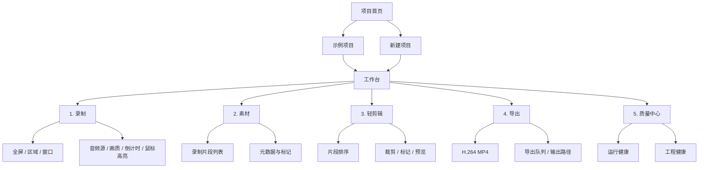
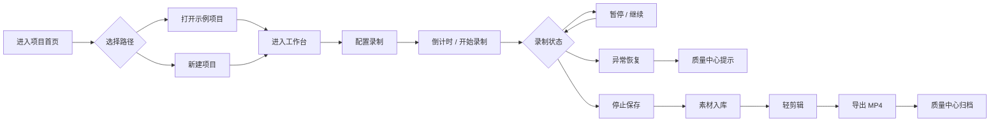
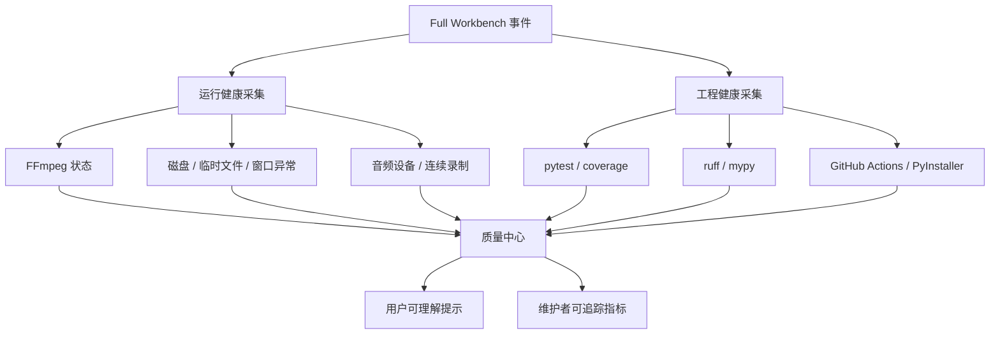

# QuickRec Full Workbench 原型设计

> 状态：规划探索  
> 适用范围：QuickRec Full 未来产品线  
> 参考文档：`PRD-QuickRec.md`、`Tec-design-v1.1.md` 至 `Tec-design-v1.4.md`、`dev-plan-v1.1.md` 至 `dev-plan-v1.4.md`、`progress.md`  
> 原型文件：`prototype-full-workbench.html`

## 1. 设计结论

QuickRec Full Workbench 是面向未来产品线的创作者工作台原型。它不替代当前 QuickRec Lite，也不要求 v1.4 直接实现完整工作台。

v1.4 的正式目标仍然是稳定性与工程化大型优化：测试基线、CI/Lint/mypy、架构解耦、运行时稳定性、发布收口。Full Workbench 原型用于把 v1.1-v1.4 积累出的录制能力、异常处理能力和工程质量目标可视化，为后续拆分独立 Full 分支提供产品方向。

## 2. 非目标与边界

| 项目 | 说明 |
| --- | --- |
| 不做 Lite / Full 双模式切换 | Lite 应保持长期轻量，不在同一产品内塞入复杂工作台模式 |
| 不作为 v1.4 强制开发范围 | v1.4 不新增用户可见功能，Full 原型只作为未来方向 |
| 不接入真实录制能力 | HTML 原型只模拟交互路径，不调用 dxcam、FFmpeg、音频、文件系统 |
| 不承诺复杂剪辑能力 | 轻剪辑仅表达片段排序、裁剪、标记、预览等基础概念 |
| 不改变当前工程约束 | v1.4 仍遵守不外置 FFmpeg、不替换核心依赖的约束；体积目标已调整为稳定性优先，发布包约 `257.74MB` |

## 3. 设计依据

| 版本 | 已形成能力 | 在 Full Workbench 中的表达 |
| --- | --- | --- |
| v1.1 | 区域录制、音频源选择、动态托盘、录制结果提示 | 录制配置中的区域/全屏入口、系统声音/麦克风音频卡片、录制完成后的素材入库 |
| v1.2 | 鼠标点击高亮、原生画质、开机自启、倒计时 | 录制前配置中的画质、倒计时、鼠标高亮开关 |
| v1.3 | 窗口录制、H.264 实时编码、磁盘预警、临时文件会话目录、DPI 适配 | 录制模式中的窗口录制、导出配置中的 H.264、质量中心中的磁盘/FFmpeg/临时文件状态 |
| v1.4 | 测试基线、CI/Lint/mypy、架构解耦、异常路径、打包体积 | 质量中心中的运行健康和工程健康双视角 |

## 4. 产品定位

### 4.1 Lite 与 Full 的关系

| 产品线 | 定位 | 演进方式 |
| --- | --- | --- |
| QuickRec Lite | 轻量录屏工具，托盘常驻，低学习成本 | 继续保持当前项目的简洁体验 |
| QuickRec Full | 面向创作者的项目化录制、素材、轻剪辑、导出和诊断工作台 | 后续建议作为独立分支或独立产品线探索 |

### 4.2 目标用户

- 需要连续录制教程、演示、课程片段的创作者。
- 需要管理多个录制片段并快速导出的轻量内容生产者。
- 需要理解录制失败原因、导出失败原因和环境健康状态的高级用户。
- 需要在发布前观察测试、CI、打包、异常日志状态的维护者。

## 5. 信息架构

## 6. 核心流程

## 7. 页面与交互规格

### 7.1 项目首页

**目标**：让用户从项目维度进入工作流，而不是从单次录制开始。

**关键元素**：

| 区域 | 内容 |
| --- | --- |
| 顶部栏 | 产品名、当前版本定位、质量摘要 |
| 项目入口 | 示例项目、最近项目、新建项目 |
| 项目摘要 | 片段数、总时长、最近导出、健康状态 |
| Lite 说明 | Lite 保持轻量分支，Full 为未来创作者工作台 |

**交互**：

- 点击“打开示例项目”进入完整工作台。
- 点击“新建项目”创建模拟项目，并进入录制步骤。
- 点击“查看 Lite 边界”弹出产品线边界提示。

### 7.2 录制步骤

**目标**：把 v1.1-v1.3 已完成能力统一收敛到一个项目录制面板。

**关键元素**：

| 区域 | 内容 |
| --- | --- |
| 模式 | 全屏录制、区域录制、窗口录制 |
| 输入 | 系统声音、麦克风、两者、无音频 |
| 质量 | 原生、1080p、720p、480p，帧率 30/60fps |
| 辅助 | 倒计时、鼠标点击高亮、磁盘预检查 |
| 状态 | 未录制、倒计时、录制中、暂停、保存中、异常 |

**交互**：

- 点击录制模式卡片切换模式。
- 点击“开始录制”进入模拟录制中状态。
- 点击“暂停”后计时器停止并显示恢复按钮。
- 点击“停止并保存”生成一条模拟素材。
- 点击“模拟窗口最小化”进入异常恢复状态，并在质量中心记录事件。

### 7.3 素材步骤

**目标**：把录制结果从“保存到文件夹”提升为“项目素材”。

**关键元素**：

| 区域 | 内容 |
| --- | --- |
| 素材列表 | 文件名、来源模式、时长、分辨率、音频、健康状态 |
| 筛选 | 全部、窗口录制、区域录制、异常恢复 |
| 元数据 | 保存路径、编码方式、创建时间、备注 |
| 快捷操作 | 加入时间线、打开输出目录、标记问题 |

### 7.4 轻剪辑步骤

**目标**：表达 Full 的未来能力，但保持轻量边界。

**关键元素**：

| 区域 | 内容 |
| --- | --- |
| 预览区 | 当前片段预览占位 |
| 时间线 | 片段排序、裁剪手柄、标记点 |
| 操作 | 分割、删除、静音、添加标记、撤销 |
| 信息 | 总时长、片段数、预计导出大小 |

**边界**：

- 不设计多轨复杂剪辑。
- 不设计字幕、特效、转场、调色。
- 不设计真实渲染引擎，仅作为后续产品方向。

### 7.5 导出步骤

**目标**：把 v1.3 的 H.264 实时编码经验延伸为清晰的导出配置。

**关键元素**：

| 区域 | 内容 |
| --- | --- |
| 格式 | MP4 / H.264 / AAC |
| 质量 | 原生、1080p、720p |
| 输出 | 文件名、输出目录、覆盖策略 |
| 队列 | 等待中、导出中、完成、失败 |
| 结果 | 打开文件、打开目录、复制路径 |

### 7.6 质量中心

**目标**：把 v1.4 的工程化目标转化为 Full 工作台中的质量可见性。

质量中心同时包含两类指标：

| 视角 | 指标 | 来源 |
| --- | --- | --- |
| 运行健康 | FFmpeg 可用性、磁盘空间、临时文件清理、窗口录制异常、音频设备状态、连续录制资源释放 | v1.1-v1.4 运行时设计 |
| 工程健康 | pytest、coverage `>= 80%`、ruff、mypy、GitHub Actions、PyInstaller 体积记录 `257.74MB` | v1.4 工程化设计 |

## 8. 视觉与布局

| 项目 | 设计要求 |
| --- | --- |
| 基调 | 专业创作者工具，信息密度高，偏桌面生产力软件 |
| 结构 | 项目首页 + 流程步骤，不使用 Lite/Full 双模式切换 |
| 布局 | 顶部项目栏、左侧项目摘要、主工作区、右侧上下文面板 |
| 色彩 | 深色工作台为主，使用绿色表示健康、红色表示录制/异常、蓝色表示流程状态 |
| 组件 | 步骤条、状态徽标、素材表格、时间线、质量指标、日志列表 |

## 9. 原型交互清单

- [x] 默认展示示例项目。
- [x] 支持模拟新建项目。
- [x] 支持流程步骤切换：项目、录制、素材、轻剪辑、导出、质量。
- [x] 支持录制状态模拟：开始、暂停、继续、停止保存。
- [x] 支持模拟窗口最小化异常，并在质量中心展示。
- [x] 支持素材入库和加入时间线。
- [x] 支持导出队列模拟。
- [x] 支持质量中心展示运行健康和工程健康。
- [x] 支持 Lite / Full 产品线边界提示。

## 10. 后续拆任务建议

这些任务不属于 v1.4 必做范围，适合在 Full 分支立项后再拆分。

| 优先级 | 任务 | 说明 |
| --- | --- | --- |
| P0 | Full 产品线立项确认 | 明确是否从 Lite 项目独立分支，避免当前项目复杂化 |
| P0 | 项目模型设计 | 定义 Project、Clip、Timeline、ExportJob、QualityEvent |
| P1 | 录制结果入库 | 当前录制完成后从“输出文件”演进为“素材对象” |
| P1 | 质量中心事件模型 | 复用 v1.4 公共事件接口，沉淀运行健康数据 |
| P2 | 轻剪辑能力验证 | 先验证片段排序、裁剪元数据、导出拼接，不做复杂编辑 |
| P2 | Full 工作台技术选型 | 评估 PyQt 扩展、Qt WebEngine、独立前端或跨平台桌面方案 |

## 11. 与 v1.4 的关系

v1.4 不实现 Full Workbench，但 v1.4 的以下成果会降低未来 Full 分支风险：

- 测试分层和 `coverage >= 80%` 提供回归基础。
- 公共状态机和事件接口可服务质量中心。
- 录制工作流拆分可让 Full 工作台复用录制能力。
- FFmpeg、磁盘、临时文件、退出、连续录制的异常收口可成为 Full 的运行健康指标。
- GitHub Actions、ruff、mypy、PyInstaller 冒烟和体积分析可成为工程健康指标。

## 12. 验收标准

- [x] 原型说明明确 Lite 与 Full 的产品线边界。
- [x] 原型说明明确 Full 不属于 v1.4 强制开发范围。
- [x] Markdown 包含信息架构图、完整流程图、质量中心数据流图。
- [x] HTML 原型为单文件，可直接浏览器打开。
- [x] HTML 原型覆盖录制、素材、轻剪辑、导出、质量诊断完整路径。
- [x] 质量中心同时展示运行健康和工程健康。
