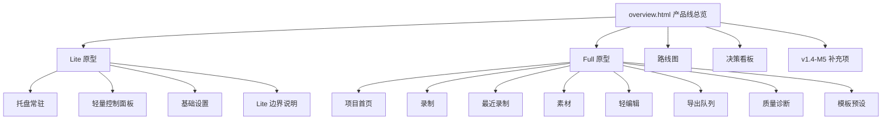

# QuickRec 产品原型设计

> 状态：规划原型  
> 目录：`doc/product-prototype/`  
> 原型入口：`overview.html`  
> 适用范围：QuickRec v1.1-v1.5 能力沉淀、v1.4-M5 额外补充项、Lite/Full 未来产品线规划

## 1. 设计结论

本目录是 QuickRec 新的产品原型目录，用于替代旧的 `doc/full-workbench-prototype/` 原型作为后续规划参考。

本轮原型采用“总览入口 + Lite 子原型 + Full 子原型”的结构：

| 文件 | 作用 |
| --- | --- |
| `overview.html` | 产品线总览、路线图、决策看板、v1.4-M5 关系说明 |
| `lite.html` | QuickRec Lite 高保真交互原型 |
| `full.html` | QuickRec Full 高保真交互原型 |
| `prototype-design.md` | 原型范围、信息架构、页面清单和交互说明 |

## 2. 打开方式

直接用浏览器打开以下文件：

```text
doc/product-prototype/overview.html
doc/product-prototype/lite.html
doc/product-prototype/full.html
```

建议从 `overview.html` 开始查看，再进入 Lite 和 Full。

## 3. 范围边界

| 边界 | 说明 |
| --- | --- |
| 不实现真实录制 | HTML 原型只模拟交互，不调用 dxcam、FFmpeg、音频设备或文件系统 |
| 不改变 v1.4 交付结论 | v1.4 M1-M4 已完成；M5 是额外补充项，仍处于规划中 / 待开发 |
| 不做 Lite/Full 双模式切换 | Lite 和 Full 是未来不同产品线方向，不在同一个产品里做复杂模式切换 |
| 不把 Full 能力回灌 Lite | 素材管理、轻编辑、导出队列、质量诊断中心属于 Full 方向 |
| 不承诺 Full 属于 v1.4 | Full Workbench 是未来方向，不属于 v1.4 强制开发范围 |

## 4. 信息架构



## 5. 页面清单

### 5.1 `overview.html`

目标：同时承担产品线边界说明、路线图管理和决策看板。

核心区域：
- 产品线总览
- 版本路线图
- 能力归属决策看板
- v1.4-M5 补充项说明
- Lite / Full 原型入口

交互：
- 左侧导航切换总览、路线图、决策看板、M5。
- 顶部按钮跳转到 Lite / Full 原型。

### 5.2 `lite.html`

目标：表达 QuickRec Lite 的轻量方向。

核心区域：
- Windows 桌面与托盘模拟
- Lite 轻量控制面板
- 全屏录制主入口
- 最近录制、保存路径、音频状态、快捷键状态
- 基础设置
- Lite 边界说明

交互：
- 点击托盘图标显示托盘菜单。
- 点击录制按钮切换准备 / 录制状态。
- 切换状态、设置、边界三个页签。
- 切换基础设置中的开关。

Lite 边界：
- 默认仅保留全屏录制。
- 区域录制作为未来可选能力。
- 不规划窗口录制。
- 保留托盘 UI。
- 保留当前音频能力，但隐藏高级配置。

### 5.3 `full.html`

目标：沿用并增强“创作者工作台”信息架构。

核心区域：
- 项目首页
- 录制
- 最近录制
- 素材
- 轻编辑
- 导出队列
- 质量诊断中心
- 模板与预设

交互：
- 左侧导航切换多个工作台页面。
- 模拟开始 / 停止录制。
- 最近录制中模拟复制路径、移除失效记录，以及空状态与示例记录之间的切换。
- 素材卡片选中状态切换。
- 导出进度推进。
- 质量诊断状态切换。

Full 边界：
- Full 是未来创作者工作台方向。
- Full 不属于 v1.4 强制开发范围。
- Full 不应影响 Lite 的轻量定位。

## 6. 与 v1.1-v1.4 的对应关系

| 版本 | 已形成能力 | 原型表达 |
| --- | --- | --- |
| v1.1 | 区域录制、音频源选择、动态托盘、录制结果提示 | Lite 的托盘与控制面板；Full 的录制入口和素材入库 |
| v1.2 | 鼠标点击高亮、原生画质、开机自启、倒计时 | Lite 基础设置；Full 录制预设 |
| v1.3 | 窗口录制、H.264 实时编码、磁盘预警、临时文件清理、DPI | Full 的录制模式、导出队列、质量诊断 |
| v1.4 M1-M4 | 测试基线、CI/Lint/mypy、架构解耦、运行时稳定性、发布收口 | overview 的路线图；Full 的工程健康和质量诊断 |
| v1.4 M5 | 特殊窗口诊断、音频自检、硬件验收、体积优化、lite/full 规划 | overview 的 M5 区域；Full 的质量诊断；Lite/Full 产品线边界 |
| v1.5 | 自绘光标收口、最近录制、素材入库、WGC 捕获后端 spike | Full 的最近录制入口、素材入库地基和光标策略说明 |

## 7. v1.4-M5 对应关系

| M5 模块 | 原型表达 |
| --- | --- |
| M5.1 特殊窗口兼容性诊断 | overview 的 M5 卡片；Full 质量诊断中心 |
| M5.2 音频链路自检与降级 | Lite 音频状态；Full 质量诊断中心 |
| M5.3 架构继续拆分 | overview 的产品线边界与决策看板 |
| M5.4 本地硬件验收 | overview 的 M5 卡片；Lite 状态页 |
| M5.5 打包体积优化具体尝试 | overview 的决策看板；Full 质量诊断中心 |
| M5.6 lite/full 未来规划 | overview、Lite、Full 三份原型的核心边界 |

## 8. 旧原型目录定位

旧目录 `doc/full-workbench-prototype/` 保留作为历史版本参考。后续产品原型评审和规划应优先查看 `doc/product-prototype/`。

旧原型仍有参考价值：
- 它保留了早期 Full Workbench 的完整构想。
- 它记录了 Full 不属于 v1.4 强制开发范围的早期结论。
- 新原型在此基础上补齐了 Lite、产品线总览、M5 和决策看板。

## 9. 后续建议

1. 先依据 `overview.html` 确认 Lite / Full 产品线边界。
2. 再独立评审 `lite.html`，确认轻量分支能力是否足够克制。
3. 最后评审 `full.html`，确认创作者工作台的信息架构是否适合作为未来独立方向。
4. 如果进入实现阶段，应先拆 Lite 分支或 Full 分支立项，不建议在当前主线直接实现双模式产品。
