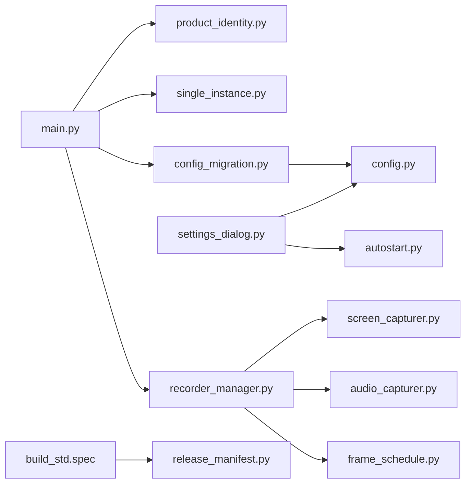

# QuickRec Lite v0.1 实施计划

> 本文承接 [prd.md](prd.md)。实施必须按阶段门禁推进；任一阶段失败，先修复或回退该阶段，不得带病进入下一阶段。

## 1. 目标与边界

**目标**：交付具备独立运行身份、安全配置迁移、原子设置事务、稳定四音频与全屏捕获、精简运行图和可复现发布链路的 QuickRec Lite v0.1。

**架构策略**：新增小型身份/版本/迁移边界，适配 Full 已验证的稳定性实现；保留现有 `QuickRecApp`、`RecorderManager`、PyQt 窗口和 FFmpeg pipe 架构，不做全量重写。

**明确不做**：PRD 非目标全部保持，不修改 `E:\codex\QuickRec`，不以包体积低于 200 MB 阻断发布。

## 2. 实施原则

1. 测试先行：身份、迁移、配置事务、帧调度和删除边界先补失败测试。
2. 小步验证：每个阶段运行受影响测试，关键阶段运行全量测试。
3. 数据保护：所有迁移测试使用隔离 APPDATA；真实 `%APPDATA%\QuickRec` 只在最终验收时做哈希只读核对。
4. 单向依赖：UI 调用身份/配置/录制服务，不把文件和注册表规则散落到窗口代码。
5. 候选包锁定：打包后记录 EXE、FFmpeg、ZIP 和 manifest 哈希；验收期间不混用不同构建。

## 3. 目标模块关系



## 4. 里程碑与实施顺序

### D0 文档、原型与基线冻结

**影响文件**：`doc/releases/lite-v0.1/**`、测试基线记录。

1. 固化 PRD、原型和开发承接文档。
2. 记录当前分支、HEAD、工作区已有文档变更和基线测试。
3. 证明 Full 工作区在实施前干净，后续只读核对。

**门禁**：原型浏览器验证通过；基线全量 pytest、Ruff、Mypy、Compileall 结果可追溯。

### D1 产品身份与版本事实源

**新增/修改**：

- 新增 `src/version.py`
- 新增 `src/utils/product_identity.py`
- 新增/适配 `src/utils/single_instance.py`
- 修改 `src/main.py`
- 修改 `src/ui/tray_icon.py`
- 修改 `src/utils/temp_cleaner.py`
- 修改 `src/utils/autostart.py`
- 修改 `build_std.spec`
- 新增 `tests/test_product_identity.py`
- 新增 `tests/test_single_instance.py`

**任务**：集中定义产品 ID、名称、APPDATA/TEMP/默认输出/注册表项；接入 Lite 单实例；所有标题和通知使用 Lite 身份；打包产物改名。

**测试**：身份常量、环境目录覆盖、Full/Lite ID 不同、第二实例提示、spec 身份静态测试。

### D2 原子配置与首次迁移

**新增/修改**：

- 重构 `src/config.py`
- 新增 `src/utils/config_migration.py`
- 新增 `src/ui/config_migration_dialog.py`
- 修改 `src/main.py`
- 修改 `src/ui/settings_dialog.py`
- 修改 `src/utils/autostart.py`
- 新增/更新 `tests/test_config.py`、`tests/test_config_migration.py`、`tests/test_settings_dialog.py`

**任务**：

1. 引入 `ConfigSaveResult`、候选快照、原子临时文件、`fsync`、`os.replace`。
2. 配置只保留 v0.1 正式字段，运行常量固定 native/60。
3. 实现迁移触发、白名单校验、导入/默认/取消、失败重试和幂等。
4. 设置页形成“校验 -> 注册表 -> 原子保存 -> 成功关闭”的事务。
5. 快捷键注册失败保留原绑定，不自动替代。

**故障注入**：mkdir、临时写、fsync、replace、注册表和快捷键注册失败。

### D3 音频稳定性回迁

**修改**：`src/recorder/audio_capturer.py`、`src/recorder/recorder_manager.py`、相关测试。

**任务**：默认设备 ID 优先匹配；双音频改为立体声 `amix`；使用共同起点对齐；保留四种 Lite 模式和失败反馈。

**测试**：设备 ID/名称回退、命令合同、延迟补偿、缺失设备、真实四音频候选包验收。

### D4 捕获、停止、帧调度与磁盘估算

**新增/修改**：

- 新增 `src/recorder/frame_schedule.py`
- 修改 `src/recorder/screen_capturer.py`
- 修改 `src/recorder/recorder_manager.py`
- 修改 `src/utils/disk_checker.py`
- 更新相关测试与 `scripts/hardware_smoke.py`

**任务**：统一目标帧计数；静态桌面复用最后有效帧；请求停止与有限等待；FPS 感知空间估算；不改变 native/60 合同。

**测试**：静态源、动态源、追帧边界、零帧、快速停止、连续录制、空间估算 30/60 比例（仅测试函数，不暴露 30 FPS UI）。

### D5 不可达代码分阶段删除

**修改/删除**：`src/main.py`、`src/ui/tray_icon.py`、`src/config.py`、`build_std.spec`、区域/窗口/倒计时/点击高亮专属模块与测试。

**顺序**：

1. 删除桥接、信号和用户 UI。
2. 移除 spec 和 packaging 预期。
3. 使用 `rg` 证明无引用后删除专属文件和内部分支。

**保护**：`toolbar.py`、通用录制状态、全屏共享捕获/编码/音频组件保留。

### D6 依赖、CI、manifest 与打包收口

**新增/修改**：

- 精确锁定 `requirements.txt`、`requirements-dev.txt`
- 修改 `.github/workflows/ci.yml`
- 修改 `build_std.spec`
- 新增 `scripts/release_manifest.py`
- 更新 packaging tests

**任务**：固定 FFmpeg 版本/哈希；CI 不再临时获取漂移 FFmpeg；生成 release manifest；验证 EXE、FFmpeg 和 ZIP 身份；记录包体积但不设 200 MB 阻断。

### D7 自动化与候选包验证

执行：

```powershell
python -m pytest -q
python -m coverage report
python -m ruff check .
python -m mypy
python -m compileall src scripts tests
git diff --check
python -m pytest -m packaging -q
python -m PyInstaller build_std.spec --clean --noconfirm --distpath E:\QRtest\QuickRec-Lite-v0.1-dist --workpath E:\QRtest\QuickRec-Lite-v0.1-build
```

额外检查：FFmpeg SHA256、EXE 启动、manifest 字段、包内无区域/窗口专属模块、QuickRec Full 工作区仍干净。

### D8 GUI/硬件验收与发布文档

**新增/修改**：`manual-verification.md`、`verification.md`、`release-notes.md`、`progress.md`、README/current（仅在事实成立后）。

**真实验收**：

- Full/Lite 同时运行、第二 Lite 实例。
- 迁移导入/默认/取消/损坏/写入失败。
- 设置保存、快捷键冲突、注册表回滚。
- 全屏四音频、静态桌面、快速停止、连续录制。
- 通知、托盘、结果条、默认输出和身份文案。

只有所有发布阻塞项通过，才将文档状态更新为“候选发布包验收通过”。本计划不授权 commit、push、tag 或 Release。

## 5. 测试矩阵

| 模块 | 单元 | 集成 | GUI/硬件 | Packaging |
| --- | --- | --- | --- | --- |
| 身份与版本 | 是 | 双产品 ID | 双进程/通知 | EXE/目录名 |
| 迁移与配置 | 是 | 隔离 APPDATA | 对话框/注册表 | 默认路径 |
| 快捷键 | 是 | registrar adapter | 冲突实测 | 打包注册 |
| 音频 | 命令/设备匹配 | FFmpeg 混音 | 四模式听测 | 包内 FFmpeg |
| 捕获 | 帧调度/停止 | 受控 capture | 静态/快速停止 | 真实 DXGI |
| 删除治理 | 引用测试 | 全量回归 | 入口不可达 | 模块不存在 |

## 6. 风险与回退

- 身份/迁移：若旧数据保护不成立，停止 D2；不得继续 GUI 验收。
- 音频：每个回迁点可独立回退，不回退已验证身份与配置。
- 捕获：静态回退、停止、调度分别提交/验证，避免整体回退。
- 删除：任一共享引用无法消除时停在隔离边界，不强删。
- 打包：新 spec 不可用时保留代码验证结果，回退到最近可启动 spec 后重新定位差异。

## 7. 完成定义

- PRD 全部发布阻塞标准有真实证据。
- `progress.md` 的 D0-D8 必须项全部完成。
- 自动化、静态、packaging 和候选包硬件验收通过。
- Full 工作区和真实 Full 配置未被修改。
- 版本、EXE、FFmpeg、ZIP 与 manifest 身份一致。
- README/current/release notes 与最终事实一致。
