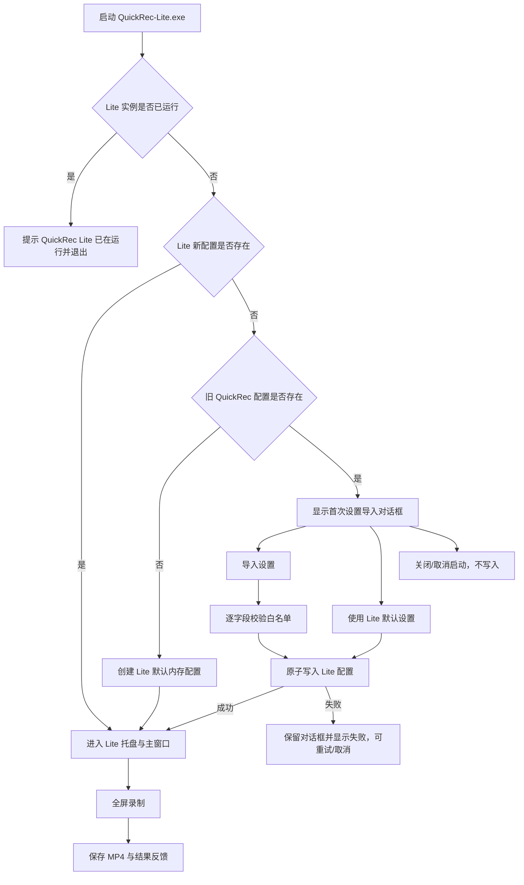
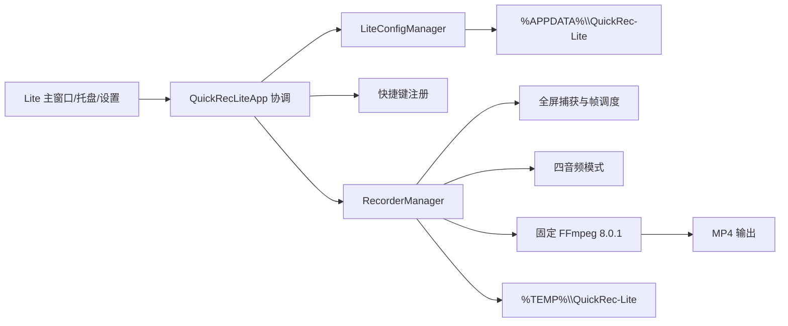
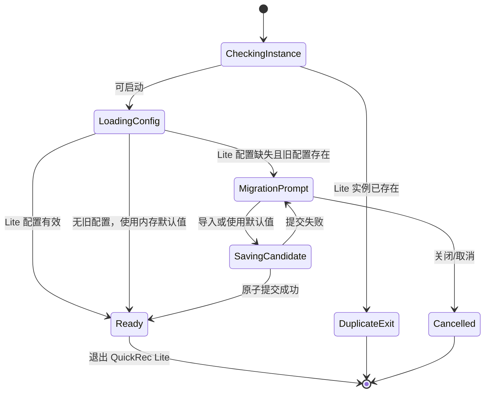
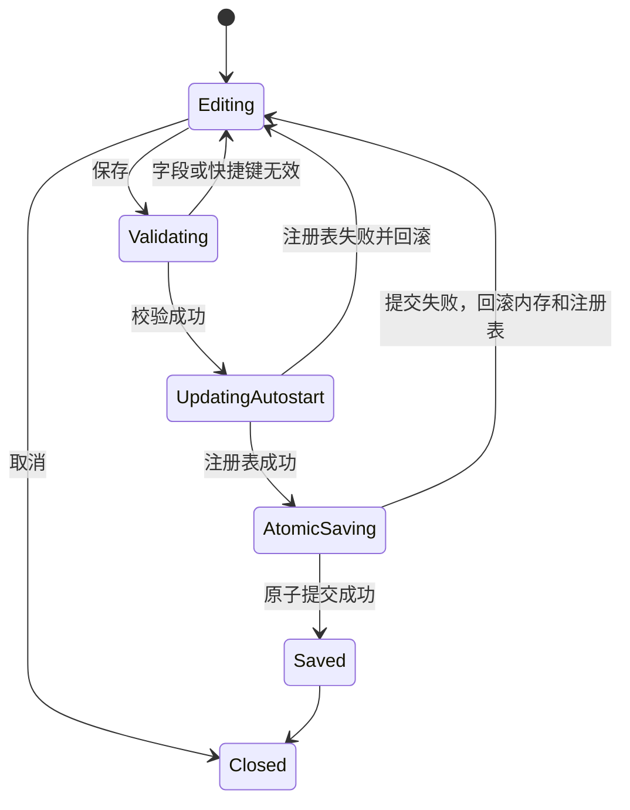

# 入口判断：/prd

# QuickRec Lite v0.1 PRD：运行身份隔离与稳定性收口

## 追踪信息

- 当前状态：完整可开发 / 已获进入开发授权
- 目标版本：QuickRec Lite v0.1
- 上游来源：`doc/archive/ideas/mypm-idea-pool-lite-v0.1-2026-08-11.md`
- 下游承接：`doc/releases/lite-v0.1/dev_plan.md`、`doc/releases/lite-v0.1/progress.md`
- 当前事实源：`README.md`、`doc/current.md`、`doc/releases/lite-v0/`
- 开发基线：`lite-test@11874bf`
- 版本标签建议：`lite-v0.1`
- 最后更新：2026-08-11

## 需求状态

- PRD 类型：正式推进型
- 需求来源：Lite/Full 拆分后工程 Review、v0.1 需求池和本轮逐项确认
- 证据基础：本地代码、Full 已发布稳定性实现、Lite v0 自动化基线及 Windows 发布链路
- 当前假设：Lite 继续只承接全屏录制，不因稳定性回迁扩大产品心智
- 待确认问题：无产品定义阻塞；真实声卡、静态桌面和双产品并行运行留待候选包验收
- 是否达到完整 PRD 门禁：是

## 1. 版本定位

QuickRec Lite v0.1 是 Lite 第一轮独立身份与稳定性收口版本，不是功能扩张版本。它解决 Lite 与 Full 同机运行时仍共享名称、目录、配置、通知、开机启动和快捷键状态的问题，并从 Full 白名单回迁不会增加用户复杂度的录制稳定性能力。

本版本只有一条产品主线：**让 QuickRec Lite 成为可与 QuickRec Full 同时安装、同时运行、互不覆盖数据的独立 Windows 产品。**

### 1.1 成功定义

1. `QuickRec-Lite.exe` 使用独立产品身份运行，Full 与 Lite 可同时驻留。
2. Lite 只读旧配置中的白名单字段，并只向 `%APPDATA%\QuickRec-Lite` 写入新配置。
3. 配置保存失败不再假成功，内存、磁盘和开机启动状态保持一致。
4. 四种音频、静态桌面、快速停止和固定 60 FPS 全屏录制在候选包中通过。
5. 区域/窗口/倒计时/点击高亮专属代码退出 Lite 运行图和打包图。
6. 发布包、FFmpeg、依赖、版本和哈希均可复现并由 release manifest 描述。

### 1.2 优先级

| 范围 | 优先级 | 进入 v0.1 | 理由 |
| --- | --- | --- | --- |
| Full/Lite 运行身份隔离 | P0 | 是 | 数据安全和同机共存的前置条件 |
| 原子配置与迁移事务 | P0 | 是 | 防止设置假成功和迁移半完成 |
| 音频/捕获稳定性白名单回迁 | P0 | 是 | 直接保护 Lite 核心录制结果 |
| 不可达代码分阶段删除 | P1 | 是 | 收敛运行图和维护面 |
| 可复现打包与质量门禁 | P1 | 是 | 固定候选包事实 |
| 30/60 FPS 选择、1080p 预设 | P2 | 否 | 会改变 Lite 的产品合同 |
| 用户可见诊断中心 | P2 | 否 | 会扩大产品表面 |

## 2. 背景与问题

Lite 已在界面上裁剪为全屏录制，但运行身份仍沿用 Full：配置写入 `%APPDATA%\QuickRec`，临时目录使用 `%TEMP%\QuickRec`，注册表启动项和通知仍叫 QuickRec，打包产物仍为 `QuickRec.exe`。这会造成同机部署时的单实例误判、配置覆盖、通知混淆、快捷键争用和错误启动项。

同时，Lite 仍使用早期配置、音频、捕获停止和帧调度实现，并将区域/窗口相关模块打入包内。其用户界面已经轻量化，工程边界却尚未真正轻量化。

## 3. 目标与非目标

### 3.1 目标

- 建立独立的产品 ID、进程名、包名、配置、临时目录、开机启动项、通知和版本事实源。
- 提供安全、可取消、可重试、无破坏性的旧配置白名单导入。
- 配置采用原子保存，设置页保存失败时不关闭且不改变有效配置。
- 回迁经过 Full 正式版本验证的音频、捕获和帧交付稳定性能力。
- 删除 Lite 用户永远不可达的区域/窗口/倒计时/点击高亮专属链路。
- 固定 FFmpeg 和依赖，建立 Lite 独立 CI、打包、manifest 和验收门禁。

### 3.2 明确非目标

- 不提供 30/60 FPS 选择；继续固定 60 FPS。
- 不提供 1080p 预设；继续使用原生分辨率。
- 不提供用户可见诊断入口或 Full 诊断中心。
- 不提供工作台、素材库、项目、时间线、剪辑或导出队列。
- 不提供区域录制、窗口录制、倒计时或鼠标点击高亮。
- 不提供 120 FPS、高刷新率、WGC、AI、云同步。
- 不修改 QuickRec Full 的代码、配置、文档或发布产物。
- 产物低于 200 MB 是优化观察项，不是发布阻断条件。

## 4. 用户、场景与业务不变量

### 4.1 目标用户与场景

| 用户 | 场景 | 期望 |
| --- | --- | --- |
| 只需要快速全屏录制的用户 | 安装 Lite 后直接使用 | 不接触 Full 工作台概念 |
| 同时保留 Full 与 Lite 的用户 | 两者同时启动并分别录制 | 配置、进程和通知互不影响 |
| 从旧 Lite/拆分前版本升级的用户 | 第一次运行 v0.1 | 可选择导入少量安全设置或使用默认值 |
| 设置写入失败的用户 | 目录只读、磁盘异常或注册表失败 | 明确失败，不丢失原设置 |

### 4.2 业务不变量

1. Lite 不移动、不删除、不覆盖 `%APPDATA%\QuickRec` 下的任何 Full/旧版数据。
2. 迁移仅复制 `save_path` 和 `audio_source`；快捷键与开机启动永不自动迁移。
3. 迁移和设置保存要么完整成功，要么对有效状态零副作用。
4. 视频已经保存成功时，后续音频混合、通知或状态反馈不得删除原视频。
5. Lite 只提供全屏录制，区域/窗口能力不得通过隐藏入口、快捷键或旧配置重新可达。
6. Full 与 Lite 可以同时运行；同一产品自身保持单实例。

## 5. 信息架构与完整链路

## 6. 功能需求

### FR-01 独立运行身份

- EXE/进程名：`QuickRec-Lite.exe`。
- 用户可见名称：`QuickRec Lite`。
- 产品 ID/单实例互斥 ID：`QuickRec.Lite`。
- 配置目录：`%APPDATA%\QuickRec-Lite`。
- 临时目录：`%TEMP%\QuickRec-Lite`。
- 默认输出目录：`%USERPROFILE%\Videos\QuickRec Lite`。
- 开机启动项名称：`QuickRec Lite`，命令必须指向 Lite EXE。
- 通知标题和 App ID 使用 Lite 身份，不得继续显示为 Full。
- 版本唯一事实源：`src/version.py` 中的 `APP_VERSION = "v0.1"`。
- PyInstaller 输出：`dist\QuickRec-Lite\QuickRec-Lite.exe`。
- 发布压缩包：`QuickRec-Lite-v0.1-win-x64.zip`。

**重复实例流程**：第二个 Lite 进程检测到 `QuickRec.Lite` 已占用后，展示“QuickRec Lite 已在运行”，然后退出；不得终止或激活 Full。Full 正在运行不阻止 Lite 启动。

### FR-02 首次安全配置迁移

#### 入口与触发

仅在下列条件同时成立时展示迁移对话框：

1. `%APPDATA%\QuickRec-Lite\config.json` 不存在；
2. `%APPDATA%\QuickRec\config.json` 存在；
3. 当前进程尚未创建 Lite 配置。

#### 用户操作

| 操作 | 结果 | 写入 |
| --- | --- | --- |
| 导入设置 | 读取旧配置，只校验并复制 `save_path`、`audio_source` | 原子写入新 Lite 配置 |
| 使用 Lite 默认设置 | 使用 Lite 默认保存目录和无声音频 | 原子写入新 Lite 配置 |
| 关闭窗口/取消 | 取消本次启动 | 不创建目录、不写配置、不改旧文件 |

#### 字段规则

- `save_path`：必须为非空字符串；路径不要求已经存在，但父路径语义必须可解析。无效则回退 Lite 默认目录并在结果区说明。
- `audio_source`：只允许 `none`、`system`、`microphone`、`both`。无效则回退 `none` 并说明。
- `shortcut_start`、`shortcut_stop`、`shortcut_pause`：不迁移，使用 Lite 新默认值。
- `auto_start`：不迁移，固定为关闭。
- 未知字段：忽略，不复制。

#### 安全与幂等

- 读取旧文件失败时不得改写旧文件，允许用户使用 Lite 默认设置或取消。
- 原子写入失败时对话框保持打开，显示可理解错误，用户可重试或取消。
- 只有新配置成功提交后才进入应用。
- 新配置一旦存在，后续启动不再读取或合并旧配置。
- 回滚 Lite v0 时，新旧配置同时保留；不执行反向迁移。

### FR-03 原子配置保存与设置事务

- `ConfigManager.save()` 返回结构化结果，不吞掉异常。
- 使用同目录临时文件、刷新缓冲、`fsync` 和 `os.replace` 原子提交。
- 临时文件命名可识别为 Lite 配置候选，失败后尽力清理。
- 设置页先构造候选配置并校验快捷键，再更新注册表，最后提交配置。
- 任一步失败时恢复原内存配置；若注册表已变更，回滚原开机启动状态。
- 保存失败时设置页保持打开，显示失败原因，不发出成功信号。
- 取消设置不改变内存、磁盘或注册表。

### FR-04 快捷键隔离与冲突处理

- 默认快捷键：开始 `Ctrl+Alt+R`、停止 `Ctrl+Alt+S`、暂停/继续 `Ctrl+Alt+P`。
- Lite 只注册这三个快捷键。
- 用户输入冲突或系统注册失败时：
  - 拒绝该候选值；
  - 保留原有效绑定；
  - 显示明确提示；
  - 其他设置和应用功能仍可使用。
- 不自动寻找替代组合，不静默覆盖 Full 或其他应用。
- 录制中的禁用规则沿用当前状态机：开始不可用，停止和暂停/继续可用。

### FR-05 音频稳定性白名单回迁

- 系统声音优先使用系统默认扬声器设备 ID 匹配 loopback，不以易变显示名称作为唯一条件。
- 设备 ID 不可用时允许受控名称回退，并记录不含敏感信息的原因。
- 双音频使用立体声 `amix`，不使用导致声道并排的 `amerge`。
- 系统声和麦克风按共同录制起点进行时间对齐。
- 四种模式均保持 Lite 原有入口和配置值，不新增高级音频参数。
- 某一音频源初始化失败时不得把无音频视频误报为完整成功；反馈与日志需指出缺失来源，同时保护已生成视频。

### FR-06 捕获停止、静态桌面与帧调度

- 固定全屏、固定 60 FPS、原生分辨率的产品合同不变。
- 捕获循环使用统一目标帧调度，追帧后不得无条件多提交一帧。
- 静态桌面没有新 DXGI 帧时，使用受控首帧/最后有效帧维持可编码输出。
- 停止操作采用请求停止与有限等待，不在 UI 主线程无限阻塞。
- 快速停止、连续开始/停止和退出时释放相机、线程和 FFmpeg 管道。
- 磁盘估算必须感知 60 FPS，不再忽略传入 FPS。

### FR-07 不可达代码分阶段删除

按以下顺序执行并逐阶段回归：

1. 删除 `main.py`、托盘和快捷键中的区域/窗口/倒计时/点击高亮桥接与专属 UI。
2. 从 PyInstaller hidden imports、数据和打包检查中移除专属模块。
3. 删除不再被全屏共享链路引用的内部模式分支、配置键和专属测试。

最终要求：

- 区域/窗口快捷键不能从旧配置恢复。
- 包内不再包含专属 UI 模块。
- 全屏共享组件保留，禁止借机重写整个录制架构。
- 每阶段若发现共享依赖，先收窄边界并补测试，不做破坏性删除。

### FR-08 可复现发布

- 固定 FFmpeg：`8.0.1-essentials_build-www.gyan.dev`。
- 发布允许的 `ffmpeg.exe` SHA256：`5AF82A0D4FE2B9EAE211B967332EA97EDFC51C6B328CA35B827E73EAC560DC0D`。
- 版本或哈希不一致时阻止候选包发布。
- 运行依赖和开发门禁工具采用精确版本；依赖升级使用独立治理提交。
- release manifest 至少包含版本、commit、构建时间、Python、依赖锁、EXE、FFmpeg、ZIP 哈希和包大小。
- `lite-master`、`lite-test`、PR 与 `lite-v*` tag 执行独立 CI；稳定/测试/tag 执行 packaging smoke。

## 7. 状态模型

### 7.1 启动与迁移状态

### 7.2 配置保存状态

## 8. 数据、配置与兼容

### 8.1 Lite 配置字段

| 字段 | 默认值 | 用户可见 | 兼容规则 |
| --- | --- | --- | --- |
| `save_path` | `Videos\QuickRec Lite` | 是 | 可从旧配置白名单导入 |
| `audio_source` | `none` | 是 | 可从旧配置白名单导入 |
| `shortcut_start` | `Ctrl+Alt+R` | 是 | 不迁移 |
| `shortcut_stop` | `Ctrl+Alt+S` | 是 | 不迁移 |
| `shortcut_pause` | `Ctrl+Alt+P` | 是 | 不迁移 |
| `auto_start` | `false` | 是 | 不迁移 |
| `quality` | `native` | 否 | 固定运行常量，不进入设置 UI |
| `fps` | `60` | 否 | 固定运行常量，不进入设置 UI |

区域/窗口快捷键、倒计时、点击高亮等旧字段不进入 Lite v0.1 正式配置。读取历史 Lite 配置时忽略这些字段，保存时不再输出。

### 8.2 文件与注册表

| 对象 | 路径/名称 | 保护规则 |
| --- | --- | --- |
| 新配置 | `%APPDATA%\QuickRec-Lite\config.json` | 原子提交 |
| 旧配置 | `%APPDATA%\QuickRec\config.json` | 只读白名单来源 |
| 临时录制 | `%TEMP%\QuickRec-Lite` | 只清理 Lite 自己的会话 |
| 开机启动 | `HKCU\...\Run\QuickRec Lite` | 不读写 Full 的 `QuickRec` 项 |
| 默认视频 | `%USERPROFILE%\Videos\QuickRec Lite` | 不移动历史视频 |

## 9. UI 与交互要求

### 9.1 首次迁移对话框

- 标题必须显示 QuickRec Lite v0.1。
- 清楚说明只复制保存路径和音频模式，旧数据保持不变。
- 主操作“导入设置”，次操作“使用 Lite 默认设置”，关闭按钮等于取消启动。
- 校验回退应逐字段列出，例如“旧音频模式无效，已使用无声”。
- 保存失败显示失败原因、重试和取消，不跳转主界面。

### 9.2 设置页

- 继续只显示保存路径、音频源、三个快捷键和开机自启。
- 保存、取消、失败反馈和快捷键冲突反馈必须就近出现。
- 不出现 Full 升级广告、诊断中心或被裁剪能力的占位。

### 9.3 身份反馈

- 托盘、窗口标题、通知和关于版本均显示 `QuickRec Lite` / `v0.1`。
- 重复实例提示不使用模糊的“QuickRec 已运行”。

## 10. 需求表达物与原型门禁

- 需求类型：UI/交互、状态/异步、配置迁移、工程治理
- 表达模式：高保真交互式 HTML、状态机、数据流图、影响矩阵
- 文件路径：`doc/releases/lite-v0.1/prototype/index.html`
- 覆盖范围：首次迁移、默认启动、取消、迁移失败、设置保存失败、快捷键冲突、重复实例和身份反馈
- 模拟边界：浏览器原型只模拟状态，不实际操作注册表、互斥锁、APPDATA 或配置文件

| 原型交付门禁 | 本轮要求 |
| --- | --- |
| 交付文件 | `doc/releases/lite-v0.1/prototype/index.html` 与 `prototype-design.md` |
| 状态与出口 | 覆盖成功、失败、取消、关闭、冲突、禁用、重试和进入主界面 |
| 模拟边界 | 所有文件、注册表、快捷键和单实例操作均为可识别的模拟，不作为实现证据 |
| 浏览器验证 | 桌面与窄视口可用；关键按钮可切换状态；控制台无脚本错误 |
| 结论回写 | 验证结果回写 `prototype-design.md`，通过后进入 PyQt 实现 |

## 11. 影响范围

- 前端/UI：迁移对话框、设置页失败/冲突状态、Lite 身份文案、重复实例提示。
- 前端状态：迁移状态、配置事务状态、录制停止状态。
- 后端/API：不涉及网络 API；新增内部结构化保存结果与身份服务。
- 数据库：不涉及。
- 配置与环境：独立 APPDATA/TEMP、版本事实、默认路径、快捷键、注册表。
- 日志与指标：保留本地日志；补启动身份、迁移结果、音频选择、停止与帧调度语义日志，不新增用户可见入口。
- 权限与安全：只读旧配置；原子写入新配置；不记录完整环境变量或不必要隐私路径。
- 文件与存储：Lite 配置、临时会话、默认输出、固定 FFmpeg 和 release manifest。
- 第三方依赖：固定 Python 依赖与 FFmpeg，不引入新产品依赖。
- 既有体验保护：全屏、四音频、暂停/继续/停止、结果条、托盘与设置保持。
- 测试与验收：自动化、真实硬件、双产品并行、故障注入、packaging 和 release manifest。

## 12. 日志与可观察性

至少记录以下事件，日志内容不得泄露完整环境变量或硬件序列号：

- Lite 版本、产品 ID、源码/打包环境。
- 单实例获取成功/失败。
- 迁移是否触发、用户选择、字段回退、原子提交结果。
- 设置保存阶段和失败阶段；快捷键冲突类型。
- 默认系统声设备匹配方式、双音频混合开始/结束。
- 捕获开始、静态帧回退、停止请求、线程退出、实际帧数/FPS。
- FFmpeg 路径、版本校验结果和编码退出状态。

## 13. 验收目标与标准

### 13.1 自动化门禁

1. 全量 pytest 通过，总覆盖率不低于 80%。
2. 新增身份、迁移、原子配置和帧调度核心模块覆盖率不低于 85%。
3. 受影响 UI/协调模块覆盖率不低于 80%。
4. Ruff、Mypy、Compileall、`git diff --check` 和 UTF-8/乱码检查通过。
5. Packaging 测试确认 `QuickRec-Lite.exe`、固定 FFmpeg、版本和 manifest。

### 13.2 迁移与配置验收

- 无旧配置：不展示迁移对话框，默认值正确。
- 有旧配置：导入/默认/取消三条路径符合合同。
- 无效白名单字段：只回退该字段，并给出反馈。
- 旧文件损坏/不可读：不修改旧文件，可选择默认或取消。
- 新配置写入失败：不进入主界面、不留半成品，可重试。
- 设置保存失败：窗口不关闭，内存/磁盘/注册表回滚。

### 13.3 Windows 与候选包验收

- Full 和 Lite 同时运行，两个进程、配置、临时目录、启动项、通知互不覆盖。
- 第二个 Lite 实例明确提示并退出。
- 候选包完成全屏无声、系统声、麦克风、双音频录制。
- 静态桌面至少 10 秒、录制后 1 秒内快速停止、连续 5 次录制均可保存。
- 音视频文件由包内 FFprobe/FFmpeg 或系统播放器验证可解析。
- 固定 FFmpeg 版本与 SHA256、EXE 和 ZIP 哈希进入 manifest。

### 13.4 发布阻塞条件

以下任一项失败则不得发布 Lite v0.1：

- Full 数据被移动、删除、覆盖或注册表项被篡改。
- Full 与 Lite 不能同时运行，或两者互相误判重复实例。
- 配置失败仍显示成功或产生半写入文件。
- 任一四音频模式在具备对应硬件的验收环境中无法正常录制。
- 静态桌面、快速停止或固定 60 FPS 链路出现零帧、卡死或不可播放文件。
- 区域/窗口入口仍可达，或候选包身份仍为 QuickRec Full。
- FFmpeg 版本/哈希不一致或 release manifest 缺失。

包体积超过 200 MB 不阻断，但必须记录体积和主要构成。

## 14. 关键测试接缝

| 验收标准 | 可观察结果 | 接口/故障注入点 | 证据 |
| --- | --- | --- | --- |
| 旧配置只读 | 旧文件哈希和时间不变 | 可注入旧/新 APPDATA 根目录 | 前后哈希 |
| 原子保存零副作用 | 失败后原配置内容不变 | 临时写入、fsync、replace 故障注入 | 测试和日志 |
| 注册表事务回滚 | 保存失败后启动项恢复 | 可替换 autostart adapter | 注册表快照 |
| 快捷键冲突保留原绑定 | 原快捷键仍可触发 | 可替换 hotkey registrar | GUI/单测 |
| 静态桌面可录制 | 输出有持续视频流 | capture source / last-frame seam | FFprobe、MP4 |
| 非阻塞停止 | UI 不冻结、线程退出 | request_stop + timeout | 时间戳、线程状态 |
| 双音频正确 | 立体声音轨且可听 | audio sources / mix command | FFprobe、听测 |
| 固定发布身份 | 包和 manifest 一致 | packaging manifest builder | 哈希、版本输出 |

## 15. 风险、回滚与不通过处理

| 风险 | 影响 | 控制 |
| --- | --- | --- |
| 迁移误读 Full 配置 | 用户状态污染 | 严格白名单、只读、哈希前后核对 |
| 注册表与配置事务不一致 | 开机启动失效 | adapter + 回滚测试 + GUI 验收 |
| 音频设备差异 | 某模式失败 | ID 优先、受控回退、四模式实测 |
| 捕获回迁造成黑帧或停止卡住 | 核心录制不可用 | 每项独立回迁、硬件 smoke、可单项回滚 |
| 删除代码误伤共享链路 | 全屏回归 | 三阶段删除与每阶段完整测试 |
| 固定依赖改变包兼容性 | 候选包启动失败 | packaging smoke 和独立验收包 |

回滚策略：

- 代码回滚到 `lite-v0` 或 v0.1 前治理基线，不移动 `lite-v0` tag。
- 回滚不删除 `%APPDATA%\QuickRec-Lite`，以便后续版本继续使用。
- 旧 `%APPDATA%\QuickRec` 和历史视频始终保留。
- 每个稳定性回迁采用独立可逆提交边界；单项失败不要求回滚其他已验证项。

## 16. 验证层级与门禁时点

- 选择层级：L0 静态、L1 Agent 自动化、L2 真实 Windows GUI/硬件、L4 发布后观察。
- 选择理由：身份、注册表、音频、DXGI 和候选包行为不能仅靠模拟证明。
- 阻塞范围：L0/L1 阻塞打包，L2 阻塞正式发布。
- Agent 模拟证据边界：原型和 mock 只能证明合同与状态，不证明真实互斥锁、声卡、注册表或捕获行为。
- 进入开发授权：已获得。

## 17. 完整 PRD 门禁检查

- [x] 完整入口到出口链路已写清。
- [x] 保存、取消、关闭、失败、无变化、重试、异常反馈已写清。
- [x] 影响范围覆盖 UI、后端、配置、日志、权限、测试和发布。
- [x] 数据来源与配置字段已写清。
- [x] UI/交互需求要求输出高保真原型。
- [x] 承重假设已转化为硬件与候选包门禁。
- [x] 领域词汇、关键决策和测试接缝已对齐。
- [x] 开发前验收目标与通过标准已写清。
- [x] 非目标和范围保护已写清。
- [x] 可以进入开发承接。

## 18. 下一阶段建议

- 推荐下一步：完成原型浏览器验证后，生成 `dev_plan.md` 与 `progress.md`，按身份与迁移优先实施。
- 需要准备的材料：现有 Full/旧配置的受控副本、四音频设备、固定 FFmpeg 和独立验收目录。
- 开发顺序：身份常量与版本 -> 原子配置/迁移 -> 单实例/快捷键 -> 音频 -> 捕获 -> 删除不可达代码 -> 依赖/打包/验收。
