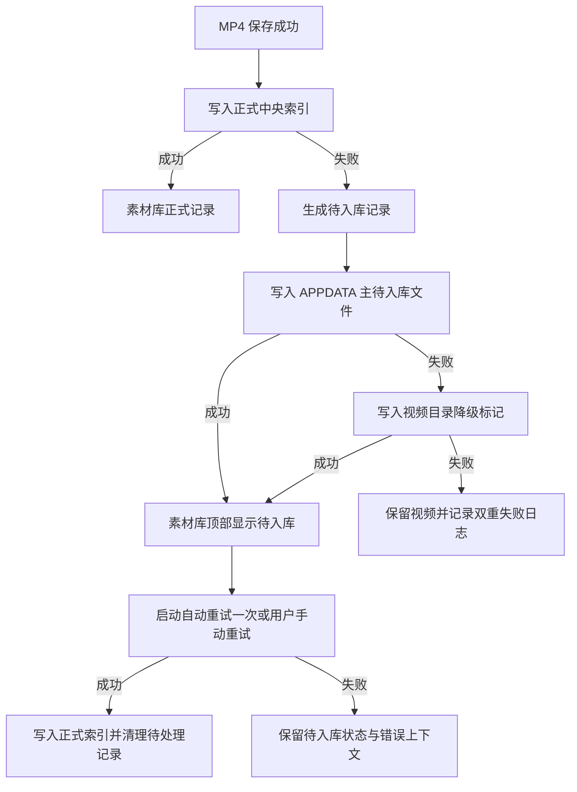
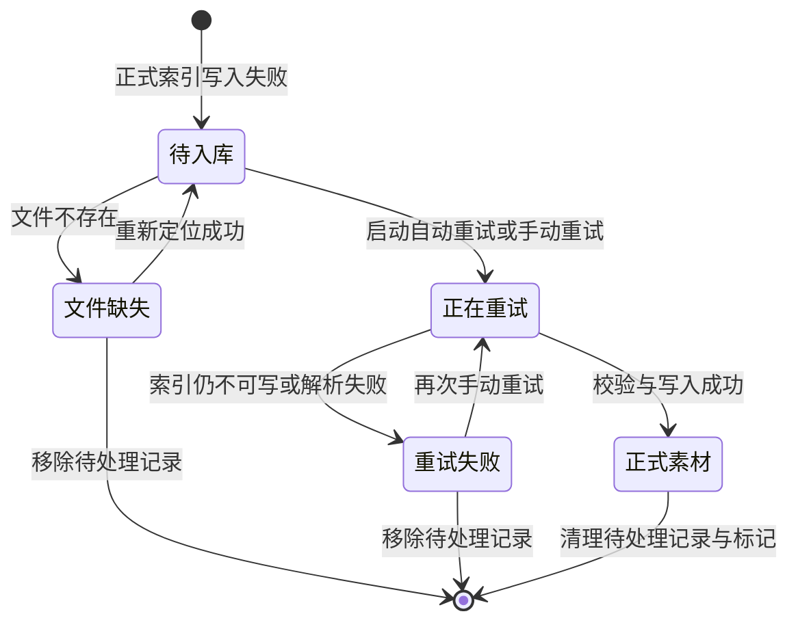

# QuickRec Full v1.6.1 待入库恢复能力 PRD

> 版本：v1.6.1  
> 类型：正式推进型 PRD  
> 状态：需求已确认，待开发承接  
> 产品线：QuickRec Full  
> 上游需求：`IDEA-001`  
> 来源：`doc/archive/ideas/mypm-idea-pool-post-v1.6-2026-07-15.md`  
> 依赖版本：QuickRec Full v1.6  
> 原型：`doc/prototypes/product-prototype/full.html`  
> 进入开发授权：已获得（2026-07-15）

## 1. 需求状态

### 1.1 类型判断

本需求为**正式推进型 PRD**，不是技术原型或方案收敛稿。

判断依据：

- v1.6 已具备中央素材索引、素材库、重建、重新定位和录制后自动入库能力。
- 录制视频保存成功、中央索引写入失败时，当前仅有结果条中的短时“重试入库”入口。
- 结果条会自动关闭，应用重启后也没有持久恢复入口，用户可能得到完整 MP4，却无法在素材库中找到它。
- 问题已有真实开发和验收上下文支撑，范围可收敛为持久待入库记录与恢复闭环。
- 用户已确认数据位置、发现范围、重试策略、容量、状态展示和非目标。

### 1.2 版本定位

v1.6.1 是 QuickRec Full v1.6 的可靠性补丁版本。它不扩展素材管理广度，而是补齐“视频已经保存，但素材索引暂时失败”后的持久恢复能力。

本版唯一产品主线：

> 让每一个已经成功保存、但尚未进入中央索引的录制，在应用重启后仍然可发现、可重试、可重新定位、可移除待处理记录。

工程支撑仅包含：

1. 从 `QuickRecApp` 中最小拆出录制后入库协调职责。
2. 对新增和修改模块扩大 ruff、mypy 与覆盖率门禁。

### 1.3 已确认决策

| 决策项 | 结论 |
| --- | --- |
| 主存储 | `%APPDATA%\QuickRec\pending-recordings.json` |
| 降级存储 | 视频目录下 `QuickRecMetadata\Pending\<pending_id>.json` |
| 采用原因 | APPDATA 写入失败时仍需留下可恢复标记；不能依赖已经失败的中央索引 |
| 自动发现范围 | 启动时只读取主存储，并扫描当前保存目录的降级标记 |
| 手动发现范围 | 手动导入或目录重建时扫描用户所选目录的降级标记 |
| 全盘扫描 | 不做 |
| 自动重试 | 每次应用启动后延迟执行一次，不周期轮询 |
| 手动重试 | 素材库待入库项和录制结果条均可触发 |
| UI 位置 | 待入库项置于现有素材库列表顶部，不新增恢复中心 |
| 缺失文件 | 标记缺失，允许重新定位或仅移除待处理记录 |
| 待入库上限 | 独立最多 200 条，不按时间自动删除 |
| 正式素材上限 | 仍为 200 条；待入库不占正式素材名额 |
| 超限策略 | 淘汰最旧待处理元数据，不删除视频，并写入警告日志 |
| 成功后处理 | 写入正式索引成功后清理主记录和降级标记 |
| 适用来源 | 仅覆盖新录制自动入库失败 |
| 不纳入来源 | 历史迁移、手动导入、目录重建、重新定位沿用 v1.6 既有结果处理 |
| 启动反馈 | 有恢复成功时汇总提示“已恢复 N 条”；仍失败时不弹窗，只保留数量与日志 |
| 原型 | 更新现有 Full 高保真原型，不建立第二套事实源 |

## 2. 背景与问题

### 2.1 当前链路

v1.6 的录制完成链路为：


现有链路正确保护了视频文件：中央索引失败不会改写“视频保存成功”的事实。但失败上下文只存在于当前进程和短时结果条，缺少跨重启恢复能力。

### 2.2 用户问题

1. 用户看到“录制已保存”，但素材库中没有对应记录。
2. 结果条关闭后，用户不知道哪一个视频尚未入库。
3. 应用重启后，失败状态和重试入口消失。
4. 如果视频随后被移动，原失败上下文无法引导用户重新定位。
5. APPDATA 或中央索引不可写时，单一中央存储无法承担恢复记录。

### 2.3 根本约束

- 视频保存结果与素材入库结果必须继续解耦。
- 恢复记录不能写进可能已经失败的正式素材索引。
- APPDATA 也可能不可写，因此需要视频目录旁路标记。
- 不允许通过扫描全部历史目录或全盘来弥补记录缺失。
- 不引入数据库、后台守护进程或复杂任务中心。

## 3. 目标与非目标

### 3.1 产品目标

1. 新录制自动入库失败后，持久保存最小恢复上下文。
2. 应用重启后，用户能在素材库顶部看到待入库项。
3. 在故障恢复后，系统可自动重试一次，用户也可随时手动重试。
4. 视频移动或删除后，用户能重新定位或移除待处理记录。
5. 任一恢复链路失败都不得删除、覆盖或错误报告已保存的视频。

### 3.2 成功指标

| 指标 | 通过标准 |
| --- | --- |
| 恢复可发现性 | 受控入库失败后重启，待入库项仍可见 |
| 视频安全 | 所有索引和恢复失败场景中 MP4 均保持可播放 |
| 自动恢复 | 故障解除后，下次启动的一次自动重试可完成入库 |
| 手动恢复 | 待入库项可重试，成功后仅生成一条正式素材记录 |
| 幂等性 | 多次启动、重复发现和重复重试不产生重复素材或重复待处理项 |
| 容量边界 | 待入库最多 200 条，淘汰记录不删除视频 |
| 工程质量 | 新增核心模块覆盖率不低于 80%，ruff 与 mypy 通过 |

### 3.3 非目标

- 不做 SQLite、云同步或跨设备同步。
- 不做复杂诊断中心、恢复中心或常驻后台队列。
- 不做定时轮询、指数退避或无限自动重试。
- 不把历史迁移、手动导入、目录重建和重新定位失败统一改造成待入库任务。
- 不做素材搜索、筛选、标签、分类或完整工作台。
- 不做剪辑、导出队列、AI 字幕、摘要、章节和标签。
- 不做 WGC、120 FPS 或多显示器正式支持。
- 不全面重写 `QuickRecApp`、`RecorderManager` 或录制核心。
- 不修改 QuickRec Lite。

## 4. 方案收敛

### 4.1 候选方案

| 方案 | 优点 | 缺点 | 结论 |
| --- | --- | --- | --- |
| 写入正式中央索引并增加失败状态 | 数据集中，UI 查询简单 | 正式索引本身就是失败点，无法承担自身故障恢复 | 不采用 |
| 只使用 APPDATA 独立待入库文件 | 结构清晰，容易统一展示 | APPDATA 不可写时没有持久证据 | 不采用 |
| APPDATA 主记录 + 视频目录降级标记 | 同时覆盖中央索引失败和 APPDATA 失败，视频旁存在最小恢复证据 | 需要去重、发现范围和清理规则 | 采用 |

### 4.2 采用方案



## 5. 用户与场景

### 5.1 目标用户

- 使用 QuickRec Full 连续录制并依赖素材库管理结果的个人创作者。
- 在保存目录、权限、文件占用或索引异常环境下仍需要确保视频可找回的用户。

### 5.2 核心场景

#### 场景 A：录制后中央索引暂时失败

用户完成录制，MP4 保存成功，但中央索引写入失败。结果条明确提示“视频已保存，等待加入素材库”，并提供短时重试；素材库顶部出现待入库记录。

#### 场景 B：应用重启后自动恢复

用户修复权限并重启 QuickRec。应用加载完成后对每条待入库记录自动重试一次，成功项进入正式素材列表，并汇总提示“已恢复 N 条录制”。

#### 场景 C：故障仍存在

启动自动重试仍失败时，不连续弹窗。素材库入口显示待入库数量，详情保留最近失败原因和手动重试操作，日志记录可诊断上下文。

#### 场景 D：视频已移动

待入库视频已被用户移动。素材库将其标记为缺失，用户可重新定位到正确文件；验证成功后再重试入库。

#### 场景 E：APPDATA 也不可写

系统无法写入主待入库文件时，在视频所在目录写入降级标记。下次启动扫描当前保存目录，或用户手动导入/重建所选目录时，标记被发现并合并为待入库项。

## 6. 完整功能链路

### 6.1 新录制失败入队

1. 录制流程成功生成并保存 MP4。
2. 入库协调器调用正式素材服务写入中央索引。
3. 写入成功：沿用 v1.6 成功反馈，不创建待入库记录。
4. 写入失败：创建包含稳定 ID、视频路径、录制上下文和错误代码的待入库记录。
5. 首先原子写入 `%APPDATA%\QuickRec\pending-recordings.json`。
6. 主存储失败时，在视频目录写入降级标记。
7. 两处都失败时：视频仍判定保存成功；结果条保留短时重试和打开目录；日志明确记录恢复记录也未能保存。
8. 不因入库失败删除、移动或重命名 MP4。

### 6.2 启动发现与自动重试

1. 托盘与核心服务完成初始化后，加载主待入库文件。
2. 仅扫描当前保存目录下的 `QuickRecMetadata\Pending\`。
3. 以 `pending_id` 为主、规范化绝对路径为辅合并重复记录。
4. 对每条记录在本次启动中最多自动重试一次。
5. 成功项进入正式素材索引并从待入库集合清除。
6. 失败项保留，不重复弹窗。
7. 至少一项成功时，显示一次汇总通知“已恢复 N 条录制”。
8. 自动重试完成后更新素材库待入库数量。

### 6.3 素材库手动重试

1. 用户从托盘或结果条进入素材库。
2. 待入库区固定在正式素材列表上方。
3. 用户选中待入库项，查看文件路径、录制时间、状态、尝试次数和最近失败原因。
4. 点击“重试入库”。
5. 系统先检查文件存在且为普通文件，再调用 v1.6 统一媒体校验服务。
6. 校验和正式写入成功后，清理待入库记录并刷新详情。
7. 失败时显示简明反馈，原记录继续可重试。

### 6.4 重新定位

1. 文件缺失时显示“文件已移动或删除”。
2. 用户点击“重新定位”并选择候选 MP4。
3. 系统执行“先验证，后提交”：存在性、普通文件、扩展名和 ffprobe 可解析性均通过后才更新待入库路径与元数据。
4. 取消选择不修改记录。
5. 验证失败不修改原路径，且重新定位入口仍可用。
6. 更新成功后立即允许重试入库，并在重启后保持新路径。

### 6.5 移除待处理记录

1. 用户点击“移除待处理记录”。
2. 确认框明确说明“只移除待入库记录，不删除视频文件”。
3. 取消不产生任何变化。
4. 确认后清理主记录和对应降级标记。
5. 视频文件和正式素材索引不受影响。

### 6.6 关闭与取消

- 关闭素材库不清理待入库记录。
- 正在执行的单项重试不提供中途取消；窗口关闭后操作可完成并持久化结果。
- 重新定位文件选择可取消，取消后状态不变。
- 应用退出时不启动新的自动重试；已完成结果先落盘，未开始项留到下次启动。

## 7. UI 与交互需求

### 7.1 素材库列表

列表按以下顺序呈现：

1. `待入库 N` 区域，最多 200 条，按入队时间倒序。
2. `素材 N` 区域，沿用正式素材的时间排序、分页和最多 200 条规则。

待入库项不计入正式素材总数、分页或淘汰策略。

### 7.2 状态

| 状态 | 展示 | 可用操作 |
| --- | --- | --- |
| 待入库 | 琥珀色“待入库” | 重试、打开、打开目录、复制路径、移除待处理记录 |
| 正在重试 | 中性“正在重试” | 其他修改操作临时禁用 |
| 重试失败 | 红色“入库失败” | 再次重试、打开目录、复制路径、移除待处理记录 |
| 文件缺失 | 红色“文件已移动或删除” | 重新定位、复制原路径、移除待处理记录 |
| 成功 | 不保留待入库状态 | 转入正式素材区 |

### 7.3 详情字段

- 文件名与完整路径。
- 录制时间、录制模式、音频模式。
- 已知的时长、分辨率、FPS 和文件大小。
- 当前状态、尝试次数、最近尝试时间。
- 最近失败原因的用户可理解摘要。
- 诊断日志入口沿用现有能力，不展示完整环境变量。

### 7.4 数量与反馈

- 托盘“素材库”入口可追加待入库数量，如“素材库（2 条待入库）”。
- 启动自动恢复只在成功时汇总通知，不为每条失败弹窗。
- 手动重试必须立即反馈成功或失败。
- 仅有待入库项、没有正式素材时，不显示“暂无素材”；显示待入库列表和说明。
- 正式素材与待入库都为空时才显示真正空状态。

### 7.5 原型输出

更新 `doc/prototypes/product-prototype/full.html`，至少可交互演示：

- 待入库区与正式素材区的层级。
- 待入库、重试失败、文件缺失三种状态。
- 手动重试成功后转入正式素材的反馈。
- 重新定位和移除待处理记录。
- 待入库与正式素材独立计数。

## 8. 数据设计

### 8.1 主文件结构

```json
{
  "schema_version": 1,
  "updated_at": "2026-07-15T10:00:00+08:00",
  "items": []
}
```

写入要求：

- UTF-8 JSON。
- 临时文件写入并 `replace`，避免半写入。
- 读取损坏时保留损坏原件并记录错误，不静默当成空集合覆盖。
- 最多保留 200 条。

### 8.2 待入库记录

| 字段 | 类型 | 必填 | 说明 |
| --- | --- | --- | --- |
| `pending_id` | string | 是 | UUID，待处理记录稳定身份 |
| `material_id` | string | 是 | 预生成正式素材 ID，成功入库时复用 |
| `file_path` | string | 是 | 当前绝对路径 |
| `file_name` | string | 是 | 展示文件名 |
| `created_at` | string | 是 | 原录制完成时间，ISO 8601 |
| `queued_at` | string | 是 | 首次进入待入库时间 |
| `updated_at` | string | 是 | 最近状态更新时间 |
| `status` | string | 是 | `pending`、`retry_failed`、`missing` |
| `attempt_count` | integer | 是 | 总尝试次数，初始至少为 1 |
| `last_attempt_at` | string/null | 否 | 最近尝试时间 |
| `last_error_code` | string/null | 否 | 稳定错误代码，不存完整堆栈 |
| `last_error_summary` | string/null | 否 | 用户可理解的简短摘要 |
| `capture_mode` | string | 是 | `fullscreen`、`region`、`window` |
| `audio_source` | string | 是 | `none`、`system`、`microphone`、`both` |
| `duration_seconds` | number/null | 否 | 已知时长 |
| `width` | integer/null | 否 | 已知宽度 |
| `height` | integer/null | 否 | 已知高度 |
| `fps` | number/null | 否 | 已知 FPS |
| `file_size` | integer/null | 否 | 字节数 |
| `diagnostics_dir` | string/null | 否 | 对应诊断目录 |
| `source` | string | 是 | 固定为 `recording_auto_ingest` |

不存储：麦克风名称、系统用户名、环境变量、窗口标题、屏幕内容或其他隐私信息。

### 8.3 降级标记

路径：

```text
<video_dir>\QuickRecMetadata\Pending\<pending_id>.json
```

降级标记使用与主文件单项记录相同的字段。一个视频对应一个文件，便于原子写入、独立清理和目录发现。

### 8.4 幂等与去重

1. 优先以 `pending_id` 合并。
2. 其次以 Windows 规范化绝对路径匹配。
3. 写入正式索引前，按 `material_id` 和规范化路径检查是否已存在。
4. 如果正式素材已经存在，重试视为幂等成功，只清理待处理记录。
5. 主记录和降级标记同时存在时合并为一条，保留较新的状态与较大的尝试次数。

### 8.5 容量与淘汰

- 主待入库集合和降级标记合并后最多保留 200 条。
- 超限时按 `queued_at` 淘汰最旧待处理元数据。
- 淘汰不得删除或移动视频。
- 日志写入被淘汰记录的 `pending_id`、文件名和原因，不记录无关环境信息。

## 9. 状态机



`正在重试` 为运行时瞬态；进程意外退出后，下次加载仍按最近持久状态恢复，不永久卡在该状态。

## 10. 技术承接边界

### 10.1 最小职责拆分

建议新增录制后入库协调层，例如 `MaterialIngestionCoordinator`，职责仅包括：

- 接收“视频已保存”事件和录制上下文。
- 调用正式素材服务尝试入库。
- 失败时调用待入库服务持久化。
- 执行启动一次重试和手动重试。
- 向 UI 返回清晰结果。

不负责：录屏、编码、音频采集、文件选择、素材库通用查询或完整任务调度。

### 10.2 建议模块

| 模块 | 职责 |
| --- | --- |
| `PendingRecordingStore` | 主文件原子读写、降级标记读写、容量和损坏保护 |
| `PendingRecordingService` | 合并发现、状态转换、重试、重新定位和清理 |
| `MaterialIngestionCoordinator` | 串联正式入库与待入库降级，不侵入 RecorderManager |
| `MaterialLibraryDialog` | 展示待入库区、详情与操作，不承载数据规则 |

名称可结合现有代码风格调整，但职责边界不得回流到单个 UI 类或 `QuickRecApp` 巨型方法。

### 10.3 配置影响

- 不新增用户设置项。
- 自动重试次数固定为每次启动一次。
- 启动重试应在托盘和日志系统就绪后异步执行，不阻塞应用启动。

### 10.4 打包影响

- 不新增第三方运行时或二进制依赖。
- 继续复用 v1.6 包内 `ffprobe.exe`。
- PyInstaller 包必须包含新增 Python 模块和默认数据结构，不新增外部配置模板。

## 11. 日志与错误语义

建议使用稳定事件语义：

| 事件 | 最低上下文 |
| --- | --- |
| `pending enqueue succeeded` | `pending_id`、文件名、存储层级 |
| `pending primary save failed` | `pending_id`、错误类型 |
| `pending fallback marker saved` | `pending_id`、标记目录 |
| `pending fallback save failed` | `pending_id`、错误类型 |
| `pending startup retry summary` | 扫描数、成功数、失败数、缺失数 |
| `pending manual retry succeeded/failed` | `pending_id`、结果代码 |
| `pending relink succeeded/failed` | `pending_id`、结果代码 |
| `pending item evicted` | `pending_id`、文件名、容量原因 |
| `pending cleanup failed` | `pending_id`、未清理层级 |

错误代码至少区分：

- `FORMAL_INDEX_WRITE_FAILED`
- `PENDING_PRIMARY_WRITE_FAILED`
- `PENDING_FALLBACK_WRITE_FAILED`
- `VIDEO_MISSING`
- `VIDEO_INVALID`
- `METADATA_PARSE_FAILED`
- `FORMAL_ITEM_ALREADY_EXISTS`
- `PENDING_CLEANUP_FAILED`

## 12. 影响范围

| 范围 | 影响 | 约束 |
| --- | --- | --- |
| 前端/UI | 素材库新增待入库区、状态、详情和操作 | 不新增独立恢复中心 |
| 应用入口 | 录制完成后改由协调层处理入库结果 | 视频保存语义不变 |
| 素材服务 | 支持复用预生成素材 ID 和幂等检查 | 不改变正式索引上限与排序 |
| 待入库数据 | 新增独立 JSON 与降级标记 | 不写入正式中央索引 |
| 媒体校验 | 复用 v1.6 ffprobe 验证 | 不复制第二套解析逻辑 |
| 配置 | 无用户可见配置 | 不新增设置页开关 |
| 日志 | 增加恢复和重试语义事件 | 不泄露无关隐私 |
| 打包 | 包含新增 Python 模块 | 不新增二进制依赖 |
| 测试 | 新增存储、服务、协调、UI 和打包测试 | 新增核心模块覆盖率不低于 80% |
| Lite | 无影响 | 不同步代码、文档或 CI 变更 |

## 13. 验收标准

### 13.1 核心链路

| 编号 | Given | When | Then |
| --- | --- | --- | --- |
| V161-P1 | MP4 保存成功，正式索引不可写 | 录制结束 | 视频可播放，产生一条待入库记录，UI 不误报录制失败 |
| V161-P2 | 主待入库文件可写 | 入库失败 | 记录原子写入主文件，不必生成降级标记 |
| V161-P3 | 主待入库文件不可写，视频目录可写 | 入库失败 | 生成单项降级标记，视频保持不变 |
| V161-P4 | 主存储和降级目录都不可写 | 入库失败 | 视频仍保存成功，结果条提供重试/打开目录，日志记录双重失败 |
| V161-P5 | 存在待入库记录，故障已解除 | 重启应用 | 每条最多自动重试一次，成功项进入正式素材并汇总通知 |
| V161-P6 | 故障仍存在 | 重启应用 | 不连续弹窗，待入库数量与记录保留，日志可诊断 |
| V161-P7 | 待入库项可写入正式索引 | 手动重试 | 只产生一条正式素材，待入库记录和标记被清理 |
| V161-P8 | 同一记录被多次发现或重试 | 重复启动和点击 | 不产生重复待入库或正式素材 |

### 13.2 文件变化

| 编号 | 场景 | 通过标准 |
| --- | --- | --- |
| V161-F1 | 待入库视频被移动 | 显示缺失；重新定位有效文件后路径、元数据和状态更新 |
| V161-F2 | 重新定位到损坏或非视频文件 | 拒绝提交，原记录不变，仍可再次定位 |
| V161-F3 | 取消重新定位 | 原记录、路径和状态不变 |
| V161-F4 | 移除待处理记录 | 主记录和标记清理，视频文件仍存在 |
| V161-F5 | 成功后标记清理失败 | 正式素材仍成功；下次发现通过幂等检查清理残留，不重复入库 |

### 13.3 数量与发现范围

| 编号 | 场景 | 通过标准 |
| --- | --- | --- |
| V161-C1 | 200 条待入库 + 200 条正式素材 | 两类独立计数与展示，互不占用名额 |
| V161-C2 | 加入第 201 条待入库记录 | 只淘汰最旧待处理元数据，不删除对应视频，日志有记录 |
| V161-C3 | 当前保存目录存在降级标记 | 启动可发现并合并 |
| V161-C4 | 非当前历史目录存在降级标记 | 启动不扫描；选择该目录导入/重建后可发现 |
| V161-C5 | 主文件与降级标记描述同一记录 | UI 只显示一项，尝试次数和最新状态正确合并 |

### 13.4 UI

- 待入库区始终位于正式素材区上方。
- 待入库状态、失败状态和缺失状态文字为中文且无乱码。
- 100%、125%、150% DPI 下列表、详情和按钮无关键裁切或重叠。
- 正式素材分页只计算正式素材；待入库区不参与分页。
- 待入库项转为正式素材后，选中态和详情不会指向不存在对象。
- 结果条短时重试继续可用，且与素材库重试使用同一服务。

### 13.5 回归

- 全屏、区域、窗口录制均能正常保存和入库。
- 无声、系统声音、麦克风、双音频模式不回退。
- v1.6 素材迁移、备份恢复、目录重建、重新定位、仅移除索引和回收站链路不回退。
- v1.4.1 诊断复制、打开日志目录和导出功能不回退。
- v1.6 正式中央索引 schema 保持兼容。
- QuickRec Lite 工作区保持无修改。

## 14. 测试与质量门禁

### 14.1 自动化测试

至少覆盖：

- 主待入库文件首次创建、原子写入、损坏保护和容量淘汰。
- 主存储失败后降级标记写入。
- 主存储与降级标记合并去重。
- 启动每条仅自动重试一次。
- 手动重试成功、失败和幂等。
- 正式索引成功但待处理清理失败。
- 视频缺失、重新定位成功、失败和取消。
- 移除待处理记录不删除视频。
- 结果条和素材库调用同一重试服务。
- 待入库与正式素材独立计数和分页。
- 打包环境中新增模块可导入，ffprobe 仍存在且可执行。

### 14.2 工程门禁

- 新增和修改 Python 模块全部纳入 ruff。
- 新增核心服务全部纳入 mypy，不新增排除项。
- 新增核心模块语句覆盖率不低于 80%。
- 关键失败分支必须有断言，不以纯 mock 掩盖文件系统行为。
- `compileall`、`git diff --check`、UTF-8 中文与乱码检查通过。

### 14.3 手动验收

- 使用独立 APPDATA 和测试视频目录，不污染真实用户索引。
- 至少验证主存储成功、降级标记成功、双重失败三种路径。
- 使用真实打包产物执行重启自动恢复和 GUI 手动重试。
- 使用 FFprobe 证明视频在入库失败期间始终可解析。
- 验收记录包含 EXE SHA256、日志、待入库 JSON、降级标记、正式索引和截图路径。

## 15. 开发前验收口径

### 15.1 验收目标

在进入编码前确认：产品链路、数据归属、失败语义、容量边界、UI 状态和非目标均无歧义，开发无需自行补产品决策。

### 15.2 通过标准

- PRD 明确主存储与降级存储的优先级。
- PRD 明确启动发现范围，不存在全盘扫描解释空间。
- PRD 明确自动重试只有每次启动一次。
- PRD 明确待入库与正式素材各自最多 200 条。
- PRD 明确成功、失败、缺失、重新定位和清理状态转换。
- PRD 明确视频保存成功不能被索引失败改写。
- 高保真原型包含待入库完整交互。
- 非目标包含复杂恢复中心、数据库和 Full/Lite 混线保护。

### 15.3 人工检查

开发承接前由用户或负责人检查：

1. 原型中的待入库区是否足够清晰，而没有形成第二个工作台。
2. “移除待处理记录”是否清楚表达不删除视频。
3. 自动恢复成功通知和失败静默策略是否可接受。
4. 200 条独立上限是否符合本地工具定位。
5. 工程拆分是否保持最小范围。

### 15.4 不通过处理

- 任一数据位置、发现范围、删除语义或自动重试规则仍有争议：返回 `/prd` 澄清，不生成 dev plan。
- 原型未覆盖关键状态：先补原型，不进入实现。
- 开发承接发现必须改造历史迁移、重建或录制核心才能完成：停止并回到范围评审。

## 16. 风险与取舍

| 风险 | 影响 | 控制 |
| --- | --- | --- |
| 双存储产生重复记录 | UI 重复、重复入库 | 稳定 ID + 规范化路径双重幂等 |
| 降级标记散落在多个目录 | 发现不完整 | 明确只扫描当前或用户所选目录，并通过素材库提示用户 |
| 启动重试拖慢应用 | 托盘启动延迟 | UI 就绪后异步执行，每条每次启动最多一次 |
| 待入库长期累积 | 列表噪声 | 独立 200 条上限，用户可移除，超限只淘汰元数据 |
| 清理失败留下标记 | 下次重复发现 | 正式索引幂等检查后再次清理 |
| APPDATA 与视频目录都不可写 | 无法跨重启恢复 | 保留视频、短时结果条、打开目录和明确日志；不伪造已持久化状态 |
| 最小拆分扩大成架构重写 | 延期和回归 | 协调层只承接录制后入库，不改 RecorderManager |

## 17. 兼容、回滚与数据保留

### 17.1 向前兼容

- 不修改 v1.6 正式 `recordings.json` schema。
- 待入库文件使用独立 `schema_version`。
- 未识别字段应被忽略并在重写时尽量保留扩展边界。

### 17.2 降级到 v1.6

- v1.6 不读取待入库主文件或降级标记，但不会破坏它们。
- 正式素材和视频文件仍按 v1.6 行为工作。
- 重新升级到 v1.6.1 后可继续发现和恢复待入库记录。

### 17.3 代码回滚

- 回滚到 v1.6 发布 tag。
- 不删除 `%APPDATA%\QuickRec\pending-recordings.json` 或视频目录标记。
- 回滚不需要迁移正式中央索引。

## 18. 追踪矩阵

| 上游 | 本 PRD | 原型 | 后续验证 |
| --- | --- | --- | --- |
| IDEA-001 持久待入库与重试 | 第 4-9 节 | Full 素材库待入库区 | V161-P1～P8 |
| IDEA-004 最小职责拆分 | 第 10 节 | 无独立页面 | 架构测试、入口回归 |
| IDEA-005 质量门禁扩展 | 第 14 节 | 无独立页面 | ruff、mypy、coverage、packaging |
| v1.6 录制与素材库 | 第 2、12、13 节 | Full 素材库正式区 | 回归验收 |

## 19. 下一阶段

本 PRD 完成后先等待用户确认，不直接实现。

确认通过后进入开发承接阶段，生成：

- `doc/releases/v1.6.1/dev_plan.md`
- `doc/releases/v1.6.1/progress.md`

开发承接必须进一步明确影响文件、实施顺序、测试命令、风险、回退和最小可执行 checklist。
