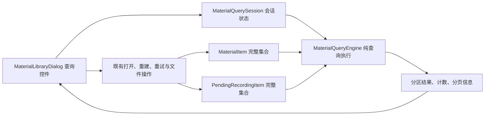

# QuickRec Full v1.7 开发计划

## 追踪信息

- 当前状态：实施、自动验证与 D6 GUI 技术验收完成，已正式发布
- 目标版本：QuickRec Full v1.7
- 上游来源：`IDEA-001`、`IDEA-002`、`IDEA-003`、`IDEA-008`、`IDEA-009`
- 来源文件：`doc/archive/ideas/mypm-idea-pool-v1.7-2026-07-17.md`
- 需求事实源：[prd.md](prd.md)
- 原型：[../../prototypes/product-prototype/full.html](../../prototypes/product-prototype/full.html)
- 下游承接：[progress.md](progress.md)、[dev_log.md](dev_log.md)
- 开发基线：`v1.6.1` tag / `cf5cec8e44b3a2b74a247cb94c0206ade7e8c13a`
- 开发分支：`test`
- 进入开发授权：已获得（2026-07-18）
- 最后更新：2026-07-18

## 1. 开发范围

### 1.1 版本目标

在不改变中央素材索引 schema、不增加数据库和后台服务的前提下，为最多 200 条正式素材与最多 200 条待入库记录提供统一的关键词搜索、条件筛选和结果排序能力。

### 1.2 本次包含

- 文件名或完整路径关键词搜索，字段间使用 OR，拉丁字符不区分大小写。
- 状态、录制模式、音频模式和时间范围四类单选筛选，类别间与搜索使用 AND。
- 录制时间、时长和文件大小六项排序，空值始终置后并保持稳定次序。
- 待入库与正式素材独立分区、统一条件、分别排序，正式素材每次展示 50 条。
- 搜索输入约 150 ms 防抖；条件变化后重置分页和无效选中项。
- 同一应用进程内恢复查询条件；应用重启后恢复默认状态。
- 查询异常保留上一次有效结果，日志不记录关键词、文件名、完整路径或具体条件。
- 查询模型、会话状态和受影响素材库 UI 的增量质量门禁。

### 1.3 本次不包含

- 轻量预览、收藏、标签、项目分类和完整工作台。
- AI、剪辑、导出队列、云同步、SQLite 或全文索引。
- WGC、120 FPS、多显示器正式支持和捕获后端切换。
- 全局 UI 重做、设置页新增查询配置或查询条件磁盘持久化。
- QuickRec Lite 的代码、文档、CI 或发布内容。

### 1.4 范围保护

- 查询只读现有 `MaterialItem` 和 `PendingRecordingItem`，不得修改或写回素材对象。
- 不修改 `recordings.json`、`pending-recordings.json` 或降级标记 schema。
- 不扫描查询条件之外的新目录，不访问视频内容，不新增运行时依赖。
- 素材打开、重建、迁移、重新定位、移除索引、回收站和重试入库继续调用既有服务。

## 2. PRD 对照

| PRD 章节 / 验收点 | 开发模块 | 覆盖方式 |
| --- | --- | --- |
| 6.2、6.8 默认状态与会话恢复 | 查询会话协调器 | 默认条件、进程内恢复、分页重置 |
| 6.3、V17-S1～S6 | 纯查询执行器、搜索框 | OR 搜索、规范化、防抖 |
| 6.4、V17-F1～F6 | 查询条件、筛选控件 | 四类单选筛选与 AND 组合 |
| 6.5、V17-O1～O4 | 稳定排序执行器、排序控件 | 六项排序、空值置后、稳定次序 |
| 6.6、V17-P1～P7 | 查询会话、素材库渲染 | 分区、计数、分页、选中项 |
| 6.7 状态变化 | `MaterialLibraryDialog.reload` | 保持条件并刷新匹配集合 |
| 7.1～7.3 | 素材库两行查询工具栏 | 局部 UI 更新，不改全局壳 |
| 10、11 | 异常与日志 | 保留有效结果、隐私安全日志 |
| 13.5、14 | 测试与质量门禁 | 边界夹具、性能、ruff/mypy/coverage |

## 3. 设计与模块边界



### 3.1 查询模型

建议新增 `src/services/material_query.py`：

- `MaterialQueryCriteria`：关键词、状态、模式、音频、时间范围和排序项。
- `MaterialQueryResult`：完整匹配集合、可见正式素材、计数、加载更多状态和耗时。
- `MaterialQueryEngine`：统一字段适配、筛选、稳定排序和性能告警。
- 纯 Python，不导入 PyQt，不读写文件，不修改输入对象。

### 3.2 会话状态

建议新增 `src/services/material_query_session.py`：

- 保存当前进程内条件和正式素材可见数量。
- 修改任一条件时恢复到前 50 条。
- 加载更多只影响正式素材，待入库始终展示全部匹配项。
- 查询失败时保留上一次成功结果并返回非隐私错误。
- Dialog 实例关闭后继续保留状态；应用进程退出自然清空。

### 3.3 UI 边界

`src/ui/material_library_dialog.py` 只新增：

- 第一行搜索、总匹配数和重置按钮。
- 第二行四类筛选与一个排序下拉框。
- 150 ms `QTimer` 防抖。
- 查询结果渲染、分区计数、无结果与异常反馈。
- 现有详情和文件操作仍基于 `_rows` 中真实对象，不复制业务操作。

## 4. 文件与模块影响

| 文件 | 改动类型 | 说明 |
| --- | --- | --- |
| `src/services/material_query.py` | 新增 | 查询条件、字段适配、搜索筛选排序与结果模型 |
| `src/services/material_query_session.py` | 新增 | 会话条件、分页、异常保留与查询协调 |
| `src/ui/material_library_dialog.py` | 修改 | 两行工具栏、防抖、计数、渲染和状态联动 |
| `src/main.py` | 评估后最小修改 | 仅在需要显式注入会话时调整；优先复用现有 Dialog 生命周期 |
| `src/version.py` | 修改 | 候选包阶段更新为 v1.7 |
| `pyproject.toml` | 修改 | 新模块纳入 mypy；受影响文件保持 ruff 覆盖 |
| `build_std.spec` | 验证 / 必要时修改 | 确认 PyInstaller 自动收集新增服务模块 |
| `tests/test_material_query.py` | 新增 | 搜索、筛选、排序、时间、空值、性能 |
| `tests/test_material_query_session.py` | 新增 | 会话恢复、分页、异常与选中项契约 |
| `tests/test_material_library_dialog.py` | 修改 | 控件、防抖、计数、分页、空状态与操作回归 |
| `tests/test_main_workflow.py` | 必要时修改 | 同进程重开素材库与新素材刷新 |
| `tests/test_packaging_config.py` | 修改 | 新模块与候选包收集检查 |
| `doc/releases/v1.7/*` | 新增 / 更新 | 进度、日志、测试、验证和发布材料 |

## 5. 实施顺序

### D0 基线与测试先行

- 固定 `v1.6.1` tag、Full/Lite 工作区和 v1.7 范围。
- 建立 0/1/49/50/51/199/200 条正式素材及待入库边界夹具。
- 先写查询与会话失败测试，确认旧实现不具备目标能力。

### D1 纯查询模型

- 实现条件枚举、默认值和规范化。
- 实现文件名/路径 OR 搜索与跨类别 AND 筛选。
- 实现本地时间范围、未知枚举和非法时间处理。
- 实现六项稳定排序与空值置后。
- 验证 200 条查询计算不超过 100 ms。

### D2 会话状态与分页

- 实现默认状态、条件更新和重置。
- 条件变化将正式素材可见数量恢复为 50。
- 加载更多每次增加 50，待入库不分页。
- 查询异常保留上一次有效结果并返回隐私安全错误。
- 同进程重开恢复条件，不恢复选中项和加载数量。

### D3 素材库 UI

- 按原型增加两行紧凑工具栏。
- 接入搜索清除、150 ms 防抖、四类筛选、排序和重置。
- 显示总匹配数、待入库分区计数与正式素材分页计数。
- 处理无素材、无匹配、加载失败和查询异常状态。
- 在窄窗口与 100%/125%/150% DPI 下避免关键裁切。

### D4 操作与刷新回归

- 选中项仍匹配时保持；被过滤时清除且不跳选。
- 新素材、重试成功、重新定位、移除和回收站后保持当前条件刷新。
- 确认操作始终作用于真实选中对象。
- 回归导入、重建、迁移、备份恢复和待入库恢复。

### D5 工程门禁与候选包

- 新查询与会话模块纳入 mypy、ruff 和 coverage。
- 运行受影响测试、全量测试、packaging、compileall 和 diff 检查。
- 独立打包并锁定 EXE、FFmpeg、FFprobe 与 SHA256。

### D6 GUI 验收与发布收口

- 使用隔离 APPDATA 和边界夹具验证搜索、组合筛选、六项排序与分页。
- 验证同进程恢复、应用重启默认、异常保留和隐私日志。
- 验证 100%、125%、150% DPI。
- 快速回归三类录制、四类音频、诊断和 v1.6.1 待入库链路。
- 验收通过后再更新 release notes、tag 和 Release；外部写操作另行授权。

## 6. 测试与验收

### 6.1 自动化命令

```powershell
python -m pytest tests/test_material_query.py tests/test_material_query_session.py tests/test_material_library_dialog.py -q
python -m pytest -q
python -m pytest -m packaging -q
python -m pytest --cov=src --cov-report=term-missing --cov-fail-under=80 -q
python -m ruff check src tests
python -m mypy
python -m compileall -q src tests
git diff --check
```

### 6.2 GUI 验收

- 锁定候选包身份，不复用 v1.6.1 EXE。
- 使用隔离索引构造搜索、组合条件、空值、未知枚举和分页边界。
- 对结果顺序和计数进行 JSON 对照，不能只看 UI 有内容。
- 自动化无法覆盖的 DPI 和真实桌面路径写入 `manual-verification.md`。

### 6.3 回归范围

- 素材库现有打开、目录、复制、重新定位、移除、回收站、导入、重建与重试。
- v1.6.1 待入库持久恢复与音频修复。
- v1.4.1 诊断入口。
- 全屏、区域、窗口及四种音频模式。
- QuickRec Lite 只检查工作区未修改。

## 7. 开发日志约定

- 使用 [dev_log.md](dev_log.md) 记录里程碑、关键实现、验证摘要和未闭合风险。
- Progress 只记录状态、任务勾选、阻塞、验证与下一步。
- 可复现缺陷单独写入 `bugfix-log.md`，不把排查流水写入 progress。
- 性能数据只记录数据规模、耗时和结论，不记录关键词或路径。

## 8. 风险与回退

| 风险 | 触发条件 | 处理与回退 |
| --- | --- | --- |
| 查询逻辑泄漏到 UI | Dialog 出现重复字段判断与排序 | 抽回纯查询模块，UI 只绑定条件和渲染结果 |
| 两类素材混排 | 待入库操作语义与正式素材混淆 | 查询结果始终分区，分别排序和计数 |
| 空值排序不稳定 | 升降序切换时空值跳到前方 | 空值单独分桶置后，稳定次排序 |
| 时区边界错误 | 今天或最近 N 天结果偏差 | 使用 aware datetime 与本地时区夹具测试 |
| 条件变化破坏选中项 | 操作到错误素材 | 每次查询按稳定 key 重建选择；无效时清空 |
| UI 控件拥挤 | 125%/150% DPI 截断或重叠 | 固定最小宽度、可伸缩搜索框和窄窗回归 |
| 查询异常清空结果 | 用户误以为素材消失 | 会话保存上次成功结果并显示非阻断错误 |
| 性能不足 | 200+200 条计算超过 100 ms | 保持内存线性扫描，不引入数据库；必要时缓存规范化值 |
| 回归阻断发布 | 素材操作或录制链路失败 | 回退到 `v1.6.1` tag；查询不涉及数据迁移 |

## 9. 开放问题

- 无阻塞性产品开放问题。
- 控件最小宽度和窄窗口换行细节以现有原型与实际 DPI 验收结果微调，不扩大为全局 UI 重做。
