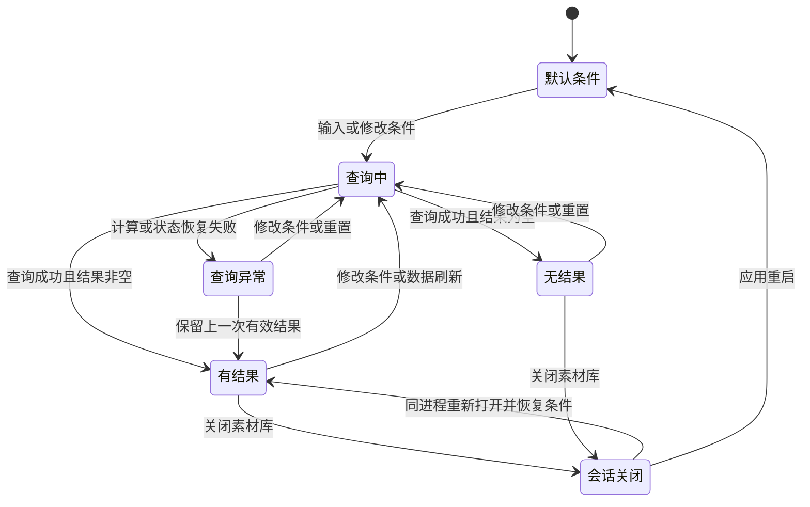

# QuickRec Full v1.7 素材发现与轻整理 PRD

> 版本：v1.7
> 类型：正式推进型 PRD
> 状态：开发与 GUI 技术验收完成，已正式发布
> 产品线：QuickRec Full
> 上游需求：`IDEA-001`、`IDEA-002`、`IDEA-003`、`IDEA-008`、`IDEA-009`
> 来源：`doc/archive/ideas/mypm-idea-pool-v1.7-2026-07-17.md`
> 依赖版本：QuickRec Full v1.6.1 正式发布收口
> 原型：`doc/prototypes/product-prototype/full.html`
> 进入开发授权：已获得（2026-07-18）

## 1. 需求状态

### 1.1 类型判断

本需求为**正式推进型 PRD**，不是技术原型或长期工作台方案。

判断依据：

- v1.6 已建立最多 200 条、跨保存路径的中央素材索引，v1.6.1 已补充待入库恢复链路。
- 当前素材库只能按固定时间顺序浏览和每次加载更多 50 条，缺少关键词搜索、条件筛选和结果排序。
- 现有数据模型已经包含文件名、完整路径、状态、录制模式、音频模式、时间、时长和文件大小，不需要新增数据库或修改素材 schema。
- 上游需求池已完成压力测试，搜索、筛选和排序可围绕同一个“找到目标素材”任务形成最小闭环。
- 用户已确认查询字段、匹配规则、筛选枚举、排序规则、分页关系、会话状态、异常行为、原型和验收边界。

### 1.2 版本定位

v1.7 是 QuickRec Full 的素材发现效率版本，唯一产品主线为：

> 让用户在最多 200 条、跨多个保存路径的中央素材中，通过关键词、录制属性和排序快速找到目标录制。

本版最多包含两个工程支撑模块：

1. 素材查询模型与会话状态协调器的最小拆分。
2. 对查询、状态协调和受影响素材库 UI 扩大增量质量门禁。

### 1.3 开发前硬门槛

- v1.7 PRD 和原型可以先完成。
- v1.6.1 必须完成正式 tag、Release 和文档状态收口后，v1.7 才能进入开发承接和代码实现。
- v1.7 不吸收、不重命名 v1.6.1 的待入库恢复工作。
- v1.6.1 未收口时，不生成“已授权开发”的状态，不开始业务代码修改。

## 2. 背景与问题

### 2.1 当前素材发现链路


当前链路在素材量较少时可用，但素材接近 50、100 或 200 条后，用户必须依赖时间记忆、逐行浏览和外部资源管理器搜索。素材库已经具备比文件系统更丰富的状态、模式、音频和失败上下文，却无法利用这些字段缩小结果。

### 2.2 用户问题

1. 记得文件名或保存目录片段时，无法在素材库内直接搜索。
2. 只记得“窗口录制、双音频、最近 7 天或文件缺失”时，无法按属性筛选。
3. 需要找最长、最短、最大或最小素材时，只能人工比较。
4. 查询条件变化后，分页、选中项和详情状态缺少统一规则。
5. 待入库与正式素材属于不同操作语义，查询不能把两类记录混成一个无边界列表。
6. 若继续把查询、分页和选中状态直接堆入 `MaterialLibraryDialog`，UI 类职责会进一步膨胀。

### 2.3 当前数据事实

| 对象 | 当前事实 |
| --- | --- |
| 正式素材 | `%APPDATA%\QuickRec\recordings.json`，最多 200 条 |
| 待入库素材 | `%APPDATA%\QuickRec\pending-recordings.json` 及视频目录降级标记，最多 200 条 |
| 分页 | 正式素材首批 50 条，每次加载更多 50 条 |
| 搜索字段 | `file_name`、`file_path` |
| 筛选字段 | `status`、`mode/capture_mode`、`audio_source`、`created_at` |
| 排序字段 | `created_at`、`duration_sec/duration_seconds`、`file_size_bytes` |
| 存储技术 | 本地 JSON；本版不新增 SQLite、全文索引或云端接口 |

## 3. 目标与成功指标

### 3.1 产品目标

1. 用户可通过文件名或完整路径中的任一线索搜索素材。
2. 用户可按状态、录制模式、音频模式和时间范围组合筛选。
3. 用户可按录制时间、时长和文件大小改变结果顺序。
4. 搜索、筛选、排序、加载更多、选中项和详情形成一致状态链路。
5. 待入库和正式素材保持独立分区，但使用同一组查询条件和排序规则。
6. 关闭并重新打开素材库时，当前进程内恢复查询条件；应用重启后恢复默认条件。
7. 为后续素材库 UI 演进建立稳定查询边界，但不在本版重做完整工作台。

### 3.2 成功指标

| 指标 | 通过标准 |
| --- | --- |
| 查询正确性 | 受控数据集中搜索、筛选、排序结果与预期 100% 一致 |
| 组合正确性 | 搜索与不同筛选类别按 AND 组合，类别内单选，无重复结果 |
| 查询性能 | 200 条素材查询计算不超过 100 ms |
| 交互响应 | 包含约 150 ms 防抖在内，从输入到 UI 刷新完成不超过 300 ms |
| 分页一致性 | 条件变化后重置到前 50 条；加载更多后无重复、遗漏和顺序跳变 |
| 会话恢复 | 当前进程关闭并重新打开素材库时恢复条件，重启应用后恢复默认值 |
| 稳定性 | 查询异常不清空上一次有效结果，不导致素材库崩溃 |
| UI 可用性 | 100%、125%、150% DPI 下查询区、列表和详情无关键裁切或重叠 |
| 工程质量 | 新查询模块与状态协调模块纳入 ruff、mypy，新增核心代码覆盖率不低于 80% |

## 4. 方案收敛与优先级

### 4.1 方案比较

| 方案 | 内容 | 价值 | 成本与风险 | 结论 |
| --- | --- | --- | --- | --- |
| 最小方案 | 文件名搜索、状态筛选、时间倒序 | 能解决最基础查找 | 条件不足，路径、模式和音频场景仍需逐行浏览 | 不采用 |
| 推荐方案 | 文件名/路径搜索，四类筛选，六项排序，结果计数、重置、会话恢复和分页一致性 | 完整覆盖“找素材”任务，复用现有字段 | 需要明确查询状态和待入库分区规则，成本仍可控 | 采用 |
| 过大方案 | 推荐方案 + 预览、收藏、标签、项目分类、全局 UI 重构 | 更接近完整工作台 | 引入新数据模型、媒体解码和大范围 UI 回归 | 不进入 v1.7 |

### 4.2 优先级

| 需求 | 优先级 | 是否进入 v1.7 | 理由 |
| --- | --- | --- | --- |
| 关键词搜索 | P0 | 是 | 素材发现主线的最短入口 |
| 条件筛选 | P0 | 是 | 文件系统无法替代模式、音频和状态筛选 |
| 结果排序 | P1 | 是 | 与查询结果比较形成同一闭环，现有字段可直接使用 |
| 查询模型与状态协调器 | P0 工程支撑 | 是 | 防止 UI 类继续承载规则和状态 |
| 增量质量门禁 | P0 工程支撑 | 是 | 查询组合与分页状态需要可重复验证 |
| 素材库局部 UI 调整 | P1 | 是 | 承载查询工具栏、计数、空状态和反馈 |
| 全局 UI 重构 | P3 | 否 | 等完整工作区信息架构和项目模型成熟后再做 |
| 预览、收藏、标签、项目分类 | P3 | 否 | 证据不足或需要新增持久数据模型 |

## 5. 范围与非目标

### 5.1 本版范围

- 文件名和完整路径关键词搜索。
- 状态、录制模式、音频模式、时间范围筛选。
- 录制时间、时长、文件大小排序。
- 搜索、筛选、排序条件组合与一键重置。
- 匹配数量、分区数量、无结果、加载和错误反馈。
- 正式素材分页与查询结果的一致关系。
- 待入库区和正式素材区独立排序、独立计数。
- 当前应用进程内的查询状态恢复。
- 查询模型、会话状态协调器和受影响质量门禁。
- 更新 Full 高保真原型中的素材库局部 UI。

### 5.2 明确不做

- 轻量预览、缩略图缓存或内嵌播放器。
- 收藏、标签、自定义分类或项目分类。
- 完整创作者工作台的一次性交付。
- 全局 UI 重构；托盘、设置页、录制结果条只做必要回归。
- AI 模型、字幕、摘要、章节、标签生成或实时 AI。
- 剪辑、导出队列和云同步。
- SQLite、全文索引、后台搜索服务或云端 API。
- WGC、120 FPS、多显示器正式支持。
- 全量重写 `QuickRecApp`、`RecorderManager` 或素材库架构。
- 修改正式素材或待入库上限。
- 将查询关键词、完整路径或具体筛选值写入日志。

## 6. 完整功能链路

### 6.1 入口

1. 用户通过托盘菜单或录制结果条打开“素材库”。
2. 素材库沿用现有窗口，不新增第二个搜索窗口或工作台页面。
3. 查询工具栏位于素材列表和详情区域上方，使用两行布局。

### 6.2 默认状态

- 搜索词为空。
- 所有筛选项为“全部”。
- 排序为“录制时间：最新优先”。
- 正式素材显示前 50 条；待入库匹配项全部显示。
- 当前进程第一次打开素材库时使用默认状态。
- 若同一进程内曾关闭素材库，再次打开时恢复搜索、筛选和排序条件，但正式素材重新从前 50 条开始。
- 不恢复上次选中素材，也不恢复加载更多后的显示数量。

### 6.3 搜索流程

1. 用户在搜索框输入关键词。
2. 输入去除首尾空白；空字符串等同于未搜索。
3. 约 150 ms 无继续输入后执行查询。
4. 分别检查 `file_name` 与 `file_path`。
5. 两个字段使用 OR 关系：任一字段包含关键词即可匹配。
6. 同一素材即使两个字段都匹配，也只出现一次。
7. 拉丁字符不区分大小写；中文按原文包含匹配。
8. 不支持拼音、错别字纠正、正则表达式、模糊编辑距离或多关键词分词。
9. 搜索框清除图标只清除关键词，不修改筛选和排序。

### 6.4 筛选流程

- 每个筛选类别单选，并提供“全部”。
- 不同筛选类别之间使用 AND。
- 搜索词与全部筛选类别之间使用 AND。
- 任一筛选变化立即执行查询并重置正式素材显示数量为 50。

筛选项定义：

| 类别 | 选项 | 字段与规则 |
| --- | --- | --- |
| 状态 | 全部、可用、待入库、入库失败、文件缺失、信息不完整 | 正式素材和待入库状态统一映射；运行时“正在重试”归入“待入库” |
| 录制模式 | 全部、全屏录制、区域录制、窗口录制、未知 | 正式素材读取 `mode`，待入库读取 `capture_mode` |
| 音频模式 | 全部、无声、系统声音、麦克风、系统声音 + 麦克风、未知 | 读取 `audio_source` |
| 时间范围 | 全部、今天、最近 7 天、最近 30 天、最近 90 天 | 以素材 `created_at` 和系统本地时区判断；“今天”从本地 00:00:00 开始 |

本版不提供来源类型筛选；来源继续在素材详情中展示。

### 6.5 排序流程

排序使用一个组合下拉框，固定提供：

1. 录制时间：最新优先。
2. 录制时间：最早优先。
3. 时长：最长优先。
4. 时长：最短优先。
5. 文件大小：最大优先。
6. 文件大小：最小优先。

排序规则：

- 待入库和正式素材保持两个独立分区，同一排序规则分别作用于两个分区。
- 时长或文件大小为空时，无论升序还是降序都排在所属分区末尾。
- 主排序值相同时，先按录制时间倒序，再按稳定素材 ID 排序，保证结果不跳动。
- 排序变化后正式素材重置为前 50 条。

### 6.6 结果与分页

1. 查询先作用于完整中央索引和完整待入库集合，再进行展示截取。
2. 待入库匹配项全部展示，不参与正式素材分页。
3. 正式素材首批显示最多 50 条，每次加载更多 50 条，直到匹配结果全部显示。
4. 搜索、筛选或排序变化后，正式素材显示数量重置为 50。
5. 顶部显示“匹配 N / 共 M 条”，N 和 M 包含待入库与正式素材。
6. 待入库区显示“匹配 N / 共 M 条待入库”。
7. 正式素材区显示“显示 X / 匹配 Y / 共 Z 条素材”。
8. 没有匹配的待入库项时隐藏待入库行，但保留待入库总数提示。
9. 全部结果为空时显示“没有符合当前条件的素材”和“重置条件”操作。
10. 若中央索引和待入库本身都为空，且没有查询条件，沿用“暂无素材”的产品空状态。

### 6.7 状态变化与刷新

- 素材库打开期间，新录制或重试入库成功后保持当前查询条件并自动刷新。
- 新素材仅在符合当前条件时显示，并按当前排序插入对应分区。
- 待入库成功转为正式素材后，从待入库分区移除，并按当前条件判断是否进入正式分区。
- 刷新后若当前选中素材仍在结果中，保持选中。
- 若当前选中素材不再匹配，清除选中态并收起详情，不自动选择其他素材。
- 删除、仅移除索引、重新定位等操作完成后遵循同一刷新规则。

### 6.8 重置、关闭与取消

- “重置条件”清空关键词和全部筛选，恢复“录制时间：最新优先”。
- 清除搜索框只影响关键词。
- 关闭素材库不保存条件到磁盘，仅保留在当前应用进程内。
- 应用退出后清除查询会话；下次启动回到默认条件。
- 查询无保存按钮；条件变化即时生效。

## 7. UI 与交互要求

### 7.1 查询工具栏

采用两行紧凑工具栏：

第一行：

- 搜索框，占据可伸缩主空间，提示文字为“搜索文件名或完整路径”。
- 结果计数“匹配 N / 共 M 条”。
- “重置条件”命令按钮。

第二行：

- 状态下拉框。
- 录制模式下拉框。
- 音频模式下拉框。
- 时间范围下拉框。
- 排序下拉框。

### 7.2 控件与反馈

- 搜索框提供标准清除图标和无障碍名称。
- 下拉框固定宽度应支持最长中文选项，在 100%、125%、150% DPI 下不截断。
- 窄窗口允许工具栏换行，不允许控件互相覆盖。
- 查询执行期间可显示轻量加载状态，但不得阻塞素材详情操作。
- 查询成功不弹窗。
- 查询异常显示非阻断错误提示，保留上一次有效结果，并提供重置条件操作。
- 错误提示消失或下一次查询成功后恢复正常计数。

### 7.3 局部 UI 更新边界

- 本版只调整素材库查询工具栏、计数、列表分区、详情空状态和异常反馈。
- 不重做托盘、设置页、录制结果条、主导航或完整工作台布局。
- Full 原型可以表达未来工作台方向，但 v1.7 验收只覆盖素材库局部变化。
- 大规模全局 UI 更新等待工作区、项目模型和素材操作链路更完整后另行立项。

### 7.4 原型验收门槛

开发前必须实际操作 `doc/prototypes/product-prototype/full.html`，至少完成：

1. 输入关键词搜索文件名或路径。
2. 组合状态、模式、音频和时间筛选。
3. 切换六项排序。
4. 使用搜索清除和一键重置。
5. 加载更多后改变条件，确认重置到前 50 条。
6. 查看无结果状态并恢复。

原型通过不替代最终打包 GUI 验收。

## 8. 查询模型与状态协调

### 8.1 建议职责

新增纯查询模型与会话状态协调器，具体名称可在开发承接阶段结合现有命名确定。

| 模块 | 职责 |
| --- | --- |
| 查询条件模型 | 保存关键词、四类筛选和排序选项；提供默认值和重置 |
| 查询执行器 | 规范化字段、搜索、筛选、空值排序和稳定排序，不依赖 Qt 控件 |
| 会话状态协调器 | 管理当前进程内条件、正式素材显示数量、条件变化后的分页重置和结果计算 |
| `MaterialLibraryDialog` | 仅负责控件、渲染、用户回调和现有素材操作入口 |

### 8.2 状态机



### 8.3 查询输入与输出契约

输入：

- 正式素材完整集合。
- 待入库完整集合。
- 查询条件。
- 正式素材可见数量，默认 50。
- 系统当前本地时间。

输出：

- 排序后的待入库匹配集合。
- 排序并按可见数量截取的正式素材集合。
- 两类匹配数、总数和是否仍可加载更多。
- 当前选中素材是否仍有效。
- 计算耗时和非隐私错误代码。

查询执行器不得修改输入素材对象或持久化文件。

## 9. 数据与兼容性

### 9.1 数据变更

- 不修改 `recordings.json` schema。
- 不修改 `pending-recordings.json` schema。
- 不新增设置项、缓存文件、数据库或用户目录。
- 查询条件只存在于内存，不写入配置。
- 继续保留未知枚举和扩展字段的兼容能力。

### 9.2 枚举映射

| UI 值 | 正式素材值 | 待入库值 |
| --- | --- | --- |
| 可用 | `available` | 不适用 |
| 待入库 | 不适用 | `pending`、运行时 `retrying` |
| 入库失败 | 不适用 | `retry_failed` |
| 文件缺失 | `missing` | `missing` |
| 信息不完整 | `metadata_incomplete` | 元数据关键字段缺失且未处于更高优先级失败状态 |
| 全屏录制 | `fullscreen` | `fullscreen` |
| 区域录制 | `region` | `region` |
| 窗口录制 | `window` | `window` |
| 未知模式 | `unknown` 或未识别值 | `unknown` 或未识别值 |
| 无声 | `none` | `none` |
| 系统声音 | `system` | `system` |
| 麦克风 | `microphone` | `microphone` |
| 系统声音 + 麦克风 | `both` | `both` |
| 未知音频 | `unknown` 或未识别值 | `unknown` 或未识别值 |

### 9.3 时间与空值

- `created_at` 按 ISO 8601 解析，并转换到系统本地时区后筛选。
- 无法解析时间的素材仅在“全部时间”中出现；按时间排序时置于分区末尾。
- 时长和文件大小为空时始终置于分区末尾。
- 任何查询都不得写回修正后的时间或元数据。

## 10. 异常与降级

| 场景 | 行为 |
| --- | --- |
| 索引加载失败 | 沿用现有素材库错误状态；查询控件禁用，不伪造空结果 |
| 待入库加载失败 | 正式素材仍可查询；待入库区显示加载失败，不计入匹配数 |
| 查询计算异常 | 保留上一次有效结果，显示非阻断错误和重置入口 |
| 条件会话恢复失败 | 使用默认条件打开，记录隐私安全警告 |
| 时间字段非法 | 该项只参与“全部时间”，时间排序置后 |
| 未知枚举 | 映射到“未知”，不丢弃素材 |
| 新素材刷新失败 | 保留当前结果，提示刷新失败，不影响素材已保存或已入库事实 |
| 选中项失效 | 清除选择并收起详情，不自动选择其他项 |

## 11. 日志与隐私

### 11.1 正常行为

- 正常搜索、筛选、排序、重置和加载更多不写日志。
- 不记录搜索关键词、完整文件路径或具体筛选值。
- 不新增云端遥测或埋点上传。

### 11.2 异常与性能日志

仅记录：

- 查询执行异常。
- 会话状态恢复异常。
- 查询计算超过 100 ms。
- 输入到 UI 完成刷新超过 300 ms。

允许的上下文：

- 错误类型或稳定错误代码。
- 查询耗时。
- 输入集合总数和结果数量。
- 当前是否为默认条件。

禁止记录：

- 搜索关键词。
- 文件名和完整路径。
- 具体筛选值组合。
- 用户环境变量、窗口标题或媒体内容。

## 12. 影响范围

| 范围 | 影响 | 约束 |
| --- | --- | --- |
| 前端/UI | 素材库增加两行查询工具栏、计数、空状态和错误反馈 | 不改全局 UI，不新增工作台页面 |
| 前端状态 | 新增当前进程内查询条件和分页协调 | 不持久化到配置，不恢复选中项和加载数量 |
| 服务/后端 | 新增纯内存查询能力 | 不改变索引读写、录制和入库服务 |
| 数据 | 读取现有正式素材与待入库字段 | 不改 schema，不新增数据库 |
| 配置 | 不涉及 | 不新增设置页选项 |
| 日志 | 只增加异常和性能告警 | 不记录关键词、路径和具体条件 |
| 权限与安全 | 不新增文件访问权限 | 查询不得触发额外目录扫描 |
| 异步任务 | 仅输入防抖和 UI 刷新 | 不新增后台服务或周期任务 |
| 文件与存储 | 不涉及新文件 | 不修改视频、索引或备份 |
| 第三方依赖 | 不涉及 | 不新增运行时依赖或二进制 |
| 打包 | 包含新增 Python 查询模块 | 发布包结构和 FFmpeg/FFprobe 不变 |
| 既有体验 | 保留素材打开、目录、复制、重新定位、移除、回收站、重试和重建 | 查询后操作必须作用于真实选中项 |
| Lite | 无影响 | 不同步代码、文档、CI 或发布内容 |

## 13. 验收标准

### 13.1 搜索

| 编号 | Given | When | Then |
| --- | --- | --- | --- |
| V17-S1 | 文件名包含 `Demo` | 输入 `demo` | 不区分大小写匹配该素材 |
| V17-S2 | 完整路径包含中文目录 | 输入对应中文片段 | 路径匹配并展示素材 |
| V17-S3 | 文件名与路径均匹配 | 输入共同片段 | 结果只出现一次 |
| V17-S4 | 输入首尾有空格 | 完成输入 | 去除首尾空格后匹配 |
| V17-S5 | 输入无匹配词 | 查询完成 | 显示无结果状态和重置入口 |
| V17-S6 | 快速连续输入 | 观察刷新 | 约 150 ms 防抖，无明显卡顿或中间结果闪烁 |

### 13.2 筛选与组合

| 编号 | 场景 | 通过标准 |
| --- | --- | --- |
| V17-F1 | 单个筛选类别 | 结果只包含对应枚举，未知值进入“未知” |
| V17-F2 | 多类别组合 | 类别间按 AND，不出现任一条件不符的素材 |
| V17-F3 | 搜索 + 筛选 | 搜索和筛选按 AND |
| V17-F4 | 时间范围 | 按系统本地时区和 `created_at` 判断，今天从 00:00:00 开始 |
| V17-F5 | 待入库状态 | `pending` 和运行时重试归入待入库，`retry_failed` 归入入库失败 |
| V17-F6 | 全部条件 | 恢复对应类别全部值，不影响其他条件 |

### 13.3 排序

| 编号 | 场景 | 通过标准 |
| --- | --- | --- |
| V17-O1 | 六项排序逐一切换 | 结果方向正确 |
| V17-O2 | 时长或大小为空 | 升序、降序均置于所属分区末尾 |
| V17-O3 | 主排序值相同 | 按录制时间倒序、素材 ID 稳定排序 |
| V17-O4 | 待入库与正式素材 | 两个分区分别排序，不混排 |

### 13.4 分页与状态

| 编号 | 场景 | 通过标准 |
| --- | --- | --- |
| V17-P1 | 51 条以上匹配结果 | 首批 50 条，加载更多后无重复和遗漏 |
| V17-P2 | 已加载更多后修改条件 | 正式素材重置到前 50 条 |
| V17-P3 | 待入库存在多个匹配项 | 全部显示，不占正式素材分页 |
| V17-P4 | 关闭并重新打开素材库 | 同进程恢复条件，但从前 50 条开始且无选中项 |
| V17-P5 | 重启应用 | 恢复默认条件 |
| V17-P6 | 新素材入库 | 保持条件，符合时按当前排序出现，不符合时不显示 |
| V17-P7 | 选中项被过滤掉 | 清除选中并收起详情，不跳选其他素材 |

### 13.5 数据边界

受控数据至少覆盖：

- 0、1、49、50、51、199、200 条正式素材。
- 中文、空格和超长文件名或路径。
- 跨多个保存路径的同名文件。
- 可用、待入库、入库失败、缺失、信息不完整和未知状态。
- 三种录制模式、未知模式、四种音频模式和未知音频。
- 时长和大小为空、时间非法、排序值相同。

### 13.6 UI 与回归

- 100%、125%、150% DPI 下工具栏、列表、详情、计数和无结果状态无关键裁切或重叠。
- 查询控件支持键盘焦点和清晰的中文无障碍名称。
- 素材打开、打开目录、复制路径、重新定位、仅移除索引、移入回收站和待入库重试不回退。
- 目录导入、重建、迁移摘要、备份恢复和错误状态不回退。
- 全屏、区域、窗口录制及四种音频模式不回退。
- v1.4.1 诊断功能不回退。
- QuickRec Lite 保持未修改。

## 14. 测试与质量门禁

### 14.1 自动化测试

至少新增或补强：

- 文件名和路径 OR 搜索测试。
- 大小写、中文、空格和空关键词测试。
- 四类筛选枚举与未知值测试。
- 搜索和跨类别 AND 组合测试。
- 本地时区时间范围测试。
- 六项排序、空值置后和稳定排序测试。
- 待入库/正式素材分区和独立计数测试。
- 50 条分页、条件变化重置和加载更多测试。
- 当前进程会话恢复、应用重启默认状态测试。
- 新素材刷新和选中项失效测试。
- 查询异常保留上一次结果测试。
- 200 条查询性能测试。
- 素材库控件、无结果、加载、错误和 DPI 关键布局测试。

### 14.2 增量质量门禁

- 新查询模块、会话状态协调器和修改后的素材库 UI 全部纳入 ruff。
- 新查询模块和状态协调器纳入 mypy，不新增排除项。
- 新增核心模块语句覆盖率不低于 80%。
- 查询组合、分页和错误分支必须有明确断言。
- 不要求在 v1.7 一次清理所有历史主应用、音频或捕获模块的类型债务。
- `compileall`、`git diff --check`、UTF-8 中文和乱码检查通过。

### 14.3 建议验证命令

```powershell
python -m pytest tests/test_material_library_query.py tests/test_material_library_dialog.py -q
python -m pytest -q
python -m pytest -m packaging -q
python -m ruff check src tests
python -m mypy
python -m compileall -q src tests
git diff --check
```

最终命令和实际文件名在开发承接阶段按实现结构校准。

### 14.4 打包 GUI 验收

- 使用独立 APPDATA 和受控索引，禁止污染真实素材。
- 锁定候选 EXE、SHA256、分支和 HEAD。
- 实际使用搜索、组合筛选、排序、重置、加载更多和会话恢复。
- 使用 0/1/49/50/51/199/200 条受控夹具核对 UI 数量和顺序。
- 100%、125%、150% DPI 各保留截图。
- 查询异常使用可恢复方式注入，并检查上一次有效结果和隐私安全日志。
- 原型验收和自动化测试不能替代打包 GUI 验收。

## 15. 开发前验收口径

### 15.1 验收目标

在进入开发承接前，确认搜索、筛选、排序、分页、会话状态、待入库分区、异常反馈和 UI 边界均无歧义，开发不需要自行补产品决策。

### 15.2 验收标准

- PRD 明确搜索字段为文件名和完整路径，字段间为 OR。
- PRD 明确搜索与不同筛选类别之间为 AND，类别内单选。
- PRD 明确四类筛选和六项排序的完整枚举。
- PRD 明确空值排序、本地时区和稳定排序规则。
- PRD 明确查询作用于完整集合后再分页。
- PRD 明确待入库和正式素材保持分区，分页只作用于正式素材。
- PRD 明确同进程恢复条件、重启恢复默认和不恢复选中项。
- PRD 明确查询异常保留上一次有效结果。
- 高保真原型可操作演示搜索、组合筛选、排序、重置、加载更多和无结果。
- v1.6.1 正式发布收口被列为开发硬门槛。

### 15.3 日志与人工检查

开发承接前由用户或负责人实际操作原型，检查：

1. 两行工具栏是否足够紧凑且可理解。
2. 搜索清除和重置全部条件是否容易区分。
3. 待入库与正式素材分区计数是否清晰。
4. 多条件组合后是否能理解当前结果范围。
5. 无结果和查询异常是否能恢复。
6. 局部 UI 更新是否保持 Full 当前素材库习惯，而没有提前形成完整工作台。

### 15.4 通过标准

- 上述开发前验收标准全部满足。
- 用户实际完成原型中的五类任务并确认。
- PRD、原型和原型说明的枚举、文案和范围一致。
- v1.6.1 发布事实已收口，文档不存在与 v1.7 开发门槛冲突的状态。

### 15.5 不通过处理

- 搜索字段、筛选枚举、排序空值、分页或分区规则仍有争议：返回 `/prd` 修订。
- 原型无法完成核心任务或布局不可用：先修原型，不生成开发计划。
- 开发承接要求新增数据库、标签模型、预览或全局 UI 重构：停止并回到范围评审。
- v1.6.1 未完成正式发布收口：保持 v1.7 为“需求已确认，开发未授权”。

## 16. 风险与取舍

| 风险 | 影响 | 控制方式 |
| --- | --- | --- |
| 查询规则分散在 UI 事件中 | 状态不一致、难测试 | 提取纯查询模型和会话状态协调器 |
| 待入库和正式素材混排 | 用户误解状态和操作 | 保持独立分区，统一条件但分别排序 |
| 空值改变排序位置 | 结果跳动 | 空值始终置后，增加稳定次排序 |
| 时间范围受时区影响 | 今天/最近 N 天结果错误 | 使用系统本地时区和明确边界测试 |
| 输入刷新频繁 | UI 卡顿 | 约 150 ms 防抖，200 条计算不超过 100 ms |
| 查询日志泄露隐私 | 文件线索外泄 | 正常查询无日志，异常日志不含关键词和路径 |
| 局部 UI 演变成全局重构 | 范围失控 | 只改素材库，未来全局 UI 单独立项 |
| 查询条件持久化带来配置债务 | 跨版本兼容复杂 | 仅进程内恢复，不写配置 |
| v1.6.1 状态未收口 | 基线不稳定 | 作为开发硬门槛，不混入 v1.7 |

## 17. 回滚与兼容

### 17.1 代码回滚

- 若 v1.7 查询 UI 阻断发布，可回退到 v1.6.1 素材库窗口和固定时间排序。
- 查询模块不修改素材索引，回滚不需要数据迁移。
- 回滚不得删除中央索引、待入库记录或视频文件。

### 17.2 数据兼容

- v1.6 和 v1.6.1 素材索引可直接被 v1.7 查询。
- v1.7 不写入新字段，降级后旧版本可继续使用。
- 未知枚举和非法时间只能影响当前查询展示，不得被写回或丢弃。

### 17.3 UI 回滚

- 原有素材操作按钮、详情字段、导入和重建入口必须保留。
- 若工具栏在特定 DPI 下不可用，可临时回退查询入口，但不得保留半可用控件。

## 18. 追踪矩阵

| 上游 | 本 PRD | 原型 | 后续验证 |
| --- | --- | --- | --- |
| IDEA-001 关键词搜索 | 第 6.3、7、13.1 节 | 素材库搜索框、计数、无结果 | V17-S1～S6 |
| IDEA-002 条件筛选 | 第 6.4、7、13.2 节 | 四类筛选下拉框 | V17-F1～F6 |
| IDEA-003 结果排序 | 第 6.5、13.3 节 | 六项排序下拉框 | V17-O1～O4 |
| IDEA-008 查询与状态拆分 | 第 8 节 | 无独立页面 | 单元测试、会话状态测试 |
| IDEA-009 增量质量门禁 | 第 14 节 | 无独立页面 | ruff、mypy、coverage、packaging |
| v1.6 素材库 | 第 2、6、12、13.6 节 | 列表、详情、分页和异常状态 | 回归验收 |
| v1.6.1 待入库恢复 | 第 6.4～6.7、9.2 节 | 顶部待入库区和独立计数 | 分区、状态与重试回归 |

## 19. 下一阶段

本 PRD 与原型已完成用户评审；v1.6.1 正式发布收口后进入开发承接和代码实现。

评审通过且 v1.6.1 正式发布收口后，进入开发承接阶段，生成：

- `doc/releases/v1.7/dev_plan.md`
- `doc/releases/v1.7/progress.md`

开发承接必须进一步核对真实代码结构、影响文件、任务顺序、测试命令、风险和回退，并把每个模块拆成可执行的最小 checklist。
