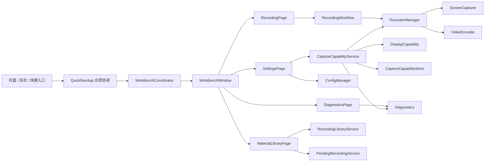
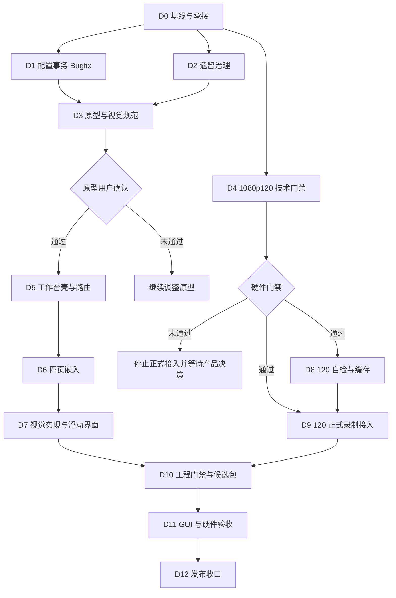

# QuickRec Full v1.8 开发计划

## 追踪信息

- 当前状态：已进入实施；D0 完成，D1/D2 已完成代码与自动化验证，D3 原型等待用户确认。
- 目标版本：QuickRec Full v1.8。
- 上游需求池：`doc/archive/ideas/mypm-idea-pool-v1.8-2026-07-23.md`。
- 上游条目：`IDEA-001`、`IDEA-008`、`IDEA-003`、`IDEA-004`、`IDEA-005`、`BUG-1801`。
- 需求事实源：[prd.md](prd.md)。
- 对应进度看板：[progress.md](progress.md)。
- 开发日志：实施开始时创建 `dev_log.md`；技术门禁另写 `120fps-spike.md`。
- 原型输出：`doc/releases/v1.8/prototype/`；已生成并通过自动验证，尚未获得用户确认。
- 当前正式基线：`v1.7` tag，指向 `8fdf902ac5216bedd6efcd932b83e78b7d14b2c4`。
- 当前 Full 分支：`test`。
- 计划集成分支：`test`；实施前先同步 `master` 的 v1.7 正式基线。
- QuickRec Lite：`E:\codex\QuickRec-Lite`，不进入本版范围。
- 进入开发承接授权：已获得（2026-07-23）。
- 进入业务实现授权：已获得（2026-07-23）。
- 最后更新：2026-07-23。

## 1. 开发范围

### 1.1 版本目标

在不改变 v1.7 素材索引 schema、不替换 dxcam、不引入完整剪辑工作台的前提下：

1. 建立托盘常驻、全局单实例的 QuickRec Full 工作台。
2. 将录制、素材库、设置和诊断统一承载到四个一级页面。
3. 完成现有界面和浮动录制界面的统一视觉改版。
4. 先通过真实单显示器 1920×1080@120Hz+ 技术门禁，再正式接入 1080p120 全屏录制。
5. 扩大受影响模块的测试、静态检查、覆盖率、CI 和打包门禁。

### 1.2 本次包含

- 工作台窗口、固定左侧导航和四个可嵌入页面。
- 托盘、双击托盘、结果条和页面入口统一路由。
- 工作台单实例、隐藏/恢复、窗口几何和离屏修正。
- 工作台发起录制时隐藏，保存或取消后恢复。
- 录制中工作台只读状态。
- 素材库完整嵌入及 v1.7 能力回归。
- 设置显式保存、脏状态保护和保存失败事务。
- 独立诊断页和 120 FPS 诊断摘要。
- 高保真 HTML 原型、统一组件和静态图标资源。
- 120 FPS 环境探测、自检、缓存、快速校验、模式限制和失败保护。
- 单显示器 1080p120 全屏录制及四类音频验收。
- 区域/窗口在全局 120 配置下按本次 60 FPS 执行。
- FPS/画质/编码配置感知的磁盘估算。
- 受影响范围的 ruff、mypy、coverage、CI 和 packaging smoke。

### 1.3 本次不包含

- 多显示器和 4K 正式支持。
- 1440p120 正式承诺。
- WGC。
- NVENC、QSV、AMF。
- 素材预览或首帧。
- 项目模型、多轨、剪辑、导出队列。
- AI、云同步或主题系统。
- QuickRec Lite 的代码、文档、CI、分支和产物。
- 全量重写 `QuickRecApp`、`MaterialLibraryDialog` 或 `RecorderManager`。
- 素材索引 schema 迁移或数据库。

### 1.4 范围保护

- 工作台不得创建第二套录制状态机。
- 录制控制仍由现有 `RecordingWorkflow`、`RecorderManager` 和浮动工具栏负责。
- 工作台录制页只显示录制状态，不新增暂停、继续、停止或取消按钮。
- 素材库只改变 UI 承载，不改变正式索引、待入库、迁移、恢复和文件操作契约。
- 120 FPS 门禁未通过时，不得继续正式接入，也不得自动移除需求后发布。
- 工作台主线可以在 120 FPS 门禁失败后继续，但发布范围必须回到用户决策。
- 配置 Bugfix 和遗留清理必须使用独立提交，不混入工作台或 120 FPS 功能提交。
- 原型未确认前，不实现 PyQt 工作台页面。

## 2. PRD 对照

| PRD 章节 / 需求组 | 开发模块 | 主要交付 | 门禁 |
| --- | --- | --- | --- |
| 6～8 信息架构与窗口状态 | 工作台窗口、页面路由、协调器 | 单实例、导航、几何、隐藏/恢复 | 原型确认 |
| 7 工作台录制链路 | 应用协调、来源状态、浮动工具栏 | 工作台来源与托盘/快捷键来源分流 | GUI 验收 |
| 9.2 录制页 | `RecordingPage` | 模式入口、摘要、只读状态、结果区 | 原型确认 |
| 9.3 素材库页 | 素材库内容组件、查询会话 | v1.7 能力完整嵌入 | 素材回归 |
| 9.4 设置页 | 设置页面、配置事务、脏状态 | 显式保存、三选项保护、120 入口 | BUG-1801 先完成 |
| 9.5 诊断页 | 诊断页面、诊断服务 | 目录、复制、打开、导出、120 摘要 | 诊断回归 |
| 10 浮动窗口 | 选择器、工具栏、结果条 | 统一视觉和工作台路由 | 现有行为不变 |
| 11～12 视觉与原型 | HTML 原型、组件规范、图标资产 | 四页、状态、按钮就近契约 | 用户确认 |
| 13.1～13.5 120 自检 | 显示探测、自检执行、指标评估 | 5 秒自检和硬门禁 | 真实硬件通过 |
| 13.6 能力缓存 | 能力缓存存储 | 原子 JSON、指纹和失效 | 单元/集成测试 |
| 13.7 快速校验 | FPS 决策服务、提示对话框 | 重检、本次 60、取消 | GUI/硬件验收 |
| 13.8～13.10 输出与性能 | 捕获器、录制管理、编码器 | 1080p120、指标、运行告警 | 真实硬件通过 |
| 13.11 音频 | 录制核心、音频混合 | 四类 30 秒、双音频 10 分钟 | 发布阻塞 |
| 13.12 磁盘 | `DiskChecker` | FPS/尺寸/编码感知估算 | 自动化与 GUI |
| 13.13 诊断 | 诊断快照和导出 | 安全环境摘要和失败阶段 | 隐私检查 |
| 14 配置与状态 | `ConfigManager`、能力缓存 | 兼容字段、几何、状态唯一来源 | 回滚测试 |
| 16 工程边界 | 协调器、页面、服务层 | 最小职责拆分 | 不全量重构 |
| 17 开发前治理 | 配置 Bugfix、旧模块清理 | 独立提交与全量回归 | 开发前阻塞 |
| 18～20 验证和质量 | tests、CI、spec、验证文档 | 80%+、静态、打包、硬件 | 候选包门禁 |
| 21～24 验收与回滚 | GUI、硬件、发布文档 | 可审计证据和 v1.7 回滚 | 发布授权 |

## 3. 设计与模块边界

### 3.1 目标关系



### 3.2 工作台协调边界

建议新增 `WorkbenchCoordinator`：

- 持有唯一 `WorkbenchWindow`。
- 接收托盘、双击、结果条和应用内部路由请求。
- 记录同进程上次页面。
- 记录录制发起来源 `workbench/tray/hotkey`。
- 协调工作台隐藏、恢复和录制结果。
- 将录制状态转换为页面只读模型。
- 不直接操作素材 JSON、配置文件或编码线程。

`QuickRecApp` 继续负责：

- QApplication 生命周期。
- 托盘和全局快捷键。
- `RecordingWorkflow` 与 `RecorderManager`。
- 应用级信号连接和退出。
- 向协调器提供录制、配置、素材和诊断服务。

### 3.3 页面边界

- 页面只拥有 UI 控件、页面状态和信号。
- 页面不得直接读写 JSON。
- 设置页使用配置草稿模型，保存成功后才更新正式配置。
- 素材页复用现有查询会话和业务服务。
- 诊断页调用已有诊断服务，新增能力摘要只读模型。
- 录制页通过协调器发起已有录制动作。

### 3.4 120 FPS 边界

建议拆出：

- `DisplayCapability`：显示器数量、分辨率、刷新率。
- `CaptureEnvironmentFingerprint`：不含序列号和完整路径的环境指纹。
- `CaptureCapabilityStore`：原子保存自检记录和通过缓存。
- `CaptureCapabilityEvaluator`：平均 FPS、连续 1 秒最低 FPS、`backlog_ms`。
- `CaptureCapabilityService`：自检编排、取消、清理、快速校验。
- `EffectiveRecordingProfile`：根据全局 FPS、模式、画质和环境得到本次有效配置。

`RecorderManager` 只接收本次有效目标 FPS 和目标尺寸，不承担 UI、自检缓存或产品提示。

### 3.5 并行与依赖



## 4. 文件与模块影响

以下是计划影响面，不表示本轮已授权创建或修改。

| 文件 / 目录 | 改动类型 | 说明 |
| --- | --- | --- |
| `src/main.py` | 修改 | 注入工作台协调器、统一入口、录制来源和结果恢复 |
| `src/version.py` | 后期修改 | 候选包阶段更新 v1.8 |
| `src/config.py` | 修改 | 事务保存结果、120 FPS、工作台几何 |
| `src/ui/workbench_window.py` | 新增 | 主窗口、导航、页面容器、关闭和几何 |
| `src/ui/pages/recording_page.py` | 新增 | 录制模式、摘要、状态和工作台结果 |
| `src/ui/pages/material_library_page.py` | 新增 | 素材库可嵌入内容组件 |
| `src/ui/pages/settings_page.py` | 新增 | 设置草稿、显式保存、120 能力区 |
| `src/ui/pages/diagnostics_page.py` | 新增 | 诊断目录与导出能力 |
| `src/ui/settings_dialog.py` | 重构后兼容/删除评估 | 前置 Bugfix 可先修旧对话框；工作台完成后确认运行时引用 |
| `src/ui/material_library_dialog.py` | 最小重构 | 提取内容组件，必要时保留薄兼容壳 |
| `src/ui/tray_icon.py` | 修改 | 打开工作台、双击、页面路由、统一图标 |
| `src/ui/toolbar.py` | 修改 | 工作台路由、有效 FPS、统一视觉 |
| `src/ui/area_selector.py` | 视觉修改 | 保持选择行为 |
| `src/ui/window_selector.py` | 视觉修改 | 保持选择行为 |
| `src/ui/window_highlighter.py` | 视觉验证 | 不改变跟踪语义 |
| `src/services/workbench_coordinator.py` | 新增 | 单实例和页面/录制来源协调 |
| `src/services/capture_capability.py` | 新增 | 自检、评估、取消、快速校验 |
| `src/utils/display_capability.py` | 新增 | 单显示器和刷新率探测 |
| `src/utils/capture_capability_store.py` | 新增 | 能力缓存和环境指纹 |
| `src/recorder/screen_capturer.py` | 修改 | 目标 FPS 可配置，移除固定 60 |
| `src/recorder/recorder_manager.py` | 修改 | 有效录制配置、性能指标和诊断状态 |
| `src/recorder/video_encoder.py` | 修改 | 120 参数、完成状态和编码待处理指标 |
| `src/utils/disk_checker.py` | 修改 | FPS、尺寸和编码配置感知估算 |
| `src/utils/diagnostics.py` | 修改 | 120 能力和性能安全摘要 |
| `src/recorder/cursor_overlay.py` | 删除候选 | 证明无运行时依赖后独立治理 |
| `src/ui/recent_recordings_dialog.py` | 删除候选 | 证明无迁移依赖后独立治理 |
| `src/utils/recording_history.py` | 删除候选 | 保留必要迁移契约后独立治理 |
| `build_std.spec` | 修改 | 新模块和资源、清除过期 hidden import |
| `pyproject.toml` | 修改 | 扩大 ruff/mypy/coverage 真实范围 |
| `.github/workflows/ci.yml` | 修改 | master/test/PR 和 packaging smoke |
| `scripts/capture_120fps_spike.py` | 新增候选 | 独立真实硬件技术门禁 |
| `tests/test_workbench_*.py` | 新增 | 工作台、路由、页面和脏状态 |
| `tests/test_capture_capability.py` | 新增 | 自检、缓存、阈值和快速校验 |
| `tests/test_display_capability.py` | 新增 | 刷新率和单显示器边界 |
| `tests/test_config.py` | 修改 | 事务、迁移、几何和 FPS |
| `tests/test_main_workflow.py` | 修改 | 入口、来源、隐藏/恢复和结果 |
| `tests/test_recorder_manager.py` | 修改 | 有效目标 FPS 和指标 |
| `tests/test_screen_capturer.py` | 修改 | 目标 FPS 透传 |
| `tests/test_video_encoder.py` | 修改 | 120 参数和完成状态 |
| `tests/test_disk_checker.py` | 修改 | 30/60/120 估算 |
| `tests/test_diagnostics.py` | 修改 | 能力摘要和隐私 |
| `tests/test_packaging_config.py` | 修改 | 新模块、资源、FFmpeg/FFprobe |
| `doc/releases/v1.8/prototype/` | 新增 | 高保真原型和组件说明 |
| `doc/releases/v1.8/120fps-spike.md` | 新增 | 真实技术门禁记录 |
| `doc/releases/v1.8/dev_log.md` | 实施时新增 | 过程记录 |
| `doc/releases/v1.8/verification.md` | 后期新增 | 自动化和构建证据 |
| `doc/releases/v1.8/manual-verification.md` | 后期新增 | GUI、DPI 和硬件验收 |
| `doc/releases/v1.8/bugfix-log.md` | 按需新增 | 可复现缺陷 |
| `doc/releases/v1.8/release-notes.md` | 后期新增 | 候选与正式发布说明 |

## 5. 实施顺序

### D0 基线与开发承接

- 固定 v1.7 正式 tag、Full/Lite 工作区和当前 Git 状态。
- 将 `test` 同步到 `master@v1.7`，避免从旧候选提交继续。
- 确认实施分支策略和进入开发授权。
- 建立 dev log、验证文档占位和基线测试记录。
- 不把未跟踪 `figma-plugin/` 当作 v1.8 正式原型事实源。

### D1 配置事务 Bugfix

- 先写配置写入失败和系统副作用失败测试。
- 让 `ConfigManager.save()` 返回明确结果。
- 使用临时文件和原子替换。
- 将设置控件输入保留在草稿中，成功后才更新正式配置。
- 处理开机自启失败回滚。
- 在旧设置窗口完成定向 GUI 验收。
- 使用独立 Bugfix 提交，不包含工作台代码。

### D2 遗留模块与打包治理

- 使用运行时引用、测试引用、迁移和回滚证据判断清理范围。
- 删除确认无用的自绘光标和 v1.5 最近录制模块。
- 清理 `build_std.spec` 过期 hidden import。
- 删除只验证已删除模块的旧测试，保留数据兼容测试。
- 运行全量回归、packaging 和基础录制 smoke。
- 使用独立治理提交。

### D3 现状盘点、高保真原型与视觉规范

- 对真实 v1.7 打包窗口逐页截图盘点。
- 建立组件、色彩、排版、间距、图标、状态和 DPI 规范。
- 使用 `oiloil-ui-ux-guide -> draw-ui -> oil-icon -> 实际截图对照 -> oil-visual`。
- 输出 `prototype/index.html` 和 `prototype-design.md`。
- 覆盖四页、所有浮动录制界面、关键弹窗和失败状态。
- 为每个控件就近标注五项交互契约。
- 本地 HTTP 与桌面/窄宽度截图验证。
- 等待用户确认；未确认不得进入 D5/D6/D7。

### D4 1080p120 技术门禁

- 先实现独立指标计算和真实硬件 spike，不接正式设置入口。
- 在单显示器 1920×1080@120Hz+ 上使用 dxcam 和 libx264 superfast。
- 执行约 5 秒捕获编码，记录每秒有效帧、平均 FPS、`backlog_ms`、FFmpeg 和 FFprobe。
- 验证中文/空格保存路径和临时清理。
- 记录 CPU/GPU 摘要但不作为硬门禁。
- 形成 `120fps-spike.md` 和原始证据目录。
- 门禁失败时停止 D8/D9，等待用户决定；不得通过 mock 判定可行。

### D5 工作台壳与统一路由

- 先写窗口单实例、路由、隐藏/恢复和几何测试。
- 新建工作台窗口和协调器。
- 接入托盘“打开工作台”和双击托盘。
- 将托盘素材/设置/诊断入口路由到目标页面。
- 记录同进程上次页面，应用重启回录制页。
- 工作台关闭只隐藏，退出仍由托盘负责。
- 处理保存位置离屏和显示环境变化。

### D6 四页嵌入与完整链路

- 实现录制页摘要、模式入口、只读状态和结果区域。
- 引入录制来源，工作台来源隐藏/恢复且不显示重复结果条。
- 将素材库内容提取成可嵌入页面，回归 v1.7 全能力。
- 将设置迁移为页面草稿和显式保存。
- 将诊断目录与操作迁移到独立页面。
- 实现设置和诊断目录的保存/放弃/取消保护。
- 录制中设置相关控件按 PRD 禁用。

### D7 视觉实现与浮动界面统一

- 建立静态样式令牌和本地图标资源。
- 实现浅色内容区、深色窄侧栏和语义状态色。
- 对照已确认原型逐页实现。
- 统一区域选择、窗口选择、倒计时、工具栏、结果条和关键弹窗。
- 空状态只使用必要的轻量说明视觉。
- 补齐工具提示、无障碍名称、键盘顺序和长路径处理。
- 进行 100%、125%、150% DPI 开发检查。

### D8 120 FPS 能力服务与设置入口

- 先写环境探测、缓存、指纹、阈值、取消和失败测试。
- 实现单显示器和 119Hz 边界探测。
- 实现能力缓存原子读写和安全恢复。
- 实现自检状态机、进度、取消和临时清理。
- 设置页增加 30/60/120 与能力状态。
- 自检通过只形成未保存候选。
- 诊断页增加自检结果和安全环境摘要。

### D9 120 FPS 正式录制接入

- 捕获器接受可配置 `target_fps`。
- 录制管理器接受本次有效 FPS/尺寸。
- 编码器输出 120 并记录可诊断性能指标。
- 统一工作台、托盘和快捷键的有效配置决策。
- 全局 120 下区域/窗口本次 60。
- 实现 1080p 最大边界、宽高比和偶数尺寸。
- 实现每次 120 录制前快速校验和三种选择。
- 运行中性能下降时保留视频并显示真实结果。
- 磁盘估算感知 FPS 和编码配置。
- 素材元数据记录本次有效 FPS 和输出尺寸。

### D10 工程门禁、CI 与候选包

- 将新增/修改模块纳入 ruff、mypy 和 coverage。
- 新增/修改目标模块语句覆盖率达到 80%。
- 项目总体覆盖率保持 80%。
- CI 覆盖 `master`、`test`、PR；`test/master/tag` 执行 packaging smoke。
- 运行全量自动化、静态、编译和文档检查。
- 独立打包并锁定 EXE、FFmpeg、FFprobe、资源和 SHA256。
- 包内完成基础启动、工作台和 FFprobe 检查。

### D11 GUI、DPI 与真实硬件验收

- 使用锁定候选包和隔离 APPDATA。
- 验收工作台入口、四页、单实例、隐藏/恢复和脏状态。
- 回归三种录制、四类音频、素材和诊断。
- 验收 100%、125%、150% DPI。
- 执行四类 1080p120 30 秒录制。
- 执行双音频 10 分钟录制和音画同步测量。
- 验证 120 快速校验、缓存失效、本次 60和运行性能告警。
- 更新 verification、manual verification 和 bugfix log。

### D12 发布收口

- 确认两条产品主线和全部发布阻塞项闭合。
- 更新 README、current、progress、release notes 和 changelog。
- 明确 v1.7 回滚和 `fps=120` 回退到 60 的配置步骤。
- 重新核对候选包身份、SHA256 和证据链接。
- 停在发布授权点；commit、push、tag 和 GitHub Release 另行授权。

## 6. 模块任务定义

### Task A：配置事务 Bugfix

- 目标：配置和系统副作用要么全部成功，要么全部回滚。
- 涉及文件：`src/config.py`、`src/ui/settings_dialog.py`、`src/utils/autostart.py`、相关测试。
- 实施要点：
  - 配置草稿与正式配置分离。
  - 临时文件、刷新落盘和原子替换。
  - 保存结果可判断。
  - 注册表失败回滚。
  - 失败保留用户输入。
- 验证方式：
  - 单元失败注入。
  - 只读/不可写目录测试。
  - 注册表操作替身测试。
  - GUI 保存失败定向验收。
- 完成标准：BUG-1801 闭合并形成独立提交；全量回归通过。

### Task B：遗留治理

- 目标：减少工作台改造时的错误依赖和打包噪声。
- 涉及文件：旧光标、最近录制模块、旧测试、`build_std.spec`。
- 实施要点：
  - 先证明无运行时、迁移、回滚依赖。
  - 不删除历史文档和 tag。
  - 不删除仍服务 v1.5 数据迁移的代码。
- 验证方式：运行时引用扫描、全量 pytest、packaging、硬件 smoke。
- 完成标准：独立治理提交，包可启动，现有录制/素材无回归。

### Task C：高保真原型

- 目标：在写 PyQt 前固定完整窗口、组件和交互状态。
- 涉及文件：`doc/releases/v1.8/prototype/`。
- 实施要点：
  - 基于真实截图，不继承未授权未来工作台页面。
  - 四页和浮动界面齐全。
  - 每个控件有就近契约。
  - 最小宽度和三档 DPI 表达明确。
- 验证方式：本地 HTTP、桌面/窄宽度截图、链接/交互检查、用户评审。
- 完成标准：用户明确确认原型。

### Task D：120 FPS 技术门禁

- 目标：证明现有 dxcam + libx264 链路能满足单显示器 1080p120。
- 涉及文件：独立脚本、指标模块、测试和 `120fps-spike.md`。
- 实施要点：
  - 真实捕获，不用生成帧替代。
  - 真实 FFmpeg 和 FFprobe。
  - 平均、每秒最低和 backlog 指标。
  - 临时文件可取消和清理。
- 验证方式：真实硬件运行、日志、FFprobe、文件系统证据。
- 完成标准：PRD 13.4 全部硬指标通过；否则停止正式接入。

### Task E：工作台与四页

- 目标：统一现有产品入口，不改变核心业务。
- 涉及文件：工作台、协调器、四页、main、tray、toolbar。
- 实施要点：
  - 单实例和路由。
  - 状态唯一来源。
  - 工作台来源记录。
  - 页面级草稿和脏状态。
  - 素材页复用服务。
- 验证方式：UI 单元测试、主流程集成测试、GUI 截图和真实操作。
- 完成标准：V18-W01～W14 通过。

### Task F：正式 120 FPS

- 目标：把已通过门禁的能力接入设置、录制、诊断和素材元数据。
- 涉及文件：能力服务、缓存、设置页、录制核心、磁盘、诊断、测试。
- 实施要点：
  - 有效配置统一决策。
  - 120 只用于全屏。
  - 快速校验不静默降级。
  - 性能异常保留视频。
  - 四类音频和长时同步。
- 验证方式：自动化、hardware smoke、四类短录、10 分钟双音频。
- 完成标准：V18-F01～F16 通过。

### Task G：质量与发布

- 目标：形成可审计候选包并保护 v1.7 回滚。
- 涉及文件：`pyproject.toml`、CI、spec、测试和发布文档。
- 实施要点：
  - 新边界不加入排除。
  - test/master/tag packaging。
  - 候选身份锁定。
  - 配置回滚规范。
- 验证方式：全量命令、打包、GUI、DPI、文档一致性。
- 完成标准：D10/D11 全部通过，进入发布授权点。

## 7. 测试与验收

### 7.1 基线与自动化命令

实施开始时先记录基线实际结果；计划命令如下：

```powershell
python -m pytest -q
python -m pytest -m packaging -q
python -m pytest --cov=src --cov-report=term-missing --cov-fail-under=80 -q
python -m ruff check src tests
python -m mypy
python -m compileall -q src tests
git diff --check
```

定向测试按里程碑执行：

```powershell
python -m pytest tests/test_config.py tests/test_settings_dialog.py -q
python -m pytest tests/test_main_workflow.py tests/test_tray_icon.py tests/test_toolbar.py -q
python -m pytest tests/test_material_library_dialog.py -q
python -m pytest tests/test_recorder_manager.py tests/test_screen_capturer.py tests/test_video_encoder.py -q
python -m pytest tests/test_disk_checker.py tests/test_diagnostics.py -q
python -m pytest tests/test_capture_capability.py tests/test_display_capability.py -q
```

尚未存在的新测试文件在对应里程碑创建后执行，不能在创建前把命令失败误判为产品缺陷。

### 7.2 硬件 smoke

现有低帧回归入口：

```powershell
python scripts\hardware_smoke.py --output-dir E:\QRtest --duration 3 --mode fullscreen
```

120 FPS 技术门禁计划使用独立脚本：

```powershell
python scripts\capture_120fps_spike.py --output-dir E:\QRtest\QuickRec-v1.8-spike --duration 5
```

脚本名称和参数可以在实现时细化，但输出必须包含 PRD 规定的全部指标和机器可读结果。

### 7.3 原型验证

```powershell
python -m http.server 8765 --directory E:\codex\QuickRec\doc\releases\v1.8\prototype
```

验证：

- `index.html` 加载。
- 四页和状态切换。
- 控件说明与对应页面关联。
- 最小宽度和桌面宽度。
- 无浏览器控制台错误。
- UTF-8 和无乱码。

### 7.4 候选包

沿用独立目录打包，禁止覆盖 v1.7 稳定产物：

```powershell
python -m PyInstaller build_std.spec --clean --noconfirm --distpath E:\QRtest\QuickRec-v1.8-dist --workpath E:\QRtest\QuickRec-v1.8-build
```

记录：

- 分支、HEAD、dirty 状态。
- EXE、FFmpeg、FFprobe 路径、大小、时间和 SHA256。
- 版本号。
- 包内工作台、图标和能力模块。
- frozen 环境自检与 FFprobe 路径。

### 7.5 GUI 与手动验收

后续新增 `manual-verification.md`，至少覆盖：

- 工作台入口、单实例、四页、关闭和离屏恢复。
- 工作台/托盘/快捷键三类来源。
- 三种录制、四类音频、素材和诊断。
- 设置脏状态、保存失败和自检状态。
- 120 FPS 全矩阵。
- 100%、125%、150% DPI。
- 锁定包和隔离 APPDATA。

自动化或代码阅读不能替代真实 GUI、真实音频和真实 120Hz 设备证据。

### 7.6 回归范围

- v1.7 搜索、筛选、排序、待入库和素材文件操作。
- v1.6 素材索引迁移、备份、重建和重新定位。
- v1.5 录制结果和素材迁移兼容。
- v1.4.1 诊断复制、目录和导出。
- 全屏、区域、窗口录制。
- 30/60 FPS。
- 四类音频。
- 磁盘警告和阻断。
- 快捷键、托盘、开机自启和退出。
- QuickRec Lite 只检查工作区保持干净。

## 8. 开发日志约定

- 实施开始时创建 `doc/releases/v1.8/dev_log.md`。
- D4 技术验证单独记录到 `doc/releases/v1.8/120fps-spike.md`。
- 可复现 Bug 单独记录到 `doc/releases/v1.8/bugfix-log.md`。
- 自动化和构建结果记录到 `doc/releases/v1.8/verification.md`。
- GUI、DPI 和硬件证据记录到 `doc/releases/v1.8/manual-verification.md`。
- `progress.md` 只记录任务状态、阻塞、最近验证和下一步，不记录排查流水。
- 日志不得记录用户完整保存路径、文件名、硬件序列号或完整环境变量。

## 9. 风险与回退

| 风险 | 触发条件 | 影响 | 处理与回退 |
| --- | --- | --- | --- |
| 配置事务未闭合 | 保存失败仍更新内存或关闭页面 | 数据与 UI 不一致 | 阻塞工作台设置页；回退独立 Bugfix |
| 遗留清理误删迁移依赖 | 历史索引无法导入 | 用户历史受影响 | 立即回退治理提交，恢复兼容测试 |
| 原型与 PyQt 差异过大 | 真实窗口无法实现布局或 DPI | 重复返工 | 实现前以真实截图和组件尺寸复核 |
| 工作台形成第二状态机 | 页面与工具栏状态冲突 | 控制错误 | 回退页面控制，只保留只读状态 |
| 素材库嵌入回归 | 查询或恢复操作失败 | 核心能力回退 | 保留薄 Dialog 兼容壳，回退 UI 提取 |
| 120 技术门禁失败 | 平均/最低 FPS 或 backlog 不达标 | 正式范围不可交付 | 停止 D8/D9，保留证据并等待产品决策 |
| 120 文件名义达标但有效帧不足 | 重复帧或捕获固定 60 | 伪能力 | 以有效帧指标判失败，不以容器 FPS 判通过 |
| libx264 阻塞 | 编码延迟持续增长 | 卡顿或文件失败 | 不自动引入硬编；门禁失败并回退到产品决策 |
| 音画同步超标 | 30 秒或 10 分钟偏移超限 | 录制不可用 | 阻塞发布，定向修复音频时间轴 |
| 配置回滚到 v1.7 | v1.7 读取 `fps=120` | 捕获/编码不一致 | 回滚前将 FPS 规范化为 60并备份 |
| CI 数字失真 | 新 UI 继续被排除 | 回归风险 | 禁止新增排除，新协调和服务模块纳入门禁 |
| 候选包身份混用 | 重新打包后沿用旧哈希 | 验收失真 | 新包重新锁定，受影响证据失效重测 |
| QuickRec Lite 被误改 | 共用仓库 worktree 操作错误 | 产品线混线 | 立即停止，保留状态并人工确认，不自动回滚用户改动 |

## 10. 开放问题与实施前确认

产品需求已确认，不存在需要继续扩写 PRD 的核心问题。实施前仍需确认以下执行条件：

1. **实施授权**：当前只获得开发承接授权，尚未获得业务代码实施授权。
2. **分支策略**：建议先将 `test` 同步至 `master@v1.7`，随后在 `test` 分批实施；不直接在 `master` 开发。
3. **120Hz 设备**：必须确认可用的单显示器 1920×1080@120Hz+ 环境；没有设备时 D4 为待补证，D8/D9 阻塞。
4. **原型确认人**：产品负责人必须在 D3 明确确认，Agent 模拟不能替代。
5. **未跟踪 Figma 插件**：`figma-plugin/` 不作为本版正式事实源；是否纳管另行治理，不阻塞 HTML 原型。

## 11. 停止点

开发承接完成后停在以下状态：

```text
PRD：已确认
dev plan：已建立
progress：已建立
进入业务实现授权：已获得（2026-07-23）
下一个允许动作：完成 D0 后，从 D1 配置事务 Bugfix 开始
禁止动作：绕过 D1/D2/D3、未过门禁接入 120 FPS、修改 Lite、推送、tag、Release
```
