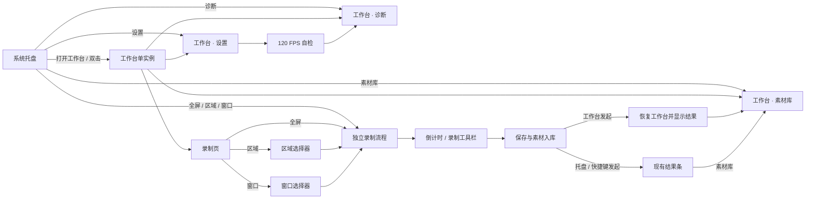
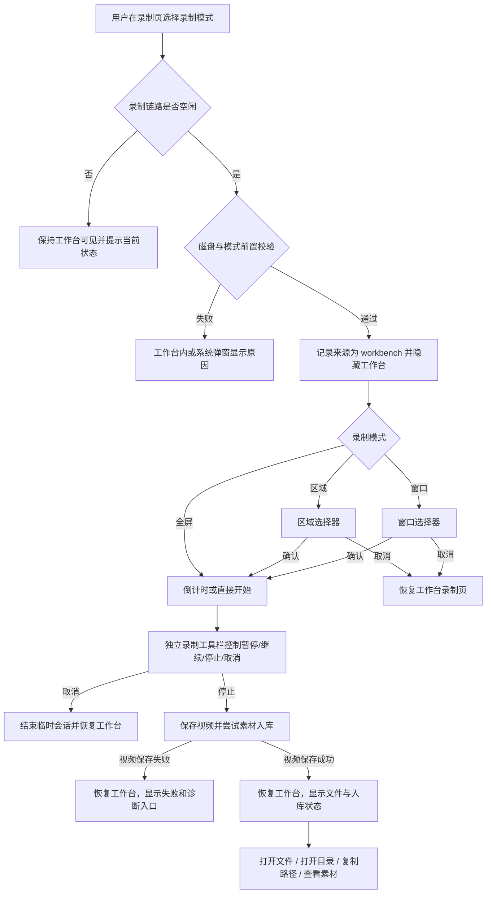
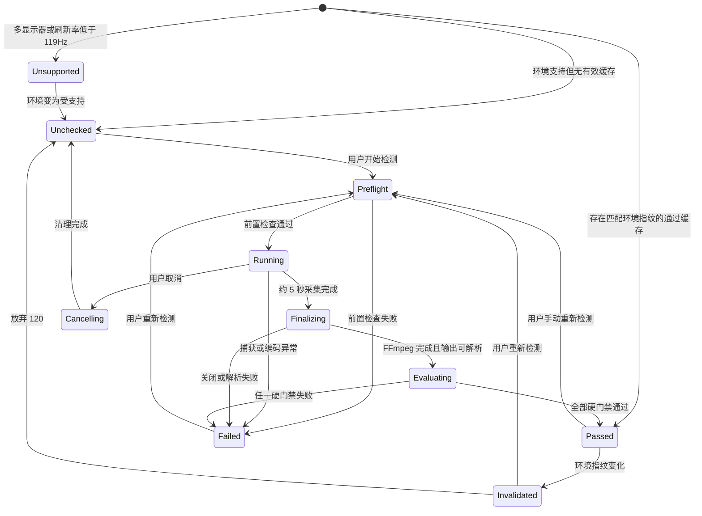

# QuickRec Full v1.8 产品需求文档

## 0. 文档信息

| 项目 | 内容 |
| --- | --- |
| 产品 | QuickRec Full |
| 版本 | v1.8 |
| 文档版本 | PRD v1.0 |
| 文档状态 | 已确认，进入开发承接 |
| 当前正式版本 | v1.7 |
| 编写日期 | 2026-07-23 |
| PRD 类型 | 混合型：工作台为正式推进型；120 FPS 为带真实硬件技术门禁的条件推进型 |
| 上游需求池 | `doc/archive/ideas/mypm-idea-pool-v1.8-2026-07-23.md` |
| 当前事实源 | `README.md`、`doc/current.md`、`doc/releases/v1.7/` |
| 原型输出目录 | `doc/releases/v1.8/prototype/` |
| 产品线边界 | 仅 QuickRec Full；不修改 QuickRec Lite |
| 开发授权 | 已获得（2026-07-23）；必须按前置治理、原型和 120 FPS 技术门禁分阶段实施 |

### 0.1 阶段判断

本版本同时承接两条正式产品主线：

1. **Full 工作台基础壳与完整视觉改版**：属于正式推进范围。
2. **单显示器 1080p120 全屏录制**：产品方向已确认，但当前缺少真实 1080p120 性能、稳定性和音画同步证据，必须先通过可证伪的技术门禁。

两条主线可以分阶段、并行承接，但不能互相掩盖状态：

- 工作台完成原型确认后，可以进入 PyQt 实现。
- 120 FPS 只有在真实硬件技术门禁通过后，才能从验证代码进入正式产品链路。
- 120 FPS 门禁未通过时，工作台可以继续开发，但 v1.8 不得自动发布，也不得由开发人员自行移除 120 FPS 范围；必须由产品负责人决定延期版本或重新授权调整版本范围。

### 0.2 交付门禁

| 门禁 | 内容 | 通过条件 | 未通过处理 |
| --- | --- | --- | --- |
| G0 开发前治理 | 配置保存 Bugfix、旧模块和过期打包项清理 | 独立提交、全量回归通过、无运行时或回滚依赖 | 不进入 v1.8 功能提交 |
| G1 PRD 确认 | 本文范围、交互、数据和验收口径 | 产品负责人明确确认 | 继续修改 PRD，不写 dev plan |
| G2 原型确认 | 四个一级页面、浮动录制界面、关键状态和控件契约 | 高保真 HTML 原型通过用户确认 | 不进入工作台 PyQt 实现 |
| G3 120 FPS 技术门禁 | 单显示器 1920×1080、dxcam、libx264 superfast、约 5 秒自检 | 满足全部硬指标，形成真实证据 | 停止正式接入，等待产品决策 |
| G4 开发与自动验证 | 功能实现、单元/集成/UI/静态/打包检查 | 本 PRD 验收项和质量门禁通过 | 进入定向 Bugfix |
| G5 GUI 与硬件验收 | 工作台、DPI、三种录制、四类音频、1080p120 | 锁定候选包真实验收全部通过 | 不进入发布收口 |
| G6 发布授权 | 文档、产物、回滚点和发布状态一致 | 产品负责人明确授权 | 不 commit/push/tag/Release |

---

## 1. 版本定位

QuickRec Full v1.8 是从“托盘工具 + 多个独立窗口”向“托盘常驻 + 统一创作者工作台”演进的基础版本，同时补齐高刷新率显示环境下正式输出 120 FPS 视频的第一条受控能力链路。

本版本不建设完整剪辑工作台。工作台只统一承接已经存在且已验证的录制、素材库、设置和诊断能力；不引入项目模型、多轨、预览、剪辑、导出队列或 AI。

120 FPS 也不是捕获后端重写。本版本继续使用现有 dxcam、FFmpeg 和 `libx264 superfast`，先在明确的单显示器 1080p120 基线上证明捕获、编码、音频和保存链路可以成立，再提供用户可控的正式选项。

### 1.1 一句话目标

让 QuickRec Full 在保持托盘轻启动和现有录制稳定性的前提下，提供统一、现代、可持续扩展的四页工作台，并在通过真实硬件门禁后可靠完成单显示器 1080p120 全屏录制。

### 1.2 版本成功定义

v1.8 只有在以下条件同时满足时才算成功：

- 用户可从托盘及既有入口打开同一个工作台，并在录制、素材库、设置、诊断之间稳定切换。
- 工作台发起录制时，选择器、倒计时、录制工具栏和保存结果形成完整闭环。
- 所有现有素材管理、设置和诊断能力在嵌入后不回退。
- 新视觉在单显示器 100%、125%、150% DPI 下可用，无明显裁切、重叠、溢出或不可点击控件。
- 120 FPS 只在有效自检和录制前快速校验通过后启用。
- 1080p120 四类音频模式、帧率稳定性、音画同步和长时录制达到量化标准。
- 30/60 FPS、区域录制、窗口录制、素材入库、配置和诊断能力无回归。

---

## 2. 背景与证据

### 2.1 当前产品事实

QuickRec Full v1.7 已正式发布，当前主要能力包括：

- 全屏、区域、窗口录制。
- 30/60 FPS，四类音频模式。
- 中央素材索引、待入库恢复、搜索、筛选、排序、目录重建和素材文件操作。
- 设置、快捷键、磁盘检查、诊断复制/打开目录/导出。
- 托盘、快捷键、浮动录制工具栏和结果条。

当前产品入口仍然分散：

- `QuickRecApp` 同时协调启动、托盘、录制、设置、素材库、诊断和反馈。
- 素材库是独立 `MaterialLibraryDialog`。
- 设置是每次新建并执行的模态 `SettingsDialog`。
- 诊断入口同时出现在设置和托盘。
- 录制工具栏独立承担倒计时、录制状态、保存状态和结果状态。

当前高帧链路尚不成立：

- 设置页只有 30/60 FPS。
- `ScreenCapturer` 以 `target_fps=60` 启动 dxcam。
- `RecorderManager` 虽读取配置 FPS，但捕获端仍固定 60。
- 磁盘空间估算接收 FPS 参数但当前未使用。
- 项目没有 1080p120 的捕获率、编码队列、音画同步或长时录制证据。

### 2.2 问题定义

#### P-01 入口与窗口关系分散

用户需要在托盘菜单、独立素材库、独立设置和诊断操作之间切换，产品缺少统一信息架构。继续新增功能会进一步增加入口和窗口协调成本。

证据状态：**强**。可由 `src/main.py`、`src/ui/tray_icon.py`、`src/ui/material_library_dialog.py` 和 `src/ui/settings_dialog.py` 直接确认。

#### P-02 现有视觉缺少统一产品语言

当前窗口主要依赖 Qt Fusion 默认样式，并混用 emoji、字符图标和文本按钮。录制、素材、设置、诊断及浮动窗口在层级、间距、状态色和图标表达上不一致。

证据状态：**中强**。现有源码和窗口原型可确认，仍需在原型阶段补齐真实截图盘点。

#### P-03 120Hz 设备无法获得真实 120 FPS 输出

当前捕获链路固定为 60 FPS。即使直接把编码 FPS 改为 120，也可能产生重复帧、队列堆积、编码阻塞、音画偏移或伪 120 FPS 文件。

证据状态：**强（代码限制）/弱（真实性能）**。代码限制明确，但尚无真实 1080p120 性能数据。

#### P-04 质量门禁未覆盖即将变化的核心边界

当前 coverage 排除 `main.py` 和全部 UI，ruff 排除多个核心 UI，mypy 仅覆盖部分文件；CI 仍包含旧分支且没有 packaging smoke。

证据状态：**强**。可由 `pyproject.toml` 和 `.github/workflows/ci.yml` 直接确认。

### 2.3 机会判断

- 工作台可以在不引入项目/剪辑模型的前提下，统一现有能力并建立后续产品扩展容器。
- 120 FPS 可以用明确门禁把高风险能力拆成“先证明、再接入”，避免用配置项伪装技术可行性。
- 两条主线共同要求更清晰的状态协调、配置事务和质量门禁，因此适合在同一大版本内分里程碑推进。

---

## 3. 目标与非目标

### 3.1 产品目标

| ID | 目标 | 量化结果 |
| --- | --- | --- |
| OBJ-01 | 建立统一工作台 | 四个一级页面全部嵌入同一个全局单实例窗口 |
| OBJ-02 | 统一入口与页面路由 | 托盘、双击托盘、结果入口和快捷入口均路由到同一工作台及目标页面 |
| OBJ-03 | 保持录制专注体验 | 选择器、倒计时和录制工具栏继续独立浮动；工作台发起录制时自动隐藏和恢复 |
| OBJ-04 | 完成视觉改版 | 四页工作台及相关浮动窗口形成统一组件、图标、状态和间距规范 |
| OBJ-05 | 提供受控 120 FPS | 通过真实门禁后，单显示器 1080p 全屏可选择并实际输出 120 FPS |
| OBJ-06 | 保护失败边界 | 自检、快速校验、编码或性能异常不损坏已保存视频，不静默伪装成功或降级 |
| OBJ-07 | 扩大真实质量覆盖 | 新增/修改模块语句覆盖率不低于 80%，项目总体覆盖率不低于 80% |

### 3.2 用户价值

- 用户不必记住多个独立入口，能够在一个窗口内完成录制前配置、录制后管理和诊断。
- 用户在 120Hz 及以上单显示器上可以主动验证设备能力，而不是盲目选择可能无效的 120 FPS。
- 用户可以明确知道本次录制的有效模式、FPS、保存结果和素材入库状态。
- 失败时用户获得可操作的原因、诊断入口和恢复选择，不会因为索引、自检或性能问题误判视频已经丢失。

### 3.3 明确非目标

v1.8 不包含：

- 多显示器正式支持。
- 4K 正式支持、4K120 或 1440p120 发布承诺。
- WGC 捕获后端。
- NVENC、QSV、AMF 等硬件编码正式接入。
- 素材预览或静态首帧。
- 项目模型、工程文件或项目分类。
- 多轨、剪辑、时间线。
- 导出队列。
- AI、字幕、摘要、章节、标签或云同步。
- 主题系统、深浅色切换或皮肤市场。
- QuickRec Lite 改动。
- 全量重写 `QuickRecApp`、`MaterialLibraryDialog` 或 `RecorderManager`。
- 通过增加数据库解决工作台状态问题。
- 以 Figma 文件作为开发或发布必需依赖。

---

## 4. 用户角色与核心场景

### 4.1 用户角色

| 角色 | 主要任务 | v1.8 关注点 |
| --- | --- | --- |
| 快速录制用户 | 用托盘或快捷键立即录制并保存 | 不被工作台强制打断；保留现有轻入口和结果条 |
| 内容创作者 | 录制前检查质量/音频，录制后管理素材 | 统一工作台、清晰状态、素材库和诊断 |
| 高刷新率用户 | 在 120Hz/144Hz/165Hz 单显示器录制高速内容 | 真实 120 FPS、自检、失败保护、音画同步 |
| 排障用户 | 处理保存、音频、FFmpeg 或素材入库异常 | 独立诊断页、明确失败阶段和可导出证据 |
| 维护者 | 扩展工作台、录制和打包能力 | 清晰职责边界、增量质量门禁和可回滚配置 |

### 4.2 核心场景

#### SC-01 托盘打开工作台并录制

用户启动 QuickRec 后应用只驻留托盘。用户选择“打开工作台”，在录制页检查当前质量/FPS/音频摘要，点击全屏录制。工作台隐藏，倒计时和工具栏接管录制；保存完成后工作台恢复并展示结果。

#### SC-02 快捷键快速录制

用户不打开工作台，直接使用快捷键开始全屏、区域或窗口录制。录制完成后仍显示现有结果条，结果条的“素材库”打开同一个工作台并切换到素材库页。

#### SC-03 管理跨目录素材

用户从托盘“素材库”进入工作台素材页，继续使用 v1.7 的搜索、筛选、排序、详情、重建、重新定位、待入库重试和回收站能力。

#### SC-04 修改设置并处理未保存内容

用户在设置页修改保存路径、画质、FPS、音频或快捷键。切换页面或关闭工作台时，系统提示保存、放弃或取消。保存失败时停留原页并保留输入。

#### SC-05 首次启用 120 FPS

用户在 120Hz 及以上单显示器中选择 120 FPS，系统要求执行约 5 秒自检。自检通过后控件选中 120，但只有点击“保存”才生效。失败时保留原 FPS，并提供查看诊断和重新检测。

#### SC-06 120 FPS 录制前环境变化

用户已经通过自检，但显示刷新率、保存磁盘、硬件身份、FFmpeg 版本或关键编码配置发生变化。开始录制前缓存失效，系统要求重新检测或仅本次使用 60 FPS，不得静默降级。

---

## 5. 范围与优先级

| 优先级 | 范围 | 发布属性 |
| --- | --- | --- |
| P0 | 配置保存失败 Bugfix 与旧模块治理前置门禁 | 开发前阻塞 |
| P0 | 工作台壳、四页导航、入口统一、生命周期和设置脏状态 | v1.8 主线 |
| P0 | 高保真 HTML 原型与视觉组件规范 | 工作台实现前阻塞 |
| P0 | 1080p120 技术门禁、自检状态机和量化证据 | 120 正式接入前阻塞 |
| P0 | 120 FPS 全屏正式链路、快速校验、失败保护和诊断 | v1.8 主线 |
| P0 | 30/60 FPS、区域/窗口、四类音频、素材和诊断回归 | 发布阻塞 |
| P1 | 浮动选择器、倒计时、工具栏和结果条视觉统一 | v1.8 视觉交付 |
| P1 | 1440p120 实验记录 | 非发布阻塞，不形成承诺 |
| P1 | 受影响模块职责拆分与质量门禁扩展 | 工程支撑 |

---

## 6. 信息架构

### 6.1 一级结构

```text
QuickRec Full
├── 托盘常驻
│   ├── 打开工作台
│   ├── 开始全屏录制
│   ├── 开始区域录制
│   ├── 开始窗口录制
│   ├── 素材库
│   ├── 设置
│   ├── 诊断
│   └── 退出 QuickRec
├── 工作台（全局单实例）
│   ├── 录制
│   ├── 素材库
│   ├── 设置
│   └── 诊断
├── 独立浮动界面
│   ├── 区域选择器
│   ├── 窗口选择器
│   ├── 倒计时
│   ├── 录制工具栏
│   └── 托盘/快捷键录制结果条
└── 系统级反馈
    ├── 磁盘警告
    ├── 120 FPS 能力检测
    ├── 未保存设置确认
    ├── 素材操作确认
    ├── 系统通知
    └── 诊断导出结果
```

### 6.2 页面关系图



### 6.3 入口路由矩阵

| 入口 | 空闲时行为 | 录制中行为 | 目标页面/窗口 |
| --- | --- | --- | --- |
| 启动 QuickRec | 只驻留托盘，不自动弹窗 | 不适用 | 无 |
| 托盘“打开工作台” | 显示或激活现有工作台 | 显示工作台只读录制状态 | 上次页；进程首次为录制页 |
| 双击托盘图标 | 等同“打开工作台” | 等同“打开工作台” | 同上 |
| 托盘“素材库” | 打开/激活工作台并切换 | 可查看素材，录制状态只读 | 素材库页 |
| 托盘“设置” | 打开/激活并切换 | 打开设置页，但录制相关项按规则禁用 | 设置页 |
| 托盘“诊断” | 打开/激活并切换 | 允许查看和导出诊断 | 诊断页 |
| 结果条“素材库” | 打开/激活并切换，选中刚保存素材 | 同一进程保存完成后使用 | 素材库页 |
| 工作台录制模式按钮 | 隐藏工作台并进入对应录制链路 | 禁用 | 独立选择器/倒计时/工具栏 |
| 托盘/快捷键录制 | 保留现有轻入口 | 忽略重复开始 | 独立选择器/倒计时/工具栏 |

---

## 7. 工作台完整功能链路

### 7.1 启动与打开

1. QuickRec 启动并完成配置、日志、素材索引、待入库恢复、快捷键和托盘初始化。
2. 启动后不显示工作台，即不自动弹出工作台。
3. 用户点击托盘“打开工作台”或双击托盘图标。
4. 如果工作台尚未创建，则创建唯一实例并进入录制页。
5. 如果工作台已存在但隐藏，则恢复上次同进程页面。
6. 如果工作台已显示，则只执行置前、恢复最小化和激活，不创建第二实例。
7. 如果保存的窗口位置不可见，则在当前主显示器可见工作区内居中恢复。

### 7.2 工作台发起录制



### 7.3 工作台隐藏与恢复规则

- 只有从工作台发起录制时，工作台在前置校验通过后隐藏。
- 区域或窗口选择取消、倒计时取消、启动失败、录制取消、保存成功或保存失败后，均恢复工作台。
- 恢复后默认显示录制页结果区域，不强制跳转素材库。
- 若用户在录制中主动重新打开工作台，工作台保持可见；保存完成时不得重复创建或抢占用户当前页面，只更新状态并提供非侵入式结果提示。
- 从托盘或快捷键发起的录制不自动打开工作台，继续使用现有结果条。
- 同一保存事件只能出现一套主结果反馈：工作台来源使用工作台结果区；托盘/快捷键来源使用结果条。

### 7.4 录制中重新打开工作台

- 左侧导航仍可切换。
- 录制页展示模式、已录制时长、当前有效 FPS、音频模式和“控制请使用浮动工具栏”。
- 工作台内不提供暂停、继续、停止或取消按钮，避免出现第二套控制状态源。
- 设置页中会影响当前录制或编码的控件禁用；查看型内容仍可使用。
- 诊断页可复制、打开和导出当前诊断信息。
- 素材库可查看历史素材，但重建、迁移等长任务是否禁用由实现根据资源冲突确定；不得影响当前视频保存。

### 7.5 关闭与退出

- 点击工作台标题栏关闭按钮只隐藏工作台，不结束 QuickRec。
- 切换页面或关闭前，若设置页或诊断目录存在未保存修改，先进入保存/放弃/取消保护流程。
- 选择“取消”时终止本次切换或关闭。
- 选择“放弃”时恢复最近一次持久化值，再继续切换或隐藏。
- 选择“保存”时只有持久化和必要系统副作用全部成功，才能继续切换或隐藏。
- 只有托盘“退出 QuickRec”结束应用。
- 退出时沿用现有规则：若正在录制，安全停止并等待保存；超时或失败写入诊断日志。

---

## 8. 工作台窗口与全局状态

### 8.1 窗口规格

| 项目 | 要求 |
| --- | --- |
| 默认尺寸 | 约 1200×760 |
| 最小尺寸 | 960×640 |
| 默认位置 | 当前主显示器可见工作区居中 |
| 窗口类型 | 标准桌面主窗口，不置顶 |
| 左侧导航 | 固定窄侧栏，不提供折叠模式 |
| 右侧内容 | 页面容器，按当前一级页面切换 |
| 单实例 | 全进程只允许一个 `WorkbenchWindow` |
| 关闭行为 | 隐藏到托盘 |
| 最大化 | 允许 |
| 位置恢复 | 保存大小和位置；显示环境改变后夹取到可见工作区 |

### 8.2 工作台状态模型

| 状态 | 含义 | 可用行为 |
| --- | --- | --- |
| `not_created` | 尚未创建工作台 | 任一入口创建 |
| `hidden` | 已创建但隐藏 | 恢复并激活 |
| `visible_idle` | 可见且未录制 | 四页完整操作 |
| `visible_recording` | 录制中被用户重新打开 | 查看录制状态，录制控制仍由工具栏负责 |
| `hidden_recording` | 工作台发起录制后隐藏 | 等待取消、失败或保存后恢复 |
| `settings_dirty` | 设置或诊断目录有未保存修改 | 页面切换/关闭触发保护 |
| `self_test_running` | 120 FPS 自检中 | 禁止开始录制和修改相关设置，允许取消 |
| `saving` | 视频正在完成编码/混音/入库 | 显示只读保存状态，不重复发起录制 |
| `result` | 工作台来源录制已完成 | 展示结果和后续操作 |

### 8.3 页面记忆规则

- 进程首次打开工作台固定进入录制页。
- 同一进程内隐藏再打开，恢复上次一级页面。
- 应用重启后重新进入录制页。
- “上次页面”只保存在内存，不写入配置。
- 窗口大小和位置需要持久化。

---

## 9. 页面功能与交互规则

### 9.1 全局框架

#### 9.1.1 固定区域

- 左侧依次为 QuickRec 标识、录制、素材库、设置、诊断。
- 当前页面有明确选中状态。
- 底部显示应用状态：空闲、录制中、已暂停、保存中或自检中。
- 右侧页面顶部显示页面名称、简短状态摘要和必要的主操作。
- 导航图标、页面图标和状态图标使用统一 QuickRec 图标体系。

#### 9.1.2 全局导航控件契约

| 控件 | 触发条件 | 操作结果 | 成功反馈 | 失败反馈 | 禁用规则 |
| --- | --- | --- | --- | --- | --- |
| 录制导航 | 工作台已显示 | 切换到录制页 | 导航选中并显示当前录制摘要 | 页面加载异常时保留原页并记录日志 | 设置脏状态未处理前不执行切换 |
| 素材库导航 | 工作台已显示 | 切换并刷新素材查询结果 | 显示总数、匹配数和列表 | 索引加载失败时显示错误状态与诊断入口 | 设置脏状态未处理前不执行切换 |
| 设置导航 | 工作台已显示 | 切换到设置页并加载持久化配置 | 显示当前有效设置 | 配置读取异常时使用明确错误状态，不伪装成功 | 设置脏状态未处理前不执行其他切换 |
| 诊断导航 | 工作台已显示 | 切换到诊断页 | 显示有效诊断目录和当前诊断摘要 | 日志目录不可用时显示原因和修复建议 | 设置脏状态未处理前不执行切换 |

### 9.2 录制页

#### 9.2.1 页面内容

- 三个录制模式入口：全屏、区域、窗口。
- 当前设置摘要：画质、用户保存 FPS、各模式有效 FPS、音频模式、保存路径摘要。
- 当前录制状态：空闲、选择中、倒计时、录制中、暂停、保存中、完成或失败。
- 120 FPS 能力状态：未检测、已通过、缓存失效、不可用或检测失败。
- 设置入口。
- 工作台来源录制的结果区域。

录制页不得重复放置完整保存路径、画质、音频、快捷键或诊断编辑表单。

#### 9.2.2 控件契约

| 控件 | 触发条件 | 操作结果 | 成功反馈 | 失败反馈 | 禁用规则 |
| --- | --- | --- | --- | --- | --- |
| 全屏录制 | 空闲且非自检 | 执行磁盘和 FPS 快速校验，隐藏工作台并进入倒计时/录制 | 浮动工具栏显示有效 FPS 和计时 | 显示具体前置校验或启动失败原因 | 非空闲、自检中、保存中禁用 |
| 区域录制 | 空闲且非自检 | 若全局为 120，提示本次按 60；隐藏工作台并打开区域选择器 | 选区确认后进入倒计时/录制 | 选择取消恢复工作台；启动失败显示原因 | 非空闲、自检中、保存中禁用 |
| 窗口录制 | 空闲且非自检 | 若全局为 120，提示本次按 60；隐藏工作台并打开窗口选择器 | 选窗确认后进入倒计时/录制 | 选择取消或窗口不可用时恢复并提示 | 非空闲、自检中、保存中禁用 |
| 当前设置摘要 | 始终显示 | 只读展示有效配置 | 与配置和本次模式一致 | 无法读取时显示“配置不可用”并提供诊断入口 | 不可编辑 |
| 前往设置 | 工作台可切页 | 切换到设置页 | 定位到录制设置区域 | 脏状态处理失败时保持原页 | 自检中禁用 |
| 查看 120 状态 | 当前配置或环境涉及 120 | 切换到设置页能力检测区域 | 展示最近检测结论 | 无记录时展示未检测 | 自检中只显示进度 |
| 打开文件 | 工作台来源录制保存成功 | 调用默认播放器 | 状态区显示“已打开文件” | 文件缺失或系统调用失败时显示原因 | 保存失败或文件不存在时禁用 |
| 打开目录 | 工作台来源录制保存成功 | 打开文件所在目录 | 状态区显示“已打开目录” | 目录不存在或系统调用失败时显示原因 | 无有效路径时禁用 |
| 复制路径 | 工作台来源录制保存成功 | 复制完整路径 | 显示“路径已复制” | 剪贴板不可用时显示失败 | 无有效路径时禁用 |
| 查看素材 | 正式入库成功 | 切换素材库并选中新记录 | 素材详情与结果一致 | 索引加载失败时进入错误状态 | 未入库时改为显示入库失败状态，不执行跳转 |
| 重试入库 | 视频保存成功但正式入库失败 | 复用现有待入库重试 | 成功后状态改为已入库并可查看素材 | 保留视频成功事实，显示重试失败和诊断入口 | 无待入库记录或正在重试时禁用 |

#### 9.2.3 结果展示字段

- 保存状态。
- 文件名。
- 完整路径，允许复制；界面中可中间省略但不得丢失真实值。
- 时长。
- 实际输出分辨率。
- 实际目标 FPS 和实测有效 FPS。
- 音频模式。
- 素材入库状态。
- 120 FPS 稳定性提示。
- 打开文件、打开目录、复制路径、查看素材或重试入库。

### 9.3 素材库页

#### 9.3.1 迁移原则

- v1.7 的中央索引、待入库、查询、详情、恢复和文件操作能力全部保留。
- 用户不再看到独立素材库窗口入口。
- 允许将现有 `MaterialLibraryDialog` 的内容组件提取为可嵌入页面，但不重写素材索引、查询和恢复服务。
- v1.7 正式索引和待入库 JSON 格式不因工作台改造而迁移。
- 页面切换不得清空当前进程内的搜索、筛选、排序和加载数量。

#### 9.3.2 查询与列表控件契约

| 控件 | 触发条件 | 操作结果 | 成功反馈 | 失败反馈 | 禁用规则 |
| --- | --- | --- | --- | --- | --- |
| 关键词搜索 | 用户输入文件名或完整路径片段 | 文件名与路径按 OR 匹配，和筛选条件按 AND 组合 | 更新匹配数和列表 | 保留上一次有效结果并提示可重置 | 索引加载失败时禁用 |
| 状态筛选 | 选择全部/可用/待入库/入库失败/缺失/信息不完整 | 过滤正式素材和待入库项 | 显示匹配数 | 查询失败时保留上次结果 | 索引加载失败时禁用 |
| 模式筛选 | 选择全部/全屏/区域/窗口/未知 | 按录制模式过滤 | 列表和计数更新 | 同上 | 索引加载失败时禁用 |
| 音频筛选 | 选择全部/无声/系统声/麦克风/双音频/未知 | 按音频模式过滤 | 列表和计数更新 | 同上 | 索引加载失败时禁用 |
| 时间筛选 | 选择全部/今天/7/30/90 天 | 按录制时间过滤 | 列表和计数更新 | 同上 | 索引加载失败时禁用 |
| 排序 | 选择时间、时长或大小的升降序 | 对当前匹配结果稳定排序 | 列表顺序更新 | 同上 | 索引加载失败时禁用 |
| 重置条件 | 任一查询条件非默认 | 恢复默认查询和第一页 | 显示默认总览 | 重置异常时记录日志 | 全部默认时可保持可用 |
| 加载更多 50 条 | 正式匹配结果超过当前显示数量 | 增加下一批正式素材 | 显示数量更新，选择状态合理保留 | 查询失败时保留现有列表 | 无更多结果时隐藏或禁用 |
| 导入旧目录 | 素材任务空闲 | 选择旧目录并预览 v1.5 历史索引 | 确认后显示新增/重复/跳过统计 | 失败不改变中央索引 | 录制资源冲突或已有素材任务时禁用 |
| 重建目录 | 素材任务空闲 | 扫描目录并预览有效视频 | 确认后显示扫描/成功/已存在/跳过/失败统计 | 单文件失败不阻断其他文件；整体失败不改变索引 | 已有素材任务时禁用 |

#### 9.3.3 素材详情与操作契约

| 控件 | 触发条件 | 操作结果 | 成功反馈 | 失败反馈 | 禁用规则 |
| --- | --- | --- | --- | --- | --- |
| 选择素材行 | 列表存在记录 | 展示时间、时长、画面、FPS、模式、音频、大小、路径、诊断、来源和失败原因 | 详情与所选记录一致 | 记录异常时显示明确缺失字段 | 未选择时详情为空态 |
| 打开 | 文件可用 | 调用默认播放器 | 显示已打开 | 文件缺失或系统调用失败时提示 | 缺失状态禁用 |
| 打开目录 | 有可解析父目录 | 打开资源管理器 | 显示已打开目录 | 目录不可用时提示 | 无路径时禁用 |
| 复制路径 | 有路径 | 复制完整路径 | 显示路径已复制 | 剪贴板不可用时提示 | 无路径时禁用 |
| 重新定位 | 缺失或信息不完整 | 先验证候选视频，再事务更新路径和元数据 | 状态恢复且重启保持 | 原索引不变，允许再次重试 | 正常可用素材默认禁用 |
| 重试入库 | 待入库项 | 重新解析并写入正式索引 | 待入库项转为正式素材 | 保留待入库记录、视频和失败原因 | 非待入库项禁用 |
| 移除待处理记录 | 待入库项 | 确认后仅移除待处理索引 | 明确视频文件保留 | 写入失败时保持原记录 | 非待入库项禁用 |
| 从素材库移除 | 正式素材 | 确认后仅移除中央索引 | 明确视频文件保留 | 写入失败时保持原记录 | 待入库项禁用 |
| 删除视频文件 | 正式且文件存在 | 确认后移入 Windows 回收站并更新索引 | 明确已进入回收站 | 失败时保留记录并显示原因 | 缺失或待入库项禁用 |

#### 9.3.4 页面状态

- 加载中。
- 有结果。
- 无素材空状态。
- 查询无匹配结果。
- 索引加载失败。
- 索引从备份恢复。
- 待入库存在。
- 正式素材存在但文件缺失。
- 素材任务执行中、取消中、成功或失败。

空状态可以使用 `oil-visual` 生成的轻量说明视觉；错误、缺失和恢复状态只使用统一图标、文字和操作按钮。

### 9.4 设置页

#### 9.4.1 设置分组

- 保存：保存目录、画质。
- 录制：FPS、音频、倒计时、鼠标点击高亮。
- 系统：开机自启。
- 快捷键：开始、停止、暂停、区域、窗口。
- 120 FPS 能力：环境状态、最近检测、检测/重新检测。

诊断目录及诊断操作从设置页移除，统一进入诊断页。

#### 9.4.2 控件契约

| 控件 | 触发条件 | 操作结果 | 成功反馈 | 失败反馈 | 禁用规则 |
| --- | --- | --- | --- | --- | --- |
| 保存路径 | 点击浏览 | 选择有效目录并形成未保存值 | 字段显示候选目录 | 取消不改变；无权限显示原因 | 录制中、自检中禁用 |
| 画质 | 选择原生/High/720p/480p | 更新未保存画质 | 摘要同步显示候选值 | 无效值恢复原选择 | 录制中、自检中禁用 |
| FPS 30 | 选择 | 将候选 FPS 设为 30 | 显示候选状态 | 无 | 录制中、自检中禁用 |
| FPS 60 | 选择 | 将候选 FPS 设为 60 | 显示候选状态 | 无 | 录制中、自检中禁用 |
| FPS 120 | 单显示器刷新率达到 119Hz 且非录制 | 有有效缓存时选中；无有效缓存时打开能力检测 | 通过后自动成为未保存候选 | 不支持或检测失败时保留原有效 FPS | 刷新率不足、多显示器、录制中、自检中禁用，并显示原因 |
| 音频源 | 选择四类音频 | 更新未保存音频源 | 候选摘要更新 | 无效设备不在保存阶段伪装可用，录制前仍按现有预检处理 | 录制中禁用 |
| 开机自启 | 勾选/取消 | 形成未保存候选 | 保存成功后状态持久化 | 注册表或配置失败时整体保存失败并回滚 | 自检不影响；保存进行中禁用 |
| 录制倒计时 | 勾选/取消 | 控制倒计时开关 | 候选摘要更新 | 无 | 录制中禁用 |
| 倒计时秒数 | 倒计时开启 | 选择 1～10 秒 | 候选摘要更新 | 无效值恢复 | 倒计时关闭或录制中禁用 |
| 鼠标点击高亮 | 勾选/取消 | 控制桌面实时点击高亮 | 候选摘要更新 | 启动失败写日志，不写入视频帧 | 录制中禁用 |
| 快捷键编辑 | 点击后按组合键 | 更新对应未保存快捷键 | 显示规范化组合键 | 冲突或非法组合明确提示 | 录制中、自检中禁用 |
| 开始检测 | 无录制、自检未运行、环境满足基础条件 | 启动约 5 秒 120 FPS 自检 | 显示阶段和进度 | 显示具体失败阶段 | 自检中、录制中、环境不支持时禁用 |
| 取消检测 | 自检运行中 | 请求安全取消并清理临时文件 | 显示已取消，原 FPS 不变 | 清理失败写诊断但不保存通过缓存 | 非自检状态禁用 |
| 查看诊断 | 检测失败或存在历史记录 | 切换诊断页并定位 120 FPS 摘要 | 展示最近结果 | 无记录时显示未检测 | 无 |
| 保存 | 存在合法未保存修改 | 事务保存配置并应用必要系统副作用 | 显示保存成功，清除脏状态 | 保留输入、停留本页、显示失败字段与原因 | 无修改、保存中、自检中禁用 |
| 放弃更改 | 存在未保存修改 | 恢复最近持久化值 | 清除脏状态 | 配置重新读取失败时保留当前输入并提示 | 无修改时禁用 |

#### 9.4.3 配置保存事务

配置保存必须满足：

1. 在内存中构造候选配置并完成格式、路径、快捷键和 120 缓存校验。
2. 先写入临时文件并执行原子替换，不直接破坏现有配置。
3. 涉及开机自启等系统副作用时，记录变更前状态。
4. 任一步失败时恢复内存配置、配置文件和已发生的系统副作用。
5. `ConfigManager.save()` 必须返回可判断的成功/失败结果，不得吞掉异常后继续显示成功。
6. 保存失败时设置页保持可见，用户输入和脏状态保留。
7. 成功后才重绑快捷键、更新录制摘要并允许离开页面。

该事务能力由独立 v1.7.x Bugfix 先行修复；v1.8 只复用并回归，不把它包装为工作台新增价值。

#### 9.4.4 未保存保护

切换一级页面、关闭工作台或退出应用时，如设置存在未保存内容，显示三按钮确认框：

| 选项 | 行为 |
| --- | --- |
| 保存 | 执行事务保存；成功后继续原操作，失败则停留设置页 |
| 放弃 | 恢复持久化值并继续原操作 |
| 取消 | 关闭确认框并取消原操作 |

系统关机或进程被强制结束不承诺保存未提交设置。

### 9.5 诊断页

#### 9.5.1 页面内容

- 当前有效诊断目录。
- 更改诊断目录。
- 保存诊断目录。
- 复制诊断信息。
- 打开日志目录。
- 导出诊断文件。
- 最近录制/保存/素材入库错误摘要。
- 最近 120 FPS 自检状态、时间、环境摘要、平均/最低 FPS、失败阶段和原因。

#### 9.5.2 控件契约

| 控件 | 触发条件 | 操作结果 | 成功反馈 | 失败反馈 | 禁用规则 |
| --- | --- | --- | --- | --- | --- |
| 诊断目录 | 点击浏览 | 选择候选诊断目录 | 显示候选值和未保存状态 | 取消不改变；不可写时显示原因 | 保存进行中禁用 |
| 保存诊断目录 | 候选目录合法且已变化 | 事务保存目录配置 | 显示“诊断目录已保存” | 保留候选值并显示失败原因 | 无修改或保存中禁用 |
| 复制诊断信息 | 页面可用 | 生成本地诊断文本并写入剪贴板 | 显示“诊断信息已复制” | 显示“复制失败，可尝试导出” | 剪贴板不可用时仍可点击并获得失败反馈 |
| 打开日志目录 | 当前显示目录有效 | 创建/打开目录 | 显示实际打开目录 | 权限或系统调用失败时显示原因 | 无 |
| 导出诊断文件 | 当前显示目录可写 | 生成本地 UTF-8 文本文件 | 显示完整导出路径 | 保留页面并显示权限/写入错误 | 导出进行中禁用 |
| 重新检测 120 FPS | 环境支持且未录制 | 切回/展开能力检测流程 | 显示进度和结果 | 显示失败阶段 | 录制中、自检中禁用 |

诊断目录编辑使用显式保存。用户在未保存时离开诊断页或关闭工作台，采用与设置页相同的保存/放弃/取消保护。

---

## 10. 浮动窗口与系统反馈

### 10.1 保留独立窗口

| 界面 | 是否嵌入工作台 | v1.8 变化 | 核心行为是否变化 |
| --- | --- | --- | --- |
| 区域选择器 | 否 | 更新提示、边框、按钮和图标视觉 | 否 |
| 窗口选择器 | 否 | 更新列表层级、选中态、确认/取消视觉 | 否 |
| 倒计时 | 否 | 统一字体、状态色、取消提示 | 否 |
| 录制工具栏 | 否 | 统一图标、状态、按钮尺寸和 120 FPS 标识 | 否 |
| 结果条 | 否，仅托盘/快捷键来源 | 统一视觉，素材入口路由到工作台 | 不改变保存与入库语义 |
| 点击高亮 | 否 | 保持实时桌面提示，不写入视频 | 否 |
| 窗口高亮框 | 否 | 仅视觉一致性打磨 | 否 |

### 10.2 录制工具栏

工具栏继续是暂停、继续、停止和取消的唯一录制控制源。

每个按钮必须有统一图标和工具提示：

| 控件 | 结果 | 失败反馈 | 禁用规则 |
| --- | --- | --- | --- |
| 暂停 | 暂停录制计时和有效帧写入 | 状态转换失败写日志并保持原状态 | 非录制状态禁用 |
| 继续 | 恢复录制 | 恢复失败显示系统通知 | 非暂停状态禁用 |
| 停止 | 进入保存状态 | 保存失败进入明确失败结果 | 保存中禁用 |
| 取消 | 请求取消并清理会话临时文件 | 清理失败写诊断 | 保存中按现有安全规则禁用 |
| 拖动区域 | 移动工具栏 | 保持在可见区域 | 按钮区域不得触发拖动 |

工具栏必须显示：

- 当前模式。
- 录制/暂停状态。
- 已录制时长。
- 本次有效目标 FPS；120 FPS 时明确显示“120 FPS”。
- 保存中状态。

### 10.3 结果条

结果条仅用于托盘或快捷键发起的录制，保留自动关闭行为。其“素材库”按钮必须打开工作台并切换素材库页；入库失败时仍复用现有短时“重试入库”能力。

本版本不新增持久恢复中心，也不改变 v1.7 待入库素材库入口。

---

## 11. 视觉改版需求

### 11.1 视觉定位

QuickRec Full v1.8 定位为现代创作者桌面工具：

- 浅色主工作区。
- 深色窄侧栏。
- 蓝色主操作色。
- 绿色表示成功，黄色表示警告，红色表示失败或破坏性操作。
- 信息密度适中，适合高频使用和快速扫描。
- 页面分区以排版、分隔线和留白为主，不把每个区块都做成浮动卡片。
- 不制作营销式大标题、超大卡片、渐变背景、装饰性光球或无业务意义插画。

### 11.2 建议设计令牌

以下令牌用于原型起点，允许在用户确认原型时小范围调整，但语义不得改变：

| 类型 | 建议值 |
| --- | --- |
| 侧栏背景 | `#20242B` |
| 主工作区背景 | `#F5F7FA` |
| 内容表面 | `#FFFFFF` |
| 主文本 | `#1F2937` |
| 次级文本 | `#667085` |
| 边框 | `#D9DEE8` |
| 主操作蓝 | `#2563EB` |
| 成功绿 | `#16A34A` |
| 警告黄 | `#D97706` |
| 失败红 | `#DC2626` |
| 圆角 | 控件 4～6 px，独立内容容器不超过 8 px |
| 间距 | 以 4 px 为基础，常用 8/12/16/24 px |
| 正文字号 | 13～14 px |
| 页面标题 | 20～24 px，不使用营销级大字 |
| 按钮高度 | 紧凑 32 px，主要操作 36 px |
| 导航图标 | 20 px，统一线宽和视觉重心 |

### 11.3 字体与可访问性

- Windows 优先使用 `Microsoft YaHei UI`，英文和数字可回退 `Segoe UI`。
- 字间距为 0，不使用负字间距。
- 文字与背景满足可读对比度。
- 所有图标按钮提供工具提示和无障碍名称。
- 键盘 Tab 顺序符合视觉顺序。
- 主操作、取消和破坏性操作不能只靠颜色区分。
- 长路径和长文件名允许换行、中间省略和完整悬浮提示，不得挤压相邻控件。

### 11.4 图标规则

- 使用 `oil-icon` 产出统一 QuickRec 产品图标。
- 覆盖导航、全屏/区域/窗口、打开、目录、复制、搜索、筛选、排序、导入、重建、重新定位、重试、移除、回收站、设置、诊断、自检、成功、警告和失败。
- 同一语义在工作台、托盘、工具栏和弹窗中使用同一图标。
- 禁止继续混用 emoji、Unicode 字符图标、手绘 SVG 和不同线宽图标。
- 图标必须以本地静态资源随包发布，不依赖网络。

### 11.5 轻量说明视觉

`oil-visual` 只允许用于：

- 素材库无素材空状态。
- 首次进入工作台时必要且短小的说明视觉。

不得用于：

- 错误。
- 警告。
- 诊断。
- 录制中。
- 自检失败。
- 磁盘不足。

这些状态统一使用图标、标题、原因和可执行操作。

### 11.6 视觉设计流程

视觉工作必须按以下顺序形成可追溯产物：

1. `oiloil-ui-ux-guide`：建立窗口、排版、状态、DPI 和可访问性规则。
2. `draw-ui`：输出四个页面和浮动窗口的高保真布局。
3. `oil-icon`：补齐统一产品图标。
4. 实际截图对照：逐窗口核对现有控件和真实业务状态，避免原型脱离实现。
5. `oil-visual`：只补素材空状态和必要说明视觉。

上述工具只服务设计过程，不构成产品运行时依赖。

---

## 12. 高保真 HTML 原型

### 12.1 输出要求

原型输出到：

```text
doc/releases/v1.8/prototype/
├── index.html
├── prototype-design.md
├── assets/
└── screenshots/
```

`index.html` 必须可通过本地 HTTP 服务打开并交互。`prototype-design.md` 说明信息架构、组件、状态、交互契约、与 PRD 条目的对应关系和打开方式。

### 12.2 原型范围

原型必须覆盖：

- 工作台录制页：空闲、录制中只读、保存中、成功、保存失败、入库失败。
- 素材库页：有素材、空状态、无匹配、待入库、缺失、加载失败、任务执行。
- 设置页：默认、已修改、自检运行、自检通过、自检失败、保存失败。
- 诊断页：正常、导出成功、目录不可写、120 自检失败摘要。
- 区域选择器。
- 窗口选择器。
- 倒计时。
- 录制工具栏：录制、暂停、保存。
- 托盘/快捷键结果条：成功、入库失败。
- 未保存设置确认框。
- 120 FPS 检测前、进度、通过、失败、取消和快速校验失败对话框。
- 磁盘警告和阻断对话框。
- 素材移除、回收站、重新定位和重建确认状态。

### 12.3 控件就近契约

每个按钮、菜单、输入项和状态入口必须在对应原型页面附近说明：

- 触发条件。
- 操作结果。
- 成功反馈。
- 失败反馈。
- 禁用规则。

不得把全部控件说明集中到与页面无关联的单独总表。说明可以采用编号标注、侧边说明区或可点击注释层，但必须能从控件直接定位。

### 12.4 原型确认门禁

进入 PyQt 工作台实现前必须获得用户明确确认：

- 四页布局和层级。
- 左侧导航。
- 录制页模式入口和结果区。
- 素材库列表/详情/恢复操作。
- 设置脏状态与 120 自检。
- 诊断页。
- 浮动工具栏和关键弹窗。
- 图标风格。
- 100%、125%、150% DPI 的响应策略。

未确认原型时，只允许继续补原型和设计说明，不允许以“先写代码再调 UI”绕过门禁。

---

## 13. 120 FPS 功能需求

### 13.1 支持边界

| 维度 | 正式范围 |
| --- | --- |
| 显示器 | 单显示器 |
| 刷新率 | 系统报告不低于 119Hz |
| 正式门禁分辨率 | 1920×1080 |
| 正式录制模式 | 全屏 |
| 区域/窗口 | 最高 60 FPS |
| 可选画质 | 1080p、720p、480p；原生超过 1080p 时自动适配 1080p |
| 捕获后端 | dxcam |
| 编码器 | FFmpeg `libx264`、`superfast` |
| 音频 | 无声、系统声音、麦克风、系统声音＋麦克风 |
| 1440p120 | 可记录实验结果，不形成正式承诺或发布阻塞 |
| 多显示器/4K | 不支持，不进入本版验收 |

### 13.2 配置兼容

- 新安装默认 FPS 仍为 30。
- 升级用户保留现有合法 30/60 FPS。
- 设置候选值只允许 30、60、120。
- 120 只由用户主动选择。
- 如果旧配置含未知 FPS，加载时回退 30 并写诊断日志。
- 全局保存值为 120 时：
  - 全屏录制尝试 120。
  - 区域和窗口本次固定使用 60，并在开始前提示。
  - 不修改持久化的全屏 120 设置。
  - 素材元数据记录本次实际目标 FPS 60。

### 13.3 环境探测

设置页加载时检测：

- 活跃显示器数量。
- 主显示器当前宽度、高度和刷新率。
- FFmpeg 是否存在并可执行。
- 当前保存目录所在卷。
- 当前有效编码配置。
- 是否存在与当前环境指纹匹配的通过缓存。

规则：

- 活跃显示器不是 1 台时，120 选项禁用并说明“v1.8 仅支持单显示器 120 FPS”。
- 刷新率低于 119Hz 时，120 选项禁用并说明当前刷新率。
- 119Hz 及以上显示器可进入自检，不代表已经通过。
- 120Hz、144Hz、165Hz 等环境均以目标输出 120 FPS 执行自检。

### 13.4 首次自检

#### 13.4.1 入口

无有效缓存时，用户选择 120 FPS，打开能力检测对话框。对话框至少展示：

- 当前分辨率和刷新率。
- 目标输出分辨率和 FPS。
- 当前编码器。
- 临时文件将写入当前保存目录并在结束后删除。
- “开始检测”“取消”“查看诊断”。

选择 120 本身不立即修改有效配置。

#### 13.4.2 自检阶段

1. `preflight`：确认单显示器、刷新率、FFmpeg、保存目录权限和磁盘空间。
2. `prepare`：生成隔离临时会话和目标 1080p/even-size 参数。
3. `capture_encode`：约 5 秒真实捕获并编码，采集帧数、时间桶和队列/写入延迟。
4. `finalize`：正常关闭 FFmpeg。
5. `probe`：使用包内 FFprobe 检查输出可解析、分辨率和帧率。
6. `evaluate`：计算平均有效 FPS、连续 1 秒最低 FPS 和持续堆积。
7. `cleanup`：删除临时输出和会话文件。
8. `result`：显示通过或具体失败阶段。

#### 13.4.3 硬门禁

自检必须同时满足：

- 平均有效帧率不低于 114 FPS。
- 任意连续 1 秒窗口的有效帧率不低于 108 FPS。
- 编码待处理时延 `backlog_ms` 不得连续 1 秒超过 500 ms。
- FFmpeg 正常退出，返回码为 0。
- 临时输出可被包内 FFprobe 解析。
- 输出视频流目标帧率为 120，分辨率不超过 1920×1080。
- 临时文件成功删除；清理异常需记录，但不把失败缓存写成通过。

`backlog_ms` 是捕获帧等待编码完成的归一化待处理时长。实现可使用有界队列深度或同步写入延迟计算，但诊断和测试必须统一输出毫秒值，不能只记录内部队列对象。

CPU/GPU 使用率只作为诊断信息，不单独决定通过或失败。

#### 13.4.4 通过、失败与取消

自检通过：

- 写入与环境指纹绑定的通过缓存。
- 设置页将 120 设为未保存候选值。
- 显示平均 FPS、连续 1 秒最低 FPS和检测时间。
- 用户仍需点击“保存”才让 120 成为有效配置。

自检失败：

- 不写通过缓存。
- 不改变当前有效 FPS。
- 不自动选择 60 或其他值。
- 显示失败阶段、原因和可读指标。
- 提供“重新检测”“查看诊断”“关闭”。

用户取消：

- 请求停止捕获和编码。
- 删除临时文件。
- 不写通过缓存。
- 不改变当前有效 FPS。
- 对话框返回设置页。

自检期间：

- 禁止开始任何录制。
- 禁止修改保存路径、画质、FPS 和关键编码设置。
- 允许取消。
- 关闭工作台时先确认是否取消自检；不能让后台自检失去可见状态。

### 13.5 自检状态机



### 13.6 自检缓存与失效

#### 13.6.1 文件

建议使用独立本地文件：

```text
%APPDATA%\QuickRec\capture-capabilities.json
```

该文件不是用户录制设置，不写入 `config.json`。它使用 UTF-8 JSON、版本字段、临时文件加原子替换；写入失败不得破坏已有通过缓存。

#### 13.6.2 最小数据结构

```json
{
  "schema_version": 1,
  "last_run": {
    "status": "passed",
    "tested_at": "ISO-8601",
    "average_fps": 118.4,
    "minimum_1s_fps": 113.0,
    "max_backlog_ms": 240,
    "failure_stage": "",
    "failure_code": ""
  },
  "passed_fingerprint": {
    "display_width": 1920,
    "display_height": 1080,
    "refresh_millihz": 120000,
    "save_volume_id_hash": "sha256",
    "cpu_identity_hash": "sha256",
    "gpu_identity_hash": "sha256",
    "ffmpeg_version_hash": "sha256",
    "encoding_profile_hash": "sha256"
  }
}
```

禁止保存：

- 硬件序列号。
- 完整保存路径。
- 用户文件名。
- 云端标识。

#### 13.6.3 失效条件

通过缓存无固定时间有效期，但出现以下任一变化时立即失效：

- 显示分辨率变化。
- 显示刷新率变化。
- 活跃显示器数量变化。
- 保存目录所在磁盘变化。
- CPU 身份变化。
- GPU 身份变化。
- FFmpeg 版本变化。
- 关键编码配置变化，包括编码器、preset、CRF、像素格式或目标尺寸规则。

用户可以随时手动重新检测。

### 13.7 录制前快速校验

每次开始 120 FPS 全屏录制前必须检查：

- 当前存在匹配环境指纹的通过缓存。
- 当前仍为单显示器且刷新率不低于 119Hz。
- 包内 FFmpeg 存在且可执行。
- 保存目录存在或可创建，并且可写。
- 磁盘空间通过现有规则。
- 当前录制状态为空闲。
- 当前模式为全屏。

快速校验失败时显示三个明确选择：

| 选择 | 行为 |
| --- | --- |
| 重新检测 | 打开能力检测流程；检测通过后用户再次开始录制 |
| 本次使用 60 FPS | 只对本次全屏录制使用 60，不修改已保存的 120 配置 |
| 取消 | 不开始录制 |

不得静默降级到 60 FPS。

### 13.8 分辨率规则

- 120 FPS 输出最大边界为 1920×1080。
- 保持原始宽高比。
- 计算结果必须为编码器可接受的偶数尺寸。
- 原生分辨率超过 1080p 且用户选择 120 时：
  - 本次自动使用 High/1080p 适配。
  - 开始前明确提示。
  - 不强制修改用户为 30/60 FPS 保存的画质偏好。
- 720p 和 480p 可使用 120 FPS。
- 1440p120 只允许形成实验记录，不得写入正式支持文案。

### 13.9 模式规则

| 全局 FPS | 全屏 | 区域 | 窗口 |
| --- | --- | --- | --- |
| 30 | 30 | 30 | 30 |
| 60 | 60 | 60 | 60 |
| 120 | 120，需通过门禁和快速校验 | 本次 60，提示但不改全局配置 | 本次 60，提示但不改全局配置 |

工作台、托盘菜单和快捷键发起的全屏录制必须调用同一有效 FPS 决策服务，不能各自实现判断。

### 13.10 运行中性能下降

如果 120 FPS 录制运行中出现瞬时性能下降：

- 不在录制中途切换目标 FPS。
- 不因为未达到 120 而删除或丢弃已经保存的视频。
- 尽可能正常完成编码、混音和保存。
- 保存后显示“本次录制未稳定达到 120 FPS”。
- 结果中显示目标 FPS、平均有效 FPS、连续 1 秒最低 FPS和掉帧数量。
- 日志记录捕获、编码、队列和完成状态。
- 视频仍按实际文件进入素材库，元数据不得伪造为稳定 120。

如果编码链路已不可恢复，按现有录制失败事件处理，并保留可用临时证据供诊断；不得显示保存成功。

### 13.11 音频与音画同步

120 FPS 正式验收必须分别覆盖：

- 无声，至少 30 秒。
- 系统声音，至少 30 秒。
- 麦克风，至少 30 秒。
- 系统声音＋麦克风，至少 30 秒。
- 系统声音＋麦克风，额外 10 分钟持续录制。

通过标准：

- 请求的音频模式与最终音频预检结果明确可追溯。
- 有声模式输出包含可验证音频流。
- 绝对音画偏移不超过 40 ms。
- 10 分钟录制从开始到结束的漂移增量不超过 20 ms。
- 音频设备不可用时不得把降级结果写成所请求模式通过。

### 13.12 磁盘规则

沿用现有统一阈值：

- 剩余空间低于 1 GB：警告，用户可取消或继续。
- 剩余空间低于 200 MB：阻止录制。

v1.8 必须让容量估算感知：

- 有效 FPS。
- 目标输出尺寸/画质。
- 实际编码配置。

不得新增第二套阈值或与现有 `DiskChecker` 并行的提示系统。

### 13.13 120 FPS 诊断

诊断导出增加 `capture_capability` 区段，至少包含：

- 最近自检时间。
- 自检状态。
- 显示分辨率和刷新率。
- 目标输出尺寸和目标 FPS。
- 捕获后端和编码配置摘要。
- 平均有效 FPS。
- 连续 1 秒最低 FPS。
- 最大待处理时延。
- FFmpeg 完成状态。
- 输出解析状态。
- 失败阶段、错误码和可读原因。
- 当前缓存是否有效及失效原因。

诊断不得包含硬件序列号、完整保存路径、用户文件名或任何云上传行为。

---

## 14. 配置、状态与数据持久化

### 14.1 `config.json`

现有路径保持：

```text
%APPDATA%\QuickRec\config.json
```

新增或扩展字段建议如下：

| 字段 | 类型 | 默认值 | 说明 |
| --- | --- | --- | --- |
| `fps` | integer | `30` | 合法值扩展为 30/60/120 |
| `workbench_geometry` | object | 空 | `x/y/width/height/maximized`；恢复时必须夹取到可见工作区 |

以下状态不持久化：

- 工作台上次页面。
- 当前录制状态。
- 设置未保存内容。
- 自检运行进度。
- 结果区临时展示状态。

### 14.2 能力缓存

`capture-capabilities.json` 只存技术能力和环境指纹，见 13.6。它不能替代 `config.json` 中的用户 FPS 选择。

### 14.3 素材数据

以下数据结构保持 v1.7 兼容，不因工作台改造改变 schema：

- `%APPDATA%\QuickRec\recordings.json`
- `%APPDATA%\QuickRec\pending-recordings.json`
- 保存目录内的回退标记和 v1.5 历史来源

工作台只改变素材页承载方式，不改变中央索引上限、查询语义、备份恢复、重建、重新定位、回收站或待入库契约。

### 14.4 状态唯一来源

| 状态 | 唯一来源 |
| --- | --- |
| 录制状态 | `RecordingWorkflow` / `RecorderManager` |
| 录制控制 | 独立录制工具栏与现有快捷键/托盘动作 |
| 工作台页面 | `WorkbenchWindow` 当前进程状态 |
| 用户持久配置 | `ConfigManager` |
| 120 有效配置 | `config.json` 中 `fps` |
| 120 能力结论 | `capture-capabilities.json` 与当前环境指纹 |
| 正式素材 | `RecordingLibraryService` |
| 待入库素材 | `PendingRecordingService` |
| 诊断日志 | 现有本地诊断目录 |

工作台不得复制出第二套录制状态机、素材索引或配置对象。

---

## 15. 异常、取消、关闭与降级规则

| 场景 | 必须行为 | 禁止行为 |
| --- | --- | --- |
| 工作台重复打开 | 激活同一实例 | 创建重复窗口 |
| 工作台位置不可见 | 夹取到当前可见工作区 | 在离屏位置恢复 |
| 设置保存失败 | 保留输入和脏状态，停留当前页 | 关闭页面或显示成功 |
| 页面切换有未保存设置 | 保存/放弃/取消 | 静默丢弃 |
| 区域/窗口选择取消 | 恢复工作台录制页 | 留下隐藏工作台或工具栏 |
| 倒计时取消 | 恢复来源界面并清理高亮 | 开始录制 |
| 录制启动失败 | 恢复工作台或关闭结果条，显示原因 | 卡在隐藏状态 |
| 视频保存成功、素材入库失败 | 明确视频已保存，提供重试/素材入口 | 把录制误报为失败 |
| 视频保存失败 | 显示保存失败和诊断入口 | 显示素材成功 |
| 自检取消 | 清理临时文件，不改变 FPS | 写通过缓存 |
| 自检失败 | 保留原 FPS，显示阶段和原因 | 自动保存 120 |
| 快速校验失败 | 重新检测/本次 60/取消 | 静默降级 |
| 120 运行不稳定但文件可用 | 保存文件并警告实际性能 | 删除文件或伪装稳定 |
| 区域/窗口遇到全局 120 | 本次使用 60 并提示 | 修改用户保存的 120 |
| 磁盘低于 1 GB | 沿用警告 | 新建第二套阈值 |
| 磁盘低于 200 MB | 阻止开始 | 允许无提示录制 |
| 退出时正在录制 | 安全停止并等待保存 | 直接终止编码进程 |

---

## 16. 工程影响范围

### 16.1 影响矩阵

| 层级 | 影响 | 预期变化 | 明确不做 |
| --- | --- | --- | --- |
| 前端/UI | 高 | 新增工作台与四页组件；素材库可嵌入；设置/诊断拆页；统一视觉和图标 | 不引入 WebView 或主题系统 |
| 应用协调 | 高 | 统一入口路由、工作台单实例、来源跟踪、隐藏/恢复、脏状态 | 不重写整个 `QuickRecApp` |
| 录制核心 | 中高 | 可配置捕获目标 FPS、有效 FPS 决策、性能指标和状态接口 | 不替换 dxcam，不重写状态机 |
| 编码 | 中 | 120 FPS 参数、队列/延迟指标、完成状态 | 不接入硬件编码 |
| 配置 | 中高 | 事务保存、120 值、工作台几何 | 不引入数据库 |
| 诊断 | 中 | 120 自检和运行指标、安全环境摘要 | 不上传云端 |
| 磁盘 | 中 | 估算感知 FPS 和编码配置 | 不改变 1 GB/200 MB 阈值 |
| 素材库 | 中 | 对话框内容组件化嵌入、入口路由 | 不改索引 schema 和查询语义 |
| 托盘/快捷键 | 中 | 增加工作台入口、双击、页面路由；保留轻录制 | 不强制启动工作台 |
| 打包 | 中 | 纳入新 UI、图标和能力模块；验证 FFmpeg/FFprobe | 不改变发布产品线 |
| 测试/CI | 高 | 新模块 80%+、总体 80%+、test/master/PR/package smoke | 不用 mock 代替真实 120 门禁 |
| 文档/原型 | 高 | 新增 v1.8 原型、验证、发布文档 | 不把旧未来工作台原型当正式范围 |
| QuickRec Lite | 无 | 不读取、不修改、不打包 | 不同步 Full 变更 |

### 16.2 建议模块边界

以下名称为 PRD 建议边界，最终文件名在 dev plan 中确认，但不得扩大范围：

```text
src/ui/workbench_window.py
src/ui/pages/recording_page.py
src/ui/pages/material_library_page.py
src/ui/pages/settings_page.py
src/ui/pages/diagnostics_page.py
src/services/workbench_coordinator.py
src/services/capture_capability.py
src/utils/display_capability.py
src/utils/capture_capability_store.py
```

职责要求：

- `WorkbenchWindow`：窗口、导航、页面容器、几何、关闭语义和脏状态协调。
- 页面组件：展示、输入、页面级状态和信号，不直接操作录制线程或持久化文件。
- `QuickRecApp`：继续作为应用级协调器，连接托盘、工作台、录制、素材和诊断。
- `MaterialLibraryDialog`：最小提取内容组件；服务层和业务契约不重写。
- `RecorderManager`：只增加有效目标 FPS、捕获指标和必要状态接口。
- `capture_capability`：环境指纹、自检编排、评估和快速校验。

### 16.3 入口来源标识

录制发起必须带进程内来源：

```text
workbench
tray
hotkey
```

来源只用于决定工作台隐藏/恢复和结果反馈承载，不写入素材业务 schema，也不改变录制模式字段。

---

## 17. 开发前置治理

### 17.1 配置保存 Bugfix

在 v1.8 功能开发前，以独立 v1.7.x Bugfix 完成：

- `ConfigManager.save()` 返回结构化结果或抛出可处理异常。
- 配置写入采用原子策略。
- 设置保存失败不 emit 成功、不关闭页面。
- 开机自启等副作用失败可回滚。
- 增加写入失败、权限失败、注册表失败和回滚测试。
- 用真实 GUI 或受控失败注入完成验收。

不得把此修复混入工作台功能提交。

### 17.2 遗留清理

开发前以独立治理提交审计并清理：

- 旧自绘光标模块及过期 hidden import。
- v1.5 “最近录制”独立窗口和旧 history 工具。
- 已无当前发布意义的打包项。

清理前必须证明：

- 当前运行时无引用。
- v1.5/v1.6/v1.7 数据迁移不依赖。
- 回滚文档和 tag 不依赖工作区文件。
- 对应测试是旧测试而非当前契约。

清理后运行全量自动测试、静态检查、packaging smoke 和基础 GUI 回归。

### 17.3 提交边界

建议后续保持至少以下独立变更：

1. `fix(v1.7.x): make configuration saves transactional`
2. `chore: remove obsolete Full recording modules`
3. `feat(v1.8): add Full workbench shell`
4. `feat(v1.8): add gated 120 FPS recording`
5. `test(v1.8): expand quality and packaging gates`
6. `docs(v1.8): finalize prototype and release evidence`

实际 commit 由后续开发承接确认；本 PRD 不授权提交。

---

## 18. 自动化测试要求

### 18.1 工作台与页面

至少覆盖：

- 工作台首次打开、重复打开、隐藏、恢复、置前和单实例。
- 首次页面为录制；同进程恢复上次页；重启恢复录制页。
- 托盘、双击托盘、素材库、设置、诊断和结果入口路由。
- 工作台来源与托盘/快捷键来源的结果反馈不重复。
- 工作台发起录制时隐藏，取消/失败/保存后恢复。
- 录制中工作台只读状态。
- 工作台关闭只隐藏，托盘退出才结束。
- 几何保存、无效几何和离屏恢复。
- 设置/诊断脏状态保存、放弃、取消。
- 保存失败不切页、不隐藏、不清脏状态。
- 素材库嵌入后 v1.7 查询、恢复和文件操作回归。
- 页面销毁和应用退出时无悬挂线程或重复信号。

### 18.2 120 FPS

至少覆盖：

- 新安装默认 30。
- 升级保留 30/60。
- 30/60/120 合法值和未知值回退。
- 单显示器刷新率 118/119/120/144/165 的边界。
- 多显示器时 120 禁用。
- 无缓存、有效缓存、失效缓存。
- 各项环境指纹变化导致缓存失效。
- 自检通过、失败、取消和临时文件清理。
- 平均 113.9/114.0、最低 107.9/108.0 的阈值边界。
- 持续待处理时延阈值。
- FFmpeg 缺失、启动失败、非零退出、超时。
- FFprobe 缺失、不可执行、返回非零和输出不可解析。
- 120 全屏有效 FPS。
- 全局 120 下区域/窗口本次 60且不修改持久配置。
- 工作台、托盘和快捷键使用同一 FPS 决策。
- 超过 1080p 时保持宽高比和偶数尺寸。
- 快速校验重新检测、本次 60和取消。
- 运行性能下降后的保存、警告和指标。
- 诊断字段和隐私过滤。
- 磁盘估算对 30/60/120 和画质敏感。

### 18.3 配置与事务

至少覆盖：

- 配置临时写入和原子替换。
- 配置写入失败回滚。
- 开机自启系统副作用失败回滚。
- 工作台几何非法值修正。
- 能力缓存损坏、备份恢复或安全忽略。
- 能力缓存写入失败不破坏有效配置。
- v1.7 配置兼容。

### 18.4 打包集成

至少覆盖：

- 候选包存在且可启动。
- 包内 FFmpeg 和 FFprobe 存在且可执行。
- 新图标、插画和样式资源存在。
- 能力自检在 frozen 环境使用包内依赖。
- 中文和空格路径可用。
- 工作台、素材库、设置和诊断均能从打包程序打开。
- packaging smoke 不依赖开发机源码目录。

---

## 19. 硬件、GUI 与验收要求

### 19.1 验证分层

| 层级 | 目的 | 是否可替代 |
| --- | --- | --- |
| 单元测试 | 状态、阈值、配置、路由和失败分支 | 不能替代 GUI/硬件 |
| 集成测试 | 录制、编码、缓存、素材和打包路径 | 不能替代真实 120 |
| 硬件 smoke | 验证当前设备真实捕获和编码 | 不能被 mock 替代 |
| GUI 手动验收 | 验证入口、窗口、对话框、反馈和 DPI | 不能被代码阅读替代 |
| 长时音频验收 | 验证双音频同步和漂移 | 不能由短视频替代 |
| 发布包验收 | 锁定 EXE 和依赖身份 | 不能使用源码运行替代 |

### 19.2 120 FPS 技术门禁证据

必须记录：

- 测试时间。
- 分支、HEAD 和工作区状态。
- 设备环境摘要，不包含序列号。
- 显示器数量、1920×1080、刷新率。
- CPU/GPU 型号摘要。
- FFmpeg 版本。
- 编码配置。
- 约 5 秒自检输出。
- 平均有效 FPS。
- 每秒有效 FPS。
- 最大待处理时延。
- 捕获帧、编码帧和掉帧。
- FFprobe 结果。
- 临时文件清理结果。
- 日志和诊断导出路径。

门禁必须在至少一套真实 `1920×1080@120Hz+` 单显示器环境执行。没有真实设备证据时只能标记“待验证”，不得判定通过。

### 19.3 正式 120 FPS 录制矩阵

| 用例 | 时长 | 必验内容 |
| --- | --- | --- |
| 1080p120 无声 | ≥30 秒 | 视频可解析、有效 FPS、掉帧、文件可播放 |
| 1080p120 系统声音 | ≥30 秒 | 音频流、系统声内容、同步 |
| 1080p120 麦克风 | ≥30 秒 | 音频流、麦克风内容、同步 |
| 1080p120 双音频 | ≥30 秒 | 两类输入均存在、混音和同步 |
| 1080p120 双音频长录 | ≥10 分钟 | 漂移增量、持续 FPS、保存完成 |
| 720p120 | ≥30 秒 | 分辨率和 FPS |
| 480p120 | ≥30 秒 | 分辨率和 FPS |
| 原生高于 1080p | ≥30 秒 | 自动适配 1080p、宽高比、提示 |
| 全局 120 的区域录制 | ≥10 秒 | 本次 60、提示、配置仍为 120 |
| 全局 120 的窗口录制 | ≥10 秒 | 本次 60、提示、配置仍为 120 |
| 瞬时高负载 | ≥30 秒 | 文件保留、保存后性能警告和诊断 |

### 19.4 工作台 GUI 验收

必须真实验证：

- 启动只驻留托盘。
- 托盘“打开工作台”和双击托盘。
- 全局单实例。
- 四页导航和目标页路由。
- 工作台关闭隐藏、托盘退出。
- 工作台来源全屏/区域/窗口录制。
- 托盘/快捷键来源录制和结果条。
- 工作台隐藏、取消恢复、保存恢复和失败恢复。
- 录制中重新打开工作台。
- 设置保存、脏状态三选项和保存失败。
- 诊断复制、目录和导出。
- 素材库 v1.7 全链路回归。
- 120 自检对话框、进度、取消、通过、失败和重新检测。
- 快速校验失败三种选择。
- 区域/窗口 60 FPS 提示。
- 所有按钮成功、失败和禁用状态。

### 19.5 DPI 验收

单显示器分别在 100%、125%、150% 缩放下检查：

- 工作台默认尺寸和最小尺寸。
- 四个一级页面。
- 左侧导航和图标。
- 素材列表、详情、筛选和长路径。
- 设置表单、快捷键和 120 能力区。
- 诊断路径和操作。
- 未保存确认框和自检对话框。
- 区域选择器、窗口选择器、倒计时、工具栏和结果条。
- 磁盘、失败和素材确认弹窗。

通过标准：

- 无文字裁切。
- 无控件重叠。
- 无横向溢出导致关键内容不可见。
- 无不可点击按钮。
- 点击区域与视觉位置一致。
- 弹窗完整处于可见工作区。
- 关闭、移动、最大化和恢复正常。

每个 DPI 至少保留四页主截图和关键弹窗截图。

---

## 20. 质量门禁与 CI

### 20.1 覆盖率

- 新增或修改的工作台、页面协调、120 配置和自检模块语句覆盖率不低于 80%。
- 项目总体语句覆盖率不低于 80%。
- 覆盖率报告必须真实纳入本轮新增 UI 协调和服务模块。
- 不得通过继续扩大 omit 范围让数字达标。
- 必须记录分支覆盖率；本版本不强制统一分支覆盖阈值，但关键状态机主要分支需有测试。

### 20.2 静态检查

受影响模块必须通过：

- `python -m ruff check src tests`
- `python -m mypy`
- `python -m compileall -q src tests`
- `git diff --check`

新工作台、页面、能力检测和配置事务模块不得加入 ruff 或 coverage 排除列表。

### 20.3 CI 触发矩阵

| 触发 | 单元/集成 | Ruff | Mypy | Coverage | Packaging smoke |
| --- | --- | --- | --- | --- | --- |
| Push `test` | 是 | 是 | 是 | 是 | 是 |
| Push `master` | 是 | 是 | 是 | 是 | 是 |
| Pull Request | 是 | 是 | 是 | 是 | 否，除非带发布标签 |
| Release tag | 是 | 是 | 是 | 是 | 是 |

移除过期 `v1.4-engineering-baseline` CI 分支触发。CI 不执行真实硬件 120 FPS 门禁，真实硬件证据必须在发布验收文档中单独记录。

### 20.4 文档检查

- 正式文档全部为简体中文 UTF-8。
- 检查常见乱码字符和替换字符。
- 检查 PRD、dev plan、progress、verification、manual verification 和 release notes 状态一致。
- 检查本地绝对证据路径是否明确标记为验收证据，而非发布运行依赖。

---

## 21. 可量化验收标准

### 21.1 工作台

| ID | 验收标准 |
| --- | --- |
| V18-W01 | 启动后 10 秒内只出现托盘，不自动显示工作台 |
| V18-W02 | 托盘菜单和双击托盘均打开同一工作台实例 |
| V18-W03 | 工作台只有录制、素材库、设置、诊断四个一级页面 |
| V18-W04 | 进程首次打开进入录制页，同进程恢复上次页，重启回录制页 |
| V18-W05 | 托盘素材库/设置/诊断入口均打开同一实例并切到正确页 |
| V18-W06 | 工作台发起三种录制时隐藏，取消/失败/保存后恢复 |
| V18-W07 | 托盘/快捷键发起录制不强制打开工作台，保留结果条 |
| V18-W08 | 录制中可打开工作台，只读状态与工具栏一致，无第二套控制 |
| V18-W09 | 关闭工作台只隐藏；托盘退出才结束进程 |
| V18-W10 | 窗口默认约 1200×760，最小 960×640，离屏位置自动修正 |
| V18-W11 | 设置脏状态保存/放弃/取消全部符合契约 |
| V18-W12 | 保存失败时不切页、不关闭、不显示成功、输入不丢失 |
| V18-W13 | 素材库 v1.7 查询、恢复和文件操作无回归 |
| V18-W14 | 诊断复制、目录、导出及 120 摘要可用 |

### 21.2 视觉

| ID | 验收标准 |
| --- | --- |
| V18-U01 | 有现状截图盘点、组件规范、高保真 HTML 原型和实现截图对照 |
| V18-U02 | 原型覆盖四页、全部浮动录制界面和关键状态 |
| V18-U03 | 每个按钮、菜单、输入项和状态入口有就近五项交互契约 |
| V18-U04 | 不再混用 emoji、字符图标和风格不一致图标 |
| V18-U05 | 100%、125%、150% DPI 无裁切、重叠、溢出或不可点击控件 |
| V18-U06 | 素材空状态之外不使用说明插画替代错误和状态反馈 |

### 21.3 120 FPS

| ID | 验收标准 |
| --- | --- |
| V18-F01 | 新安装默认 30，升级用户保留 30/60 |
| V18-F02 | 刷新率低于 119Hz或多显示器时，120 禁用并显示原因 |
| V18-F03 | 首次选择 120 必须执行约 5 秒自检，取消不改变有效配置 |
| V18-F04 | 自检平均有效 FPS ≥114，任意连续 1 秒 ≥108 |
| V18-F05 | `backlog_ms` 不连续 1 秒超过 500 ms |
| V18-F06 | FFmpeg 正常完成，FFprobe 可解析，临时文件清理 |
| V18-F07 | 通过后 120 仅成为未保存候选，点击保存后才生效 |
| V18-F08 | 任一指纹变化使缓存失效，录制前快速校验生效 |
| V18-F09 | 快速校验失败提供重新检测、本次 60和取消，不静默降级 |
| V18-F10 | 全局 120 下区域/窗口本次 60且持久配置仍为 120 |
| V18-F11 | 120 输出不超过 1920×1080，保持宽高比和偶数尺寸 |
| V18-F12 | 四类音频各 30 秒通过，双音频 10 分钟通过 |
| V18-F13 | 绝对音画偏移 ≤40 ms，10 分钟漂移增量 ≤20 ms |
| V18-F14 | 运行不稳定时文件仍保存，结果和诊断显示实际性能 |
| V18-F15 | 诊断包含规定指标且不包含序列号、完整保存路径或云上传 |
| V18-F16 | 30/60 FPS及区域/窗口现有链路无回归 |

### 21.4 工程

| ID | 验收标准 |
| --- | --- |
| V18-E01 | 配置 Bugfix 和遗留清理以独立提交完成并全量回归 |
| V18-E02 | 新增/修改目标模块语句覆盖率 ≥80% |
| V18-E03 | 项目总体覆盖率 ≥80% |
| V18-E04 | Ruff、mypy、compileall、git diff 检查通过 |
| V18-E05 | CI 覆盖 master/test/PR，test/master/tag 执行 packaging smoke |
| V18-E06 | 候选包内 FFmpeg、FFprobe、图标和视觉资源完整 |
| V18-E07 | QuickRec Lite 工作区和远端分支无修改 |

---

## 22. 发布阻塞条件

出现以下任一情况，v1.8 不得进入发布收口：

- 配置保存失败 Bugfix 未完成或保存失败仍显示成功。
- 旧模块治理混入主功能提交，或清理后存在运行时回归。
- 高保真 HTML 原型未获用户确认。
- 工作台存在重复实例、错误退出、隐藏后无法恢复或录制来源结果重复。
- 任一现有录制模式无法保存可播放 MP4。
- v1.7 素材、设置或诊断核心链路回退。
- 100%、125%、150% DPI 任一存在关键控件不可用。
- 没有真实 1920×1080@120Hz+ 单显示器门禁证据。
- 120 自检任一硬指标未达标。
- 120 快速校验会静默降级。
- 四类音频或 10 分钟双音频未通过。
- 音画偏移或漂移超过标准。
- 120 运行异常会删除已保存视频或伪造性能结果。
- 打包产物缺少 FFmpeg/FFprobe 或 frozen 路径不可用。
- 新增/修改模块或项目总体覆盖率低于 80%。
- CI、静态检查、打包检查未通过。
- QuickRec Lite 被修改。

### 22.1 120 门禁未通过的决策规则

120 FPS 技术门禁未通过时：

1. 保留完整失败证据。
2. 工作台开发可以继续。
3. 不进入 120 正式接入或发布文案。
4. 不自动把 120 改成实验功能后发布。
5. 由产品负责人选择：
   - 延后整个 v1.8，继续修复和复验；
   - 重新授权拆分版本范围并调整版本号/发布说明；
   - 终止 120 范围并重新确认 PRD。

---

## 23. 风险与应对

| 风险 | 概率 | 影响 | 应对 |
| --- | --- | --- | --- |
| 双主线造成周期和回归面扩大 | 高 | 高 | 独立里程碑、独立门禁、状态不可互相代替 |
| dxcam 在目标设备不能稳定提供 120 帧 | 中高 | 高 | 先做真实技术门禁，不用配置或插帧伪装 |
| libx264 superfast 在部分 CPU 上队列堆积 | 中高 | 高 | 记录 backlog、按硬指标失败，不自动引入硬编 |
| 120 FPS 增大文件和磁盘压力 | 高 | 中高 | 估算感知 FPS/分辨率/编码配置，沿用统一阈值 |
| 音频在长时 120 FPS 下漂移 | 中 | 高 | 四类短测 + 双音频 10 分钟硬验收 |
| 工作台嵌入导致素材库行为回退 | 中 | 高 | 保留服务层，最小组件化，复用 v1.7 测试 |
| 设置嵌入放大保存失败问题 | 高 | 高 | BUG-1801 作为开发前独立阻塞项 |
| UI 原型与真实 PyQt 差异 | 中 | 中高 | 现状截图、真实窗口结构、逐页实现截图对照 |
| 工作台与工具栏形成双状态源 | 中 | 高 | 工作台只读录制状态，工具栏唯一控制 |
| 旧配置 `fps=120` 回滚到 v1.7 后行为异常 | 中 | 高 | 回滚前规范化 FPS 为 60，并备份配置 |
| CI 数字改善但 UI 仍未覆盖 | 中 | 中 | 新协调/页面模块不得加入排除列表，保留 GUI 验收 |
| 多显示器用户误以为受支持 | 中 | 中 | 120 选项禁用并明确 v1.8 单显示器边界 |

---

## 24. 回滚方案

### 24.1 代码回滚

- 基线回滚点：正式 tag `v1.7`。
- v1.8 开发必须保持提交边界，使工作台、120 FPS 和质量门禁可以分别定位。
- 不移动或重写历史 tag。

### 24.2 配置回滚

v1.7 能忽略未知工作台几何字段，但不能安全承诺处理已保存的 `fps=120`。从 v1.8 回滚到 v1.7 前必须：

1. 备份 `%APPDATA%\QuickRec\config.json`。
2. 如果 `fps` 为 120，将其规范化为 60。
3. 保留其他兼容配置。
4. `capture-capabilities.json` 可以保留，v1.7 不读取；也可归档，不直接删除不确定数据。

### 24.3 素材回滚

- v1.8 不改变正式素材和待入库 schema。
- 回滚不得删除 `recordings.json`、`pending-recordings.json`、备份、诊断或用户视频。
- 如果工作台无法使用，可回滚 v1.7 独立素材库窗口继续访问同一索引。

### 24.4 发布包回滚

- 保留 v1.7 安装/压缩包和 SHA256。
- v1.8 候选包与稳定包使用独立目录。
- 发布失败时下架 v1.8 Release 或标记不可用，重新将 v1.7 指定为稳定版本；不得移动 `v1.7` tag。

---

## 25. 后续版本边界

以下能力只能在 v1.8 稳定后重新进入 `/idea`：

- 素材预览或静态首帧。
- 项目模型和工作区。
- 多轨、剪辑和时间线。
- 导出队列。
- AI 场景配置、实时识别、降噪、摘要、字幕、章节和标签。
- WGC。
- NVENC/QSV/AMF。
- 多显示器。
- 4K。
- 1440p120 或更高分辨率高帧正式支持。
- 超过 120 FPS 的正式能力。
- 主题系统。

工作台应为这些能力预留清晰导航和组件边界，但 v1.8 原型、代码和文案不得提前呈现未授权一级页面。

---

## 26. 追溯关系

### 26.1 需求池映射

| 上游条目 | 本 PRD 承接 | 状态 |
| --- | --- | --- |
| `IDEA-001` Full 工作台基础壳与统一 UI | 第 6～12、16、19、21 节 | 正式范围 |
| `IDEA-008` 120Hz 环境与 120 FPS | 第 13～15、18～24 节 | 条件式正式范围 |
| `IDEA-003` 最小职责拆分 | 第 16 节 | 工程支撑 |
| `IDEA-004` 质量门禁扩展 | 第 18～20 节 | 工程支撑 |
| `IDEA-005` 旧模块治理 | 第 17.2 节 | 开发前独立治理 |
| `BUG-1801` 配置保存失败 | 第 9.4.3、17.1 节 | 开发前独立 Bugfix |
| `IDEA-002` 素材预览 | 第 3.3、25 节 | 不进入 v1.8 |
| `IDEA-006` WGC | 第 3.3、25 节 | 不进入 v1.8 |
| `IDEA-007` 多显示器与 4K | 第 3.3、13.1、25 节 | 不进入 v1.8 |

### 26.2 v1.7 事实源映射

| v1.7 事实 | v1.8 处理 |
| --- | --- |
| 中央素材索引与待入库机制已发布 | 保持 schema 和服务契约，只改变 UI 承载 |
| 搜索、筛选、排序已发布 | 完整保留在素材库页 |
| 30/60 FPS 和三种录制模式稳定 | 作为回归基线 |
| 四类音频已存在 | 作为 120 FPS 验收矩阵 |
| 诊断复制/目录/导出已存在 | 独立成诊断页 |
| 托盘、快捷键和结果条已存在 | 保留轻入口并统一路由 |
| 未包含工作台、预览、WGC、120 FPS | 本版只承接工作台和受门禁约束的 120 FPS |

### 26.3 当前代码证据映射

| 证据 | PRD 结论 |
| --- | --- |
| `src/main.py` 集中协调多类入口 | 只做工作台接入所需最小协调拆分 |
| `MaterialLibraryDialog` 同时承载查询、详情和恢复 | 提取可嵌入页面，保留服务和业务契约 |
| `SettingsDialog` 保存异常不可判断 | 开发前完成事务保存 Bugfix |
| `ScreenCapturer` 固定 `target_fps=60` | 120 必须贯穿捕获端，不能只改编码 FPS |
| `RecorderManager` 读取配置 FPS | 增加有效模式 FPS 和指标接口，不全量重写 |
| `VideoEncoder` 已使用 libx264 superfast | 作为首轮门禁编码链路 |
| `DiskChecker` 未使用 FPS 参数 | v1.8 补齐实际配置感知 |
| `build_std.spec` 含 FFmpeg/FFprobe 和旧模块 | 保留媒体依赖，独立清理过期项 |
| coverage/ruff/mypy 排除真实边界 | 新增/修改模块必须进入门禁 |
| CI 仍使用旧分支 | 更新为 master/test/PR/tag 矩阵 |

---

## 27. 开发承接前检查表

### 27.1 PRD 完整性

- [x] 版本定位与双主线关系已明确。
- [x] 目标、非目标和产品线边界已明确。
- [x] 用户角色与核心场景已明确。
- [x] 信息架构、入口路由和页面关系已明确。
- [x] 工作台启动、单实例、关闭、恢复和录制状态已明确。
- [x] 四个页面及主要控件契约已明确。
- [x] 浮动窗口和结果反馈边界已明确。
- [x] 设置保存、取消、关闭和失败事务已明确。
- [x] 120 自检、缓存、快速校验、模式、分辨率、音频和诊断已明确。
- [x] 数据、配置和状态唯一来源已明确。
- [x] UI、录制、配置、诊断、打包、测试和 CI 影响已明确。
- [x] 自动化、硬件、GUI、DPI 和发布阻塞条件已明确。
- [x] 风险、回滚和后续范围已明确。
- [x] 上游需求池和 v1.7 事实源追溯已明确。

### 27.2 尚未满足的开发门禁

- [x] 产品负责人确认本 PRD。（2026-07-23）
- [ ] 配置保存失败独立 Bugfix 完成并验收。
- [ ] 旧模块和过期打包项独立治理完成并回归。
- [ ] `doc/releases/v1.8/prototype/` 高保真 HTML 原型完成。
- [ ] 原型获得产品负责人明确确认。
- [ ] 1080p120 真实硬件技术门禁完成并通过。
- [ ] 基于已确认 PRD 和原型编写 `dev_plan.md` 与 `progress.md`。

### 27.3 下一阶段规则

本 PRD 确认后，推荐顺序为：

1. 完成独立 v1.7.x 配置保存 Bugfix。
2. 完成独立遗留治理。
3. 输出并确认 v1.8 高保真 HTML 原型。
4. 执行 1080p120 技术门禁。
5. 根据门禁结果确认 120 FPS 是否进入正式实施。
6. 再进入 `dev_plan.md` 和 `progress.md` 开发承接。

在上述确认前，本文件不构成代码实现、提交、推送、tag 或发布授权。

---

## 28. PRD 确认结论

本文件已达到“完整可开发、可测试”的需求定义颗粒度，但当前状态仍为：

```text
PRD：已确认（2026-07-23）
工作台实现：被高保真原型确认阻塞
120 FPS 正式实现：被真实硬件技术门禁阻塞
dev plan：已建立，实施已获授权
业务代码：仅允许按 dev plan 顺序实施；工作台和 120 FPS 仍受各自门禁约束
QuickRec Lite：不得修改
```

产品负责人确认本 PRD 后，应先推进开发前治理、原型和 120 FPS 技术门禁，不应直接跳入大规模 PyQt 实现。
