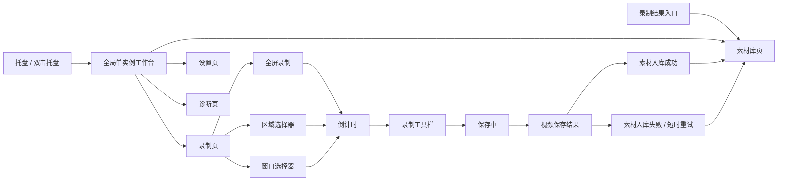
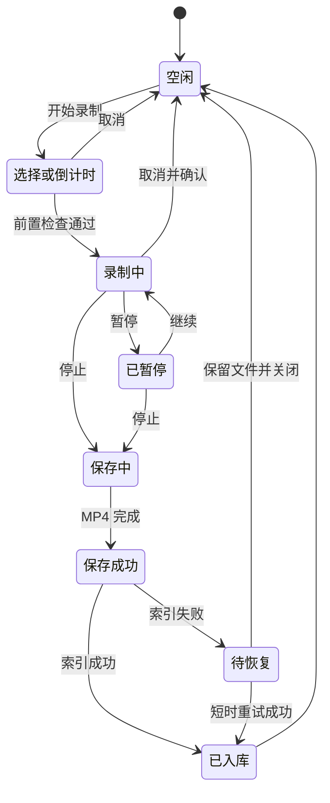
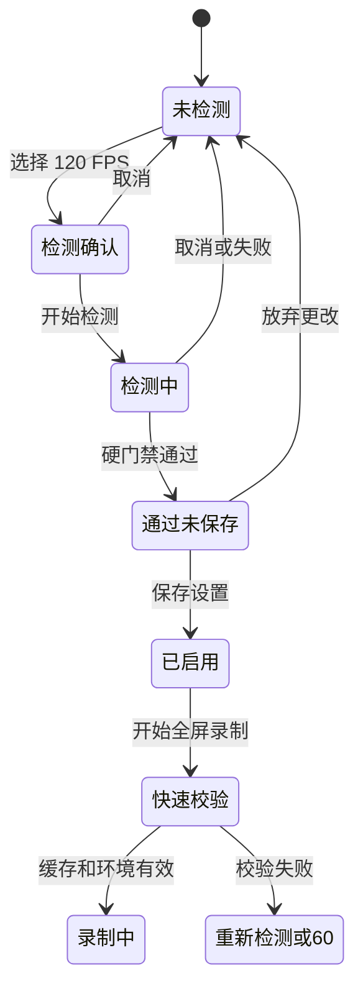

# QuickRec Full v1.8 高保真原型与视觉规范

## 0. 文档信息

- 目标版本：QuickRec Full v1.8。
- 原型状态：D3 已确认（2026-07-24）。
- 产品范围：工作台基础壳、四个一级页面、现有录制浮动界面、关键反馈状态和 120 FPS 配置/诊断入口。
- 需求事实源：[`../prd.md`](../prd.md)。
- 原型入口：[`index.html`](index.html)。
- 样式入口：[`styles.css`](styles.css)。
- 交互与控件契约：[`app.js`](app.js)。
- 当前界面参考：[`reference/`](reference/)。
- 响应式验证截图：[`validation/`](validation/)。
- 生成脚本：`scripts/capture_v17_ui_references.py`。
- 最后更新：2026-07-24。

本原型是 PyQt 实现前的视觉和交互基线，不是运行时代码，也不代表 v1.8 已完成。用户已于 2026-07-24 明确确认，可供后续 PyQt 页面实现和截图差异验收使用。

## 1. 打开方式

在项目根目录执行：

```powershell
python -m http.server 8768 --bind 127.0.0.1 --directory E:\codex\QuickRec\doc\releases\v1.8\prototype
```

浏览器访问：

```text
http://127.0.0.1:8768/index.html
```

支持以下评审参数，便于稳定复现页面和状态：

| 参数 | 可选值 | 作用 |
| --- | --- | --- |
| `page` | `record`、`library`、`settings`、`diagnostics` | 指定首次展示的一级页面 |
| `state` | `default`、`recording`、`success`、`index-failed`、`empty`、`error`、`missing` | 指定关键产品状态 |
| `floating` | `none`、`area`、`window`、`countdown`、`toolbar`、`paused`、`saving`、`result`、`result-failed` | 指定独立浮动界面 |
| `embed` | `1` | 隐藏原型评审工具栏，以工作台最小尺寸铺满视口 |

示例：

```text
http://127.0.0.1:8768/index.html?page=library&state=missing
http://127.0.0.1:8768/index.html?embed=1&page=settings
http://127.0.0.1:8768/index.html?page=record&floating=area
```

## 2. 设计依据与现状证据

### 2.1 证据来源

本轮没有凭空重画窗口，设计输入来自三类证据：

1. `v1.7` 正式包验收资料：`E:\QRtest\QuickRec-v1.7-acceptance\`。
2. 当前 `v1.7` 运行时 UI 类：素材库、设置、区域选择、窗口选择和录制工具栏。
3. v1.8 PRD 中已确认的信息架构、状态和 120 FPS 产品链路。

仓库内参考图由 `scripts/capture_v17_ui_references.py` 使用真实 UI 类和受控数据生成。透明区域选择器使用受控桌面背景合成，避免把用户真实桌面内容写入仓库。托盘图在正式包验收截图上核对菜单结构后，使用相同菜单文案生成隐私安全的结构参考。

### 2.2 当前界面参考清单

| 文件 | 当前能力 | 设计结论 | SHA256 前 12 位 |
| --- | --- | --- | --- |
| `settings-current.png` | 设置、快捷键和诊断操作集中在一个对话框 | v1.8 拆为设置页和诊断页，保留原功能 | `8995C1E2CC1D` |
| `material-library-current.png` | 查询、列表、详情和素材操作 | 完全嵌入工作台素材库页 | `D16C8D7AFEDD` |
| `material-library-empty-current.png` | 无素材空状态 | 保留明确空状态和录制入口 | `616F18EB9BA0` |
| `material-library-missing-current.png` | 文件缺失、重新定位 | 保留恢复链路并强化状态层级 | `0735647116E6` |
| `material-library-pending-current.png` | 待入库失败和重试 | 保留短时恢复能力，不新增复杂恢复中心 | `93B0D64D5F46` |
| `material-library-error-current.png` | 索引加载失败 | 使用错误状态、重试和诊断入口 | `9EDABB58316C` |
| `window-selector-current.png` | 顶层窗口列表与选择 | 保持独立浮动窗口，统一视觉令牌 | `482D0FF0243F` |
| `area-selector-current.png` | 遮罩、选区、尺寸和确认 | 保持独立全屏选择器，统一按钮与状态色 | `61365D929868` |
| `toolbar-countdown-current.png` | 倒计时和取消 | 保持轻量置顶工具栏 | `033BD5113FF3` |
| `toolbar-recording-current.png` | 计时、暂停、停止、取消 | 保持录制控制唯一入口 | `1F0012BC87DF` |
| `toolbar-paused-current.png` | 暂停、继续、停止、取消 | 明确黄色暂停状态 | `9A0BF015F4AE` |
| `toolbar-saving-current.png` | 保存等待状态 | 保存期间禁用冲突操作 | `2F5C8A01DA9D` |
| `toolbar-result-current.png` | 文件、目录和素材入口 | 区分视频保存与素材入库结果 | `3B031878D8B7` |
| `tray-menu-structure-reference.png` | 录制、设置、素材、诊断和退出入口 | v1.8 增加“打开工作台”，其余入口路由到同一工作台 | `DEFAB3842864` |

### 2.3 现状主要问题

- 录制、素材库、设置和诊断分别由托盘菜单和独立对话框承载，窗口关系不易理解。
- 设置与诊断在同一长表单中，信息层级不足。
- 素材库功能完整，但查询、列表和详情缺少统一视觉语言。
- 旧窗口混用字符、emoji 和不同风格图标。
- 录制工具栏状态完整，应保留其低干扰和独立控制职责，不应强行嵌入工作台。

## 3. 信息架构与页面关系

### 3.1 一级页面

工作台只包含四个一级页面：

1. **录制**：模式入口、当前配置摘要、录制状态、120 FPS 能力和最近结果。
2. **素材库**：跨保存路径搜索、筛选、排序、列表、详情和恢复操作。
3. **设置**：保存路径、画质、FPS、音频、录制行为和快捷键，使用显式保存。
4. **诊断**：诊断目录、复制、打开、导出、最近事件和 120 FPS 检测摘要。

### 3.2 页面与浮动窗口关系



### 3.3 窗口规则

- 工作台全局单实例；重复打开只激活已有窗口。
- 关闭工作台只隐藏，托盘继续运行。
- 区域选择、窗口选择、倒计时、录制工具栏和结果条仍是独立浮动窗口。
- 从工作台开始录制时隐藏工作台；保存完成后恢复并展示结果。
- 录制中重新打开工作台时只展示只读状态，暂停、继续、停止和取消仍由工具栏负责。

## 4. 视觉规范

### 4.1 视觉定位

- 现代创作者桌面工具，而非营销页面。
- 浅色主工作区配深色窄侧栏。
- 录制、素材和设置属于高频工具面，信息密度高但分组清晰。
- 不引入主题系统，不使用渐变、装饰光斑或大型营销卡片。
- 页面章节使用无框布局；卡片只用于具体模式项、状态项和详情面板。

### 4.2 设计令牌

| 类别 | 令牌 | 值 | 用途 |
| --- | --- | --- | --- |
| 主色 | `--blue` | `#2F68E9` | 主操作、选中状态、焦点 |
| 成功 | `--green` | `#1DA86B` | 已保存、可用、检测通过 |
| 警告 | `--amber` | `#D68A00` | 暂停、待入库、能力提醒 |
| 失败 | `--red` | `#D94A45` | 错误、文件缺失、危险操作 |
| 主文字 | `--text` | `#182230` | 标题和主要信息 |
| 次文字 | `--text-secondary` | `#53627A` | 说明和元数据 |
| 主背景 | `--bg-app` | `#F4F7FB` | 工作区 |
| 侧栏 | 固定深色 | `#171E28` | 一级导航与驻留状态 |
| 边框 | `--border` | `#D5DCE7` | 表单、列表和分隔 |
| 圆角 | `--radius-sm/md` | `4px / 7px` | 控件与面板；不超过 8px |
| 间距 | 4/8/12/16/20/24 | 固定级差 | 页面和组件布局 |

### 4.3 字体和尺寸

- 字体栈：`Microsoft YaHei UI`、`Segoe UI`、系统无衬线。
- 页面标题约 21px；章节标题 14～16px；正文和控件 12px；元数据 10～11px。
- 字号不随视口宽度缩放，字距固定为 0。
- 工作台默认约 `1200×760`，最小 `960×640`。
- 固定栏、按钮和工具栏具有稳定尺寸，状态变化不改变整体布局。

### 4.4 图标

- 导航、录制模式、素材操作、设置和诊断统一使用内嵌线性 SVG 图标。
- 图标结构参考 Lucide 的 24×24 线性网格，使用 `currentColor` 继承状态色。
- 原型不依赖网络字体、外链图标或 emoji。
- 成功、警告和失败只用图标、文字和语义色，不使用说明插画替代关键信息。

## 5. 组件规范

| 组件 | 结构 | 关键规则 |
| --- | --- | --- |
| 左侧导航 | 品牌、四页入口、数量/状态、驻留说明 | 固定宽度；激活项有左侧蓝条；诊断用小圆点表达状态 |
| 页面头部 | 标题、说明、环境摘要、更多菜单 | 标题保持紧凑，不使用英雄式大字 |
| 主按钮 | 图标 + 命令文本 | 仅用于当前页面最明确的主动作 |
| 次按钮 | 图标 + 文本或标准图标按钮 | 系统操作、恢复操作和次级命令 |
| 表单字段 | 标签、输入/选择、辅助说明 | 设置页形成草稿，显式保存 |
| 开关 | 标签说明 + switch | 只用于二元设置 |
| 素材列表 | 表头、选中行、状态徽标、分页 | 长名称省略；完整路径在详情展示 |
| 素材详情 | 标题、状态、元数据、路径、操作 | 危险操作与普通操作分区 |
| 状态提示 | 成功/警告/失败图标 + 文案 | 视频保存与素材入库结果分别表达 |
| 弹窗 | 标题、影响说明、主次操作 | 未保存设置提供保存、放弃、取消 |
| 浮动工具栏 | 状态点、计时、上下文、操作 | 录制控制唯一来源，尺寸稳定 |
| 开发契约面板 | 编号、标题、五项规则 | 只在原型评审模式出现，不进入产品 UI |

## 6. 页面与状态矩阵

### 6.1 录制页

覆盖状态：

- 默认准备就绪。
- 录制中只读状态。
- 视频保存且入库成功。
- 视频保存但入库失败。
- 120 FPS 尚未检测、检测中、通过和失败。

核心操作：

- 开始全屏录制。
- 选择区域。
- 选择窗口。
- 打开录制设置。
- 开始或重新执行 120 FPS 能力检测。
- 打开最近文件、目录或素材库详情。

### 6.2 素材库页

覆盖状态：

- 默认列表和详情。
- 查询无结果。
- 索引加载错误。
- 文件缺失。
- 待入库/入库失败提示。

核心操作：

- 关键词搜索、状态/模式/音频/时间筛选和排序。
- 重置条件、导入旧目录和重建目录。
- 选择素材、分页、打开文件、打开目录和复制路径。
- 重新定位、仅移除索引和移入回收站。
- 错误恢复、查看诊断和关闭提示。

### 6.3 设置页

覆盖状态：

- 初始正式配置。
- 有未保存更改。
- 120 FPS 未检测。
- 120 FPS 检测通过但尚未保存。
- 配置保存失败。
- 页面切换/关闭时保存、放弃、取消。

核心操作：

- 浏览保存路径。
- 修改画质、FPS、音频、倒计时和录制行为。
- 查看快捷键。
- 开始能力检测。
- 放弃更改或显式保存。

设置页由独立滚动的表单区和固定高度的底部操作区组成。保存栏参与正常页面布局，不覆盖快捷键或其他字段；表单滚动到底后，最后一行与保存栏之间保留标准间距，状态提示、放弃和保存操作保持同一基线。

### 6.4 诊断页

覆盖状态：

- 诊断服务正常。
- 120 FPS 无检测、通过和失败摘要。
- 最近成功、警告和失败事件。
- 诊断目录不可写或导出失败。

核心操作：

- 选择诊断目录。
- 复制诊断信息。
- 打开日志目录。
- 导出诊断文件。
- 重新执行 120 FPS 检测。
- 刷新最近事件。

## 7. 浮动界面与弹窗

### 7.1 浮动界面

原型顶部“浮动界面”选择器可直接切换：

- 区域选择。
- 窗口选择。
- 倒计时。
- 录制工具栏。
- 暂停工具栏。
- 保存中。
- 保存成功结果。
- 视频保存但素材入库失败结果。

窗口选择器采用专用纵向布局，固定为标题说明、窗口摘要、候选列表和底部操作四段。候选项同时展示窗口标题、所属应用、窗口尺寸和唯一选中状态；底部持续显示当前选择，刷新与确认操作不会挤压列表内容。

倒计时、录制、暂停、保存中、保存成功和入库失败共用一个以屏幕中心为锚点的过渡外壳。各状态保留承载信息所需的自然宽度，并在切换时对宽度、透明度和纵向位移进行短时插值，避免浮动条突然跳变。操作按钮组成组靠右排列，最后一个按钮与右边缘仅保留标准内边距，不在按钮之后留下无意义空白。原型工具栏的“播放浮动动画”会顺序播放全部六种状态；系统启用“减少动态效果”时取消过渡。

### 7.2 弹窗

原型可通过真实按钮触发：

- 未保存设置：保存并继续 / 放弃 / 取消。
- 120 FPS 首次检测。
- 120 FPS 快速校验失败后的重新检测 / 改用 60 FPS / 取消。
- 目录重建确认。
- 从素材库移除确认。
- 移入回收站确认。

磁盘不足和设置保存失败通过页面状态/非阻塞反馈表达，后续 PyQt 实现必须复用同一语义。

## 8. 控件开发契约

### 8.1 契约结构

每个产品按钮、菜单、输入项、选择项和状态入口都绑定唯一 `data-contract`。契约包含：

1. 触发条件。
2. 即时结果。
3. 成功反馈。
4. 失败反馈。
5. 禁用规则。

静态 HTML 中共有 79 个唯一契约键；JavaScript 共定义 88 个契约，其中 9 个用于运行时生成的弹窗按钮。页面实际包含 87 个带契约的产品控件实例，重复实例共用同一业务契约。

### 8.2 查看方式

1. 点击原型工具栏的“开发标注”。
2. 每个产品控件显示就近蓝色编号。
3. 点击或聚焦任一控件，右侧显示该控件的五项完整规则。
4. 标注模式下点击只查看规则，不执行产品动作。
5. 关闭标注后，控件恢复原型交互。

这种方式把说明与控件直接关联，前端、后端和测试可用同一个契约键追踪实现。

## 9. 关键交互链路

### 9.1 工作台录制



### 9.2 120 FPS 首次启用



## 10. 响应式与 DPI

### 10.1 布局规则

- `1200×760` 为默认工作台表达。
- `960×640` 为最小工作台表达，内容通过页面内部滚动承载。
- 小于 1100px 时录制模式卡片从三列变为两列，第三项占整行。
- 素材筛选栏和工具栏在窄宽度换行，列表/详情保持最小可用宽度。
- 长文件名、中文路径和状态文本使用省略或自动换行，不覆盖相邻控件。
- 页面本身不产生水平溢出。

### 10.2 验证截图

| 文件 | 视口/DPI 表达 | 结论 |
| --- | --- | --- |
| `record-desktop-1440x900.png` | 桌面宽度 | 录制页结构和主操作完整 |
| `library-missing-1100x760.png` | 窄桌面 | 查询、列表和详情无重叠，页面内部可滚动 |
| `settings-min-960x640.png` | 最小窗口 | 表单和底部保存栏可用，无水平溢出 |
| `floating-area-1440x900.png` | 浮动覆盖层 | 选区、尺寸和确认动作清晰 |
| `window-picker-refined-1440x900.png` | 窗口选择器 | 四段纵向布局完整，列表字段与底部操作无挤压 |
| `window-picker-refined-800x600.png` | 紧凑视口 | 640px 面板完整可见且内部无横向溢出 |
| `floating-transition-recording.png` | 录制工具栏 | 500px 录制态操作和上下文完整 |
| `floating-transition-result.png` | 保存结果条 | 640px 结果态在相同中心锚点展开 |
| `floating-toolbar-actions-right.png` | 录制工具栏对齐 | 操作按钮组靠右，末按钮右侧仅保留标准内边距 |
| `settings-footer-refined-1030x760.png` | 设置页底部 | 表单独立滚动，快捷键不被保存栏覆盖 |
| `dpi-100-library.png` | 100% | 无水平溢出或控件越界 |
| `dpi-125-library.png` | 125% | 无水平溢出或控件越界 |
| `dpi-150-library.png` | 150% | 无水平溢出或控件越界 |

浏览器自动检查在三个 DPI 表达下均得到 `body.scrollWidth == body.clientWidth`，可见输入和按钮没有横向越界。PyQt 实现后仍须在真实 Windows 100%、125%、150% 缩放下重新截图验收，HTML 结果不能替代真实 GUI 证据。

## 11. 自动验证

已执行：

```powershell
python -m pytest tests\test_v18_prototype.py -q
```

结果：`10 passed`。

覆盖内容：

- HTML、CSS 和 JavaScript 均可按 UTF-8 读取。
- 原型不依赖外部网络资源。
- 只存在四个一级产品页面。
- 所有产品控件都有开发契约标记。
- 每个静态契约键都有 JavaScript 定义。
- 浮动界面状态完整。
- 窗口选择器使用专用纵向布局并包含窗口尺寸与选择摘要。
- 浮动工具条具有可重复播放的状态切换动画。
- 设置表单与底部保存栏分离滚动，不发生内容覆盖。
- 评审 URL 参数存在。
- 当前参考图片为有效、非空 PNG。

浏览器自动交互结果：

- HTTP 返回 200，标题和录制页正常加载。
- 四页路由可切换。
- 素材错误态和区域浮层可显示。
- 开发标注模式只查看契约，不触发产品动作。
- 页面关系图可打开和关闭。
- 未保存设置对话框包含“取消 / 放弃 / 保存并继续”。
- 取消后留在设置页；放弃后按目标导航到诊断页。
- 选择 120 FPS 会回退到 60 FPS 并要求检测。
- 模拟检测通过后选择 120 FPS，显式保存给出成功反馈。
- 窗口选择器在 1440×900、800×600 和 640×560 视口下内部无横向溢出。
- 浮动条实际播放 `330 → 500 → 430 → 640 → 690px` 的宽度过渡，六种状态均可到达。
- 浏览器控制台和页面错误列表为空。

JavaScript 另通过 Node 语法检查；仓库文档和代码仍需在 D3 收口时统一执行乱码检查和 `git diff --check`。

## 12. PRD 追溯

| PRD 范围 | 原型位置 |
| --- | --- |
| 6 信息架构 | 固定侧栏、四页和“页面关系”图 |
| 7 工作台链路 | 录制页、浮动界面、保存结果和页面恢复表达 |
| 8 窗口与全局状态 | 默认尺寸、最小尺寸、驻留说明和录制中只读态 |
| 9 页面功能 | 四个一级页面及其控件契约 |
| 10 浮动窗口 | 区域、窗口、倒计时、工具栏、保存和结果 |
| 11 视觉改版 | 令牌、组件、统一 SVG 图标和状态语义 |
| 12 HTML 原型 | 本目录全部文件 |
| 13 120 FPS | 录制页能力区、设置入口、检测弹窗和诊断摘要 |
| 15 异常/取消/降级 | 错误、缺失、入库失败、未保存和检测失败状态 |
| 19 GUI/DPI | `validation/` 验证截图和本文件第 10 节 |

## 13. 实现边界

- 本原型不新增项目模型、剪辑、多轨、导出队列、AI 或云同步。
- 不提供素材预览或静态首帧。
- 不改变现有三类录制的核心行为。
- 不实现 WGC、多显示器或 4K 正式支持。
- 120 FPS 仅表达已确认流程；真实能力仍必须通过 D4 硬件门禁。
- QuickRec Lite 不在本原型和 v1.8 实现范围内。

## 14. 用户确认清单

- [x] 四个一级页面的信息层级符合预期。
- [x] 深色侧栏、浅色工作区和蓝色主操作方向符合预期。
- [x] 录制页没有重复放置完整设置。
- [x] 素材库嵌入后的查询、列表和详情布局符合预期。
- [x] 设置页的显式保存和未保存保护符合预期。
- [x] 诊断页独立后的信息结构符合预期。
- [x] 区域/窗口选择器和录制工具栏继续独立浮动符合预期。
- [x] 120 FPS 检测、启用、失败和诊断链路符合预期。
- [x] 每个控件的开发契约表达足够前后端和测试直接承接。
- [x] 同意以本原型作为后续 PyQt 实现和截图差异对照基线。

D3.19 已完成。后续实现必须以本原型为视觉与交互基线；范围变化需重新回到需求或原型确认流程。
