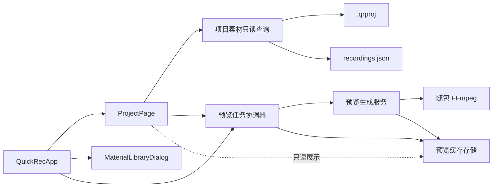

# QuickRec Full v1.9.1 开发计划

## 0. 追踪信息

| 项目 | 内容 |
| --- | --- |
| 当前状态 | D0-D8 已完成，正式发布 |
| 目标版本 | QuickRec Full v1.9.1 |
| 当前正式版本 | v1.9.1 |
| 上游需求 | `FULL-001`、`FULL-002`、`FULL-004`、`FULL-005` |
| 需求池 | `doc/archive/ideas/mypm-idea-pool-post-v1.9-2026-07-27.md` |
| 需求事实源 | `doc/releases/v1.9.1/prd.md` |
| 交互事实源 | `doc/releases/v1.9.1/prototype/` |
| 状态事实源 | `doc/releases/v1.9.1/progress.md` |
| 开发日志 | 实施开始后创建 `doc/releases/v1.9.1/dev_log.md` |
| 缺陷记录 | 验收发现真实缺陷时创建 `doc/releases/v1.9.1/bugfix-log.md` |
| 当前 Full 路径 | `E:\codex\QuickRec` |
| 当前 Full 分支 | `test`，已快进同步到 `master` 基线 |
| 当前基线 | 正式版本 `v1.9` / `9034e65`；当前 HEAD `197943c` |
| QuickRec Lite | `E:\codex\QuickRec-Lite`，不进入本版范围 |
| PRD 确认 | 已获得（2026-07-27） |
| 原型确认 | 已获得（2026-07-27） |
| 开发承接确认 | 已获得（2026-07-27） |
| 进入业务实现授权 | 已获得（2026-07-27） |
| 最后更新 | 2026-07-27 |

## 1. 执行基线

### 1.1 当前阶段

当前是 **实施阶段**，不是需求重新定义。

实施阶段必须以以下文件为事实源：

1. `doc/releases/v1.9.1/prd.md`
2. `doc/releases/v1.9.1/dev_plan.md`
3. `doc/releases/v1.9.1/progress.md`
4. `doc/releases/v1.9.1/prototype/`

没有需求契约变化时不重写 PRD。完成任务后同步更新 `progress.md`；开发过程写入 `dev_log.md`；真实缺陷及修复记录写入 `bugfix-log.md`。

### 1.2 版本目标

v1.9.1 只完成“项目素材预览与基础使用闭环”：

1. 项目素材列表与详情展示静态预览。
2. 预览由本地 FFmpeg 异步生成并存入独立可再生缓存。
3. 支持打开文件、打开目录、跳转素材库并返回项目上下文。
4. 支持刷新所选预览和重建当前项目预览。
5. 正确处理生成中、失败、缓存失效、文件缺失和项目归档状态。
6. 为 v1.9.2 提供只读项目素材描述边界，不引入时间线字段。

### 1.3 本版不包含

- 内嵌视频播放器；
- 全局素材库缩略图改版；
- 时间线、多轨、剪辑和导出队列；
- AI、字幕、摘要、标签和云同步；
- WGC、144/165/240 FPS、多显示器和 4K 正式能力；
- QuickRec Lite 改动；
- 数据库；
- 全量重写 `QuickRecApp`、`ProjectPage` 或 `MaterialLibraryDialog`。

### 1.4 范围保护

1. `.qrproj`、`projects.json` 和 `recordings.json` 不保存预览路径、预览状态或后台队列。
2. 缓存失败不改变视频保存、素材入库或项目引用的成功事实。
3. 预览缓存可以整体删除并重建，删除缓存不得删除视频或业务索引。
4. UI 不直接执行 FFmpeg，不直接写缓存索引或业务 JSON。
5. 实施不得把静态预览扩展成播放器、时间线或完整素材工作台。

## 2. PRD 对照表

| PRD 章节 / 需求点 | 开发模块 | 任务阶段 | 覆盖方式 |
| --- | --- | --- | --- |
| 7.1 新素材触发与后台补齐 | 预览触发协调 | D3 | 新录制、导入、重建、迁移、重试、重新定位事件接入 |
| 7.2 预览提取 | FFmpeg 预览生成服务 | D2 | 10% → 1 秒 → 首个可解码画面 |
| 7.3 项目页展示 | `ProjectPage` 预览列表与详情 | D4 | 固定列表项、详情面板、局部刷新 |
| 7.4 打开文件和目录 | 文件操作协调 | D5 | Windows 默认播放器与资源管理器 |
| 7.5 素材库跳转和返回 | 工作台页面协调 | D5 | 素材定位、来源项目上下文、返回恢复 |
| 7.6 刷新和重建 | 任务协调与项目页状态 | D4-D5 | 单项刷新、批量重建、取消未开始任务 |
| 7.7 缺失与重新定位 | 缓存失效与恢复接入 | D3-D5 | 历史预览保留、缺失蒙层、重新定位后更新 |
| 9 缓存契约 | 缓存模型与存储 | D1 | 指纹、原子写入、索引恢复、500 MB LRU |
| 10 状态模型 | 预览任务协调器 | D2 | 去重、优先级、最多并发 2、超时与重试 |
| 11 异常与降级 | 服务、UI、日志 | D2-D6 | 明确失败类型，不阻塞业务主链路 |
| 12.3 最小职责拆分 | 查询边界与页面协调 | D3-D5 | 只读描述对象、信号与协调接口 |
| 12.4 质量门禁 | 测试与 CI | D7 | 新模块覆盖率、ruff、mypy、coverage |
| 15 原型门禁 | 原型与实现对照 | D0、D8 | 原型已确认，实现后逐页截图对照 |
| 16-18 验收与阻塞 | 验证和候选包 | D7-D8 | 自动化、打包、GUI、DPI、数据哈希 |

## 3. 技术边界

### 3.1 建议模块划分



职责约束：

- `ProjectPage`：渲染列表、详情和状态；发出用户意图；不执行 FFmpeg。
- 项目素材只读查询：组合项目引用与中央素材事实，输出稳定描述对象。
- 预览任务协调器：调度、去重、优先级、并发、取消和状态通知。
- 预览生成服务：计算提取位置、运行 FFmpeg、校验图片和返回结构化结果。
- 预览缓存存储：指纹、路径、索引、原子写入、失效和 LRU 清理。
- `QuickRecApp`：连接页面、录制入库事件和应用生命周期，不承载预览算法。

### 3.2 数据边界

建议新增只读对象：

```text
ProjectMaterialDescriptor
  project_id
  material_id
  file_name
  file_path
  status
  duration_sec
  width
  height
  fps
  mode
  audio_source
  file_size
  preview_path | null
  preview_state
  preview_error_code | null
```

约束：

- 描述对象只存在于内存，不写回项目文件或中央素材索引。
- `preview_path` 可空，后续 v1.9.2 不得依赖其永久存在。
- 预览状态只描述缓存和任务，不替代素材的 `available` / `missing` 业务状态。

建议缓存索引至少包含：

```text
schema_version
entries[cache_key]
  material_id
  fingerprint
  relative_path
  width
  height
  byte_size
  created_at
  accessed_at
  source_position_sec
```

缓存索引必须支持未知扩展字段、原子写入和损坏后重建。

### 3.3 FFmpeg 调用边界

1. 复用 `utils.media_metadata.resolve_ffmpeg_path()`。
2. 使用参数数组调用，不拼接命令字符串。
3. 单项超时 10 秒，进程使用无窗口启动标志。
4. 输出先写临时文件，校验 JPEG 字节和尺寸后原子替换。
5. 先尝试视频时长 10% 位置，再尝试 1 秒，最后尝试首个可解码画面。
6. FFmpeg 缺失、启动失败、超时、非零退出、空文件和图片不可解码使用不同错误码和日志。
7. 日志只保留必要路径摘要，不输出完整环境变量或硬件序列号。

## 4. 文件与模块影响

### 4.1 预计新增文件

| 文件 | 作用 |
| --- | --- |
| `src/utils/thumbnail_cache.py` | 缓存目录、指纹、缓存索引、原子写入和 LRU 清理 |
| `src/services/thumbnail_service.py` | FFmpeg 提取、图片校验和结构化错误 |
| `src/services/thumbnail_coordinator.py` | 任务去重、优先级、并发、取消、重试和状态通知 |
| `src/services/project_materials.py` | 组合项目引用、中央素材与预览状态的只读查询 |
| `tests/test_thumbnail_cache.py` | 指纹、缓存读写、失效、恢复和 LRU 测试 |
| `tests/test_thumbnail_service.py` | 提取顺序、真实 FFmpeg、错误和路径测试 |
| `tests/test_thumbnail_coordinator.py` | 并发、去重、优先级、取消和退出测试 |
| `tests/test_project_materials.py` | 只读描述对象和数据隔离测试 |
| `tests/fixtures/v1_9_1/README.md` | 受控视频、损坏样本与生成方式说明 |
| `doc/releases/v1.9.1/dev_log.md` | 实施过程记录，实施开始后创建 |
| `doc/releases/v1.9.1/manual-verification.md` | D8 GUI 手动验收清单 |
| `doc/releases/v1.9.1/verification.md` | 自动化、打包和候选包证据 |

文件名在 D0 实施复核时允许依据现有代码风格做一次等价调整，但模块职责不得合并回 UI 或 `QuickRecApp`。

### 4.2 预计修改文件

| 文件 | 改动范围 |
| --- | --- |
| `src/ui/project_page.py` | 将项目素材表格升级为预览列表和详情组合视图，接入刷新与重建状态 |
| `src/ui/material_library_dialog.py` | 支持按素材 ID 定位并展示来源项目返回上下文 |
| `src/ui/workbench_window.py` | 增加跨页面定位与返回上下文所需的最小接口 |
| `src/main.py` | 注入预览服务、连接入库触发、协调跳转和应用退出 |
| `src/ui/design_system.py` | 仅补充原型已确认且现有系统缺少的预览状态样式 |
| `src/services/material_ingestion.py` | 入库成功后发出或返回可供预览触发的稳定素材信息 |
| `src/services/recording_library.py` | 导入、重建、迁移、重试和重新定位成功后的触发边界 |
| `src/utils/media_metadata.py` | 仅复用/抽取随包 FFmpeg 定位和进程错误分类，不改变现有元数据契约 |
| `pyproject.toml` | 将新增模块纳入 mypy/coverage；不降低 80% 门禁 |
| `.github/workflows/ci.yml` | 保持 master/test/PR 门禁并覆盖新增测试和 packaging 集成 |
| `build_std.spec` | 原则上无需新增二进制；验证现有 FFmpeg/JPEG 依赖满足运行要求 |
| `tests/test_project_page.py` | 页面状态、操作、缺失和归档行为 |
| `tests/test_material_library_dialog.py` | 素材定位、来源条和返回上下文 |
| `tests/test_workbench_window.py` | 跨页面导航和实例状态 |
| `tests/test_main_workflow.py` | 事件接线、入库触发、退出取消和数据安全 |
| `tests/test_packaging_config.py` | 随包 FFmpeg 和新增模块打包约束 |
| `README.md`、`doc/current.md` | 仅在发布收口时更新版本事实，不在实现早期提前宣称发布 |

### 4.3 明确不修改

- `E:\codex\QuickRec-Lite\**`
- `src/recorder/**`，除非验证证明预览任务需要在录制期间调整后台调度；任何改动需单独确认。
- v1.9 tag 及历史发布文档。
- `.qrproj`、`projects.json`、`recordings.json` schema。

## 5. 实施顺序


顺序原则：

1. 先证明缓存与 FFmpeg 服务可独立工作，再接 UI。
2. 先建立只读描述对象，再由项目页消费，避免 UI 直接拼接业务数据。
3. 先完成单项预览闭环，再扩展批量补齐和缓存清理。
4. 每个阶段先写失败测试，再实现，再更新 progress。
5. 打包环境真实 FFmpeg 验证通过后才进入 GUI 验收。

## 6. 模块实施任务

### D0 基线、分支与文档准备

- **目标**：锁定 v1.9.1 范围、事实源和实施身份。
- **涉及文件**：PRD、原型、dev plan、progress、后续 dev log。
- **实施要点**：
  - 记录实现开始时的分支、HEAD、dirty 状态和 v1.9 回滚点。
  - 经用户授权后，将 `test` 安全同步到当前 `master` 再承接实现。
  - 不移动 v1.9 tag，不提前更新正式版本号。
  - 为后续受控视频夹具建立生成说明，避免提交大体积临时视频。
- **验证方式**：Git 状态、文档链接、UTF-8、`git diff --check`。
- **完成标准**：事实源可访问，实施授权明确，D1 可独立开始。

### D1 预览缓存、指纹与索引

- **目标**：建立与业务数据隔离、可删除重建的预览缓存层。
- **涉及文件**：`src/utils/thumbnail_cache.py` 及对应测试。
- **实施要点**：
  - 缓存根目录固定为 `%LOCALAPPDATA%\QuickRec\ThumbnailCache\v1\`。
  - 指纹包含素材 ID、规范化路径、文件大小和修改时间。
  - 同素材同指纹命中缓存；任一文件事实变化使缓存失效。
  - JPEG 固定基准尺寸 `320×180`、质量 85，保持原宽高比并补齐背景。
  - 缓存索引原子写入，损坏时保留证据并重建。
  - 临时文件不进入正式索引。
  - 容量超过 500 MB 时按 LRU 清理，并支持保护可见、选中、运行中条目。
- **验证方式**：
  - 指纹和 Windows 路径单元测试；
  - 原子写入、损坏恢复、手动删除缓存测试；
  - 500 MB 边界夹具和 LRU 顺序测试；
  - 核心业务 JSON 前后哈希对比。
- **完成标准**：缓存层不依赖 PyQt，不修改业务索引，全部单元测试通过。

### D2 FFmpeg 提取服务与异步任务协调

- **目标**：可靠生成静态 JPEG，并在后台控制并发、去重和取消。
- **涉及文件**：`thumbnail_service.py`、`thumbnail_coordinator.py`、`media_metadata.py` 及测试。
- **实施要点**：
  - 复用随包 FFmpeg 定位逻辑。
  - 先探测时长，按 10% → 1 秒 → 首个可解码画面降级。
  - 最多同时运行 2 个 FFmpeg 任务。
  - 同一缓存键只保留一个任务；可见和选中素材提升优先级。
  - 单项超时 10 秒，自动重试最多 1 次。
  - 工作台隐藏时继续；应用退出时取消未开始任务并终止受控子进程。
  - 生成结果、失败阶段、错误码和是否可重试结构化返回。
- **验证方式**：
  - mock 级命令、超时、错误分类测试；
  - 使用真实项目 FFmpeg 的受控视频集成测试；
  - 中文、空格、长路径、短视频、竖屏和损坏视频测试；
  - 并发 2、重复去重、优先级提升和退出无残留进程测试。
- **完成标准**：源码与等价打包目录行为一致，单个失败不阻断队列。

### D3 项目素材只读查询与预览触发

- **目标**：向 UI 提供稳定描述对象，并覆盖所有素材进入或变化路径。
- **涉及文件**：`project_materials.py`、`project_library.py`、`recording_library.py`、`material_ingestion.py` 及测试。
- **实施要点**：
  - 组合 `ProjectMaterialRef` 与 `MaterialItem`，不修改原对象。
  - 描述对象输出素材业务状态、元数据、预览状态和可空预览路径。
  - 项目可见素材优先安排，剩余项目素材后台补齐。
  - 新录制、手动导入、目录重建、历史迁移、待入库重试、重新定位成功后触发失效或生成。
  - 原地覆盖由指纹变化自动识别。
  - 缺失素材不读取源文件，保留最后有效缓存。
  - 为 v1.9.2 暴露只读素材读取接口，不加入轨道、时间线和剪辑字段。
- **验证方式**：
  - 查询组合、缺失和中央记录不存在测试；
  - 各入库入口的触发测试；
  - 原地覆盖和重新定位失效测试；
  - `.qrproj`、`projects.json`、`recordings.json` 哈希不变测试。
- **完成标准**：所有触发路径可追溯，预览状态与业务状态明确分离。

### D4 项目页预览列表、详情和批量状态

- **目标**：按确认原型实现项目素材识别与状态表达。
- **涉及文件**：`project_page.py`、`design_system.py` 及 UI 测试。
- **实施要点**：
  - 用固定尺寸预览列表和详情组合视图替代当前四列表格。
  - 列表项包含 16:9 预览、时长、文件名、分辨率/FPS/模式和状态。
  - 详情包含大预览、完整元数据、缓存摘要和操作区。
  - 仅局部更新变更素材，不因图片加载重建整个项目页。
  - 支持可用、未生成、排队、生成中、失败、缓存失效、缺失和待关联状态。
  - 刷新所选预览；重建当前项目预览；确认、进度和取消规则符合原型。
  - 归档项目允许查看和重建预览，保持其他编辑操作只读。
  - 960×640 下内部滚动，不遮挡底部操作。
- **验证方式**：
  - offscreen Qt 单元测试；
  - 原型关键状态截图对照；
  - 大图加载失败、快速切换选择和窗口关闭测试；
  - 20、50、200 条夹具的选择和滚动性能测试。
- **完成标准**：状态完整、操作规则正确、页面切换和素材选择无明显阻塞。

### D5 文件操作、素材库跳转与上下文恢复

- **目标**：闭合项目内“识别 → 确认 → 继续使用”链路。
- **涉及文件**：`project_page.py`、`material_library_dialog.py`、`workbench_window.py`、`main.py` 及测试。
- **实施要点**：
  - 打开文件调用系统默认播放器。
  - 打开目录调用资源管理器并定位目标文件。
  - 缺失素材禁用打开文件和目录；预览失败但文件可用时保持启用。
  - 从项目页跳转素材库时按稳定素材 ID 选中记录。
  - 素材库显示来源项目返回条；返回后恢复原项目、原素材和合理滚动位置。
  - 中央记录缺失时提供明确反馈，不创建伪记录。
  - 文件缺失但中央记录存在时保留素材库恢复入口。
  - 取消文件对话框或页面跳转不得改变项目和素材数据。
- **验证方式**：
  - Windows shell 调用参数测试；
  - 页面协调、素材定位和返回上下文测试；
  - 缺失、中央记录不存在、项目关闭和切换项目测试；
  - GUI 实际打开播放器、资源管理器和返回项目。
- **完成标准**：三个继续使用入口均可恢复、可取消、不会错误修改数据。

### D6 缓存清理、诊断、失败降级与生命周期

- **目标**：让预览能力长期运行且不影响录制和业务数据。
- **涉及文件**：缓存/协调服务、`main.py`、诊断相关代码及测试。
- **实施要点**：
  - 记录缓存命中、排队、生成、失败、重试、取消和清理摘要。
  - 失败日志区分 FFmpeg 缺失、启动失败、超时、非零退出、空图片、解码失败和缓存写入失败。
  - 不记录完整环境变量、硬件序列号或无必要的完整用户路径。
  - 缓存目录不可写、索引损坏、空间不足时项目和素材仍可使用。
  - 录制开始时不得让后台预览任务抢占主链路；是否暂停新任务由测量结果决定，不预设修改录制核心。
  - 工作台隐藏继续后台任务；应用退出清理任务和子进程。
  - 诊断导出包含最近预览任务摘要，不包含预览图片。
- **验证方式**：
  - 故障注入和日志语义测试；
  - 录制期间后台任务压力测试；
  - 退出残留进程检查；
  - 诊断导出内容和隐私边界检查。
- **完成标准**：预览故障不改变录制、入库、项目打开和退出结果。

### D7 自动化、质量门禁、CI 与候选包

- **目标**：锁定源码与打包环境行为，生成可验收候选包。
- **涉及文件**：全部新增测试、`pyproject.toml`、CI、spec 和验证文档。
- **实施要点**：
  - 新增预览和协调模块语句覆盖率不低于 80%。
  - 项目总体覆盖率保持不低于 80%。
  - 新增/修改模块纳入 ruff、mypy 和 compileall。
  - packaging smoke 验证 FFmpeg/FFprobe 存在、可执行并能生成 JPEG。
  - 独立候选目录打包，不覆盖 v1.9 正式产物。
  - 记录候选 EXE、FFmpeg、分发目录大小、时间和 SHA256。
  - 使用候选包生成真实预览，检查图片格式、非空字节、尺寸和无残留进程。
- **验证命令**：

```powershell
python -m pytest tests/test_thumbnail_cache.py tests/test_thumbnail_service.py tests/test_thumbnail_coordinator.py tests/test_project_materials.py -q
python -m pytest tests/test_project_page.py tests/test_material_library_dialog.py tests/test_workbench_window.py tests/test_main_workflow.py -q
python -m pytest -m packaging -q
python -m pytest --cov=src --cov-report=term-missing --cov-fail-under=80
python -m ruff check src tests scripts
python -m mypy
python -m compileall -q src tests scripts
git diff --check
```

- **完成标准**：全部自动门禁通过，候选包身份锁定，D8 可开始。

### D8 GUI 验收与发布收口

- **目标**：基于锁定候选包完成真实桌面验收并判断是否可发布。
- **涉及文件**：`manual-verification.md`、`verification.md`、`progress.md`、必要时 `bugfix-log.md` 和 release notes。
- **实施要点**：
  - 使用 Computer Use 和人工补证验证实际工作台。
  - 验证新项目和 v1.9 既有项目无感兼容。
  - 验证 20、50、200 条项目素材的预览、滚动、选择和性能。
  - 验证正常、生成中、失败、失效、缺失、重新定位、归档和缓存清理。
  - 验证打开文件、目录、素材库和返回项目。
  - 验证 100%、125%、150% DPI。
  - 回归三种录制、四种音频、30/60/120 FPS、素材库、项目、设置、诊断、托盘和退出。
  - 对比核心 JSON 与测试前哈希，确认没有预览字段或意外改写。
  - 确认 QuickRec Lite 工作区干净。
- **完成标准**：
  - 发布阻塞项全部关闭；
  - GUI 证据、日志、截图、缓存和数据哈希可追溯；
  - acceptance 结论为“通过”；
  - 获得用户发布授权后才执行提交、推送、tag 和 Release。

## 7. 测试与验收计划

### 7.1 单元测试

重点覆盖：

- 指纹稳定性与文件变化失效；
- 缓存索引读写、损坏恢复和 LRU；
- JPEG 生成与校验；
- FFmpeg 各类失败；
- 调度并发、去重、优先级、重试和取消；
- 只读描述对象；
- UI 状态和操作启用规则；
- 页面跳转和上下文恢复；
- 核心业务 JSON 不被修改。

### 7.2 集成测试

1. 使用真实随包 FFmpeg 对受控 MP4 生成 JPEG。
2. 在源码目录和等价 frozen 目录分别验证二进制解析路径。
3. 对中文、空格、长路径、短视频、竖屏、损坏视频运行提取。
4. 验证工作台隐藏、录制并发、应用退出和无残留子进程。
5. 验证 500 MB 清理和受保护条目。

### 7.3 GUI 手动验收

必须形成 `manual-verification.md`，逐项记录：

- 操作步骤；
- 实际结果；
- 截图；
- 测试 MP4；
- 预览 JPEG；
- 缓存索引；
- 日志；
- 核心 JSON 前后哈希；
- 结论：通过 / 部分通过 / 未通过 / 待验证。

### 7.4 回归范围

- 全屏、区域、窗口录制；
- 无声、系统声、麦克风、双音频；
- 30、60、120 FPS；
- 素材库查询、文件操作、导入、重建、重新定位和待入库重试；
- 项目创建、打开、重命名、归档、恢复、删除和项目内录制；
- 设置保存和诊断导出；
- 托盘、快捷键、工作台隐藏和应用退出；
- v1.9 项目文件和中央索引兼容。

### 7.5 验证层级

- L0：契约、静态检查、数据边界和文档一致性。
- L1：自动化异常路径与独立代码走查。
- L2：真实 FFmpeg、候选包、GUI、日志、截图和 DPI。
- L3：不作为 v1.9.1 发布硬门禁；本版由项目负责人真实设备验收闭合。

## 8. 开发日志约定

- 实施开始后创建 `doc/releases/v1.9.1/dev_log.md`。
- 按日期和 D0-D8 阶段记录目标、改动模块、关键实现、验证和遗留。
- `progress.md` 只记录状态、checklist、阻塞、最近验证和下一步。
- 真实缺陷、复现、根因、修复和定向复验写入 `bugfix-log.md`。
- 性能实验或 FFmpeg 方案比较如超出实施事实，单独写 `spike-log.md`，不得混入 progress。

## 9. 风险与回退

| 风险 | 触发条件 | 影响 | 处理与回退 |
| --- | --- | --- | --- |
| FFmpeg 任务抢占录制资源 | 录制期间后台队列持续运行 | 录制掉帧或队列积压 | 测量后暂停启动新预览任务；不改已在运行的录制配置 |
| 项目页图片解码卡顿 | 快速滚动或 200 条素材 | 工作台无响应 | 异步加载、固定尺寸、可见项优先、局部更新 |
| 缓存失效遗漏 | 文件原地覆盖或重新定位 | 显示旧画面 | 路径、大小、mtime 指纹；人工刷新和重建 |
| 缓存索引损坏 | 异常退出或写入失败 | 预览丢失 | 原子写入、保留损坏证据、从文件重建 |
| 缓存清理误删受保护条目 | 500 MB 边界 | 当前画面闪烁或重复生成 | 可见、选中和运行中保护；测试 LRU 决策 |
| 单个损坏视频阻断队列 | FFmpeg 非零退出 | 其他素材无预览 | 每项隔离失败，队列继续，允许重试 |
| 打包路径与源码不一致 | frozen 环境找不到 FFmpeg | 候选包不可用 | 复用已验证路径解析；packaging 集成门禁 |
| 最小拆分扩大为重写 | UI 或 App 同时大改 | 版本失控 | 新服务保持窄接口，禁止无关重构 |
| v1.9.2 依赖临时缓存 | 后续错误使用预览文件作为事实源 | 数据不稳定 | 只读描述对象中预览路径可空，不写项目文件 |

代码回退：

1. 回退到 v1.9 tag 或 v1.9.1 开发前提交。
2. 删除新增服务和 UI 接线。
3. 保留现有视频、项目和素材索引。

数据回退：

1. 删除 `%LOCALAPPDATA%\QuickRec\ThumbnailCache\v1\`。
2. 不迁移、不回写 `.qrproj`、`projects.json` 或 `recordings.json`。
3. 回退后只失去可再生预览，不丢失业务数据。

## 10. 开放问题

当前没有阻塞开发承接的产品开放问题。

实施中仅允许在以下工程细节上做等价选择：

1. 新增服务文件的最终命名。
2. PyQt 图片异步解码使用线程池还是现有线程模式。
3. 录制期间是降低预览优先级还是暂停启动新任务。

这些选择必须通过测试和性能证据决定，不能改变 PRD 的并发、数据和用户交互契约。

## 11. 分支、提交与发布建议

1. 获得实现授权后，先将本地/远端 `test` 安全同步到当前 `master`。
2. 在 `test` 上按强关联里程碑提交，避免把全部 v1.9.1 压成一个不可审查提交。
3. 建议提交分组：
   - `feat(v1.9.1): add thumbnail cache and extraction services`
   - `feat(v1.9.1): add project material preview workflow`
   - `test(v1.9.1): complete preview quality gates`
   - `docs(v1.9.1): finalize acceptance and release notes`
4. Acceptance 通过后再合并 `test` 到 `master`。
5. tag、推送和 GitHub Release 必须等待用户单独授权。
6. 不移动或重写 v1.9 tag。

## 12. 停止点

当前执行点是：

```text
PRD：已确认
高保真原型：已确认
开发承接：已确认
业务实现授权：已获得
当前阶段：D1 预览缓存、指纹与索引
```

按 `progress.md` 的最小任务顺序推进，完成任务后同步状态。
