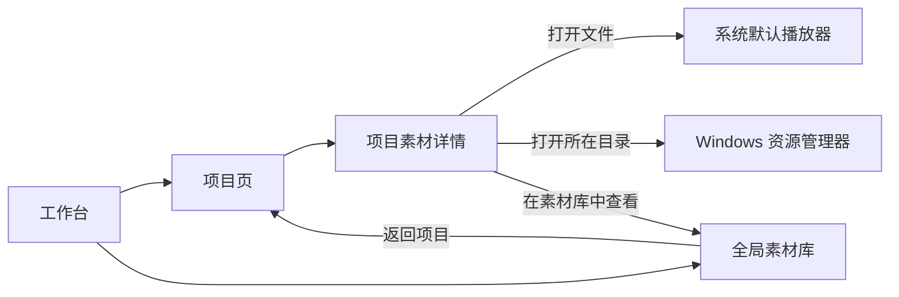
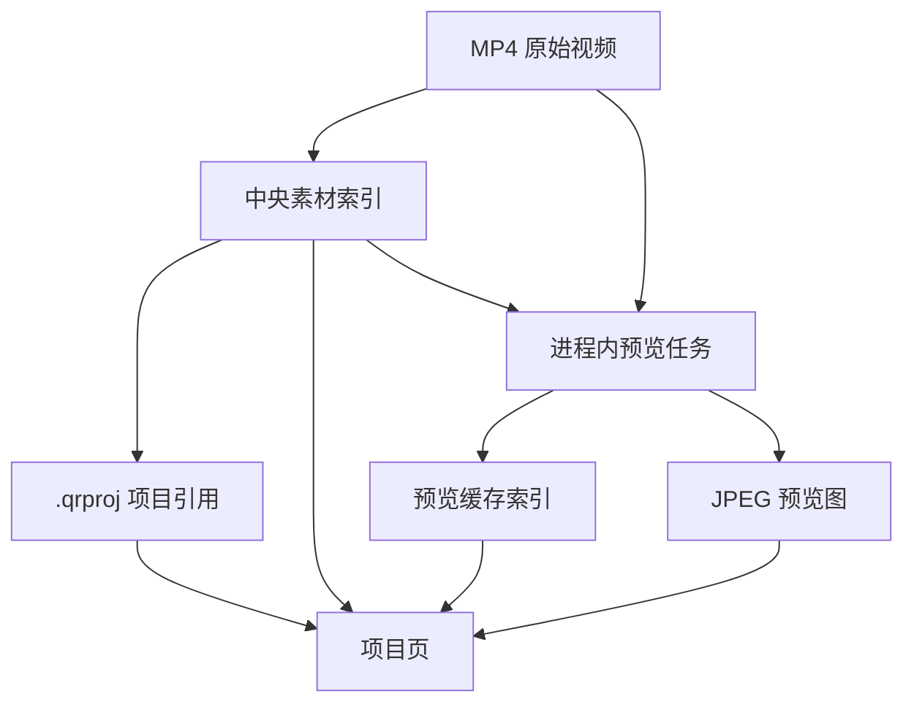
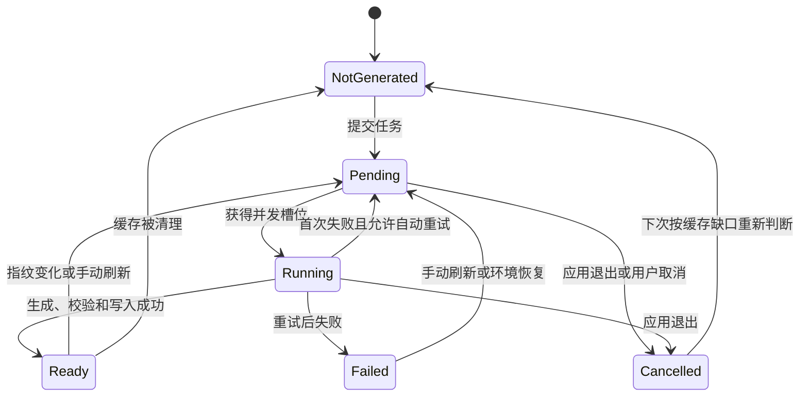

# QuickRec Full v1.9.1 产品需求文档

## 0. 追踪信息

| 项目 | 内容 |
| --- | --- |
| 产品 | QuickRec Full |
| 目标版本 | v1.9.1 |
| 文档版本 | PRD v1.0 |
| 当前状态 | 已实现、验收并正式发布 |
| PRD 类型 | 正式推进型，包含高保真原型确认门禁 |
| 上一个正式版本 | v1.9 |
| 编写日期 | 2026-07-27 |
| 上游来源 | `FULL-001`、`FULL-002`、`FULL-004`、`FULL-005` |
| 上游需求池 | `doc/archive/ideas/mypm-idea-pool-post-v1.9-2026-07-27.md` |
| 当前事实源 | `README.md`、`doc/current.md`、`doc/releases/v1.9.1/`、当前代码 |
| 原型输出目录 | `doc/releases/v1.9.1/prototype/` |
| 下游承接 | PRD 确认后新增 v1.9.1 `dev_plan.md` 与 `progress.md` |
| 产品线边界 | 仅 QuickRec Full；不修改 QuickRec Lite |
| 开发授权 | 已获得（2026-07-27） |

### 0.1 阶段判断

v1.9.1 是 QuickRec Full 在 v1.9 项目工作区基础上补齐“项目内素材识别与继续使用”的正式增量版本。

本版不是播放器、剪辑器或时间线版本。产品主线限定为：

1. 为全局素材生成可再生的静态预览图。
2. 在项目素材列表和详情区域展示预览图。
3. 从项目上下文打开素材、打开所在目录或跳转全局素材库。
4. 为 v1.9.2 提供稳定、只读的项目素材读取边界。

高保真原型用于确认项目页布局、状态表达和操作关系。原型确认后才能进入 PyQt 实现。

### 0.2 需求状态

- 已确认：
  - v1.9.1 是正式版本号。
  - 静态预览图同时出现在项目素材列表和详情区域。
  - 预览优先提取视频时长 10% 位置的画面。
  - 所有进入全局素材库的素材均具备预览生成资格。
  - 缓存位于 `%LOCALAPPDATA%\QuickRec\ThumbnailCache\v1\`。
  - 缓存格式为 JPEG，基准尺寸为 `320×180`，质量为 85。
  - 项目文件和中央素材索引不保存预览图内容或缓存路径。
  - 一个素材在多个项目中共享同一份有效缓存。
  - 缓存上限为 500 MB，使用最近最少使用策略清理。
  - 预览任务最多并发 2 个，单项超时 10 秒，自动重试 1 次。
  - 本版不在全局素材库中改造缩略图列表。
  - 本版不实现内嵌播放、时间线、多轨、剪辑或导出。
- 当前开放问题：无产品范围阻塞。
- 当前门禁：开发承接与业务实现已授权；按 `progress.md` 顺序实施。

---

## 1. 版本定位

### 1.1 一句话目标

让用户在项目内无需逐个打开外部播放器，就能通过静态预览图识别素材，并在同一项目上下文中继续打开、定位或管理素材。

### 1.2 当前版本目标

v1.9.1 必须完成：

1. 建立独立、可清理、可重建的静态预览图缓存。
2. 对新录制、手动导入、目录重建、历史迁移和既有素材补齐预览生成链路。
3. 在项目素材列表展示小型预览图。
4. 在选中素材的详情区域展示较大的预览图和完整素材摘要。
5. 提供“打开文件”“打开所在目录”“在素材库中查看”。
6. 提供“刷新所选预览”和“重建当前项目预览”。
7. 正确处理素材缺失、重新定位、覆盖、修改、损坏、超时和 FFmpeg 不可用。
8. 保持 v1.9 项目文件、中央项目索引和中央素材索引向后兼容。
9. 为 v1.9.2 提供只读项目素材描述接口，不提前引入时间线字段。
10. 对项目页、素材库和应用协调层做最小职责拆分。

### 1.3 版本成功定义

v1.9.1 成功必须同时满足：

- 新素材入库成功后，预览生成在后台执行，不阻塞视频保存或素材入库。
- 既有 v1.9 项目无需迁移项目文件即可展示预览。
- 项目页打开不等待预览生成。
- 同一素材被多个项目引用时不会生成重复有效缓存。
- 素材文件移动、重新定位、覆盖或修改后不会继续误用旧预览。
- 预览失败只影响预览，不改写视频、素材索引或项目引用的成功事实。
- 缺失素材可以保留最后一次有效预览，同时明确显示缺失状态。
- 所有操作在源码环境与 PyInstaller 打包环境行为一致。
- v1.9 的项目生命周期、项目内录制、全局素材库、120 FPS、设置和诊断无回归。
- 自动化、打包、GUI、缓存边界和 100%/125%/150% DPI 验收通过。

---

## 2. 背景与问题

### 2.1 当前产品事实

QuickRec Full v1.9 已经提供：

- 录制、素材库、项目、设置、诊断五页工作台。
- 中央素材索引与稳定素材 ID。
- 中央项目索引与独立 `.qrproj` 项目文件。
- 一个素材被多个项目引用。
- 从项目内开始录制并自动加入目标项目。
- 项目缺失、损坏、只读、外部冲突和安全删除处理。
- 项目素材列表中的文件名、状态、模式和路径。
- 全局素材库中的打开文件、打开目录、复制路径和重新定位等能力。

当前项目页无法直接展示素材画面。名称相似的连续录制需要逐个调用外部播放器才能识别。

### 2.2 问题定义

#### P-01 项目内素材难以快速识别

QuickRec 默认文件名以产品名和时间组成。连续录制的多条素材名称相似，仅凭名称、路径和模式无法判断内容。

#### P-02 项目上下文与全局素材操作断开

用户在项目页确认某条素材后，缺少直接打开文件、定位目录或跳转全局素材库的完整入口。

#### P-03 预览能力不能污染核心数据

预览图属于可再生派生数据。若将缓存路径写入 `.qrproj` 或中央素材索引，会让路径迁移、缓存清理和版本回滚变得脆弱。

#### P-04 同步生成预览会放大性能风险

项目最多可能引用 200 条素材。同步生成预览会阻塞项目打开、滚动和选择，破坏 v1.9 已建立的性能基线。

#### P-05 当前协调层不适合继续直接堆叠任务逻辑

`QuickRecApp`、`ProjectPage` 和 `MaterialLibraryDialog` 已承担较多协调职责。预览缓存、异步任务和页面跳转需要最小独立边界，但本版不允许全量重写。

---

## 3. 范围与优先级

### 3.1 范围表

| 范围 | 优先级 | 进入 v1.9.1 | 说明 |
| --- | --- | --- | --- |
| 静态预览图缓存 | P0 | 是 | 本版核心数据能力 |
| 新素材后台生成 | P0 | 是 | 覆盖所有正式入库来源 |
| 既有素材渐进补齐 | P0 | 是 | v1.9 无感兼容 |
| 项目列表小型预览 | P0 | 是 | 解决快速识别 |
| 项目详情较大预览 | P0 | 是 | 解决确认和继续使用 |
| 打开文件、打开目录、跳转素材库 | P0 | 是 | 完成基础使用闭环 |
| 缺失、损坏、超时和工具缺失降级 | P0 | 是 | 不破坏核心数据 |
| 刷新所选和重建当前项目 | P1 | 是 | 提供用户可见恢复入口 |
| 500 MB 缓存清理 | P1 | 是 | 控制磁盘占用 |
| v1.9.2 只读素材接口 | P1 | 是 | 只保留必要边界 |
| 全局素材库缩略图布局 | P2 | 否 | 本版仅作为预览来源和跳转目标 |
| 内嵌播放器 | P3 | 否 | 继续验证，不进入本版 |

### 3.2 方案收敛

采用“全局生成、项目展示、独立缓存”的方案：

- 预览资格来自全局素材索引。
- 缓存按素材 ID 和源文件指纹去重。
- 项目页只消费预览结果，不负责直接执行 FFmpeg。
- 全局素材库本版不改造成缩略图视图。
- `.qrproj`、`projects.json` 和 `recordings.json` 不增加预览缓存路径字段。

### 3.3 v2.0 前路线

| 版本 | 唯一产品主线 | 本版为后续提供的边界 |
| --- | --- | --- |
| v1.9.1 | 素材静态预览与基础使用闭环 | 只读项目素材描述 |
| v1.9.2 | 多轨时间线基础 | 使用素材 ID、源路径和预览资源 |
| v1.9.3 | 基础剪辑 | 使用时间线数据，不反向修改预览缓存 |
| v1.9.4 | 导出队列和完整链路验收 | 使用稳定项目与时间线事实源 |
| v2.0 | 完整工作台正式版 | 统一发布与验收 |

---

## 4. 用户角色与核心场景

| 用户角色 | 核心任务 | v1.9.1 价值 |
| --- | --- | --- |
| 内容创作者 | 从多次相似录制中找到正确素材 | 用画面而不是文件名识别 |
| 项目整理用户 | 在项目内检查素材并继续操作 | 不离开项目上下文完成基础动作 |
| 历史项目用户 | 打开 v1.9 已有项目 | 无需迁移即可渐进获得预览 |
| 文件迁移用户 | 移动视频后重新定位 | 自动失效旧缓存并生成新预览 |
| 排障用户 | 处理损坏、超时或缓存错误 | 获得占位、原因和重试入口 |

### 4.1 核心场景

#### SC-01 从相似素材中识别目标

用户打开项目，列表先展示已有缓存；未缓存项显示稳定占位图并在后台逐步更新。用户通过缩略图快速选择目标素材，在详情区域进一步确认。

#### SC-02 打开或定位素材

用户选中素材后，可以打开默认播放器、打开所在目录，或跳转全局素材库并选中同一记录。

#### SC-03 既有项目渐进补齐

用户首次使用 v1.9.1 打开已有项目时，项目立即可操作。当前可见素材优先生成预览，其余素材后台补齐。

#### SC-04 缺失素材保留识别线索

素材被外部移动或删除后，项目仍显示最后一次有效预览并叠加缺失状态。用户可以跳转素材库执行重新定位。

#### SC-05 预览失败后恢复

FFmpeg 超时、视频损坏或权限失败时，用户看到占位图和简短失败原因。恢复文件或环境后可刷新所选素材，也可以重建当前项目预览。

---

## 5. 术语与事实源

| 术语 | 定义 |
| --- | --- |
| 静态预览图 | 从视频内容提取的单张 JPEG 派生图片，不等于严格意义上的第一帧 |
| 源文件指纹 | 素材 ID、规范化路径、文件大小和最后修改时间组成的失效依据 |
| 预览缓存 | `%LOCALAPPDATA%\QuickRec\ThumbnailCache\v1\` 下的图片和索引 |
| 预览任务 | 当前进程中的异步生成任务，不持久化为长期队列 |
| 可见素材 | 当前项目列表视口内或当前选中的素材 |
| 当前项目重建 | 对当前项目引用的素材重新检查指纹并补齐或刷新预览 |
| 素材事实源 | `%APPDATA%\QuickRec\recordings.json` 中的中央素材记录 |
| 项目引用事实源 | 独立 `.qrproj` 文件中的素材稳定 ID |

事实源优先级：

1. 视频文件决定可提取内容。
2. 中央素材索引决定当前素材路径、状态和元数据。
3. 项目文件决定项目是否引用该素材。
4. 预览缓存只提供派生展示，不得覆盖前三类事实。

---

## 6. 信息架构与模块关系

### 6.1 页面关系



### 6.2 数据和任务关系



### 6.3 关键边界

- 项目页不直接调用 FFmpeg 子进程。
- 预览任务不写 `.qrproj`、`projects.json` 或 `recordings.json`。
- 预览失败不把素材状态改成缺失或损坏。
- 全局素材重新定位成功后触发缓存失效，不由项目页自行修改源路径。
- 同一进程内所有项目页和素材来源共享一个预览任务协调器。

---

## 7. 完整功能链路

### 7.1 新素材入库后生成

适用来源：

- 录制成功后写入中央素材索引；
- 手动导入；
- 目录重建；
- v1.5 历史迁移；
- 重试入库成功；
- 素材重新定位成功。

流程：

1. 素材业务链路先完成自身保存或入库。
2. 业务链路发出“素材可预览”事件。
3. 预览服务计算源文件指纹。
4. 若有效缓存已存在，更新最近使用时间，不创建任务。
5. 若缓存缺失或指纹变化，提交后台任务。
6. 任务生成临时 JPEG。
7. 校验图片可读取且字节数大于零。
8. 原子替换正式缓存文件并更新缓存索引。
9. 通知当前可见项目页更新对应素材。

约束：

- 第 2～9 步失败不得回滚素材入库。
- 新素材入库的成功反馈不得等待预览生成。
- 重复事件必须幂等。

### 7.2 既有素材渐进补齐

1. 用户打开项目页或全局素材库。
2. 系统加载中央素材索引。
3. 当前项目的可见素材和当前选中素材进入高优先级队列。
4. 当前项目其余素材进入普通优先级队列。
5. 中央素材库其余未缓存素材在后台低优先级补齐。
6. 工作台隐藏后任务继续执行。
7. 用户退出 QuickRec 时取消尚未完成的任务。
8. 下次启动后根据缓存缺口重新安排，不恢复上次任务队列。

不得：

- 在升级后执行阻塞式一次性迁移。
- 因后台补齐修改素材或项目业务更新时间。
- 在项目打开前等待全部素材完成。

### 7.3 预览提取

优先顺序：

1. 视频时长 10% 位置。
2. 第 1 秒。
3. 首个可解码画面。
4. 统一占位图。

规则：

- 已知时长大于 0 时使用 `duration_sec × 10%`。
- 时长未知时允许先调用现有 FFprobe 获取时长。
- 候选时间点超出短视频范围时自动进入下一策略。
- 使用项目随包提供并通过打包验证的 FFmpeg/FFprobe。
- 子进程使用参数数组，不拼接命令字符串。
- 支持中文、空格和常见 Windows 合法路径。
- 单次生成超时 10 秒。
- 首次失败自动重试 1 次；再次失败等待用户手动刷新。
- 生成目标为 `320×180` 容器，保持原始宽高比，剩余区域使用深色填充。
- JPEG 质量为 85。

### 7.4 打开项目与展示

1. 项目页按 v1.9 原流程加载项目和素材引用。
2. 项目素材列表立即显示文件名、状态、模式和占位图或有效缓存。
3. 选中素材后，详情区域显示较大预览、完整路径、时长、分辨率、FPS、模式、音频和文件状态。
4. 列表与详情复用同一张缓存图片，不额外生成不同尺寸文件。
5. 没有缓存时，详情显示占位和“正在生成”或失败状态。
6. 预览完成后局部更新对应条目，不重新加载整个项目。

### 7.5 打开文件

触发条件：

- 已选择素材；
- 中央素材记录存在；
- 文件状态可用；
- 路径指向普通文件。

结果：

- 调用系统默认播放器打开视频。
- 成功后保留当前项目和选中素材。

失败反馈：

- 文件已移动或删除：提示前往素材库重新定位。
- 系统无默认关联：提示打开所在目录。
- 系统调用失败：显示可理解错误并写入日志。

禁用规则：

- 待关联素材；
- 文件缺失；
- 路径不是普通文件。

### 7.6 打开所在目录

触发和禁用规则与“打开文件”一致。

结果：

- 打开 Windows 资源管理器并尽量选中目标文件。

失败反馈：

- 目录不存在或系统调用失败时保留当前项目状态并显示错误。

### 7.7 在素材库中查看

触发条件：

- 项目引用能解析到中央素材记录。

结果：

1. 工作台切换至素材库页。
2. 清除会阻止目标显示的临时查询条件，或提示用户清除条件。
3. 定位并选中目标素材。
4. 素材库顶部显示“来自项目：项目名称”。
5. 提供“返回项目”入口。
6. 返回后恢复原项目和原素材选中状态。

缺失素材：

- 中央记录仍存在时允许跳转，由素材库提供重新定位。

待关联素材：

- 中央记录不存在时禁用，并说明“该项目引用尚未关联到全局素材库”。

### 7.8 刷新所选预览

入口位于项目素材操作栏。

流程：

1. 用户选中素材。
2. 点击“刷新预览”。
3. 系统重新计算源文件指纹。
4. 删除或替换该素材当前有效缓存映射。
5. 提交高优先级任务。
6. 成功后局部更新列表和详情。

规则：

- 文件缺失时不得尝试读取，保留旧缓存并提示重新定位。
- 任务进行中时按钮禁用，避免重复提交。
- 刷新失败后按钮恢复可用。

### 7.9 重建当前项目预览

入口位于项目页更多菜单。

流程：

1. 用户选择“重建当前项目预览”。
2. 确认框显示项目素材总数、可用数和缺失数。
3. 用户确认后，系统重新检查所有引用的缓存指纹。
4. 只为缺失、失效或用户明确要求刷新的缓存提交任务。
5. 展示已完成、成功、失败、跳过和剩余数量。
6. 用户可以取消尚未开始的任务。
7. 已完成缓存保留，不因取消回滚。

归档项目：

- 允许重建，因为该操作不修改项目文件。

缺失素材：

- 保留已有缓存，不生成新缓存，计入跳过数量。

### 7.10 素材重新定位和文件变化

重新定位成功后：

1. 中央素材索引先完成路径与元数据更新。
2. 预览服务计算新指纹。
3. 旧指纹缓存失效。
4. 提交新预览任务。
5. 项目页继续按稳定素材 ID显示同一记录。

文件被原地覆盖或修改：

- 文件大小或最后修改时间变化时缓存失效。
- 重新生成成功前不得把旧图标记为当前有效图。
- UI 可以在生成期间显示旧图并叠加“预览更新中”，但不得隐藏文件已变化的事实。

### 7.11 缓存自动清理

触发条件：

- 写入新缓存后总占用超过 500 MB；
- 应用启动后首次使用预览服务时发现超过上限。

规则：

1. 按最近使用时间从旧到新清理。
2. 当前页面可见素材、当前选中素材和正在执行任务的素材受保护。
3. 只删除缓存图片和缓存索引项。
4. 不删除视频、中央素材记录或项目引用。
5. 单个文件删除失败不得阻止其余清理。
6. 清理后缓存仍超限时写入警告，但不阻止项目使用。

---

## 8. 页面与交互要求

### 8.1 项目素材列表

每条素材至少展示：

- `320×180` 比例的小型预览区域；
- 文件名；
- 可用、缺失、待关联等业务状态；
- 录制模式；
- 时长；
- 选中状态。

要求：

- 列表中的展示尺寸可以小于缓存原图，但保持 16:9 容器。
- 竖屏和非 16:9 视频完整显示，不裁掉主体。
- 正在生成时使用稳定骨架或占位，不改变行高。
- 生成失败时显示占位图和失败标识。
- 缺失素材显示已有预览并叠加缺失标识。
- 没有预览不得隐藏文件名和业务状态。
- 长文件名使用省略和工具提示，不撑破布局。

### 8.2 项目素材详情

详情区至少展示：

- 较大预览图；
- 文件名；
- 完整路径；
- 时长；
- 分辨率；
- FPS；
- 录制模式；
- 音频模式；
- 文件大小；
- 文件状态；
- 预览状态。

操作栏从左到右：

1. 打开文件；
2. 打开所在目录；
3. 在素材库中查看；
4. 刷新预览；
5. 从项目移除。

“从项目移除”继续沿用 v1.9 的安全语义，只删除项目引用。

### 8.3 空状态

项目没有素材时：

- 保留 v1.9 的“添加素材”和项目内三类录制入口。
- 不展示预览任务或缓存说明。

筛选或选择为空时：

- 详情区显示“请选择素材”。
- 操作按钮保持禁用。

### 8.4 预览状态表达

| 状态 | UI 表达 | 可执行操作 |
| --- | --- | --- |
| 未生成 | 占位图 | 打开类操作按文件状态决定；允许刷新 |
| 排队中 | 占位图＋“等待生成” | 不允许重复刷新 |
| 生成中 | 占位图或旧图＋进度状态 | 不允许重复刷新 |
| 可用 | 显示预览图 | 全部合法操作 |
| 生成失败 | 占位图＋简短原因 | 允许刷新、查看诊断 |
| 缓存失效 | 旧图叠加“更新中”或占位图 | 自动重新生成 |
| 文件缺失 | 最后有效预览＋缺失标识 | 禁用打开文件和目录；允许跳转素材库 |
| 待关联 | 占位或历史快照 | 禁用打开和跳转；允许从项目移除 |

### 8.5 确认和取消

- 刷新单条预览不需要确认。
- 重建当前项目需要确认。
- 取消重建只取消未开始任务。
- 关闭工作台只隐藏窗口，不取消任务。
- 退出 QuickRec 取消未完成任务，不等待整个队列完成。
- 退出过程中不得留下未完成的临时图片作为正式缓存。

### 8.6 反馈文案

成功：

- “预览已更新”
- “已在素材库中定位”
- “当前项目预览重建完成：成功 X，失败 Y，跳过 Z”

失败：

- “无法读取视频，预览未生成”
- “FFmpeg 不可用，请查看诊断”
- “预览生成超时，可以稍后重试”
- “文件已移动或删除，请在素材库中重新定位”

文案不得：

- 把预览失败描述为视频保存失败。
- 把素材缺失描述为项目损坏。
- 暴露冗长命令行、完整环境变量或内部异常堆栈。

---

## 9. 缓存与数据契约

### 9.1 缓存目录

```text
%LOCALAPPDATA%\QuickRec\ThumbnailCache\v1\
├── index.json
├── images\
│   └── <material_id>-<fingerprint_hash>.jpg
└── temp\
```

要求：

- 缓存目录不可用时，项目页继续以占位图工作。
- `temp` 中间文件生成完成并校验后才能原子替换正式图片。
- 应用启动时可清理超过合理生命周期的孤立临时文件。
- 用户手工删除整个缓存目录后不影响项目或素材数据。

### 9.2 源文件指纹

指纹输入：

```text
material_id
normalized_file_path
file_size_bytes
file_modified_ns
```

规则：

- 指纹哈希用于缓存文件名，不把完整路径写入文件名。
- Windows 路径规范化沿用项目现有规则。
- 任一输入变化均视为缓存失效。
- 相同素材 ID 和相同指纹只允许一个当前有效缓存。
- 不以文件名或扩展名单独判断缓存有效性。

### 9.3 缓存索引

最小结构：

```json
{
  "schema_version": 1,
  "items": {
    "material-id": {
      "fingerprint_hash": "哈希",
      "cache_file_name": "material-id-hash.jpg",
      "status": "ready",
      "updated_at": "ISO 8601",
      "last_accessed_at": "ISO 8601",
      "failure_code": null
    }
  },
  "extensions": {}
}
```

规则：

- 持久状态只使用 `ready` 和 `failed`。
- `pending`、`running` 和 `cancelled` 是进程内任务状态，不作为待恢复队列。
- 上次异常退出遗留的运行状态不得阻止下次按缓存缺口重新生成。
- 缓存索引采用原子写入。
- 缓存索引损坏时可扫描 `images` 目录重建最小映射；无法确认有效性的图片作为孤立缓存清理。
- 缓存索引损坏不得触发项目或素材索引恢复。

### 9.4 业务数据兼容

本版不得修改：

- `.qrproj` schema；
- `%APPDATA%\QuickRec\projects.json` schema；
- `%APPDATA%\QuickRec\recordings.json` 中素材核心字段；
- 现有素材 ID 和项目 ID。

不得把以下字段写入项目文件：

- 预览图片绝对路径；
- 缓存文件名；
- 任务状态；
- FFmpeg 错误；
- 时间线、轨道或剪辑字段。

### 9.5 v1.9.2 只读素材边界

提供稳定的只读描述对象，具体类名由技术设计确认：

```text
material_id
project_id
file_path
file_name
business_status
duration_sec
width
height
fps
mode
audio_source
file_size_bytes
preview_status
preview_path
```

规则：

- 数据由项目引用、中央素材索引和预览缓存组合得出。
- 调用方不得通过该对象直接写项目文件或素材索引。
- `preview_path` 可为空，且不得成为后续多轨的必填字段。
- 本版不定义 `tracks`、`clips`、时间刻度、入点、出点或轨道顺序。

---

## 10. 任务状态机



状态规则：

- 每个素材同一时间最多一个活动任务。
- 同一任务的重复提交只提升优先级，不创建重复子进程。
- 运行中的 FFmpeg 在退出时应获得短暂终止机会，随后强制结束。
- 取消任务不记录为生成失败。
- 失败记录包含稳定错误码，不把完整 stderr 直接展示给用户。

---

## 11. 异常、失败与降级

| 异常 | 业务结果 | 预览结果 | 用户反馈 |
| --- | --- | --- | --- |
| FFmpeg 不存在 | 素材和项目不变 | 失败 | 提示查看诊断与重试 |
| FFmpeg 启动失败 | 素材和项目不变 | 失败 | 显示“预览工具启动失败” |
| FFmpeg 超时 | 素材和项目不变 | 终止并失败 | 显示超时，可重试 |
| FFmpeg 返回非零 | 素材和项目不变 | 失败 | 显示无法读取视频 |
| 输出为空或不是有效图片 | 素材和项目不变 | 失败，不写正式缓存 | 显示生成失败 |
| 视频损坏 | 素材和项目状态沿用原事实 | 失败 | 显示视频不可解析 |
| 源文件缺失 | 项目显示缺失 | 不生成，保留已有缓存 | 引导素材库重新定位 |
| 缓存目录不可写 | 素材和项目不变 | 失败 | 项目继续使用占位图 |
| 缓存索引写入失败 | 素材和项目不变 | 临时图不成为正式有效缓存 | 写日志并允许重试 |
| 缓存图片删除失败 | 素材和项目不变 | 继续清理其他项 | 日志警告 |
| 工作台关闭 | 无影响 | 任务继续 | 无额外提示 |
| QuickRec 退出 | 无影响 | 取消未完成任务 | 下次自动补缺 |

降级原则：

1. 视频和索引成功优先于预览成功。
2. 文本信息始终可用。
3. 单个素材失败不影响其他素材。
4. 缓存失败不阻止项目打开、关闭、归档或恢复。
5. 不用零值或空图片冒充成功预览。

---

## 12. 工程支撑边界

### 12.1 最小职责拆分

| 边界 | 负责 | 不负责 |
| --- | --- | --- |
| 预览缓存 | 指纹、索引、图片路径、容量和清理 | Qt 控件、项目写入 |
| 预览生成 | FFmpeg 参数、超时、结果校验和错误分类 | 页面导航 |
| 预览任务协调 | 优先级、并发、去重、取消和通知 | 长期持久队列 |
| 项目素材查询 | 合并项目引用、素材事实和预览状态 | 文件事务 |
| ProjectPage | 展示、选择、按钮状态和用户反馈 | 直接启动 FFmpeg、直接写 JSON |
| MaterialLibraryDialog | 提供素材定位和既有文件操作 | 项目页缓存布局 |
| QuickRecApp | 页面路由、返回项目上下文和应用退出协调 | 预览缓存细节 |

### 12.2 禁止扩大

- 不全量重写 `QuickRecApp`。
- 不全量重写 `ProjectPage`。
- 不全量重写 `MaterialLibraryDialog`。
- 不重构无关录制核心。
- 不引入数据库、守护进程或消息队列。
- 不加入 Qt Multimedia、VLC 或其他播放器依赖。
- 不把预览任务设计成可恢复的长期后台作业系统。

### 12.3 质量门禁

- 新增预览缓存、生成、任务协调和项目素材查询模块语句覆盖率不低于 80%。
- 项目总体覆盖率保持不低于 80%。
- 新增和修改模块纳入 ruff、mypy 和 compileall。
- CI 覆盖 `master`、`test` 和 Pull Request。
- `test`、`master` 和 release tag 继续执行 packaging smoke。
- 至少一项打包集成测试使用真实随包 FFmpeg 生成并读取 JPEG。

---

## 13. 影响范围

| 维度 | 影响 |
| --- | --- |
| 前端 / UI | 项目素材列表和详情增加预览、操作栏、刷新和重建状态 |
| 页面导航 | 项目页与全局素材库之间增加带返回上下文的跳转 |
| 应用协调 | 增加全局预览任务协调和退出取消 |
| 项目服务 | 不修改项目 schema；增加只读素材组合查询 |
| 素材库服务 | 入库、迁移、重建和重新定位成功后触发预览事件 |
| 本地数据 | 新增 `%LOCALAPPDATA%\QuickRec\ThumbnailCache\v1\` |
| 配置 | 不新增用户配置项；500 MB 为本版本固定策略 |
| 日志与诊断 | 新增预览任务、缓存、清理和失败摘要 |
| 打包 | 复用现有 FFmpeg/FFprobe；新增模块和占位图资源 |
| 性能 | 增加最多 2 个后台 FFmpeg 子进程；项目 UI 不得等待 |
| 回滚 | 缓存可直接忽略或删除；v1.9 数据继续可用 |
| QuickRec Lite | 不涉及，不修改 |

---

## 14. 日志、诊断与隐私

### 14.1 日志事件

| 事件 | 最小上下文 |
| --- | --- |
| 预览任务提交 | 素材 ID、优先级、触发来源 |
| 预览缓存命中 | 素材 ID、指纹摘要 |
| 预览生成开始 | 素材 ID、策略、尝试次数 |
| 预览生成成功 | 素材 ID、耗时、图片字节数 |
| 预览生成失败 | 素材 ID、失败阶段、错误码、耗时 |
| 预览任务取消 | 素材 ID、取消来源 |
| 预览缓存失效 | 素材 ID、失效原因 |
| 缓存清理 | 清理数量、释放字节数、失败数量 |
| 项目预览重建 | 项目 ID、成功、失败、跳过和取消数量 |
| 素材库跳转 | 项目 ID、素材 ID、定位结果 |

### 14.2 错误分类

至少区分：

- `ffmpeg_missing`
- `ffmpeg_start_failed`
- `ffmpeg_timeout`
- `ffmpeg_nonzero_exit`
- `source_missing`
- `source_unreadable`
- `image_empty`
- `image_invalid`
- `cache_unwritable`
- `cache_index_write_failed`
- `cancelled`

### 14.3 隐私

- 普通日志不输出完整 FFmpeg 命令和完整环境变量。
- 诊断摘要不默认输出完整视频路径。
- 允许记录素材 ID、项目 ID、文件名、路径哈希和错误阶段。
- 不上传视频、预览图、项目文件或缓存索引。
- 静态预览图只保存在本地。

---

## 15. 高保真原型门禁

### 15.1 输出目录

```text
doc/releases/v1.9.1/prototype/
├── index.html
├── styles.css
├── app.js
├── prototype-design.md
├── reference/
└── validation/
```

### 15.2 必须覆盖

- 项目素材列表的小型预览；
- 选中素材的详情预览；
- 未生成、排队、生成中、可用、失败和失效状态；
- 文件可用、缺失和待关联状态；
- 打开文件、打开目录和素材库跳转；
- 返回项目上下文；
- 刷新所选预览；
- 重建当前项目预览确认、进度、取消和结果；
- 归档项目中的只读预览；
- 20 条和 50 条相似素材；
- 200 条项目素材的长列表表达；
- 中文、空格、长文件名和竖屏视频；
- 960×640 最小窗口；
- 100%、125%、150% DPI。

### 15.3 原型确认规则

- 延续 v1.9 已确认的工作台视觉和组件规范。
- 不重新设计录制、设置或诊断页面。
- 每个按钮就近说明触发、结果、成功、失败和禁用规则。
- 预览状态与素材业务状态必须视觉可区分。
- 原型通过用户确认后才能进入 PyQt 实现。

---

## 16. 开发前验收口径

### 16.1 验收目标

证明 v1.9.1 在不改变项目和素材核心数据的前提下，能够稳定生成、展示、失效和清理预览缓存，并完成项目内素材基础使用闭环。

### 16.2 性能标准

| 指标 | 标准 |
| --- | --- |
| 有缓存项目首次打开 | 不超过 1 秒 |
| 无缓存项目首次打开 | 不超过 1 秒进入可操作状态，不等待预览 |
| 普通选择、滚动和页面切换反馈 | 不超过 500 ms |
| 预览并发 | 最多 2 个 FFmpeg 任务 |
| 单次生成超时 | 10 秒 |
| 自动重试 | 最多 1 次 |
| 项目素材边界 | 200 条引用 |
| 缓存容量 | 不超过 500 MB；受保护项导致的短时超限需有日志 |
| UI 稳定性 | 任务完成不得改变行高、重置滚动位置或清空选择 |

### 16.3 功能验收

#### 新素材

- 录制、手动导入、目录重建、历史迁移和重试入库成功后均可生成预览。
- 预览失败不改变原业务成功结果。
- 同一素材重复触发不生成重复有效缓存。

#### 既有项目

- v1.9 项目无需修改项目文件即可打开。
- 当前可见素材优先生成。
- 工作台关闭后任务继续，应用退出后任务取消。
- 下次启动按缓存缺口继续，不恢复旧任务队列。

#### 提取与缓存

- 10% 位置成功时使用该画面。
- 10% 失败时按已确认顺序降级。
- 输出图片可读取、非空且尺寸符合规则。
- 中文、空格、短视频、竖屏和非 16:9 视频可处理。
- 文件大小或修改时间变化后旧缓存失效。
- 同一素材跨项目共享缓存。

#### 项目页

- 列表和详情均能展示预览。
- 预览缺失或失败不隐藏文本信息。
- 打开文件、打开目录和跳转素材库符合启用规则。
- 从素材库返回后恢复项目和素材上下文。
- 归档项目可以查看和刷新预览，但项目编辑仍保持只读。

#### 缺失与恢复

- 缺失素材保留已有预览并叠加缺失状态。
- 缺失素材不重新读取文件。
- 重新定位成功后旧缓存失效并生成新预览。
- 刷新失败后用户仍可再次刷新。
- 重建取消不删除已完成缓存。

#### 清理

- 超过 500 MB 后按最近最少使用顺序清理。
- 当前可见、选中和任务中的素材不被清理。
- 清理缓存不删除视频、素材记录或项目引用。
- 手工删除缓存目录后可以自动重建。

### 16.4 数据安全验收

- `.qrproj` 内容在打开项目和生成预览前后字节一致。
- `projects.json` 不因预览生成发生业务字段变化。
- `recordings.json` 不新增预览缓存路径。
- 预览失败、缓存写入失败和缓存索引损坏均不破坏三类核心数据。
- 回滚 v1.9 后项目和素材仍可正常使用。

### 16.5 证据要求

必须保留：

- 原型截图与确认记录；
- 源码环境和打包环境的预览结果；
- 受控 MP4、预览 JPEG、缓存索引和日志路径；
- 文件指纹变化前后的缓存证据；
- 500 MB 边界夹具和清理结果；
- 20、50、200 条素材的性能记录；
- 100%、125%、150% DPI 截图；
- 核心 JSON 生成前后哈希；
- QuickRec Lite 未修改的 Git 证据。

### 16.6 通过标准

只有以下条件全部满足，才能进入发布收口：

1. P0 功能全部通过。
2. 不存在项目、素材或视频数据损坏。
3. 预览失败降级不影响业务事实。
4. 源码与打包环境行为一致。
5. 性能、容量和 DPI 门禁通过。
6. v1.9 回归通过。
7. 自动化、静态检查、packaging 和 GUI 验收通过。
8. QuickRec Lite 未修改。

### 16.7 不通过处理

- 数据损坏、视频误删、项目文件被预览链路改写：发布阻塞，立即进入 Bugfix。
- 项目打开被预览任务阻塞：发布阻塞。
- 打包环境无法生成预览而源码环境可以：发布阻塞。
- 单个损坏视频导致整个队列停止：发布阻塞。
- 缓存超限但不影响数据和核心使用：记录重要缺陷并评估是否阻塞。
- 非关键视觉偏差：记录并完成定向复验，不得掩盖。

---

## 17. 测试与验证

### 17.1 自动化测试

至少覆盖：

- 指纹生成和 Windows 路径规范化；
- 同素材同指纹缓存命中；
- 路径、大小和修改时间变化失效；
- 缓存索引原子写入与损坏恢复；
- 临时图片不成为正式缓存；
- 10%、第 1 秒、首个可解码画面降级顺序；
- FFmpeg 缺失、启动失败、超时、非零退出和空图片；
- 中文、空格和长路径；
- 最大并发 2；
- 重复任务去重和优先级提升；
- 自动重试最多 1 次；
- 工作台隐藏继续任务；
- 应用退出取消任务；
- 500 MB 最近最少使用清理；
- 可见、选中和运行中缓存保护；
- 新录制、导入、重建、迁移、重试和重新定位触发；
- 项目列表与详情状态；
- 打开文件、打开目录、跳转和返回项目；
- 刷新所选和重建当前项目；
- 缺失素材保留旧预览；
- `.qrproj` 和中央索引不被修改；
- v1.9.2 只读描述对象。

### 17.2 集成与打包测试

- 使用真实项目随包 FFmpeg 对受控 MP4 生成 JPEG。
- 检查打包目录中的 FFmpeg/FFprobe 存在且可执行。
- 校验 JPEG 字节、格式和解码结果。
- 验证 frozen 环境缓存根目录仍为 `%LOCALAPPDATA%`。
- 验证打包程序退出后没有残留 FFmpeg 进程。
- 验证缓存目录不可写时项目仍可使用。

### 17.3 GUI 手动验收

- 新项目和 v1.9 既有项目；
- 20 条和 50 条相似素材识别；
- 200 条项目素材滚动、选择和预览更新；
- 新录制素材自动出现预览；
- 打开文件、目录、素材库及返回项目；
- 缺失、待关联、重新定位和原地覆盖；
- 单项刷新、批量重建、取消和失败重试；
- 归档项目；
- 缓存超限和自动清理；
- 应用隐藏、关闭、退出和重启；
- 100%、125%、150% DPI；
- 中文、空格、长路径、竖屏和短视频。

### 17.4 回归范围

- 全屏、区域和窗口录制；
- 无声、系统声音、麦克风和双音频；
- 30、60 和 120 FPS；
- 全局素材库搜索、筛选、排序、分页和文件操作；
- 项目创建、打开、归档、恢复、删除和项目内录制；
- 设置保存和诊断导出；
- 托盘、快捷键和应用退出；
- v1.9 项目文件兼容；
- QuickRec Lite 工作区状态。

---

## 18. 发布阻塞条件

出现任一情况不得发布 v1.9.1：

1. 预览链路修改或损坏 `.qrproj`、`projects.json` 或 `recordings.json`。
2. 预览失败导致录制、导入或素材入库被报告为失败。
3. 项目打开等待预览生成或出现明显 UI 阻塞。
4. 同一素材产生无法控制的重复缓存或任务。
5. 文件变化后继续把旧预览标记为有效。
6. 缺失素材无法跳转素材库恢复。
7. 打包环境无法调用随包 FFmpeg。
8. FFmpeg 失败导致队列整体停止或残留进程。
9. 缓存清理误删视频、素材记录或项目引用。
10. 200 条项目素材下无法正常滚动、选择或切换。
11. 100%、125% 或 150% DPI 下关键控件不可操作。
12. v1.9 核心录制、素材库或项目功能回归失败。
13. QuickRec Lite 被修改。

---

## 19. 明确非目标

v1.9.1 不做：

- 内嵌视频播放器；
- 自动播放、音量、播放进度和音频焦点；
- 时间线和多轨；
- 入点、出点、分割、裁剪和拼接；
- 剪辑；
- 导出队列；
- 项目分类、收藏、标签和 AI；
- 字幕、摘要、章节和云同步；
- 全局素材库缩略图布局改版；
- 数据库；
- WGC；
- 144、165 或 240 FPS 正式输出；
- 多显示器和 4K 正式能力；
- QuickRec Lite 改动；
- 全量重写 `QuickRecApp`、`ProjectPage` 或 `MaterialLibraryDialog`。

---

## 20. 风险与回退

### 20.1 风险

| 风险 | 等级 | 控制方式 |
| --- | --- | --- |
| 大量 FFmpeg 任务抢占录制资源 | 高 | 最多并发 2；录制期间允许降低后台任务优先级或暂停启动新任务 |
| 项目页因图片解码卡顿 | 高 | 异步加载、固定尺寸、局部更新 |
| 首帧代表性不足 | 中 | 使用时长 10% 位置并提供手动刷新 |
| 缓存失效遗漏 | 高 | 稳定素材 ID＋路径＋大小＋修改时间指纹 |
| 缓存持续膨胀 | 中 | 500 MB 最近最少使用清理 |
| FFmpeg 打包路径不一致 | 高 | 复用并测试现有解析逻辑和真实打包目录 |
| 缓存索引损坏 | 中 | 原子写入、可重建、与业务数据隔离 |
| 职责拆分扩大为重写 | 中 | 只建立预览和只读查询所需边界 |
| 后续时间线依赖缓存路径 | 中 | 预览路径可空，不进入项目文件事实源 |

### 20.2 代码回退

- 回退到 v1.9 发布 tag。
- v1.9 忽略 v1.9.1 新增缓存目录。
- 不移动或重写 v1.9 tag。

### 20.3 数据回退

- 保留视频、`recordings.json`、`projects.json` 和 `.qrproj`。
- 可以安全删除 `%LOCALAPPDATA%\QuickRec\ThumbnailCache\v1\`。
- 删除缓存后只失去可再生预览，不丢失业务数据。
- 回退不需要执行项目或素材 schema 迁移。

---

## 21. 追溯关系

| v1.9.1 范围 | 上游来源 | v1.9 基础 | 下游方向 |
| --- | --- | --- | --- |
| 打开文件、打开目录、素材库跳转 | `FULL-001` | 稳定素材 ID、全局素材操作 | 项目内使用闭环 |
| 静态预览图 | `FULL-002` | 项目素材引用、FFmpeg 打包 | v1.9.2 素材读取 |
| 最小职责拆分 | `FULL-004` | 项目页、素材库、QuickRecApp | 降低时间线接入耦合 |
| 增量质量门禁 | `FULL-005` | v1.9 测试和 CI | 后续版本稳定演进 |

本 PRD 不把需求池中的 `FULL-003` 内嵌播放器升级为确定需求。

---

## 22. PRD 门禁检查

- [x] 目标版本和产品线明确。
- [x] 唯一产品主线明确。
- [x] 用户场景和问题明确。
- [x] 静态预览图术语明确。
- [x] 生成时机和补齐策略明确。
- [x] 缓存位置、格式、尺寸、质量和上限明确。
- [x] 指纹、失效、去重、清理和重建规则明确。
- [x] 异步并发、超时、重试、取消和退出规则明确。
- [x] 项目列表、详情和操作入口明确。
- [x] 缺失、损坏和失败降级明确。
- [x] v1.9 项目兼容和数据安全明确。
- [x] v1.9.2 只读边界明确。
- [x] 原型、自动化、打包、GUI 和 DPI 验收明确。
- [x] 发布阻塞、风险和回退明确。
- [x] 非目标明确。
- [x] 产品负责人确认本 PRD。（2026-07-27）
- [x] 高保真原型完成并确认。（2026-07-27）
- [x] 开发承接文档完成并确认。（2026-07-27）
- [x] 获得业务实现授权。（2026-07-27）

---

## 23. 下一阶段

本 PRD、高保真原型与开发承接已经确认，当前进入业务实施阶段。

实施按顺序执行：

1. 以 `dev_plan.md`、`progress.md` 和本 PRD 为事实源。
2. 严格按 D0-D8 顺序推进。
3. 每完成一项同步更新 `progress.md`。
4. 开发过程写入 `dev_log.md`，缺陷写入独立 `bugfix-log.md`。

不得扩大到播放器、时间线、剪辑、导出队列或 QuickRec Lite。
