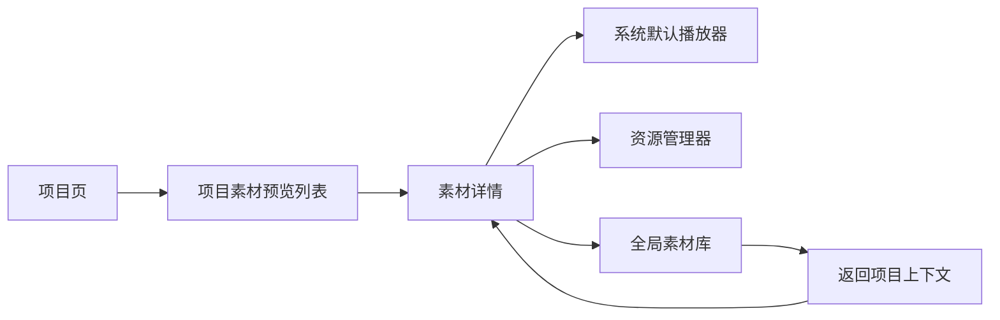

# QuickRec Full v1.9.1 素材预览原型说明

## 1. 文档信息

| 项目 | 内容 |
| --- | --- |
| 版本 | QuickRec Full v1.9.1 |
| 原型类型 | 高保真、可交互、开发契约型 HTML 原型 |
| 当前状态 | 已由产品负责人确认（2026-07-27） |
| 上游需求 | `doc/releases/v1.9.1/prd.md` |
| 设计基线 | `doc/releases/v1.9/prototype/` |
| 原型入口 | `doc/releases/v1.9.1/prototype/index.html` |
| 产品线边界 | 仅 QuickRec Full，不修改 QuickRec Lite |
| 实现门禁 | 本原型确认后才能进入 PyQt 实现 |

## 2. 原型目标

本原型只验证 v1.9.1“项目素材预览与基础使用闭环”，不重新设计 v1.9 五页工作台，也不验证播放器、时间线或剪辑。

核心目标：

1. 在项目素材列表中通过画面快速识别相似素材。
2. 在详情区确认素材画面、元数据和文件状态。
3. 从项目上下文打开文件、打开目录或跳转全局素材库。
4. 让缺失、生成中、生成失败和缓存失效状态清晰可恢复。
5. 证明预览缓存与项目文件、素材索引和视频相互隔离。

## 3. 打开方式

在项目目录启动本地服务：

```powershell
python -m http.server 8770 --directory E:\codex\QuickRec\doc\releases\v1.9.1\prototype
```

浏览器访问：

```text
http://127.0.0.1:8770/index.html?page=projects
```

支持的预览状态参数：

```text
?page=projects
?state=preview-loading
?state=preview-failed
?state=preview-missing
?state=preview-rebuild
?page=projects&embed=1
```

v1.9 既有页面和状态参数继续保留，用于回归页面关系。

## 4. 信息架构

工作台仍为：

1. 录制
2. 素材库
3. 项目
4. 设置
5. 诊断

v1.9.1 只扩展“项目”页的素材区域，并在“素材库”页增加来源项目返回条。



## 5. 项目素材布局

### 5.1 左侧预览列表

每条素材使用固定尺寸列表项，包含：

- 16:9 静态预览；
- 时长；
- 文件名；
- 分辨率、FPS 和录制模式；
- 素材业务状态；
- 当前项目归属摘要。

列表项的行高固定。占位、图片加载或状态更新不得造成布局跳动。

### 5.2 右侧详情

详情区包含：

- 较大静态预览；
- 预览状态；
- 画面提取位置；
- 文件名和完整路径；
- 时长、分辨率、FPS、模式、音频、大小和缓存摘要；
- 打开文件、打开目录、在素材库中查看和刷新预览；
- 缓存与业务数据隔离说明。

列表和详情使用同一份 `320×180` JPEG 缓存，不生成第二套详情图片。

### 5.3 项目页顶部动作

“重建预览”位于项目素材标题右侧，与“添加素材”和“录制到此项目”同组。

该入口：

- 检查当前项目全部素材；
- 只处理缓存缺失、失效或明确刷新的项；
- 展示成功、失败、跳过和剩余数量；
- 允许取消未开始任务；
- 不修改 `.qrproj`。

## 6. 预览状态

| 状态 | 画面 | 操作 |
| --- | --- | --- |
| 可用 | 显示 JPEG 与“视频 10% 位置” | 全部合法操作 |
| 未生成 | 稳定占位图 | 打开类操作按文件状态决定，可刷新 |
| 排队 / 生成中 | 占位图与进度状态 | 禁止重复刷新 |
| 生成失败 | 占位图、原因和重试 | 保留打开与定位能力 |
| 缓存失效 | 旧图或占位加“更新中” | 自动重新生成 |
| 文件缺失 | 历史预览加缺失蒙层 | 禁止打开文件和目录，允许跳转素材库 |
| 待关联 | 占位图 | 禁止打开和跳转，允许从项目移除 |

预览失败和素材业务失败使用不同颜色、文案和恢复入口。

## 7. 核心交互

### 7.1 选择素材

点击左侧列表项后：

1. 当前项目保持不变。
2. 右侧详情局部更新。
3. 列表滚动位置保持。
4. 不写项目文件或缓存索引。

### 7.2 打开文件

- 仅文件可用时启用。
- 调用系统默认播放器。
- 失败时提供打开目录或素材库恢复建议。
- 不引入内嵌播放器。

### 7.3 打开目录

- 仅文件可用时启用。
- 调用资源管理器并定位目标文件。
- 文件缺失时禁用，避免打开错误目录造成误解。

### 7.4 在素材库中查看

1. 切换至素材库页。
2. 定位并选中同一素材。
3. 显示“来自项目”返回条。
4. 返回后恢复原项目与原素材。

素材缺失但中央记录仍存在时允许跳转，由素材库承接重新定位。

### 7.5 刷新所选预览

- 立即进入生成中状态。
- 健康素材完成后局部更新。
- 损坏样本保持失败并允许再次刷新。
- 缺失素材禁止读取源文件。

### 7.6 重建当前项目预览

确认页明确：

- 当前项目素材总数；
- 可用、缺失和失败数量；
- 不修改项目文件、中央索引或视频。

进度页展示：

- 成功；
- 失败；
- 跳过；
- 剩余。

取消只取消尚未开始任务。

## 8. 缓存与任务表达

原型按以下产品规则表达：

- 缓存根目录：`%LOCALAPPDATA%\QuickRec\ThumbnailCache\v1\`。
- 图片格式：JPEG。
- 基准尺寸：`320×180`。
- 图片质量：85。
- 容量上限：500 MB。
- 并发：最多 2 个 FFmpeg。
- 单项超时：10 秒。
- 自动重试：1 次。
- 应用退出：取消未完成任务。
- 下次启动：按缓存缺口重新安排，不恢复持久任务队列。

原型不模拟真实 FFmpeg，只演示状态和交互契约。

## 9. 视觉与组件

延续 v1.9 设计系统：

- 浅色工作区；
- 深色窄侧栏；
- 蓝色主操作；
- 绿色成功；
- 黄色预览或可恢复警告；
- 红色文件缺失或危险状态；
- 小圆角和紧凑间距；
- Segoe UI / Microsoft YaHei UI；
- 统一线性 SVG 图标。

新增组件：

- 预览素材列表项；
- 16:9 缩略图容器；
- 历史预览缺失蒙层；
- 预览状态标签；
- 素材详情预览；
- 项目来源返回条；
- 预览重建确认和进度。

不使用：

- 大型营销卡片；
- 自动播放；
- 播放器控制条；
- 装饰性插画；
- 主题系统。

## 10. 静态素材

`assets/` 中的 PNG 来自 v1.9 已确认原型验证截图，用于模拟用户录制内容：

```text
assets/material-library.png
assets/material-recording.png
assets/material-diagnostics.png
```

这些图片只服务 HTML 原型，不进入 QuickRec 正式打包资源。正式实现由 FFmpeg 生成本地 JPEG。

## 11. 开发交互契约

点击顶部“开发标注”后，每个交互控件展示：

- 触发条件；
- 即时结果；
- 成功反馈；
- 失败反馈；
- 禁用规则；
- 取消或关闭行为；
- 数据影响。

新增契约：

- `projects.preview-select`
- `projects.preview-open`
- `projects.preview-folder`
- `projects.preview-library`
- `library.return-project`
- `projects.preview-refresh`
- `projects.preview-rebuild`

缺少契约的控件必须导致原型静态验证失败。

## 12. DPI 与窗口

验证尺寸：

- 桌面：`1440×1000`
- 最小窗口：`960×640`
- 单显示器缩放：100%、125%、150%

要求：

- 列表预览不变形；
- 竖屏视频完整显示；
- 长文件名和中文空格路径不撑破布局；
- 按钮可点击且不重叠；
- 状态叠层不遮挡时长；
- 详情元数据可以在窄窗口换成两列；
- 内部区域允许滚动，底部操作不得遮挡内容。

## 13. 与实现的映射

| 原型区域 | 预期实现边界 |
| --- | --- |
| 预览列表和详情 | `ProjectPage` 展示层 |
| 素材组合视图 | 只读项目素材查询边界 |
| 图片生成 | 独立预览生成服务 |
| 缓存与清理 | 独立预览缓存服务 |
| 并发和退出 | 进程内任务协调器 |
| 跳转与返回 | `QuickRecApp` 页面协调 |
| 素材事实 | 现有中央素材索引 |
| 项目引用 | 现有 `.qrproj` |

UI 不直接调用 FFmpeg，不直接写 JSON。

## 14. 明确非目标

- 全局素材库缩略图改版；
- 内嵌视频播放器；
- 时间线、多轨和剪辑；
- 导出队列；
- AI、字幕、摘要和标签；
- 云同步；
- WGC 和高刷新率扩展；
- QuickRec Lite 改动；
- 全量架构重写。

## 15. 原型确认清单

- [x] 项目素材列表能够通过画面识别素材。
- [x] 详情区信息层级清楚。
- [x] 可用、生成中、失败和缺失状态可区分。
- [x] 打开文件和目录规则清楚。
- [x] 素材库跳转与返回项目上下文可交互。
- [x] 刷新所选预览可交互。
- [x] 重建当前项目预览可交互。
- [x] 归档项目允许查看和重建预览。
- [x] 预览失败不被表达为素材或视频失败。
- [x] 每个新增控件有开发契约。
- [x] 1440×1000 自动验证通过。
- [x] 960×640 自动验证通过。
- [x] 100%、125%、150% 原型表达无关键裁切。
- [x] 产品负责人确认原型。（2026-07-27）

## 16. 确认后的下一步

原型已经确认，下一步：

1. 把 PRD 和原型状态更新为“已确认”。
2. 编写 v1.9.1 `dev_plan.md`。
3. 编写 v1.9.1 `progress.md`。
4. 等待明确业务实现授权。

开发承接确认并获得明确业务实现授权前，不修改业务代码，不提交、不推送、不打 tag。
