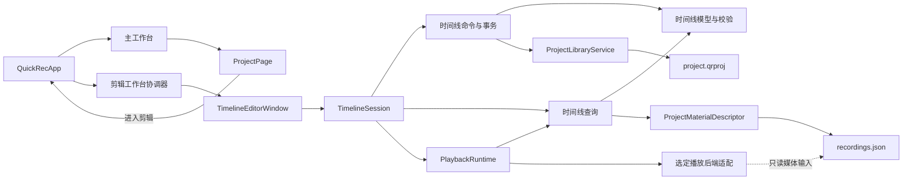

# QuickRec Full v1.9.2 开发计划

## 0. 追踪信息

| 项目 | 内容 |
| --- | --- |
| 目标版本 | QuickRec Full v1.9.2 |
| 版本主题 | 可播放多轨时间线 |
| 当前状态 | D0-D10 与发布收口已完成；v1.9.2 正式发布 |
| 当前正式版本 | v1.9.2 |
| 当前正式分支 | `master`；`test` 已完成集成 |
| 当前基线 | tag `v1.9.1` / `402c2c6` |
| 当前工作区 | `E:\codex\QuickRec` |
| 需求池 | `doc/archive/ideas/mypm-idea-pool-v1.9.2-2026-07-27.md` |
| 需求事实源 | `doc/releases/v1.9.2/prd.md` |
| 交互事实源 | `doc/releases/v1.9.2/prototype/` |
| 状态事实源 | `doc/releases/v1.9.2/progress.md` |
| 技术门禁输出 | 实施开始后创建 `doc/releases/v1.9.2/playback-backend-spike.md` |
| 开发日志 | 实施开始后创建 `doc/releases/v1.9.2/dev_log.md` |
| 自动验证记录 | D9 创建 `doc/releases/v1.9.2/verification.md` |
| GUI 验收记录 | D10 创建 `doc/releases/v1.9.2/manual-verification.md` |
| 缺陷记录 | 发现真实缺陷时创建 `doc/releases/v1.9.2/bugfix-log.md` |
| PRD 确认 | 已获得（2026-07-27） |
| 原型确认 | 已获得（2026-07-27） |
| 开发承接确认 | 已获得（2026-07-28） |
| 进入业务实现授权 | 已获得（2026-07-28） |
| 回滚点 | tag `v1.9.1`，不得移动或重写 |
| Lite 边界 | `E:\codex\QuickRec-Lite` 不属于本版范围，不得修改 |
| 最后更新 | 2026-07-28 |

## 1. 执行基线

### 1.1 当前阶段

当前是 **实施阶段**，不是需求重新定义阶段。

后续实施必须以以下文件为事实源：

1. `doc/releases/v1.9.2/prd.md`
2. `doc/releases/v1.9.2/prototype/`
3. `doc/releases/v1.9.2/dev_plan.md`
4. `doc/releases/v1.9.2/progress.md`

严格按 `progress.md` 的 D0-D10 顺序推进；每完成一个最小任务同步勾选状态。
开发过程写入 `dev_log.md`，缺陷复现、根因、修复和定向复验写入
`bugfix-log.md`，不得把排查流水写入 `progress.md`。

### 1.2 当前工程基线

| 项 | 基线事实 |
| --- | --- |
| 正式版本 | v1.9.1 |
| HEAD | `402c2c6 feat(v1.9.1): add project material previews and close usage loop` |
| 标准测试 | `714 passed, 26 deselected, 52 subtests passed` |
| Packaging | `14 passed, 726 deselected` |
| 总体覆盖率 | 85.89% |
| CI | `master`、`test`、Pull Request 与 `v*` tag |
| 项目文件 | schema v1，支持 `extensions` 未知扩展往返 |
| 项目素材边界 | `ProjectMaterialDescriptor` 提供稳定只读素材描述 |
| 当前播放后端 | 未选定；生产包排除 Qt Multimedia |
| 当前打包媒体工具 | 随包 FFmpeg 与 FFprobe |

当前工作区存在 v1.9.2 未跟踪文档和历史 pytest 临时目录。D0 必须保留并记录
这些内容，未经用户明确授权不得删除或覆盖。

### 1.3 版本目标

v1.9.2 只交付“项目内多轨编排与最小播放闭环”：

1. 从项目素材区把 QuickRec H.264 MP4 加入视频轨和关联音频轨。
2. 建立、排序、重命名和删除视频轨、音频轨。
3. 同一素材可生成多个稳定、独立的片段实例。
4. 片段可在同类轨道之间移动并调整时间位置。
5. 时间线支持标尺、播放头、缩放、滚动和固定吸附。
6. 每个离散编辑命令原子保存，支持最多 50 步撤销和重做。
7. 在独立、默认最大化的剪辑工作台中播放、暂停和随机跳转。
8. 重叠视频按最高有效视频轨全画面覆盖，活动音频按固定等增益规则混合。
9. 缺失、损坏、只读、未知版本、保存失败和外部修改均安全降级。
10. v1.9/v1.9.1 项目无感兼容，回滚 v1.9.1 时未知时间线扩展仍被保留。

### 1.4 内部里程碑与发布边界

方案 B“可持久化多轨编排基础”是内部里程碑，不是可发布产品：

- B 门禁包含模型、命令、自动保存、撤销重做、轨道与片段 UI、缺失和只读状态。
- B 门禁通过后才允许把播放运行时接入生产 UI。
- 只有方案 C 的真实打包播放闭环通过 D10，v1.9.2 才可进入发布收口。
- 播放后端技术门禁失败时必须停止，不得把方案 B 改名后发布为 v1.9.2。

### 1.5 明确不做

- 裁剪、分割、变速、转场、滤镜、关键帧和波形编辑；
- 视频缩放、旋转、位置、透明度和画中画；
- 音量、静音、声像、淡入淡出和可调混音；
- 正式导出、导出队列和输出参数体系；
- AI、字幕、摘要、标签、云同步和数据库；
- WGC、新的高刷新率能力、多显示器和 4K 正式扩展；
- 独立音频文件；
- QuickRec Lite 改动；
- 全量重写 `QuickRecApp`、`WorkbenchWindow`、`ProjectPage`、
  `MaterialLibraryDialog` 或 `RecorderManager`。

## 2. PRD 追溯与阶段映射

| PRD 章节 / 需求点 | 实施边界 | 阶段 | 主要证据 |
| --- | --- | --- | --- |
| 6 信息架构与双工作台 | 剪辑窗口协调、窗口生命周期 | D4、D7 | UI 测试、GUI 截图、进程状态 |
| 7.2-7.6 素材、片段、轨道与时间导航 | 时间线模型、命令、查询和画布 | D2-D5 | 单元测试、项目文件前后对比 |
| 7.7-8.5 播放与固定音视频规则 | 播放运行时、后端适配 | D1、D6-D8 | spike、真实媒体、锁定包 |
| 7.11-7.12 自动保存与撤销重做 | 原子命令事务 | D3 | 失败注入、磁盘/内存一致性 |
| 7.13-7.16 缺失、重新定位和生命周期 | 项目/素材协调 | D3、D8 | 缺失样本、重定位、资源释放 |
| 10 时间线数据契约 | `quickrec.timeline` 扩展块 | D2 | schema、往返、未知扩展保留 |
| 11 保存、冲突与恢复 | 项目存储适配 | D3、D8 | 原子写入、备份、外部冲突 |
| 12 播放状态机 | 纯状态机与后端协调 | D6-D7 | 状态迁移和故障测试 |
| 13 播放后端技术 spike | libmpv、PyAV、Qt 基线 | D1 | 独立 spike 报告 |
| 14 高保真原型 | 已确认原型与实现对照 | D0、D5、D10 | 原型记录、逐页截图 |
| 15 最小职责拆分 | 模型、命令、页面、后端窄接口 | D2-D8 | 依赖边界测试、代码审查 |
| 16 日志、诊断与隐私 | 结构化事件与诊断摘要 | D8 | 日志、诊断导出 |
| 17 功能、性能、GUI 与 DPI | 锁定候选包验收 | D9-D10 | SHA256、媒体、截图、日志 |
| 18 自动化、质量与打包 | 测试、CI、PyInstaller | D9 | 测试结果、覆盖率、包清单 |
| 19 发布阻塞 | 验收结论与发布授权 | D10 | acceptance 结论 |

## 3. 技术设计边界

### 3.1 目标模块关系



### 3.2 职责划分

| 边界 | 负责 | 明确不负责 |
| --- | --- | --- |
| 时间线模型与校验 | 轨道、片段、稳定 ID、整数微秒、结构规则 | Qt、文件对话框、媒体解码 |
| 时间线命令 | 添加、移动、删除、轨道管理、撤销/重做候选 | 直接写 JSON、播放 |
| 时间线持久化适配 | 扩展块读取、原子提交、备份、冲突检查 | UI 状态、媒体时钟 |
| 时间线查询 | 活动片段、最高视频轨、音频源、坐标换算输入 | 执行解码和写项目 |
| 时间线会话 | 当前项目、选择、缩放、滚动、命令栈、反馈 | 全局工作台和录制状态机 |
| 播放运行时 | 状态机、统一时钟、播放/暂停/跳转、资源释放 | 修改项目业务数据 |
| 播放后端适配 | 最终后端的解码、显示、音频输出和寻址 | 产品层轨道规则 |
| `TimelineEditorWindow` | 顶级窗口、分栏、命令栏和组件组合 | 直接解析项目 JSON |
| `QuickRecApp` | 两个工作台、项目切换、录制入口和退出协调 | 时间线 schema、解码细节 |
| `ProjectPage` | 项目素材和“进入剪辑”事件 | 媒体时钟、命令事务 |

### 3.3 时间线数据契约

时间线只写入：

```text
ProjectFile.extensions["quickrec.timeline"]
```

基础规则：

1. 顶层项目 schema 继续为 v1。
2. 时间线扩展块自身带 `schema_version`。
3. 时间统一使用非负整数微秒，不使用浮点秒作为持久化事实。
4. `timeline_id`、`track_id`、`clip_id` 和关联组 ID 均稳定、不可由数组下标替代。
5. 视频轨和音频轨分别最多 8 条，且至少各保留 1 条。
6. 同轨道禁止重叠，不同轨道允许重叠。
7. 片段只引用稳定 `material_id`，路径来自项目素材描述，不作为片段身份。
8. 未知扩展字段必须往返保留，为 v1.9.3/v1.9.4 留出边界。
9. 旧项目在内存中获得空时间线，首次编辑成功后才写入扩展块。
10. 未知新时间线版本只读，不得被旧版覆盖。

### 3.4 命令与原子保存

每次离散编辑采用统一事务：

```text
读取并核对项目版本
-> 深复制当前时间线
-> 在候选时间线上执行命令
-> 完整校验候选
-> 原子写项目文件并更新项目索引
-> 磁盘提交成功后替换内存状态
-> 更新撤销/重做栈
-> 通知 UI
```

约束：

- 拖动期间只改变视觉候选；松开后形成一个命令。
- 保存失败时 UI、内存模型和命令栈保持原状态。
- 项目文件已写而项目索引写入失败属于部分提交，必须自动回滚项目文件或完成一致性修复，
  不得把磁盘候选当作失败前状态继续编辑。
- 外部修改检查必须发生在候选提交前。
- 撤销/重做也是新事务，只有保存成功才移动栈指针。
- 每个命令应能生成稳定、可脱敏的日志摘要。

### 3.5 播放后端门禁

D1 只做独立技术验证，不提前修改生产依赖。候选：

1. libmpv：正式候选。
2. PyAV：正式候选。
3. Qt Multimedia：单路播放基线，不因易接入自动成为正式方案。

必须由真实证据决定最终后端：

- QuickRec H.264/AAC 与无声 MP4；
- 中文和空格路径；
- 连续片段；
- 双视频固定覆盖；
- 四路音频固定混合；
- 播放、暂停和随机跳转；
- 30 秒与 10 分钟样本；
- 音画同步；
- PyInstaller 等价目录和真实包；
- 页面切换、项目切换、关闭窗口和退出后的资源释放；
- 许可证、分发文件、包体积和诊断能力。

门禁失败即停止，不进入生产播放接线。

## 4. 文件与模块影响

### 4.1 预计新增生产文件

最终文件名允许在不改变职责的前提下微调：

```text
src/utils/timeline_model.py
src/services/timeline_commands.py
src/services/timeline_query.py
src/services/timeline_session.py
src/services/playback_backend.py
src/services/playback_runtime.py
src/ui/timeline_editor_window.py
src/ui/timeline_canvas.py
src/ui/timeline_dialogs.py
```

若最终后端需要独立适配文件，可新增且只新增选定后端：

```text
src/services/playback_backends/__init__.py
src/services/playback_backends/<selected_backend>.py
```

不得同时把两个未使用候选后端带入生产包。

### 4.2 预计新增测试与夹具

```text
tests/fixtures/v1_9_2/README.md
tests/fixtures/v1_9_2/project_timeline_v1.json
tests/fixtures/v1_9_2/project_timeline_v1_unknown_extensions.json
tests/fixtures/v1_9_2/project_timeline_v99.json
tests/fixtures/v1_9_2/project_timeline_corrupt.json
tests/test_timeline_model.py
tests/test_timeline_commands.py
tests/test_timeline_query.py
tests/test_timeline_session.py
tests/test_playback_runtime.py
tests/test_playback_backend_integration.py
tests/test_timeline_canvas.py
tests/test_timeline_editor_window.py
tests/test_v192_prototype.py
```

真实 MP4、长时音频和候选包不提交到仓库；夹具 README 记录生成方式、哈希和本地证据路径。

### 4.3 预计新增脚本与文档

```text
scripts/playback_backend_spike.py
doc/releases/v1.9.2/playback-backend-spike.md
doc/releases/v1.9.2/dev_log.md
doc/releases/v1.9.2/verification.md
doc/releases/v1.9.2/manual-verification.md
doc/releases/v1.9.2/bugfix-log.md
doc/releases/v1.9.2/release-notes.md
doc/releases/v1.9.2/changelog.md
```

`bugfix-log.md` 仅在发现真实缺陷时创建。

### 4.4 预计修改文件

| 文件 | 最小修改 |
| --- | --- |
| `src/utils/project_store.py` | 保持项目 v1，确保时间线扩展严格校验与未知扩展往返 |
| `src/services/project_library.py` | 增加受控扩展事务、冲突检查和部分提交回滚 |
| `src/services/project_materials.py` | 复用只读描述，提供播放需要的稳定媒体事实，不写时间线 |
| `src/ui/project_page.py` | 新增“进入剪辑”事件和被时间线引用素材的移除确认 |
| `src/ui/workbench_window.py` | 仅补双工作台激活所需窄接口，不新增一级页面 |
| `src/main.py` | 创建/激活剪辑工作台并协调项目、录制和退出 |
| `src/ui/design_system.py` | 增加时间线需要的共用视觉 token 和图标样式 |
| `src/utils/diagnostics.py` | 增加播放后端与资源释放摘要 |
| `requirements.txt` | D1 确认后仅加入最终后端所需生产依赖 |
| `requirements-dev.txt` | 仅加入必要测试工具；不得混入未选后端 |
| `build_std.spec` | 最终后端资源、DLL、hidden import 和排除项 |
| `pyproject.toml` | 新模块 Ruff/Mypy/Coverage 与必要测试 marker |
| `.github/workflows/ci.yml` | 时间线测试、播放集成与 packaging smoke |
| `src/version.py` | 仅发布收口时更新 v1.9.2 |
| `README.md`、`doc/current.md` | 仅发布收口时更新正式状态 |

### 4.5 明确不修改

```text
E:\codex\QuickRec-Lite/**
src/recorder/recorder_manager.py 的录制核心
src/recorder/screen_capturer.py
src/recorder/audio_capturer.py
src/recorder/video_encoder.py
现有 v1.9.1 tag 与历史 release 文档
真实用户项目、素材索引、视频和缓存
```

若为“从剪辑工作台开始录制”需要接线，只调用现有 `QuickRecApp` 录制入口，不把播放逻辑写入录制核心。

## 5. 实施顺序


顺序原则：

1. 先选定可真实打包、可同步、可释放的播放后端，再写生产播放适配。
2. 先冻结数据与命令事务，再实现拖动和轨道 UI。
3. 方案 B 必须单独通过，才能接入播放。
4. 播放时钟、轨道规则和后端解码分离，UI 不直接驱动多个媒体实例。
5. 每个阶段先补失败测试，再实现，再同步 `progress.md`。
6. 每个模块完成后运行定向测试；D9 再运行全量质量门禁。
7. 真实打包包身份锁定后才进入 D10，不混用源码、旧包或不同哈希证据。

## 6. 分阶段实施任务

### D0 基线、分支与开发承接

- **目标**：锁定事实源、实现身份、回滚点和日志边界。
- **涉及文件**：本版本全部文档；不修改业务代码。
- **实施要点**：
  - 记录实现开始时的分支、HEAD、tag、远端状态和 dirty 文件。
  - 保留现有未跟踪 pytest 临时目录，不擅自删除。
  - 用户授权后把本地 `test` 安全同步到 `master` 基线，并在 `test` 上实施。
  - 创建 `dev_log.md`，但不把开发流水写入 `progress.md`。
  - 建立 v1.9.2 受控媒体样本清单和哈希记录。
  - 确认 `QuickRec-Lite` 状态并记录为只读边界。
- **验证**：Git 状态、文档链接、UTF-8、乱码、`git diff --check`。
- **完成标准**：承接与实现授权明确，D1 可独立开始。

### D1 播放后端技术 spike

- **目标**：用真实媒体和等价打包环境选择唯一生产播放后端。
- **涉及文件**：`scripts/playback_backend_spike.py`、spike 报告、受控样本说明；不改生产依赖。
- **实施要点**：
  - 为 libmpv、PyAV 和 Qt Multimedia 基线建立同一测试协议。
  - 记录每个候选的安装方式、版本、许可证、DLL 和运行资源。
  - 验证单路 H.264/AAC、无声音频、中文和空格路径。
  - 验证连续片段、双视频覆盖、四路音频和随机跳转。
  - 验证 30 秒与 10 分钟样本的启动、暂停、漂移和资源释放。
  - 建立最小 PyInstaller 等价目录或候选包，不以源码成功替代打包成功。
  - 记录 CPU、内存、子进程、首次启动、跳转和退出数据。
  - 按 PRD 硬门槛输出逐项通过/不通过，不做主观“基本可用”结论。
- **定向验证**：
  - 首次播放不超过 1.5 秒；
  - 随机跳转不超过 500 毫秒；
  - 暂停不超过 200 毫秒；
  - 音画绝对偏差不超过 40 毫秒；
  - 10 分钟漂移增量不超过 20 毫秒；
  - 退出无残留声音、线程或媒体子进程。
- **完成标准**：
  - 形成 `playback-backend-spike.md`；
  - 推荐唯一后端并获得用户确认；
  - 若无候选通过，标记项目阻塞并停止 D2 之后的生产实现。

### D2 时间线模型、schema 与兼容

- **目标**：建立独立于 Qt 和播放后端的稳定时间线事实。
- **涉及文件**：`timeline_model.py`、`project_store.py`、对应 fixture 和测试。
- **实施要点**：
  - 定义时间线、轨道、片段和关联组 dataclass。
  - 定义 `quickrec.timeline` schema v1 的解析与序列化。
  - 统一微秒换算、ID 生成和排序规则。
  - 校验轨道类型、上下限、唯一 ID、片段引用、正时长和非负起点。
  - 校验同轨重叠、关联音视频起点和素材时长边界。
  - v1.9/v1.9.1 项目无扩展时返回内存空时间线，不立即写盘。
  - 未知新版本返回只读状态；损坏扩展与项目基础数据隔离。
  - 未知字段和其他命名空间往返保留。
- **验证**：
  - 有效、缺失、损坏、未知版本 fixture；
  - 1+1 默认轨道和 8+8 上限；
  - 0、1、20、50、100 片段；
  - 同一素材多个 `clip_id`；
  - 整数微秒与舍入边界；
  - v1.9.1 读取、保存、回滚往返。
- **完成标准**：纯模型测试通过，不依赖 Qt、后端或真实用户文件。

### D3 命令、自动保存与原子事务

- **目标**：让每个编辑动作可验证、可保存、可撤销且失败零污染。
- **涉及文件**：`timeline_commands.py`、`timeline_session.py`、
  `project_library.py`、对应测试。
- **实施要点**：
  - 实现添加/删除/移动片段和轨道管理命令。
  - 实现关联视频/音频片段的原子移动和删除。
  - 无效命令在候选阶段失败，不触碰内存、磁盘和撤销栈。
  - 连续拖动只在松开时生成一个命令。
  - 撤销和重做上限 50，不跨进程持久化。
  - 项目保存前检查外部修改和只读/归档状态。
  - 项目文件和中央项目索引出现部分提交时执行受控回滚或一致性修复。
  - 保存失败保留原项目、原时间线、原命令栈和明确反馈。
  - 每个成功离散操作更新项目 `updated_at`。
- **验证**：
  - 所有命令成功和失败路径；
  - 同轨冲突、跨类型轨道、负时间和超上限；
  - 50 步撤销重做和分支清空；
  - 项目写入失败、索引写入失败和回滚失败；
  - 外部修改、归档、只读和未知版本；
  - 命令前后项目文件和内存状态对比。
- **完成标准**：磁盘、内存、UI 候选和命令栈不会出现可观察的不一致。

### D4 剪辑会话、独立窗口与应用协调

- **目标**：建立单实例、默认最大化、可与主工作台共存的剪辑工作台壳。
- **涉及文件**：`timeline_session.py`、`timeline_editor_window.py`、
  `project_page.py`、`workbench_window.py`、`main.py` 及 UI 测试。
- **实施要点**：
  - `ProjectPage` 只发出“进入剪辑(project_id)”事件。
  - `QuickRecApp` 创建或激活全局唯一剪辑窗口。
  - 剪辑窗口默认最大化，恢复窗口最小尺寸 960×640。
  - 主工作台和剪辑工作台同时存在且可互相激活。
  - 同进程按项目保存选择、缩放、滚动、播放头和分栏状态。
  - 切换项目先保存、暂停并释放旧项目媒体资源。
  - 关闭剪辑窗口不退出 QuickRec；托盘退出同时关闭两个窗口。
  - “素材工作台”激活主工作台项目/素材上下文。
  - “开始录制”复用已有录制入口，不引入第二套录制状态机。
  - 录制开始、保存完成和取消时两个工作台状态可解释。
- **验证**：
  - 单实例、重复打开、窗口前后台和关闭语义；
  - 项目切换、归档和项目删除；
  - 剪辑窗口发起三种录制模式；
  - 应用退出无悬挂窗口；
  - QuickRecApp 只做协调、不直接解析时间线。
- **完成标准**：窗口壳和生命周期可独立运行，尚不要求真实播放。

### D5 方案 B：多轨编排 UI 门禁

- **目标**：实现可持久化多轨编排基础，并作为内部阻塞门禁验收。
- **涉及文件**：`timeline_canvas.py`、`timeline_dialogs.py`、
  `timeline_editor_window.py`、`design_system.py` 及 UI 测试。
- **实施要点**：
  - 按已确认原型实现顶部命令栏、左侧素材区、预览占位和底部时间线。
  - 预览/时间线默认约 68:32，分隔条可拖动、键盘调整和双击恢复。
  - 提供放大预览与专注时间线互斥状态。
  - 素材区可折叠、搜索、选择、拖入和按钮加入。
  - 支持默认 1+1 轨、最多 8+8 轨。
  - 支持新增、重命名、同类排序和带确认的删除。
  - 支持片段选择、拖动、同类跨轨、冲突预览和固定吸附。
  - 支持标尺、播放头、缩放、滚动和统一时间像素换算。
  - 显示自动保存、保存失败、只读、缺失、损坏和外部冲突。
  - 每个按钮、菜单、输入和状态遵循原型就近契约。
- **验证**：
  - offscreen Qt 组件测试；
  - 960×640、默认最大化和长文本布局；
  - 8+8 轨、100 片段和 30 分钟时间线；
  - 拖动、吸附、冲突、取消和保存回滚；
  - 100%、125%、150% DPI 的结构检查；
  - 原型逐页截图对照。
- **完成标准**：
  - 方案 B 的模型、命令、保存、恢复和 GUI 门禁独立通过；
  - 明确标记为内部里程碑，不创建发布 tag 或 Release；
  - 未通过前不得进入 D6。

### D6 播放运行时、时钟与固定规则

- **目标**：在不依赖具体后端的层面实现可测试的播放产品规则。
- **涉及文件**：`playback_backend.py`、`playback_runtime.py`、
  `timeline_query.py`、对应测试。
- **实施要点**：
  - 定义后端能力、生命周期、视频帧/表面和音频输出接口。
  - 实现 stopped/preparing/playing/paused/seeking/error 状态机。
  - 使用统一单调时钟驱动播放头和活动片段查询。
  - 最高活动视频轨固定覆盖；顶层失败显示错误占位，不向下回退。
  - 活动音频按固定衰减与安全限幅混合。
  - 空白视频区显示黑屏；有音频时继续音频。
  - 播放末尾停止并停在末尾，再次播放从 0 开始。
  - 跳转期间停止旧音频，成功后画面、播放头和音频同步恢复。
  - 音频设备不可用时允许用户无声继续或取消。
  - 编辑命令与播放运行时通过安全重建点协调。
- **验证**：
  - 纯 fake backend 状态机；
  - 活动视频和音频查询；
  - 播放、暂停、跳转、末尾和空白区；
  - 顶层解码失败、音频失败和后端崩溃；
  - 多次初始化/释放幂等性；
  - 时间误差、暂停和跳转门槛。
- **完成标准**：产品规则不依赖具体 DLL 或 Qt 控件，可用 fake backend 完整验证。

### D7 选定后端、真实媒体与播放 UI

- **目标**：把 D1 选定后端接入生产包和已确认剪辑工作台。
- **涉及文件**：选定后端适配、播放 UI、生产依赖、spec 和集成测试。
- **实施要点**：
  - 只引入 D1 确认的唯一生产后端。
  - 预览画面按源宽高比 `contain`，允许黑边，禁止裁切和拉伸。
  - 播放、暂停、跳转和时间显示绑定统一运行时。
  - 片段边界最多允许 500 毫秒预缓冲，并显示加载状态。
  - QuickRec H.264/AAC 与无声 MP4 是正式支持格式。
  - 中文、空格路径和多个媒体实例行为一致。
  - 4 路活动音频满足固定混合规则和同步门槛。
  - 后端初始化、资源定位和失败分类进入日志。
  - 页面切换、窗口关闭和退出完整释放后端资源。
- **验证**：
  - 真实 30 秒和 10 分钟样本；
  - 连续片段、双视频轨和四路音频；
  - 首次播放、随机跳转、暂停和同步测量；
  - 源码、等价 frozen 目录和 PyInstaller 包；
  - 多次打开/关闭、项目切换和退出残留检查。
- **完成标准**：方案 C 的真实播放闭环在等价打包环境中达到 PRD 硬门槛。

### D8 缺失、恢复、诊断与资源生命周期

- **目标**：闭合异常、恢复、隐私和长期运行边界。
- **涉及文件**：时间线会话、项目服务、播放运行时、诊断和 UI 状态。
- **实施要点**：
  - 缺失素材保留片段、轨道和时间位置。
  - 缺失视频显示错误占位；缺失音频静音。
  - 重新定位后恢复所有同 `material_id` 片段，不改变 `clip_id`。
  - 从项目移除被引用素材时默认阻止；确认后以单命令移除相关片段和项目引用。
  - 从中央素材索引移除时保留项目引用和快照，按缺失/待关联降级。
  - 损坏时间线不影响项目素材页；备份恢复和无备份确认规则符合 PRD。
  - 未知新版本只读；项目外部修改不静默覆盖。
  - 日志覆盖加载、命令、保存、播放、跳转、同步、失败和释放。
  - 诊断导出包含后端、schema、轨道/片段统计和最近失败，不泄露完整路径和环境变量。
  - 退出、崩溃恢复和重复打开无残留声音、线程、句柄或子进程。
- **验证**：
  - 缺失、损坏、只读、归档、未知版本和外部冲突；
  - 重新定位和项目素材移除；
  - 后端缺失、初始化失败、解码失败、音频设备不可用；
  - 诊断字段和隐私检查；
  - 长时运行和资源泄漏检查。
- **完成标准**：异常不损坏项目或视频，恢复入口明确，生命周期可重复执行。

### D9 自动化、质量门禁、CI 与候选包

- **目标**：完成全量自动化并锁定唯一候选包身份。
- **涉及文件**：全部测试、`pyproject.toml`、CI、requirements、spec 和 verification。
- **实施要点**：
  - 时间线模型、校验、命令和持久化模块覆盖率不低于 85%。
  - 新增/修改页面协调和播放协调模块覆盖率不低于 80%。
  - 项目总体覆盖率不低于 80%。
  - 新增/修改模块全部纳入 Ruff、Mypy 和 compileall。
  - CI 覆盖 `master`、`test`、PR 和 release tag。
  - packaging smoke 验证播放依赖、FFmpeg、FFprobe、真实短时播放和退出释放。
  - 独立目录打包，不覆盖 v1.9.1 正式包。
  - 记录 EXE、播放 DLL、FFmpeg、FFprobe、分发目录大小、时间和 SHA256。
  - 对比 v1.9.1 与 v1.9.2 包体积和新增资源。
- **核心命令**：

```powershell
python -m pytest tests/test_timeline_model.py tests/test_timeline_commands.py tests/test_timeline_query.py tests/test_timeline_session.py -q
python -m pytest tests/test_playback_runtime.py tests/test_playback_backend_integration.py -q
python -m pytest tests/test_timeline_canvas.py tests/test_timeline_editor_window.py tests/test_main_workflow.py -q
python -m pytest -m packaging -q
python -m pytest --cov=src --cov-report=term-missing --cov-fail-under=80
python -m ruff check src tests scripts
python -m mypy
python -m compileall -q src tests scripts
git diff --check
```

- **完成标准**：所有门禁通过，候选包身份和真实媒体证据锁定，D10 可开始。

### D10 GUI 验收与发布收口

- **目标**：基于锁定候选包完成真实桌面验收并判断是否可发布。
- **涉及文件**：manual verification、verification、progress、必要时 bugfix log、
  release notes 和 changelog。
- **实施要点**：
  - 使用 Computer Use 与人工补证验证真实桌面。
  - 验证独立剪辑工作台默认最大化、双窗口共存和录制入口。
  - 验证 960×640、100%、125%、150% DPI。
  - 验证 8+8 轨、100 片段、30 分钟、双视频和四路音频。
  - 验证播放、暂停、跳转、分栏、放大预览和专注时间线。
  - 验证保存失败、缺失、重新定位、只读、损坏和外部冲突。
  - 回归三种录制、四种音频、30/60/120 FPS、素材库、项目、设置、诊断、托盘和退出。
  - 对比受控项目和索引前后哈希，不使用真实用户项目做失败注入。
  - 确认 QuickRec Lite 工作区未修改。
  - 只有 acceptance 结论“通过”且用户授权后，才提交、推送、打 tag 和创建 Release。
- **完成标准**：所有发布阻塞关闭，证据可追溯，停在发布授权点。

## 7. 测试与验收计划

### 7.1 单元测试

重点覆盖：

- schema、稳定 ID、整数微秒和未知字段往返；
- 轨道上限、片段合法性、重叠和关联组；
- 添加、移动、删除、轨道管理和吸附；
- 原子保存、部分提交、回滚、外部冲突；
- 50 步撤销重做；
- 活动视频、活动音频和时间像素换算；
- 播放状态机、末尾、空白、错误和释放；
- UI 控件状态、确认、取消和只读规则。

### 7.2 真实媒体集成

1. 使用 QuickRec 自身生成的 H.264/AAC 和无声 MP4。
2. 覆盖中文和空格路径。
3. 覆盖连续片段、双视频覆盖和四路活动音频。
4. 覆盖 30 秒和 10 分钟样本。
5. 在源码、等价 frozen 目录和真实 PyInstaller 包中运行。
6. 使用 FFprobe 核对媒体流、时长和时间基。
7. 测量启动、暂停、跳转、音画同步和 10 分钟漂移。
8. 检查关闭项目、窗口和应用后的进程、线程和声音。

### 7.3 GUI 手动验收

`manual-verification.md` 每项必须记录：

- 分支、HEAD、EXE 路径和 SHA256；
- 播放后端和版本；
- 样本路径与 FFprobe 摘要；
- 前置项目和时间线状态；
- 操作步骤；
- 实际结果；
- 截图或录屏；
- 项目文件前后差异；
- 日志关键事件；
- 资源释放结果；
- 结论：通过 / 部分通过 / 未通过 / 待验证。

### 7.4 回归范围

- 主工作台五个一级页面；
- 项目创建、打开、重命名、归档、恢复、删除和素材操作；
- 静态首帧生成、刷新、重建、打开文件、打开目录和素材库往返；
- 三种录制模式；
- 无声、系统声音、麦克风、双音频；
- 30、60、120 FPS；
- 素材库查询、导入、重建、重新定位和待入库重试；
- 设置保存、诊断复制/目录/导出；
- 托盘、快捷键、窗口隐藏和应用退出；
- v1.9/v1.9.1 项目兼容；
- QuickRec Lite 工作区未修改。

### 7.5 验证层级

- L0：模型契约、静态检查、文档和纯逻辑测试。
- L1：异常、事务、UI offscreen 和 fake backend。
- L2：真实媒体、播放后端、等价 frozen 环境和 packaging。
- L3：锁定候选包、真实桌面、音频、DPI、长时同步和回归。

任何 L0/L1 结果都不能替代 D1、D9 或 D10 的真实媒体与打包证据。

## 8. 开发日志与证据边界

- `dev_log.md`：按日期和阶段记录实现、决策、命令、结果和遗留。
- `playback-backend-spike.md`：只记录候选比较、真实数据、结论和选型确认。
- `progress.md`：只记录状态、checklist、阻塞、最近验证和下一步。
- `bugfix-log.md`：只记录真实缺陷、复现、根因、修复和定向复验。
- `verification.md`：记录自动化、覆盖率、打包身份、哈希和集成证据。
- `manual-verification.md`：记录 GUI、媒体、DPI 和人工补证。
- 大体积 MP4、DLL 对比包和临时测试目录保留在 `E:\QRtest`，文档记录路径与哈希，
  不提交仓库。

## 9. 风险与回退

| 风险 | 等级 | 触发条件 | 处理与回退 |
| --- | --- | --- | --- |
| 后端无法满足打包或同步门槛 | 高 | D1 任一硬门槛失败 | 停止 v1.9.2，不以方案 B 替代发布 |
| 项目与索引部分提交 | 高 | 项目已写、中央索引失败 | 事务回滚或一致性修复；禁止继续编辑不一致状态 |
| 时间线 schema 冻结错误 | 高 | v1.9.3/1.9.4 无法扩展 | 版本化扩展、稳定 ID、整数微秒、未知字段保留 |
| 撤销与自动保存不一致 | 高 | 保存失败后栈已移动 | 磁盘成功后才提交内存和栈 |
| 多路音频削波或漂移 | 高 | 四路活动源或长时播放 | 固定衰减、限幅、统一时钟、10 分钟门禁 |
| 后端资源残留 | 高 | 切换项目或退出后仍有声音/进程 | 统一运行时释放；失败阻断发布 |
| 时间线 UI 性能不足 | 中高 | 100 片段、8+8 轨 | 统一坐标换算、可见区绘制、性能门禁 |
| 双工作台协调膨胀 | 中高 | `main.py` 继续集中业务逻辑 | 窄协调器和会话边界，不做全量重写 |
| 打包体积显著增长 | 中 | 媒体运行时重复携带 | 只打包最终后端，记录资源清单和差异 |
| 外部格式预期失控 | 中 | 非 QuickRec 媒体不可播 | 正式只承诺 QuickRec H.264/AAC |
| 真实用户数据被验收污染 | 高 | 失败注入使用真实 APPDATA | 强制隔离目录、前后哈希和恢复记录 |

代码回退：

1. 回退到 tag `v1.9.1`，不得移动或重写该 tag。
2. 播放后端、时间线 UI 和服务按模块回退。
3. 录制、素材库、项目基础和首帧预览不随时间线回退而重写。

数据回退：

1. 回滚前保留 `project.qrproj` 和 `.bak`。
2. v1.9.1 忽略 `quickrec.timeline`，但必须保留其他项目数据。
3. 不删除视频、中央素材索引、中央项目索引或首帧缓存。
4. 若生产写入存在风险，优先禁用编辑入口并保留只读与诊断。

发布包回退：

1. 恢复 v1.9.1 正式发布包。
2. 随 v1.9.2 移除新增播放 DLL 和运行资源。
3. 回退后时间线不可见属于预期兼容，项目和素材仍可使用。

## 10. 当前开放项

产品范围没有未决项。唯一阻塞工程决策是：

> libmpv 与 PyAV 中哪一个能够通过 D1 的真实播放、同步、打包和资源释放门禁。

该决策必须由 spike 证据和用户确认闭合。技术门禁完成前：

- 不把候选后端写入正式产品承诺；
- 不把候选依赖加入生产 `requirements.txt`；
- 不修改正式打包资源；
- 不让具体后端 API 泄漏到时间线模型、命令或 UI。

## 11. 分支、提交与发布建议

1. 开发承接确认后，再获得独立业务实现授权。
2. 实施前把 `test` 安全同步到当前 `master` / `v1.9.1` 基线。
3. 按用户既有偏好在 `test` 集成，不强制新建 feature 分支。
4. 建议提交分组：
   - `spike(v1.9.2): validate timeline playback backends`
   - `feat(v1.9.2): add persistent multitrack timeline foundation`
   - `feat(v1.9.2): add playable timeline editor workflow`
   - `test(v1.9.2): complete timeline quality gates`
   - `docs(v1.9.2): finalize acceptance and release notes`
5. 方案 B 内部门禁不得创建 release tag。
6. D10 通过后才允许把 `test` 合并到 `master`。
7. commit、push、tag 和 GitHub Release 均需用户单独授权。
8. 不移动或重写 `v1.9.1` 及更早 tag。

## 12. 停止点

当前执行点：

```text
PRD：已确认
高保真原型：已确认
开发承接文档：已确认
播放后端：未选定，D1 为首个阻塞门禁
业务实现授权：已获得
当前正式版本：v1.9.1
当前阶段：D1 播放后端技术 spike
```
