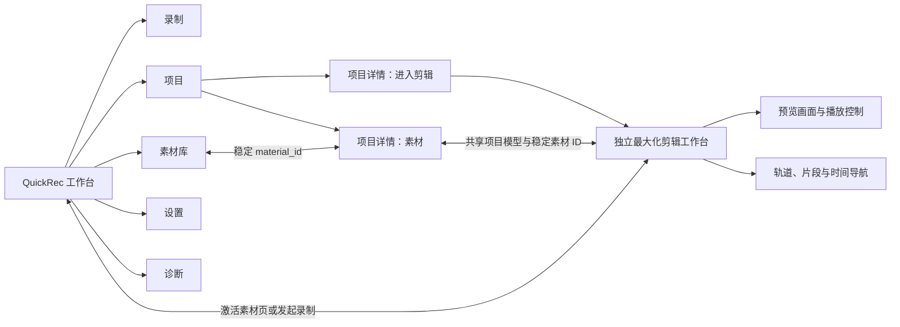
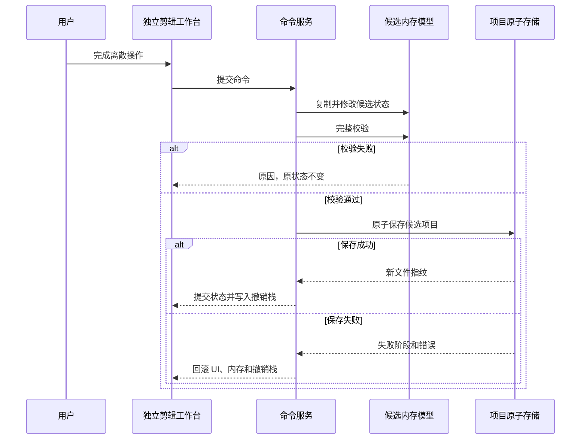
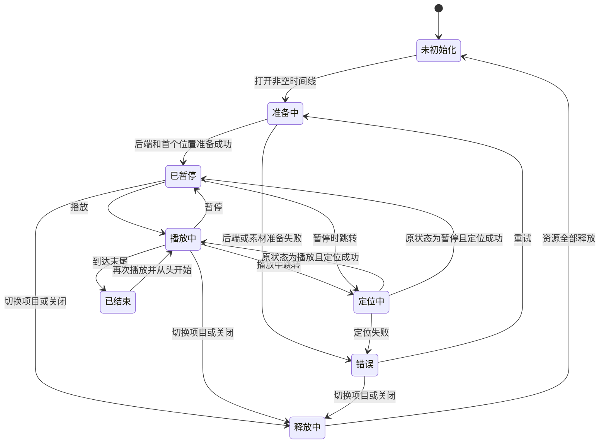

# QuickRec Full v1.9.2 产品需求文档

## 0. 追踪信息

| 项目 | 内容 |
| --- | --- |
| 产品 | QuickRec Full |
| 版本 | v1.9.2 |
| 版本主题 | 可播放多轨时间线 |
| 文档类型 | 正式推进型 PRD |
| 当前状态 | PRD、原型、实现和 D10 验收已完成；v1.9.2 正式发布 |
| 编写日期 | 2026-07-27 |
| 确认日期 | 2026-07-27 |
| 当前正式版本 | v1.9.2 |
| 当前正式分支 | `master` |
| 当前工作区 | `E:\codex\QuickRec` |
| 需求池 | `doc/archive/ideas/mypm-idea-pool-v1.9.2-2026-07-27.md` |
| 直接上游 | `doc/releases/v1.9/prd.md`、`doc/releases/v1.9.1/prd.md` |
| 直接下游 | 高保真原型、播放后端技术 spike、`dev_plan.md`、`progress.md` |
| 回滚基线 | tag `v1.9.1` |
| Lite 边界 | `E:\codex\QuickRec-Lite` 不属于本版范围，不得修改 |

### 0.1 阶段判断

本 PRD 是正式推进型 PRD，不是单纯概念原型：

1. v1.9 已建立本地项目工作区、稳定项目 ID 和项目素材引用。
2. v1.9.1 已建立静态首帧、素材使用闭环和只读项目素材描述。
3. v1.9.2 需要把项目素材转化为可持久化、可播放的多轨编排事实。
4. 时间线数据会被 v1.9.3 基础剪辑和 v1.9.4 导出队列直接读取，数据安全和兼容性必须按正式能力设计。
5. 播放后端仍存在高风险，因此正式实现前必须完成独立技术 spike。

### 0.2 已确认产品决策

以下决策已经完成澄清，本 PRD 不再将其视为开放问题：

1. v1.9.2 正式采用方案 C“可播放多轨时间线”。
2. 方案 B“可持久化多轨编排基础”是内部前置里程碑，不是最终发布目标。
3. 方案 B 必须独立通过数据、交互、保存和恢复门禁后，才能接入播放运行时。
4. 不能播放的多轨结构不得作为 v1.9.2 正式产品交付。
5. 项目页保留素材管理和“进入剪辑”入口；时间线在独立、默认最大化的顶级剪辑工作台中运行，不新增主工作台一级导航。
6. 默认创建 1 条视频轨和 1 条音频轨；视频轨和音频轨分别最多 8 条。
7. 同一素材允许生成多个独立片段实例。
8. 同一轨道禁止片段重叠，不同轨道允许重叠。
9. 视频重叠时，存在活动片段的最高视频轨按固定全画面规则覆盖下层；该片段失败时显示错误占位，不自动露出下层。
10. MP4 内嵌音频映射为与视频关联的音频片段，本版不支持解除关联。
11. 本版不支持独立音频文件，只承接 QuickRec H.264 MP4 中的单一混合音频流。
12. 时间线内部时间单位使用整数微秒。
13. 时间线保存在项目 `extensions` 的版本化命名空间中，不升级项目顶层 schema，不建立独立时间线文件。
14. 每个离散编辑命令原子保存；连续拖动只在松开后形成一次命令。
15. 撤销和重做历史上限为 50 个离散操作，不跨进程持久化。
16. 播放后端先比较 libmpv 与 PyAV，Qt Multimedia 仅作为单路播放基线。
17. 播放后端门禁失败时暂停 v1.9.2，不得静默降级，也不得自动以方案 B 替代正式产品目标。
18. 高保真 HTML 原型必须详细标明所有控件的用途、触发条件、结果、反馈和禁用规则，并经产品负责人确认后才能进入 PyQt 实现。

## 1. 版本定位

### 1.1 一句话目标

让用户在 QuickRec 项目上下文中，把项目素材编排为可保存、可恢复、可播放的多轨时间线，并通过固定、受限、可解释的播放规则确认编排结果。

### 1.2 唯一产品主线

v1.9.2 只允许一条产品主线：

> 项目内多轨编排与最小播放闭环。

用户应能完成：

1. 打开已有项目。
2. 从项目素材区把素材加入时间线。
3. 建立和管理视频轨、音频轨。
4. 让同一素材生成多个独立片段实例。
5. 调整片段轨道和时间位置。
6. 使用时间标尺、播放头、缩放和滚动检查编排。
7. 在独立剪辑工作台内播放、暂停和随机跳转。
8. 按固定规则预览重叠视频和同步音频。
9. 自动、可靠地保存每个离散修改。
10. 关闭并重新打开项目后恢复相同编排。
11. 在素材缺失、重新定位、项目只读或数据损坏时安全降级。

### 1.3 内部前置里程碑

方案 B 必须先完成以下闭环：

- 轨道和片段数据模型；
- 时间线扩展块校验和兼容；
- 项目素材加入时间线；
- 片段移动、跨同类轨道移动和轨道排序；
- 自动保存、撤销、重做和保存失败回滚；
- 缺失素材、重新定位、只读和外部修改处理；
- 高保真交互原型；
- 自动化、数据往返和 GUI 结构门禁。

方案 B 通过后，才能接入：

- 播放运行时；
- 预览画面；
- 播放、暂停和跳转；
- 视频层级覆盖；
- 固定音频混合；
- 播放状态、错误降级和资源释放。

### 1.4 版本成功定义

v1.9.2 只有同时满足以下条件才算成功：

1. 用户能够完成“加入素材 -> 编排 -> 播放确认 -> 自动保存 -> 重开恢复”的完整任务。
2. 轨道、片段和时间位置具有稳定身份，不依赖 UI 控件或素材路径作为唯一标识。
3. 同一素材可以多次使用，且每个片段实例互不覆盖身份和位置。
4. 旧项目无感获得空时间线，回滚到 v1.9.1 时项目基础信息和时间线扩展数据不丢失。
5. 保存失败不会留下 UI、内存和磁盘三者不一致的状态。
6. 素材缺失不会删除、压缩或移动后续片段。
7. 播放后端在真实 PyInstaller 包中满足启动、跳转、同步、异常恢复和资源释放门槛。
8. 固定视频覆盖和固定音频混合规则可解释、可测试，不提前引入剪辑和混音参数。
9. 100 片段、30 分钟时间线和规定的同时活动样本满足性能门槛。
10. v1.9.1 的项目、预览、素材、录制、设置、诊断和 120 FPS 能力无回归。

### 1.5 v2.0 前路线

| 版本 | 产品目标 | 本版建立的数据边界 |
| --- | --- | --- |
| v1.9.1 | 静态首帧与基础使用闭环 | 稳定只读素材描述 |
| v1.9.2 | 可播放多轨时间线 | 轨道、片段、稳定 ID、整数时间和最小播放运行时 |
| v1.9.3 | 基础剪辑 | 基于既有片段身份增加裁剪、分割等受控命令 |
| v1.9.4 | 导出队列与完整链路 | 读取稳定时间线事实并生成正式输出 |
| v2.0 | 完整工作台正式版 | 发布录制、素材、项目、时间线、剪辑和导出闭环 |

v1.9.2 不得为了降低当前成本，把结构缺口推迟到 v1.9.3；也不得提前实现 v1.9.3 或 v1.9.4 的产品能力。

## 2. 背景与问题

### 2.1 当前产品事实

v1.9.1 已具备：

- 五页工作台：录制、素材库、项目、设置、诊断；
- 中央素材索引和稳定 `material_id`；
- 中央项目索引和独立 `project.qrproj`；
- 项目素材引用和稳定 `project_id`；
- 项目素材静态首帧；
- 打开文件、打开目录和素材库往返；
- 项目缺失、损坏、只读、备份恢复和外部冲突处理；
- 项目存储原子写入和 `.bak` 备份；
- `ProjectMaterialDescriptor` 只读素材描述；
- 真实 PyInstaller、FFmpeg、FFprobe、三档 DPI 和 GUI 验收基线。

当前项目文件顶层 schema 为 v1，`ProjectFile` 包含：

- 项目身份和基本信息；
- 素材引用；
- 元数据快照；
- `extensions` 扩展字典。

当前项目文件明确不包含轨道、片段和时间位置。当前 `ProjectMaterialDescriptor` 也明确不包含 `track_id` 或 `timeline_position`。

### 2.2 问题定义

#### P-192-01 项目只能表达“有哪些素材”

当前项目可以归集和识别素材，但不能表达：

- 使用顺序；
- 时间位置；
- 视频层级；
- 音频层级；
- 同一素材的重复使用；
- 后续剪辑和导出应读取哪一份编排事实。

#### P-192-02 静态首帧不能验证连续编排

静态首帧只能帮助识别素材，不能验证：

- 两个片段是否连续；
- 播放头所在位置是否正确；
- 重叠视频使用了哪一层；
- 多个音频源是否同步；
- 缺失片段是否破坏时间线。

#### P-192-03 播放能力容易扩大为完整剪辑器

一旦引入播放，容易顺带引入画面变换、音量控制、波形、转场、滤镜和正式导出。若不冻结固定规则，v1.9.2 将失去可控边界。

#### P-192-04 时间线数据错误会向后传递

v1.9.3 剪辑和 v1.9.4 导出都会读取本版数据。若轨道身份、片段身份、时间单位、兼容和回滚设计错误，后续版本将承担高成本迁移。

#### P-192-05 当前页面和协调类不适合继续堆叠

`ProjectPage`、`QuickRecApp` 和 `MaterialLibraryDialog` 已承担较多职责。时间线命令、保存、播放时钟和资源释放不能直接继续堆入这些类。

#### P-192-06 当前打包没有可用播放后端结论

当前生产打包主动排除 Qt Multimedia，也没有 libmpv 或 PyAV 的生产依赖。源码可播放不能证明真实打包产物可播放，必须先做独立技术门禁。

## 3. 用户角色与核心场景

### 3.1 用户角色

| 用户 | 目标 | 本版价值 |
| --- | --- | --- |
| 教程创作者 | 编排多段屏幕录制并确认顺序 | 在 QuickRec 内完成初步编排和播放确认 |
| 演示录制者 | 叠放讲解画面和录屏素材 | 使用固定视频层级和同步音频验证结构 |
| 高频录制用户 | 重复使用同一素材 | 同一素材生成多个独立片段 |
| 后续剪辑用户 | 为下一版剪辑准备项目 | 获得稳定轨道、片段和时间数据 |

### 3.2 核心场景

#### SC-192-01 从项目素材开始编排

用户打开项目，进入“素材”视图确认内容，再切换“时间线”，把素材拖入目标轨道和时间位置。

#### SC-192-02 重复使用同一素材

用户将同一素材多次加入时间线，每次生成新的 `clip_id`，不同片段可以位于不同时间，但都引用同一 `material_id`。

#### SC-192-03 编排多个视频层

用户把两个视频放在不同视频轨的重叠时间范围。播放时最高轨按固定全画面规则覆盖下层。

#### SC-192-04 播放并跳转确认

用户点击播放、暂停或时间标尺。播放头、当前时间和预览画面保持同步，并能在本版性能门槛内响应。

#### SC-192-05 自动保存并重开

用户完成片段或轨道操作后无需显式保存。关闭并重新打开项目，时间线恢复到最后成功保存的状态。

#### SC-192-06 素材缺失后保持结构

素材被外部移动或删除后，片段仍保留在原轨道和时间位置。重新定位素材后，全部同素材片段自动恢复。

#### SC-192-07 只读或归档项目检查编排

用户可以查看和播放归档或只读项目，但不能修改轨道和片段。

#### SC-192-08 播放异常后继续工作

单个素材解码失败或音频设备不可用时，系统明确降级，不损坏项目，不留下声音、线程或子进程。

## 4. 术语与事实源

| 术语 | 定义 |
| --- | --- |
| 项目素材 | 项目文件中对中央素材 `material_id` 的稳定引用 |
| 素材描述 | v1.9.1 提供的只读 `ProjectMaterialDescriptor` |
| 时间线 | 项目中轨道和片段的版本化编排事实 |
| 轨道 | 有稳定 `track_id` 的视频或音频容器 |
| 片段 | 有稳定 `clip_id`、引用 `material_id` 并占据时间范围的实例 |
| 关联片段 | 同一 MP4 生成、共享时间起点的一个视频片段和一个音频片段 |
| 播放头 | 当前时间位置的 UI 与播放运行时共同表示 |
| 活动片段 | 当前时间落在其时间范围内的片段 |
| 最高视频轨 | 视频轨顺序中显示层级最高的轨道 |
| 播放运行时 | 负责时钟、解码、画面、音频、跳转和资源释放的独立边界 |
| 时间线命令 | 会改变轨道或片段事实并可撤销的离散操作 |
| 项目事实源 | 当前有效的 `project.qrproj` |
| 素材事实源 | 当前有效的中央素材索引；不存在时回退到项目素材快照 |

事实优先级：

1. 项目身份、轨道和片段以当前有效 `project.qrproj` 为准。
2. 素材当前路径和媒体元数据优先使用中央素材索引。
3. 中央记录不存在时使用项目素材引用中的最后路径和元数据快照。
4. 静态首帧只是可再生派生数据，不是时间线事实。
5. 播放运行时状态不写入项目文件。
6. 撤销栈、选择状态、滚动位置和解码缓存不属于持久化事实。

## 5. 范围与优先级

### 5.1 范围表

| 能力 | 优先级 | 正式发布必需 | 说明 |
| --- | --- | --- | --- |
| 项目页“进入剪辑”入口与独立剪辑工作台 | P0 | 是 | 不新增主工作台一级导航 |
| 视频轨、音频轨和稳定身份 | P0 | 是 | 默认各 1 条，分别最多 8 条 |
| 素材生成独立片段实例 | P0 | 是 | 同一素材允许重复加入 |
| 关联视频和音频片段 | P0 | 是 | 不支持解除关联 |
| 加入、移动、删除和跨同类轨道移动 | P0 | 是 | 同轨不重叠 |
| 时间标尺、播放头、缩放和滚动 | P0 | 是 | 整数微秒时间基础 |
| 原子自动保存和失败回滚 | P0 | 是 | 每个离散命令保存 |
| 50 步撤销和重做 | P0 | 是 | 不跨进程 |
| 缺失、重新定位、只读和冲突处理 | P0 | 是 | 不丢片段位置 |
| 剪辑工作台内播放、暂停和跳转 | P0 | 是 | 方案 C 核心 |
| 固定视频层级覆盖 | P0 | 是 | 无可调画面参数 |
| 固定音频混合 | P0 | 是 | 固定衰减和安全限幅 |
| 播放后端技术 spike | P0 | 是 | 正式实现前门禁 |
| 真实 PyInstaller 播放验证 | P0 | 是 | 源码结果不能替代 |
| 高保真交互原型 | P0 | 是 | 用户确认后才能实现 UI |
| 轨道名称和顺序 | P1 | 是 | 不包含颜色和高级轨道参数 |
| 基础快捷键 | P1 | 是 | Space、Delete、Ctrl+Z/Y |
| 播放错误诊断 | P1 | 是 | 复用诊断入口 |
| 独立音频素材 | P2 | 否 | 本版无音频素材事实源 |
| 剪辑、导出和高级播放参数 | P2 | 否 | 后续版本 |

### 5.2 范围保护

以下需求不得通过“顺手实现”进入本版：

- 裁剪、分割和变速；
- 转场、滤镜和关键帧；
- 视频缩放、旋转、位置、透明度或画中画；
- 音量、静音、声像、淡入淡出或波形编辑；
- 独立音频文件导入；
- 正式视频导出和导出队列；
- 专业剪辑快捷键体系；
- 数据库、插件系统或事件总线；
- AI、字幕、摘要、标签和云同步；
- WGC、新高刷新率、多显示器和 4K；
- QuickRec Lite 改动。

## 6. 信息架构与页面关系

### 6.1 工作台结构

QuickRec 继续使用五个一级页面：

1. 录制；
2. 素材库；
3. 项目；
4. 设置；
5. 诊断。

v1.9.2 不新增主工作台“时间线”一级导航。时间线必须依附当前打开项目，但在独立顶级剪辑窗口中运行。主工作台和剪辑工作台分别保持单实例，可同时存在并切换前后台。



### 6.2 双工作台与窗口规则

- 空项目首次打开时进入“素材”视图。
- 项目页通过“进入剪辑”打开独立顶级窗口，剪辑窗口默认最大化但不使用独占式全屏。
- 主工作台和剪辑工作台可同时存在，并通过任务栏或各自入口切换前台。
- 同一进程内记住每个项目的剪辑窗口、播放头、选择、缩放和滚动状态。
- 激活主工作台其他一级页面时，剪辑工作台及其项目上下文保持。
- 切换项目时保存当前时间线、暂停播放并释放旧项目媒体资源。
- 关闭剪辑工作台时保存当前编辑状态、停止播放并释放媒体资源，但不退出 QuickRec。
- 再次进入剪辑工作台时恢复当前项目和同进程界面状态，但不自动恢复播放。
- 应用重启后不恢复播放头瞬时位置；用户从项目页重新进入剪辑。
- 主工作台关闭继续采用隐藏语义；只有托盘“退出 QuickRec”结束两个窗口与应用。

### 6.3 剪辑工作台布局

剪辑工作台使用命令栏和三个稳定区域：

0. **顶部命令栏**
   - 返回当前项目；
   - 展示当前项目名称和自动保存状态；
   - 激活素材工作台；
   - 发起既有录制流程；
   - 关闭剪辑工作台但不退出 QuickRec。

1. **左侧项目素材区**
   - 可折叠；
   - 支持当前项目素材搜索；
   - 展示静态首帧、名称、时长、状态和音频信息；
   - 支持拖入时间线；
   - 支持“加入时间线”。

2. **右上预览区**
   - 按源视频宽高比完整自适应显示，空间不足时允许留黑边，禁止裁切或拉伸；
   - 播放、暂停、当前时间和总时长；
   - 加载、缺失、解码失败和音频降级状态；
   - 重试和诊断入口；
   - 支持一键放大预览，并可恢复上次分栏高度。

3. **底部时间线区**
   - 时间线工具栏；
   - 时间标尺；
   - 播放头；
   - 视频轨和音频轨；
   - 片段；
   - 水平滚动条；
   - 轨道头操作。

预览区与时间线区之间必须提供水平分隔条：

- 鼠标拖动可调整两区高度；
- 键盘聚焦后可用方向键微调，并支持 Home / End 快速到达安全边界；
- 双击分隔条恢复当前窗口尺寸对应的默认高度；
- 剪辑工作台默认最大化；首次打开时，预览区约占预览与时间线可分配高度的 68%，时间线约占 32%；
- 当窗口高度不足时优先保留时间线最低可操作高度，参考 1216×760 视口为预览 366、时间线 220 个逻辑像素，960×640 为预览 266、时间线 200 个逻辑像素；
- 调整时预览区和时间线区都必须保留最低可操作高度，不得产生外层滚动、遮挡或不可恢复布局；
- 一键放大预览时隐藏时间线区，但保留项目素材区、播放控制和完整画面；再次点击恢复上次高度；
- “专注时间线”与“放大预览”是互斥布局状态；
- 分栏高度只作为同进程界面状态，不写入项目文件、素材索引或用户配置。

### 6.4 响应式布局

- 剪辑工作台默认最大化打开，保留标准 Windows 标题栏、任务栏和窗口切换语义。
- 剪辑工作台恢复窗口模式后的最小尺寸为 960×640。
- 主工作台默认尺寸继续沿用约 1200×760。
- 960×640 下优先保留预览画面、播放控制、轨道头和时间线主操作。
- 预览与时间线分隔条必须根据可用高度动态限制拖动范围，窗口缩小时自动回到安全范围。
- 左侧素材区允许折叠，不得通过缩小按钮到不可点击尺寸换取空间。
- 时间线工具栏可按功能分组换行，但不得遮挡时间标尺。
- 100%、125%、150% DPI 下不得出现裁切、重叠、错位或不可点击控件。

## 7. 产品完整链路

### 7.1 打开时间线

1. 用户在项目页打开有效项目。
2. 用户点击“进入剪辑”，系统创建或激活独立剪辑工作台单实例。
3. 系统读取项目基础数据和时间线扩展块。
4. 若没有时间线扩展块，内存中建立空时间线，但不立即改写项目文件。
5. 若时间线有效，恢复轨道、片段和顺序。
6. 若时间线版本高于当前支持版本，进入只读状态。
7. 若时间线块损坏，项目素材视图保持可用，剪辑工作台进入恢复状态。
8. 剪辑工作台按默认最大化窗口规则展示，不自动开始播放。

### 7.2 从素材区加入时间线

支持两种入口：

- 拖动素材到兼容轨道和时间位置；
- 选中素材后点击“加入时间线”。

按钮入口默认放置规则：

1. 有选中兼容轨道时，放到该轨道。
2. 有播放头时，优先使用播放头位置。
3. 没有选中兼容轨道时，使用第一条同类轨道。
4. 没有有效播放头位置时，追加到目标轨道末尾。
5. 默认位置与现有片段冲突时，向后查找该轨道第一个连续可用位置。
6. 若无法找到有效位置，不修改数据并说明原因。

视频素材包含音频流时：

1. 创建独立视频片段。
2. 创建独立音频片段。
3. 两者具有不同 `clip_id`。
4. 两者共享一个关联组身份。
5. 两者使用相同时间起点和源时长。
6. 两者默认加入第一条可用视频轨和第一条可用音频轨。
7. 水平移动关联组中的任一片段时，视频和音频片段作为一个命令共同移动并保持相同时间起点。
8. 垂直移动只改变所选片段所在的同类型轨道，不改变关联组时间起点。
9. 删除关联组中的任一片段时，必须明确提示并以一个命令删除整个关联组。
10. 本版不允许解除关联。

没有音频流的视频只创建视频片段。

### 7.3 拖动和移动片段

允许：

- 在同一轨道水平移动；
- 在同类型轨道之间垂直移动；
- 水平和垂直同时移动；
- 同一关联组的视频与音频保持相同时间起点；
- 拖动时预览目标轨道、目标时间和冲突状态。

禁止：

- 视频片段拖入音频轨；
- 音频片段拖入视频轨；
- 时间起点小于 0；
- 同一轨道产生重叠；
- 在只读、归档、损坏或未知版本项目中修改；
- 在播放运行时正处于不可安全重建状态时提交编辑。

无效拖动：

1. 不修改内存模型。
2. 不修改项目文件。
3. 片段回到原位置。
4. 在时间线附近显示具体原因。
5. 不写入撤销栈。

### 7.4 吸附规则

默认吸附：

- 其他片段起点和终点；
- 播放头；
- 当前缩放级别对应的可见时间网格。

辅助键可在本次拖动中临时关闭吸附。

本版不提供：

- 自动磁性时间线；
- 自动挤开后续片段；
- 波纹删除；
- 按输出帧率固定项目时间基。

### 7.5 轨道管理

默认：

- 视频轨 1 条；
- 音频轨 1 条。

允许：

- 新增视频轨；
- 新增音频轨；
- 重命名轨道；
- 调整同类型轨道顺序；
- 删除空轨道；
- 删除含片段轨道，但必须确认并连同该轨片段删除。

规则：

- 视频轨和音频轨分别最多 8 条。
- 至少保留 1 条视频轨和 1 条音频轨。
- 视频轨由下到上形成画面层级。
- 视频轨顺序变化会改变重叠画面的覆盖结果。
- 音频轨顺序不改变混合结果。
- 删除含片段轨道是一个可撤销的离散命令。
- 删除的轨道包含关联组成员时，确认框必须列出受影响的轨外关联片段；确认后以一个命令删除整个关联组，取消则零修改。

### 7.6 时间标尺、缩放和滚动

- 内部统一使用整数微秒。
- UI 显示 `时:分:秒.毫秒`。
- 本版不显示输出帧编号，不提前冻结项目输出 FPS。
- 支持“适配完整时间线”到接近单帧级观察的连续缩放范围。
- 鼠标滚轮垂直滚动轨道。
- `Shift+滚轮` 水平滚动时间线。
- `Ctrl+滚轮` 以指针所在时间为中心缩放。
- 播放头接近可视区域边缘时自动滚动。
- 点击时间标尺或空白时间位置移动播放头。
- 时间与像素换算必须使用统一函数，不能由不同控件各自计算。

### 7.7 播放

播放入口：

- 预览区“播放”按钮；
- `Space`。

主流程：

1. 检查项目、时间线和播放后端状态。
2. 确认当前播放头位置。
3. 预加载当前位置附近需要的素材。
4. 启动统一播放时钟。
5. 根据当前时间计算活动视频和音频片段。
6. 选择存在活动片段的最高视频轨；该片段不可播放时显示错误占位，不向下回退。
7. 对活动音频源应用固定衰减和安全限幅。
8. 更新播放头、当前时间和画面。
9. 到达时间线末尾后停止并停在末尾。

再次从末尾播放时，从时间 0 开始。

### 7.8 暂停

- 点击“暂停”或按 `Space` 后，在 200 毫秒内停止时钟推进和音频输出。
- 播放头保持当前位置。
- 解码资源可以保留短时缓存，但不得继续产生可听声音。
- 再次播放从当前播放头继续。

### 7.9 跳转

- 暂停状态跳转后保持暂停。
- 播放状态跳转后完成定位并继续播放。
- 拖动播放头期间不播放音频。
- 松开播放头后执行一次定位。
- 预览画面必须对应最终定位结果，不能继续显示旧帧并伪装完成。
- 跳转失败时保持最后已确认位置，显示失败原因并允许重试。

### 7.10 片段边界和空白区

- 允许最多 500 毫秒预缓冲。
- 预缓冲时显示加载状态。
- 时间线空白区显示黑色预览画面和“当前位置没有视频画面”。
- 空白区存在音频时继续播放音频。
- 只有视频没有音频时正常显示画面并保持无声。
- 本版不自动跳过时间线空白。

### 7.11 自动保存

以下操作成功后立即原子保存：

- 添加片段；
- 删除片段；
- 移动片段；
- 跨同类轨道移动；
- 新增轨道；
- 删除轨道；
- 重命名轨道；
- 调整轨道顺序；
- 撤销；
- 重做；
- 批量移除关联片段。

拖动过程中只更新视觉候选状态，松开后才形成一次命令和一次保存。

### 7.12 撤销和重做

撤销和重做覆盖：

- 添加、删除和移动片段；
- 调整片段轨道和时间位置；
- 新增、删除、重命名和排序轨道；
- 批量移除关联片段。

不覆盖：

- 播放和暂停；
- 播放头移动；
- 页面滚动和缩放；
- 素材或片段选择；
- 主工作台与剪辑工作台切换；
- 错误提示关闭。

规则：

- 历史上限 50 个离散命令。
- 连续拖动合并为松开时的一个命令。
- 撤销或重做成功后立即保存。
- 保存失败时该次撤销或重做不生效。
- 切换项目、外部重新加载或进程退出时清空历史。
- 撤销栈不写入项目文件。

### 7.13 素材缺失和重新定位

素材缺失时：

- 保留轨道；
- 保留片段；
- 保留 `clip_id`、`material_id` 和时间位置；
- 不自动收缩后续片段；
- 视频片段显示错误占位；
- 音频片段静音；
- 允许从素材恢复入口进入现有重新定位流程。

重新定位成功后：

- 不生成新的 `clip_id`；
- 不改变片段轨道或时间位置；
- 所有引用同一 `material_id` 的片段自动恢复；
- 更新素材路径和媒体元数据；
- 静态首帧按 v1.9.1 规则刷新；
- 播放运行时丢弃该素材旧缓存。

### 7.14 从项目移除仍被引用的素材

如果项目素材仍被时间线片段引用：

1. 默认阻止直接移除。
2. 对话框显示关联片段数量。
3. 用户可取消。
4. 用户可明确选择“同时移除素材和相关片段”。
5. 确认后以一个可撤销命令移除全部相关片段和项目素材引用。
6. 不删除中央素材记录。
7. 不删除或移动真实视频。

### 7.15 中央素材索引移除

- 中央素材记录被移除后，项目继续保留素材引用和最后已知路径。
- 文件仍存在时，项目可继续尝试播放，并显示“未关联中央素材库”。
- 文件不存在时按缺失素材处理。
- 不自动创建新的中央素材记录。
- 重新定位或手动重新入库后按稳定素材 ID 恢复关联。

### 7.16 项目切换、关闭和退出

切换项目：

1. 暂停播放。
2. 提交或回滚当前离散操作。
3. 确认最后一次保存状态。
4. 释放旧项目的解码、音频和子进程。
5. 清空撤销栈。
6. 加载新项目。

关闭剪辑工作台：

- 只关闭或隐藏剪辑顶级窗口；
- 停止播放并释放媒体资源；
- 主工作台、托盘、录制和素材能力继续运行；
- 不丢失最后成功保存的时间线。

关闭主工作台：

- 主工作台继续采用“关闭即隐藏”语义；
- 已打开的剪辑工作台可以继续存在；
- 不退出 QuickRec。

从剪辑工作台发起录制：

- 复用主工作台和 `QuickRecApp` 的既有录制模式选择与状态机；
- 剪辑工作台保持实例并转入后台；
- 捕获开始前临时隐藏或最小化 QuickRec 自身窗口，避免被录入；
- 取消选择或倒计时后恢复剪辑上下文；
- 保存完成后刷新中央素材索引，不自动修改当前时间线。

退出应用：

- 停止全部播放和预加载；
- 终止受控媒体子进程；
- 释放音频设备；
- 不留下播放线程、DLL 句柄或孤立子进程；
- 不等待无法结束的后端而无限阻塞退出。

## 8. 视频与音频播放规则

### 8.1 视频层级

当前时间存在多个活动视频片段时：

1. 按视频轨顺序选取最高轨。
2. 最高轨画面全画面覆盖下层。
3. 不提供缩放、位置、透明度、裁切或画中画。
4. 轨道顺序变化立即影响后续播放结果。

最高轨素材缺失或解码失败时：

- 显示该片段的错误占位；
- 不静默露出下层画面；
- 播放时钟继续；
- 用户可以进入重新定位、重试或诊断。

该规则避免错误被下层画面掩盖，并保持“全画面覆盖”的可解释性。

### 8.2 音频来源

- QuickRec 输出中系统声音和麦克风已经混合为同一 MP4 音频流时，只作为一个音频源。
- 一个有音频流的 MP4 生成一个关联音频片段。
- 本版不拆分系统声音和麦克风。
- 本版不读取独立音频文件。
- 本版不提供轨道静音、单独播放、音量、声像或淡入淡出。

### 8.3 固定混合

多个活动音频片段同时存在时：

- 每个音频源使用播放后端 spike 最终确认的固定衰减常量；
- 混合末端使用安全限幅，避免直接叠加造成明显削波；
- 固定参数必须写入技术 spike 和诊断信息；
- 参数对用户不可调；
- 轨道顺序不改变增益；
- 不根据活动源数量动态改变用户可感知音量策略，除非 spike 证明固定方案无法满足基本听感和安全门槛，并重新获得产品确认。

### 8.4 音频设备不可用

1. 第一次检测到音频设备不可用时暂停启动播放。
2. 用户可以选择“无声继续”或“取消播放”。
3. 选择无声继续后显示持续状态提示。
4. 当前项目会话中不对每次跳转重复弹窗。
5. 音频设备恢复后允许用户重试。
6. 无声继续不得被记录为音频播放成功。

### 8.5 解码错误

- 单个片段错误不损坏项目。
- 视频错误使用明确占位。
- 音频错误使该源静音。
- 其他可用片段继续运行。
- 后端整体失去响应时停止播放、释放资源并提供重试。
- 不用零时长、零分辨率或伪造帧冒充可播放素材。

## 9. 页面、控件与交互契约

### 9.1 项目二级导航

| 控件 | 前置条件 | 操作结果 | 成功反馈 | 失败反馈 | 禁用规则 |
| --- | --- | --- | --- | --- | --- |
| “素材”二级页 | 已打开项目 | 切换到项目素材视图 | 保留当前项目和素材选择 | 项目不可读时进入恢复状态 | 无有效项目时禁用 |
| “时间线”二级页 | 已打开项目 | 读取并展示时间线 | 恢复轨道和片段 | 时间线损坏时进入只读恢复状态 | 无有效项目时禁用 |

### 9.2 项目素材区

| 控件 | 用途 | 操作结果 | 成功反馈 | 失败反馈 | 禁用规则 |
| --- | --- | --- | --- | --- | --- |
| 折叠/展开 | 为时间线腾出空间 | 切换素材区宽度 | 图标状态同步 | 不适用 | 始终可用 |
| 搜索输入 | 按名称和路径过滤当前项目素材 | 更新可见素材列表 | 显示结果数量 | 无结果显示空结果，不报错 | 项目不可读时禁用 |
| 清空搜索 | 清除关键词 | 恢复全部项目素材 | 列表恢复 | 不适用 | 搜索为空时禁用 |
| 素材卡片/行 | 选择素材 | 展示首帧和摘要 | 选中态清晰 | 素材缺失时仍可选 | 无 |
| “加入时间线” | 使用所选素材创建片段 | 按默认规则加入并保存 | 选中新片段并定位播放头 | 显示冲突、格式或保存失败原因 | 无素材、只读、归档、格式不支持时禁用 |
| 拖动素材 | 精确选择轨道和时间 | 生成拖动候选，松开后提交 | 显示目标轨道、时间和片段 | 无效落点恢复且不保存 | 同按钮禁用规则 |
| “打开文件” | 使用系统播放器检查源文件 | 打开真实文件 | 无需改项目 | 显示系统调用失败 | 文件缺失时禁用 |
| “打开目录” | 定位源文件 | 打开资源管理器 | 选中或定位目录 | 显示目录不可访问 | 文件和目录都不可用时禁用 |
| “重新定位” | 恢复缺失素材 | 进入现有重新定位链路 | 全部同素材片段恢复 | 验证失败保持原状态 | 素材正常且已关联时隐藏或禁用 |

### 9.3 预览区

| 控件 | 用途 | 操作结果 | 成功反馈 | 失败反馈 | 禁用规则 |
| --- | --- | --- | --- | --- | --- |
| “播放” | 从播放头开始播放 | 启动预加载和统一时钟 | 图标切为暂停，时间推进 | 显示失败阶段和恢复入口 | 空时间线、后端不可用或项目损坏时禁用 |
| “暂停” | 暂停播放 | 停止时钟和可听音频 | 图标切为播放 | 超时则停止后端并提示 | 未播放时隐藏或禁用 |
| 当前时间 | 显示播放头位置 | 只读更新 | 与播放头同步 | 不显示伪造时间 | 始终只读 |
| 总时长 | 显示最后片段结束时间 | 结构变化后更新 | 与时间线一致 | 无有效片段时显示 00:00:00.000 | 始终只读 |
| “重试播放” | 从整体后端错误恢复 | 重建运行时并重新定位 | 恢复画面和控制 | 保留错误并允许查看诊断 | 无错误时隐藏 |
| “查看诊断” | 打开诊断页并保留项目上下文 | 切换诊断页 | 定位播放错误摘要 | 诊断页失败时显示本地日志路径建议 | 无错误上下文时仍可用 |
| “放大预览” | 临时把完整画面作为主要工作区 | 隐藏时间线并让预览占满剩余高度 | 按钮切换为恢复状态，画面不裁切 | 布局异常时恢复标准分栏 | 专注时间线时不可见 |
| 预览/时间线分隔条 | 调整预览与轨道画布的高度比例 | 拖动、键盘微调或双击恢复默认 | 两区实时调整且保持最低高度 | 超出范围时限制到安全边界 | 专注时间线或放大预览时隐藏 |
| 音频降级提示 | 表达无声预览 | 持续显示当前状态 | 用户知道播放无声 | 不宣称音频成功 | 仅降级时显示 |

### 9.4 时间线工具栏

| 控件 | 用途 | 操作结果 | 成功反馈 | 失败反馈 | 禁用规则 |
| --- | --- | --- | --- | --- | --- |
| 撤销 | 撤销最近结构命令 | 恢复上一状态并保存 | 轨道、片段和按钮状态同步 | 保存失败保持撤销前状态 | 无历史或只读时禁用 |
| 重做 | 重做最近撤销命令 | 恢复下一状态并保存 | 同上 | 同上 | 无重做历史或只读时禁用 |
| 新增视频轨 | 增加视频容器 | 在视频轨顶部新增并保存 | 新轨选中 | 保存失败不保留新轨 | 达到 8 条或只读时禁用 |
| 新增音频轨 | 增加音频容器 | 在音频轨末尾新增并保存 | 新轨选中 | 保存失败不保留新轨 | 达到 8 条或只读时禁用 |
| 缩小 | 查看更长时间范围 | 降低时间像素比例 | 标尺和片段同步 | 不适用 | 已到最小缩放时禁用 |
| 放大 | 精确查看时间 | 提高时间像素比例 | 标尺和片段同步 | 不适用 | 已到最大缩放时禁用 |
| 适配时间线 | 一次显示完整编排 | 计算合适缩放和滚动位置 | 全部片段可见 | 空时间线保持默认范围 | 始终可用 |

### 9.5 轨道头

| 控件 | 用途 | 规则 |
| --- | --- | --- |
| 轨道名称 | 识别轨道 | 双击或明确编辑入口修改；空名称恢复默认名称 |
| 拖动手柄 | 调整同类型轨道顺序 | 视频轨变化影响覆盖层级；音频轨只改变视觉顺序 |
| 删除轨道 | 删除轨道 | 空轨直接确认；含片段显示片段数量并要求二次确认 |
| 轨道类型图标 | 区分视频/音频 | 不可点击，不使用 emoji 或字符图标 |
| 轨道状态 | 表达只读、错误或播放活动 | 不提供静音、独奏、锁定等本版非目标 |

### 9.6 片段

| 操作 | 结果 | 反馈和限制 |
| --- | --- | --- |
| 单击 | 选中片段 | 显示素材名、时间范围和状态 |
| 双击 | 将播放头移动到片段起点 | 不打开剪辑器或外部播放器 |
| 水平拖动 | 修改时间起点 | 吸附和冲突实时反馈 |
| 垂直拖动 | 移到同类型轨道 | 跨类型拒绝 |
| Delete | 删除片段或关联组 | 修改前确认关联影响，成功后保存 |
| 错误状态入口 | 进入重新定位、重试或诊断 | 不允许错误片段伪装正常 |

### 9.7 基础快捷键

| 快捷键 | 作用 | 限制 |
| --- | --- | --- |
| `Space` | 播放/暂停 | 输入框正在编辑时不触发 |
| `Delete` | 删除选中片段 | 输入框正在编辑时不触发；需要遵循关联规则 |
| `Ctrl+Z` | 撤销 | 无历史或只读时无动作并保持禁用状态 |
| `Ctrl+Y` | 重做 | 无重做历史或只读时无动作 |

本版不引入 J/K/L、逐帧、入点、出点或专业剪辑快捷键。

## 10. 时间线数据契约

### 10.1 存储位置

项目顶层 schema 继续为 v1。时间线存入：

```text
ProjectFile.extensions["quickrec.timeline"]
```

不使用：

- 项目顶层 `timeline` 字段；
- 项目 schema v2；
- 独立时间线文件；
- 数据库；
- UI 私有 JSON。

### 10.2 逻辑结构

以下是产品级逻辑契约。具体 Python 类名和校验模块在技术设计与开发计划中确定，但字段语义不得改变。

```json
{
  "quickrec.timeline": {
    "schema_version": 1,
    "time_unit": "microseconds",
    "tracks": [
      {
        "track_id": "稳定轨道 ID",
        "kind": "video",
        "name": "视频 1",
        "order": 0,
        "extensions": {}
      }
    ],
    "clips": [
      {
        "clip_id": "稳定片段 ID",
        "material_id": "项目素材 ID",
        "track_id": "目标轨道 ID",
        "timeline_start_us": 0,
        "timeline_duration_us": 1000000,
        "source_start_us": 0,
        "source_duration_us": 1000000,
        "link_group_id": "关联音视频组 ID 或空",
        "extensions": {}
      }
    ],
    "extensions": {}
  }
}
```

### 10.3 身份与引用规则

- `track_id` 在当前项目内唯一且稳定，不复用已删除轨道 ID。
- `clip_id` 在当前项目内唯一且稳定，不因重新定位改变。
- `material_id` 引用项目素材，不复制文件路径到每个片段。
- 同一 `material_id` 可以被多个 `clip_id` 引用。
- 视频和音频片段使用不同 `clip_id`。
- 关联视频和音频使用相同非空 `link_group_id`。
- 轨道顺序使用连续整数；保存前必须标准化。
- 时间字段必须为非负整数。
- `timeline_duration_us` 在本版等于完整源素材时长。
- `source_start_us` 在本版固定为 0。
- `source_duration_us` 在本版等于完整源素材时长。
- 源时长转换为微秒时使用统一的最近整数舍入规则；转换后小于等于 0 的素材不得加入时间线。
- 本版 UI 不允许修改源入点、源出点或播放速度。

预留 `source_start_us` 和 `source_duration_us` 是为了避免 v1.9.3 立即迁移片段身份；它们在本版是只读事实，不构成剪辑能力。

### 10.4 轨道校验

- `kind` 只允许 `video` 或 `audio`。
- 视频和音频轨分别至少 1 条、最多 8 条。
- 同类型轨道 `order` 不能重复。
- 片段轨道类型必须与片段媒体类型兼容。
- 删除轨道必须同时处理该轨全部片段。
- 时间线不能引用不存在的 `track_id`。

### 10.5 片段校验

- 片段必须引用当前项目已有 `material_id`。
- 起点和时长必须是整数微秒。
- 时长必须大于 0。
- 同一轨道的片段时间范围不能重叠。
- 不同轨道允许重叠。
- 关联组最多包含一个视频片段和一个音频片段。
- 关联片段起点必须一致。
- 本版关联片段的源时长和时间线时长必须一致。
- 素材缺失不等同于数据无效，片段仍通过结构校验。

### 10.6 兼容和迁移

旧项目：

- 没有时间线扩展块时返回空时间线；
- 仅查看空时间线不改写项目文件；
- 第一次成功编辑时写入扩展块；
- 既有项目素材 ID 原样复用。

未知新版本：

- 保留原始扩展块；
- 时间线只读；
- 不尝试自动降级；
- 不覆盖未知字段；
- 可继续使用项目素材视图。

损坏时间线：

- 不把整个项目误判为空；
- 隔离时间线错误；
- 素材视图继续可用；
- 优先从项目 `.bak` 恢复；
- 无有效备份时允许用户备份损坏文件并重建空时间线；
- 重建前必须明确告知会丢失时间线编排，但不会删除素材或视频。

回滚到 v1.9.1：

- v1.9.1 忽略时间线扩展；
- 项目基本信息和素材仍可读取；
- v1.9.1 保存项目时必须往返保留未知时间线扩展；
- 不要求删除时间线、项目、索引或视频。

## 11. 保存、冲突与恢复

### 11.1 命令事务



### 11.2 保存反馈

- 正常保存不使用阻塞弹窗。
- 时间线工具栏显示短暂“已保存”状态。
- 保存中禁止提交第二个结构命令，但允许查看。
- 保存失败显示持续错误条。
- 错误条提供“重试保存”“查看诊断”和“放弃本次修改”。
- 保存失败前的磁盘项目文件保持有效。
- 保存失败不得显示“已保存”。

### 11.3 外部修改

写入前检测项目文件指纹：

- 指纹未变化：正常保存。
- 指纹变化且本地没有未提交命令：提示重新加载。
- 指纹变化且本地有候选修改：暂停写入，提供“重新加载”“保存恢复副本”“取消”。
- 不允许静默覆盖外部修改。
- 重新加载和保存恢复副本会清空撤销栈。
- 恢复副本只用于保全当前候选数据，不登记为新项目，不改变当前项目文件，也不形成新的项目产品能力。
- 恢复副本的文件名必须包含冲突时间戳，并在反馈中说明其路径和用途；将恢复副本正式登记为新项目属于后续独立需求。

### 11.4 只读和归档

归档项目：

- 可以查看素材和时间线；
- 可以播放；
- 禁止添加、删除、移动和轨道管理；
- 允许恢复为活跃项目。

文件只读：

- 可以查看和播放；
- 禁止全部时间线写操作；
- 显示文件只读原因；
- 权限恢复后允许重新加载。

项目损坏：

- 不进入正常编辑；
- 使用恢复状态；
- 不启动播放后端；
- 不创建空项目覆盖损坏文件。

## 12. 播放状态机

### 12.1 状态



### 12.2 编辑与播放协调

- 播放中允许选择片段和滚动页面。
- 会改变时间线结构的操作开始前必须暂停播放。
- 编辑提交成功后，播放运行时按新结构重建必要缓存。
- 编辑保存失败时运行时继续使用最后成功模型。
- 不允许播放运行时读取尚未提交的候选模型。
- 项目切换和关闭优先停止声音，再释放画面和解码资源。

### 12.3 时钟

- 必须有单一主播放时钟。
- 播放头、当前时间、视频选择和音频调度都读取同一时钟。
- 不允许每个媒体实例独立推进 UI 时间。
- 最终后端必须说明音频时钟、视频时钟和 UI 时钟的主从关系。
- 10 分钟漂移增量必须不超过 20 毫秒。

## 13. 播放后端技术 spike

### 13.1 目标

在正式播放 UI 实现前，用真实 Windows 和 PyInstaller 环境确定一个能满足 v1.9.2 固定多轨规则的后端。

### 13.2 候选方案

| 方案 | 优点 | 风险 | spike 定位 |
| --- | --- | --- | --- |
| libmpv | 播放、寻址和音频能力成熟；Windows 嵌入经验较多 | DLL、资源目录、打包体积、多实例同步和许可证检查 | 正式候选 |
| PyAV + Qt 渲染 + 独立音频输出 | 解码和时钟控制强；利于后续剪辑与导出 | 实现成本最高；原生依赖、音频输出和同步需自行承担 | 正式候选 |
| Qt Multimedia | PyQt UI 接入简单 | 当前生产包明确排除；多源同步和确定性不足 | 单路播放基线，不提前选为正式后端 |

### 13.3 spike 必测内容

- QuickRec 生成的 H.264 MP4；
- H.264/AAC 和 H.264 无声 MP4；
- 中文、空格和长路径；
- 连续片段无明显空帧；
- 播放、暂停和随机跳转；
- 双视频轨固定覆盖；
- 4 路同时活动音频；
- 素材缺失；
- 损坏 MP4；
- 音频设备不可用；
- 30 秒播放；
- 10 分钟播放；
- 音画同步；
- CPU、内存和子进程状态；
- 960×640 和三档 DPI 下嵌入画面；
- PyInstaller onedir 包；
- 切换项目、关闭剪辑工作台和退出后的资源释放。

### 13.4 硬门槛

| 指标 | 门槛 |
| --- | --- |
| 首次播放启动 | 不超过 1.5 秒 |
| 随机跳转响应 | 不超过 500 毫秒 |
| 暂停响应 | 不超过 200 毫秒 |
| 音画最大绝对偏差 | 不超过 40 毫秒 |
| 10 分钟漂移增量 | 不超过 20 毫秒 |
| 项目切换资源释放 | 2 秒内完成 |
| 进程退出 | 无残留媒体子进程或持续声音 |
| 路径兼容 | 中文、空格和长路径通过 |
| 打包 | 真实候选包可启动、播放和退出 |

CPU、内存、包体积和 DLL 数量必须记录，但在没有当前机器基线前不单独设为硬失败阈值。若候选方案导致明显不可接受的包体积或资源占用，必须由产品负责人确认是否继续。

### 13.5 spike 输出

必须新增：

```text
doc/releases/v1.9.2/playback-backend-spike.md
```

文档至少包含：

- 候选版本和依赖；
- 源码与打包运行命令；
- 测试机器和音频设备摘要；
- 媒体样本清单；
- 各项实测结果；
- 音画同步测量方法；
- CPU、内存和子进程结果；
- 包体积变化；
- 许可证和再分发检查；
- 失败证据；
- 推荐后端；
- 回退方案；
- 尚未覆盖范围。

### 13.6 停止规则

- 两个正式候选都未通过硬门槛：停止播放实现。
- 不能通过修改 UI 文案伪造可播放状态。
- 不能自动把方案 B 宣称为 v1.9.2 正式产品。
- 必须向产品负责人提交 spike 结果并等待选择。
- 未获得最终后端确认前，不修改生产 requirements 和 `build_std.spec`。

## 14. 高保真原型门禁

### 14.1 输出

原型输出到：

```text
doc/releases/v1.9.2/prototype/index.html
doc/releases/v1.9.2/prototype/prototype-design.md
```

原型使用本地 HTTP 服务打开，不能依赖外部网络、云服务或 Figma 才能查看。

### 14.2 必须覆盖的页面和状态

- 项目“素材 / 时间线”二级导航；
- 空时间线；
- 正常多轨编排；
- 同一素材多次使用；
- 关联视频和音频；
- 双视频重叠；
- 多音频活动；
- 素材缺失；
- 解码失败；
- 音频设备不可用；
- 预缓冲；
- 播放、暂停、跳转和结束；
- 保存中、保存成功和保存失败；
- 撤销和重做；
- 归档项目；
- 文件只读；
- 时间线块损坏；
- 未知新版本只读；
- 外部修改冲突；
- 960×640；
- 100%、125%、150% DPI 参考布局。

### 14.3 所有控件的就近说明

原型中的每一个按钮、图标、菜单、输入项、拖放区域、右键操作、确认框和快捷键都必须在其对应界面附近标注：

1. 控件名称；
2. 用户用途；
3. 可操作前置条件；
4. 触发事件；
5. 修改的页面状态；
6. 修改的数据；
7. 调用的服务或协调边界；
8. 成功反馈；
9. 失败反馈；
10. 取消和恢复方式；
11. 禁用条件；
12. 禁用原因；
13. 是否触发项目保存；
14. 是否触发播放时钟、解码、音频或资源释放；
15. 与其他页面、项目和素材库的跳转关系。

说明必须与控件和状态放在同一原型区域，不能集中堆放在页面顶部或单独做一份脱离界面的按钮字典。

### 14.4 原型交互要求

- 项目页可打开、激活、返回和关闭独立剪辑工作台。
- 剪辑工作台可激活素材工作台并进入既有录制模式选择。
- 素材可以通过按钮和拖放加入时间线。
- 片段可以在受控样本中拖动并显示冲突。
- 轨道可以新增、重命名、排序和删除。
- 播放、暂停、跳转和结束状态可切换。
- 缩放、滚动和播放头自动滚动可演示。
- 错误状态的重试、诊断、重新定位和取消可演示。
- 保存失败和外部冲突不能只是静态文案，必须展示操作分支。
- 所有交互状态必须稳定，不因文本或图标导致布局跳动。

### 14.5 确认规则

- 原型必须由产品负责人实际打开并确认。
- 原型未确认，不得进入 PyQt 独立剪辑工作台实现。
- 原型确认只代表产品交互通过，不代表播放后端门禁通过。
- 原型修改必须同步 `prototype-design.md`。
- 实现后必须保存逐页面截图并与原型对照。

## 15. 工程支撑边界

### 15.1 最小职责拆分

允许建立以下逻辑边界：

| 边界 | 负责 | 不负责 |
| --- | --- | --- |
| 时间线模型与校验 | 轨道、片段、时间和结构规则 | Qt 控件、文件对话框 |
| 时间线查询与命令 | 添加、移动、删除、轨道管理、撤销候选 | 直接操作 UI |
| 时间线持久化适配 | 扩展块、原子保存、版本和恢复 | 播放 |
| 剪辑工作台页面状态 | 选择、缩放、滚动、反馈和控件状态 | 直接解析 JSON |
| 播放运行时接口 | 时钟、播放、暂停、跳转、活动片段和释放 | 项目业务写入 |
| 播放后端适配 | libmpv 或 PyAV 的具体实现 | 时间线产品规则 |
| QuickRecApp | 主/剪辑窗口协调、项目切换、录制入口和跨模块协调 | 时间线 schema 和解码细节 |
| ProjectPage | 项目素材与“进入剪辑”用户事件 | 命令事务、媒体时钟 |
| TimelineEditorWindow | 独立顶级窗口、命令栏和可嵌入时间线组件 | 主工作台页面实现、录制状态机 |

### 15.2 禁止扩大

- 不全量重写 `QuickRecApp`。
- 不全量重写 `WorkbenchWindow`。
- 不全量重写 `ProjectPage`。
- 不全量重写 `MaterialLibraryDialog`。
- 不修改 `RecorderManager` 的录制核心来承接播放。
- 不把时间线写入中央素材索引。
- 不让 UI 控件直接写项目 JSON。
- 不引入数据库、通用事件总线、插件框架或完整媒体引擎抽象层。

### 15.3 影响范围

| 范围 | 影响 |
| --- | --- |
| 前端 / UI | 项目页剪辑入口、独立剪辑工作台、预览、轨道、片段、弹窗和状态 |
| 项目存储 | 版本化时间线扩展块、校验、恢复和往返保留 |
| 项目服务 | 时间线命令、事务、撤销、重新定位和外部冲突 |
| 素材服务 | 继续提供稳定只读素材描述，不增加时间线字段 |
| 播放 | 新增播放运行时接口和经门禁确认的后端适配 |
| 音频 | 新增预览音频输出，不修改录制音频捕获 |
| 配置 | 只保存必要的播放后端诊断或非用户可调固定值；不增加剪辑设置 |
| 诊断 | 播放后端、素材错误、同步、资源释放和保存失败上下文 |
| 打包 | 播放依赖、DLL、运行资源、hidden imports、排除项和 package smoke |
| CI | 时间线、播放、兼容、打包和覆盖率门禁 |
| 既有体验 | 录制、素材库、项目、设置、诊断和 120 FPS 必须保持 |

## 16. 日志、诊断与隐私

### 16.1 日志事件

| 事件 | 必要字段 |
| --- | --- |
| 时间线加载 | `project_id`、扩展版本、轨道数、片段数、结果 |
| 时间线校验失败 | `project_id`、错误类型、字段类别 |
| 时间线命令 | 命令类型、影响轨道/片段数量、结果 |
| 时间线保存 | `project_id`、命令类型、阶段、结果 |
| 撤销/重做 | 命令类型、栈深度、结果 |
| 播放准备 | 后端、目标时间、活动源数量 |
| 播放开始/暂停/结束 | 后端、时间位置、结果 |
| 播放跳转 | 起点、目标、耗时、结果 |
| 视频解码失败 | `material_id`、`clip_id`、阶段、错误类型 |
| 音频解码失败 | `material_id`、`clip_id`、阶段、错误类型 |
| 音频设备降级 | 设备状态、用户选择 |
| 资源释放 | 后端、线程、子进程、耗时、结果 |
| 后端崩溃或超时 | 后端、阶段、错误码、恢复结果 |

### 16.2 诊断导出

诊断信息应包含：

- QuickRec 版本；
- 播放后端名称和版本；
- 时间线扩展版本；
- 轨道数和片段数；
- 当前播放状态；
- 最近播放、跳转和同步指标；
- 最近失败阶段和错误分类；
- 当前是否无声降级；
- 是否存在残留媒体进程；
- 打包资源定位结果。

### 16.3 隐私

- 正常日志不输出项目描述全文。
- 默认不输出完整用户路径。
- 可以输出素材 ID、片段 ID、轨道 ID、文件名、路径哈希或脱敏目录摘要。
- 不上传项目文件、视频、音频或时间线。
- 不记录视频画面、音频内容或用户输入内容。
- 不记录完整环境变量。

## 17. 开发前验收口径

### 17.1 验收目标

验证 v1.9.2 能在真实打包程序中完成项目内多轨编排与最小播放闭环，数据可安全保存和回滚，播放符合固定规则，不损坏 v1.9.1 项目、素材和录制能力。

### 17.2 标准样本

必须准备：

- QuickRec 生成的 H.264/AAC MP4；
- QuickRec 生成的无声 H.264 MP4；
- 中文和空格路径；
- 30 秒样本；
- 10 分钟样本；
- 两个可辨识视频画面；
- 至少四个可辨识音频源；
- 文件缺失样本；
- 损坏 MP4；
- 只读项目；
- 时间线块损坏项目；
- 未知时间线版本项目；
- v1.9 和 v1.9.1 正常项目。

### 17.3 规模和性能

| 指标 | 验收要求 |
| --- | --- |
| 轨道创建 | 支持 8 视频轨和 8 音频轨 |
| 标准片段规模 | 100 个片段 |
| 标准时间线时长 | 30 分钟 |
| 同时活动视频 | 2 路 |
| 同时活动音频 | 4 路 |
| 首次播放启动 | 不超过 1.5 秒 |
| 随机跳转 | 不超过 500 毫秒 |
| 暂停 | 不超过 200 毫秒 |
| 音画绝对偏差 | 不超过 40 毫秒 |
| 10 分钟漂移增量 | 不超过 20 毫秒 |
| 项目切换释放 | 不超过 2 秒 |
| 退出 | 无残留声音、线程或媒体子进程 |

测试规模是正式验收基线，不等同于用户数据硬上限。超过 100 个片段属于尽力兼容，但不得出现数据损坏或视频删除。

### 17.4 功能验收

#### 项目与双工作台

- 空项目默认进入素材视图。
- 非空项目可从项目页进入独立剪辑工作台。
- 剪辑工作台默认最大化，恢复窗口模式最小为 960×640。
- 主工作台与剪辑工作台可以同时存在并互相激活。
- 同进程恢复每个项目最后剪辑界面状态。
- 激活主工作台其他页面不丢当前项目或剪辑状态。
- 从剪辑工作台发起录制时复用既有录制链路。
- 关闭剪辑工作台不退出 QuickRec。
- 项目切换停止播放并释放旧资源。

#### 轨道与片段

- 默认视频轨和音频轨各 1 条。
- 可以分别新增到 8 条。
- 同一素材可以多次加入并生成不同 `clip_id`。
- 同轨重叠被拒绝且零修改。
- 不同轨道重叠成功。
- 跨类型拖动被拒绝。
- 删除含片段轨道需要确认并可撤销。
- 关联视频和音频起点保持一致。

#### 保存与恢复

- 每个离散操作自动保存。
- 连续拖动只产生一次保存和撤销命令。
- 保存失败回滚 UI、内存和撤销栈。
- 重启后轨道、片段和顺序一致。
- v1.9/v1.9.1 项目无感获得空时间线。
- v1.9.1 回滚读取项目基础信息并保留未知扩展。
- 外部修改不会被静默覆盖。

#### 播放

- 播放、暂停和跳转符合状态机。
- 播放头、当前时间和画面同步。
- 预览画面在标准分栏、拖动分栏和放大预览三种布局下均完整显示，不得裁切或拉伸。
- 分隔条可拖动、可键盘操作、可双击恢复，且不会把时间线压缩到不可操作状态。
- 放大预览后可恢复上次分栏高度，播放头、素材选择和播放状态不改变。
- 最高视频轨按全画面规则覆盖。
- 顶层视频失败时显示错误占位，不静默露出下层。
- 4 路活动音频按固定规则混合。
- 时间线空白区显示黑屏状态。
- 音频设备不可用时可无声继续或取消。
- 到达末尾停止，再次播放从头开始。

#### 缺失和重新定位

- 缺失素材保留片段和时间位置。
- 缺失视频显示错误占位。
- 缺失音频静音。
- 重新定位恢复全部同素材片段。
- 重新定位不改变 `clip_id` 和位置。
- 从项目移除被引用素材时默认阻止。
- 确认后同时移除相关片段，不删除真实视频或中央索引。

#### 只读和损坏

- 归档项目可查看和播放，不能编辑。
- 文件只读项目可查看和播放，不能编辑。
- 时间线损坏不影响项目素材视图。
- 有备份时可恢复。
- 无备份重建空时间线前保留损坏数据并要求确认。
- 未知新版本只读且不覆盖。

### 17.5 GUI 与 DPI

GUI 必须验证：

- 剪辑工作台默认最大化和恢复窗口模式；
- 960×640；
- 100%、125%、150% DPI；
- 素材区展开和折叠；
- 默认分栏、预览区增高、放大预览和专注时间线；
- 分隔条鼠标拖动、键盘微调、双击恢复及窗口缩放后的安全限制；
- 长文件名、长轨道名和中文路径；
- 8+8 轨道；
- 100 片段；
- 时间线缩放和滚动；
- 所有按钮、菜单、确认框和错误条；
- 拖动目标和冲突状态；
- 预览画面和播放控制；
- 只读、缺失、损坏和保存失败。

### 17.6 证据要求

每项 GUI 或播放验收至少记录：

- 分支和 HEAD；
- EXE 路径和 SHA256；
- 播放后端和版本；
- 样本文件及 FFprobe 摘要；
- 操作步骤；
- 实际结果；
- 截图或录屏；
- 项目文件前后对比；
- 日志关键事件；
- 进程和资源释放结果；
- 结论：通过、部分通过、未通过或待验证。

代码阅读、单元测试、原型演示或源码环境播放不能替代必须在锁定打包产物中完成的 GUI 和播放证据。

## 18. 自动化、质量与打包门禁

### 18.1 自动化测试

至少覆盖：

- 时间线扩展块有效、缺失、损坏和未知版本；
- v1 项目无时间线兼容；
- v1.9.1 往返保留时间线扩展；
- 轨道 ID、类型、顺序和上下限；
- 片段 ID、素材引用、整数时间和关联组；
- 同轨重叠拒绝；
- 不同轨重叠；
- 同一素材多个片段实例；
- 添加、移动、删除、轨道管理；
- 无效落点零修改；
- 连续拖动合并命令；
- 50 步撤销重做；
- 保存失败事务回滚；
- 外部修改冲突；
- 缺失、重新定位和中央记录移除；
- 归档、只读和损坏项目；
- 播放状态机；
- 活动视频轨选择；
- 固定音频源调度；
- 后端启动、暂停、跳转、结束和释放；
- 错误占位和无声降级；
- 0、1、20、50、100 片段；
- 960×640 和三档 DPI；
- QuickRec Lite 未修改。

### 18.2 真实媒体集成

必须保留不完全依赖 mock 的集成测试：

- 真实 QuickRec H.264/AAC MP4；
- 真实 FFprobe；
- 最终选定播放后端；
- 中文和空格路径；
- 连续片段；
- 双视频覆盖；
- 多音频；
- 损坏文件；
- PyInstaller 等价目录或真实打包目录。

### 18.3 覆盖率

- 时间线模型、校验、命令和持久化模块语句覆盖率不低于 85%。
- 新增或修改的页面协调和播放协调模块语句覆盖率不低于 80%。
- 项目总体语句覆盖率继续不低于 80%。
- 不得通过排除核心时间线或播放模块降低统计难度。

### 18.4 静态检查

必须通过：

```text
pytest
pytest --cov
pytest -m packaging
ruff
mypy
compileall
git diff --check
UTF-8 与乱码检查
文档链接检查
```

### 18.5 CI

CI 继续覆盖：

- `master` push；
- `test` push；
- Pull Request；
- release tag；
- 单元测试；
- Ruff；
- Mypy；
- Coverage；
- Packaging smoke。

时间线和播放依赖接入后，packaging smoke 必须额外验证：

- 播放 DLL 和运行资源存在；
- 后端可以初始化；
- 真实 MP4 可以打开、播放短时并关闭；
- 包内 FFmpeg 和 FFprobe 保持可用；
- 关闭后无残留子进程；
- 当前明确排除的 Qt 模块清单与最终后端一致。

### 18.6 打包体积

- 记录 v1.9.1 正式包与 v1.9.2 候选包体积差异。
- 列出新增 DLL、库和媒体资源。
- 不把体积作为唯一后端选择标准。
- 明显重复携带同类媒体运行时必须说明原因。
- 不得为了减小体积删除播放所需资源后仍宣称 packaging 通过。

## 19. 发布阻塞条件

存在以下任一情况时不得进入发布收口：

1. 方案 B 数据和交互门禁未独立通过。
2. 播放后端 spike 未完成或未获得产品确认。
3. 真实 PyInstaller 包不能播放 QuickRec H.264 MP4。
4. 播放、暂停或跳转超过硬门槛且无重新授权。
5. 音画偏差或 10 分钟漂移超过门槛。
6. 顶层视频失败后错误显示下层画面，掩盖素材问题。
7. 多音频产生不可控削波或残留声音。
8. 切换项目、关闭剪辑工作台或退出应用残留媒体资源。
9. 保存失败导致 UI、内存和磁盘不一致。
10. 撤销或重做产生无法恢复的数据损坏。
11. 旧项目被自动重写后无法回滚。
12. 未知版本时间线被静默覆盖。
13. 素材缺失导致片段删除、移动或时间线自动收缩。
14. 从项目移除素材误删真实视频或中央索引。
15. 原型未详细标注全部控件或未获产品确认。
16. 960×640 或三档 DPI 下关键控件不可操作。
17. v1.9.1 录制、素材、项目、设置、诊断或 120 FPS 出现发布阻塞回归。
18. QuickRec Lite 被修改。

## 20. 明确非目标

v1.9.2 不包含：

- 裁剪；
- 分割；
- 变速；
- 转场；
- 滤镜；
- 关键帧；
- 视频缩放、旋转、位置和透明度；
- 画中画；
- 音量、静音、声像、淡入淡出；
- 音频波形；
- 独立音频文件；
- 正式导出；
- 导出队列；
- 专业剪辑快捷键；
- AI、字幕、摘要和标签；
- 云同步；
- 数据库；
- WGC；
- 新高刷新率能力；
- 多显示器和 4K 正式支持；
- QuickRec Lite 改动；
- 全量重写现有应用和页面。

## 21. 风险与回退

### 21.1 风险

| 风险 | 等级 | 影响 | 控制 |
| --- | --- | --- | --- |
| 播放后端无法通过打包或同步门槛 | 高 | 方案 C 无法交付 | 独立 spike，失败即停止 |
| 数据模型冻结错误 | 高 | v1.9.3/v1.9.4 高成本迁移 | 稳定 ID、整数时间、版本化扩展 |
| 自动保存和撤销冲突 | 高 | 项目数据不一致 | 候选模型、原子保存、失败回滚 |
| 媒体资源残留 | 高 | 应用退出失败或持续声音 | 统一运行时和资源释放门禁 |
| 多音频削波 | 高 | 预览不可用 | 固定衰减、安全限幅、真实样本 |
| 剪辑工作台继续膨胀 | 高 | 难测试和维护 | 独立顶级窗口、最小职责拆分，不让 UI 写 JSON |
| 时间线 UI 在大量片段下卡顿 | 中高 | 无法编排 | 100 片段门禁、统一坐标换算 |
| 包体积显著增长 | 中 | 下载和发布成本 | 记录差异、避免重复媒体运行时 |
| 外部格式兼容预期失控 | 中 | 用户误解 | 正式只承诺 QuickRec H.264/AAC |
| 固定播放规则被误解为剪辑能力 | 中 | 范围失控 | 明确非目标和控件边界 |

### 21.2 代码回退

- 直接代码和发布包回滚点为 tag `v1.9.1`。
- 不移动或重写 `v1.9.1` tag。
- 播放后端和时间线 UI 应能按模块回退，不要求回滚录制、素材或项目基础。
- 技术 spike 不进入生产依赖前可以独立丢弃。

### 21.3 数据回退

- 回滚前保留所有 `project.qrproj` 和 `.bak`。
- v1.9.1 忽略时间线扩展，但保留项目和素材。
- 不删除 `extensions["quickrec.timeline"]`。
- 不删除中央项目索引、中央素材索引、首帧缓存或视频。
- 若时间线写入出现严重缺陷，优先关闭时间线写入口并保留只读和诊断能力。
- 只有受控测试项目可以清理或重建；不得用真实用户项目进行失败注入。

### 21.4 发布包回退

- 恢复 v1.9.1 正式发布包。
- 不需要删除项目或视频。
- 播放后端新增 DLL 可以随 v1.9.2 包一起移除。
- 回退后时间线不可见属于预期兼容行为，数据仍应保留。

## 22. 追溯关系

| 来源 | 本 PRD 承接 |
| --- | --- |
| v1.9 项目工作区 | 项目身份、素材引用、原子写入、备份、只读和外部冲突 |
| v1.9.1 素材预览 | 稳定只读素材描述、静态首帧、素材库往返和资源协调经验 |
| v1.9.2 需求池 IDEA-001 | 项目内时间线；原型确认后以独立剪辑工作台承载 |
| IDEA-002 | 视频轨、音频轨和关联音频 |
| IDEA-003 | 同素材多片段实例 |
| IDEA-004 | 拖动、跨轨和轨道布局 |
| IDEA-005 | 时间标尺、播放头、缩放和滚动 |
| IDEA-006 | 版本化时间线扩展和回滚 |
| IDEA-007 | 缺失、重新定位和稳定 ID |
| IDEA-008 | 可播放时间线和后端门禁 |
| IDEA-009 | 原子保存和撤销重做 |
| IDEA-010 | v1.9.3/v1.9.4 数据边界 |
| IDEA-011 | 时间线与 UI 最小职责拆分 |
| IDEA-012 | 自动化、覆盖率、CI、打包和 GUI 门禁 |

## 23. PRD 门禁检查

- [x] 版本主题、唯一产品主线和内部里程碑已写清。
- [x] 方案 C 是正式目标，方案 B 不作为最终发布版本。
- [x] 用户角色、问题和核心场景已写清。
- [x] 项目页入口、独立剪辑工作台和双窗口状态保持规则已写清。
- [x] 默认轨道、上限、类型和顺序规则已写清。
- [x] 同素材多片段、关联音频和同轨重叠规则已写清。
- [x] 整数微秒、稳定 ID 和扩展块契约已写清。
- [x] 旧项目、未知版本、损坏恢复和回滚已写清。
- [x] 自动保存、撤销、保存失败和外部冲突已写清。
- [x] 视频覆盖、音频混合、空白和异常降级已写清。
- [x] 播放状态机、性能和同步门槛已写清。
- [x] 后端候选、技术 spike 和停止规则已写清。
- [x] 页面、按钮、输入、拖放、快捷键和禁用规则已写清。
- [x] 原型的全部控件就近说明门禁已写清。
- [x] 工程支撑、禁止重写和影响范围已写清。
- [x] 自动化、打包、CI、GUI 和 DPI 验收已写清。
- [x] 发布阻塞、风险和回退已写清。
- [x] 非目标和 QuickRec Lite 隔离已写清。

## 24. 下一阶段

本 PRD 与高保真原型已由产品负责人确认，后续按以下顺序推进：

1. 确认 `doc/releases/v1.9.2/dev_plan.md`。
2. 确认 `doc/releases/v1.9.2/progress.md`。
3. 获得进入业务实现阶段的明确授权。
4. 按 D0 锁定实施基线、分支和受控样本。
5. 按 D1 完成 libmpv、PyAV 和 Qt Multimedia 基线验证。
6. 由产品负责人确认正式播放后端。
7. 先实现并验收方案 B 内部里程碑。
8. 再接入播放运行时并完成方案 C。

当前仍然禁止：

- 不实现业务代码；
- 不修改生产依赖和打包配置；
- 不在开发承接确认前实现业务代码；
- 不提交、不推送、不打 tag、不创建 Release；
- 不修改 QuickRec Lite。
