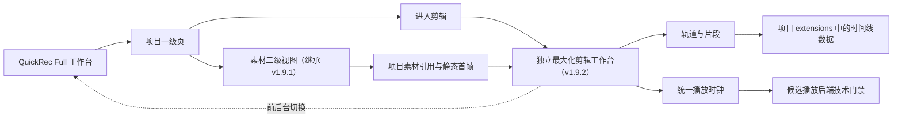
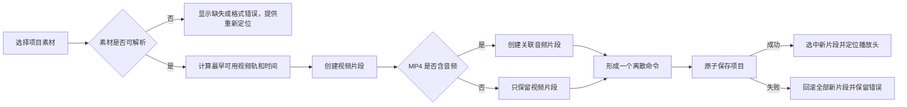

# QuickRec Full v1.9.2 高保真原型设计说明

## 1. 文档信息

| 项 | 内容 |
| --- | --- |
| 版本 | QuickRec Full v1.9.2 |
| 原型主题 | 可播放多轨时间线 |
| 原型状态 | 已由产品负责人确认（2026-07-27） |
| 对应 PRD | `doc/releases/v1.9.2/prd.md` |
| 原型入口 | `doc/releases/v1.9.2/prototype/index.html` |
| 运行方式 | 本地 HTTP 服务，禁止依赖外部 CDN |
| 实现边界 | 只验证信息架构、视觉、交互和状态契约，不代表播放后端已选型 |

## 2. 原型目标

本原型验证 v1.9.2 唯一产品主线：

1. 用户在项目上下文中识别素材。
2. 用户把项目素材加入视频轨和关联音频轨。
3. 用户调整片段时间位置和同类轨道。
4. 用户使用时间标尺、缩放、滚动和播放头浏览编排。
5. 用户在工作台内完成播放、暂停和跳转。
6. 时间线结构操作自动、原子地保存到项目文件。
7. 素材缺失、解码失败、音频不可用、保存失败和项目冲突均有明确恢复路径。

原型不验证真实解码、真实音频混合或 PyInstaller 播放依赖。libmpv、PyAV 和 Qt Multimedia 的最终选择必须经过 PRD 要求的独立技术门禁。

## 3. 继承关系

v1.9.2 继承 v1.9.1 已确认的主工作台、项目生命周期、中央素材引用和静态首帧能力。主工作台继续保留录制、素材库、项目、设置和诊断五个一级入口；从项目页进入剪辑后打开独立、默认最大化的顶级剪辑窗口。



## 4. 页面结构

### 4.1 工作台一级导航

- 录制：继承 v1.8。
- 素材库：继承 v1.7。
- 项目：承载素材与时间线二级视图。
- 设置：继承 v1.8。
- 诊断：继承 v1.8，并为后续播放错误摘要预留入口。

### 4.2 项目页与剪辑入口

- 空项目首次打开：进入“素材”。
- 已有时间线的项目显示“进入剪辑”入口和片段数量。
- 点击“进入剪辑”打开独立顶级窗口，默认最大化，但不使用独占式全屏。
- 主工作台和剪辑工作台可以同时存在，并通过任务栏或工作台内入口切换前台。
- 同一进程内记住每个项目的剪辑窗口、播放头、选择和布局状态。
- 重新打开剪辑工作台时恢复项目与时间线，但不自动恢复播放。

### 4.3 剪辑工作台布局

```text
Windows 顶级剪辑窗口（默认最大化）
├── 原生标题栏：QuickRec 剪辑工作台
├── 工作台命令栏
│   ├── 返回项目
│   ├── 当前项目名称与上下文
│   ├── 自动保存状态
│   ├── 素材工作台
│   ├── 开始录制
│   └── 关闭剪辑工作台
├── 状态横幅（按需）
├── 标准编辑态上半区
│   ├── 项目素材区
│   │   ├── 折叠
│   │   ├── 搜索
│   │   ├── 素材行
│   │   └── 加入 / 重新定位
│   └── 时间线预览
│       ├── 完整自适应画面
│       ├── 播放错误占位
│       ├── 播放、暂停、寻址与时间码
│       └── 放大 / 恢复预览
├── 可拖动水平分隔条
│   ├── 鼠标拖动
│   ├── 键盘微调
│   └── 双击恢复默认
└── 下半区
    ├── 撤销 / 重做
    ├── 新增视频轨 / 音频轨
    ├── 选中片段摘要
    ├── 专注时间线 / 缩放 / 适配
    ├── 时间标尺与播放头
    └── 视频轨、音频轨与片段
```

时间线不是项目列表的附属卡片，而是独立顶级工作台：

- 主工作台继续负责项目搜索、新建、重命名、归档和删除；
- 剪辑工作台只保留当前项目上下文、编辑、播放和恢复操作；
- 剪辑工作台默认最大化，保留标准 Windows 窗口语义和任务栏切换能力；
- 外层时间线工作区不滚动，滚动职责只交给项目素材列表和轨道画布；
- 剪辑工作台默认最大化，首次打开按约 68:32 分配预览与时间线可用高度；
- 在 1216×760 与 960×640 等受限视口下，优先把预览放大到时间线最低可操作高度所允许的上限；
- 预览与时间线之间可拖动调整，范围按窗口可用高度动态限制；双击恢复默认；
- “放大预览”隐藏时间线并让预览占满剩余空间，再次点击恢复上次分栏；
- 视频元素绝对铺满播放容器并使用 `object-fit: contain`，只允许留黑边，禁止裁切或拉伸；
- “专注时间线”收起项目素材与预览区，使轨道画布使用完整剩余高度；
- 返回项目或关闭剪辑窗口后，主工作台继续运行，项目和素材不会被关闭或删除。

### 4.4 双工作台与录制

- 主工作台和剪辑工作台分别保持单实例。
- “素材工作台”激活主工作台并切到全局素材库，剪辑窗口保持项目上下文。
- “开始录制”激活主工作台录制页和现有模式选择，不建立第二套录制状态机。
- 捕获开始前按既有规则临时隐藏或最小化 QuickRec 自身窗口，避免录入主工作台或剪辑工作台。
- 取消模式选择或倒计时后恢复剪辑上下文，不创建录制文件。
- 录制保存完成后刷新中央素材索引；用户可返回剪辑窗口继续编排。
- 关闭剪辑工作台不会退出 QuickRec，只有主工作台托盘“退出 QuickRec”才结束应用。

## 5. 关键交互

### 5.1 素材加入时间线



### 5.2 片段拖动

- 拖动期间只改变候选视觉。
- 同一轨道不允许重叠。
- 跨同类轨道允许。
- 视频片段不能拖到音频轨，音频片段不能拖到视频轨。
- 关联视频和音频通过 `link_group_id` 同步移动。
- 松开后形成一个撤销命令和一次原子保存。
- 无效落点、越界或保存失败时恢复原位置。

### 5.3 播放

- 最高有效视频轨全画面覆盖下层。
- 最高视频轨解码失败时显示该片段错误占位，不静默露出下层画面。
- 多条活动音频源采用固定衰减和安全限幅。
- 音频设备不可用时，用户明确选择“无声继续”或取消。
- 切换项目、关闭工作台或退出应用必须停止播放并释放资源。

## 6. 原型控制

页面顶部的原型工具栏提供：

1. **页面状态**：快速切换录制、素材、项目和时间线关键状态。
2. **浮动界面**：检查区域选择、窗口选择、录制工具栏和结果条。
3. **开发标注**：为当前界面所有带交互契约的控件显示编号；点击或聚焦控件时，在右侧就近展示完整契约。
4. **页面关系**：查看录制、素材库、项目、时间线、播放和项目文件之间的关系。
5. **播放浮动动画**：继承 v1.8 的录制浮动界面切换演示。

时间线状态包括：

- 播放中；
- 缓冲中；
- 素材缺失；
- 视频解码失败；
- 音频设备不可用；
- 保存中；
- 保存失败；
- 归档项目只读；
- 时间线损坏；
- 未知时间线版本；
- 项目外部修改冲突；
- 空时间线。

## 7. 控件契约查看方式

每个可操作按钮、输入框、轨道、片段和播放入口都带有 `data-contract`。打开“开发标注”后：

1. 控件右上角显示唯一编号。
2. 点击或键盘聚焦控件。
3. 标注面板展示：
   - 触发条件；
   - 操作结果；
   - 成功反馈；
   - 失败反馈；
   - 禁用规则；
   - 取消行为；
   - 后端与数据影响。

交互契约与控件直接关联，不在页面顶部另放脱离上下文的按钮说明清单。

## 8. 原型内已实现的交互演示

- “素材 / 时间线”二级页切换。
- 独立剪辑工作台打开、返回、关闭和前后台切换。
- 从剪辑工作台打开素材工作台和发起录制。
- 项目素材区折叠和展开。
- 标准编辑态与专注时间线切换。
- 预览与时间线分隔条拖动、键盘调整和双击恢复。
- 一键放大预览并恢复上次分栏。
- 素材搜索、清空和选择。
- 加入演示片段。
- 播放、暂停和播放头自动推进。
- 拖动进度条和点击时间标尺跳转。
- 时间线放大、缩小和适配。
- 片段选择、双击跳转和同类轨道拖动。
- 同轨重叠拒绝和跨类型拖动拒绝。
- 轨道重命名、增加和安全删除。
- 撤销、重做和自动保存反馈。
- 缺失、解码、音频、只读、损坏、版本和冲突状态。
- `Space`、`Delete`、`Ctrl+Z` 和 `Ctrl+Y` 基础快捷键演示。

## 9. 视觉规范

| 项 | 规则 |
| --- | --- |
| 产品定位 | 现代创作者桌面工具 |
| 侧栏 | 深色窄侧栏，延续 v1.8 |
| 主工作区 | 浅色、高密度、适合重复操作 |
| 主操作色 | 蓝色 |
| 成功 / 警告 / 失败 | 绿 / 黄 / 红 |
| 圆角 | 4–6px，最大不超过 8px |
| 图标 | 统一内嵌 SVG，不使用 emoji 或字符图标 |
| 字体 | Segoe UI、Microsoft YaHei |
| 卡片 | 仅用于素材行和明确的重复对象，不嵌套装饰卡片 |
| 动效 | 播放头、浮动工具栏和状态切换；不使用营销式装饰动画 |

## 10. 数据边界

- 时间线存入 `ProjectFile.extensions["quickrec.timeline"]`。
- 项目顶层 schema 保持 v1。
- 时间单位为整数微秒。
- 轨道、片段和关联组使用稳定 ID。
- 项目文件只保存素材引用，不复制视频。
- 播放、播放头、缩放、滚动和选择不写项目文件。
- 添加、删除、移动片段和轨道操作成功后立即原子保存。
- 撤销栈最多 50 个命令，不写入项目文件。
- 未知扩展字段必须保留。

## 11. 开发交接边界

### 前端 / UI

- `ProjectPage` 只负责二级视图和用户事件。
- 时间线画布、轨道头、片段和播放控制拆为独立可测试组件。
- 项目只读、损坏、未知版本和冲突状态不得复用普通空状态。

### 协调层

- 页面协调器负责项目切换、保存事务、撤销栈和错误映射。
- 播放协调器负责统一时钟、当前活动片段和资源释放。
- UI 不直接拼装项目 JSON，不直接启动无归属子进程。

### 播放后端

- 原型中的“播放”只为交互演示。
- 正式实现前必须完成 libmpv 与 PyAV 技术 spike。
- 技术门禁失败时不得用不可播放的方案 B 冒充 v1.9.2 正式目标。

## 12. 原型验收清单

- [x] 非空项目可进入独立、默认最大化的剪辑工作台。
- [x] 主工作台和剪辑工作台可前后台切换，并保留项目与时间线状态。
- [x] 剪辑工作台在 1200×760 下信息完整，无外层与轨道双纵向滚动。
- [x] 时间线在 960×640 下可操作，无关键控件裁切或横向溢出。
- [x] 可从剪辑工作台激活素材工作台和录制页。
- [x] 关闭剪辑工作台不退出 QuickRec。
- [ ] 100%、125%、150% DPI 设计均有稳定布局策略。
- [x] 素材区可折叠，且可切换专注时间线。
- [x] 预览区默认增高，可拖动调整且可双击恢复默认。
- [x] 放大预览可占满剩余工作区，并能恢复上次分栏。
- [x] 标准、调整和放大状态下视频均完整自适应显示，无裁切或拉伸。
- [x] 视频轨和音频轨视觉明确，轨道名称完整可读。
- [x] 片段重叠和关联关系可理解。
- [x] 播放、暂停、寻址和播放头反馈明确。
- [x] 每个交互控件都有完整就近开发契约。
- [x] 只读、缺失、解码、音频、保存、损坏、版本和冲突状态可展示。
- [x] 页面关系图包含项目素材、时间线数据、播放运行时和诊断。
- [x] 不出现剪辑、导出、AI、独立音频、静音/独奏、波形编辑等范围外功能。
- [x] 所有文本为简体中文 UTF-8，无乱码。

## 13. 确认门禁

原型经过产品负责人确认后，才允许：

1. 进入播放后端技术 spike；
2. 编写 v1.9.2 `dev_plan.md` 与 `progress.md`；
3. 实现 PyQt 时间线组件；
4. 修改 PyInstaller 播放依赖。

原型确认不等同于播放后端技术门禁通过，也不等同于 v1.9.2 可发布。
