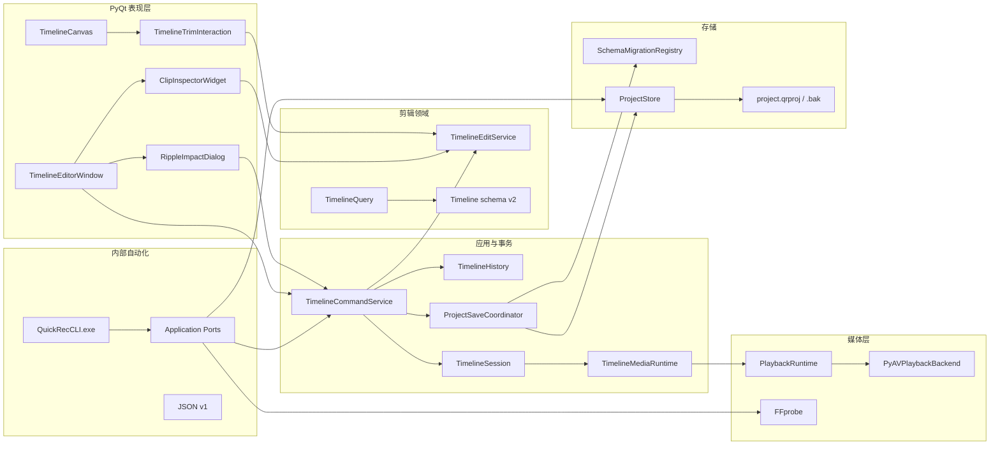

# QuickRec Full v1.9.3 开发计划

## 0. 追踪信息

| 项目 | 内容 |
| --- | --- |
| 目标版本 | QuickRec Full v1.9.3 |
| 版本主题 | 基础剪辑、全局波纹与内部自动化 CLI |
| 当前状态 | D0-D10 已完成，正式发布 |
| 发布前基线 | v1.9.2 |
| 正式分支 | `master`，`test` 与 v1.9.3 发布提交同步 |
| 当前发布基线 | tag `v1.9.2` / `91ab91cba324658d9bfadb7016a31f8e4e380efb` |
| 当前工作区 | `E:\codex\QuickRec` |
| 上游需求池 | `doc/archive/ideas/mypm-idea-pool-v1.9.3-2026-07-28.md` |
| 需求事实源 | `doc/releases/v1.9.3/prd.md` |
| 澄清事实源 | `doc/releases/v1.9.3/clarification-record.md` |
| 交互事实源 | `doc/releases/v1.9.3/prototype/` |
| 架构前置 | 已完成并独立验证；v2.0 治理文档不属于本版本发布提交 |
| 状态事实源 | `doc/releases/v1.9.3/progress.md` |
| 技术门禁输出 | D1 创建 `doc/releases/v1.9.3/playback-accuracy-spike.md` |
| 开发日志 | 实施开始后创建 `doc/releases/v1.9.3/dev_log.md` |
| 自动验证记录 | D9 创建 `doc/releases/v1.9.3/verification.md` |
| GUI 验收记录 | D10 创建 `doc/releases/v1.9.3/manual-verification.md` |
| 缺陷记录 | 发现真实缺陷时创建 `doc/releases/v1.9.3/bugfix-log.md` |
| PRD 确认 | 已获得（2026-07-28） |
| 原型确认 | 已获得（2026-07-29） |
| 开发承接确认 | 已获得（2026-07-29） |
| 进入业务实现授权 | 已获得（2026-07-29） |
| 代码回滚点 | tag `v1.9.2`，不得移动或重写 |
| Lite 边界 | `E:\codex\QuickRec-Lite` 不属于本版范围，不得修改 |
| 最后更新 | 2026-07-29 |

## 1. 执行基线

### 1.1 当前阶段

当前已由开发承接进入 **实施阶段**，不是重新定义需求阶段。

后续实施必须以以下文件为事实源：

1. `doc/releases/v1.9.3/prd.md`
2. `doc/releases/v1.9.3/prototype/`
3. `doc/releases/v1.9.3/dev_plan.md`
4. `doc/releases/v1.9.3/progress.md`

实施时严格按 `progress.md` 的 D0-D10 顺序推进。每完成一个最小任务立即同步
checklist；开发过程写入 `dev_log.md`，技术 spike 写入独立报告，缺陷复现、根因、
修复和定向复验写入 `bugfix-log.md`。`progress.md` 不记录开发流水。

### 1.2 当前工程基线

| 项 | 基线事实 |
| --- | --- |
| 发布前基线 | `master` / tag `v1.9.2` / `91ab91c` |
| 架构优化状态 | 已实现、验证并纳入 v1.9.3 发布源 |
| 架构优化测试 | `912 passed, 27 deselected, 56 subtests passed` |
| 架构优化覆盖率 | 83.51% |
| Packaging 测试 | `15 passed, 924 deselected` |
| 工程门禁 | Ruff、Mypy、Compileall、`git diff --check` 通过 |
| 架构候选包 | `E:\QRtest\QuickRec-architecture-20260728-dist\QuickRec\QuickRec.exe` |
| 当前时间线 | schema v1，完整素材范围，最多 8+8 轨、100 片段、30 分钟 |
| 当前播放后端 | PyAV，已通过 v1.9.2 正式播放验收 |
| 当前历史 | 混合增量历史；复杂结构命令仍可使用安全快照 |
| 当前保存 | `ProjectSaveCoordinator` 保持同步原子保存 |
| 当前迁移能力 | `SchemaMigrationRegistry` 已完成 timeline v1→v2 延迟原子迁移 |
| 当前媒体生命周期 | `TimelineMediaRuntime` 已从 `TimelineSession` 抽离 |
| 当前录制保护 | `RecordingGuard` 已从 `TimelineSession` 抽离 |
| QuickRec Lite | `lite-master` / `cfaee3e`，工作区干净 |

架构优化与 v1.9.3 的关系：

1. 架构优化是 v1.9.3 的工程前置，不改变本版产品范围。
2. 发布提交已将架构实现与独立 v2.0 架构、归属治理文档区分清楚。
3. v2.0 独立治理文档不纳入 v1.9.3 发布提交。
4. v1.9.3 不得覆盖、撤销或重复实现
   `ProjectSaveCoordinator`、`SchemaMigrationRegistry`、
   `TimelineMediaRuntime`、`RecordingGuard` 和混合历史。
5. 若架构基线在实施前发生变化，D0、D1 和受影响测试证据必须重新核对。

### 1.3 版本目标

v1.9.3 交付以下完整闭环：

1. 在独立剪辑工作台中通过左右手柄或精确输入裁剪关联音视频。
2. 在合法播放头位置分割关联音视频，保持稳定身份和选择规则。
3. 所有正式删除和时长变化采用固定全局波纹。
4. 提交前展示时间区间、时长变化、受影响轨道、片段和关联对象。
5. 锁定轨道阻止直接编辑和波纹移动，冲突必须在提交前暴露。
6. timeline schema v1 只读打开不改写，第一次成功 v2 剪辑才原子升级。
7. 裁剪、分割、波纹、锁定、撤销和重做均保持原子保存及失败零副作用。
8. 非零源入点的视频和音频播放达到 PRD 量化门槛。
9. 提供内部 `QuickRecCLI.exe`，用于诊断、录制、探测、项目/时间线校验和编辑 smoke。
10. 录制、素材库、项目、首帧预览、多轨播放、设置、诊断和 120 FPS 不回退。

### 1.4 内部门禁与发布边界

v1.9.3 使用四层门禁：

| 门禁 | 内容 | 未通过处理 |
| --- | --- | --- |
| G0 基线门禁 | 架构优化独立、事实源和 dirty 文件受保护 | 停止业务实现 |
| G1 技术门禁 | 非零源入点、分割接缝、音频 seek、源码/frozen | 停止正式剪辑领域和 PyQt 手势实现 |
| G2 领域门禁 | schema v2、纯候选算法、原子命令和压力不变量 | 不接入正式 UI |
| G3 发布门禁 | 两个 EXE、真实媒体、GUI、DPI、回归和数据保护 | 不发布 v1.9.3 |

技术门禁失败时不得：

- 用静态原型代替真实媒体；
- 临时引入第二播放后端；
- 降级为仅裁剪方案并继续宣称 v1.9.3 完成；
- 跳过音频门禁或只验证无声视频；
- 修改 QuickRec Lite 规避工程问题。

### 1.5 明确不做

- 波纹模式开关和非波纹正式模式；
- 解除音视频关联、独立裁剪音频和音视频分离；
- 变速、转场、滤镜、关键帧、视频变换和画中画；
- 音量、静音、声像、淡入淡出和波形编辑；
- 独立音频文件导入；
- 正式导出、导出队列和输出参数体系；
- 面向普通用户的公开 CLI、Shell 集成和稳定脚本 API；
- AI、字幕、摘要、标签、云同步、数据库和插件系统；
- WGC 和新的高刷新率能力；
- QuickRec Lite 改动；
- 全量重写 `QuickRecApp`、工作台、剪辑窗口、素材库或录制核心。

## 2. PRD 追溯与阶段映射

| PRD ID / 章节 | 实施边界 | 阶段 | 主要证据 |
| --- | --- | --- | --- |
| PRD-193-10 高保真原型 | 已确认原型与 PyQt 对照 | D0、D5、D10 | 原型记录、截图对照 |
| PRD-193-02 非零源入点门禁 | PyAV 视频/音频 seek 与资源释放 | D1、D6、D9 | spike、帧/采样分析、frozen 证据 |
| PRD-193-01 schema v2 | 延迟迁移、轨道锁、局部源范围 | D2、D4、D7 | JSON、哈希、备份、回滚测试 |
| PRD-193-03 关联裁剪 | 纯候选、原子提交、UI 手势 | D3-D6 | 模型断言、GUI、真实播放 |
| PRD-193-04 关联分割 | 身份、关联组和边界规则 | D3-D6 | 模型断言、连续播放 |
| PRD-193-05 全局波纹 | 影响预览、统一移动和删除 | D3-D5 | 影响摘要、压力与 GUI |
| PRD-193-06 轨道锁 | 持久化锁、冲突阻断和撤销 | D2-D5 | schema、命令、冲突 UI |
| PRD-193-07 原子保存 | 保存协调、历史和失败回滚 | D4、D7 | 故障注入、前后状态 |
| PRD-193-08 异常恢复 | 缺失、重新定位、只读、损坏 | D7、D10 | 受控项目、日志、GUI |
| PRD-193-09 片段检查器 | 精确输入、预览、应用和取消 | D5 | offscreen、GUI、DPI |
| PRD-193-11 内部 CLI | 命令、隔离、JSON、超时和打包 | D8-D10 | CLI 集成、真实 APPDATA 哈希 |
| PRD-193-12 工程支撑 | 最小拆分、质量与 CI | D3-D9 | 依赖边界、覆盖率、CI |
| PRD-193-13 音视频分离边界 | 仅保留稳定身份和来源范围 | D2-D4 | schema 往返，不提供 UI |
| PRD 第 20 章 | 日志、诊断和隐私 | D7-D9 | 日志事件、诊断导出 |
| PRD 第 22-24 章 | 性能、验收与发布阻塞 | D3-D10 | 基准、候选包、验收报告 |

## 3. 技术设计边界

### 3.1 目标模块关系



依赖规则：

1. `TimelineEditService` 不导入 Qt、文件系统、播放后端或 CLI。
2. `TimelineCanvas` 只产生编辑意图和候选手势，不直接修改项目。
3. `TimelineCommandService` 只通过保存协调器提交，不复制剪辑算法。
4. `QuickRecCLI` 只调用应用端口，不导入 `src.ui`。
5. 播放运行时只消费已提交时间线，不读取 UI 候选状态。
6. schema 迁移必须通过注册表，不在 UI 或命令分支散落版本判断。

### 3.2 TimelineEditService

建议新增：

```text
src/services/timeline_editing.py
```

职责：

- 构造关联音视频裁剪候选；
- 构造关联音视频分割候选；
- 计算全局波纹区间和受影响对象；
- 检测轨道锁、跨越区间、同轨重叠和关联组冲突；
- 输出稳定的候选模型、影响摘要和错误类别；
- 不写项目、不移动历史栈、不操作 Qt。

候选数据建议使用冻结 dataclass，至少包含：

- 命令类型；
- 原时间线指纹；
- 候选时间线；
- 删除或插入区间；
- 总时长变化；
- 受影响轨道、片段和关联组；
- 冲突列表；
- 选中片段与播放头建议；
- schema 迁移要求。

### 3.3 命令、保存与历史

`TimelineCommandService` 保持事务入口：

1. 接收 UI 或 CLI 的结构化意图。
2. 调用 `TimelineEditService` 重新计算候选。
3. 校验候选来源指纹，防止陈旧预览提交。
4. 必要时在同一事务中执行 timeline v1→v2 迁移。
5. 调用 `ProjectSaveCoordinator` 原子保存项目和备份。
6. 保存成功后才更新正式内存、选择、历史和播放计划。
7. 保存失败时保持 UI、内存、项目文件和历史栈不变。

历史策略：

- 裁剪和轨道锁优先生成增量 `ClipChange` / `TrackChange`；
- 分割和全局波纹首轮允许安全快照；
- 100 片段压力通过后再决定是否把结构命令改为增量；
- 任何历史优化不得改变保存成功后才提交可见状态的语义。

### 3.4 timeline schema v2

只升级 `extensions["quickrec.timeline"]`：

- 项目顶层 schema 继续为 1；
- `TimelineTrack.locked` 为正式字段，缺省 `false`；
- 局部 `source_start_us` 和 `source_duration_us` 合法；
- 时间单位继续为整数微秒；
- 未知字段、其他扩展、轨道/片段 `extensions` 原样保留；
- 仅查看、播放或 v1 兼容操作不得写盘；
- 第一次成功 v2 剪辑才迁移、备份、校验和提交；
- v1.9.2 打开 v2 时只读保留；
- 禁止自动降级 v2→v1。

### 3.5 PyQt 交互边界

建议新增：

```text
src/ui/timeline_trim_interaction.py
src/ui/clip_inspector.py
src/ui/timeline_edit_dialogs.py
```

`TimelineTrimInteraction`：

- 管理手柄命中、拖动、吸附、候选和取消；
- 鼠标移动期间只更新候选视觉；
- 释放后才请求影响预览或提交；
- `Esc`、失焦、切换项目或错误均取消候选。

`ClipInspectorWidget`：

- 展示素材、轨道、关联组、时间线起点、源入点、源出点和时长；
- 解析并校验 `HH:MM:SS.mmm`；
- 展示帧归一化结果和波纹影响；
- 应用、取消和关闭规则与原型一致；
- 不直接调用存储层。

`TimelineEditorWindow`：

- 继续负责窗口、选择、播放、反馈和协调；
- 不实现剪辑不变量和波纹计算；
- 通过窄信号连接画布、检查器、对话框和命令服务。

### 3.6 内部 CLI 边界

建议新增：

```text
src/cli/__init__.py
src/cli/main.py
src/cli/contracts.py
src/cli/isolation.py
src/cli/commands.py
src/cli_entry.py
```

CLI 合同：

- 独立 `QuickRecCLI.exe`；
- 不创建 `QApplication`、托盘或窗口；
- JSON 模式 stdout 只输出一个 JSON 对象；
- 非结构化日志写 stderr 或证据目录；
- 修改状态的命令强制 `--workspace` 与 `--evidence-dir`；
- `smoke --suite editing` 复制输入项目后验证，不覆盖输入；
- 不公开 `trim`、`split`、`delete` 或 `ripple` 用户命令；
- 退出码、超时和 JSON schema 严格按 PRD；
- 与 GUI 复用应用端口、项目存储、媒体探测和时间线校验。

### 3.7 打包边界

`build_std.spec` 需要生成：

```text
dist/QuickRec/
├── QuickRec.exe
├── QuickRecCLI.exe
└── _internal/
```

两个入口共享 `_internal`、FFmpeg、FFprobe、PyAV 和 Python 运行库。不得生成两份完整依赖，
不得给 CLI 创建快捷方式、托盘或 GUI 入口。

## 4. 文件与模块影响

### 4.1 预计新增生产文件

| 文件 | 作用 | 阶段 |
| --- | --- | --- |
| `src/services/timeline_editing.py` | 纯裁剪、分割、波纹候选与冲突计算 | D3 |
| `src/ui/timeline_trim_interaction.py` | 裁剪手势状态与候选预览 | D5 |
| `src/ui/clip_inspector.py` | 精确输入与片段属性检查器 | D5 |
| `src/ui/timeline_edit_dialogs.py` | 波纹影响、冲突和删除确认 | D5 |
| `src/cli/__init__.py` | CLI 包边界 | D8 |
| `src/cli/main.py` | 参数解析、调度和退出码 | D8 |
| `src/cli/contracts.py` | JSON v1、错误与身份合同 | D8 |
| `src/cli/isolation.py` | 隔离工作区和环境保护 | D8 |
| `src/cli/commands.py` | doctor、record、probe、validate、smoke 适配 | D8 |
| `src/cli_entry.py` | PyInstaller CLI 入口 | D8 |

最终文件名可按现有命名规范微调，但职责边界不得合并回
`TimelineEditorWindow` 或 `QuickRecApp`。

### 4.2 预计修改生产文件

| 文件 | 改动 |
| --- | --- |
| `src/utils/timeline_model.py` | schema v2、轨道锁、局部源范围与只读兼容 |
| `src/utils/schema_migrations.py` | 注册 timeline v1→v2 延迟迁移 |
| `src/utils/project_store.py` | 备份、迁移和未知扩展往返接缝 |
| `src/services/timeline_commands.py` | 新剪辑命令、候选指纹、原子提交和历史 |
| `src/services/timeline_history.py` | 裁剪/锁增量历史及结构命令安全回退 |
| `src/services/timeline_session.py` | 暴露剪辑能力、只读和保存待处理状态 |
| `src/services/project_save_coordinator.py` | 迁移与同一候选重试的事务支持 |
| `src/services/timeline_query.py` | 局部源范围和编辑后播放计划 |
| `src/services/playback_runtime.py` | 编辑后安全重建与播放头边界 |
| `src/services/pyav_playback_backend.py` | 非零源入点准确 seek 与释放 |
| `src/ui/timeline_canvas.py` | 手柄绘制、命中、锁定视觉和意图信号 |
| `src/ui/timeline_editor_window.py` | 工具栏、检查器、波纹预览和状态协调 |
| `src/main.py` | CLI 可复用应用端口与诊断摘要接缝，保持 GUI 装配根 |
| `src/utils/diagnostics.py` | schema、剪辑、播放边界和 CLI 摘要 |
| `build_std.spec` | 同目录双 EXE 与共享依赖 |
| `pyproject.toml` | 新模块 Ruff、Mypy、Coverage 和 CLI 入口配置 |
| `.github/workflows/ci.yml` | v1.9.3 测试、CLI 与 Packaging 门禁 |

若实际 CI 文件名不同，D0 先定位后按现有文件修改，不新建重复 workflow。

### 4.3 预计新增测试与夹具

```text
tests/test_timeline_schema_v2.py
tests/test_timeline_editing.py
tests/test_timeline_trim_interaction.py
tests/test_clip_inspector.py
tests/test_timeline_edit_dialogs.py
tests/test_cli_contracts.py
tests/test_cli_commands.py
tests/test_cli_isolation.py
tests/test_cli_packaging.py
tests/test_v193_playback_accuracy.py
tests/fixtures/v1_9_3/
```

受影响既有测试：

```text
tests/test_timeline_model.py
tests/test_timeline_commands.py
tests/test_timeline_history.py
tests/test_timeline_query.py
tests/test_timeline_session.py
tests/test_timeline_canvas.py
tests/test_timeline_editor_window.py
tests/test_timeline_playback_ui.py
tests/test_playback_runtime.py
tests/test_pyav_playback_backend.py
tests/test_project_store.py
tests/test_schema_migrations.py
tests/test_main_workflow.py
tests/test_packaging_config.py
```

### 4.4 预计新增脚本与文档

| 文件 | 用途 |
| --- | --- |
| `scripts/generate_v193_editing_media.py` | 生成帧编号、音频脉冲和长时受控样本 |
| `scripts/v193_playback_accuracy_spike.py` | 非零入点、接缝、同步和资源测量 |
| `doc/releases/v1.9.3/playback-accuracy-spike.md` | D1 技术证据与停止结论 |
| `doc/releases/v1.9.3/dev_log.md` | 实施过程 |
| `doc/releases/v1.9.3/verification.md` | 自动化、覆盖率、打包和哈希 |
| `doc/releases/v1.9.3/manual-verification.md` | 锁定包 GUI 验收 |
| `doc/releases/v1.9.3/bugfix-log.md` | 真实缺陷记录，按需创建 |
| `doc/releases/v1.9.3/release-notes.md` | 发布候选说明，D10 后创建 |
| `doc/releases/v1.9.3/changelog.md` | 版本差异，D10 后创建 |

### 4.5 明确不修改

- `E:\codex\QuickRec-Lite` 全部文件；
- v1.9.2 tag、发布文档和发布包；
- 用户真实 `%APPDATA%\QuickRec`、中央素材索引和项目；
- 用户真实视频；
- v2.0 贡献归属治理文档的内容和提交边界；
- 现有历史 tag；
- 与本版无关的多显示器、WGC、高刷扩展和导出实现。

## 5. 实施顺序


顺序原则：

1. 先独立固定架构优化基线，再开始 v1.9.3 产品代码。
2. 先用真实媒体证明非零源入点可行，再设计正式剪辑算法和手势。
3. 先冻结 schema v2 和纯候选不变量，再写 Qt 交互。
4. 候选预览与正式提交分离，所有 UI 取消路径必须零副作用。
5. 每个正式编辑都经过同一个命令、保存、历史和播放刷新链路。
6. CLI 最后复用已稳定的应用端口，不与 GUI 并行复制业务规则。
7. 每个阶段先写失败测试，再实现，再运行定向测试并同步 `progress.md`。
8. D9 锁定唯一候选包后才进入 D10；不同哈希证据不得混用。

## 6. 分阶段实施任务

### D0 基线、文档与实现授权

- **目标**：锁定 v1.9.2、架构优化和 v1.9.3 三类变更边界。
- **涉及文件**：Git 状态、v1.9.3 文档、架构实施记录；不改业务代码。
- **实施要点**：
  - 记录 `master`、`test`、HEAD、tag、远端和 dirty 文件。
  - 确认架构优化测试证据仍与当前代码一致。
  - 把架构优化与 v1.9.3 文档/代码划为独立提交边界。
  - 保留 v2.0 贡献归属治理文档，不混入 v1.9.3。
  - 创建 `dev_log.md` 并写明事实源、门禁和停止点。
  - 用户确认开发承接后，再单独取得业务实现授权。
  - 实施分支优先沿用用户既有 `test` 集成流程，不强制新建 feature 分支。
  - 确认 Lite 工作区前后状态并只读记录。
- **验证**：Git 状态、文档链接、UTF-8、乱码、`git diff --check`。
- **完成标准**：架构前置已独立固定，事实源无冲突，业务实现授权明确。

### D1 非零源入点播放准确性技术 spike

- **目标**：证明当前 PyAV 路线能支撑裁剪和分割后的真实视频/音频边界。
- **涉及文件**：受控样本脚本、spike 脚本、测试和独立报告；原则上不改生产 UI。
- **实施要点**：
  - 生成带连续帧号、时间码和 AAC 脉冲的 30/60/120 FPS 样本。
  - 覆盖 QuickRec H.264/AAC、无声 H.264、中文与空格路径。
  - 测量非关键帧入点的实际首帧。
  - 测量非零音频入点、连续片段接缝、提前内容、重叠和间隙。
  - 验证关联音视频连续分割后的同步。
  - 验证 30 秒和 10 分钟样本的绝对偏差与漂移增量。
  - 对照源码和真实 PyInstaller 环境。
  - 检查播放、暂停、跳转、项目切换和退出后的线程、音频与子进程。
  - 保存生成命令、样本哈希、FFprobe、帧/采样分析和资源摘要。
- **硬标准**：
  - 视频首帧与接缝不超过一个源帧；
  - 音频提前、重叠或间隙不超过 20 毫秒；
  - 音画绝对偏差不超过 40 毫秒；
  - 10 分钟漂移增量不超过 20 毫秒；
  - 跳转不超过 500 毫秒，暂停不超过 200 毫秒；
  - 项目切换释放不超过 2 秒且无残留。
- **完成标准**：
  - `playback-accuracy-spike.md` 给出逐项数据和唯一结论；
  - 全部发布必需指标通过后才能进入 D2；
  - 任一核心指标未通过则标记阻塞并停止正式剪辑实现。

### D2 timeline schema v2 与延迟迁移

- **目标**：建立局部源范围、轨道锁和旧项目安全升级的数据合同。
- **涉及文件**：`timeline_model.py`、`schema_migrations.py`、`project_store.py`、
  v1.9.3 fixtures 和测试。
- **实施要点**：
  - 定义 timeline schema v2，项目顶层 schema 保持 1。
  - 为 `TimelineTrack` 增加 `locked=False`。
  - 允许合法非零 `source_start_us` 与局部 `source_duration_us`。
  - 保持整数微秒和正常速度时源时长等于时间线时长。
  - 注册 v1→v2 迁移，保留全部未知字段和其他扩展。
  - 打开、查看、播放和 v1 兼容操作不写盘。
  - 第一次成功 v2 剪辑在同一事务中备份、迁移、校验和保存。
  - 未来版本只读，v1.9.2 回滚只读保留 v2。
  - 迁移失败不改变原文件、正式内存和历史。
- **验证**：
  - v1 打开前后哈希相同；
  - 首次 v2 剪辑产生 v2 和 `.bak`；
  - v2 往返、未知字段、其他 extensions 保留；
  - v99 只读；
  - 损坏、备份恢复和迁移中断；
  - 30/60/120 FPS 帧归一化边界。
- **完成标准**：数据合同和迁移测试通过，不依赖 Qt。

### D3 剪辑候选、关联组与全局波纹算法

- **目标**：以纯领域服务实现所有候选计算和冲突预检。
- **涉及文件**：`timeline_editing.py`、`timeline_model.py` 和纯逻辑测试。
- **实施要点**：
  - 实现左裁剪、右裁剪、延长和精确范围候选。
  - 统一按素材 FPS 吸附帧边界。
  - 实现播放头分割和左右片段身份规则。
  - 关联视频与音频必须原子裁剪和分割。
  - 实现固定全局波纹删除、缩短和延长。
  - 计算受影响轨道、片段、关联组、区间和总时长变化。
  - 实现锁定轨道、跨越删除区间、插入点冲突和同轨重叠检测。
  - 无效候选返回稳定错误类别，正式模型零变化。
  - 100 片段下预检不阻塞 UI，结果稳定可重复。
- **验证**：
  - 边界、最短时长、零/负值和素材越界；
  - 同一素材多个片段；
  - 关联组缺失、错误类型和不同范围；
  - 多轨重叠、锁定、跨越和插入点；
  - 100 次随机合法剪辑压力；
  - 候选确定性和原模型不变。
- **完成标准**：所有 PRD 不变量由纯测试证明，尚不接正式 UI。

### D4 命令、原子保存、历史与回滚

- **目标**：把 D3 候选接入唯一事务链路。
- **涉及文件**：`timeline_commands.py`、`timeline_history.py`、
  `project_save_coordinator.py`、`timeline_session.py` 和测试。
- **实施要点**：
  - 增加裁剪、分割、全局波纹删除和轨道锁命令入口。
  - 提交时验证候选来源指纹，拒绝陈旧预览。
  - 首次 v2 命令与迁移在同一原子事务中完成。
  - 裁剪和轨道锁优先使用增量历史。
  - 分割和全局波纹首轮使用安全快照，保留后续优化边界。
  - 每次用户操作只形成一条历史和一次保存。
  - 撤销/重做重新通过保存协调器，失败不移动栈。
  - 保存失败进入冻结状态，重试同一候选，放弃恢复上次成功状态。
  - 外部修改、只读、归档和未知版本在候选前阻止。
  - 删除片段不删除项目素材、中央索引或视频。
- **验证**：
  - 命令成功、取消和失败前后四态对比：UI 候选、内存、文件、历史；
  - 50 步撤销重做和新分支清空；
  - 项目写入、备份、中央索引和恢复副本故障注入；
  - 陈旧候选和外部修改；
  - 100 片段 P95 提交、保存、撤销和重做。
- **完成标准**：无半提交、二次波纹或单边关联修改。

### D5 PyQt 裁剪、分割、波纹与轨道锁交互

- **目标**：按已确认原型实现正式剪辑 UI。
- **涉及文件**：`timeline_canvas.py`、新增交互/检查器/对话框、
  `timeline_editor_window.py` 和 UI 测试。
- **实施要点**：
  - 选中片段展示双侧手柄和关联状态。
  - 手柄拖动仅产生候选，释放后进入影响预览。
  - 实现片段属性检查器、时间输入、帧归一化和影响摘要。
  - 实现分割按钮、右键菜单和 `Ctrl+B`。
  - `Delete` 进入全局波纹删除确认，不直接删除。
  - 工具栏固定显示“全局波纹”，不增加模式开关。
  - 每条轨道提供锁定/解锁和明确视觉。
  - 波纹弹窗展示区间、总时长、受影响轨道/片段和关联目标。
  - 冲突时禁用确认并提供定位冲突。
  - 取消、关闭、`Esc`、失焦和项目切换均零副作用。
  - 保存失败、只读、缺失和关联异常遵循持续反馈规则。
  - 最大化、1216×760、960×640 和三档 DPI 与原型一致。
- **验证**：
  - offscreen Qt 组件与信号测试；
  - 手柄命中、拖动、吸附、取消；
  - 精确输入、无效输入、应用和关闭；
  - 分割、删除、锁定和冲突定位；
  - 长文件名、中文路径、8+8 轨和 100 片段；
  - 原型逐页面截图对照。
- **完成标准**：UI 只协调和展示，领域规则没有回流到窗口或画布。

### D6 编辑后播放计划与真实准确性

- **目标**：让已提交裁剪和分割结果在 PyAV 播放中满足 D1 门槛。
- **涉及文件**：`timeline_query.py`、`playback_runtime.py`、
  `pyav_playback_backend.py`、`timeline_media_runtime.py`、播放 UI 和测试。
- **实施要点**：
  - 活动片段查询使用 `source_start_us + 片段内偏移`。
  - 编辑提交后在安全点重建播放计划。
  - 播放头超出新总时长时夹紧到末尾。
  - 分割后连续播放不重复旧帧或残留旧音频。
  - 裁剪后首帧和音频起点与候选范围一致。
  - 撤销重做后播放计划与项目事实同步。
  - 播放中编辑遵循暂停、提交、重建和恢复规则。
  - 失败时显示明确状态，不伪造可播放画面。
  - 项目切换、关闭和退出释放全部媒体资源。
- **验证**：
  - 复用 D1 真实样本和分析方法；
  - 单片段裁剪、连续分割、双视频覆盖和关联音频；
  - 30 秒、10 分钟、中文和空格路径；
  - 源码和 frozen 环境；
  - 播放、暂停、跳转、撤销、切换项目和退出。
- **完成标准**：D1 全部指标在正式生产链路中复验通过。

### D7 异常、恢复、日志与诊断

- **目标**：闭合剪辑失败路径、恢复入口和诊断证据。
- **涉及文件**：命令、会话、项目、素材恢复、诊断和 UI 状态。
- **实施要点**：
  - 缺失素材保留片段、范围、身份和位置。
  - 缺失片段禁用裁剪/分割，允许确认后波纹删除。
  - 重新定位恢复同 `material_id` 的全部片段，不改变剪辑范围。
  - 关联异常整组只读，不自动猜测或单边修复。
  - 项目只读、归档、损坏、未来版本和外部冲突提供明确入口。
  - 保存待处理期间冻结新编辑。
  - 日志记录迁移、候选、波纹、锁、提交、历史、播放边界和 CLI。
  - 诊断导出增加 schema、最近剪辑、波纹冲突、播放误差和资源释放摘要。
  - 路径和环境信息按 PRD 脱敏。
- **验证**：
  - 缺失、损坏、备份、无备份、只读、归档、未来版本和外部修改；
  - 保存失败、重试、放弃和恢复副本；
  - 诊断字段、日志语义和隐私扫描；
  - 多次打开/关闭及资源残留。
- **完成标准**：异常不会损坏项目或媒体，用户始终有可理解的恢复路径。

### D8 独立 QuickRecCLI.exe

- **目标**：建立不依赖 GUI 的内部自动化入口。
- **涉及文件**：`src/cli/**`、`src/cli_entry.py`、应用端口、测试和文档。
- **实施要点**：
  - 实现 `doctor --json`。
  - 实现全屏 `record`，支持 30/60/120 FPS 和四种音频。
  - 实现 `probe`、`project validate`、`timeline validate`。
  - 实现 `smoke --suite editing`，验证迁移、候选、回滚和播放边界。
  - 统一退出码、JSON v1、超时和错误类别。
  - JSON stdout 不混日志；日志写 stderr 或证据目录。
  - 修改命令强制隔离参数并保护真实 APPDATA。
  - CLI 不初始化 Qt GUI、托盘或工作台。
  - 取消、超时和异常后清理子进程和临时文件。
  - 记录源码/frozen 身份、版本、哈希和证据引用。
- **验证**：
  - 参数组合、退出码、JSON schema 和 stderr；
  - 成功、失败、取消、超时、依赖缺失和权限错误；
  - 真实 APPDATA、配置、索引前后哈希；
  - 真实全屏录制、FFprobe 和编辑 smoke；
  - 无 GUI 进程和无残留子进程；
  - CLI 不能执行破坏性项目或素材操作。
- **完成标准**：CLI 与 GUI 复用业务服务，所有隔离与机器可读合同通过。

### D9 自动化、CI、双入口打包与候选包

- **目标**：完成全量质量门禁并锁定唯一候选包。
- **涉及文件**：测试、CI、`pyproject.toml`、`build_std.spec`、verification。
- **实施要点**：
  - 剪辑领域与 CLI 核心模块覆盖率不低于 85%。
  - 手势、检查器和页面协调模块覆盖率不低于 80%。
  - 项目总体覆盖率不低于 80%。
  - 新增/修改模块全部纳入 Ruff、Mypy 和 Compileall。
  - CI 覆盖 `master`、`test`、Pull Request 和 `v*` tag。
  - `test`、`master` 和 tag 额外执行 Packaging smoke。
  - 同一分发目录生成 `QuickRec.exe` 与 `QuickRecCLI.exe`。
  - 确认共享 `_internal`，没有重复媒体依赖。
  - Packaging smoke 验证两个入口、FFmpeg、FFprobe、PyAV、真实媒体和退出释放。
  - 使用独立目录打包，不覆盖 v1.9.2 正式包。
  - 记录两个 EXE、FFmpeg、FFprobe、分发目录和 ZIP 的大小、时间及 SHA256。
  - 对比 v1.9.2 包体和新增入口成本。
- **核心命令**：

```powershell
python -m pytest tests/test_v193_playback_accuracy.py tests/test_timeline_schema_v2.py -q
python -m pytest tests/test_timeline_editing.py tests/test_timeline_commands.py tests/test_timeline_history.py -q
python -m pytest tests/test_timeline_trim_interaction.py tests/test_clip_inspector.py tests/test_timeline_edit_dialogs.py -q
python -m pytest tests/test_timeline_query.py tests/test_playback_runtime.py tests/test_pyav_playback_backend.py -q
python -m pytest tests/test_cli_contracts.py tests/test_cli_commands.py tests/test_cli_isolation.py -q
python -m pytest -m packaging -q
python -m pytest --cov=src --cov-report=term-missing --cov-fail-under=80
python -m ruff check src tests scripts
python -m mypy
python -m compileall -q src tests scripts
git diff --check
```

- **完成标准**：全部门禁通过，唯一候选包身份和证据目录已锁定。

### D10 GUI 验收与发布收口

- **目标**：基于锁定候选包完成真实桌面验收并判断能否发布。
- **涉及文件**：manual verification、verification、progress、必要时 bugfix log、
  release notes 和 changelog。
- **实施要点**：
  - 使用 Computer Use 与人工补证实际操作候选包。
  - 验证手柄、检查器、分割、波纹、锁定、冲突和所有取消路径。
  - 验证 schema v1 首次剪辑迁移、v2 重启、v1.9.2 回滚只读和未知字段保留。
  - 验证真实非关键帧、连续分割、关联音视频和 10 分钟同步。
  - 验证保存失败、重试、放弃、外部冲突、缺失、重新定位、只读和损坏。
  - 验证最大化、960×640、100%、125%、150% DPI。
  - 验证 8+8 轨、100 片段、30 分钟和 100 次混合编辑压力。
  - 验证源码和候选包 CLI 的 JSON、退出码、隔离、录制和 editing smoke。
  - 回归三种录制、四种音频、30/60/120 FPS、素材库、项目、首帧预览、
    时间线播放、设置、诊断、托盘和退出。
  - 使用隔离 APPDATA 和项目副本，记录真实用户环境前后哈希。
  - 确认 QuickRec Lite 未修改。
  - Acceptance 通过且用户明确授权后，才允许提交、推送、tag 和 Release。
- **完成标准**：全部发布阻塞关闭，证据可追溯，停在发布授权点。

## 7. 测试与验收计划

### 7.1 单元与属性测试

- schema v1/v2、迁移、未来版本和未知字段；
- 裁剪、分割、全局波纹、轨道锁和关联组；
- 同轨不重叠、素材边界、最小时长和帧吸附；
- 候选确定性、无效候选零副作用和陈旧候选；
- 原子保存、历史、撤销重做和外部冲突；
- CLI 参数、JSON、退出码、超时和隔离；
- 100 次随机合法命令压力。

### 7.2 真实媒体与集成

- 30、60、120 FPS；
- H.264/AAC 和无声 H.264；
- 非关键帧源入点；
- AAC 脉冲和关联音视频；
- 连续分割和全局波纹后的播放；
- 30 秒和 10 分钟；
- 中文和空格路径；
- FFprobe 对照；
- 源码、等价 frozen 和正式候选包；
- 资源释放和残留进程。

### 7.3 GUI 手动验收

- 最大化、1216×760、960×640；
- 100%、125%、150% DPI；
- 双侧手柄、精确输入、分割、删除和轨道锁；
- 影响预览、锁定冲突、定位冲突和取消；
- 保存失败、外部冲突、缺失、重新定位和只读；
- 工作台与剪辑工作台并存；
- 录制中状态和录制回归；
- 长名称、中文路径、8+8 轨和 100 片段；
- CLI 不创建 GUI 的进程级证据。

### 7.4 回归范围

必须继承并复验受影响路径：

- v1.9.2 多轨编排、播放、暂停、跳转和资源释放；
- v1.9.1 项目素材首帧预览和基础使用闭环；
- v1.9 项目创建、打开、归档、恢复和素材关系；
- v1.8 工作台、30/60/120 FPS 和设置持久化；
- v1.7 素材搜索、筛选和排序；
- v1.6 中央素材索引、迁移、恢复和文件操作；
- v1.5 及更早的录制、音频、素材、诊断和托盘主链路。

### 7.5 验证层级

- L0：PRD、schema、算法、静态检查和纯逻辑。
- L1：offscreen Qt、故障注入、属性测试和受控假对象。
- L2：真实媒体、源码/frozen、CLI、候选包和日志。
- L3：真实桌面、硬件音频、DPI、长时同步和用户补证。

L0/L1 不得替代 D1、D9 或 D10 的真实媒体和锁定包证据。

## 8. 开发日志与证据边界

- `dev_log.md`：按日期和 D 阶段记录实现、决策、命令、结果和遗留。
- `playback-accuracy-spike.md`：只记录样本、测量、证据和门禁结论。
- `progress.md`：只记录状态、checklist、阻塞、最近验证和下一步。
- `bugfix-log.md`：只记录真实缺陷、复现、根因、修复和定向复验。
- `verification.md`：记录自动化、覆盖率、CI、打包身份和哈希。
- `manual-verification.md`：记录 GUI、真实媒体、DPI、CLI 和人工补证。
- 大体积 MP4、WAV、帧图、候选包和临时隔离目录放在
  `E:\QRtest\QuickRec-v1.9.3-*`，文档引用路径与哈希，不提交仓库。

## 9. 风险与回退

| 风险 | 等级 | 触发条件 | 处理与回退 |
| --- | --- | --- | --- |
| 架构优化与 v1.9.3 混入同一提交 | 高 | dirty 文件未分类便开始实现 | D0 独立固定；不提交前停止产品代码 |
| 非零源入点不准确 | 高 | 视频超过一帧或音频超过 20 ms | D1 停止；不接正式剪辑 UI |
| schema v2 破坏旧项目 | 高 | 打开即改写或未知字段丢失 | 延迟迁移、备份、哈希与回滚测试 |
| v1.9.2 回滚覆盖 v2 | 高 | 旧版误判空数据并保存 | 未知版本只读；候选包交叉验证 |
| 全局波纹移动错误对象 | 高 | 区间、锁或交叉判断错误 | 纯候选、影响预览、压力和零副作用 |
| 关联音视频单边变化 | 高 | link group 修改不原子 | 领域不变量、单命令和真实同步 |
| 保存失败半成功 | 高 | 文件、内存或历史不一致 | 保存协调器、同候选重试、四态对比 |
| PyQt 手柄状态泄漏 | 中高 | 取消或切换项目后候选仍在 | 独立交互状态机和所有退出路径测试 |
| 两个 EXE 重复依赖 | 中 | 分发体积接近翻倍 | 共享 `_internal`，Packaging 清单门禁 |
| CLI 污染真实用户数据 | 高 | 缺少隔离参数仍执行写命令 | 参数硬阻止、前后哈希和只读默认 |
| CLI 复制业务规则 | 中高 | 独立实现剪辑或录制逻辑 | 应用端口与导入边界测试 |
| 100 片段编辑卡顿 | 中高 | P95 超过 PRD 门槛 | 候选纯计算、可见区刷新、基准定位 |
| 范围扩张到完整剪辑器 | 高 | 加入变速、混音、导出或公开 CLI | 非目标硬边界，回到 `/idea` 或后续版本 |
| 用户真实数据被验收污染 | 高 | 使用真实项目做失败注入 | 强制隔离、项目副本、前后哈希与恢复 |

代码回退：

1. 回退到 tag `v1.9.2`，不得移动或重写。
2. 技术 spike 未进入生产依赖时可整体移除。
3. schema、剪辑服务、UI 和 CLI 按模块独立回退。
4. 架构优化基线不得随 v1.9.3 回退被误删。

数据回退：

1. 回滚前保留所有 `project.qrproj` 和 `.bak`。
2. v1.9.2 对 timeline schema v2 只读保留。
3. 不自动降级、清空或删除 `quickrec.timeline`。
4. 不删除中央项目索引、素材索引、首帧缓存或原始视频。
5. 严重缺陷时关闭剪辑写入口，保留查看、播放和诊断。

发布包回退：

1. 恢复 v1.9.2 正式包与 ZIP。
2. `QuickRecCLI.exe` 随 v1.9.3 包整体移除。
3. 回退不要求删除用户项目或媒体。
4. v2 时间线在旧版只读属于预期兼容，不视为数据丢失。

## 10. 当前开放项

产品合同没有未决项。剩余的是必须通过证据关闭的工程门禁：

1. 当前 PyAV 在非关键帧视频和非零 AAC 入点下能否达到 D1 门槛。
2. 架构优化未提交改动如何由用户授权独立固定为 v1.9.3 前置基线。
3. 双 EXE 共享 `_internal` 的 PyInstaller 拓扑能否通过真实 packaging。

这些问题不得由计划文档预判为通过。D1 或 D9 失败时按对应停止规则处理。

## 11. 分支、提交与发布建议

1. 开发承接确认后，再取得独立业务实现授权。
2. 先独立提交架构优化，不与 v1.9.3 产品功能混合；提交动作等待用户授权。
3. 按用户既有偏好在 `test` 集成，不强制创建 feature 分支。
4. 建议提交分组：
   - `refactor: establish QuickRec v2 architecture boundaries`
   - `spike(v1.9.3): validate non-zero source playback accuracy`
   - `feat(v1.9.3): add timeline schema v2 and editing domain`
   - `feat(v1.9.3): add trim split and global ripple workflow`
   - `feat(v1.9.3): add internal automation CLI`
   - `test(v1.9.3): complete editing and packaging quality gates`
   - `docs(v1.9.3): finalize acceptance and release notes`
5. spike 报告可以单独提交，但技术门禁未通过不得提交正式剪辑 UI。
6. D10 通过后才允许把 `test` 合并到 `master`。
7. commit、push、tag 和 GitHub Release 均需用户单独授权。
8. 不移动或重写 `v1.9.2` 及更早 tag。

## 12. 停止点

当前执行点：

```text
PRD：已确认
高保真原型：已确认
开发承接文档：已确认
业务实现授权：已获得
架构优化前置：已验证但未独立提交
D1 播放准确性技术门禁：未开始
```

用户已明确要求完成开发承接后继续当前版本实现，直至验收阶段，因此可以进入 D0。
提交、推送、tag 和 Release 仍需后续独立授权。
