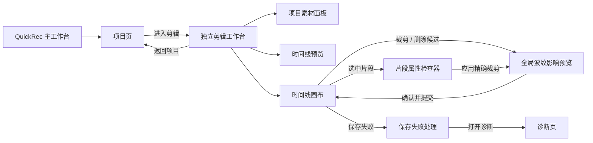
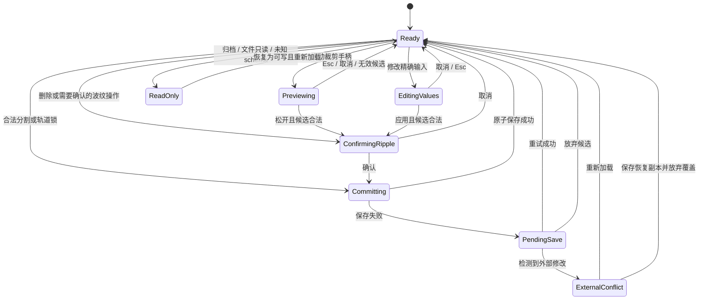
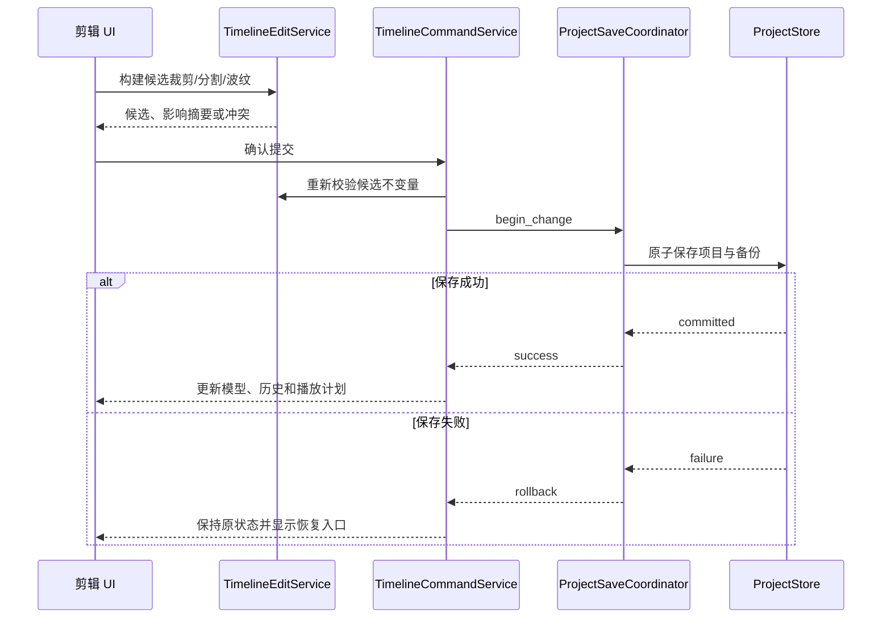
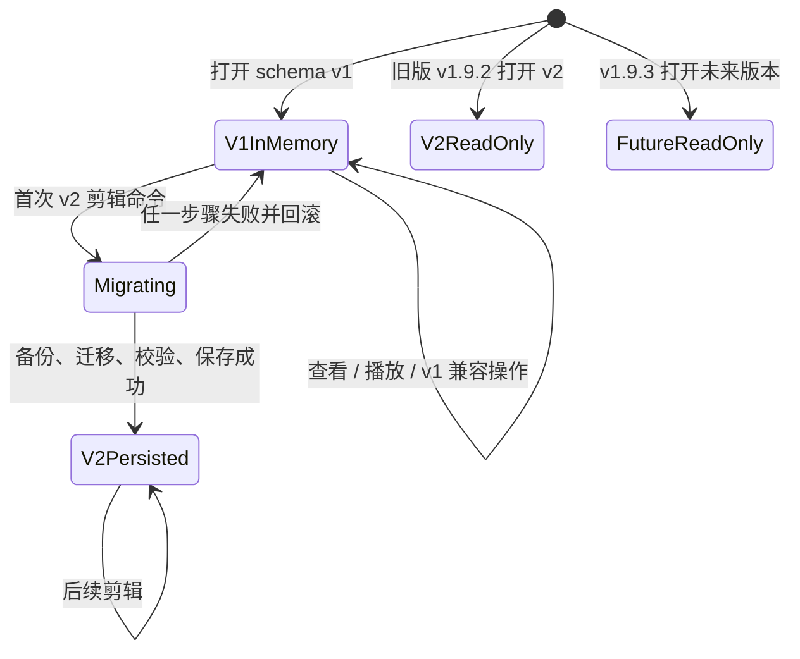

# QuickRec Full v1.9.3 产品需求文档

## 0. 追踪信息

| 项目 | 内容 |
| --- | --- |
| 产品 | QuickRec Full |
| 版本 | v1.9.3 |
| 版本主题 | 基础剪辑与内部自动化 CLI |
| 文档类型 | 正式推进型 PRD |
| 当前状态 | 已完成开发、验证和正式发布 |
| 编写日期 | 2026-07-28 |
| 发布前基线 | v1.9.2 |
| 当前正式分支 | `master` |
| 当前工作区 | `E:\codex\QuickRec` |
| 需求池 | `doc/archive/ideas/mypm-idea-pool-v1.9.3-2026-07-28.md` |
| 澄清记录 | `doc/releases/v1.9.3/clarification-record.md` |
| 直接上游 | `doc/releases/v1.9.2/` |
| 架构前置 | 已完成并独立验证；v2.0 治理文档不属于本版本发布提交 |
| 下游承接 | 高保真原型、技术 spike、`dev_plan.md`、`progress.md` |
| 代码回滚基线 | tag `v1.9.2` / `91ab91cba324658d9bfadb7016a31f8e4e380efb` |
| Lite 边界 | `E:\codex\QuickRec-Lite` 不属于本版范围，不得修改 |

### 0.1 入口判断

历史入口判断：`/prd`，正式推进型 PRD；当前需求已经完成开发与验收。

产品范围和主要数据合同已在澄清阶段确认。本文件将确认结果整理为可设计、可开发、
可测试和可验收的正式合同。发布收口结果如下：

- 高保真原型已输出、完成自动验证并由产品负责人确认；
- 非零源入点播放准确性技术门禁已通过；
- `QuickRecCLI.exe` frozen 形态已验证；
- D9 自动化与 D10 GUI/真实媒体验收均已通过。

产品负责人已于 2026-07-28 确认本 PRD，并于 2026-07-29 确认高保真原型。
开发承接确认和业务实现授权仍需单独取得。

### 0.2 上游决策变化

需求池通过压力测试后原本推荐“裁剪 + 分割 + 非波纹编辑”。产品负责人在 `/prd`
澄清过程中明确把正式范围升级为“裁剪 + 分割 + 全局波纹”。

该变化按以下原则处理：

1. 全局波纹是已确认产品决策，不再作为开放问题。
2. 需求池对其证据偏弱、成本高和爆炸半径大的判断仍然成立。
3. 范围升级不等于证据强度提升。
4. 本 PRD 必须将冲突预检、轨道锁、一次命令、原子保存、失败零副作用和真实 GUI
   验收设为发布硬门禁。
5. 技术或数据门禁失败时必须停下重新授权，不能静默回退为非波纹版本并宣称完成。

### 0.3 当前工程事实

v1.9.2 已经提供：

- 独立、默认最大化的剪辑工作台；
- 视频轨、音频轨、稳定 `track_id`、`clip_id`、`material_id` 和
  `link_group_id`；
- 整数微秒时间单位；
- 可播放多轨时间线和 PyAV 播放后端；
- 项目原子保存、备份、外部冲突保护和保存失败回滚；
- 50 步撤销和重做；
- 缺失素材重新定位和未知时间线版本只读保护。

首轮架构优化进一步提供：

- `RecordingGuard` 与 `TimelineMediaRuntime` 独立边界；
- `ProjectSaveCoordinator`；
- `SchemaMigrationRegistry`；
- 简单命令的增量历史和复杂命令的快照回退；
- 类型化录制完成事件；
- Full 单实例激活链路。

这些工程改动不是 v1.9.3 剪辑功能，不得与本版产品完成状态混淆。进入开发承接前，
应先把架构优化作为独立治理范围固定并验证。

## 1. 版本定位

### 1.1 一句话目标

让用户在 QuickRec 项目时间线中安全地裁剪素材头尾、按播放头分割内容，并通过固定的
全局波纹规则保持多轨编排连续，同时获得可自动验证、可打包运行的内部 CLI。

### 1.2 唯一产品主线

v1.9.3 只有一条产品主线：

> 项目时间线中的裁剪、分割和全局波纹基础剪辑闭环。

用户应能完成：

1. 通过片段边缘手柄粗调源入点和源出点。
2. 通过片段属性检查器精确输入源入点和源出点。
3. 在播放头所在的合法位置分割选中片段。
4. 对关联视频和音频执行原子裁剪、分割和删除。
5. 在提交前看见全局波纹影响范围与冲突。
6. 通过轨道锁控制哪些轨道不允许被编辑或波纹移动。
7. 撤销、重做并可靠保存每一个离散操作。
8. 关闭并重开项目后恢复相同剪辑结果。
9. 在素材缺失、项目只读、未知版本、保存失败或外部冲突时安全降级。
10. 使用现有播放链路准确预览非零源入点和分割边界。

### 1.3 工程支撑

本版最多保留两个工程支撑模块：

1. 独立内部自动化 `QuickRecCLI.exe`；
2. 剪辑职责最小拆分与受影响范围质量门禁。

工程支撑服务产品主线，不得扩大为公开 CLI、全局插件系统或全量架构重写。

### 1.4 版本成功定义

v1.9.3 只有同时满足以下条件才算成功：

1. 用户可以完成“裁剪 -> 分割 -> 波纹调整 -> 播放确认 -> 自动保存 -> 重开恢复”。
2. 关联视频与音频始终保持合法、同步、可撤销的原子关系。
3. 全局波纹只影响合同规定的片段，冲突时整体拒绝，不产生半成功状态。
4. 原始视频和中央素材库记录绝不因剪辑或时间线删除而被删除。
5. timeline schema v1 项目仅查看时不改写，首次成功剪辑时原子升级为 v2。
6. v1.9.2 回滚能够只读保留 v2 时间线和其他项目信息。
7. 非零源入点和分割边界在源码与 PyInstaller 包中满足视频、音频和同步门槛。
8. `QuickRecCLI.exe` 可以在隔离环境中提供稳定退出码、JSON 报告和真实媒体 smoke。
9. 保存失败不会留下 UI、内存、项目文件和历史栈不一致。
10. v1.9.2 的录制、素材、项目、播放、设置、诊断和 120 FPS 能力无发布阻塞回归。
11. QuickRec Lite 未修改。

### 1.5 v2.0 前路线

| 版本 | 产品目标 | 数据边界 |
| --- | --- | --- |
| v1.9.2 | 可播放多轨时间线 | 轨道、完整素材片段、播放事实 |
| v1.9.3 | 基础剪辑 | 局部源范围、分割身份、轨道锁和全局波纹结果 |
| v1.9.4 | 导出队列与完整链路 | 读取稳定时间线事实生成正式输出 |
| v2.0 | 完整工作台正式版 | 录制、素材、项目、剪辑和导出正式闭环 |

## 2. 背景与问题

### 2.1 当前限制

timeline schema v1 强制：

- `source_start_us == 0`；
- `source_duration_us` 等于完整素材时长；
- `timeline_duration_us == source_duration_us`；
- 每个片段必须覆盖完整素材。

因此当前时间线只能表达“把哪段完整素材放在哪里”，不能表达“实际使用素材的哪一段”。

### 2.2 需要解决的问题

#### P-193-01 无法清理素材头尾

用户无法在 QuickRec 内删除录制开始和结束阶段的无效内容，只能依赖外部编辑器。

#### P-193-02 无法提取素材中段

同一素材不能在不同源范围形成多个片段，无法从一段长录制中提取多个有效段落。

#### P-193-03 分割和关联音频存在身份风险

若视频和音频被单边分割，或新片段复用错误的 `clip_id` / `link_group_id`，播放和未来
导出会出现歧义。

#### P-193-04 全局波纹扩大一次操作的影响面

裁剪或删除会移动多条轨道上的后续片段。若不先预检锁定、交叉和保存冲突，一次操作
可能破坏整个项目编排。

#### P-193-05 schema v1 不能合法保存剪辑结果

直接在 schema v1 中写入非零源入点会被 v1.9.2 判定为损坏，而不是安全的未知版本。

#### P-193-06 播放查询正确不等于真实媒体边界准确

查询层已经计算 `source_start_us + 片段内偏移`，但现有真实媒体证据没有证明非关键帧
视频入点、音频采样入点和连续分割接缝满足剪辑精度。

#### P-193-07 自动验证入口分散

录制、探测、项目、时间线和真实媒体 smoke 由多个脚本分别承担，参数、隔离、退出码和
机器报告不统一，增加 CI、Agent 和发布验收成本。

## 3. 用户角色与核心场景

### 3.1 用户角色

| 用户 | 目标 | 本版价值 |
| --- | --- | --- |
| 教程创作者 | 删除片头片尾并切出讲解段落 | 不离开项目即可完成基础内容整理 |
| 演示录制者 | 保持视频和录音同步编辑 | 不需要手工修复关联音频 |
| 多轨编排用户 | 删除区间后保持后续内容连续 | 使用固定、可解释的全局波纹 |
| 开发与发布维护者 | 自动验证剪辑和候选包 | 使用隔离 CLI 获得机器可读证据 |
| v1.9.4 导出模块 | 读取明确的素材源范围 | 不需要重新猜测剪辑语义 |

### 3.2 核心场景

#### SC-193-01 粗调片头片尾

用户拖动片段左或右裁剪手柄。界面实时显示候选边界和波纹影响，松开后一次提交。

#### SC-193-02 精确输入源范围

用户在片段属性检查器输入 `HH:MM:SS.mmm`，查看归一化帧信息和影响摘要，点击“应用”。

#### SC-193-03 切出素材中段

用户把播放头移动到目标位置，选中片段并按 `Ctrl+B`。左片段保留原身份，右片段获得
新身份，关联视频和音频一起分割。

#### SC-193-04 全局波纹删除

用户删除一个关联片段组。系统先显示删除区间、受影响轨道和片段；确认后，所有未锁定
轨道上的后续片段按规则前移。

#### SC-193-05 锁定关键轨道

用户锁定轨道以避免误编辑。若波纹操作必须移动该轨道上的片段，操作在提交前被阻止并
定位冲突。

#### SC-193-06 保存失败后安全恢复

项目保存失败时，刚才的剪辑不进入正式模型和历史栈。用户可以重试保存、放弃候选或
打开诊断。

#### SC-193-07 旧项目延迟升级

用户打开和播放 v1 项目时文件哈希不变。第一次成功执行剪辑命令时，系统备份项目并
原子写入 timeline schema v2。

#### SC-193-08 内部自动验收

开发者或 CI 使用 `QuickRecCLI.exe` 在隔离目录验证媒体、项目、时间线和剪辑 smoke，
获得稳定 JSON 与证据文件，不启动托盘或工作台。

## 4. 领域词汇、事实源与不变量

### 4.1 术语

| 术语 | 定义 |
| --- | --- |
| 源范围 | 片段在原始素材中的 `[source_start_us, source_end_us)` |
| 时间线范围 | 片段在项目时间线中的 `[timeline_start_us, timeline_end_us)` |
| 裁剪 | 改变片段源入点、源时长和时间线时长，不改写原始媒体 |
| 分割 | 在一个合法时间点把一个片段实例拆为左右两个片段实例 |
| 关联组 | 共享 `link_group_id`、必须原子编辑的一对视频和音频片段 |
| 全局波纹 | 对全部未锁定轨道按统一区间移动后续片段 |
| 轨道锁 | 持久化的编辑保护；锁定轨道不允许直接编辑或被波纹移动 |
| 影响预览 | 提交前展示时间区间、时长变化、受影响对象和冲突的候选结果 |
| 离散命令 | 一次可撤销、可重做、可原子保存的编辑操作 |
| 待处理保存 | 候选项目未能落盘，新的编辑命令被冻结的状态 |
| timeline schema v2 | 允许局部源范围并持久化轨道锁的时间线扩展版本 |
| 内部 CLI | 供工程和验收使用、无 GUI、非公开产品承诺的控制台程序 |

### 4.2 事实源

1. 项目和时间线事实以当前有效 `project.qrproj` 为准。
2. 素材路径和媒体元数据优先来自中央素材索引。
3. 中央记录缺失时回退到项目素材快照。
4. 原始视频是只读媒体源，剪辑命令不得修改它。
5. 预览帧、解码缓存、CLI 证据和 UI 候选状态不是项目事实。
6. 撤销栈不跨进程持久化。

### 4.3 业务不变量

1. `clip_id` 在一个时间线内唯一。
2. `track_id` 在一个时间线内唯一。
3. 同一轨道片段不得重叠。
4. 不同轨道片段可以重叠。
5. `source_start_us >= 0`。
6. `source_duration_us > 0`。
7. `source_start_us + source_duration_us <= 素材时长`。
8. 正常速度下 `timeline_duration_us == source_duration_us`。
9. 关联组必须恰好包含同一 `material_id` 的一个视频片段和一个音频片段。
10. 关联组成员的源范围、时间线起点和时长必须相同。
11. 关联组不得单边裁剪、分割、删除、撤销或保存。
12. 锁定轨道不得被直接编辑或被波纹移动。
13. 一次用户操作只形成一次历史记录和一次原子保存。
14. 失败或取消不得改变项目文件、正式内存模型和历史栈。
15. 删除时间线片段不得删除素材记录或原始视频。

## 5. 方案收敛与优先级

### 5.1 范围选择

| 方案 | 内容 | 结论 |
| --- | --- | --- |
| 最小方案 | 仅边缘裁剪 | 只作为内部数据和交互里程碑，不是正式发布目标 |
| 原需求池推荐 | 裁剪 + 分割 + 非波纹 | 压力测试成本最平衡，但已被产品负责人升级 |
| 正式方案 | 裁剪 + 分割 + 全局波纹 | 进入 v1.9.3，采用更高数据和验收门禁 |
| 过大方案 | 再加入变速、转场、混音、导出或公开 CLI | 不进入本版 |

### 5.2 优先级

| 需求 | ID | 优先级 | 发布必需 | 说明 |
| --- | --- | --- | --- | --- |
| timeline schema v2 延迟迁移 | PRD-193-01 | P0 | 是 | 剪辑数据合法性的前提 |
| 非零源入点播放技术门禁 | PRD-193-02 | P0 | 是 | 正式 UI 实现前完成 |
| 关联音视频裁剪 | PRD-193-03 | P0 | 是 | 用户主链路 |
| 关联音视频分割 | PRD-193-04 | P0 | 是 | 用户主链路 |
| 全局波纹与影响预览 | PRD-193-05 | P0 | 是 | 已确认正式范围 |
| 轨道锁和冲突阻止 | PRD-193-06 | P0 | 是 | 全局波纹安全门禁 |
| 原子保存、撤销和失败回滚 | PRD-193-07 | P0 | 是 | 数据安全 |
| 异常、只读和重新定位 | PRD-193-08 | P0 | 是 | 既有体验保护 |
| 片段属性检查器 | PRD-193-09 | P0 | 是 | 精确编辑和影响确认 |
| 高保真原型 | PRD-193-10 | P0 | 是 | PyQt 实现前门禁 |
| 内部 `QuickRecCLI.exe` | PRD-193-11 | P1 | 是 | 工程支撑一 |
| 最小职责拆分与质量门禁 | PRD-193-12 | P1 | 是 | 工程支撑二 |
| 音视频分离 | PRD-193-13 | P2 | 否 | 仅保留数据边界 |

### 5.3 范围保护

以下能力不得通过“顺手实现”进入 v1.9.3：

- 波纹模式开关或非波纹正式模式；
- 变速、转场、滤镜和关键帧；
- 视频变换、画中画和透明度；
- 音量、静音、声像、淡入淡出和波形编辑；
- 解除音视频关联、独立裁剪音频和音频提取；
- 独立音频文件导入；
- 正式导出和导出队列；
- 公开 CLI 产品、Shell 集成和用户脚本兼容承诺；
- AI、字幕、摘要、标签和云同步；
- WGC 和新的高刷新率能力；
- 数据库或插件系统；
- QuickRec Lite 改动；
- 全量重写现有应用、工作台、编辑器或录制核心。

## 6. 信息架构与页面关系

### 6.1 页面结构

v1.9.3 不新增主工作台一级页面。基础剪辑继续在项目对应的独立剪辑工作台中完成。



### 6.2 剪辑工作台布局

沿用 v1.9.2 的默认最大化独立工作台：

- 顶部命令栏；
- 左侧可折叠项目素材区；
- 右上可调整预览区；
- 底部时间线区；
- 右侧可折叠片段属性检查器。

新增检查器后必须满足：

1. 不把精确编辑字段继续挤入时间线工具栏。
2. 检查器展开时预览和时间线仍保留最小可操作尺寸。
3. 960×640 下允许检查器覆盖式展开，但必须可明确关闭。
4. 默认最大化下采用稳定侧栏，不遮挡播放控制和关键时间线操作。
5. 素材区、预览/时间线分隔条和检查器均不得形成不可恢复布局。

### 6.3 窗口和关闭语义

- 主工作台和剪辑工作台继续允许同时存在。
- 关闭检查器只取消或放弃当前未提交输入，不关闭剪辑工作台。
- 关闭剪辑工作台时，如存在拖动候选或未应用输入，应先取消候选。
- 存在待处理保存失败时，关闭剪辑工作台必须提供重试、放弃候选或取消关闭。
- 关闭剪辑工作台停止播放并释放媒体资源，不退出 QuickRec。
- 只有托盘“退出 QuickRec”结束应用。

## 7. 编辑状态机



状态规则：

- `Previewing` 和 `EditingValues` 只持有候选数据，不写正式模型。
- `Committing` 期间禁用其他编辑命令和项目切换。
- `PendingSave` 期间冻结新的编辑命令。
- 播放可以在 `Ready` 和 `ReadOnly` 状态使用。
- 开始候选编辑时暂停播放；取消后保持原播放头，不自动继续播放。

## 8. 裁剪需求

### 8.1 片段选择

- 用户必须先选中一个视频片段或音频片段。
- 片段属于合法关联组时，选中任一成员代表选中整个关联组。
- 关联组损坏时显示“关联异常”，禁止裁剪并提供诊断入口。
- 素材缺失、项目只读、未知 schema 或存在待处理保存时禁用裁剪。

### 8.2 手柄裁剪

左右边缘分别提供可辨识的裁剪手柄：

1. 按下手柄后进入候选预览。
2. 拖动期间仅更新片段视觉宽度、源范围文本和波纹影响摘要。
3. 候选边界按源视频帧归一化。
4. 按住 Alt 只关闭磁性吸附，不关闭帧边界、源范围和最小时长校验。
5. 无效候选以红色边界和就近原因反馈，不允许提交。
6. 松开鼠标后显示波纹影响预览。
7. 用户确认后才进入原子命令。
8. 按 Esc 或在拖动期间取消，恢复操作前视觉状态。
9. 整次拖动最多形成一条撤销记录。

### 8.3 精确裁剪

片段属性检查器提供：

- 素材名称；
- 当前轨道；
- 时间线起点，只读；
- 源入点输入；
- 源出点输入；
- 有效时长，只读计算；
- 素材总时长；
- 关联状态；
- FPS 可信时的归一化源帧编号；
- 全局波纹影响摘要；
- “应用”；
- “取消”。

输入格式为 `HH:MM:SS.mmm`。规则：

- Enter 等同“应用”；
- Esc 等同“取消”；
- 输入未变化时“应用”禁用；
- 输入解析失败时就近显示错误；
- 源入点不得小于 0；
- 源出点不得大于素材时长；
- 源出点必须大于源入点；
- 有效时长必须满足最小时长；
- 关联片段使用同一源范围；
- “应用”前仍需展示波纹影响。

### 8.4 时间语义

- 左裁剪保持 `timeline_start_us` 不变。
- 右裁剪保持 `timeline_start_us` 不变。
- 裁剪更新：
  - `source_start_us`；
  - `source_duration_us`；
  - `timeline_duration_us`。
- 缩短后，原结束点与新结束点之间形成删除区间。
- 延长后，原结束点形成插入点。
- 后续片段按全局波纹规则前移或后移。
- 裁剪不修改原始媒体。

### 8.5 最小时长和精度

| 片段类型 | 最小时长 |
| --- | --- |
| 视频或关联音视频 | 至少一个完整、合法源视频帧 |
| FPS 缺失或不可信的视频 | 100 毫秒 |
| 音频 | 至少 20 毫秒并位于合法采样边界 |

持久化继续使用整数微秒。UI 的帧编号只用于显示和吸附，不成为项目主时间单位。

## 9. 分割需求

### 9.1 入口

同一分割动作提供三个入口：

- 时间线工具栏“在播放头处分割”；
- 片段右键菜单；
- 快捷键 `Ctrl+B`。

三个入口必须调用同一个命令，不得形成不同规则。

### 9.2 前置条件

- 已选中片段或合法关联组。
- 播放头位于片段有效内部。
- 左右结果均满足最小时长。
- 素材存在且可解析。
- 项目可写。
- timeline schema 受支持。
- 没有待处理保存或外部冲突。
- 播放已暂停。

不满足时按钮禁用，并通过工具提示或状态区说明原因。

### 9.3 身份规则

分割后：

- 左片段保留原 `clip_id`；
- 右片段生成新 `clip_id`；
- 左右片段继续引用同一 `material_id`；
- 左侧关联组保留原 `link_group_id`；
- 右侧关联组生成新 `link_group_id`；
- 无声视频只生成左右两个视频片段；
- 不增加强制父子片段字段。

### 9.4 时间和选择规则

- 分割本身不改变时间线总时长。
- 分割本身不移动后续片段。
- 左片段结束点和右片段开始点均为播放头。
- 两个片段源范围连续且无重叠。
- 分割后默认选中右片段或右关联组。
- 播放头保持原位置。
- 水平滚动、垂直滚动和缩放保持不变。
- 分割成功后刷新播放计划，但不自动开始播放。

### 9.5 边界反馈

- 播放头在片段边界时禁止分割。
- 距边界不足最小时长时禁止分割。
- 点击禁用入口不得静默无反应。
- 快捷键触发失败时在时间线状态区显示原因，不弹出重复模态框。

## 10. 全局波纹需求

### 10.1 固定模式

- v1.9.3 固定为全局波纹。
- 不提供波纹/非波纹开关。
- 时间线工具栏持续显示“全局波纹”状态。
- 状态工具提示说明：裁剪或删除会移动所有未锁定轨道上的后续片段。

### 10.2 轨道锁

每条轨道标题区提供锁定按钮：

- 默认解锁；
- 点击后锁定，再次点击解锁；
- 锁定状态写入 timeline schema v2；
- 锁定轨道禁止新增、移动、裁剪、分割和删除片段；
- 锁定轨道不能被全局波纹移动；
- 锁定/解锁是一条可撤销、可重做、可原子保存的离散命令；
- 只读项目显示锁定状态但不允许修改。

### 10.3 删除区间

删除片段或缩短片段时使用半开区间：

```text
[range_start_us, range_end_us)
```

- 删除关联片段组：区间为该组的完整时间线范围。
- 缩短片段：区间为新结束点到原结束点。
- 关联视频和音频是操作目标，不互相构成冲突。

对于所有未锁定轨道：

- `timeline_start_us >= range_end_us` 的片段左移区间长度；
- 进入、穿过或覆盖删除区间的其他片段构成冲突；
- 本版不自动裁剪或分割冲突片段。

### 10.4 插入点

延长片段时：

- 原结束点为 `insert_at_us`；
- 后续片段右移新增时长；
- 跨越插入点的其他片段构成冲突；
- 本版不自动分割跨越片段。

### 10.5 锁定冲突

若锁定轨道上存在本次波纹需要移动的片段，整个操作失败。

锁定轨道上没有受影响片段时，不阻止其他轨道的操作。系统不得为了完成波纹而临时解锁
轨道或忽略锁定状态。

### 10.6 影响预览

裁剪和删除提交前必须展示：

- 操作类型；
- 删除区间或插入点；
- 时间线总时长变化；
- 受影响轨道数量；
- 受影响片段数量；
- 关联片段数量；
- 锁定冲突；
- 区间交叉冲突；
- 可定位的冲突轨道名和片段名。

影响预览状态：

| 状态 | 用户操作 |
| --- | --- |
| 无冲突 | “确认”可用，“取消”可用 |
| 存在冲突 | “确认”禁用，可定位冲突，可取消 |
| 计算中 | 两个按钮保持稳定，“确认”禁用 |
| 计算失败 | 展示错误，允许取消和打开诊断 |

### 10.7 波纹不变量

一次全局波纹操作必须：

- 先在候选模型完整计算；
- 完整校验全部轨道和片段；
- 形成一条历史记录；
- 进行一次原子保存；
- 成功后一次更新 UI 和播放计划；
- 失败时正式状态零变化。

## 11. 删除片段

### 11.1 入口

- 时间线工具栏“删除片段”；
- 片段右键菜单；
- Delete 键。

三个入口进入同一全局波纹删除流程。

### 11.2 确认

每次删除都显示确认框，不提供“不再询问”：

- 片段或关联组名称；
- 删除时间区间；
- 关联片段数量；
- 波纹影响轨道和片段数量；
- “从时间线删除并波纹”；
- “取消”。

“取消”必须位于模态框最右侧或遵循当前 Windows 对话框一致顺序，并始终位于可视区域。

### 11.3 数据保护

删除成功后：

- 时间线片段和关联组被删除；
- 后续片段按波纹规则移动；
- 项目素材引用保留；
- 中央素材索引保留；
- 原始视频保留；
- 一次撤销可以完整恢复片段、位置和身份。

## 12. 保存、撤销、重做与外部冲突

### 12.1 命令边界

以下操作各形成一条离散命令：

- 一次手柄拖动释放；
- 一次精确输入应用；
- 一次分割；
- 一次全局波纹删除；
- 一次轨道锁定或解锁。

### 12.2 提交顺序



### 12.3 撤销和重做

- 历史上限继续为 50。
- 裁剪撤销恢复源范围、时长和全部波纹移动。
- 分割撤销恢复原片段和原关联组。
- 删除撤销恢复片段、身份和所有移动位置。
- 轨道锁撤销恢复锁定状态。
- 关联视频和音频必须同进同出。
- 每次撤销或重做也需要原子保存。
- 保存失败时历史栈保持在操作前。

### 12.4 保存失败

保存失败后：

- 正式内存模型保持上次成功状态；
- 项目文件保持上次成功状态；
- 选中状态回到操作前；
- 撤销和重做深度不变；
- 编辑进入冻结；
- 显示持续错误条；
- 提供“重试保存”“放弃本次修改”“打开诊断”。

重试必须提交同一个候选，不得重复执行波纹计算导致二次移动。

### 12.5 外部修改

检测到外部修改时：

- 禁止覆盖外部项目；
- 提供“重新加载外部版本”；
- 提供“保存恢复副本”；
- 提供“取消”；
- 恢复副本不能覆盖原项目；
- 用户处理前冻结新的编辑命令。

## 13. timeline schema v2

### 13.1 版本范围

- 项目顶层 `ProjectFile.schema_version` 继续为 1。
- 只升级 `ProjectFile.extensions["quickrec.timeline"].schema_version`。
- v1.9.3 当前时间线 schema 为 2。

### 13.2 v2 数据合同

沿用现有字段：

```text
Timeline:
  schema_version
  time_unit
  timeline_id
  tracks
  clips
  extensions

TimelineTrack:
  track_id
  kind
  name
  order
  locked
  extensions

TimelineClip:
  clip_id
  material_id
  track_id
  timeline_start_us
  timeline_duration_us
  source_start_us
  source_duration_us
  link_group_id
  extensions
```

新增正式字段：

- `TimelineTrack.locked: bool`，默认 `false`。

v2 不增加：

- 父片段或子片段字段；
- 变速；
- 画面参数；
- 音频参数；
- 导出状态；
- AI 元数据。

### 13.3 v1 到 v2 迁移

迁移规则：

1. 打开、查看和播放 schema v1 项目只在内存中读取，不写项目。
2. schema v1 中所有轨道在候选 v2 中设置 `locked=false`。
3. 原片段身份、素材身份、时间位置和完整源范围不变。
4. 未知字段、轨道/片段 `extensions` 和项目其他扩展原样保留。
5. 仍与 v1 兼容的轨道移动、重命名和排序不强制升级。
6. 第一次成功执行裁剪、分割、全局波纹删除或轨道锁时升级为 v2。
7. 升级前创建 `.bak`。
8. 迁移、校验和保存作为一个原子事务。
9. 迁移失败时原文件、内存和历史栈不变。

### 13.4 未知和回滚

- v1.9.3 遇到高于 v2 的时间线版本时只读保留原始扩展。
- v1.9.2 遇到 v2 时按未知版本只读，不得判定为空或覆盖。
- 回滚不得自动降级 v2 为 v1。
- v1.9.2 仍可读取项目名称和项目素材。
- 严重缺陷回滚时保留所有 `project.qrproj`、`.bak`、素材索引和原始视频。

### 13.5 迁移状态机



## 14. 异常、只读与素材恢复

### 14.1 缺失素材

- 保留片段、轨道、源范围和时间位置。
- 缺失片段禁止裁剪和分割。
- 缺失片段允许确认后执行全局波纹删除。
- 缺失片段显示历史素材名、范围和缺失状态。
- 重新定位成功后恢复所有引用同一 `material_id` 的片段。
- 重新定位不改变 `clip_id`、`link_group_id` 或剪辑范围。

### 14.2 关联异常

若关联组缺少成员、成员类型错误、素材不同或范围不一致：

- 整组进入只读恢复状态；
- 禁止单边编辑；
- 允许查看诊断；
- 允许从备份恢复；
- 不自动重建或猜测关联身份。

### 14.3 项目只读或归档

- 允许查看、播放、跳转和查看片段属性。
- 禁止裁剪、分割、删除、锁定和撤销重做。
- 所有禁用控件说明只读原因和恢复方式。

### 14.4 时间线损坏

- 项目素材页继续可用。
- 有有效备份时允许恢复。
- 无备份时保留损坏原始扩展，用户确认后可重建空时间线。
- 不得将损坏数据静默解释为空时间线。

## 15. 播放准确性技术门禁

### 15.1 门禁时点

高保真原型可以先完成，但正式剪辑领域和 PyQt 手势实现前，必须先完成非零源入点
真实媒体技术 spike。

技术 spike 未通过时：

- 停止正式剪辑 UI 实现；
- 记录真实根因和证据；
- 重新评估 PyAV 实现；
- 不临时引入第二播放后端；
- 不以静态 UI、方案 A 或无声裁剪冒充完成。

### 15.2 样本矩阵

必须覆盖：

- 带连续帧编号和时间码的视频；
- 带可测音频脉冲的 AAC；
- QuickRec 生成的 H.264/AAC MP4；
- QuickRec 生成的无声 H.264 MP4；
- 30、60 和 120 FPS；
- 中文和空格路径；
- 非关键帧源入点；
- 两个连续分割片段；
- 30 秒样本；
- 10 分钟样本；
- 损坏和缺失素材；
- 源码环境；
- 真实 PyInstaller 环境。

### 15.3 量化标准

| 指标 | 通过标准 |
| --- | --- |
| 首个视频帧误差 | 不超过一个源视频帧 |
| 分割接缝视频间隙 | 不超过一个源视频帧 |
| 明显重复帧 | 不允许 |
| 音频目标点之前内容 | 不超过 20 毫秒 |
| 音频接缝重叠或间隙 | 不超过 20 毫秒 |
| 音画绝对偏差 | 不超过 40 毫秒 |
| 10 分钟漂移增量 | 不超过 20 毫秒 |
| 随机跳转 | 不超过 500 毫秒 |
| 暂停响应 | 不超过 200 毫秒 |
| 项目切换资源释放 | 不超过 2 秒，无残留声音、线程或媒体子进程 |

### 15.4 证据

技术 spike 必须保存：

- 生成样本的命令和哈希；
- FFprobe 摘要；
- 目标入点和实际首帧；
- 音频脉冲目标和实际采样边界；
- 连续片段接缝分析；
- 30 秒和 10 分钟同步结果；
- 源码和 frozen 对照；
- CPU、内存、线程和子进程摘要；
- 通过、未通过和停止结论。

## 16. 片段属性检查器与控件合同

### 16.1 控件表

| 控件 | 触发条件 | 操作结果 | 成功反馈 | 失败反馈 | 禁用规则 |
| --- | --- | --- | --- | --- | --- |
| 左裁剪手柄 | 可写且选中有效片段 | 调整源入点和时长候选 | 显示候选范围与波纹影响 | 红色边界和原因 | 缺失、只读、播放中、待保存 |
| 右裁剪手柄 | 同上 | 调整源出点和时长候选 | 同上 | 同上 | 同上 |
| 源入点输入 | 检查器打开 | 编辑精确源入点 | 显示归一化值 | 就近格式/范围错误 | 只读或无片段 |
| 源出点输入 | 检查器打开 | 编辑精确源出点 | 显示归一化值 | 就近格式/范围错误 | 只读或无片段 |
| 应用 | 输入有合法变化 | 进入影响预览 | 保存后显示“已自动保存” | 保存失败条 | 无变化、无效或冲突 |
| 取消 | 存在未提交输入 | 恢复原值 | 检查器恢复正式状态 | 无 | 无候选时可保持可用 |
| 分割 | 选中片段且播放头合法 | 原子分割关联组 | 选中右片段，显示已保存 | 状态区显示失败原因 | 边界、只读、缺失、保存待处理 |
| 全局波纹状态 | 始终显示 | 展示固定模式说明 | 工具提示 | 无 | 不可切换 |
| 轨道锁 | 项目可写 | 锁定或解锁轨道 | 图标和状态立即更新 | 保存失败则回滚 | 只读、保存待处理 |
| 删除片段 | 选中片段 | 打开波纹删除确认 | 删除并显示已保存 | 冲突、保存失败 | 无选择、只读、冲突 |
| 撤销 | 历史非空 | 原子撤销最近命令 | 状态和选择恢复 | 保存失败保持原状态 | 历史为空、保存待处理 |
| 重做 | 重做栈非空 | 原子重做 | 状态和选择恢复 | 保存失败保持原状态 | 重做栈为空、保存待处理 |
| 定位冲突 | 存在冲突 | 滚动并高亮冲突对象 | 高亮轨道和片段 | 对象已变化时重新计算 | 无冲突 |
| 重试保存 | 存在待处理保存 | 重试同一候选 | 解除冻结并显示已保存 | 保留候选和错误 | 无待处理保存 |
| 放弃本次修改 | 存在待处理保存 | 回到上次成功状态 | 显示已放弃 | 无 | 无待处理保存 |
| 打开诊断 | 存在错误或用户主动查看 | 激活主工作台诊断页 | 诊断页打开 | 打开失败显示路径 | 无 |

### 16.2 文案原则

- 不使用“剪一下”“自动整理”等含糊文案。
- 全局波纹确认必须说明会移动其他轨道片段。
- 锁定冲突必须点名轨道和片段，而不是只写“操作失败”。
- 保存成功、媒体保存成功和项目保存成功不得混用。
- 禁用控件必须有工具提示或就近状态说明。

## 17. 高保真原型门禁

### 17.1 输出

新建：

```text
doc/releases/v1.9.3/prototype/index.html
doc/releases/v1.9.3/prototype/prototype-design.md
```

不得覆盖 v1.9.2 历史原型。

### 17.2 覆盖范围

原型至少覆盖：

- 正常剪辑工作台；
- 左右手柄裁剪预览；
- 精确裁剪检查器；
- 播放头分割；
- 全局波纹删除确认；
- 全局波纹缩短和延长影响；
- 轨道锁定；
- 锁定冲突；
- 交叉片段冲突；
- 撤销和重做；
- 保存失败；
- 外部修改；
- 素材缺失；
- 关联异常；
- 只读项目；
- 960×640；
- 默认最大化布局。

### 17.3 开发标注

原型默认显示真实产品界面，并提供“开发标注”开关。开启后，每个按钮、输入项、菜单、
状态入口和模态框操作必须就近说明：

- 触发条件；
- 操作结果；
- 成功反馈；
- 失败反馈；
- 禁用规则；
- 对应 `PRD-193-*` 需求 ID。

不得把按钮说明集中放在页面最前面，与实际控件脱离。

### 17.4 原型交互

原型必须可实际演示：

- 选中片段和展开检查器；
- 拖动两个裁剪手柄；
- 修改精确值并应用或取消；
- `Ctrl+B` 对应状态变化；
- 波纹影响摘要、确认和冲突阻止；
- 轨道锁定和解锁；
- 删除确认；
- 保存失败后的重试和放弃；
- 缺失、只读和关联异常状态；
- 预览区、时间线区和素材区调整。

### 17.5 确认和回写

- 产品负责人必须实际打开并确认原型。
- 至少验证一个 1920×1080 桌面视口和一个 960×640 最小窗口视口。
- 可运行原型需检查交互、控制台和页面错误。
- 原型发现的合同变化必须回写本 PRD 对应需求 ID。
- 原型未确认，不得进入 PyQt 正式实现。

## 18. 内部自动化 QuickRecCLI

### 18.1 定位

- 独立 `QuickRecCLI.exe`；
- 与 `QuickRec.exe` 同一分发目录；
- 用于开发、CI、Agent 自动验证、候选包检查和发布验收；
- 不启动托盘或任何 GUI；
- 不模拟按钮；
- 直接复用录制、媒体、项目、时间线和剪辑服务；
- 不作为普通用户的公开稳定 API。

### 18.2 最小命令

```text
QuickRecCLI doctor --json
QuickRecCLI record --mode fullscreen --duration <秒> --fps <值>
  --audio <none|system|mic|both> --workspace <路径>
  --evidence-dir <路径> [--json]
QuickRecCLI probe <video> --json
QuickRecCLI project validate <project.qrproj> [--json]
QuickRecCLI timeline validate <project.qrproj> [--json]
QuickRecCLI smoke --suite editing --workspace <路径>
  --evidence-dir <路径> [--json]
```

本版不公开 `trim`、`split`、`delete` 或 `ripple` 命令，避免形成第二套剪辑产品。

### 18.3 record 合同

- 只支持 `--mode fullscreen`。
- FPS 支持 30、60 和 120。
- 默认 FPS 为 30。
- 音频支持 `none`、`system`、`mic` 和 `both`。
- 默认音频为 `none`。
- 120 FPS 执行现有产品门禁。
- 音频设备不可用时明确失败或按测试配置跳过，不伪造成功。
- 录制后自动运行 FFprobe。
- JSON 报告流信息、实际 FPS、文件大小、哈希和证据引用。

### 18.4 隔离和安全

- 会修改状态的命令必须显式提供 `--workspace` 和 `--evidence-dir`。
- 缺少任一参数时以用法错误退出。
- 默认禁止读写真实 `%APPDATA%\QuickRec`。
- `smoke --suite editing` 必须复制输入项目到隔离工作区。
- 不修改输入项目。
- `probe`、`project validate` 和 `timeline validate` 默认只读。
- 不提供删除项目、删除素材、清空索引或覆盖输入项目命令。
- 超时、取消和失败后必须清理子进程与临时文件。
- 日志不得输出完整环境变量、硬件序列号或不必要的用户路径。

### 18.5 超时

| 命令 | 默认超时 |
| --- | ---: |
| `doctor` | 30 秒 |
| `probe` | 30 秒 |
| `project validate` | 30 秒 |
| `timeline validate` | 30 秒 |
| `record` | 请求录制时长 + 60 秒 |
| `smoke --suite editing` | 15 分钟 |

CLI 可以提供 `--timeout` 覆盖默认值。超时后退出码为 5，并保留已生成的诊断证据。

### 18.6 退出码

| 退出码 | 含义 |
| --- | --- |
| 0 | 成功 |
| 2 | 参数或用法错误 |
| 3 | 项目、时间线、媒体或硬件条件验证失败 |
| 4 | 依赖缺失 |
| 5 | 超时 |
| 6 | 取消 |
| 7 | 目录、权限或隔离环境错误 |
| 8 | 未处理的内部错误 |

### 18.7 JSON v1

`--json` 模式的标准输出只能包含一个完整 JSON 对象：

```json
{
  "schema_version": 1,
  "command": "timeline validate",
  "status": "success",
  "exit_code": 0,
  "started_at": "2026-07-28T00:00:00+08:00",
  "duration_ms": 123,
  "identity": {
    "product": "QuickRec Full",
    "version": "1.9.3",
    "frozen": true
  },
  "result": {},
  "errors": [],
  "evidence": []
}
```

规则：

- `status` 只使用 `success`、`failed`、`cancelled` 或 `timeout`。
- `exit_code` 与进程退出码一致。
- `errors` 中每项包含稳定错误类别、用户可理解消息和脱敏上下文。
- 非结构化日志进入标准错误流和证据目录。
- `evidence` 使用证据目录内相对路径或脱敏引用。
- 成功、失败、取消和超时保持同一顶层结构。

### 18.8 打包

- `QuickRec.exe` 与 `QuickRecCLI.exe` 共享 `_internal`。
- 共享 FFmpeg、FFprobe、PyAV 和必要运行库。
- CLI 随正式 ZIP 分发。
- 不为 CLI 创建桌面、开始菜单、托盘或工作台入口。
- Packaging smoke 必须确认 CLI 不创建 GUI、不读写真实用户目录。
- 记录新增 EXE 对压缩包体积的影响，避免重复打包同一依赖。

### 18.9 CLI 不替代

CLI 不能替代：

- 托盘和结果条；
- 区域或窗口框选；
- 裁剪手柄和确认弹窗；
- 三档 DPI 和视觉布局；
- 真实系统声音、麦克风和双音频听音；
- 候选包 GUI 手动验收。

## 19. 最小职责拆分

### 19.1 目标边界

| 模块 | 负责 | 不负责 |
| --- | --- | --- |
| `TimelineEditService` | 裁剪、分割、波纹、关联组、轨道锁冲突和候选模型 | 文件写入、Qt 控件、撤销栈 |
| `TimelineCommandService` | 只读检查、提交、原子保存、撤销重做和外部冲突 | 重复实现剪辑算法 |
| `TimelineTrimInteraction` | 手柄状态、吸附、候选预览和取消 | 写项目、生成最终身份 |
| `ClipInspectorWidget` | 精确输入、影响摘要、应用和取消 | 修改 JSON、实现波纹 |
| `TimelineCanvas` | 绘制、命中测试和意图事件 | 直接修改项目数据 |
| `TimelineEditorWindow` | 窗口、选择、播放、错误反馈和页面协调 | 剪辑领域不变量 |
| `QuickRecCLI` | 参数、协议、隔离和服务适配 | 复制录制或剪辑业务逻辑 |

### 19.2 与架构优化的关系

- 剪辑命令复用 `ProjectSaveCoordinator`。
- timeline schema v2 使用 `SchemaMigrationRegistry`。
- 裁剪和轨道锁等实体内变化优先使用增量历史。
- 分割和全局波纹等结构变化可先使用安全快照回退，再按证据优化。
- 播放资源继续由 `TimelineMediaRuntime` 管理。
- 不为 CLI 建立第二套事件和保存系统。

### 19.3 禁止重写

本版不得全量重写：

- `QuickRecApp`；
- `WorkbenchWindow`；
- `ProjectPage`；
- `MaterialLibraryDialog`；
- `TimelineEditorWindow`；
- `RecorderManager`；
- PyAV 播放后端。

## 20. 日志、诊断与隐私

### 20.1 日志事件

| 事件 | 必要字段 |
| --- | --- |
| 时间线迁移 | 项目 ID、源版本、目标版本、触发命令、结果 |
| 裁剪候选 | 命令类型、关联片段数、候选有效性、冲突类别 |
| 分割候选 | 片段类型、分割位置、关联片段数、结果 |
| 波纹预检 | 区间、受影响轨道数、受影响片段数、冲突类别 |
| 轨道锁 | 轨道类型、目标状态、结果 |
| 剪辑提交 | 命令类型、影响对象数量、耗时、结果 |
| 剪辑撤销/重做 | 命令类型、历史深度、结果 |
| 剪辑保存 | 阶段、耗时、结果、失败类别 |
| 播放边界 | 目标源时间、实际首帧/音频边界、结果 |
| CLI 执行 | 命令、frozen 身份、耗时、退出码、结果 |
| CLI 清理 | 子进程、临时文件和隔离目录清理结果 |

日志不得记录：

- 视频或音频内容；
- 项目描述全文；
- 完整环境变量；
- 硬件序列号；
- 非必要完整用户路径。

### 20.2 诊断导出

诊断应新增：

- timeline schema 版本与最近迁移结果；
- 最近剪辑命令类型和失败阶段；
- 最近波纹影响数量和冲突类别；
- 最近保存、撤销、重做结果；
- 非零源入点播放误差摘要；
- CLI 版本、frozen 身份和最近 smoke 结果；
- 媒体资源释放状态。

## 21. 影响范围

| 范围 | 影响 |
| --- | --- |
| 前端 / UI | 剪辑画布手柄、片段检查器、分割入口、波纹影响、轨道锁、确认和错误状态 |
| 前端状态 | 候选裁剪、精确输入、选中关联组、冲突、保存待处理和只读状态 |
| 服务层 | 新增剪辑候选变换，扩展命令事务、历史和播放计划刷新 |
| 数据 | timeline schema v2、轨道锁、局部源范围和身份规则 |
| 数据库 | 不涉及 |
| 项目存储 | 延迟迁移、备份、原子保存、未知字段保留和回滚 |
| 素材存储 | 只读提供素材时长、FPS、路径和状态，不写剪辑数据 |
| 配置 | 不新增普通用户剪辑配置；CLI 隔离参数不写用户配置 |
| 日志与诊断 | 新增剪辑、迁移、波纹、CLI 和边界精度上下文 |
| 权限与安全 | 本地项目读写；CLI 强制隔离；禁止删除原始媒体 |
| 文件 | `project.qrproj`、`.bak`、CLI 证据和受控样本 |
| 第三方依赖 | 继续使用 PyAV、PyAudio、FFmpeg、FFprobe，不主动增加第二媒体栈 |
| 打包 | 新增 `QuickRecCLI.exe`，共享现有 `_internal` |
| CI | schema、剪辑、CLI、真实媒体、Packaging 和增量覆盖率 |
| 既有体验 | 录制、素材库、项目、时间线播放、设置、诊断和 120 FPS 必须保持 |
| QuickRec Lite | 不涉及且不得修改 |

## 22. 性能与规模

继承 v1.9.2：

- 最多 8 条视频轨和 8 条音频轨；
- 标准 100 个片段；
- 标准时间线 30 分钟；
- 最多 50 步撤销和重做；
- 默认最大化；
- 最小 960×640；
- 100%、125% 和 150% DPI。

新增门禁：

| 指标 | 要求 |
| --- | --- |
| 手柄候选预览 P95 | 不超过 50 毫秒 |
| 100 片段单次编辑提交 P95 | 不超过 300 毫秒 |
| 100 片段原子保存 P95 | 不超过 300 毫秒 |
| 100 片段撤销或重做 P95 | 不超过 300 毫秒 |
| 100 次混合剪辑压力 | 无数据损坏、重叠或孤立关联组 |
| 波纹影响预检 | UI 不冻结，冲突结果稳定 |
| 超过 100 片段 | 尽力兼容，但不得损坏项目或删除媒体 |

## 23. 开发前验收与测试

### 23.1 验收目标

在实现前固定：

- 用户操作和全部退出路径；
- timeline schema v2；
- 全局波纹不变量；
- 关联音视频身份；
- 保存失败零副作用；
- 非零源入点播放容差；
- CLI 隔离、退出码和 JSON；
- 原型和候选包证据要求。

### 23.2 验证层级

| 层级 | 本版用途 | 阻塞范围 |
| --- | --- | --- |
| L0 静态 | PRD、数据合同、状态机、算法和测试设计 | 开发承接 |
| L1 Agent 预检 | 高保真原型、边界组合和错误路径 | PyQt 实现 |
| L2 真实操作 | 源码、真实媒体、候选包、GUI、CLI 和 DPI | 正式发布 |
| L3 目标用户 | 不作为个人项目首版实现前硬门禁 | 可进入后续 Beta |
| L4 发布后 | 错误、性能和真实使用反馈 | 后续迭代 |

进入开发授权：**未获得**。PRD 与原型确认后需再次取得明确授权。

### 23.3 自动化测试

至少覆盖：

- schema v1 打开不写；
- v1 首次剪辑升级 v2；
- v2 读取和往返；
- v1.9.2 回滚只读；
- 未来版本只读；
- 未知字段和其他 extensions 保留；
- 轨道 `locked` 默认值、持久化、撤销和重做；
- 左裁剪、右裁剪、延长和边界；
- 分割身份；
- 关联音视频原子裁剪和分割；
- 全局波纹删除、缩短和延长；
- 锁定冲突；
- 交叉区间和插入点冲突；
- 同轨不重叠；
- 最小时长和帧归一化；
- 无效候选零副作用；
- 保存失败、重试和放弃；
- 外部冲突；
- 50 步历史；
- 缺失、重新定位、只读和损坏；
- CLI 参数、退出码、JSON、超时和隔离；
- CLI 不启动 GUI；
- Packaging 中两个 EXE 和共享依赖。

### 23.4 真实媒体

必须使用非 mock 样本验证：

- 30、60、120 FPS；
- H.264/AAC 和无声 H.264；
- 中文和空格路径；
- 非关键帧源入点；
- 连续分割；
- 关联音视频；
- 30 秒和 10 分钟；
- 源码和 frozen；
- FFprobe 对照；
- 资源释放。

### 23.5 GUI 与 DPI

必须验证：

- 默认最大化和 960×640；
- 100%、125%、150% DPI；
- 手柄命中和拖动；
- 精确输入、应用和取消；
- 分割按钮、右键菜单和 `Ctrl+B`；
- 波纹影响预览；
- 锁定和交叉冲突；
- 删除确认；
- 撤销和重做；
- 保存失败；
- 缺失、关联异常和只读；
- 长素材名、长轨道名和中文路径；
- 8+8 轨、100 片段和 30 分钟；
- 工作台与剪辑工作台同时存在；
- 录制回归和媒体资源释放。

### 23.6 关键测试接缝

| 验收标准 | 可观察结果 | 接缝 / 故障注入点 | 证据 |
| --- | --- | --- | --- |
| 迁移不破坏 v1 | 打开前后哈希一致；首次剪辑后为 v2 | 迁移注册、项目存储 | JSON、哈希、备份 |
| 波纹原子性 | 全部位置正确或零变化 | 纯候选服务、保存协调器 | 前后项目 diff |
| 关联原子编辑 | 两成员范围一致 | link group 解析和校验 | 模型断言、播放 |
| 保存失败零副作用 | UI、内存、文件、历史均不变 | 原子写失败、权限、外部冲突 | 日志和前后快照 |
| 非零入点准确 | 视频一帧内，音频 20 ms 内 | PyAV decoder、时钟 | 帧/采样分析 |
| CLI 隔离 | 真实 APPDATA 哈希不变 | 环境与路径适配 | 前后哈希、JSON |
| CLI 超时 | 子进程退出、证据保留 | 可控慢依赖 | 退出码和进程表 |

### 23.7 质量门禁

- 项目总体语句覆盖率不低于 80%。
- 新增剪辑领域核心模块不低于 85%。
- 手势、检查器和页面协调模块不低于 80%。
- CLI 命令、隔离和 JSON 合同模块不低于 85%。
- 受影响模块通过 Ruff、Mypy、Compileall 和 `git diff --check`。
- UTF-8、乱码和文档链接检查通过。
- `master`、`test` 和 Pull Request 执行全量测试、Ruff、Mypy 和 Coverage。
- `test`、`master` 和 `v*` tag 额外执行 Packaging smoke。
- Packaging smoke 验证两个 EXE、FFmpeg、FFprobe、PyAV 和真实媒体。
- QuickRec Lite 保持未修改。

## 24. 发布阻塞条件

以下任一项失败均阻止 v1.9.3 发布：

1. 高保真原型未确认。
2. 非零源入点播放技术门禁未通过。
3. 全局波纹不变量或冲突预检失败。
4. 锁定轨道被意外移动或编辑。
5. 关联视频和音频出现单边修改、孤立身份或不同步。
6. schema v1 到 v2 迁移破坏旧项目或未知字段。
7. v1.9.2 回滚覆盖、清空或误判 v2 数据。
8. 保存失败导致 UI、内存、文件或历史不一致。
9. 剪辑或删除误删原始视频、项目素材引用或中央素材记录。
10. 真实媒体视频或音频边界超过容差。
11. 10 分钟音画同步超过门槛。
12. 候选包无法执行剪辑、播放或资源释放。
13. `QuickRecCLI.exe` 污染真实用户目录、创建 GUI 或违反 JSON/退出码合同。
14. 960×640 或三档 DPI 下关键控件不可操作。
15. v1.9.2 核心能力出现发布阻塞回归。
16. QuickRec Lite 被修改。

## 25. 风险与回退

### 25.1 风险

| 风险 | 等级 | 控制 |
| --- | --- | --- |
| 全局波纹移动错误对象 | 高 | 纯候选计算、影响预览、锁和交叉冲突硬阻止 |
| 一次波纹修改大量片段 | 高 | 单命令、原子保存、一次撤销和压力测试 |
| 非关键帧视频入点偏差 | 高 | 帧编号样本、源码/frozen 技术门禁 |
| 音频 seek 提前或残留 | 高 | 脉冲样本、20 ms 门槛、10 分钟同步 |
| v2 迁移破坏回滚 | 高 | 延迟迁移、备份、未知版本只读和字段往返 |
| 保存失败半成功 | 高 | 候选模型、保存协调器和失败零副作用 |
| 检查器挤压剪辑工作台 | 中高 | 可折叠、最大化和最小窗口原型门禁 |
| CLI 复制业务逻辑 | 中高 | 只做服务适配，不公开剪辑命令 |
| CLI 污染用户数据 | 高 | 修改命令强制隔离、真实 APPDATA 前后哈希 |
| 两个 EXE 增加包复杂度 | 中 | 共享 `_internal`，记录包体和 packaging smoke |
| 范围继续扩张 | 高 | 非目标和版本阻塞条件，不引入高级剪辑 |

### 25.2 代码回退

- 直接回滚点为 `v1.9.2`。
- 不移动或重写 `v1.9.2` tag。
- 剪辑领域、检查器、CLI 和 schema v2 应按模块独立接入。
- 技术 spike 可以在未进入生产依赖前独立丢弃。

### 25.3 数据回退

- 回滚前保留所有 `project.qrproj` 和 `.bak`。
- v1.9.2 以只读方式保留 timeline schema v2。
- 不删除或降级 `extensions["quickrec.timeline"]`。
- 不删除项目索引、素材索引、首帧缓存或原始视频。
- 严重缺陷时优先关闭剪辑写入口，保留查看、播放和诊断。

### 25.4 发布包回退

- 恢复 v1.9.2 正式包和 ZIP。
- `QuickRecCLI.exe` 随 v1.9.3 包整体移除。
- 不需要删除用户项目或视频。
- 回滚后 v2 时间线只读属于预期，不是数据丢失。

## 26. 追溯关系

| 上游 | 本 PRD |
| --- | --- |
| IDEA-193-001 | PRD-193-03、PRD-193-04、PRD-193-09 |
| IDEA-193-002 | 关联身份和原子编辑不变量 |
| IDEA-193-003 | PRD-193-01 |
| IDEA-193-004 | PRD-193-02 |
| IDEA-193-005 | PRD-193-11 |
| IDEA-193-006 | PRD-193-12 |
| 澄清记录第 7 节 | PRD-193-05、PRD-193-06 |
| v1.9.2 时间线合同 | 轨道、片段、播放、保存和回滚基线 |
| 架构优化实施记录 | 保存协调、迁移注册、媒体运行时和混合历史边界 |

## 27. 完整 PRD 门禁检查

- [x] 版本主题、唯一主线和工程支撑已写清。
- [x] 从入口到保存、取消、关闭、失败、重试和回滚的链路已写清。
- [x] 裁剪、分割、删除、锁定和全局波纹合同已写清。
- [x] 关联音视频身份和原子操作已写清。
- [x] timeline schema v2、迁移、未知版本和回滚已写清。
- [x] 播放准确性技术门禁和停止规则已写清。
- [x] CLI 命令、隔离、超时、退出码、JSON 和打包已写清。
- [x] UI 控件触发、结果、反馈和禁用规则已写清。
- [x] 原型路径、状态、交互和回写规则已写清。
- [x] 影响范围覆盖 UI、状态、服务、数据、配置、日志、权限、文件、打包和 CI。
- [x] 自动化、真实媒体、GUI、DPI 和候选包验收已写清。
- [x] 发布阻塞、风险、回退和非目标已写清。
- [x] 产品负责人已确认本 PRD（2026-07-28）。
- [x] 高保真原型已输出并确认（2026-07-29）。
- [x] 已获得进入开发承接的明确授权（2026-07-29）。
- [x] 已获得进入业务实现的明确授权（2026-07-29）。

## 28. 下一阶段

当前已通过高保真原型确认门禁，按以下顺序推进：

1. [已完成] 输出 `doc/releases/v1.9.3/prototype/` 高保真交互原型。
2. [已完成] 产品负责人实际打开并确认全部控件、状态和全局波纹交互。
3. [已完成] 回写原型确认状态；未发现需要改变 PRD 产品合同的差异。
4. 输出 `doc/releases/v1.9.3/dev_plan.md`。
5. 输出 `doc/releases/v1.9.3/progress.md`。
6. 获得进入实现阶段的明确授权。
7. 先执行 schema v2 与播放准确性技术门禁。
8. 技术门禁通过后，按里程碑实现剪辑领域、UI、CLI 和发布验收。

当前禁止：

- 不实现 v1.9.3 业务代码；
- 不生成 dev plan 或 progress；
- 不打包 v1.9.3 候选包；
- 不提交、不推送、不打 tag、不创建 Release；
- 不修改 QuickRec Lite。
