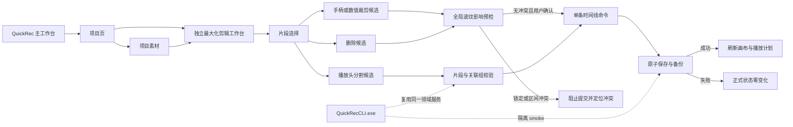

# QuickRec Full v1.9.3 高保真原型设计说明

## 1. 文档信息

| 项 | 内容 |
| --- | --- |
| 版本 | QuickRec Full v1.9.3 |
| 原型主题 | 基础剪辑、全局波纹与内部自动化边界 |
| 原型状态 | 已确认（2026-07-29） |
| 对应 PRD | `doc/releases/v1.9.3/prd.md` |
| 原型入口 | `doc/releases/v1.9.3/prototype/index.html` |
| 推荐入口参数 | `?page=projects` |
| 运行方式 | 本地 HTTP 服务，不依赖外部 CDN |
| 自动验证记录 | `doc/releases/v1.9.3/prototype/validation/README.md` |
| 实现边界 | 验证界面、交互、状态和数据合同，不代表 PyQt 剪辑能力已实现 |

## 2. 原型目标

本原型在 v1.9.2 独立剪辑工作台基础上验证 v1.9.3 的正式产品范围：

1. 用户能通过片段左右手柄调整源入点和源出点。
2. 用户能通过片段属性检查器进行精确裁剪。
3. 用户能在播放头位置分割视频及其关联音频。
4. 裁剪和删除始终执行全局波纹，不提供模式开关。
5. 用户提交波纹操作前能看到完整影响和冲突。
6. 每条轨道可锁定，锁定约束参与全局波纹预检。
7. 保存失败时项目、正式内存模型、撤销栈和播放计划保持原状态。
8. 所有控件都具有与实际控件关联的开发契约。

原型继续继承录制、素材库、项目、设置、诊断和 v1.9.2 播放时间线页面，确保新剪辑能力没有脱离完整产品链路。

## 3. 页面与服务关系



## 4. 剪辑工作台结构

```text
默认最大化的 Windows 顶级窗口
├── 项目命令栏
│   ├── 返回项目
│   ├── 项目名称
│   ├── 自动保存状态
│   ├── 素材工作台
│   ├── 开始录制
│   └── 关闭剪辑工作台
├── 状态横幅
├── 上半区
│   ├── 项目素材区
│   └── 可调整大小的时间线预览
├── 可拖动水平分隔条
└── 时间线编辑区
    ├── 撤销 / 重做
    ├── 播放头分割
    ├── 全局波纹删除
    ├── 固定“全局波纹”状态
    ├── 新增视频轨 / 音频轨
    ├── 片段摘要与属性检查器入口
    ├── 专注时间线 / 缩放 / 适配
    ├── 标尺、轨道、播放头和片段
    ├── 每轨锁定 / 重命名 / 删除
    ├── 片段双侧裁剪手柄
    └── 可收起的片段属性检查器
```

## 5. 核心控件合同

原型顶部“开发标注”开关会为所有带 `data-contract` 的控件显示编号。点击或聚焦控件后，右侧检查器展示：

- 触发条件；
- 操作结果；
- 成功反馈；
- 失败反馈；
- 禁用规则；
- 取消行为；
- 后端与数据影响。

这些说明与控件本身绑定，不在页面顶部另放一份脱离上下文的按钮清单。

### 5.1 时间线工具栏

| 控件 | 用户用途 | 关键结果 |
| --- | --- | --- |
| 撤销 | 撤销最近一次离散时间线命令 | 裁剪、分割、波纹和轨道锁均恢复完整状态 |
| 重做 | 重做最近撤销的命令 | 原子保存成功后更新正式状态 |
| 分割 | 在播放头处分割当前片段或关联组 | 左侧保留原身份，右侧生成新身份，总时长不变 |
| 删除片段 | 删除当前片段或关联组 | 先展示全局波纹影响，确认后移动所有未锁定轨后续片段 |
| 全局波纹 | 固定状态提示，不是切换按钮 | 明确 v1.9.3 不提供非波纹模式 |
| 视频轨 / 音频轨 | 新建同类型轨道 | 建立稳定轨道身份并原子保存 |
| 片段属性 | 打开精确裁剪检查器 | 载入源范围、有效时长和关联状态 |
| 专注时间线 | 收起素材与预览区 | 不改变项目、选择、播放头或时间线数据 |
| 缩小 / 放大 / 适配 | 调整时间线可视比例 | 只改变视图，不写项目 |

### 5.2 轨道标题区

| 控件 | 用户用途 | 关键结果 |
| --- | --- | --- |
| 拖动柄 | 调整同类型轨道顺序 | 视频轨顺序决定固定覆盖层级 |
| 轨道名 | 重命名轨道 | 保持 `track_id` 不变 |
| 锁定 | 锁定或解锁轨道 | 锁定轨禁止编辑，也不能被全局波纹移动 |
| 删除 | 删除轨道 | 不能删除最后一条同类型轨；含片段时必须确认 |

### 5.3 片段

| 控件 | 用户用途 | 关键结果 |
| --- | --- | --- |
| 片段主体 | 选择、跳到起点或拖动 | 关联音视频保持同步 |
| 左裁剪手柄 | 调整源入点 | 时间线起点保持，时长变化进入全局波纹预检 |
| 右裁剪手柄 | 调整源出点 | 缩短或延长片段，预检全部轨道 |
| Delete | 删除当前片段 | 与工具栏删除调用同一波纹命令 |
| `Ctrl+B` | 在播放头处分割 | 与工具栏分割调用同一命令 |

### 5.4 片段属性检查器

| 控件 | 用户用途 | 关键结果 |
| --- | --- | --- |
| 源入点 | 输入 `HH:MM:SS.mmm` | 校验非负、帧边界和关联组 |
| 源出点 | 输入 `HH:MM:SS.mmm` | 校验素材总时长、顺序和最小时长 |
| 应用 | 预览并提交精确裁剪 | 无变化或校验失败时禁用 |
| 取消 | 放弃候选并关闭 | 项目、画布、撤销栈和播放计划不变 |
| 关闭 | 与取消相同 | 不保留未应用输入 |

### 5.5 全局波纹影响预览

影响预览必须展示：

- 操作类型；
- 删除区间或插入点；
- 时间线总时长变化；
- 受影响轨道数量；
- 移动片段数量；
- 关联操作目标数量；
- 锁定冲突；
- 区间交叉冲突。

无冲突时允许确认；存在冲突时确认按钮禁用，并提供“定位首个冲突”。“取消”始终位于操作区最右侧。

## 6. 可演示交互

原型可实际演示：

1. 打开、关闭和再次打开剪辑工作台。
2. 主工作台与剪辑工作台前后台切换。
3. 调整视频预览与时间线高度。
4. 放大预览和专注时间线。
5. 选择片段并打开属性检查器。
6. 修改源入点或源出点并查看实时校验。
7. 点击“应用”查看全局波纹影响。
8. 拖动左右裁剪手柄并在松开后查看影响预览。
9. 在播放头处分割关联视频和音频。
10. 使用工具栏或 Delete 发起全局波纹删除。
11. 锁定轨道并观察编辑入口禁用。
12. 构造锁定冲突并定位首个冲突。
13. 展示保存失败并回滚状态。
14. 使用 `Ctrl+B`、`Delete`、`Ctrl+Z`、`Ctrl+Y` 和 `Esc`。

## 7. 原型状态

“页面状态”包含 v1.9.2 继承状态以及以下 v1.9.3 状态：

| 状态 | 用途 |
| --- | --- |
| 裁剪手柄操作中 | 检查候选范围、检查器和状态反馈 |
| 全局波纹影响预览 | 检查无冲突确认流程 |
| 全局波纹存在锁定冲突 | 检查冲突列表、禁用确认和定位入口 |
| 轨道锁定 | 检查锁定视觉和编辑禁用规则 |
| 剪辑保存失败并回滚 | 检查正式状态零变化与恢复入口 |

## 8. 数据边界

- 项目顶层 schema 继续保持 v1。
- 时间线扩展升级为 schema v2。
- 持久化时间单位继续使用整数微秒。
- v2 允许非零 `source_start_us` 和局部 `source_duration_us`。
- `TimelineTrack.locked` 是正式持久化字段。
- 分割左片段保留原 `clip_id`，右片段生成新 `clip_id`。
- 分割右侧关联音视频获得新的 `link_group_id`。
- 不强制增加父子片段字段。
- 未知字段、其他项目扩展和高版本时间线必须往返保留。
- 裁剪、分割、删除和锁定各形成一条离散命令。
- 播放头、选择、缩放、滚动和检查器开关不写项目文件。
- 原始媒体、中央素材索引和项目素材引用不因时间线删除而删除。

## 9. CLI 边界

原型不增加普通用户可见的 CLI 页面。页面关系图仅说明 `QuickRecCLI.exe` 与 GUI 复用同一领域服务。

最小命令：

```text
QuickRecCLI doctor --json
QuickRecCLI record --mode fullscreen --duration 3 --fps 60 --audio none
QuickRecCLI probe <video> --json
QuickRecCLI project validate <project.qrproj>
QuickRecCLI timeline validate <project.qrproj>
QuickRecCLI smoke --suite editing --evidence-dir <path>
```

CLI 不替代托盘、区域或窗口框选、DPI、真实听音和 GUI 手动验收。

## 10. 视觉与窗口规则

- 独立剪辑工作台默认最大化，但不使用独占全屏。
- 主工作台可以同时存在并继续录制。
- 视频预览保持完整宽高比，不裁切、不拉伸。
- 项目素材与时间线区域拥有独立滚动职责，外层工作台不产生双纵向滚动。
- 片段属性检查器默认关闭，按需覆盖时间线右侧，不永久挤压编辑空间。
- 960×640 下隐藏次要摘要、压缩“全局波纹”文字但保留图标和工具提示。
- 100%、125%、150% DPI 下关键按钮、手柄、确认框和检查器必须可见且可操作。
- 图标沿用现有统一线性图标系统，不使用 emoji 或字符图标。

## 11. 开发交接

### UI 层

- `TimelineEditorWindow` 负责窗口协调，不直接计算裁剪或波纹规则。
- `TimelineCanvas` 负责绘制、命中测试和候选手势，不直接写项目。
- 片段属性检查器是独立可测试组件。
- 波纹影响预览是候选模型的只读展示。

### 领域层

- 裁剪、分割、删除和轨道锁由专用编辑服务生成候选。
- `TimelineCommandService` 提交已经通过校验的离散命令。
- 关联音视频必须原子同进同出。
- 保存失败必须保持模型、历史和项目文件零副作用。

### 播放层

- 非零源入点播放必须先通过真实媒体技术门禁。
- UI 演示不能替代非关键帧视频、音频 seek 和长时同步证据。
- 技术门禁失败时停止实现，不允许以仅有界面的方案降级发布。

## 12. 原型验收清单

- [x] 继承 v1.9.2 独立、默认最大化的剪辑工作台。
- [x] 主工作台和剪辑工作台可同时存在。
- [x] 分割、波纹删除和固定波纹状态位于时间线工具栏。
- [x] 每条轨道具有锁定入口和锁定视觉。
- [x] 选中片段具有双侧裁剪手柄。
- [x] 片段属性检查器可打开、校验、应用、取消和关闭。
- [x] 全局波纹预览展示完整影响摘要。
- [x] 锁定冲突会禁用确认并可定位冲突。
- [x] 取消始终不修改正式时间线。
- [x] 分割保持播放头和总时长，并选中右片段。
- [x] 保存失败回滚状态可展示。
- [x] 每个新增按钮、输入、手柄和状态入口都有就近开发契约。
- [x] 1920×1080 视口无裁切、重叠和不可见操作。
- [x] 1216×760 常规窗口视口无裁切、重叠和不可见操作。
- [x] 960×640 最小视口仍可完成核心剪辑操作。
- [x] 键盘与鼠标演示无控制台错误。
- [x] 产品负责人已实际打开并确认（2026-07-29）。

## 13. 确认门禁

产品负责人确认原型后，才允许：

1. 回写原型发现的 PRD 合同变化；
2. 编写 v1.9.3 `dev_plan.md` 与 `progress.md`；
3. 执行 schema v2 和播放准确性技术 spike；
4. 技术门禁通过后实现正式 PyQt 剪辑与 CLI。

原型确认不等于技术门禁通过，也不等于 v1.9.3 已进入发布阶段。
