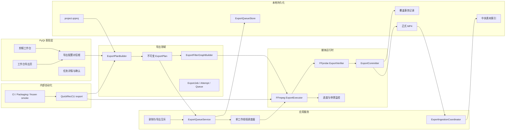

# QuickRec Full v1.9.4 开发计划

## 0. 追踪信息

| 项目 | 内容 |
| --- | --- |
| 目标版本 | QuickRec Full v1.9.4 |
| 版本主题 | 导出队列与完整链路验收 |
| 当前状态 | D10、D11 已完成，正式发布 |
| 发布前基线 | v1.9.3 |
| 代码回滚点 | tag `v1.9.3` / `bfa36435f8ba30bb00f0bbaf95e8cfc9b1e13b8b` |
| 当前工作区 | `E:\codex\QuickRec` |
| 当前分支 | `test` |
| 上游需求池 | `doc/archive/ideas/mypm-idea-pool-v1.9.4-2026-07-29.md` |
| 需求事实源 | `doc/releases/v1.9.4/prd.md` |
| 交互事实源 | `doc/releases/v1.9.4/prototype/` |
| 技术门禁 | `doc/releases/v1.9.4/export-technical-spike.md` |
| 状态事实源 | `doc/releases/v1.9.4/progress.md` |
| 开发日志 | `doc/releases/v1.9.4/dev_log.md` |
| 自动验证记录 | D10 新建 `doc/releases/v1.9.4/verification.md` |
| GUI 验收记录 | `doc/releases/v1.9.4/manual-verification.md` |
| 缺陷记录 | 发现真实缺陷时新建 `doc/releases/v1.9.4/bugfix-log.md` |
| PRD 确认 | 已获得（2026-07-29） |
| 原型确认 | 已获得（2026-07-29） |
| 开发前技术门禁 | D1 短样本门禁通过（2026-07-29） |
| 开发承接确认 | 已获得（2026-07-29） |
| 进入业务实现授权 | 已获得（2026-07-29） |
| Lite 边界 | `E:\codex\QuickRec-Lite` 不属于本版范围，不得修改 |
| 独立文档边界 | 现有 v2.0 架构与归属治理文档不得覆盖、撤销或混入本版提交 |
| 最后更新 | 2026-07-30 |

## 1. 执行基线

### 1.1 当前阶段

当前已完成 D2-D11，GUI、真实系统、长样本和回归证据均已闭合。

已完成：

1. v1.9.4 正式 PRD。
2. 高保真交互原型及 24 个关键状态。
3. FFmpeg 图、8 路音频和覆盖事务的开发前短样本技术门禁。
4. 当前工程、打包、CLI、时间线和素材入库能力审计。
5. 本开发计划和最小任务看板。

按 `progress.md` 的 D2-D11 顺序实施。每完成一个最小任务立即更新
checklist。技术决策与实施批次写入 `dev_log.md`，真实缺陷写入
`bugfix-log.md`，`progress.md` 不记录排查流水。

### 1.2 当前工程事实

| 对象 | 当前事实 | v1.9.4 处理 |
| --- | --- | --- |
| 时间线 | schema v2 已表达轨道、片段、源范围、裁剪、分割和波纹结果 | 只读转换为不可变 `ExportPlan` |
| 视频预览 | 最高有效视频轨全画面覆盖 | 导出沿用同一覆盖规则 |
| 音频预览 | 当前生产上限 4 路，固定增益 `0.25` | 升级为最多 8 路、活动源动态 `1/N` |
| 项目保存 | 原子保存、备份和恢复已存在 | 不把导出队列写入项目文件 |
| 素材入库 | 中央素材库已支持幂等入库基础 | 导出成功后独立入库，失败不改写导出成功 |
| 媒体工具 | source/frozen 均可定位随包 FFmpeg/FFprobe | GUI、CLI 和候选包复用同一解析器 |
| CLI | 独立 `QuickRecCLI.exe`、JSON v1、隔离目录和稳定退出码 | 增加 `export validate/smoke` |
| 打包 | GUI/CLI 共用 `_internal`，包含 FFmpeg、FFprobe 和 PyAV | 不新增媒体栈 |
| 质量门禁 | 总体 coverage 不低于 80%，已有 Ruff、Mypy、Compileall、Packaging | 扩展导出核心与 UI 协调门禁 |

### 1.3 技术门禁结论

| 门禁 | 当前结论 | 实现后仍需关闭 |
| --- | --- | --- |
| `H-194-01` FFmpeg 表达 schema v2 | 短样本通过 | 100 片段、真实源范围、损坏素材和长路径 |
| `H-194-02` 最多 8 路音频 | 解码、混合和导出图可行 | 生产上限、动态增益、真实听音、同步和资源释放 |
| `H-194-04` 覆盖事务 | 文件系统原语通过 | 正式事务日志、逐阶段故障注入和真实进程中断 |
| `H-194-05` 三档 30 分钟软件编码 | 已关闭 | RC4 1080p60、1080p120、4K60 长样本均通过 |

FFmpeg 8.0.1 的正式实现必须使用：

```text
-/filter_complex <UTF-8 滤镜图文件>
```

不得使用已弃用的 `-filter_complex_script`，不得把复杂图拼成单条 shell 字符串。

### 1.4 版本交付闭环

v1.9.4 必须交付：

1. 从已保存 timeline schema v2 构造不可变、可复现的 `ExportPlan`。
2. 单工作线程、持久化、可恢复的导出队列。
3. 支持最大 3840×2160 正偶数画布及 30/60/120 FPS；120 FPS 仅限不超过 1920×1080。
4. 最高视频轨覆盖、空白黑场、最多 8 路音频动态 `1/N` 混合。
5. 进度、预计时间、停滞检测、取消、失败诊断和手动重试。
6. FFprobe 验证后原子提交，默认不覆盖，显式覆盖可恢复。
7. 应用关闭、崩溃或系统重启后的确定性恢复。
8. 导出成功后自动加入中央素材库，入库失败可独立重试。
9. 工作台导出页、剪辑工作台导出入口及完整状态反馈。
10. `QuickRecCLI export validate/smoke` 与 frozen 候选包验证。

### 1.5 明确不做

- 并发导出；
- 暂停正在运行的 FFmpeg；
- 硬件编码和高级编码参数；
- 自定义任意画布、任意 FPS 或专业色彩管理；
- 转场、滤镜、关键帧、字幕和 AI；
- 云同步、数据库和远程队列；
- QuickRec Lite 改动；
- 全量重写 `QuickRecApp`、时间线、素材库或录制核心。

## 2. PRD 追溯与阶段映射

| PRD / 验收项 | 实施边界 | 阶段 | 主要证据 |
| --- | --- | --- | --- |
| `ACC-194-01` 创建计划 | 已保存项目到不可变计划、哈希和素材指纹 | D2 | fixture、哈希、并发编辑测试 |
| `ACC-194-02` 输出规格 | 正偶数画布、最大 4K、30/60/120 FPS 与 120 限制 | D2-D4、D10-D11 | FFprobe、候选包、长样本 |
| `ACC-194-03` 视频语义 | 最高轨覆盖、空白黑场、错误不穿透 | D3、D10-D11 | 抽帧、像素与 GUI |
| `ACC-194-04` 音频语义 | 最多 8 路、活动源 `1/N`、48 kHz 双声道 | D3、D10-D11 | FFT、听音、同步 |
| `ACC-194-05` 素材变化 | 指纹、运行前复核、明确失败 | D2、D4、D10 | 故障注入、日志 |
| `ACC-194-06` 持久队列 | 单线程、排序、暂停、重启恢复 | D6、D10-D11 | JSON、进程和 GUI |
| `ACC-194-07` 取消 | 安全终止、无正式结果、旧目标不变 | D4、D6、D10-D11 | 慢进程、文件哈希 |
| `ACC-194-08` 验证和提交 | FFprobe 通过后才提交和显示 100% | D4-D5、D10 | 容器、流和事务测试 |
| `ACC-194-09` 默认不覆盖 | 安全后缀，不覆盖既有文件 | D5、D8、D10-D11 | 前后哈希、GUI |
| `ACC-194-10` 显式覆盖 | 二次确认、回滚备份和崩溃恢复 | D5、D8、D10-D11 | 逐阶段故障注入 |
| `ACC-194-11` 磁盘风险 | 估算、1 GB 警告、200 MB 阻止 | D2、D4、D8-D11 | 阈值测试、GUI |
| `ACC-194-12` 重试 | 一次白名单自动重试和手动重试 | D4、D6、D8-D10 | 尝试历史、幂等测试 |
| `ACC-194-13` 入库 | 导出和入库状态独立，持久重试 | D7-D11 | 索引快照、GUI |
| `ACC-194-14` CLI | source/frozen 语义一致、隔离和 JSON | D9-D11 | CLI 报告、真实环境哈希 |
| `ACC-194-15` 长样本 | 30 分钟、100 片段、8 路和长路径 | D10-D11 | 候选包验收 |
| PRD 第 21 章 | 配置对话框、导出页和通知 | D8、D11 | Qt 测试、截图、DPI |
| PRD 第 22 章 | 日志、诊断和隐私 | D4、D6-D9 | 诊断导出、脱敏检查 |
| PRD 第 28 章 | 自动化、CI 和 Coverage | D3-D10 | 测试报告、CI、coverage |
| PRD 第 32 章 | 发布阻塞条件 | 发布判断 | D11 | 手动验收和发布清单 |

## 3. 目标架构



依赖规则：

1. `ExportPlanBuilder` 不导入 Qt、队列存储或 FFmpeg 子进程。
2. `ExportFilterGraphBuilder` 是确定性纯转换，不读取当前项目。
3. `ExportExecutor` 只消费计划和滤镜图，不修改计划或项目。
4. `ExportVerifier` 不提交文件，`ExportCommitter` 不执行编码。
5. `ExportQueueService` 不解释时间线，不拼 FFmpeg 参数。
6. UI 和 CLI 通过同一应用服务创建、校验和执行计划。
7. 队列、覆盖事务和中央素材索引分别持久化，不写入项目文件。
8. 录制与导出互斥由应用协调层统一判定，不在按钮回调中散落。

## 4. 预计新增和修改文件

### 4.1 新增导出领域

建议新增：

```text
src/exporting/__init__.py
src/exporting/models.py
src/exporting/plan_builder.py
src/exporting/filter_graph.py
src/exporting/executor.py
src/exporting/verifier.py
src/exporting/committer.py
src/exporting/queue_store.py
src/exporting/queue_service.py
src/exporting/ingestion.py
src/exporting/diagnostics.py
```

职责要求：

- `models.py` 只定义冻结模型、枚举、序列化合同和校验错误；
- `plan_builder.py` 只读取已保存项目并生成计划；
- `filter_graph.py` 只生成 UTF-8 滤镜图和参数模型；
- `executor.py` 管理 FFmpeg 生命周期、进度、取消和超时；
- `verifier.py` 负责 FFprobe 结果合同；
- `committer.py` 负责普通提交、覆盖事务和启动恢复；
- `queue_store.py` 负责版本化 JSON、备份和原子写；
- `queue_service.py` 负责状态机、调度、重试和恢复；
- `ingestion.py` 负责入库幂等与加入项目意图；
- `diagnostics.py` 负责本地任务诊断和隐私清洗。

### 4.2 UI

建议新增：

```text
src/ui/export_page.py
src/ui/export_dialogs.py
```

预计修改：

```text
src/ui/workbench_window.py
src/ui/timeline_editor_window.py
src/ui/workbench_pages.py
src/main.py
```

约束：

- 不把队列状态机写入 `WorkbenchWindow`；
- 不把计划构建和文件事务写入 `TimelineEditorWindow`；
- `QuickRecApp` 只负责创建服务、连接事件、互斥和退出协调；
- UI 关闭不终止运行任务，托盘退出必须执行明确退出流程。

### 4.3 预览一致性

预计修改：

```text
src/services/pyav_playback_backend.py
src/services/timeline_query.py
```

目标：

- 生产预览上限由 4 路提升到 8 路；
- 固定 `0.25` 改为按当前活动音频源数量使用 `1/N`；
- 0 路时保持静音，1 路时不衰减；
- 解码失败源不得参与增益分母；
- 播放、跳转、切换项目和退出时无残留解码器或声音。

### 4.4 配置、CLI、打包和 CI

预计修改：

```text
src/config.py
src/cli/main.py
src/cli/commands.py
build_std.spec
.github/workflows/ci.yml
pyproject.toml
```

为避免 `src/cli/commands.py` 继续膨胀，建议新增：

```text
src/cli/export_commands.py
```

### 4.5 测试

建议新增：

```text
tests/test_export_models.py
tests/test_export_plan_builder.py
tests/test_export_filter_graph.py
tests/test_export_executor.py
tests/test_export_verifier.py
tests/test_export_committer.py
tests/test_export_queue_store.py
tests/test_export_queue_service.py
tests/test_export_ingestion.py
tests/test_export_diagnostics.py
tests/test_export_page.py
tests/test_export_dialogs.py
tests/test_cli_export.py
tests/test_export_packaging.py
```

已有相关测试只做必要扩展，不复制相同断言。

## 5. 分阶段实施

## D0 基线、范围与授权

目标：固定事实源、回滚点、脏文件边界和实施分支。

实施：

1. 读取 PRD、原型、技术门禁、本计划和 progress。
2. 记录 Full 与 Lite 的分支、HEAD、tag 和 `git status`。
3. 确认 v1.9.3 tag 不移动。
4. 确认 v2.0 独立文档不混入 v1.9.4。
5. 在用户授权后按既有流程切换到 `test`，不新建 feature 分支。
6. 创建实现前基线测试记录。

验证：

```powershell
git status --short --branch
git tag --points-at HEAD
git -C E:\codex\QuickRec-Lite status --short --branch
```

完成条件：开发承接与实现授权明确，边界可追溯。

## D1 开发前技术门禁

目标：证明核心媒体语义和覆盖事务具有实现可行性。

状态：已完成。

证据：

```text
doc/releases/v1.9.4/export-technical-spike.md
E:\QRtest\QuickRec-v1.9.4-technical-gates
```

完成条件：`H-194-01`、`H-194-02`、`H-194-04` 的短样本门禁通过，
`H-194-05` 明确保留到候选包发布门禁。

## D2 不可变 ExportPlan 与预检

目标：从已保存项目稳定构造可执行、可复现且不可变的导出计划。

主要文件：

```text
src/exporting/models.py
src/exporting/plan_builder.py
tests/test_export_models.py
tests/test_export_plan_builder.py
```

实施：

1. 定义 `ExportPlan`、轨道、片段、素材快照、目标、输出规格和计划哈希。
2. 固定 plan schema v1，并拒绝未知版本执行。
3. 只读取已保存的 project/timeline schema v2。
4. 冻结素材路径、文件身份、大小、时间、必要哈希和媒体元数据。
5. 规范化正偶数画布、最大 3840×2160、30/60/120 FPS 和 120 FPS 画布限制。
6. 实现项目、时间线、素材、FFmpeg、FFprobe、目录、磁盘和目标冲突预检。
7. 实现默认安全后缀和显式覆盖目标指纹。
8. 保证项目后续编辑不改变既有计划。
9. 为 100 片段和中文、空格、长路径建立 fixture。

验证：

```powershell
python -m pytest tests/test_export_models.py tests/test_export_plan_builder.py -q
```

完成条件：

- 相同输入得到相同计划哈希；
- 计划冻结后项目变化不影响计划；
- 无效素材和目标在创建任务前被阻止；
- 构建计划不写项目、不写队列、不启动 FFmpeg。

## D3 滤镜图与预览/导出一致性

目标：用同一业务规则表达视频覆盖、黑场和最多 8 路音频混合。

主要文件：

```text
src/exporting/filter_graph.py
src/services/pyav_playback_backend.py
src/services/timeline_query.py
tests/test_export_filter_graph.py
tests/test_timeline_query.py
tests/test_timeline_playback_ui.py
```

实施：

1. 生成视频输入、源范围、时间线位置、任意合法画布缩放、补边和 FPS 规则。
2. 生成最高有效视频轨全画面覆盖规则。
3. 空白区输出黑场。
4. 高层视频损坏时失败，不穿透显示低层画面。
5. 生成最多 8 路音频、活动源动态 `1/N` 和统一限制器。
6. 升级 PyAV 预览至 8 路并复用同一增益规则。
7. 使用 UTF-8 图文件和 `-/filter_complex`。
8. 对 0、1、4、8 路音频分别验证。
9. 对中文、空格和长路径验证参数数组。

验证：

```powershell
python -m pytest tests/test_export_filter_graph.py tests/test_timeline_query.py tests/test_timeline_playback_ui.py -q
```

完成条件：

- 抽帧、FFT 和真实听音规则一致；
- 预览与导出均支持最多 8 路；
- 没有使用已弃用 FFmpeg 参数；
- 单个解码失败不会伪造有效输出。

## D4 Executor、Verifier、进度和取消

目标：安全执行 FFmpeg，验证临时结果并提供可解释进度和取消。

主要文件：

```text
src/exporting/executor.py
src/exporting/verifier.py
src/exporting/diagnostics.py
tests/test_export_executor.py
tests/test_export_verifier.py
tests/test_export_diagnostics.py
```

实施：

1. 使用参数数组启动随包 FFmpeg。
2. 解析 `-progress`，映射到 5%-95%。
3. 提供预计时间、阶段时间戳和停滞检测。
4. 120 秒提示停滞，300 秒执行受控终止。
5. 取消时先请求退出，再执行超时终止，始终回收子进程。
6. FFmpeg 成功后执行 FFprobe 容器、视频、音频、时长、FPS 和画布验证。
7. FFprobe 失败不得提交。
8. 运行前和提交前复核素材指纹。
9. 分类启动、超时、非零退出、验证失败、素材变化和磁盘错误。
10. 日志只保留必要脱敏路径与命令摘要。

验证：

```powershell
python -m pytest tests/test_export_executor.py tests/test_export_verifier.py tests/test_export_diagnostics.py -q
```

完成条件：

- 只有验证通过的临时文件能进入提交阶段；
- 取消、超时和失败后无残留 FFmpeg/FFprobe；
- 进度未提交前不显示 100%；
- 视频保存事实和后续入库事实保持独立。

## D5 原子提交与显式覆盖恢复

目标：普通提交和覆盖提交均不丢失用户既有文件。

主要文件：

```text
src/exporting/committer.py
tests/test_export_committer.py
```

实施：

1. 临时输出与正式目标位于同目录、同卷。
2. 默认不覆盖，目标存在时使用确定性安全后缀。
3. 显式覆盖记录目标指纹和二次确认。
4. 提交前再次核对目标身份。
5. 将旧目标原子移动到任务专属回滚备份。
6. 将已验证临时文件原子提交为正式目标。
7. 验证正式目标后再删除回滚备份。
8. 建立最小事务记录并在启动时优先恢复。
9. 对每个阶段执行故障注入。
10. 第三方目标变化时保留目标、临时文件和备份，停止自动处理。

验证：

```powershell
python -m pytest tests/test_export_committer.py -q
```

完成条件：

- 默认模式绝不覆盖；
- 显式覆盖成功只保留新目标；
- 任一中断阶段能恢复旧目标或确认新目标；
- 歧义状态不自动删除任何文件。

## D6 持久队列与单工作线程

目标：实现可恢复的单工作线程队列和完整状态机。

主要文件：

```text
src/exporting/queue_store.py
src/exporting/queue_service.py
tests/test_export_queue_store.py
tests/test_export_queue_service.py
```

实施：

1. 定义 queue schema v1、`ExportJob`、`ExportAttempt` 和入库子状态。
2. 实现版本化 JSON、备份、临时写、刷新磁盘和原子替换。
3. 实现排队、校验、运行、验证、提交、成功、失败、取消和中断状态。
4. 任一时刻只运行一个 FFmpeg。
5. 暂停队列只阻止启动后续任务。
6. 支持排队任务取消、运行任务取消和不可取消提交阶段。
7. 白名单瞬时故障最多自动重试一次。
8. 手动重试创建新 attempt，不修改旧 attempt。
9. 启动时先恢复覆盖事务，再恢复队列。
10. 运行中任务重启后映射为 `interrupted`，不自动重跑。
11. 未知未来 queue schema 只读显示摘要并暂停执行。
12. 实现容量、历史保留和原始成功文件保护。

验证：

```powershell
python -m pytest tests/test_export_queue_store.py tests/test_export_queue_service.py -q
```

完成条件：

- 重启前后状态和顺序一致；
- 任一时刻最多一个导出子进程；
- 损坏队列不会静默变为空；
- 重试、取消和恢复不产生重复提交。

## D7 配置、诊断、入库与录制互斥

目标：连接导出与现有配置、诊断、素材库和录制主流程。

主要文件：

```text
src/exporting/ingestion.py
src/config.py
src/main.py
src/utils/diagnostics.py
src/services/material_ingestion.py
tests/test_export_ingestion.py
tests/test_config.py
tests/test_diagnostics.py
tests/test_main_workflow.py
```

实施：

1. 持久化默认输出目录、规格和项目级偏好。
2. 导出配置失败不影响既有设置。
3. 导出成功后自动、幂等加入中央素材库。
4. 入库失败保持任务 `succeeded`，单独显示并持久重试。
5. “加入当前项目”由用户显式触发，不自动修改项目。
6. 诊断包含计划、尝试、工具版本、进度、失败、提交、回滚和入库摘要。
7. 诊断不包含完整隐私路径、环境变量或硬件序列号。
8. 录制和导出运行互斥，排队状态不阻止录制。
9. 开始录制时有运行导出则明确阻止并引导取消或等待。
10. 启动导出时有录制则明确阻止。
11. 应用退出提供继续后台、等待完成、取消任务或返回应用的明确语义。

验证：

```powershell
python -m pytest tests/test_export_ingestion.py tests/test_config.py tests/test_diagnostics.py tests/test_main_workflow.py -q
```

完成条件：

- 入库失败不改写导出成功；
- 录制和导出不并行争抢编码资源；
- 配置、诊断和项目均无破坏性写入；
- 回滚 v1.9.3 时忽略但保留队列目录。

## D8 工作台和剪辑工作台 UI

目标：实现原型确认的导出入口、配置、队列和任务详情。

主要文件：

```text
src/ui/export_page.py
src/ui/export_dialogs.py
src/ui/workbench_window.py
src/ui/timeline_editor_window.py
src/ui/workbench_pages.py
tests/test_export_page.py
tests/test_export_dialogs.py
tests/test_workbench_window.py
tests/test_timeline_editor_window.py
```

实施：

1. 工作台新增“导出”一级页面。
2. 剪辑工作台提供“导出项目”入口。
3. 两个入口打开同一配置对话框并生成同一计划。
4. 配置对话框覆盖规格、目录、文件名、覆盖策略、估算和预检。
5. 显式覆盖执行二次确认。
6. 导出页展示队列、状态、进度、阶段、预计时间、入库状态和诊断。
7. 提供取消、重试、打开文件、打开目录、加入项目和入库重试。
8. 禁用规则与 PRD 状态机一致。
9. 工作台可关闭隐藏，运行任务继续。
10. 100%、125%、150% DPI 下无裁切、重叠、溢出或不可点击控件。
11. 所有按钮使用一致图标、文案、tooltip 和无障碍名称。

验证：

```powershell
python -m pytest tests/test_export_page.py tests/test_export_dialogs.py tests/test_workbench_window.py tests/test_timeline_editor_window.py -q
```

完成条件：

- 原型全部关键状态在 PyQt 中可达；
- UI 不直接修改队列 JSON 或执行 FFmpeg；
- 重复打开复用同一页面和任务状态；
- 长项目名、中文路径和最小窗口可用。

## D9 CLI、Packaging 与 frozen 语义

目标：让 GUI、CLI 和候选包复用同一导出合同。

主要文件：

```text
src/cli/export_commands.py
src/cli/main.py
src/cli/commands.py
build_std.spec
.github/workflows/ci.yml
tests/test_cli_export.py
tests/test_export_packaging.py
tests/test_packaging_config.py
```

实施：

1. 增加 `export validate`。
2. 增加 `export smoke`。
3. 复用正式 Builder、Executor、Verifier 和 Committer。
4. 输出稳定 JSON schema、退出码、阶段和失败类别。
5. 默认使用独立 APPDATA、输出和证据目录。
6. 默认不覆盖，不提供无确认的破坏性操作。
7. 报告 source/frozen 身份、EXE 和媒体工具哈希。
8. Packaging 验证两个 EXE、FFmpeg、FFprobe 和 PyAV。
9. frozen smoke 使用真实中文和空格路径。
10. CI 在 `test`、`master`、PR 和 release tag 执行对应门禁。

验证：

```powershell
python -m pytest tests/test_cli_export.py tests/test_export_packaging.py tests/test_packaging_config.py -q
python -m pytest -m packaging -q
```

完成条件：

- source/frozen 输出语义一致；
- frozen CLI 可完成真实短样本导出；
- 真实 `%APPDATA%\QuickRec` 前后哈希不变；
- 打包不复制第二套媒体运行时。

## D10 自动化、覆盖率和候选包

目标：完成发布前自动门禁并锁定候选包身份。

执行：

```powershell
python -m pytest tests/test_export_models.py tests/test_export_plan_builder.py tests/test_export_filter_graph.py tests/test_export_executor.py tests/test_export_verifier.py tests/test_export_committer.py tests/test_export_queue_store.py tests/test_export_queue_service.py tests/test_export_ingestion.py tests/test_export_page.py tests/test_export_dialogs.py tests/test_cli_export.py -q
python -m pytest -m "not hardware and not packaging" -q
python -m pytest -m packaging -q
python -m ruff check src tests scripts
python -m mypy
python -m compileall -q src tests scripts
git diff --check
```

覆盖率门禁：

- 项目总体语句覆盖率不低于 80%；
- Plan、Graph、Queue、Store 和 Committer 不低于 90%；
- Executor、Verifier、Ingestion 和 CLI 导出不低于 85%；
- UI 协调模块不低于 80%。

候选包要求：

1. 使用独立 dist/work 目录构建。
2. 记录分支、HEAD、命令、时间、大小和 SHA256。
3. 包内 FFmpeg/FFprobe 版本与技术门禁一致。
4. frozen CLI 完成 validate 和短样本 smoke。
5. 旧稳定产物不被覆盖。

完成条件：所有自动门禁通过，候选包身份唯一且可复现。

## D11 GUI、长样本、回归与发布判断

目标：基于锁定候选包完成真实桌面和发布阻塞验收。

必测：

1. 工作台与剪辑工作台创建任务。
2. 30/60/120 FPS 和自定义合法画布短样本，至少覆盖 1080p60、1080p120、4K60。
3. 1080p60、1080p120、4K60 三个代表规格的 30 分钟真实项目。
4. 100 片段、最多 8 路音频、中文和长路径。
5. 队列顺序、暂停、关闭工作台、应用重启和系统重启恢复。
6. 运行取消、停滞、自动重试、手动重试和失败诊断。
7. 默认不覆盖、显式覆盖及每阶段恢复。
8. 入库成功、入库失败和持久重试。
9. 录制与导出互斥。
10. 100%、125%、150% DPI。
11. v1.9.3 录制、素材、项目、预览、剪辑、设置、诊断和 CLI 回归。
12. QuickRec Lite 工作区未修改。

精度门槛：

- 输出时长误差不超过一帧；
- 音画绝对偏差不超过 40 毫秒；
- 30 分钟漂移增量不超过 40 毫秒；
- 任务完成后无残留 FFmpeg/FFprobe；
- 取消、失败、中断和覆盖恢复后文件系统状态可解释。

完成条件：

- `ACC-194-01` 至 `ACC-194-15` 全部有真实证据；
- `H-194-05` 关闭；
- 发布阻塞项为零；
- 用户确认可以进入发布收口。

## 6. 测试策略

### 6.1 测试分层

| 层级 | 重点 | 不允许替代 |
| --- | --- | --- |
| 纯领域单测 | 计划、哈希、滤镜图、状态机、事务决策 | 不用 GUI smoke 替代 |
| 服务集成 | FFmpeg、FFprobe、队列存储、入库、恢复 | 不只 mock 子进程成功 |
| frozen 集成 | 随包工具、中文路径、两个 EXE | 不用源码结果替代 |
| GUI 自动化 | 状态、按钮、禁用、关闭和 DPI | 不用代码阅读替代 |
| 真实媒体验收 | 画面、音频、长时同步和文件系统 | 不用纯色短样本替代长样本 |
| 人工验收 | 覆盖确认、真实听音、系统重启和通知 | 不用 pytest 结果替代 |

### 6.2 故障注入

必须支持受控注入：

- FFmpeg 不存在、不可执行、启动失败、非零退出和停滞；
- FFprobe 不存在、超时、非零退出和损坏 JSON；
- 源素材运行前变化、运行中变化和删除；
- 队列写入失败、备份恢复和未来 schema；
- 磁盘空间低、输出目录不可写和提交失败；
- 覆盖事务每个原子步骤中断；
- 中央素材库写入失败和恢复后重试。

所有故障注入必须使用隔离目录，并在结束后恢复权限、依赖和进程。

## 7. 风险与控制

| 风险 | 等级 | 控制 |
| --- | --- | --- |
| 100 片段滤镜图过长或生成错误 | 高 | 使用 UTF-8 图文件、纯构建器和真实压力 fixture |
| 8 路音频预览与导出不一致 | 高 | 统一 `1/N` 规则、FFT、听音和长时同步 |
| 显式覆盖导致原文件丢失 | 最高 | 事务记录、同卷原子替换、逐阶段故障注入 |
| 队列损坏被静默当空 | 高 | 备份恢复、未知版本只读、错误状态 UI |
| 录制与导出争抢编码资源 | 高 | 应用级互斥，不依赖按钮禁用 |
| 4K60/1080p120 软件编码不可交付 | 高 | `H-194-05` 长样本硬门禁，失败返回产品决策 |
| 取消留下子进程或临时文件 | 高 | 分阶段终止、进程句柄等待和清理审计 |
| 入库失败误报导出失败 | 中 | 独立状态、幂等键和单独重试 |
| UI 协调类继续膨胀 | 中 | 新建导出页和服务，禁止领域逻辑进入窗口类 |
| CLI 与 GUI 语义分叉 | 中 | 共用 Builder/Executor，source/frozen 合同测试 |

## 8. 回滚策略

### 8.1 代码

- 固定回滚点为 tag `v1.9.3`，不得移动或重写。
- v1.9.4 实施提交按领域、运行时、队列、UI、CLI 和发布门禁拆分。
- 不使用破坏性 Git 命令撤销用户现有未提交文件。

### 8.2 项目文件

- v1.9.4 不升级项目 schema，不写时间线。
- `ExportPlan` 和队列存储在独立应用数据目录。
- 回滚 v1.9.3 后项目仍可正常打开和编辑。

### 8.3 队列与输出

- v1.9.3 忽略但不得删除 v1.9.4 队列目录。
- 已成功导出的 MP4 是普通本地文件，回滚不删除。
- 回滚前必须先完成或安全中断覆盖事务。
- 歧义覆盖状态保留全部文件，交由诊断和人工处理。

### 8.4 配置

- 新增配置必须有默认值并容忍旧版本忽略。
- 回滚可能忽略导出偏好，但不得影响项目、素材、录制或已导出文件。

## 9. 提交与发布边界

本计划不执行提交、推送、tag 或 Release。

获得实现授权后的建议提交拆分：

1. `feat(v1.9.4): add immutable export plan and media graph`
2. `feat(v1.9.4): add recoverable export queue and file commit`
3. `feat(v1.9.4): integrate export workflow and material ingestion`
4. `feat(v1.9.4): add export UI and internal CLI automation`
5. `test(v1.9.4): close export quality and packaging gates`
6. `docs(v1.9.4): finalize verification and release records`

不得混入：

- QuickRec Lite；
- v2.0 架构审计、归属治理或未来 AI 设计；
- 新的高刷新率、WGC 或硬件编码；
- 与导出无关的重构。

## 10. 开发承接确认点

进入 D2 前必须同时满足：

- [x] PRD 已确认。
- [x] 高保真原型已确认。
- [x] 开发前短样本技术门禁已通过。
- [x] `dev_plan.md` 已输出。
- [x] `progress.md` 已输出。
- [x] 用户确认开发承接文档。
- [x] 用户明确授权进入业务实现。
- [x] 实现前 Full/Lite Git 状态已重新记录。
- [x] 实施分支已按既有 `test -> master` 流程确认。

最终执行结果：D2-D11 已完成；RC8 GUI、真实桌面、系统恢复、DPI 和回归
证据均已闭合。
