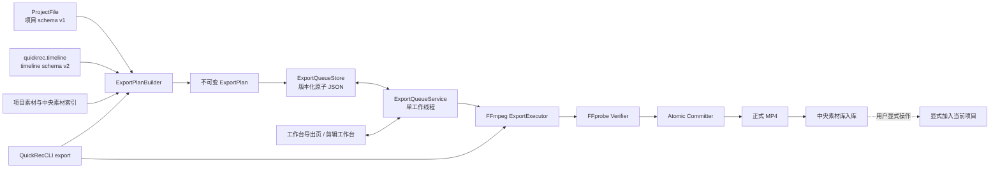
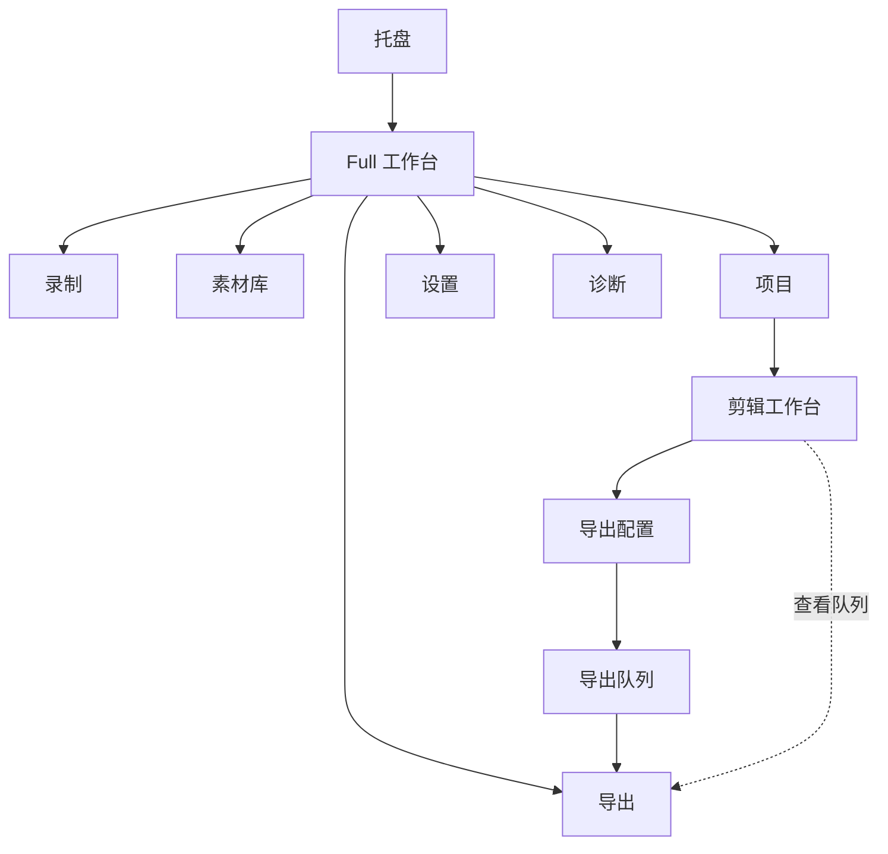
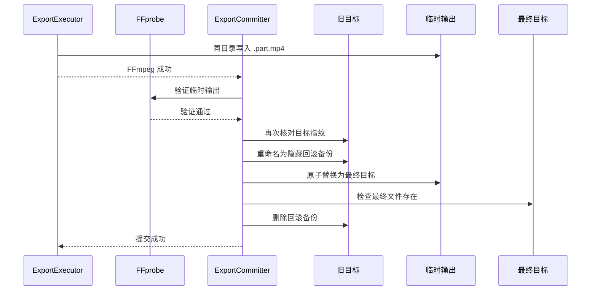
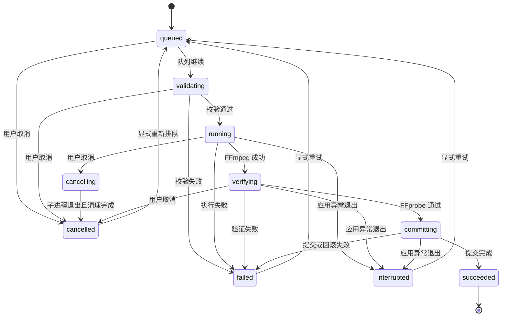

# QuickRec Full v1.9.4 产品需求文档

## 0. 追踪信息

| 项目 | 内容 |
| --- | --- |
| 产品 | QuickRec Full |
| 版本 | v1.9.4 |
| 版本主题 | 导出队列与完整创作链路 |
| 文档类型 | 正式推进型 PRD |
| 当前状态 | PRD、原型、开发、自动化与 D11 验收已完成，正式发布 |
| 编写日期 | 2026-07-29 |
| 发布前基线 | v1.9.3 |
| 当前基线提交 | `bfa36435f8ba30bb00f0bbaf95e8cfc9b1e13b8b` |
| 当前基线 tag | `v1.9.3` |
| 当前工作区 | `E:\codex\QuickRec` |
| 上游需求池 | `doc/archive/ideas/mypm-idea-pool-v1.9.4-2026-07-29.md` |
| 直接上游 | `doc/releases/v1.9.3/` |
| 下游承接 | 高保真原型、技术门禁、`dev_plan.md`、`progress.md` |
| 当前事实源 | 本 PRD；进入开发后由本 PRD、dev plan 和 progress 分别承接范围、实施与状态 |
| 代码回滚基线 | tag `v1.9.3` / `bfa36435f8ba30bb00f0bbaf95e8cfc9b1e13b8b` |
| Lite 边界 | `E:\codex\QuickRec-Lite` 不属于本版范围，不得修改 |

### 0.1 入口判断

历史入口判断：`/prd`。本文件是 v1.9.4 的正式推进型 PRD。

需求澄清已经完成，产品范围、任务快照、输出规则、持久队列、覆盖保护、失败恢复、
结果入库、CLI、原型和发布门禁均已形成明确合同。

高保真交互式 HTML 原型已经输出、通过自动验证，并于 2026-07-29 获得产品负责人确认。
FFmpeg 图、8 路音频和显式覆盖事务的开发前短样本技术门禁已经通过，证据见
`export-technical-spike.md`。`dev_plan.md` 与 `progress.md` 已输出并确认，D2-D10
实现与自动化门禁已经完成，当前处于 D11 候选包人工验收阶段。

产品负责人已于 2026-07-29 确认本 PRD。高保真原型确认前不得进入开发承接。
本文不代表功能已经实现、验证或发布。

### 0.2 上游 IDEA 追踪

| 上游 ID | 本 PRD 承接 | 结论 |
| --- | --- | --- |
| `IDEA-194-001` | 单工作线程持久导出队列 | 进入正式范围 |
| `IDEA-194-002` | 不可变 `ExportPlan` | 进入正式范围 |
| `IDEA-194-003` | 受控自定义画布与 30/60/120 FPS | 进入正式范围 |
| `IDEA-194-004` | 固定视频覆盖与最多 8 路音频 | 进入正式范围并设技术门禁 |
| `IDEA-194-005` | 素材缺失、损坏和变化预检 | 进入正式范围 |
| `IDEA-194-006` | 临时输出、FFprobe 验证和原子提交 | 进入正式范围 |
| `IDEA-194-007` | 状态机、取消、重试和重启恢复 | 进入正式范围 |
| `IDEA-194-008` | 工作台与剪辑工作台导出入口 | 进入正式范围 |
| `IDEA-194-009` | 成功结果入库 | 仅自动加入中央素材库；加入项目需显式操作 |
| `IDEA-194-010` | 长项目、八路音频与路径门禁 | 正式发布硬门禁 |
| `IDEA-194-011` | `QuickRecCLI export validate/smoke` | 进入工程支撑 |
| `IDEA-194-012` | 并发导出 | 暂不做 |
| `IDEA-194-013` | 硬件编码与公开高级参数 | 暂不做 |

### 0.3 当前工程事实

截至 v1.9.3，项目已经具备：

- timeline schema v2；
- 最多 8 条视频轨和 8 条音频轨；
- 稳定的 `track_id`、`clip_id`、`material_id` 和 `link_group_id`；
- 整数微秒时间单位；
- `source_start_us`、`source_duration_us` 和时间线位置；
- 裁剪、分割、轨道锁和全局波纹；
- 多视频轨最高轨覆盖的预览查询语义；
- PyAV 播放运行时；
- 项目原子保存、备份、外部冲突保护和恢复；
- 独立 `QuickRecCLI.exe`、稳定退出码、JSON v1 与隔离执行；
- source/frozen 环境下的 FFmpeg、FFprobe 定位；
- PyInstaller 同包携带 `ffmpeg.exe` 和 `ffprobe.exe`；
- Windows CI、Ruff、Mypy、Coverage 和 Packaging smoke。

当前尚不具备：

- 正式 `ExportPlan`；
- 正式 `ExportJob`、`ExportQueue` 和队列持久化；
- 时间线到 FFmpeg 的完整导出图；
- 任务进度、取消、失败诊断和重试；
- 验证后原子提交；
- 应用重启后的导出恢复；
- 导出页面和导出配置对话框；
- 导出 CLI 合同和真实媒体导出 smoke。

当前 PyAV 预览最多混合 4 路音频，而时间线允许 8 路。本版本必须统一到最多 8 路，
否则不得宣称“预览与导出一致”。

## 1. 版本定位

### 1.1 一句话目标

让用户把 QuickRec 项目中已经完成录制、素材整理、时间线编排和基础剪辑的结果，可靠地
导出为经过验证的本地 MP4，并在长任务、失败、取消和应用重启后仍能理解和恢复任务。

### 1.2 唯一产品主线

v1.9.4 只有一条产品主线：

> 从 timeline schema v2 创建不可变导出计划，通过单工作线程持久队列依次生成、
> 验证并原子提交本地 MP4。

用户应能完成：

1. 从剪辑工作台创建导出任务。
2. 设置受控画布、FPS、输出目录和文件名。
3. 在创建前看到保存、素材、依赖、目标和空间检查结果。
4. 把任务加入持久队列并继续使用 QuickRec。
5. 查看排队、校验、运行、验证和提交进度。
6. 取消任务、诊断失败并重试。
7. 退出或异常终止应用后恢复队列事实。
8. 获得经过 FFprobe 验证并安全提交的 MP4。
9. 自动把成功结果加入中央素材库。
10. 按需把结果加入创建任务时的项目。

### 1.3 工程支撑

本版最多保留两个工程支撑模块：

1. 不可变 `ExportPlan` 与独立 FFmpeg `ExportExecutor`。
2. CLI、CI、Packaging、Coverage 和真实媒体导出门禁。

工程支撑不得扩大为通用作业调度平台、公开编码器配置系统或全量架构重写。

### 1.4 版本成功定义

v1.9.4 只有同时满足以下条件才算成功：

1. timeline schema v2 能稳定生成无歧义的不可变 `ExportPlan`。
2. 同一任务在排队后不受项目后续编辑影响。
3. 导出画面和音频遵循与预览一致的固定规则。
4. 最多 8 路活动音频可以在预览和正式导出中使用同一增益语义。
5. 缺失、损坏、改变或不可解析素材不会被静默跳过。
6. 任务状态、尝试历史、取消、重试和应用重启恢复均可解释。
7. 只有 FFprobe 验证通过的临时输出才会成为最终文件。
8. 默认绝不覆盖已有文件；显式覆盖也不能在失败时丢失原文件。
9. 导出成功与中央素材库入库成功是两个独立事实。
10. 30 分钟、100 片段、8 路音频和长路径门禁通过。
11. 源码与 PyInstaller 候选包行为一致。
12. QuickRec v1.9.3 既有录制、素材、项目、剪辑、设置、诊断和 CLI 无发布阻塞回归。
13. QuickRec Lite 未修改。

### 1.5 v2.0 前路线

| 版本 | 产品目标 | 主要事实 |
| --- | --- | --- |
| v1.9.2 | 可播放多轨时间线 | 轨道、片段、播放事实 |
| v1.9.3 | 基础剪辑 | 裁剪、分割、全局波纹和 timeline schema v2 |
| v1.9.4 | 正式导出 | 不可变计划、持久队列、验证和本地 MP4 |
| v2.0 | 完整工作台正式版 | 录制、素材、项目、剪辑和导出正式闭环 |

## 2. 背景与问题

### 2.1 当前问题

#### P-194-01 项目结果无法在 QuickRec 内交付

用户已经可以完成录制、素材管理、项目编排和基础剪辑，但仍需外部工具生成最终视频。

#### P-194-02 录制编码不能直接替代项目导出

现有录制链路接收实时帧；项目导出需要读取多个源文件、执行源范围裁剪、时间定位、
视频覆盖、音频混合、黑场填充、验证和原子提交，两者不能共用同一职责。

#### P-194-03 长任务需要持久状态

30 分钟、100 片段、8 路音频和软件编码可能持续较长时间。同步阻塞式导出不能可靠处理
应用隐藏、退出、崩溃、取消和重试。

#### P-194-04 项目继续编辑会改变运行时读取结果

如果任务运行时重新读取最新项目，同一任务可能因用户后续编辑而生成不同文件，无法
审计、重试或复现。

#### P-194-05 输出成功不等于文件可信

FFmpeg 进程退出码为 0 仍不能单独证明容器、流、时长、FPS 和最终提交均正确。

#### P-194-06 显式覆盖存在用户数据风险

直接覆盖目标文件会在编码、验证、提交或应用崩溃时丢失原文件，必须使用可恢复事务。

#### P-194-07 预览与导出音频上限不一致

时间线允许 8 条音频轨，当前 PyAV 预览最多读取 4 路。若不统一，用户听到的预览无法
代表最终导出。

## 3. 目标与非目标

### 3.1 产品目标

- 完成项目创作到正式 MP4 的本地闭环。
- 在长任务和失败路径中保护项目、源素材、已有目标文件和输出结果。
- 用不可变计划保证任务可复现。
- 用持久队列保证任务事实可恢复。
- 用统一预览和导出规则降低“所听非所得”。
- 为 v2.0 完整工作台提供稳定导出边界。

### 3.2 工程目标

- 新增独立导出领域，不把 FFmpeg 图和队列逻辑堆入 `QuickRecApp`。
- 复用现有 FFmpeg、FFprobe、项目存储、素材库、诊断和 CLI 基础。
- 保持 Python 3.12、PyQt、Windows 和 PyInstaller 兼容。
- 建立可故障注入、可短样本自动验证、可长样本发布验收的测试接缝。

### 3.3 明确非目标

本版本不包含：

- 并发导出；
- 任务优先级和手动排序；
- 硬件编码；
- 用户可见的 CRF、preset、码率、像素格式和滤镜图；
- 其他输出容器；
- 画中画、缩放、旋转、位置、透明度和关键帧；
- 音量、静音、声像、淡入淡出和波形编辑；
- 转场、滤镜、字幕和 AI；
- 云同步；
- 数据库；
- 分布式任务；
- 公开导出 CLI 产品；
- QuickRec Lite 改动；
- 全量重写 `QuickRecApp`、`WorkbenchWindow`、`TimelineEditorWindow` 或录制核心。

## 4. 用户角色与核心场景

### 4.1 用户角色

| 用户 | 目标 | v1.9.4 价值 |
| --- | --- | --- |
| 教程创作者 | 把剪辑后的项目生成 MP4 | 不再到外部软件重建编排 |
| 长录制用户 | 后台等待长项目导出 | 可查看进度、失败和结果 |
| 多轨用户 | 保证重叠视频和音频结果可预期 | 预览与导出使用固定规则 |
| 谨慎用户 | 避免覆盖已有成片 | 默认不覆盖并支持可恢复覆盖 |
| 开发与发布维护者 | 自动验证导出合同 | 使用 CLI、CI 和真实媒体证据 |

### 4.2 核心场景

#### SC-194-01 创建普通导出任务

用户在剪辑工作台点击“导出”，确认输出设置和预检结果，把任务加入队列。界面留在剪辑
工作台，显示轻量反馈和“查看队列”入口。

#### SC-194-02 后台顺序导出

用户可以继续浏览项目、素材和编辑时间线。导出队列在应用进程内一次只运行一个任务。
录制与运行中的导出互斥，避免软件编码、磁盘写入和实时捕获争用。

#### SC-194-03 显式覆盖

用户选择已有文件并明确启用覆盖。系统展示目标身份和二次确认，运行时使用回滚备份。

#### SC-194-04 素材变化阻止任务

任务排队后源视频被外部修改。运行前校验发现指纹变化，任务失败并引导用户恢复素材或
从最新项目重新创建任务，不修改原计划。

#### SC-194-05 导出失败后重试

瞬时 FFmpeg 或 Windows I/O 故障触发一次自动重试；仍失败后，用户查看诊断并手动重试。
每次尝试有独立 `attempt_id`。

#### SC-194-06 重启恢复

应用异常退出后重新启动。原排队任务仍在，但全局队列默认暂停；原运行任务标记为中断，
由用户决定是否继续队列和重试。

#### SC-194-07 导出成功但入库失败

MP4 已经成功提交，但中央素材库写入失败。任务保持“导出成功”，单独显示“入库失败”
并提供持久重试，不重新编码。

## 5. 领域词汇与业务不变量

### 5.1 术语

| 术语 | 定义 |
| --- | --- |
| `ExportPlan` | 创建任务时冻结的不可变导出输入与规则 |
| `ExportJob` | 用户可识别的持久任务身份 |
| `ExportAttempt` | 同一任务的一次具体执行尝试 |
| 计划哈希 | 对规范化计划内容计算的 SHA-256 |
| 素材指纹 | 路径、文件大小、纳秒修改时间和 FFprobe 流摘要 |
| 目标指纹 | 用户同意覆盖时记录的目标文件身份 |
| 队列暂停 | 队列不自动启动下一个任务；不等同于暂停 FFmpeg |
| 中断 | 应用或系统终止了未完成尝试，不能继续复用部分编码 |
| 验证 | 使用 FFprobe 检查临时输出是否满足计划 |
| 提交 | 把已验证临时文件安全转换为最终文件 |
| 入库状态 | 导出成功后的中央素材库写入结果，独立于导出状态 |
| 未完成任务 | `queued`、`validating`、`running`、`verifying`、`committing` 或 `interrupted` |

### 5.2 业务不变量

1. `ExportPlan` 创建后不可修改。
2. 重试不改变 `job_id`、`plan_id` 或 `plan_hash`。
3. 每次尝试生成新的 `attempt_id` 和临时文件。
4. 任务运行时不读取最新项目来改变输出。
5. 项目后续编辑、重命名和归档不改变既有计划。
6. 缺失、损坏、改变或不支持的素材不能被静默跳过。
7. 不允许用零值元数据或黑场冒充应存在但已损坏的源视频。
8. 导出不会修改 timeline schema v2、片段、轨道或原始媒体。
9. 默认不覆盖任何已有目标文件。
10. 显式覆盖失败时必须保留或恢复旧目标。
11. 未通过 FFprobe 验证的文件不能提交为最终结果。
12. 导出成功与入库成功分别记录。
13. 取消、失败和中断不会产生伪成功记录。
14. 自动清理不得删除项目、源素材、正式输出或中央素材库记录。
15. 同一时刻最多一个 `ExportAttempt` 运行。

## 6. 产品和模块关系



### 6.1 职责边界

| 模块 | 负责 | 不负责 |
| --- | --- | --- |
| `ExportPlanBuilder` | 读取已保存项目、校验时间线、冻结计划和指纹 | 执行 FFmpeg、修改项目 |
| `ExportQueueService` | 队列顺序、状态、取消、重试和恢复 | 解释时间线、构造滤镜图 |
| `ExportQueueStore` | 版本化 JSON、备份、原子写和损坏恢复 | 业务状态决策 |
| `ExportExecutor` | 从计划构造和执行 FFmpeg | 修改计划、写项目 |
| `ExportVerifier` | FFprobe 输出验证 | 提交和入库 |
| `ExportCommitter` | 普通提交、覆盖事务和崩溃恢复 | 编码 |
| `ExportIngestionCoordinator` | 中央素材库幂等入库与重试 | 重新编码 |
| `ExportPage` | 全局队列展示和任务操作 | 直接操作子进程 |
| `TimelineEditorWindow` | 导出入口和项目上下文 | 执行导出领域规则 |
| `QuickRecApp` | 创建和连接服务、退出协调、通知 | 持有 FFmpeg 图和队列算法 |

## 7. 信息架构与入口



### 7.1 工作台

- 新增“导出”一级页面。
- 导航项显示未完成任务数量；有运行任务时显示运行状态。
- 导出页面全局展示所有项目的任务。
- 页面和队列服务均为单实例。

### 7.2 剪辑工作台

- 顶部右侧提供主操作“导出”。
- 只对已保存、可读取、timeline schema v2 合法的项目启用。
- 点击后打开导出配置对话框。
- 任务加入队列后保持当前剪辑上下文，不强制跳转。
- 显示轻量成功反馈和“查看队列”操作。

## 8. 完整端到端链路

### 8.1 创建任务

1. 用户在剪辑工作台点击“导出”。
2. 系统确认当前编辑已成功保存。
3. 系统读取当前项目文件和 timeline schema v2。
4. 系统展示导出配置对话框。
5. 用户确认画布、FPS、目录、文件名和覆盖策略。
6. 系统执行预检并展示结果。
7. 用户点击“加入队列”。
8. `ExportPlanBuilder` 冻结计划、素材指纹、目标策略和计划哈希。
9. 队列持久化成功后才反馈“已加入队列”。
10. 若持久化失败，不创建内存孤立任务，不关闭对话框，并提供诊断入口。

### 8.2 自动执行

1. 队列未暂停且没有运行任务时，取最早 `queued` 任务。
2. 任务进入 `validating`。
3. 重新检查源指纹、依赖、目标身份和输出目录。
4. 校验通过后创建新的 `ExportAttempt`。
5. 任务进入 `running` 并启动 FFmpeg。
6. FFmpeg 成功后进入 `verifying`。
7. FFprobe 验证通过后进入 `committing`。
8. 提交完成后任务进入 `succeeded`。
9. 系统尝试中央素材库入库并发送通知。
10. 队列处理下一个任务。

### 8.3 失败与重试

1. 任一阶段失败时记录阶段、类别、退出码、精简 stderr 和清理结果。
2. 仅白名单瞬时错误自动重试一次。
3. 自动重试等待 5 秒并创建新的 `attempt_id`。
4. 自动重试仍失败后，任务停留 `failed`。
5. 用户可查看诊断并手动重试。
6. 同一任务最多 5 次尝试，达到上限后必须新建任务。
7. 计划或素材已经失效时，重试校验失败；用户需恢复素材或从最新项目创建新任务。

### 8.4 取消

- `queued`：直接进入 `cancelled`。
- `validating`：停止校验并进入 `cancelled`。
- `running`：进入 `cancelling`，终止 FFmpeg，等待子进程退出，清理本次临时文件后进入
  `cancelled`。
- `verifying`：终止 FFprobe并清理临时文件。
- `committing`：为保护覆盖事务，不提供取消；提交完成后再允许后续操作。
- 取消不删除已有正式文件、源素材或项目。

### 8.5 关闭与退出

- 关闭工作台或剪辑工作台只隐藏/关闭界面，不影响队列。
- 托盘退出且存在运行任务时，必须提供：
  1. “继续导出并留在托盘”：取消退出；
  2. “安全中断并退出”：终止当前尝试、标记中断并退出；
  3. “取消”：返回应用。
- 只有排队任务、没有运行任务时可以退出；任务保留，下次启动队列默认暂停。
- 系统关机或崩溃无法完成交互时，启动恢复规则负责标记中断。

## 9. 输出规格

### 9.1 画布

- 用户可以输入宽度和高度。
- 宽度和高度必须为正偶数。
- 最大画布为 `3840×2160`。
- 默认画布为 `1920×1080`。
- 不提供任意裁切模式。
- 视频按原始宽高比缩放后居中放入画布。
- 剩余区域使用黑色填充。
- 时间线空白区使用黑场。
- 只有音频的区间使用黑场并保留音频。
- 没有任何有效视频或音频片段的空时间线不得导出。

### 9.2 FPS

- 仅支持 `30`、`60` 和 `120` FPS。
- 默认 `60` FPS。
- `120` FPS 仅允许画布不超过 `1920×1080`。
- 画布任一边超过 1920×1080 时不得选择 120 FPS。
- `3840×2160` 最高为 60 FPS。
- 不允许 FFmpeg 静默改用其他 FPS。

### 9.3 视频编码

| 项目 | 固定值 |
| --- | --- |
| 容器 | MP4 |
| 视频编码 | H.264 / `libx264` |
| preset | `veryfast` |
| CRF | `20` |
| 像素格式 | `yuv420p` |
| Web 优化 | `+faststart` |

上述参数不进入普通用户设置。

### 9.4 音频编码

| 项目 | 固定值 |
| --- | --- |
| 音频编码 | AAC |
| 采样率 | 48 kHz |
| 声道 | 立体声 |
| 码率 | 192 kbps |
| 最大音频轨 | 8 |

- 没有音频片段时，输出可以不包含音频流。
- 有音频片段时，输出必须包含一条混合后的立体声音频流。
- 同一 MP4 中已经混合的系统声音和麦克风视为一个音频源。

### 9.5 正式兼容范围

- 正式发布门禁覆盖 QuickRec 生成的 H.264/AAC MP4。
- 正式发布门禁同时覆盖 QuickRec 生成的无声 H.264 MP4。
- 其他 FFmpeg 可解析媒体可以尽力兼容，但不属于 v1.9.4 正式承诺。
- 不支持的编解码器必须在预检阶段明确阻止，不能生成错误输出。

## 10. 视频与音频合成规则

### 10.1 视频

1. 某一时间点有多个视频片段生效时，选择轨道层级最高的有效视频片段。
2. 轨道层级沿用 timeline schema v2 的稳定顺序。
3. 上层应存在的素材缺失、损坏或改变时，整个任务校验失败。
4. 不允许静默显示下一条视频轨来掩盖上层素材错误。
5. 本版不做画中画、混合、透明度或变换。

### 10.2 音频

1. 某一时间点有 `N` 个活动音频源时，每个源使用固定增益 `1/N`。
2. 混合后统一经过限制器以减少削波。
3. 增益仅由同一时刻活动源数量决定。
4. 本版不提供轨道音量、静音、声像和淡入淡出。
5. 预览和导出必须使用相同的活动源选择与增益语义。
6. PyAV 预览运行时必须从最多 4 路扩展到最多 8 路。
7. 超过模型上限的时间线应在模型校验阶段失败，不允许导出时截断。

### 10.3 一致性

- 预览与导出允许因解码器和采样边界出现已定义容差。
- 不允许因轨道选择、活动音频数量或增益规则产生语义差异。
- 如果 8 路预览技术门禁失败，必须返回产品决策，不得只发布 8 路导出。

## 11. `ExportPlan` 数据合同

### 11.1 计划版本

- `plan_schema_version` 初始值为 `1`。
- 计划使用规范化 JSON 表达并计算 SHA-256。
- `plan_hash` 不包含运行时间、进度和尝试历史。
- 未知计划版本不得执行或覆盖。

### 11.2 最小字段

```json
{
  "plan_schema_version": 1,
  "plan_id": "uuid",
  "plan_hash": "sha256",
  "created_at": "ISO-8601",
  "project": {
    "project_id": "uuid",
    "project_name": "示例项目",
    "project_path": "本地绝对路径",
    "project_schema_version": 1,
    "timeline_schema_version": 2
  },
  "timeline": {
    "timeline_id": "uuid",
    "duration_us": 1800000000,
    "tracks": [],
    "clips": []
  },
  "materials": [],
  "render_policy": {
    "video_rule": "highest_track_full_frame",
    "audio_rule": "equal_active_gain_with_limiter",
    "blank_rule": "black"
  },
  "output": {
    "width": 1920,
    "height": 1080,
    "fps": 60,
    "container": "mp4",
    "video_profile": "h264-crf20-veryfast-yuv420p",
    "audio_profile": "aac-48k-stereo-192k",
    "directory": "本地绝对路径",
    "filename": "项目名称_20260729_120000.mp4",
    "overwrite_mode": "deny"
  }
}
```

### 11.3 轨道和片段

计划至少冻结：

- `track_id`；
- 轨道类型和顺序；
- `clip_id`；
- `material_id`；
- 可选 `link_group_id`；
- `timeline_start_us`；
- `timeline_duration_us`；
- `source_start_us`；
- `source_duration_us`。

计划不需要冻结 UI 选中状态、播放头、缩放、滚动或撤销栈。

### 11.4 素材快照

每个被引用素材至少冻结：

- `material_id`；
- 规范化本地绝对路径；
- 文件大小；
- `mtime_ns`；
- FFprobe 容器和流摘要；
- 视频编码、宽度、高度、FPS 和时长；
- 音频编码、采样率、声道和时长；
- 素材是否存在。

不要求计算完整媒体文件 SHA-256，也不复制源文件。

### 11.5 素材变化

- 创建计划时生成指纹。
- 任务进入 `validating` 时重新生成并比较。
- FFmpeg 完成后、正式提交前再次确认源文件没有在运行中被删除或改变。
- 任一指纹不一致均失败，不提交输出。
- 重新定位或恢复素材在项目侧完成。
- 恢复后需要从最新项目创建新任务；旧计划不得修改。

## 12. 预检与任务创建门禁

### 12.1 允许导出

- 普通项目；
- 已归档但可读取的项目；
- 只读项目；
- 仅视频时间线；
- 仅音频时间线；
- 包含主动留白的时间线。

导出不修改项目，因此只读和归档状态本身不阻止导出。

### 12.2 阻止导出

- 项目尚未成功保存；
- 存在保存待处理或外部文件冲突；
- 项目文件损坏；
- timeline schema 未知或损坏；
- 时间线为空；
- 素材缺失、损坏、不可解析或指纹不一致；
- 输出尺寸或 FPS 不合法；
- FFmpeg 或 FFprobe 缺失、不可执行；
- 输出目录不存在且无法创建；
- 输出目录不可写；
- 默认不覆盖模式下目标冲突且用户未接受安全后缀；
- 显式覆盖的目标身份已经变化；
- 未完成任务已经达到 20 条。

### 12.3 磁盘空间

产品负责人已接受“只警告、不设容量硬门槛”的风险：

- 根据时间线时长、画布、FPS 和固定编码策略给出保守估算。
- 可用空间低于估算值的 1.5 倍时显示警告。
- 可用空间低于估算值时显示强警告。
- 可用空间低于 200 MB 时显示最高级别警告。
- 上述情况均允许用户继续。
- 运行中持续监控并提示，但不因空间阈值自动终止。
- 真正发生写入失败时任务失败，清理临时文件并执行覆盖回滚。
- 输出目录不可写仍是硬阻断，这不属于容量门槛。

系统不得把估算写成保证，也不得在没有最终文件时显示成功。

## 13. 文件命名与输出目标

### 13.1 默认值

- 默认目录：`项目文件所在目录\Exports`。
- 默认文件名：`项目名称_yyyyMMdd_HHmmss.mp4`。
- 过滤 Windows 非法字符。
- 文件名为空或规范化后为空时使用 `QuickRec_Export_yyyyMMdd_HHmmss.mp4`。

### 13.2 项目级记忆

- 首次使用默认 `1920×1080`、60 FPS 和项目 `Exports` 目录。
- 只有任务成功后才记录该项目最近成功的宽度、高度、FPS 和目录。
- 使用应用配置按 `project_id` 保存。
- 失败、取消和中断不更新。
- 文件名不作为项目级默认保存。
- 回滚到 v1.9.3 时偏好可能被忽略或丢弃，但不得影响项目、队列、源素材或输出文件。

### 13.3 默认不覆盖

- 目标已存在时默认建议安全后缀，例如 `(1)`、`(2)`。
- 用户可以修改文件名或接受建议。
- 不允许静默覆盖。

## 14. 显式覆盖事务

### 14.1 用户确认

1. 用户在导出配置中显式启用“覆盖已有文件”。
2. 界面展示目标完整文件名、大小和修改时间。
3. 用户进行第二次确认。
4. 系统保存目标指纹。
5. 提交前目标指纹必须仍然一致。
6. 目标变化时覆盖授权失效，任务失败并要求重新确认。

### 14.2 提交事务



### 14.3 事务规则

- 临时文件必须与最终文件位于同一目录和同一卷。
- 临时文件名建议为
  `.quickrec-export-{job_id}-{attempt_id}.part.mp4`。
- 回滚备份必须使用任务专属隐藏名称。
- 备份只用于提交事务，不永久保留。
- 新文件提交成功后删除备份。
- 任一步失败时优先恢复旧目标。
- 应用启动时扫描未完成提交事务：
  - 旧目标缺失但备份存在：恢复备份；
  - 最终目标已经正确提交且备份仍在：删除备份；
  - 状态不明确：停止自动处理，保留所有文件并提示用户。
- 不得用永久删除旧文件代替回滚事务。

## 15. FFmpeg 执行与 FFprobe 验证

### 15.1 执行要求

- 仅使用项目打包并验证过的 FFmpeg。
- 源码和 frozen 环境使用同一定位服务。
- subprocess 必须使用参数数组，不拼接命令字符串。
- 100 片段等复杂项目不得依赖可能超过 Windows 长度限制的单条命令行；
  应使用 UTF-8 `filter_complex_script` 临时文件或经过同等验证的安全方式承载复杂滤镜图。
- 支持中文、空格和 Windows 长路径。
- 不使用 shell。
- 记录子进程 PID、启动时间、阶段、退出码和有限 stderr 尾部。
- 取消或失败后必须等待子进程退出。

### 15.2 验证要求

FFprobe 超时为 60 秒。验证至少检查：

- 文件存在且非空；
- 容器可解析；
- 视频流存在；
- 有音频计划时音频流存在；
- 宽度和高度等于计划；
- FPS 等于计划；
- 视频编码和像素格式符合策略；
- 音频编码、采样率和声道符合策略；
- 输出时长误差不超过 `max(一帧, 40 毫秒)`。

验证失败不得提交为最终文件。

## 16. 队列和状态模型

### 16.1 状态

| 状态 | 含义 | 允许操作 |
| --- | --- | --- |
| `queued` | 等待执行 | 取消、查看、删除前先取消 |
| `validating` | 运行前重新校验 | 取消、查看 |
| `running` | FFmpeg 正在执行 | 取消、查看诊断 |
| `cancelling` | 正在安全停止子进程 | 仅查看 |
| `verifying` | FFprobe 验证临时输出 | 取消、查看 |
| `committing` | 正在提交或执行覆盖事务 | 仅查看，不可取消 |
| `succeeded` | 正式文件已提交 | 打开、入库重试、加入项目、再次导出 |
| `failed` | 尝试失败 | 查看诊断、手动重试、删除记录 |
| `cancelled` | 用户取消 | 重新排队、清理记录 |
| `interrupted` | 应用或系统中断 | 查看诊断、显式重试、删除记录 |

### 16.2 状态机



### 16.3 单线程顺序

- 全部任务按创建时间 FIFO。
- 同一时刻最多一个尝试运行。
- v1.9.4 不提供优先级、拖动排序和并发数设置。
- 新建任务在队列启用时自动执行。
- “暂停队列”只阻止启动后续任务，不暂停当前 FFmpeg。

### 16.4 录制与导出互斥

- 录制处于选择、倒计时、录制、暂停或保存阶段时，队列不得启动新导出。
- 只有排队任务时，用户可以正常发起录制；任务继续保持排队。
- 已有导出正在运行时，开始录制入口必须禁用并说明：
  “导出正在占用编码资源，请等待完成或取消导出”。
- 录制结束且队列此前未被用户手动暂停时，队列可以继续调度。
- 浏览素材、编辑项目和查看设置不受影响。
- 本版不支持暂停当前导出来让位给录制，也不允许录制与 FFmpeg 导出并行。

### 16.5 启动恢复

- 应用每次启动后，队列默认暂停。
- 用户明确点击“继续队列”后才开始执行旧任务。
- 旧 `queued` 任务保持排队。
- 启动时必须先恢复未完成覆盖提交事务，再映射任务状态。
- 若事务记录、最终文件和 FFprobe 证据能证明新文件已经完成提交，任务恢复为
  `succeeded`，随后继续入库检查。
- 若成功恢复旧目标，任务恢复为 `interrupted`。
- 若提交结果无法确定，任务进入 `failed`，保留旧目标、备份、临时文件和诊断，
  禁止自动继续。
- 完成事务恢复后，其他旧 `validating`、`running`、`verifying`、`committing`
  和 `cancelling` 统一转为 `interrupted`。
- 不复用旧子进程、旧 `.part.mp4` 或部分编码进度。
- 提交事务使用专门恢复流程，不直接当成普通临时文件删除。

## 17. 队列持久化与损坏恢复

### 17.1 存储位置

```text
%APPDATA%\QuickRec\Exports\
├── queue.json
├── queue.json.bak
├── diagnostics\
└── transactions\
```

### 17.2 数据合同

- 队列存储初始 `schema_version` 为 `1`。
- 存储任务、计划、状态、尝试、入库状态、时间和必要诊断索引。
- 不把视频内容写入队列。
- 每次状态变化先写临时文件、刷新磁盘，再使用 `os.replace` 原子替换。
- 替换前保留最近有效备份。

### 17.3 损坏恢复

1. 主文件有效：正常读取。
2. 主文件损坏、备份有效：归档损坏主文件并恢复备份。
3. 主文件和备份均损坏：保留两者，暂停队列并明确提示。
4. 只有用户确认后才能建立空队列。
5. 未知未来 schema：只读加载可识别摘要、暂停队列、禁止覆盖。
6. 回滚到 v1.9.3：旧版本忽略并保留该目录。

### 17.4 容量与保留

- 最多 20 个未完成任务。
- 成功和取消任务最多保留 100 条且不超过 90 天。
- “清除已完成”只清理成功和取消的队列记录。
- 失败和中断记录需要单独确认后删除。
- 未确认的失败和中断记录可以使历史暂时超过 100 条。
- 自动清理只允许删除：
  - 过期队列元数据；
  - 过期尝试诊断；
  - 可证明不属于未完成事务的陈旧临时文件。
- 自动清理绝不删除项目、源素材、正式输出和素材库记录。

## 18. 进度、预计时间和停滞

### 18.1 分阶段进度

| 阶段 | 进度范围 |
| --- | ---: |
| 排队 | 0% |
| 校验 | 0%～5% |
| FFmpeg 运行 | 5%～95% |
| FFprobe 验证 | 96%～99% |
| 提交 | 99% |
| 成功 | 100% |

- FFmpeg 阶段读取 `out_time` 并除以计划总时长。
- 进度必须单调不倒退。
- FFmpeg 完成也不能显示 100%。
- 只有最终文件提交成功才显示 100%。
- 任务达到 5% 后使用移动平均估算剩余时间。
- 预计时间只作为估算，不作为完成保证。

### 18.2 停滞规则

- 连续 120 秒无进度时显示“导出可能停滞”。
- 用户可以选择继续等待或取消。
- 连续 300 秒无进度且用户未选择继续时，安全终止子进程并标记失败。
- 用户选择继续后重新计算停滞窗口。
- 导出速度低于实时播放速度本身不是失败。

## 19. 重试与失败分类

### 19.1 自动重试

仅以下已识别瞬时错误自动重试一次：

- FFmpeg 进程瞬时启动故障；
- 临时 I/O 故障；
- 明确可重试的 Windows 文件系统错误。

自动重试规则：

- 等待 5 秒；
- 保持同一 `job_id` 和计划；
- 创建新的 `attempt_id` 和临时文件；
- 不复用部分输出；
- 自动重试失败后停止自动重试。

### 19.2 不自动重试

- 素材缺失、损坏或改变；
- FFmpeg、FFprobe 缺失；
- 输出目录不可写；
- 目标冲突或覆盖授权失效；
- 参数或计划无效；
- FFprobe 验证失败；
- 300 秒停滞；
- 提交或回滚失败；
- 用户取消。

### 19.3 尝试上限

- 同一任务最多 5 次尝试，包括自动和手动。
- 达到上限后禁用“重试”，提供“按当前项目新建任务”。

### 19.4 失败决策表

| 失败类别 | 导出结果 | 自动重试 | 用户下一步 |
| --- | --- | --- | --- |
| 素材缺失/改变 | 不提交 | 否 | 恢复素材并新建任务 |
| 依赖缺失 | 不提交 | 否 | 修复安装或查看诊断 |
| 输出目录不可写 | 不提交 | 否 | 更换目录并新建任务 |
| 低磁盘空间 | 仅警告 | 不适用 | 可继续；真实写入失败后处理 |
| FFmpeg 瞬时启动失败 | 不提交 | 一次 | 自动失败后手动重试 |
| FFmpeg 非零退出 | 不提交 | 仅白名单错误 | 查看诊断 |
| 停滞 | 不提交 | 否 | 手动重试 |
| FFprobe 失败 | 不提交 | 否 | 查看验证诊断 |
| 覆盖目标变化 | 保留旧目标 | 否 | 重新确认并新建任务 |
| 提交失败 | 恢复旧目标 | 否 | 检查文件和诊断 |
| 中央素材库入库失败 | MP4 已成功 | 不重新编码 | 单独重试入库 |

## 20. 项目和素材生命周期

### 20.1 项目后续变化

- 任务创建后继续编辑项目不改变任务。
- 项目重命名或归档不改变任务。
- 删除项目文件但保留源媒体时，既有任务可以继续。
- 从项目移除素材引用但保留源文件时，既有任务可以继续。
- 从中央素材索引移除记录但保留源文件时，既有任务可以继续。
- 用户在 QuickRec 中选择“删除项目及源素材”时，如果未完成任务仍引用这些素材，
  必须阻止删除，并要求先取消相关任务。
- 源文件在运行中被外部删除或改变时，任务失败，不提交部分结果。

### 20.2 导出结果入库

- 最终 MP4 提交成功后自动尝试加入中央素材库。
- 不自动加入当前项目。
- 入库幂等键至少包含：
  - `export_job_id`；
  - 最终规范化路径；
  - 最终文件指纹。
- 入库失败不改变 `succeeded` 导出状态。
- 队列任务保留独立 `ingestion_status`。
- 用户可以持久重试入库，不重新编码。
- 入库成功后提供“加入当前项目”。
- 项目不存在、只读或归档不可编辑时禁用并说明原因。
- 加入项目使用现有项目素材模型，不新增导出专属素材类型。

## 21. UI 和交互要求

### 21.1 导出配置对话框

至少包含：

- 输出宽度；
- 输出高度；
- FPS：30、60、120；
- 输出目录；
- 文件名；
- 覆盖开关；
- 编码策略摘要；
- 时间线时长；
- 片段数量；
- 音频轨数量；
- 预计输出大小；
- 可用磁盘空间；
- 预检结果；
- “取消”；
- “加入队列”。

交互规则：

- 120 FPS 与超过 1080p 的画布互斥。
- 4K 与 120 FPS 互斥。
- 非法输入就近显示原因。
- 覆盖开关只在目标存在时可用。
- 覆盖需要第二次确认。
- 预检失败时禁用“加入队列”。
- 仅磁盘空间警告不禁用“加入队列”。
- 取消不创建计划或任务。
- 对话框关闭等同取消。

### 21.2 导出页面

页面至少提供：

- 运行状态摘要；
- “继续队列”或“暂停队列”；
- 未完成任务列表；
- 历史任务列表；
- 状态、进度、阶段和预计时间；
- 项目名和输出名；
- 输出路径；
- 最近失败摘要；
- 任务详情；
- 取消；
- 重试；
- 打开文件；
- 打开目录；
- 复制路径；
- 查看素材库；
- 加入当前项目；
- 再次导出；
- 查看诊断；
- 清除已完成。

### 21.3 状态反馈

- `queued`：显示排队位置。
- `validating`：显示当前校验对象。
- `running`：显示进度、已用时间和预计时间。
- `verifying`：显示“正在验证输出”。
- `committing`：显示“正在安全提交，请勿关闭应用”。
- `succeeded`：显示最终路径和结果操作。
- `failed`：显示失败阶段、简短原因和建议操作。
- `interrupted`：说明应用或系统中断，必须显式重试。
- `cancelled`：说明正式输出未生成或未替换。
- 入库失败：在成功任务中显示独立警告，不改为导出失败。

### 21.4 通知

- 成功：Windows 系统通知、工作台角标和当前工作台轻量反馈。
- 失败：通知中说明失败阶段，点击后定位任务。
- 中断：通知中说明需要手动重试。
- 不自动打开播放器。
- 不自动切换工作台页面。
- 不抢占前台窗口。

## 22. 诊断、日志和隐私

### 22.1 本地任务诊断

每次尝试至少记录：

- 应用版本和构建身份；
- FFmpeg 和 FFprobe 版本；
- `job_id`、`plan_id`、`plan_hash` 和 `attempt_id`；
- 输出规格和源数量；
- 状态时间戳；
- 失败阶段和类别；
- 子进程退出码；
- 最多 64 KB 的 stderr 尾部；
- FFprobe 验证摘要；
- 临时文件清理结果；
- 覆盖事务和回滚结果；
- 入库结果。

本地任务详情可以显示完整源路径和输出路径。

### 22.2 诊断复制和导出

- 默认隐藏 Windows 用户名和完整路径。
- 默认把绝对路径转换为可区分但不可直接识别的占位。
- 用户可以显式选择“包含完整本地路径”。
- 诊断仅保存本地，不自动上传。
- 不记录媒体内容、完整环境变量或硬件序列号。

### 22.3 日志保留

- 导出日志单文件最大 10 MB。
- 最多保留 5 个轮转文件。
- 任务诊断随对应历史记录保留，最长 90 天。
- 未确认删除的失败和中断任务保留必要诊断。

## 23. 内部自动化 CLI

### 23.1 命令

```text
QuickRecCLI export validate <project.qrproj> --json
QuickRecCLI export smoke <project.qrproj> --output-dir <path> --evidence-dir <path> --json
```

### 23.2 `export validate`

- 只读加载项目；
- 校验 timeline schema v2；
- 构造并验证 `ExportPlan`；
- 输出计划摘要、指纹摘要和失败类别；
- 不创建真实队列任务；
- 不修改项目、素材库、用户配置或输出目录。

### 23.3 `export smoke`

- 使用与 GUI 相同的 `ExportPlanBuilder` 和 `ExportExecutor`；
- 使用隔离 APPDATA、TEMP、输出和证据目录；
- 生成真实 MP4；
- 执行 FFprobe 验证；
- 输出文件 SHA-256 和 JSON 报告；
- 不写真实队列；
- 不写真实素材库；
- 不覆盖已有文件；
- 完成后保留明确证据文件。

### 23.4 CLI 合同

沿用现有 JSON schema v1 和退出码：

| 退出码 | 含义 |
| ---: | --- |
| 0 | 成功 |
| 2 | 参数错误 |
| 3 | 校验失败 |
| 4 | 依赖缺失 |
| 5 | 超时 |
| 6 | 取消 |
| 7 | 隔离失败 |
| 8 | 内部错误 |

CLI 不替代：

- 工作台和剪辑工作台交互；
- 取消确认；
- 覆盖确认；
- Windows 通知；
- DPI 和视觉验收；
- GUI 手动验收。

## 24. 配置与数据持久化

### 24.1 应用配置

新增项目级导出偏好，概念结构如下：

```json
{
  "export_defaults_by_project": {
    "project-id": {
      "width": 1920,
      "height": 1080,
      "fps": 60,
      "directory": "本地绝对路径"
    }
  }
}
```

- 只有成功任务更新。
- 不是项目事实，不写入 `project.qrproj`。
- 不影响 timeline schema。

### 24.2 项目文件

- 创建导出任务前要求项目已经成功保存。
- 导出不修改项目。
- `ExportPlan` 使用 timeline schema v2。
- v1.9.4 不升级项目 schema。
- 显式“加入当前项目”使用现有项目素材数据结构和原子保存。

### 24.3 数据库

本版本不使用数据库。

## 25. 影响范围

| 范围 | 影响 |
| --- | --- |
| 前端 / UI | 工作台新增导出页；剪辑工作台新增导出入口；新增配置、预检、覆盖、退出和任务详情交互 |
| 前端状态 | 队列暂停、任务状态、进度、停滞、入库状态和覆盖事务 |
| 应用协调 | QuickRecApp 连接队列、页面、通知、退出和项目删除保护 |
| 服务层 | 计划构建、队列、执行、验证、提交、入库和诊断 |
| 数据模型 | 新增 ExportPlan、ExportJob、ExportAttempt 和队列 schema v1 |
| 项目数据 | 只读；显式加入结果时复用现有项目素材合同 |
| 数据库 | 不涉及 |
| 配置 | 项目级最近成功导出设置 |
| 日志 | 导出任务、尝试、子进程、验证、提交、回滚和入库 |
| 权限 | 本地源文件读取、输出目录写入和覆盖确认 |
| 文件 | 队列 JSON、备份、诊断、事务记录、临时 MP4 和正式 MP4 |
| 第三方依赖 | 复用 FFmpeg、FFprobe、PyAV；不新增媒体栈 |
| 预览 | PyAV 音频上限从 4 路扩展到 8 路并统一混合语义 |
| CLI | 新增 export validate 和 export smoke |
| 打包 | GUI/CLI 均可使用同包 FFmpeg 和 FFprobe |
| CI | 增加导出单测、真实短样本、frozen CLI 和 packaging smoke |
| 既有体验 | 录制、素材、项目、剪辑、设置、诊断、120 FPS 和退出行为必须回归 |
| QuickRec Lite | 不涉及且不得修改 |

### 25.1 预计新增或受影响模块

最终文件名由 dev plan 决定，但职责至少应落到独立模块：

- 导出计划与验证；
- 导出队列与存储；
- FFmpeg 执行；
- FFprobe 验证；
- 原子提交和覆盖恢复；
- 导出结果入库；
- 导出页面和配置对话框；
- CLI 导出命令；
- 诊断；
- 打包与 CI。

禁止把上述全部逻辑直接加入 `src/main.py` 或 `TimelineEditorWindow`。

## 26. 高保真原型门禁

### 26.1 输出位置

```text
doc/releases/v1.9.4/prototype/
```

至少包含：

- `index.html`；
- `styles.css`；
- `app.js`；
- `prototype-design.md`；
- `validation/`。

### 26.2 覆盖范围

原型必须覆盖：

1. Full 工作台“导出”一级页面；
2. 剪辑工作台“导出”入口；
3. 导出配置对话框；
4. 预检通过、警告和失败；
5. 磁盘空间三级警告；
6. 文件名冲突和安全后缀；
7. 显式覆盖与二次确认；
8. 排队、校验、运行、停滞、验证、提交；
9. 成功、失败、取消和中断；
10. 任务详情与尝试历史；
11. 入库失败和入库重试；
12. 应用退出三选项；
13. 队列空状态；
14. 未完成任务达到 20 条；
15. 历史清理；
16. 损坏队列恢复提示；
17. 未知队列版本只读状态。

### 26.3 控件说明

每个按钮、菜单、输入框、开关和状态入口必须就近说明：

- 触发条件；
- 操作结果；
- 成功反馈；
- 失败反馈；
- 禁用规则；
- 是否修改任务、文件、项目或素材库。

### 26.4 视觉和交互验证

- 默认工作台约 1200×760。
- 最小窗口 960×640。
- 覆盖 100%、125% 和 150% DPI。
- 覆盖长项目名、长路径、中文和空格。
- 不得出现裁切、重叠、不可点击控件或横向异常溢出。
- 浏览器验证需检查页面、交互、控制台和关键截图。
- 原型必须由产品负责人确认后才能进入 PyQt 实现。

## 27. 性能、规模与发布门禁

### 27.1 基础规模

- 最多 8 条视频轨；
- 最多 8 条音频轨；
- 100 个片段；
- 30 分钟时间线；
- 最多 20 个未完成任务；
- 历史自动保留目标为 100 条、90 天。

### 27.2 正式长样本

发布前必须使用受控项目分别验证：

1. `1920×1080 @ 60 FPS`；
2. `1920×1080 @ 120 FPS`；
3. `3840×2160 @ 60 FPS`。

每个项目均应覆盖：

- 30 分钟时间线；
- 约 100 个片段；
- 最多 8 路活动音频；
- 多视频轨固定覆盖；
- 非零源入点；
- 裁剪、分割和全局波纹结果；
- 黑场和仅音频区间；
- 中文、空格和 Windows 长路径；
- 取消、失败、覆盖、重启和重试；
- 源码与 frozen 候选包。

### 27.3 精度标准

| 指标 | 标准 |
| --- | --- |
| 音画绝对偏差 | 不超过 40 毫秒 |
| 30 分钟漂移增量 | 不超过 40 毫秒 |
| 输出总时长误差 | 不超过 `max(一帧, 40 毫秒)` |
| 分辨率 | 与计划完全一致 |
| FPS | 与计划完全一致 |
| 视频和音频流 | 与计划一致 |

### 27.4 资源和清理

- 不要求导出速度达到实时。
- 不允许未解释的 FFmpeg 或 FFprobe 残留进程。
- 不允许错误正式文件。
- 不允许无法归属的临时文件。
- 取消、失败、中断和覆盖恢复后文件系统状态必须可解释。

## 28. 自动化测试与质量门禁

### 28.1 单元与集成测试

至少覆盖：

- timeline schema v2 到 `ExportPlan`；
- 计划规范化和哈希；
- 项目后续编辑不改变计划；
- 素材指纹创建和比较；
- 中文、空格和长路径；
- 30/60/120 FPS 和分辨率组合；
- 4K60 与 1080p120限制；
- 视频轨覆盖；
- 黑场和仅音频区间；
- 1～8 路音频等增益；
- 预览 8 路上限；
- 空时间线、损坏、未知 schema；
- 队列状态机；
- 单工作线程；
- 队列原子保存、备份和损坏恢复；
- 未知队列 schema 只读；
- 主文件和备份均损坏；
- 启动暂停与中断恢复；
- 取消和子进程回收；
- 自动重试白名单和一次上限；
- 5 次尝试上限；
- 120/300 秒停滞；
- FFprobe 60 秒超时；
- 默认不覆盖和安全后缀；
- 目标指纹变化；
- 覆盖提交和崩溃恢复；
- 提交失败恢复旧目标；
- 成功入库与入库失败重试；
- 项目删除对未完成任务的保护；
- 历史保留和安全清理；
- 诊断脱敏；
- CLI JSON 和退出码；
- source/frozen 路径一致；
- Packaging 中两个 EXE、FFmpeg 和 FFprobe。

### 28.2 CI

Windows CI 至少执行：

- Compileall；
- Ruff；
- Mypy；
- 全量 pytest；
- 项目总体 Coverage；
- 增量 Coverage；
- 短样本导出集成测试；
- `QuickRecCLI export validate`；
- `QuickRecCLI export smoke`；
- Packaging smoke；
- frozen CLI 导出 smoke；
- `git diff --check`；
- UTF-8 和乱码检查。

30 分钟三档长样本属于候选发布工作站门禁，不要求每次普通 Pull Request 都完整执行。

### 28.3 Coverage

- 项目总体语句覆盖率不低于 80%。
- 导出计划、队列、存储、验证和提交核心模块不低于 85%。
- Executor、入库和 CLI 导出模块不低于 85%。
- UI 页面和协调模块不低于 80%。

## 29. GUI 手动验收

### 29.1 必测主链路

- 从剪辑工作台创建任务；
- 任务加入队列后继续编辑和录制；
- 工作台导出页面打开、关闭和再次打开；
- 顺序执行多个任务；
- 取消排队和运行任务；
- 失败诊断和手动重试；
- 应用退出三选项；
- 崩溃或强制结束后的启动恢复；
- 安全后缀；
- 显式覆盖；
- 成功通知和结果操作；
- 自动入库；
- 入库失败重试；
- 显式加入当前项目；
- 任务和项目后续编辑互不影响。

### 29.2 DPI

在 100%、125% 和 150% DPI 下验证：

- 工作台导出导航；
- 导出配置；
- 预检结果；
- 覆盖确认；
- 任务列表；
- 任务详情；
- 进度、停滞和错误；
- 退出确认；
- 长路径和中文；
- 960×640 最小窗口。

### 29.3 既有功能回归

- 全屏、区域和窗口录制；
- 无声、系统声、麦克风和双音频；
- 30、60 和 120 FPS 录制；
- 中央素材库；
- 项目创建、打开、归档和删除；
- 项目素材预览；
- 多轨时间线播放；
- 裁剪、分割和全局波纹；
- 撤销、重做和自动保存；
- 设置和诊断；
- QuickRecCLI 既有命令；
- 托盘和退出；
- QuickRec Lite 未修改。

## 30. 验收标准

### ACC-194-01 创建计划

给定已保存且合法的 timeline schema v2 项目，当用户提交导出配置时，系统创建内容稳定、
哈希可复现且不受项目后续编辑影响的 `ExportPlan`。

### ACC-194-02 输出规格

给定合法的宽度、高度和 FPS，当任务完成后，FFprobe 结果与计划完全一致；非法组合在
任务创建前被阻止。

### ACC-194-03 视频语义

给定多条重叠视频轨，当导出完成后，每个时间点均显示最高有效轨的全画面内容；空白区
为黑场。

### ACC-194-04 音频语义

给定 1～8 个活动音频源，当预览和导出时，两者均使用 `1/N` 等增益和统一限制器，且
满足音画同步门槛。

### ACC-194-05 素材变化

给定排队后被移动、删除、覆盖或修改的素材，当任务运行前校验时，任务失败并说明素材，
不提交部分文件，不修改原计划。

### ACC-194-06 持久队列

给定排队和运行任务，当应用异常终止并重启后，队列数据仍存在，旧运行任务标记中断，
队列保持暂停，用户确认后才继续。

### ACC-194-07 取消

给定运行任务，当用户取消时，FFmpeg 安全退出，临时文件被清理，正式目标和旧目标不受
影响。

### ACC-194-08 验证和提交

给定 FFmpeg 已生成临时文件，只有 FFprobe 验证通过并成功提交后，任务才显示 100% 和
成功。

### ACC-194-09 默认不覆盖

给定目标文件已存在且用户未显式授权覆盖，系统不得覆盖目标，并提供安全后缀。

### ACC-194-10 显式覆盖

给定用户二次确认覆盖，当导出、验证、提交或应用崩溃时，原目标可恢复；成功后只保留
新目标，不永久保留备份。

### ACC-194-11 低磁盘风险

给定空间不足估算或低于 200 MB，系统给出明确分级警告但允许用户继续；真实写入失败时
任务失败、清理临时文件并保护旧目标，不误报成功。

### ACC-194-12 重试

给定白名单瞬时错误，系统最多自动重试一次；同一任务最多 5 次尝试，每次尝试身份、
诊断和临时文件独立。

### ACC-194-13 入库

给定正式 MP4 已成功提交，当中央素材库写入失败时，导出仍显示成功，入库显示失败并可
单独重试；重试不重新编码且不产生重复记录。

### ACC-194-14 CLI

给定源码和 frozen CLI，当运行 export validate/smoke 时，使用隔离环境产生稳定 JSON、
退出码和证据，不污染真实项目、素材库、配置或队列。

### ACC-194-15 长样本

给定三档 30 分钟、100 片段、8 路音频受控项目，当在候选包中导出时，输出可解析、精度
达标、状态可恢复且没有残留子进程或不可解释临时文件。

## 31. 关键测试接缝

| 验收标准 | 可观察结果 | 接缝 / 故障注入点 | 证据 |
| --- | --- | --- | --- |
| 计划不可变 | 相同输入哈希一致；项目编辑不改变旧计划 | 时钟、UUID、规范化 JSON | 计划文件、哈希 |
| 素材变化阻止 | 指纹差异和素材定位明确 | size、mtime_ns、FFprobe | 前后指纹、日志 |
| 队列原子保存 | 完整新文件或完整旧文件 | 写入、刷新、替换失败 | queue/bak/哈希 |
| 损坏恢复 | 恢复备份或明确暂停 | 主文件和备份损坏 | 归档文件、UI、日志 |
| 单线程 | 任一时刻只有一个 FFmpeg | 子进程工厂、调度时钟 | 进程表、时间线 |
| 取消 | 子进程退出且无正式结果 | 可控慢 FFmpeg | 进程、文件、日志 |
| 停滞 | 120 秒警告、300 秒终止 | 冻结进度源 | 状态时间戳 |
| 覆盖保护 | 失败后旧目标完整 | 提交各阶段崩溃 | 前后哈希、事务记录 |
| 输出验证 | 错流、错时长不提交 | 伪造 FFprobe 结果 | 验证报告 |
| 入库幂等 | 只有一条素材记录 | 素材库写入失败/重复调用 | 索引前后快照 |
| 音频一致 | 1～8 路规则一致 | 受控正弦波样本 | 波形、FFprobe |
| CLI 隔离 | 真实 APPDATA 哈希不变 | 隔离路径和环境 | 前后哈希、JSON |

## 32. 发布阻塞条件

以下任一项失败均阻止 v1.9.4 发布：

1. PRD 或高保真原型未确认。
2. timeline schema v2 不能稳定生成不可变计划。
3. 计划运行时读取最新项目并改变输出。
4. 预览不能支持 8 路或与导出混合语义不一致。
5. 缺失、损坏或改变素材被静默跳过。
6. FFmpeg 成功但 FFprobe 失败的文件被提交。
7. 默认模式覆盖已有文件。
8. 显式覆盖失败导致旧文件丢失。
9. 队列写入、损坏恢复或未来 schema 保护失败。
10. 应用重启后自动运行旧任务而未获得用户确认。
11. 取消后仍有残留子进程或错误正式文件。
12. 导出失败被显示为成功。
13. 入库失败错误地改写导出成功事实。
14. 30 分钟三档长样本任一发布门禁失败。
15. 音画绝对偏差或漂移超过标准。
16. 中文、空格或 Windows 长路径失败。
17. frozen CLI 和 GUI 使用不同导出语义。
18. Packaging 缺失 FFmpeg、FFprobe 或 QuickRecCLI。
19. 项目、源素材或中央素材记录被导出清理误删。
20. v1.9.3 核心链路出现发布阻塞回归。
21. QuickRec Lite 被修改。

低磁盘空间没有容量硬阻断是产品负责人已接受风险，不因其本身阻塞发布；但警告、
写入失败处理、临时文件清理和覆盖回滚失败仍阻塞发布。

## 33. 风险、承重假设与决策门禁

| ID | 风险 / 假设 | 当前证据 | 验证方式 | 继续阈值 | 停止 / 转向阈值 | 阻塞阶段 |
| --- | --- | --- | --- | --- | --- | --- |
| `H-194-01` | FFmpeg 能稳定表达 schema v2 | 模型和查询证据强，正式图未实现 | 真实 filter graph spike | 三档短样本语义正确 | 覆盖、源范围或黑场语义错误 | 播放/导出实现 |
| `H-194-02` | 8 路音频可预览并导出 | 模型支持，预览当前仅 4 路 | 8 路受控音频 | 同步和增益达标 | 资源或同步门禁失败 | 正式实现与发布 |
| `H-194-03` | 单线程队列足够 | 无并发用户证据 | v1.9.4 使用反馈 | 队列可用且无强并发诉求 | 大量真实并发需求 | 后续版本 |
| `H-194-04` | 覆盖事务能跨崩溃恢复 | 有项目原子保存参考 | 每阶段故障注入 | 旧或新目标可确定恢复 | 出现数据丢失或歧义 | 正式发布 |
| `H-194-05` | 30 分钟三档软件编码可交付 | 短媒体与 FFmpeg 基础存在 | 真实候选包长样本 | 精度、清理和稳定性达标 | 任一正式档位不可交付 | 正式发布 |
| `R-194-01` | 极低磁盘仍允许开始 | 产品负责人明确接受 | 写满磁盘故障注入 | 失败可控且旧目标安全 | 误报成功或旧目标丢失 | 正式发布 |

### 33.1 主要已知风险

- 4K60 和 1080p120 使用 libx264 软件编码可能明显慢于实时。
- 8 路音频的预览资源占用可能高于当前 4 路实现。
- 低磁盘无硬阻断可能导致较晚失败。
- Windows 杀进程或断电可能发生在覆盖提交的最短事务窗口。
- 轻量指纹不能像完整内容哈希一样识别所有极端等大小、等时间伪装变化。
- 100 片段与长路径可能产生复杂 FFmpeg 图或命令行长度压力。

上述风险必须通过技术门禁或明确失败处理闭合，不能用“通常不会发生”代替证据。

## 34. 回滚与兼容

### 34.1 代码回滚

- 回滚基线为 tag `v1.9.3`。
- 不移动或重写该 tag。

### 34.2 项目兼容

- v1.9.4 不修改 timeline schema v2。
- 导出本身不修改项目。
- 加入项目复用现有素材描述结构。
- 回滚 v1.9.3 后项目仍可打开。

### 34.3 队列兼容

- v1.9.3 忽略 `%APPDATA%\QuickRec\Exports`。
- 回滚期间不得删除或改写队列文件。
- 再次升级 v1.9.4 后可以继续读取。

### 34.4 输出兼容

- 已成功导出的 MP4 是普通本地文件，回滚不删除。
- 已进入中央素材库的结果继续按普通素材显示。
- 未完成任务的临时文件不应由旧版本自动处理。

### 34.5 配置兼容

- 导出偏好不是关键用户数据。
- 回滚可能忽略或丢弃导出偏好，但不得影响项目、素材、队列和输出。

## 35. 完整 PRD 门禁检查

- [x] 背景、目标、用户和非目标已写清。
- [x] 唯一产品主线和两个工程支撑已写清。
- [x] 完整入口到出口链路已写清。
- [x] 保存、取消、关闭、失败、重试和恢复已写清。
- [x] `ExportPlan`、任务、尝试和队列数据合同已写清。
- [x] 唯一状态机已写清。
- [x] 视频、音频、黑场和输出规格已写清。
- [x] 默认不覆盖和显式覆盖事务已写清。
- [x] 源素材变化、项目变化和结果入库已写清。
- [x] UI、服务、配置、文件、日志、打包、CI 和回归影响已写清。
- [x] CLI 合同已写清。
- [x] 验收标准和关键测试接缝已写清。
- [x] 发布阻塞、风险和回滚已写清。
- [x] 不做项和 Lite 边界已写清。
- [x] 产品负责人确认本 PRD。
- [x] 输出高保真交互式 HTML 原型。
- [x] 产品负责人确认高保真原型。
- [x] 原型结论回写 `prototype-design.md`。
- [x] 完成 FFmpeg 图、8 路音频和显式覆盖事务开发前技术门禁。
- [x] 输出 `dev_plan.md` 和 `progress.md`。
- [x] 获得开发承接授权。

当前判断：

> 产品合同、原型、开发前短样本技术门禁、D2-D10 实现和自动化门禁已经通过；
> D11 验收 27/27 通过，v1.9.4 正式发布。

## 36. 下一阶段

### 36.1 推荐顺序

1. 已输出 `doc/releases/v1.9.4/prototype/`。
2. 已完成浏览器、DPI、状态和按钮说明验证。
3. 产品负责人已确认原型。
4. 已完成 FFmpeg 图、8 路音频和覆盖事务开发前技术门禁。
5. 已生成 `dev_plan.md` 和 `progress.md`。
6. 已确认开发承接并获得实现授权，D2-D11 已完成。

### 36.2 当前停止点

当前已完成 D11 和正式发布收口：

- 不修改 QuickRec Lite；
- 不处理独立 v2.0 治理文档。
