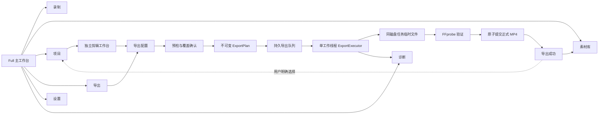
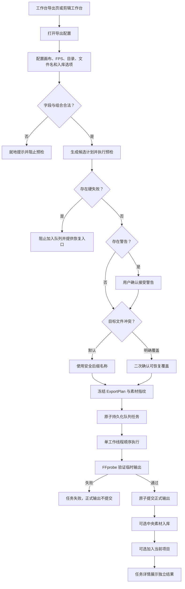
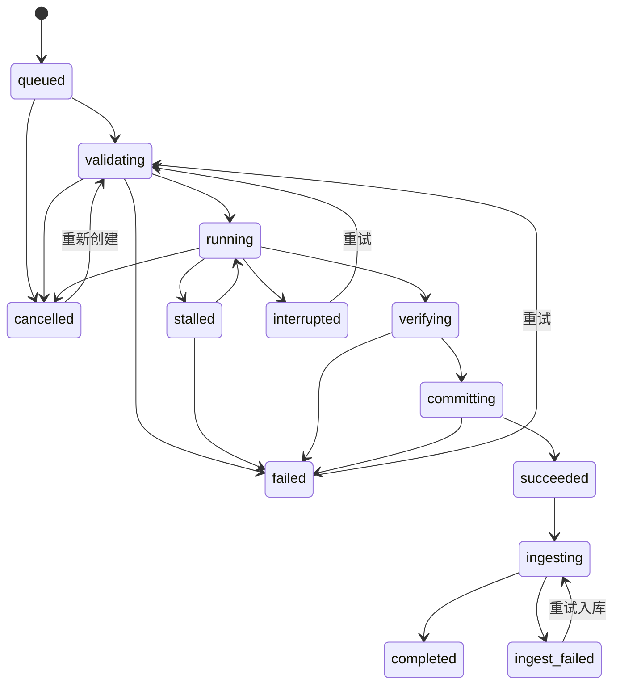

# QuickRec Full v1.9.4 高保真原型设计说明

## 1. 文档信息

| 项 | 内容 |
| --- | --- |
| 版本 | QuickRec Full v1.9.4 |
| 原型主题 | 正式本地 MP4 导出、持久队列、失败恢复与结果入库 |
| 原型状态 | 已完成并确认 |
| 对应 PRD | `doc/releases/v1.9.4/prd.md` |
| 原型入口 | `doc/releases/v1.9.4/prototype/index.html` |
| 推荐入口参数 | `?page=exports` |
| 全屏应用视图 | `?embed=1&page=exports` |
| 运行方式 | 本地 HTTP 服务，不依赖外部 CDN |
| 自动验证记录 | `doc/releases/v1.9.4/prototype/validation/README.md` |
| 实现边界 | 验证界面、交互、状态和数据合同，不代表 PyQt 导出能力已经实现 |

## 2. 原型目标

本原型在 v1.9.3 已确认的完整工作台和独立剪辑工作台基础上，验证 v1.9.4 的唯一产品主线：

1. 从已保存的项目时间线创建不可变 `ExportPlan`。
2. 在创建任务前完成输出配置、素材指纹、依赖、目录和磁盘预检。
3. 将任务原子写入单工作线程持久队列。
4. 在工作台“导出”一级页面查看进度、计划、尝试记录和恢复操作。
5. 使用任务专属临时文件，经 FFprobe 验证后原子提交正式 MP4。
6. 将“导出成功”“中央素材入库”“加入当前项目”作为三个可独立判断的结果。
7. 在取消、失败、中断、队列损坏、未知版本和应用退出时保护项目与正式输出。
8. 让每个按钮、菜单、输入项和状态入口都能就近查看完整开发契约。

原型继续保留录制、素材库、项目、设置、诊断、浮动录制窗口和独立剪辑工作台，避免把导出设计成脱离现有产品的孤立页面。

## 3. 页面与模块关系



## 4. 用户完整链路



## 5. 导出页结构

```text
工作台“导出”一级页面
├── 队列摘要
│   ├── 运行 / 等待数量
│   ├── 输出磁盘可用空间
│   └── 单工作线程状态
├── 页面命令
│   ├── 打开输出目录
│   ├── 清理历史
│   └── 新建导出
├── 队列健康横幅
│   ├── 损坏恢复
│   ├── 未知版本只读
│   └── 20 个未完成任务上限
├── 左侧任务列表
│   ├── 全部 / 进行中 / 需处理 / 已完成
│   ├── 状态、进度、排队位置和尝试次数
│   └── 未完成任务容量
└── 右侧任务详情
    ├── task_id、项目、冻结时间和状态
    ├── 阶段、进度、耗时、预计剩余和速度
    ├── 画布、FPS、视频和音频规则
    ├── 不可变计划与素材指纹
    ├── 尝试记录
    └── 暂停、取消、诊断和当前主操作
```

任务详情底部操作条在滚动容器内保持可见。失败、中断和入库失败会改变主操作，但不会改变原始 `ExportPlan`。

## 6. 导出配置结构

导出配置使用三步流程：

### 6.1 输出设置

- 项目快照：时长、片段数、视频轨、音频轨和保存状态。
- 分辨率：跟随项目、1080p、720p和自定义偶数尺寸。
- FPS：30、60、120；120 FPS 最高 1920×1080。
- 画面适配：保持比例补黑边或裁切填满。
- 编码格式：固定 MP4/H.264/AAC，只读展示。
- 输出目录：正式文件与临时文件位于同一磁盘。
- 文件名：检查 Windows 合法性、长路径和冲突。
- 覆盖：默认关闭；启用后必须二次确认且使用可恢复事务。
- 中央素材库：导出成功后可自动入库。
- 当前项目：仅中央入库成功后建立项目引用。
- 空间卡片：展示预计输出、临时峰值和三档空间反馈。

### 6.2 预检与确认

预检逐项展示：

1. 项目和 timeline schema v2。
2. 素材存在性、可解析性和指纹。
3. 包内 FFmpeg / FFprobe。
4. 输出画布、FPS、目录和文件名。
5. 磁盘空间与临时文件上限。

预检结果分为：

- 通过：允许加入队列。
- 警告：需要用户明确接受，但不伪装为完全无风险。
- 失败：禁用提交，保持配置可修改。

### 6.3 加入队列

成功持久化后显示：

- 稳定 task_id。
- 当前排队位置。
- “继续编辑项目不会改变任务”的快照说明。
- 查看导出队列入口。

关闭成功页不会取消任务。

## 7. 队列状态机



约束：

- `committing` 阶段不可取消。
- 应用异常退出后，先恢复未完成覆盖事务，再把运行态映射为 `interrupted`。
- 重试沿用不可变计划，但必须重新校验素材指纹、依赖和输出目标。
- 未知队列版本只读，不覆盖写入。
- 队列损坏先保留原文件，再尝试有效备份恢复。

## 8. 原型状态矩阵

原型顶部“页面状态”可直接切换以下 v1.9.4 状态：

| 状态 | 主要验证内容 |
| --- | --- |
| 导出队列空状态 | 空文案、打开项目和新建导出 |
| 导出预检通过 | 全部检查通过和计划冻结说明 |
| 导出预检警告 | 非阻塞风险和明确接受 |
| 导出预检失败 | 硬失败、禁用提交和恢复入口 |
| 磁盘空间提示 | 空间可用但建议关注 |
| 磁盘空间警告 | 接近估算下限，可明确继续 |
| 磁盘空间不足 | 阻止预检和加入队列 |
| 文件名安全避让 | 默认不覆盖，生成可用后缀 |
| 覆盖文件二次确认 | 旧文件备份、提交和恢复语义 |
| 排队 / 校验 / 运行 | 顺序执行和阶段进度 |
| 疑似停滞 | 观察窗口、诊断和不误判失败 |
| 验证 / 提交 | FFprobe 与原子提交边界 |
| 成功 | 正式输出、素材入库和结果操作 |
| 失败 | 错误原因、清理和重试 |
| 取消 | 临时文件清理，正式输出不删除 |
| 中断 | 启动恢复和从头重试 |
| 导出成功但入库失败 | 结果事实分离和入库重试 |
| 运行中退出 | 等待完成、中断退出、取消退出 |
| 20 个未完成任务 | 创建门禁，不删除真实文件 |
| 队列文件损坏 | 备份恢复和运行态映射 |
| 未知队列版本 | 只读展示和禁止覆盖 |

## 9. 控件开发契约

所有用户可操作控件均绑定 `data-contract`。点击控件或开启“开发标注”后，右侧检查器就近展示：

- 触发条件；
- 操作结果；
- 成功反馈；
- 失败反馈；
- 禁用规则；
- 取消行为；
- 对任务、项目、中央素材索引和真实文件的影响。

### 9.1 导出页

| 控件 | 核心效果 |
| --- | --- |
| 打开输出目录 | 打开默认导出目录，不改变任务 |
| 清理历史 | 只清理终态记录和任务临时目录，不删除正式 MP4 |
| 新建导出 | 打开配置，尚不创建任务 |
| 刷新 | 读取队列与执行器快照，不中断任务 |
| 四个筛选 | 只改变列表视图 |
| 任务卡片 | 切换详情，不改变执行顺序 |
| 查看快照 | 只读展示冻结的 ExportPlan |
| 复制诊断摘要 | 复制脱敏任务上下文 |
| 完成当前任务后暂停 | 当前任务继续，后续任务暂停 |
| 取消任务 | 安全终止并清理临时文件 |
| 查看诊断 | 定位 task_id 相关事件 |
| 主操作 | 根据状态执行打开、重试或入库恢复 |

### 9.2 导出配置

| 控件 | 核心效果 |
| --- | --- |
| 分辨率 / FPS | 校验组合，120 FPS 最高 1080p |
| 画面适配 | 写入固定导出规则 |
| 自定义宽高 | 只接受范围内偶数尺寸 |
| 浏览输出目录 | 更新目录并重算空间 |
| 文件名 / 检查名称 | 校验合法性和同名冲突 |
| 允许覆盖 | 启用二次确认与可恢复覆盖事务 |
| 加入中央素材库 | 输出成功后独立执行入库 |
| 加入当前项目 | 中央入库成功后建立引用 |
| 开始预检 | 构建候选计划并执行硬检查 |
| 返回修改 | 废弃本次预检结论，保留输入 |
| 加入队列 | 原子保存任务与不可变计划 |
| 取消 / 关闭 | 任务提交前零副作用 |

### 9.3 剪辑工作台

“导出项目”与既有“素材工作台”“开始录制”并列：

- 只读取最后一次成功保存的项目；
- 未保存、只读、未知时间线版本和外部冲突会阻止导出；
- 打开导出配置不会关闭剪辑工作台；
- 导出运行期间仍可继续编辑、浏览和录制；
- 录制与实际运行中的导出互斥，排队任务不阻塞录制。

## 10. 文件安全合同

默认文件策略：

```text
目标名称冲突
→ 生成安全后缀
→ 写同目录任务临时文件
→ FFmpeg 完成
→ FFprobe 验证
→ 原子重命名为正式文件
```

明确覆盖策略：

```text
用户勾选覆盖
→ 加入队列前二次确认
→ 执行时再次校验目标
→ 备份旧文件
→ 生成并验证新输出
→ 原子提交
→ 成功后清理备份

任一步失败
→ 恢复旧文件
→ 保留事务和诊断上下文
```

原型不提供“直接覆盖并希望成功”的捷径。

## 11. 视觉与布局规则

- 延续 QuickRec 已确认视觉：深色窄侧栏、浅色工作区、蓝色主操作。
- 绿色、黄色、红色分别表达成功、警告和失败。
- 导出任务采用高密度双栏布局，不使用营销式大卡片。
- 任务列表固定身份，右侧详情承担状态解释和恢复。
- 详情操作条在滚动区底部保持可见。
- 配置使用独立对话框，不挤压主工作台。
- 所有图标继承统一线性图标系统，不使用 emoji 或字符图标。
- 文本不以视口宽度缩放字体。
- 默认工作台约 1200×760，最小 960×640。
- 100%、125%、150% 等效视口下保持无页面级横向溢出。

## 12. 演示入口

推荐：

```text
http://127.0.0.1:8773/index.html?page=exports
```

全屏应用视图：

```text
http://127.0.0.1:8773/index.html?embed=1&page=exports
```

指定状态示例：

```text
?page=exports&state=export-preflight-failed
?page=exports&state=export-running
?page=exports&state=export-ingest-failed
?page=exports&state=export-queue-unknown
```

## 13. 当前结论与门禁

已完成：

- v1.9.3 完整产品原型继承；
- 导出一级页面；
- 剪辑工作台导出入口；
- 三步导出配置；
- 24 个导出状态；
- 188 个全原型交互契约，缺失数为 0；
- JavaScript 语法检查；
- 100%、125%、150% 等效视口检查；
- 浏览器控制台检查；
- 关键页面截图。

产品负责人已于 2026-07-29 确认：

1. 导出页双栏密度和任务详情信息层级。
2. 导出配置三步流程。
3. 默认安全文件名与显式覆盖二次确认。
4. “导出成功”和“素材入库失败”的结果分离。
5. 队列恢复、退出和 20 个未完成任务上限的表达。

原型门禁已关闭。开发前短样本技术门禁、开发承接、D2-D10 实现和自动化门禁均已完成；
当前处于 D11 候选包验收阶段，原型服务不是候选包运行或发布依赖。
