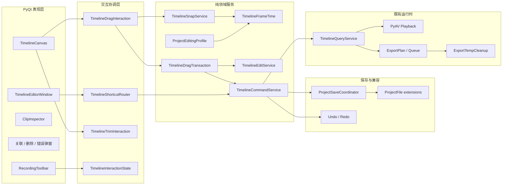

# QuickRec Full v1.9.5 开发计划

## 0. 追踪信息

| 项目 | 内容 |
| --- | --- |
| 目标版本 | QuickRec Full v1.9.5 |
| 版本主题 | 剪辑交互与轨道控制增强 |
| 当前状态 | D8 通过；D9 通过（31/31）；D10 发布收口完成 |
| 发布前基线 | v1.9.4 |
| 代码回滚点 | tag `v1.9.4` / `b3b8267e1950b8e2b9efc6d28d29b501189fd7af` |
| 当前工作区 | `E:\codex\QuickRec` |
| 当前分支 | `test` |
| 上游需求池 | `doc/archive/ideas/mypm-idea-pool-v1.9.5-2026-07-30.md` |
| 需求事实源 | `doc/releases/v1.9.5/prd.md` |
| 交互事实源 | `doc/releases/v1.9.5/prototype/` |
| 状态事实源 | `doc/releases/v1.9.5/progress.md` |
| 开发日志 | 实现开始时新建 `doc/releases/v1.9.5/dev_log.md` |
| 自动验证 | D8 新建 `doc/releases/v1.9.5/verification.md` |
| GUI 验收 | D9 新建 `doc/releases/v1.9.5/manual-verification.md` |
| 缺陷记录 | 发现真实缺陷时新建 `doc/releases/v1.9.5/bugfix-log.md` |
| PRD 确认 | 已获得（2026-07-30） |
| 原型确认 | 已获得（2026-07-30） |
| 开发承接确认 | 已获得（2026-07-30） |
| 进入业务实现授权 | 已获得（2026-07-30） |
| Lite 边界 | `E:\codex\QuickRec-Lite` 不属于本版范围，不得修改 |
| 独立文档边界 | 现有 v2.0 架构与归属治理文档不得覆盖、撤销或混入本版提交 |
| 最后更新 | 2026-07-30 |

## 1. 执行基线

### 1.1 当前阶段

入口判断：开发承接。

本轮只把已确认的 PRD 和高保真原型转换成可执行计划与最小任务看板，不修改业务代码，
不运行会写入用户环境的 GUI 或硬件测试，也不执行 commit、push、tag 或 Release。

后续实施必须在用户确认本计划并明确授权后开始。实施时固定以下事实源：

```text
PRD：doc/releases/v1.9.5/prd.md
原型：doc/releases/v1.9.5/prototype/
开发计划：doc/releases/v1.9.5/dev_plan.md
状态看板：doc/releases/v1.9.5/progress.md
```

没有产品契约变化时不重写 PRD；实现状态进入 `progress.md`，开发过程进入
`dev_log.md`，真实缺陷进入 `bugfix-log.md`。

### 1.2 当前工程事实

| 对象 | v1.9.4 当前事实 | v1.9.5 处理 |
| --- | --- | --- |
| 项目格式 | 根 schema v1，未知扩展可往返保留 | 新增版本化 `quickrec.editing`，不升级根 schema |
| 时间线格式 | timeline schema v2，整数微秒，最多 8+8 轨 | 不升级 schema；继续使用可空 `link_group_id` |
| 关联音视频 | 联合移动、裁剪、分割和全局波纹删除 | 增加原子解绑、严格重新关联和独立编辑 |
| 删除 | `Delete` 当前进入全局波纹删除 | 拆为普通删除与 `Shift+Delete` 全局波纹删除 |
| 素材拖放 | 只能落到已有兼容轨道，反馈有限 | 增加吸附、候选预览、类型校验和条件性自动建轨 |
| 时间精度 | 底层微秒，UI 主要为秒/毫秒 | 增加 30/60/120 项目编辑 FPS 和帧级交互 |
| 快捷键 | `Ctrl+B`、`Delete` 等散落在窗口 | 建立固定映射、焦点优先级和单一路由 |
| 播放 | PyAV，最高视频轨覆盖，最多 8 路音频 | 保持语义，只增加帧级跳转和解绑片段回归 |
| 导出 | ExportPlan、单工作线程队列、FFmpeg 原子提交 | 保持语义，补临时文件归属清理和回归 |
| 保存 | 原子保存、备份、外部冲突、Undo/Redo | 所有新命令先候选后提交，失败零副作用 |
| 录制工具栏 | `primaryScreen()` + 顶部固定偏移 | 跟随实际录制目标屏幕并进入中上安全区 |
| 质量门禁 | 1238 passed，Coverage 84.09%，Packaging 20 passed | 不降低基线，扩展受影响模块增量门禁 |

当前大文件规模：

```text
src/ui/timeline_editor_window.py  2667 行
src/services/timeline_commands.py 1987 行
src/ui/timeline_canvas.py         1014 行
src/services/timeline_edit_service.py 930 行
```

因此本版必须先提取交互状态、快捷键、帧换算、吸附和拖放事务，不能继续把全部规则堆入
窗口或画布；同时不得借机全量重写这些文件。

### 1.3 版本交付闭环

v1.9.5 必须交付：

1. 固定、可测试且具焦点保护的剪辑快捷键。
2. 关联音视频原子解绑、严格重新关联和解绑后的独立编辑。
3. 普通删除保留空隙，全局波纹删除保持既有影响预览。
4. 素材拖动候选、帧级吸附、类型校验和条件性自动建轨。
5. 项目级 30/60/120 编辑 FPS 与 `HH:MM:SS:FF`。
6. 实际录制目标屏幕的工具栏中上安全区定位。
7. 可归属导出临时文件的安全清理。
8. 播放、导出、CLI、项目恢复和 v1.9.4 主流程无发布阻塞回归。
9. README、current 和 release notes 的向下编辑兼容警告。
10. 源码与 PyInstaller 候选包一致，QuickRec Lite 零修改。

### 1.4 开发前直接治理

以下三项必须在产品主线前独立完成、独立测试、独立记录：

1. `GOV-195-001`：Space 播放/暂停与焦点契约。
2. `GOV-195-002`：录制工具栏目标屏幕和中上安全区。
3. `GOV-195-003`：`LIMIT-194-01` 可归属导出临时文件残留。

不得把这三项与解绑、帧时间或智能拖放混在同一实现批次。任一治理项需要改变产品契约时，
停止实施并返回 PRD，不在代码中临时增加隐式规则。

### 1.5 明确不做

- 固定分屏、画中画、自由画布和视频变换；
- 关键帧、波形、代理媒体和高级音频控制；
- 新导出编码器、硬件编码和导出队列重写；
- libopenshot 或其他新媒体引擎；
- 完整 Premiere 快捷键复刻或快捷键编辑器；
- AI、字幕、摘要、标签、云同步和数据库；
- WGC、新的高刷新率能力和多显示器正式支持；
- QuickRec Lite 改动；
- 全量重写 `QuickRecApp`、剪辑工作台、播放或录制核心。

## 2. PRD 追溯与阶段映射

| 需求 / 验收项 | 实施边界 | 阶段 | 主要证据 |
| --- | --- | --- | --- |
| `ACC-195-01` Space 契约 | 固定映射、焦点优先级、单一路由 | D1-D2、D8-D9 | Qt 焦点测试、GUI |
| `ACC-195-02/03` 解绑与独立编辑 | 只清空关联 ID，保持其他身份；后续命令独立 | D4、D7-D9 | 命令、保存、重启 |
| `ACC-195-04` 严格重新关联 | 纯候选过滤，新建关联 ID，失败零修改 | D4、D6-D9 | 属性测试、弹窗、GUI |
| `ACC-195-05` 普通删除 | 删除目标但保持其他片段起点逐字不变 | D4、D6-D9 | 候选、历史、GUI |
| `ACC-195-06` 全局波纹删除 | 保留 v1.9.3 规则和影响预览 | D4、D6-D9 | 回归、确认框 |
| `ACC-195-07` 拖放预览 | 目标轨、时间、吸附、自动建轨和失败原因 | D5-D6、D8-D9 | 画布、状态机、截图 |
| `ACC-195-08/09` 自动建轨与上限 | 原子事务，视频顶部、音频末尾，分别最多 8 条 | D5-D9 | 命令、Undo/Redo、规模 |
| `ACC-195-10/12` 编辑 FPS 与扩展兼容 | 项目扩展 v1、未知字段往返、旧项目查看不写盘 | D3、D7-D9 | fixture、哈希、重启 |
| `ACC-195-11` 帧换算 | 有理数、最近帧、整数微秒、无累计漂移 | D3、D5-D9 | 属性与长时间线测试 |
| `ACC-195-13` 状态保护 | 只读、录制、保存、未知版本和缺失状态矩阵 | D2-D7、D9 | 状态测试、GUI |
| `ACC-195-14` 保存失败 | UI、内存、历史、磁盘一致，失败零副作用 | D4-D8 | 故障注入、文件哈希 |
| `ACC-195-15` 多视频规则 | 保持最高视频轨全画面覆盖 | D7-D9 | 播放抽帧、ExportPlan |
| `ACC-195-16` 工具栏定位 | 实际目标屏幕、中上安全区、三档 DPI | D1、D9 | 纯函数、截图 |
| `ACC-195-17` 临时文件治理 | 仅清理可归属、已终止 attempt 的文件 | D1、D8-D9 | 隔离目录、故障注入 |
| `ACC-195-18` 原型和 GUI | 已确认原型，候选包完成真实验收 | D0、D9 | 原型报告、验收文档 |
| `ACC-195-19` 工程质量 | 全量、静态、Coverage、Packaging | D8 | 报告和 CI |
| `ACC-195-20` 兼容说明 | README/current/release notes 明确风险 | D10 | 文档检查 |

## 3. 目标架构与依赖边界



依赖规则：

1. `TimelineCanvas` 只采集输入并绘制候选，不直接修改模型或写项目。
2. 快捷键路由只判断焦点、上下文和命令可用性，不复制领域规则。
3. 帧换算与吸附服务不导入 Qt、不写项目、不启动媒体运行时。
4. 拖放事务描述最终原子变更，不直接执行保存。
5. 解绑、关联、删除和自动建轨都通过 `TimelineCommandService` 提交。
6. `ProjectSaveCoordinator` 仍是唯一正式落盘入口。
7. Undo/Redo 只记录成功提交；失败和取消不改变历史栈。
8. 播放和导出只读取最后成功模型，不读取 UI 候选。
9. 临时文件清理必须基于正式队列/attempt 归属，不按模糊文件名批量删除。
10. 录制工具栏定位只接收目标屏幕元数据和 Qt 可用区域，不推导新的录制能力。

## 4. 文件与模块影响

### 4.1 预计新增生产文件

| 文件 | 职责 | 质量门禁 |
| --- | --- | --- |
| `src/services/project_editing_profile.py` | 解析、推导和序列化 `quickrec.editing` | 核心覆盖率 >= 85% |
| `src/services/timeline_frame_time.py` | 30/60/120 FPS 与微秒/时间码确定性换算 | 核心覆盖率 >= 85% |
| `src/services/timeline_snap.py` | 帧、播放头、片段边缘吸附候选 | 核心覆盖率 >= 85% |
| `src/services/timeline_drag_transaction.py` | 拖放候选、自动建轨和原子提交描述 | 核心覆盖率 >= 85% |
| `src/ui/timeline_shortcut_router.py` | 固定快捷键、焦点优先级和可用性路由 | 协调覆盖率 >= 80% |
| `src/ui/timeline_drag_interaction.py` | 拖动生命周期、取消和候选状态 | 协调覆盖率 >= 80% |
| `src/ui/toolbar_placement.py` | 目标屏幕选择和中上安全区几何计算 | 覆盖率 >= 80% |
| `src/exporting/temp_cleanup.py` | 可归属 attempt 临时文件安全清理 | 核心覆盖率 >= 85% |

文件名在实现前可以根据现有命名微调，但职责边界不得重新合并回窗口、画布或队列服务。

### 4.2 预计修改生产文件

| 文件 | 改动 |
| --- | --- |
| `src/ui/timeline_editor_window.py` | 接入快捷键、FPS、关联操作、删除菜单、拖放反馈和状态提示 |
| `src/ui/timeline_canvas.py` | 采集拖动、绘制候选、帧级标尺和播放头，不提交模型 |
| `src/ui/timeline_trim_interaction.py` | 统一使用帧换算和吸附服务，不扩张为通用命令服务 |
| `src/ui/timeline_edit_dialogs.py` | 解绑、重新关联、波纹影响和失败反馈 |
| `src/ui/clip_inspector_widget.py` | 关联状态、片段时间码和可用操作 |
| `src/ui/toolbar.py` | 使用目标屏幕定位，不再直接调用 `primaryScreen()` 作为唯一来源 |
| `src/services/timeline_edit_service.py` | 纯候选：解绑、重新关联、普通删除和拖放事务校验 |
| `src/services/timeline_commands.py` | 原子提交、保存、历史、诊断和失败回滚 |
| `src/services/timeline_query.py` | 未关联片段、帧级位置和最高视频轨回归 |
| `src/services/timeline_session.py` | 暴露项目编辑 profile 与交互状态，不吸收 UI 逻辑 |
| `src/services/timeline_history.py` | 新命令的单步 Undo/Redo 与扩展往返 |
| `src/services/timeline_health.py` | 只读、未知、缺失、关联和可编辑状态 |
| `src/services/project_save_coordinator.py` | 多对象原子保存和外部冲突回归 |
| `src/utils/project_store.py` | 未知扩展往返和项目编辑扩展校验接线 |
| `src/utils/timeline_model.py` | 保持 schema v2，不新增可由扩展表达的字段 |
| `src/exporting/executor.py` | 结束路径调用临时清理，保持编码合同 |
| `src/exporting/queue_service.py` | 启动恢复和 attempt 归属清理接线 |
| `src/exporting/diagnostics.py` | 记录清理数量、跳过和失败，不泄露完整路径 |
| `src/cli/commands.py` | project/timeline validate 识别编辑扩展与未关联片段 |
| `src/main.py` | 提供实际录制目标屏幕元数据，不承载几何算法 |
| `pyproject.toml` | 纳入新增模块和 `toolbar.py` 的 Ruff/Mypy/Coverage |
| `scripts/check_incremental_coverage.py` | 增加 v1.9.5 核心和交互覆盖组 |
| `.github/workflows/ci.yml` | 扩展 frozen CLI、Packaging 和文档门禁 |
| `build_std.spec` | 显式验证新增模块进入 GUI/CLI 包 |

### 4.3 预计新增或重点修改测试

```text
tests/test_project_editing_profile.py
tests/test_timeline_frame_time.py
tests/test_timeline_snap.py
tests/test_timeline_drag_transaction.py
tests/test_timeline_shortcuts.py
tests/test_timeline_link_commands.py
tests/test_timeline_delete_commands.py
tests/test_timeline_drag_interaction.py
tests/test_toolbar_placement.py
tests/test_export_temp_cleanup.py
tests/test_timeline_edit_service.py
tests/test_timeline_edit_commands.py
tests/test_timeline_editing_ui.py
tests/test_timeline_editor_window.py
tests/test_timeline_canvas.py
tests/test_timeline_history.py
tests/test_timeline_query.py
tests/test_export_plan_builder.py
tests/test_export_queue_service.py
tests/test_cli_commands.py
tests/test_packaging_config.py
```

### 4.4 文档和证据文件

实现阶段新增：

```text
doc/releases/v1.9.5/dev_log.md
doc/releases/v1.9.5/verification.md
doc/releases/v1.9.5/manual-verification.md
doc/releases/v1.9.5/bugfix-log.md（仅发现真实缺陷时）
```

发布收口更新：

```text
README.md
doc/current.md
doc/releases/v1.9.5/progress.md
doc/releases/v1.9.5/release-notes.md
doc/releases/v1.9.5/changelog.md
```

### 4.5 明确不修改

```text
E:\codex\QuickRec-Lite/**
v1.9.4 tag 和历史 tag
已发布 v1.9.2-v1.9.4 文档正文
现有 v2.0 独立未跟踪文档
用户真实项目、中央索引、导出队列和录制文件
```

## 5. 分阶段实施

## D0 基线、原型与实现授权

目标：固定事实源、回滚点、脏文件边界和实现停止点。

实施：

1. 读取需求池、PRD、原型、本计划和 progress。
2. 记录 Full/Lite 分支、HEAD、tag 和 `git status`。
3. 确认 `v1.9.4` tag 不移动。
4. 确认 v2.0 独立文档不混入 v1.9.5。
5. 保留原型验证报告和截图。
6. 获得开发承接确认和明确实现授权。
7. 按既有流程在 `test` 上实施；不新建 feature 分支，除非用户另行授权。
8. 创建 `dev_log.md`，记录实现批次而不复制 progress。
9. 运行实现前基线测试并记录精确结果。

验证：

```powershell
git status --short --branch
git tag --points-at HEAD
git -C E:\codex\QuickRec-Lite status --short --branch
python -m pytest -m "not hardware and not packaging" -q
```

完成条件：事实源、实现授权、回滚点和脏文件边界可追溯。

## D1 三项开发前直接治理

目标：独立关闭已知契约偏差和 v1.9.4 遗留，不掺入产品主线。

主要文件：

```text
src/ui/timeline_editor_window.py
src/ui/timeline_shortcut_router.py
src/ui/toolbar.py
src/ui/toolbar_placement.py
src/exporting/temp_cleanup.py
src/exporting/executor.py
src/exporting/queue_service.py
tests/test_timeline_shortcuts.py
tests/test_toolbar.py
tests/test_toolbar_placement.py
tests/test_export_temp_cleanup.py
```

实施：

1. 先为 Space 在画布、输入、按钮、菜单和弹窗焦点下的当前行为补失败测试。
2. 建立只含 Space 的最小快捷键路由，按钮和快捷键调用同一播放命令。
3. 为目标屏幕选择和逻辑坐标几何计算提取纯函数。
4. 全屏使用捕获输出屏幕；区域使用最大相交屏幕；窗口使用最大相交屏幕。
5. 元数据缺失时才回退主屏幕。
6. 工具栏水平居中，并位于可用区顶部以下 8%-12%。
7. 建立 attempt 临时目录/文件的正式归属判定。
8. 成功和受控取消立即清理当前 attempt。
9. 启动时只清理队列证明已中断且不再运行的 attempt。
10. 活跃、未知归属和用户自建文件始终跳过。
11. 清理失败只写诊断，不阻塞启动或改写导出结果。
12. 三项治理分别运行定向测试和记录结果。

验证：

```powershell
python -m pytest tests/test_timeline_shortcuts.py tests/test_timeline_editor_window.py -q
python -m pytest tests/test_toolbar.py tests/test_toolbar_placement.py tests/test_main_workflow.py -q
python -m pytest tests/test_export_temp_cleanup.py tests/test_export_executor.py tests/test_export_queue_service.py -q
```

完成条件：

- Space 焦点合同闭合；
- 工具栏不再把主屏幕作为唯一定位来源；
- 可归属残留被清理，任何非归属文件不被删除；
- 三项治理可以独立回退。

## D2 统一快捷键、焦点和交互状态

目标：建立固定快捷键映射和单一命令入口。

主要文件：

```text
src/ui/timeline_shortcut_router.py
src/ui/timeline_editor_window.py
src/ui/timeline_canvas.py
tests/test_timeline_shortcuts.py
tests/test_timeline_editor_window.py
tests/test_timeline_editing_ui.py
```

实施：

1. 定义 Space、左右、Shift+左右、Ctrl+B、Delete、Shift+Delete、Ctrl+L、
   Ctrl+Z/Y 和 Esc 的固定映射。
2. 定义输入、菜单、弹窗、按钮、时间线画布和窗口级焦点优先级。
3. 路由器输出语义命令，不直接调用私有 UI 回调。
4. 所有按钮、菜单和快捷键调用同一命令分发函数。
5. 只读、录制、保存、未知 schema、素材缺失和无选择状态返回明确禁用原因。
6. Esc 按优先级取消拖动、裁剪、弹窗或当前临时状态。
7. 禁止 `QShortcut` 与 `keyPressEvent` 形成重复执行。
8. 提示文本和可访问名称显示快捷键。
9. 记录命令、禁用原因和结果，不记录完整路径。

验证：

```powershell
python -m pytest tests/test_timeline_shortcuts.py tests/test_timeline_editor_window.py tests/test_timeline_editing_ui.py -q
```

完成条件：

- 每个快捷键只触发一次；
- 输入、菜单、弹窗和按钮焦点不误触发时间线命令；
- 入口、禁用和反馈与原型一致。

## D3 项目编辑 FPS 与帧时间

目标：在不改变项目根 schema 和 timeline schema 的前提下建立项目级帧时间基准。

主要文件：

```text
src/services/project_editing_profile.py
src/services/timeline_frame_time.py
src/utils/project_store.py
src/services/timeline_session.py
src/ui/timeline_editor_window.py
src/ui/timeline_canvas.py
tests/test_project_editing_profile.py
tests/test_timeline_frame_time.py
tests/test_project_store.py
```

实施：

1. 定义 `quickrec.editing` 扩展 schema v1。
2. 支持 30、60、120 FPS，拒绝布尔值、浮点和其他整数。
3. 新项目继承创建时有效录制 FPS，不持续绑定全局设置。
4. 旧项目按正式规则确定性推导，无法推导时回退 30。
5. 只查看旧项目不写盘，第一次成功编辑才持久化扩展。
6. 空时间线允许修改；存在片段后锁定并给出原因。
7. 未知扩展版本进入只读，未知字段往返保留。
8. 使用有理数完成帧、微秒和 `HH:MM:SS:FF` 换算。
9. 统一最近帧、边界钳制和负数拒绝规则。
10. 实现逐帧、逐秒、输入跳转和帧级标尺。
11. 100 次往返和 30 分钟时间线不得累计漂移一帧。
12. 时间线 UI 显示三位 120 FPS 帧号且不裁切。

验证：

```powershell
python -m pytest tests/test_project_editing_profile.py tests/test_timeline_frame_time.py tests/test_project_store.py tests/test_timeline_query.py -q
```

完成条件：

- 根 schema 仍为 1，timeline schema 仍为 2；
- 旧项目只查看不写盘；
- 30/60/120 FPS 换算稳定且可逆；
- 未知扩展不被静默覆盖。

## D4 解绑、严格重新关联与双删除

目标：用纯候选和原子命令建立可恢复的关联控制与两种删除语义。

主要文件：

```text
src/services/timeline_edit_service.py
src/services/timeline_commands.py
src/services/timeline_history.py
src/services/timeline_health.py
src/ui/timeline_edit_dialogs.py
tests/test_timeline_link_commands.py
tests/test_timeline_delete_commands.py
tests/test_timeline_edit_service.py
tests/test_timeline_edit_commands.py
tests/test_timeline_history.py
```

实施：

1. 解绑候选验证关联组恰好包含一视频和一音频。
2. 解绑只把双方 `link_group_id` 设空。
3. 保持双方 `clip_id`、`material_id`、轨道、时间和源范围逐字不变。
4. 解绑后移动、裁剪、分割和删除只作用于选中片段。
5. 重新关联候选只允许未关联、异类、同素材、同起点、同持续时间和兼容源范围。
6. 候选排序稳定，提交时再次校验。
7. 成功关联生成新的 `link_group_id`，不恢复旧 ID。
8. 普通删除只删除目标或用户明确选择的对象，其他片段起点不变。
9. 全局波纹删除继续使用既有影响预览和确认。
10. `Delete` 和 `Shift+Delete` 不共享错误文案或确认语义。
11. 保存失败、外部冲突和取消均保持 UI、内存、历史和磁盘一致。
12. 每次成功命令只产生一个 Undo/Redo 历史项。
13. 50 次解绑、关联和撤销后身份不变量成立。

验证：

```powershell
python -m pytest tests/test_timeline_link_commands.py tests/test_timeline_delete_commands.py tests/test_timeline_edit_service.py tests/test_timeline_edit_commands.py tests/test_timeline_history.py -q
```

完成条件：

- `ACC-195-02` 至 `ACC-195-06` 自动化闭合；
- 失败和取消零副作用；
- v1.9.3 裁剪、分割和波纹行为无回退。

## D5 帧级吸附、智能拖放和条件性自动建轨

目标：让拖动成为可解释、可取消、可撤销的原子事务。

主要文件：

```text
src/services/timeline_snap.py
src/services/timeline_drag_transaction.py
src/ui/timeline_drag_interaction.py
src/ui/timeline_canvas.py
src/services/timeline_edit_service.py
src/services/timeline_commands.py
tests/test_timeline_snap.py
tests/test_timeline_drag_transaction.py
tests/test_timeline_drag_interaction.py
tests/test_timeline_canvas.py
```

实施：

1. 统一帧边界、片段边缘和播放头吸附候选。
2. 定义候选优先级、像素阈值、时间阈值和稳定 tie-break。
3. Alt 在本次拖动中关闭吸附，不修改项目或全局配置。
4. 拖动期间只更新内存候选，不执行保存。
5. 候选包含素材、目标时间、视频轨、音频轨、吸附源、冲突和自动建轨计划。
6. 视频只能进入视频轨，独立音频只能进入音频轨。
7. 内嵌音频视频生成一个关联的双片段事务。
8. 有空闲兼容轨时不得自动建轨。
9. 无兼容轨或全部兼容轨冲突时才自动建轨。
10. 新视频轨置顶，新音频轨置于音频轨末尾。
11. 视频轨和音频轨分别达到 8 条时明确拒绝。
12. 轨道创建、片段创建和关联 ID 在一次保存中提交。
13. 保存失败、Esc、拖出画布和无效落点不留空轨或片段。
14. 撤销一次同时移除自动轨和本次片段；重做一次完整恢复。
15. 拖放候选绘制 p95 不超过 33 ms。
16. 100 片段项目松开后的候选计算不冻结 GUI 超过 200 ms。

验证：

```powershell
python -m pytest tests/test_timeline_snap.py tests/test_timeline_drag_transaction.py tests/test_timeline_drag_interaction.py tests/test_timeline_canvas.py tests/test_timeline_commands.py -q
```

完成条件：

- 拖动全过程可解释且无逐移动写盘；
- 自动建轨触发条件、顺序、上限和撤销正确；
- 取消、冲突和失败零副作用。

## D6 剪辑工作台 UI 与状态整合

目标：按已确认原型把领域能力接入剪辑工作台，不复制规则。

主要文件：

```text
src/ui/timeline_editor_window.py
src/ui/timeline_canvas.py
src/ui/timeline_edit_dialogs.py
src/ui/clip_inspector_widget.py
src/ui/design_system.py
tests/test_timeline_editor_window.py
tests/test_timeline_editing_ui.py
tests/test_timeline_editor_ui.py
```

实施：

1. 增加项目编辑 FPS 显示、选择和锁定说明。
2. 增加关联状态、解绑/重新关联按钮、菜单和 `Ctrl+L`。
3. 将删除按钮改为普通删除主动作和波纹删除次级入口。
4. 统一按钮、菜单、快捷键和提示文本。
5. 拖动时绘制目标轨、时间码、吸附线、关联落点和自动建轨占位。
6. 对冲突、锁定、满轨和不可解析素材显示就近原因。
7. 帧级标尺、时间码输入和播放头状态与项目 FPS 一致。
8. 只读、录制、保存、未知版本、缺失和外部冲突使用统一状态矩阵。
9. 保存中防止重复提交；保存失败保持当前上下文和恢复入口。
10. 960×640 和默认最大化布局均保持关键控件可操作。
11. 所有图标按钮具有工具提示和可访问名称。
12. 不把原型开发说明文字带入产品界面。

验证：

```powershell
python -m pytest tests/test_timeline_editor_window.py tests/test_timeline_editing_ui.py tests/test_timeline_editor_ui.py tests/test_timeline_playback_ui.py -q
```

完成条件：

- 原型中的正式产品状态均有真实 PyQt 映射；
- UI 不直接写 timeline 或项目 JSON；
- 关键入口在三档 DPI 和最小窗口下可操作。

## D7 持久化、播放、导出、CLI 与兼容回归

目标：证明新交互可以稳定保存，并与既有运行时和导出语义一致。

主要文件：

```text
src/services/project_save_coordinator.py
src/services/timeline_query.py
src/services/timeline_media_runtime.py
src/services/timeline_history.py
src/exporting/plan_builder.py
src/cli/commands.py
tests/test_project_save_coordinator.py
tests/test_timeline_query.py
tests/test_timeline_media_runtime.py
tests/test_export_plan_builder.py
tests/test_cli_commands.py
```

实施：

1. 对所有新命令执行原子保存、备份和外部冲突检查。
2. 保存失败后恢复提交前模型和历史，不伪造成功状态。
3. 重启后保留编辑 FPS、解绑状态、新轨顺序和删除结果。
4. 未知项目扩展和其他 `extensions` 往返保留。
5. 播放查询按未关联片段独立读取。
6. 多视频重叠继续最高有效视频轨全画面覆盖。
7. 帧级跳转最终转换为微秒并复用现有运行时。
8. ExportPlan 只读取最后成功保存项目。
9. 自动新建轨道的顺序准确进入 ExportPlan。
10. 普通删除空隙输出黑场或无声，全局波纹改变总时长。
11. CLI validate 识别编辑扩展、未关联片段和未知扩展。
12. v1.9.4 项目只打开不改写；第一次成功编辑后产生备份。
13. 已用 v1.9.5 编辑的项目在旧版本中只保证数据保留，不承诺继续编辑。

验证：

```powershell
python -m pytest tests/test_project_save_coordinator.py tests/test_project_store.py tests/test_timeline_history.py tests/test_timeline_query.py tests/test_timeline_media_runtime.py tests/test_export_plan_builder.py tests/test_cli_commands.py -q
```

完成条件：

- 新命令保存、重启、Undo/Redo 和外部冲突闭合；
- 播放与导出继续使用一致轨道语义；
- 旧项目不因查看而被改写。

## D8 自动化、静态检查、性能与候选包

目标：关闭自动化门禁并生成身份唯一的候选包。

实施：

1. 运行 D1-D7 全部定向测试。
2. 运行全量非硬件测试和 Packaging 测试。
3. 生成 coverage JSON 并运行增量门禁。
4. 总体语句覆盖率保持不低于 80%。
5. 新增关联、删除、拖放、自动建轨和帧换算核心不低于 85%。
6. 快捷键、画布和拖放协调不低于 80%。
7. 将 `toolbar.py` 受影响逻辑移出历史质量排除或以提取模块纳入门禁。
8. 运行 Ruff、Mypy、Compileall 和 `git diff --check`。
9. 运行 UTF-8、乱码、文档状态和链接检查。
10. 使用独立目录构建 GUI/CLI 候选包。
11. 验证包内 FFmpeg、FFprobe、PyAV 和新增模块。
12. 运行 frozen CLI project/timeline/export smoke。
13. 记录 EXE、CLI、FFmpeg、FFprobe 的路径、大小、时间和 SHA256。
14. 输出 `verification.md`，锁定候选包身份。

验证：

```powershell
python -m pytest -m "not hardware and not packaging" -q
python -m pytest -m packaging -q
python -m pytest --cov=src --cov-report=term-missing --cov-report=json:build/coverage.json --cov-fail-under=80
python scripts/check_incremental_coverage.py build/coverage.json
python -m ruff check src tests scripts
python -m mypy
python -m compileall -q src tests scripts
git diff --check
python -m PyInstaller build_std.spec --clean --noconfirm --distpath E:\QRtest\QuickRec-v1.9.5-dist --workpath E:\QRtest\QuickRec-v1.9.5-build
```

完成条件：

- 自动化、静态和 Coverage 全部通过；
- 候选包身份唯一且未覆盖 v1.9.4 稳定产物；
- D9 只能使用锁定候选包。

## D9 GUI、真实媒体、DPI 与回归验收

目标：用真实候选包关闭 `ACC-195-01` 至 `ACC-195-20`。

实施：

1. 核对候选 EXE SHA256 和包内依赖。
2. 使用隔离 APPDATA、项目、素材、导出和证据目录。
3. 验收快捷键及输入、按钮、菜单、弹窗焦点。
4. 验收解绑、独立编辑、严格关联和保存失败。
5. 验收普通删除与全局波纹删除。
6. 验收有效拖放、冲突、锁定、满轨、取消和自动建轨。
7. 在 30/60/120 编辑 FPS 下验收时间码、逐帧、逐秒和吸附。
8. 验收 8+8 轨、100 片段、30 分钟和 50 步历史。
9. 验收中文、空格、长路径和多个同素材片段。
10. 使用真实 H.264/AAC、系统声、麦克风、双音频和无音频样本。
11. 验收播放与导出最高视频轨覆盖一致。
12. 验收普通删除空隙和波纹删除后的正式导出。
13. 验收全屏、区域和窗口工具栏目标屏幕位置。
14. 在 100%、125%、150% DPI 与 960×640 下检查布局。
15. 验收临时文件成功、取消、中断和非归属保护。
16. 回归录制、素材、项目、首帧、剪辑、导出、设置、诊断和 CLI。
17. 确认真实用户数据和 QuickRec Lite 未修改。
18. 输出 `manual-verification.md` 和发布判断。

完成条件：

- 所有发布阻塞项有真实证据闭合；
- 没有关键待补证或已知数据风险；
- 证据记录候选包、环境、截图、日志、项目和导出文件；
- 只得出“可进入发布收口”，不自动发布。

## D10 文档与发布收口

目标：同步正式事实并停在外部写操作授权点。

实施：

1. 更新 README、`doc/current.md`、release notes 和 changelog。
2. 明确 v1.9.5 与 v1.9.4 及以前不保证向下编辑兼容。
3. 写清跨版本操作前备份 `.qrproj` 和 `.bak`。
4. 更新 progress 为验收结果，不写开发流水。
5. 核对验证文档、候选包 SHA256 和回滚点。
6. 确认 `v1.9.4` tag 未移动。
7. 确认 QuickRec Lite 零修改。
8. 输出建议 commit、tag、压缩包和 GitHub Release 信息。
9. 未获用户明确授权前不执行 commit、push、tag 或 Release。

完成条件：文档、代码、候选包和验收结论一致，外部写操作等待单独授权。

## 6. 测试与验收策略

### 6.1 测试分层

| 层级 | 内容 | 是否可替代 GUI |
| --- | --- | --- |
| 纯函数 | 帧换算、吸附、关联候选、轨道顺序、临时归属 | 否 |
| 领域命令 | 原子提交、失败回滚、Undo/Redo、扩展往返 | 否 |
| Qt 协调 | 焦点、快捷键、拖动状态、按钮和弹窗 | 部分 |
| 集成 | 项目重启、播放、ExportPlan、CLI | 否 |
| Packaging | frozen GUI/CLI、FFmpeg/FFprobe/PyAV | 否 |
| GUI/真实媒体 | 实际拖放、听音、DPI、录制工具栏 | 是正式发布证据 |

### 6.2 故障注入

必须在隔离目录覆盖：

- 项目保存失败；
- 外部项目修改；
- 只读和未知扩展；
- 素材缺失或损坏；
- 轨道锁定和轨道上限；
- 拖动取消和保存中重复操作；
- 导出临时文件被占用、权限拒绝和未知归属；
- 打包环境缺失 FFmpeg/FFprobe；
- 应用退出和进程中断。

故障注入结束后必须恢复权限、依赖、进程和显示设置，不修改真实用户数据。

### 6.3 证据继承

v1.9.4 自动化与验收只在相关实现未改变时继承。以下改动会使对应证据失效：

- 时间线命令或保存合同变化；
- 播放查询或 ExportPlan 轨道顺序变化；
- 候选包重新构建；
- 录制工具栏定位变化；
- 临时文件清理接入导出生命周期；
- 项目扩展或 CLI 校验合同变化。

只重开受影响范围，不无理由重复与本版无关的 v1.9.4 长样本。

## 7. 开发日志与记录边界

- 实现开始时新建 `doc/releases/v1.9.5/dev_log.md`。
- 每个 D 阶段记录日期、目标、改动模块、关键决策、验证和下一步。
- 三项直接治理分别记录，不与产品主线混写。
- 技术排查、测试失败原因和实现取舍写入 dev log。
- 真实缺陷、复现、修复和定向复验写入 bugfix log。
- `progress.md` 只记录任务状态、阻塞、最近验证和下一步。
- 不把临时 shell 输出、用户隐私路径或完整环境变量写入文档。

## 8. 风险与控制

| 风险 | 触发条件 | 影响 | 控制与回退 |
| --- | --- | --- | --- |
| 旧项目被查看时改写 | 扩展推导直接写盘 | 用户数据意外变化 | 延迟到第一次成功编辑；哈希测试 |
| 解绑破坏身份 | 重建片段而非清空关联 | 播放、导出和历史失配 | 纯候选逐字段断言；失败零副作用 |
| 关联候选误配 | 仅按时间或素材判断 | 后续联合编辑错误 | 完整兼容条件和提交前复核 |
| Delete 语义混淆 | 旧入口仍直连波纹 | 用户误移动后续片段 | 分离命令、按钮和提示；GUI 证据 |
| 自动建轨半成功 | 先建轨后保存片段失败 | 空轨、重复片段 | 单一事务和单步历史 |
| 帧换算漂移 | 浮点累加 | 长时间线偏移 | 有理数和基于绝对帧的转换 |
| 快捷键误触 | WindowShortcut 绕过焦点 | 输入或弹窗触发编辑 | 集中路由和焦点优先级 |
| 拖动性能退化 | mouse move 计算全项目或写盘 | GUI 卡顿 | 只算候选、缓存索引、p95 门禁 |
| 工具栏跨屏错位 | 物理/逻辑坐标混用 | 工具栏不可见 | Qt 逻辑坐标和可用区钳制 |
| 临时清理误删 | 模糊匹配文件名 | 用户文件丢失 | job/attempt 归属和白名单目录 |
| 播放与导出不一致 | 新轨顺序读取不同 | 预览与成片不同 | 同 fixture 的 Query/Plan 对照 |
| 质量门禁被绕过 | 扩大 omit/排除 | 回归风险隐藏 | 禁止扩大排除；新增增量组 |
| 向下兼容误解 | 文档只写“可打开” | 旧版本保存破坏语义 | README/release notes 强制警告 |

## 9. 回退策略

### 9.1 代码

- 回滚点固定为 tag `v1.9.4`。
- 每个 D 阶段保持可独立回退，不移动历史 tag。
- 三项直接治理与产品主线分开，便于单独撤销。

### 9.2 项目文件

- 不升级根 schema 或 timeline schema。
- 每次正式保存保留既有 `.bak`。
- 回滚 v1.9.4 时优先打开升级前备份。
- 不自动删除 `quickrec.editing` 或未知字段。

### 9.3 功能降级

- 可以隐藏解绑、重新关联或自动建轨入口。
- 可以保留项目只读、播放、诊断和导出。
- 不自动重新关联、重排或删除用户片段。
- 不用恢复旧 Delete 行为掩盖数据错误。

### 9.4 发布包

- v1.9.5 候选包使用独立目录，不覆盖 v1.9.4。
- 发布回退保留 v1.9.4 安装/便携包及 SHA256。
- 回退前关闭 QuickRec、QuickRecCLI、FFmpeg 和 FFprobe。

## 10. 当前开放项

产品契约无开放项。进入实现前仍需用户确认：

1. 本开发计划和 progress 的阶段与颗粒度。
2. 是否按既有流程切换 `test` 实施，不新建 feature 分支。
3. 是否授权从 D1 开始修改业务代码。

实现中若需要改变自动建轨触发、关联兼容、删除语义、编辑 FPS 或数据兼容合同，必须回到
PRD 确认，不得把它当作普通工程取舍。

## 11. 提交与发布边界

建议实施提交按以下边界拆分：

```text
fix(v1.9.5): close editing and recording preflight governance
feat(v1.9.5): add project frame time and shortcut routing
feat(v1.9.5): add linked media controls and delete semantics
feat(v1.9.5): add smart timeline drop and automatic tracks
test(v1.9.5): close editing interaction and packaging gates
docs(v1.9.5): finalize verification and release records
```

实际提交、推送、合并、tag 和 Release 均需用户在对应阶段明确授权。不得移动 `v1.9.4`
tag，不得把 QuickRec Lite 或 v2.0 独立文档混入提交。

## 12. 开发承接确认点

本计划输出后停止：

- 不进入 D1 实现；
- 不修改业务代码；
- 不切换分支；
- 不运行打包或真实用户环境验收；
- 不提交、不推送、不打 tag、不创建 Release。

用户确认后，从 `progress.md` 的 D0 授权项和 D1.1 开始按顺序推进。
