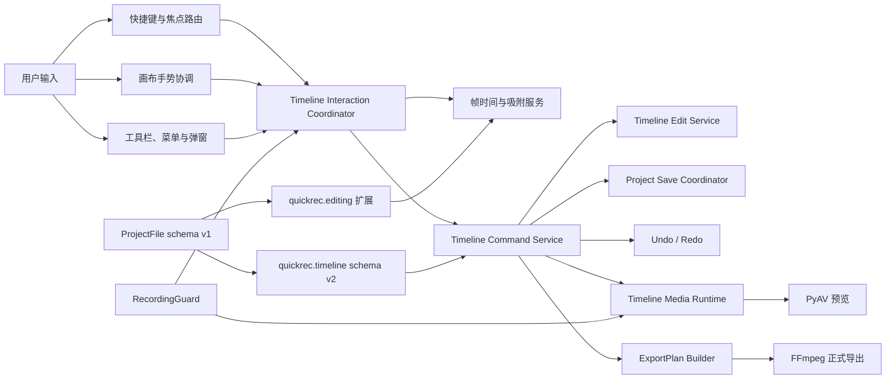
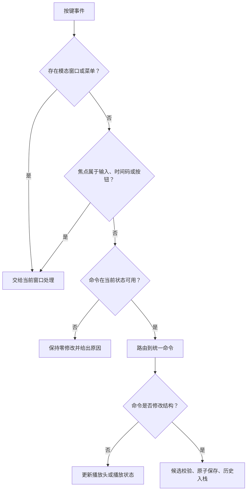
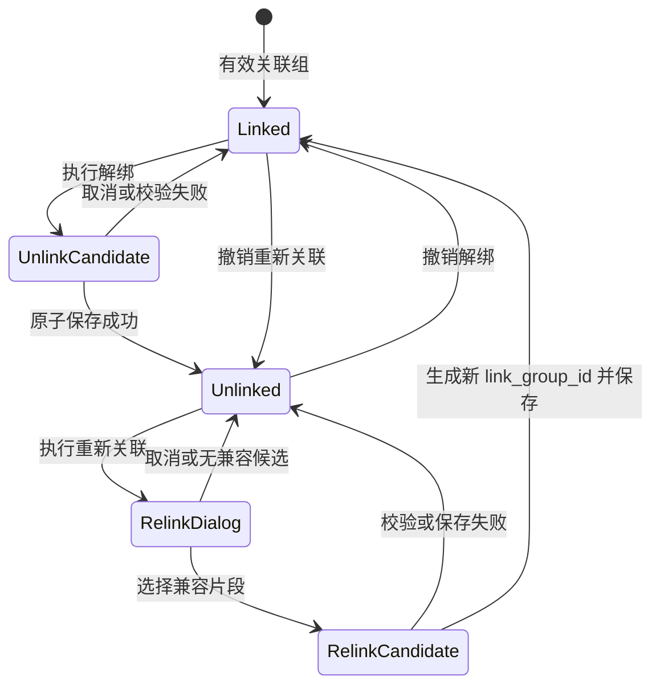
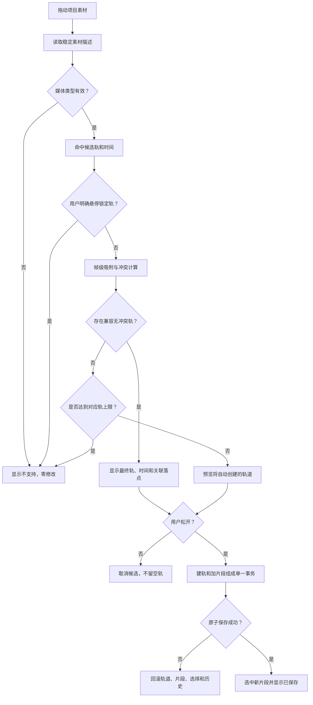

# QuickRec Full v1.9.5 产品需求文档

## 0. 追踪信息

| 项目 | 内容 |
| --- | --- |
| 产品 | QuickRec Full |
| 版本 | v1.9.5 |
| 版本主题 | 剪辑交互与轨道控制增强 |
| 文档类型 | 正式推进型 PRD |
| 当前状态 | 正式 PRD 已确认，高保真原型已确认，进入开发承接 |
| 编写日期 | 2026-07-30 |
| 发布前基线 | v1.9.4 |
| 当前基线提交 | `b3b8267e1950b8e2b9efc6d28d29b501189fd7af` |
| 当前基线 tag | `v1.9.4` |
| 当前工作区 | `E:\codex\QuickRec` |
| 上游需求池 | `doc/archive/ideas/mypm-idea-pool-v1.9.5-2026-07-30.md` |
| 直接上游 | `doc/releases/v1.9.2/`、`doc/releases/v1.9.3/`、`doc/releases/v1.9.4/` |
| 下游承接 | 高保真原型、`dev_plan.md`、`progress.md`、自动验证和 GUI 验收 |
| 当前事实源 | 本 PRD；确认后作为 v1.9.5 产品范围与验收事实源 |
| 代码回滚基线 | tag `v1.9.4` / `b3b8267e1950b8e2b9efc6d28d29b501189fd7af` |
| Lite 边界 | `E:\codex\QuickRec-Lite` 不属于本版范围，不得修改 |

### 0.1 入口判断

历史入口判断：`/prd`。本文件是 QuickRec Full v1.9.5 的正式推进型 PRD。

需求池压力测试和两轮产品澄清已经完成。快捷键、关联音视频解绑和重新关联、普通删除与
全局波纹删除、智能拖放、条件性自动建轨、项目编辑帧率、帧级换算、异常状态、兼容边界、
原型和发布门禁已经形成明确合同。

本文不代表功能已经实现、验证或发布。高保真交互原型已完成并于 2026-07-30
获得产品负责人确认；当前进入开发承接，仍需以 `dev_plan.md` 和 `progress.md`
冻结实施顺序后才能进入 PyQt 业务实现。

### 0.2 上游 IDEA 追踪

| 上游 ID | 本 PRD 承接 | 结论 |
| --- | --- | --- |
| `GOV-195-001` | Space 播放/暂停及焦点契约 | 开发前独立治理，同时纳入最终快捷键合同 |
| `GOV-195-002` | 录制工具栏跟随实际录制屏幕并移至中上安全区 | 开发前独立治理 |
| `GOV-195-003` | v1.9.4 可归属导出临时文件残留 | 开发前独立 Bugfix |
| `IDEA-195-001` | 统一剪辑快捷键映射与焦点规则 | 进入正式范围 |
| `IDEA-195-002` | 关联音视频解绑、严格重新关联与独立操作 | 进入正式范围 |
| `IDEA-195-003` | 智能拖放、落点预览与条件性自动建轨 | 进入正式范围 |
| `IDEA-195-004` | 项目编辑帧率与帧级显示、跳转、导航和吸附 | 进入正式范围 |
| `IDEA-195-005A` | 多视频重叠继续使用最高视频轨全画面覆盖 | 保持当前正式语义 |
| `IDEA-195-005B` | 固定分屏和画中画预设 | 后续版本 |
| `IDEA-195-005C` | 自由画布合成 | 后续版本 |
| `ENG-195-001` | 交互状态、吸附器、拖动事务和手势协调最小拆分 | 进入工程支撑 |
| `ENG-195-002` | 受影响范围质量门禁扩展 | 进入工程支撑 |
| `SPIKE-195-001` | libopenshot 集成 | 独立技术 spike，本版不启动 |
| `IDEA-195-006` | 代理媒体预览系统 | 后续按性能证据决定 |

### 0.3 已确认产品决策

| 编号 | 决策 |
| --- | --- |
| DEC-195-01 | 支持解绑，也支持严格重新关联 |
| DEC-195-02 | 解绑不改变 `clip_id`、`material_id`、轨道、时间位置和源范围 |
| DEC-195-03 | `Delete` 执行普通删除，`Shift+Delete` 执行全局波纹删除 |
| DEC-195-04 | 自动建轨满足条件时直接执行，不逐次弹确认框 |
| DEC-195-05 | 视频轨和音频轨继续分别最多 8 条 |
| DEC-195-06 | 项目编辑帧率是项目级统一属性，只允许 30、60、120 |
| DEC-195-07 | 空时间线可以修改编辑帧率；存在片段后锁定 |
| DEC-195-08 | 底层继续保存整数微秒，帧换算使用统一有理数和最近帧规则 |
| DEC-195-09 | 快捷键采用固定最小集合，不提供用户快捷键编辑器 |
| DEC-195-10 | 多视频重叠继续按最高视频轨全画面覆盖 |
| DEC-195-11 | `editing_fps` 存入项目级版本化扩展，不升级项目根 schema |
| DEC-195-12 | README 和 release notes 必须提示 v1.9.4 及更早版本不保证向下编辑兼容 |

### 0.4 当前工程事实

截至 v1.9.4，QuickRec Full 已经具备：

- 项目工作区、中央素材库和独立剪辑工作台；
- timeline schema v2；
- 最多 8 条视频轨和 8 条音频轨；
- 稳定的 `track_id`、`clip_id`、`material_id` 和可选 `link_group_id`；
- 整数微秒时间单位；
- `timeline_start_us`、`source_start_us` 和 `source_duration_us`；
- 关联视频和音频的联合移动、裁剪、分割和删除；
- 裁剪、分割、轨道锁和固定全局波纹；
- PyAV 播放、最高视频轨覆盖和最多 8 路音频混合；
- 不可变导出计划、持久导出队列和 FFmpeg 正式导出；
- 原子项目保存、备份、外部冲突保护、撤销和重做；
- 独立 `QuickRecCLI.exe`、CI、Coverage 和 Packaging smoke。

当前明确缺口：

- 发布文档要求 Space 播放/暂停，实际剪辑窗口尚未完整接入；
- 快捷键散落在窗口代码中，没有统一映射和焦点优先级；
- 关联音视频无法解绑后独立操作，也无法严格重新关联；
- `Delete` 只有固定全局波纹语义，没有普通删除；
- 素材拖放只能落到已有兼容轨道；
- 缺少可解释的落点预览和原子自动建轨；
- 标尺和时间输入主要是秒或毫秒语义，没有项目级帧时间基准；
- 录制工具栏仍依赖主显示器定位；
- v1.9.4 强制终止场景可能留下可归属的导出临时文件；
- 时间线窗口、命令服务和画布继续增长，新增交互前需要渐进拆分。

v1.9.4 正式基线验证结果：

```text
标准测试：1238 passed, 32 deselected, 66 subtests passed
Packaging：20 passed, 1250 deselected
总体覆盖率：84.09%
D11：27/27
```

本版不得降低这些既有事实的可靠性。

## 1. 版本定位

### 1.1 一句话目标

让用户在现有剪辑工作台中以统一快捷键和帧级时间基准精确操作时间线，能够安全解绑、
重新关联和独立编辑音视频，并把素材直观、可预测地拖入正确轨道。

### 1.2 唯一产品主线

v1.9.5 只有一条产品主线：

> 建立一致、可预测、可撤销的剪辑交互与轨道控制闭环。

用户应能完成：

1. 使用稳定快捷键播放、逐帧导航、分割、删除、波纹删除、解绑和重新关联。
2. 主动解绑当前关联音视频。
3. 解绑后独立选择、移动、裁剪、分割和删除视频或音频。
4. 从兼容候选中严格重新关联一条视频和一条音频。
5. 拖动素材时看到类型、候选时间、目标轨道、吸附位置和冲突原因。
6. 在没有可用轨道时由系统条件性创建轨道并一次提交。
7. 使用 30、60 或 120 FPS 的项目统一编辑帧率。
8. 使用 `HH:MM:SS:FF` 查看、输入、跳转和吸附帧位置。
9. 在保存失败、只读、录制中、素材缺失或未知 schema 下得到明确、安全的行为。
10. 保持播放和导出使用相同的最高视频轨覆盖语义。

### 1.3 工程支撑

本版最多保留两个工程支撑模块：

1. 时间线交互状态、吸附器、拖动事务和手势协调的最小职责拆分。
2. 受影响模块的 Ruff、Mypy、Coverage、CI、Packaging、真实媒体和 GUI/DPI 门禁。

工程支撑不能扩大为全量重写 `QuickRecApp`、`TimelineEditorWindow`、
`TimelineCommandService`、`TimelineCanvas`、播放运行时或导出系统。

### 1.4 开发前直接治理

以下三项必须以独立变更和独立验证先完成，不得混入解绑或智能拖放的领域提交：

1. Space 播放/暂停既有契约。
2. 录制工具栏实际屏幕定位和中上安全区。
3. v1.9.4 可归属导出临时文件残留治理。

三项治理均属于 v1.9.5 发布前置条件，但不包装成新产品卖点。

### 1.5 版本成功定义

v1.9.5 只有同时满足以下条件才算成功：

1. 快捷键和按钮调用同一命令路径。
2. 输入控件、菜单、弹窗和按钮焦点不会误触发时间线命令。
3. 解绑和重新关联是原子、可撤销、可重做和可回滚的操作。
4. 解绑后单侧编辑不会隐式修改另一侧片段。
5. 普通删除和全局波纹删除具有不同、可发现的入口和结果。
6. 自动建轨不会留下空轨、重复片段或半成功状态。
7. 项目编辑帧率在 30、60、120 三档下换算稳定、可往返和无累积漂移。
8. 项目根 schema 仍为 v1，timeline schema 仍为 v2。
9. v1.9.4 可以保留项目级编辑扩展，但不承诺理解 v1.9.5 编辑语义。
10. 最高视频轨覆盖、音频混合、播放和导出语义不回退。
11. 8+8 轨、100 片段、30 分钟项目和三档 DPI 门禁通过。
12. 源码环境和 PyInstaller 候选包行为一致。
13. v1.9.4 录制、素材、项目、剪辑、导出、设置、诊断和 CLI 无发布阻塞回归。
14. QuickRec Lite 未修改。

## 2. 背景与问题

### 2.1 P-195-01 快捷键合同与实现不一致

v1.9.2 已要求 Space 播放/暂停，但当前实现只集中处理少量快捷键。用户需要在鼠标、菜单、
输入框和时间线之间切换时形成稳定肌肉记忆，不能依赖按钮位置或窗口内部偶然焦点。

### 2.2 P-195-02 关联音视频只能联合编辑

当前 `link_group_id` 强制一条视频和一条音频形成关联组，适合录制素材默认同步编辑，
但不能满足删除噪声麦克风、独立移动音频、保留画面替换声音等基础任务。

### 2.3 P-195-03 删除语义单一

当前 Delete 固定执行全局波纹。用户无法只移除片段并保留空隙，也无法通过快捷键直观区分
“普通删除”和“改变后续时间位置的波纹删除”。

### 2.4 P-195-04 素材拖入失败反馈太晚

当前拖放要求用户先创建兼容轨道并理解轨道冲突。素材拖动期间没有完整展示最终时间、
目标轨、关联音频落点和自动建轨结果，失败通常在松开后才可见。

### 2.5 P-195-05 微秒模型没有形成帧级交互

整数微秒可以精确持久化，但用户看到的标尺、跳转和输入仍偏向秒级。不同素材 FPS、项目
编辑 FPS 和导出 FPS 之间缺少唯一解释规则，继续在多个 UI 位置独立舍入会造成边界漂移。

### 2.6 P-195-06 复杂交互继续堆入大文件

解绑、重新关联、普通删除、自动建轨和帧吸附都涉及画布、命令、保存和撤销。如果继续把
所有状态塞入窗口和画布，失败取消、失焦和保存回滚会形成难以验证的条件分支。

### 2.7 P-195-07 三项已知治理仍未闭合

Space 契约、录制工具栏目标屏幕定位和导出临时文件残留均有明确本地证据。它们不需要
再次包装成产品创意，但必须在新功能实现前收口，避免扩大回归矩阵。

## 3. 目标与非目标

### 3.1 产品目标

1. 统一现有和新增剪辑命令的快捷键、菜单提示和焦点规则。
2. 支持关联音视频安全解绑和严格重新关联。
3. 支持解绑后的独立选择、移动、裁剪、分割和删除。
4. 同时提供普通删除和全局波纹删除。
5. 提供可解释的素材落点预览、类型校验和条件性自动建轨。
6. 建立项目级 30/60/120 FPS 编辑时间基准。
7. 提供帧级显示、跳转、逐帧导航和吸附。
8. 保持预览、编辑和导出的现有媒体规则一致。

### 3.2 工程目标

1. 把手势状态、吸附计算和多对象事务从 UI 绘制中最小拆出。
2. 所有结构修改继续通过领域命令和项目保存协调器提交。
3. 自动建轨和加入片段使用一个事务、一个撤销记录和一次原子保存。
4. 解绑和重新关联使用一个事务、一个撤销记录和一次原子保存。
5. 帧换算由单一服务提供，不在 UI、播放或导出中重复实现。
6. 将录制工具栏纳入受影响质量门禁。
7. 保持 Python 3.12、PyQt、Windows 和 PyInstaller 兼容。

### 3.3 明确非目标

v1.9.5 不包含：

- 固定分屏或画中画；
- 自由位置、缩放、旋转、透明度和画布合成；
- 视频变换、关键帧、滤镜和转场；
- 音频波形、音量、静音、声像和淡入淡出；
- J/K/L 变速或反向播放；
- 完整 Premiere 快捷键复刻；
- 用户自定义快捷键编辑器；
- 代理媒体系统；
- libopenshot 集成；
- 新导出编码器或高级编码参数；
- WGC 或新的高刷新率能力；
- AI、字幕、摘要、标签和云同步；
- QuickRec Lite 改动；
- 数据库；
- 全量架构重写。

## 4. 用户角色与核心场景

### 4.1 用户角色

| 角色 | 主要目标 |
| --- | --- |
| 录屏创作者 | 删除不需要的麦克风或系统声音，保留画面 |
| 轻剪辑用户 | 用快捷键和帧级位置快速定位、分割和删除 |
| 多轨编排用户 | 把素材拖到明确轨道并理解覆盖关系 |
| 项目维护用户 | 在保存失败、素材缺失和旧项目环境中保护数据 |
| 验收与自动化人员 | 用稳定数据合同、CLI 和候选包重复验证结果 |

### 4.2 核心场景

#### SC-195-01 删除关联素材中的音频

用户选中关联音频或视频，执行解绑。视频和音频保留原位置及源范围。用户选择音频并按
Delete，只有音频片段被普通删除，视频仍在原位置，时间线不会自动收缩。

#### SC-195-02 解绑后独立调整音频

用户解绑后，把音频移动到另一条音频轨或其他时间位置，视频不随之移动。用户可以撤销，
恢复移动前的独立状态，再次撤销则恢复原关联组。

#### SC-195-03 严格重新关联

用户选中一条未关联视频，打开“重新关联”列表。系统只展示同素材、时间位置、源范围和
时长完全一致的未关联音频。确认后两个片段获得新的共享 `link_group_id`。

#### SC-195-04 普通删除

用户选择片段并按 Delete。系统删除当前片段或当前有效关联组，保留原时间区间形成空隙，
其他片段位置不改变。

#### SC-195-05 全局波纹删除

用户选择片段并按 `Shift+Delete`。系统展示既有全局波纹影响摘要；确认后删除当前片段
或关联组，并按 v1.9.3 规则移动所有可移动的后续片段。

#### SC-195-06 把音视频素材拖入冲突时间

用户拖动带内嵌音频的 MP4 到视频轨。目标视频轨有冲突，其他视频轨也没有可用位置。
界面预览即将创建的视频轨、对应音频落点和最终时间；松开后一次创建轨道和两个关联片段。

#### SC-195-07 达到轨道上限

视频轨已经达到 8 条且都在候选区间冲突。界面显示“视频轨已达上限”，不允许放置，
不创建空轨，也不改变项目。

#### SC-195-08 帧级定位

用户在 60 FPS 项目中按右方向键，播放头移动一帧；按 `Shift+右` 移动一秒。时间码、
播放头、片段候选边缘和状态摘要显示同一位置。

#### SC-195-09 旧项目首次进入 v1.9.5 编辑

旧项目没有 `quickrec.editing` 扩展。系统在内存中按确定规则推导项目编辑帧率，不因打开
或播放写盘；首次成功结构编辑时，把编辑帧率与结构修改一起原子保存。

#### SC-195-10 保存失败

用户执行“自动建轨并加入素材”，项目保存失败。新轨、片段、选择、撤销栈和内存模型全部
回滚，磁盘上的旧项目继续有效，界面不得显示“已保存”。

## 5. 领域词汇与业务不变量

### 5.1 术语

| 术语 | 定义 |
| --- | --- |
| 关联组 | 共享一个非空 `link_group_id` 的一条视频和一条音频 |
| 解绑 | 原子清空关联组双方的 `link_group_id` |
| 严格重新关联 | 把满足完整兼容条件的未关联视频和音频组成新关联组 |
| 普通删除 | 删除目标片段或关联组，不移动其他片段 |
| 全局波纹删除 | 删除目标区间并按既有规则移动全部未锁定轨后续片段 |
| 项目编辑帧率 | 项目内时间码显示、逐帧跳转和帧吸附统一使用的 30/60/120 FPS 基准 |
| 素材 FPS | 媒体文件自身 FFprobe 元数据中的帧率 |
| 导出 FPS | 某个 ExportPlan 的输出帧率 |
| 帧索引 | 从零开始的项目编辑时间帧编号 |
| 落点预览 | 拖动尚未提交时展示的候选轨、时间、吸附和冲突状态 |
| 自动建轨 | 满足限定条件时在同一事务中创建兼容轨并加入片段 |
| 交互事务 | 一次用户手势对应的候选、提交、撤销和保存边界 |

### 5.2 核心业务不变量

1. 项目根 `schema_version` 继续为 1。
2. timeline `schema_version` 继续为 2。
3. 时间持久化单位继续为整数微秒。
4. 关联组只能包含同一素材的一条视频和一条音频。
5. 有效关联组双方必须拥有相同时间线起点、时长、源起点和源时长。
6. 未关联片段的 `link_group_id` 必须为空。
7. 解绑不得修改片段身份、轨道、时间和源范围。
8. 重新关联不得修改片段身份、轨道、时间和源范围。
9. 普通删除不得移动任何其他片段。
10. 全局波纹删除继续遵循轨道锁、交叉冲突和原子提交规则。
11. 同一轨道片段不得重叠。
12. 不同视频轨可以在同一时间存在片段。
13. 活动视频仍由最高视频轨全画面覆盖。
14. 视频轨和音频轨分别至少 1 条、最多 8 条。
15. 自动建轨与加入片段必须全部成功或全部失败。
16. 任一保存失败不得留下内存、UI、撤销栈和磁盘不一致。
17. 旧项目只读打开、播放或查看不得自动写入项目编辑帧率。
18. 任何旧版本兼容说明不得把“可读取”描述为“完整可编辑”。

## 6. 产品与模块关系



### 6.1 职责边界

| 对象 | 负责 | 不负责 |
| --- | --- | --- |
| TimelineEditorWindow | 窗口协调、状态展示、打开弹窗 | 数据不变量、JSON 修改、帧舍入算法 |
| TimelineCanvas | 命中测试、绘制、原始输入采集 | 自动建轨、保存、撤销和关联校验 |
| Interaction Coordinator | 手势状态、候选、取消、提交时机 | 项目落盘和媒体解码 |
| Timeline Snap Service | 帧换算、吸附目标和候选结果 | UI 绘制和命令提交 |
| Timeline Command Service | 原子命令、校验、保存、历史 | 鼠标状态和视觉布局 |
| Timeline Edit Service | 纯候选计算和领域不变量 | 文件 I/O 和弹窗 |
| Project Save Coordinator | 原子保存、备份、外部冲突 | 业务候选计算 |
| Timeline Media Runtime | 播放、暂停、跳转和资源释放 | 修改时间线 |
| ExportPlan Builder | 冻结正式导出事实 | 读取未提交候选 |

## 7. 信息架构与入口

v1.9.5 不新增一级页面。全部产品能力继续位于独立剪辑工作台：

```text
QuickRec 剪辑工作台
├── 项目素材区
│   ├── 搜索
│   ├── 素材条目
│   └── 加入时间线
├── 时间线预览
│   ├── 播放 / 暂停
│   ├── 当前时间码
│   └── 项目编辑 FPS
├── 时间线工具栏
│   ├── 撤销 / 重做
│   ├── 分割
│   ├── 普通删除
│   ├── 全局波纹删除
│   ├── 解绑 / 重新关联
│   ├── 逐帧导航
│   └── 缩放 / 适配
└── 时间线画布
    ├── 视频轨
    ├── 音频轨
    ├── 片段
    ├── 拖放候选
    └── 播放头与帧标尺
```

入口规则：

- 从项目页进入剪辑工作台时继续打开同一项目的单实例窗口。
- 剪辑工作台默认最大化，窗口模式最小尺寸继续为 960×640。
- 主工作台与剪辑工作台可以同时存在。
- 录制中允许查看剪辑工作台，但禁止修改和时间线播放。
- 本版不新增独立“快捷键设置”或“项目设置”页面。

## 8. 完整产品链路

### 8.1 快捷键链路



### 8.2 解绑与重新关联链路



### 8.3 智能拖放链路



### 8.4 帧级操作链路

用户输入时间码、按方向键或拖动候选后：

1. 读取项目级 `editing_fps`。
2. 将输入转换为绝对帧索引。
3. 使用统一有理数换算得到候选微秒。
4. 应用时间线、素材源范围和同轨冲突边界。
5. 更新播放头或生成结构候选。
6. 只在结构命令确认后原子保存。

## 9. 统一快捷键与焦点规则

### 9.1 正式快捷键集合

| 快捷键 | 正式作用 | 成功结果 | 禁用或让出条件 |
| --- | --- | --- | --- |
| `Space` | 播放 / 暂停 | 状态、按钮、时间和音频同步 | 输入、按钮、菜单、弹窗有焦点；录制中 |
| `Left` | 向前一帧 | 播放头移动一项目帧 | 输入控件有焦点 |
| `Right` | 向后一帧 | 播放头移动一项目帧 | 输入控件有焦点 |
| `Shift+Left` | 向前一秒 | 播放头移动一秒并对齐最近项目帧 | 输入控件有焦点 |
| `Shift+Right` | 向后一秒 | 同上 | 输入控件有焦点 |
| `Ctrl+B` | 在播放头处分割 | 执行现有分割命令 | 无有效片段、只读、缺失、锁定、录制中、保存中 |
| `Delete` | 普通删除 | 删除目标但保留空隙 | 无选择、只读、锁定、录制中、保存中 |
| `Shift+Delete` | 全局波纹删除 | 打开影响预览，确认后执行 | 同上；存在波纹冲突时禁止确认 |
| `Ctrl+L` | 解绑或重新关联 | 已关联时解绑；未关联时打开候选列表 | 无选择、只读、锁定、录制中、保存中；素材缺失只禁止重新关联 |
| `Ctrl+Z` | 撤销 | 恢复上一成功状态并保存 | 无历史、只读、录制中、保存中 |
| `Ctrl+Y` | 重做 | 恢复下一成功状态并保存 | 无重做历史、只读、录制中、保存中 |
| `Esc` | 取消当前候选 | 取消拖放、裁剪、弹窗或临时预览 | 无候选时不改变项目 |

### 9.2 焦点优先级

从高到低：

1. 模态弹窗和系统文件对话框；
2. 打开的菜单、组合框下拉和上下文菜单；
3. 文本输入、时间码输入、数值输入和内联重命名；
4. 获得键盘焦点的按钮、复选框和列表控件；
5. 时间线画布；
6. 剪辑工作台窗口级快捷键。

高优先级对象必须保留原生按键行为。Space 在按钮有焦点时点击按钮，不切换播放；
Delete 在文本输入中删除字符，不删除片段；方向键在列表和输入框中执行原生导航。

### 9.3 路由与提示

- 快捷键、工具栏和右键菜单必须调用同一命令入口。
- 菜单项和工具提示必须显示正式快捷键。
- 禁用控件必须说明原因，不能只变灰。
- 按住产生重复事件时，逐帧和逐秒导航可以连续执行；分割、删除、解绑和保存命令每次
  物理按键只允许提交一次。
- 快捷键不在应用全局注册，不影响其他应用。
- 本版不提供快捷键自定义、导入、导出或冲突编辑器。

## 10. 关联音视频解绑

### 10.1 入口

- 时间线工具栏链条图标；
- 片段右键菜单“解绑音视频”；
- `Ctrl+L`。

三个入口调用同一解绑命令。

### 10.2 前置条件

允许解绑必须同时满足：

- 当前片段属于一个有效关联组；
- 关联组恰好包含一条视频和一条音频；
- 两条轨道均未锁定；
- 项目可写且 timeline schema 为已知版本；
- 当前不在录制、保存或未提交候选状态；
- 当前没有模态操作。

素材文件缺失不阻止解绑，因为解绑只修改项目关系，不读取媒体；但界面必须继续显示素材
缺失状态，不能把解绑误报为素材恢复。

### 10.3 数据事务

解绑候选只执行：

```text
video.link_group_id = null
audio.link_group_id = null
```

以下字段必须逐字保持：

- `clip_id`；
- `material_id`；
- `track_id`；
- `timeline_start_us`；
- `timeline_duration_us`；
- `source_start_us`；
- `source_duration_us`；
- 片段 `extensions` 和未知字段。

一次解绑必须：

- 使用一个事务 ID；
- 产生一条撤销记录；
- 只执行一次项目原子保存；
- 保存失败时恢复原 `link_group_id`；
- 不修改原媒体、中央素材索引或导出历史。

### 10.4 解绑后独立操作

解绑成功后：

- 当前触发操作的片段保持选中；
- 两个片段显示“未关联”状态；
- 移动只作用于选中片段；
- 裁剪只修改选中片段的源范围和时长；
- 分割只分割选中片段；
- 普通删除只删除选中片段；
- 波纹删除以选中片段区间计算影响；
- 播放和导出继续根据各自轨道、时间和媒体类型处理。

解绑后的裁剪仍沿用现有全局波纹时长变化规则。本版不新增“非波纹裁剪”模式。

## 11. 严格重新关联

### 11.1 入口与选择方式

本版不引入通用片段多选。用户选中一条未关联片段后，通过以下入口打开候选：

- 时间线工具栏“重新关联”；
- 片段右键菜单；
- `Ctrl+L`。

弹窗只列出兼容候选，不展示全部片段。

### 11.2 兼容条件

候选片段必须全部满足：

1. 当前和候选均未关联。
2. 一条位于视频轨，一条位于音频轨。
3. 两条轨道均未锁定。
4. `material_id` 相同。
5. `timeline_start_us` 相同。
6. `timeline_duration_us` 相同。
7. `source_start_us` 相同。
8. `source_duration_us` 相同。
9. 素材文件当前存在且可使用。
10. 项目可写、版本已知且无保存中状态。

系统不得自动移动、裁剪或对齐片段以制造兼容候选。

### 11.3 候选列表

每项至少显示：

- 片段名称；
- 轨道名称；
- 时间线时间码；
- 源范围；
- 时长；
- 素材路径简要信息；
- 当前文件存在状态。

候选按轨道视觉距离、轨道顺序和 `clip_id` 稳定排序。没有候选时显示原因和关闭按钮，
不得创建空关联关系。

### 11.4 提交规则

确认重新关联后：

- 两个原 `clip_id` 保持不变；
- 生成一个新的全局唯一 `link_group_id`；
- 双方写入同一个新 ID；
- 产生一条撤销记录和一次原子保存；
- 保存失败恢复未关联状态；
- 成功后当前片段保持选中并显示关联状态。

重新关联不恢复历史旧 `link_group_id`，除非用户通过撤销恢复解绑前状态。

## 12. 普通删除与全局波纹删除

### 12.1 普通删除

正式入口：

- 工具栏垃圾桶主按钮；
- 右键菜单“删除并保留空隙”；
- `Delete`。

规则：

- 选中关联片段时，目标是整个关联组；
- 选中未关联片段时，目标只有该片段；
- 删除后其他片段的 `timeline_start_us` 全部保持；
- 不删除项目素材引用、中央素材索引或原始文件；
- 使用一次确认、一个事务、一条撤销记录和一次保存；
- 确认文案必须写明“不会移动其他片段”。

### 12.2 全局波纹删除

正式入口：

- 垃圾桶按钮的下拉菜单；
- 右键菜单“全局波纹删除”；
- `Shift+Delete`。

规则继续继承 v1.9.3：

- 关联片段以完整关联组区间计算；
- 未关联片段以单片段区间计算；
- 显示删除区间、总时长变化、受影响轨道和片段；
- 锁定轨和交叉区间冲突会阻止提交；
- 确认后移动全部允许移动的后续片段；
- 一次操作对应一个事务、一条撤销记录和一次保存。

### 12.3 兼容迁移

v1.9.4 及以前的 Delete 表示全局波纹删除。v1.9.5 改为普通删除，必须：

- 在 README、release notes 和首次版本提示中明确说明；
- 工具栏同时提供可发现的波纹删除入口；
- 原型和 GUI 验收覆盖两种命令；
- 不依赖用户记住新快捷键才能找到原能力。

## 13. 智能拖放与落点预览

### 13.1 支持的拖入对象

本版只承接项目素材区中已有、可解析的稳定素材描述：

- 含视频的 QuickRec H.264 MP4；
- 含内嵌 AAC 音频的视频；
- 视频无音频时只创建视频片段；
- 只有音频流且当前项目服务可识别时只创建音频片段。

损坏、缺失、类型未知或不可解析素材不得创建正式片段。

### 13.2 拖动候选

拖动期间必须实时显示：

- 素材名称和媒体类型；
- 候选时间码和帧号；
- 主目标轨；
- 内嵌音频或视频的对应目标轨；
- 吸附来源；
- 是否会自动创建轨道；
- 同轨冲突；
- 锁定、只读、保存中和轨道上限原因；
- 松开后的操作摘要。

候选只存在于内存和 UI，不得预先修改项目或创建轨道。

### 13.3 目标轨规则

1. 用户明确悬停的兼容、未锁定轨道是主目标。
2. 视频素材悬停视频轨时，视频落入该轨；音频寻找最近的无冲突音频轨。
3. 含视频素材悬停音频轨时，音频落入该轨；视频寻找最近的无冲突视频轨。
4. 只有一种媒体流时，只寻找对应类型轨。
5. 悬停轨道类型不兼容时显示禁止状态。
6. 明确悬停锁定轨时直接拒绝，不静默绕过到其他轨。
7. 拖到时间线空白轨道区域时，按稳定轨道顺序选择第一组可用兼容轨。

### 13.4 吸附规则

吸附目标包括：

- 播放头；
- 其他片段开始和结束边缘；
- 项目帧网格。

规则：

- 在同一距离内优先级为播放头、片段边缘、帧网格；
- 实际选择距离最近的有效目标；
- 阈值使用 DPI 无关的逻辑像素；
- 按住 Alt 临时关闭吸附；
- 关闭吸附不绕过同轨重叠、负时间或素材边界；
- 候选提示必须说明吸附到何处。

## 14. 条件性自动建轨

### 14.1 触发条件

只有以下情况才允许自动建轨：

1. 对应类型不存在兼容、未锁定轨；或
2. 所有兼容、未锁定轨在候选区间发生同轨冲突。

以下情况不得自动建轨：

- 用户明确悬停锁定轨；
- 素材缺失、损坏或不可解析；
- 项目只读、归档、版本未知或保存中；
- 对应类型已达到 8 条；
- 候选时间非法；
- 用户拖出时间线或按 Esc 取消。

### 14.2 新轨位置

- 新视频轨插入视频轨组顶部，确保新素材在最高轨覆盖规则下可见。
- 新音频轨追加到音频轨组末尾。
- 新轨名称使用当前类型下首个未占用的稳定序号，例如“视频 3”。
- 轨道 `order` 在候选中统一重排并通过连续性校验。
- 自动创建不得改变既有片段的轨道身份。

### 14.3 原子事务

自动建轨和加入片段必须属于一个交互事务：

```text
候选轨道
-> 候选片段
-> 全量领域校验
-> 单次原子项目保存
-> 单条撤销记录
-> UI 提交
```

任何阶段失败：

- 不保留新轨；
- 不保留片段；
- 不改变选择；
- 不增加撤销记录；
- 不改变播放运行时；
- 不写入部分项目；
- 显示失败阶段和可理解原因。

撤销该操作时：

- 删除本事务创建的片段；
- 删除本事务创建且随后仍为空的新轨；
- 恢复原轨道顺序；
- 只产生一次保存。

## 15. 项目编辑帧率

### 15.1 正式取值

只允许：

```text
30
60
120
```

它是编辑时间基准，不等于素材 FPS、播放解码 FPS 或某次导出 FPS。

### 15.2 数据位置

项目根 schema 保持 v1。字段存入项目级扩展：

```json
{
  "schema_version": 1,
  "extensions": {
    "quickrec.editing": {
      "schema_version": 1,
      "editing_fps": 60
    }
  }
}
```

要求：

- `quickrec.editing` 必须是对象；
- 扩展 `schema_version` 当前只支持 1；
- `editing_fps` 必须是整数 30、60 或 120；
- 未知未来扩展字段必须往返保留；
- 未知更高扩展版本不得静默覆盖；
- 该扩展属于整个项目，不属于单个时间线、素材或导出任务。

### 15.3 新项目默认值

创建新项目时：

- 读取当前有效录制 FPS；
- 30、60、120 原样继承；
- 无有效配置时使用 30；
- 创建空项目时可以直接写入扩展；
- 用户可在时间线为空时修改。

### 15.4 旧项目推导

旧项目没有该扩展时：

1. 从时间线中按 `timeline_start_us`、视频轨顺序、`clip_id` 稳定寻找首个有效视频片段。
2. 读取对应素材 FPS。
3. 选择 30、60、120 中绝对差最小的一档；距离相同时取较低档。
4. 无有效视频 FPS 时使用 30。
5. 只打开、查看或播放时不写盘。
6. 第一次成功结构编辑时，与该编辑事务一起原子持久化。
7. 推导编辑帧率不得量化或改写已有片段时间。

### 15.5 修改和锁定

- 空时间线允许选择 30、60、120。
- 修改后必须显式保存。
- 时间线存在任一片段后，编辑帧率控件锁定。
- 锁定状态显示“已有片段后不可修改项目编辑帧率”。
- 本版不提供重采样或量化已有片段以改变项目 FPS。
- 删除全部片段后仍保持已确定的项目编辑帧率，不自动解锁，避免历史项目时间基准变化。

## 16. 帧时间码与换算

### 16.1 显示格式

默认显示：

```text
HH:MM:SS:FF
```

其中：

- `FF` 从 0 开始；
- 30 FPS 的合法范围是 `00-29`；
- 60 FPS 是 `00-59`；
- 120 FPS 是 `000-119`，UI 必须为三位帧号预留稳定宽度；
- 超过 24 小时继续显示累计小时，不回绕；
- 可以辅助显示总帧号，但不是单独持久化设置。

### 16.2 唯一换算规则

底层继续存储整数微秒。所有换算使用同一服务和有理数，不使用累计近似帧时长。

概念规则：

```text
frame_index -> microseconds:
ROUND_HALF_UP(frame_index * 1_000_000 / editing_fps)

microseconds -> frame_index:
ROUND_HALF_UP(microseconds * editing_fps / 1_000_000)
```

要求：

- 使用整数或 Decimal 有理数计算；
- 禁止通过反复加 `16667`、`8333` 等近似值移动播放头；
- 绝对帧索引往返误差不得超过半个项目帧；
- 候选位置必须限制在零、时间线末端和素材源边界内；
- 结构保存仍写最终整数微秒；
- 时间码解析失败不得改变播放头或项目。

旧项目中已有片段边界可能不精确落在推导后的项目帧网格上。对此：

- 原始微秒值必须原样保留；
- UI 使用最近项目帧显示和导航；
- 不因打开、播放或首次写入编辑扩展而量化旧片段；
- 用户主动拖动、裁剪或输入的新候选边界才使用项目帧网格；
- 整体移动以整数项目帧增量计算，源范围和时长按现有命令合同保持；
- 任何自动量化整个旧时间线的能力均不属于 v1.9.5。

### 16.3 导航

- 左右方向键移动一个项目帧。
- Shift+左右移动一秒，再对齐到最近项目帧。
- 播放中执行逐帧导航时先暂停，再移动。
- 在零位置向前移动保持零。
- 超过时间线末端时保持末端最近合法帧。
- 空时间线仍允许在默认可视范围内移动播放头，但不产生项目写入。

### 16.4 输入

时间输入至少支持：

- `HH:MM:SS:FF`；
- 纯总帧号切换模式。

校验规则：

- 帧位不得超过当前 FPS 上限；
- 不接受负数；
- 不接受 drop-frame 分隔符语义；
- 无效输入显示原因并保留原值；
- 确认跳转只移动播放头；
- 用于裁剪或分割时继续执行素材边界和命令可用性校验。

### 16.5 非整数素材 FPS

29.97、59.94 等素材可以作为媒体使用，但：

- 项目编辑帧率仍只能是 30、60、120；
- 本版不提供 drop-frame 时间码；
- 帧吸附以项目编辑帧率为准；
- 素材解码、播放和导出继续按现有媒体链路处理；
- 文档不得宣称对非整数素材实现逐源帧无损边界编辑。

## 17. 多视频重叠规则

v1.9.5 不改变现有规则：

- 不同视频轨允许时间重叠；
- 当前时间存在多个有效视频片段时，最高视频轨全画面覆盖；
- 下层视频不进行分屏、缩放或混合；
- 顶层素材缺失或解码失败时继续显示明确错误，不静默暴露下层画面；
- 预览查询和 ExportPlan 必须使用同一轨道顺序；
- 自动创建的新视频轨位于视频轨组顶部，因此新拖入片段在重叠区可见；
- UI 必须提示“多视频重叠采用最高轨覆盖”，不得表述为多画面合成。

## 18. 状态、权限与降级

### 18.1 状态矩阵

| 状态 | 查看 | 播放 | 导航 | 修改 | 说明 |
| --- | --- | --- | --- | --- | --- |
| 正常可写 | 是 | 是 | 是 | 是 | 完整能力 |
| 录制中 | 是 | 否 | 是 | 否 | 避免资源和录音干扰 |
| 项目归档 | 是 | 是 | 是 | 否 | 恢复活跃后编辑 |
| 文件只读 | 是 | 是 | 是 | 否 | 显示权限原因 |
| timeline 未知版本 | 是 | 尽力 | 是 | 否 | 保留原始扩展 |
| 项目编辑扩展损坏或未知 | 是 | 尽力 | 是 | 否 | 保留原始扩展，不猜测 FPS |
| timeline 损坏 | 项目素材可看 | 否 | 否 | 否 | 走既有恢复链路 |
| 保存中 | 是 | 既有状态可保持 | 是 | 否 | 禁止第二个结构命令 |
| 最近保存失败且已回滚 | 是 | 最后成功模型 | 是 | 确认错误后可重试操作 | 不存在未保存候选 |
| 素材缺失 | 是 | 错误占位 | 是 | 部分 | 允许解绑和删除，禁止裁剪、分割、重新关联 |
| 轨道锁定 | 是 | 是 | 是 | 当前轨否 | 不允许静默改到其他轨 |

### 18.2 保存失败

结构命令保存失败必须：

- 保留磁盘上最后成功项目；
- 恢复 UI 和内存到命令前状态；
- 不增加撤销或重做记录；
- 恢复轨道顺序、选择和候选；
- 自动建轨不留空轨；
- 解绑不留单侧空 `link_group_id`；
- 重新关联不留单侧新 ID；
- 显示持续错误条；
- 提供重试原操作、查看诊断和关闭错误条；
- 重试必须从最后成功模型重新生成候选，不得复用半提交对象；
- 不显示成功提示。

### 18.3 外部修改

继续沿用 v1.9.2-v1.9.4 外部冲突保护：

- 提交前比较项目指纹；
- 外部变化时不得覆盖；
- 可以保存恢复副本；
- 用户选择重新加载或放弃本地候选；
- `quickrec.editing` 和未知扩展必须进入冲突比较和恢复副本。

## 19. UI 与交互要求

### 19.1 时间线工具栏

| 控件 | 触发条件 | 操作结果 | 成功反馈 | 失败反馈 | 禁用规则 |
| --- | --- | --- | --- | --- | --- |
| 播放 / 暂停 | 可播放项目 | 切换播放状态 | 图标、文字和时间同步 | 显示后端原因 | 录制中、无可用运行时 |
| 前一帧 | 有窗口焦点 | 播放头前移一帧 | 时间码更新 | 不适用 | 输入焦点 |
| 后一帧 | 同上 | 播放头后移一帧 | 同上 | 不适用 | 输入焦点 |
| 分割 | 选中有效片段且播放头位于内部 | 执行分割 | 选中右片段并已保存 | 边界、缺失、锁定、保存错误 | 只读等写禁用状态 |
| 普通删除 | 选中片段或关联组 | 删除并保留空隙 | 清空选择并已保存 | 保存或锁定原因 | 无选择、只读、录制中 |
| 波纹删除菜单 | 选中片段或关联组 | 打开影响预览 | 确认后波纹并保存 | 冲突列表和定位入口 | 无选择、只读、录制中 |
| 解绑 | 当前为有效关联组 | 清空关联 | 状态改为未关联并已保存 | 校验、锁定、保存原因 | 不满足前置条件 |
| 重新关联 | 当前为未关联片段 | 打开兼容候选 | 生成新关联并保存 | 无候选或保存失败 | 缺失、只读、录制中 |
| FPS 指示 | 项目已加载 | 展示项目编辑 FPS | 始终与扩展一致 | 扩展损坏时只读错误 | 非空时间线不可修改 |
| 撤销 / 重做 | 有相应历史 | 恢复状态并保存 | UI、运行时和文件同步 | 保存失败恢复原状态 | 无历史或写禁用 |

垃圾桶主按钮执行普通删除；相邻下拉箭头提供全局波纹删除。两个入口必须视觉上关联，
但不能让用户误以为是同一结果。

### 19.2 片段状态

片段至少展示：

- 视频或音频类型图标；
- 素材名称；
- `HH:MM:SS:FF` 源范围摘要；
- 关联或未关联状态；
- 缺失、锁定和错误状态；
- 当前选中状态；
- 拖动候选轮廓；
- 吸附目标指示。

不得使用 emoji 或混杂字符作为正式产品图标。

### 19.3 重新关联弹窗

弹窗包括：

- 当前片段摘要；
- 兼容条件简述；
- 候选列表；
- 目标轨和时间码；
- “关联”主按钮；
- “取消”按钮。

“关联”在未选候选时禁用。关闭、Esc 和取消均零修改。

### 19.4 拖放反馈

有效候选使用主操作色轮廓；需要自动建轨时使用明确的“将新建视频轨/音频轨”标签；
冲突使用警告色；不可放置使用错误色和原因。颜色必须同时配合文字或图标，不能只依赖颜色。

### 19.5 项目编辑 FPS

编辑 FPS 位于剪辑工作台时间线工具栏或项目信息区：

- 始终可见当前值；
- 空时间线可以打开 30/60/120 选择菜单；
- 非空时间线显示锁图标和禁用原因；
- 修改不自动改变录制 FPS 或导出 FPS；
- 扩展缺失时显示内存推导值及“首次编辑时保存”说明；
- 扩展损坏或未知时进入只读，不静默回退。

## 20. 开发前直接治理合同

### 20.1 Space 播放/暂停

- 单独修复当前实现与 v1.9.2 合同不一致。
- 先补窗口、输入、按钮、菜单和弹窗焦点测试。
- 修复提交不得同时加入解绑、帧时间或自动建轨。
- 修复后由 v1.9.5 统一快捷键映射承接，不保留两套路由。

### 20.2 录制工具栏位置

目标：

- 跟随实际录制目标所在屏幕；
- 默认水平居中；
- 位于可用区域上边缘以下约 8%-12% 的中上安全区；
- 不紧贴系统顶栏或窗口标题栏；
- 使用 Qt 逻辑坐标，避免 DPI 物理坐标混用；
- 在可用区域内完整可见。

目标屏幕判断：

- 全屏录制优先使用捕获目标输出对应屏幕；
- 区域录制使用与区域相交面积最大的屏幕；
- 窗口录制使用与目标窗口相交面积最大的屏幕；
- 目标元数据不可用时才回退到主屏幕；
- 本项不扩大为多显示器正式录制能力。

必须覆盖全屏、区域、窗口、100%、125%、150% DPI 和窗口位置变化。

### 20.3 导出临时文件治理

只允许清理由 QuickRec 明确管理且可以归属到具体 `job_id` 和 `attempt_id` 的临时目录。

要求：

- 成功和受控取消后立即清理 `.part.mp4`、`.filter.txt` 和同 attempt 临时文件；
- 应用启动后识别不再运行的中断 attempt；
- 活跃任务、不可确认归属的文件和用户自建文件绝不删除；
- 清理失败只记录诊断，不阻止应用启动；
- 清理结果进入任务诊断；
- 失败注入必须使用隔离目录；
- 不删除 v1.9.4 历史验收证据。

具体过期时间和目录归属算法在独立 Bugfix 设计中冻结，本 PRD 只规定安全边界。

## 21. 配置与数据持久化

### 21.1 项目文件

本版新增的唯一持久产品字段为：

```text
ProjectFile.extensions["quickrec.editing"]
```

不新增数据库，不修改中央素材索引 schema，不改变 ExportPlan 已冻结任务。

### 21.2 时间线

timeline schema v2 继续使用现有字段：

- `tracks`；
- `clips`；
- 可选 `link_group_id`；
- 片段和轨道 `extensions`；
- 未知字段往返保留。

解绑通过可空 `link_group_id` 表达，不升级 timeline schema。

### 21.3 应用配置

项目编辑 FPS 不写入全局配置。全局录制 FPS 只用于新项目默认值，不与项目字段持续绑定。

### 21.4 导出计划

已有 ExportPlan 继续冻结微秒时间和输出 FPS。项目编辑 FPS：

- 不自动覆盖导出 FPS；
- 可以用于 UI 默认建议，但不得改变已确认导出设置；
- 不需要进入 v1.9.4 既有 ExportPlan schema；
- 导出仍以片段微秒边界为事实。

## 22. 播放与导出一致性

### 22.1 播放

- 解绑后每个片段按自身轨道和范围进入查询。
- 重新关联只影响后续联合编辑，不改变当前播放结果。
- 普通删除保留空白时间。
- 波纹删除改变后续时间位置。
- 帧导航最终转换为微秒后调用现有运行时。
- 播放不得读取尚未提交的拖放或关联候选。

### 22.2 导出

- ExportPlan 只读取最后成功保存的项目。
- 未关联视频和音频分别进入对应轨道。
- 关联关系不改变媒体合成结果，只影响编辑命令。
- 自动创建轨道必须正确进入导出轨道顺序。
- 最高视频轨覆盖继续与预览一致。
- 帧级 UI 不得把未经保存的量化值写入导出。

### 22.3 回归样本

至少验证：

- 关联音视频；
- 解绑后只保留视频；
- 解绑后只保留音频；
- 解绑后音频错位；
- 重新关联；
- 两条重叠视频轨；
- 自动创建的最高视频轨；
- 30、60、120 项目编辑 FPS；
- 普通删除空隙；
- 波纹删除后的连续编排。

## 23. 工程支撑与最小职责拆分

### 23.1 目标边界

允许新增或提取概念模块：

- `TimelineInteractionState`：空闲、拖动、裁剪、播放头、弹窗和取消状态；
- `TimelineSnapService`：帧换算、吸附目标和候选；
- `TimelineDragTransaction`：拖放候选和最终多对象提交描述；
- `TimelineShortcutRouter`：快捷键、焦点和命令可用性；
- `ProjectEditingProfile`：项目级编辑 FPS 扩展解析和校验。

最终文件名由 dev plan 结合现有目录确定，PRD 不强制机械命名。

### 23.2 强制边界

- 画布只采集输入和绘制候选。
- UI 不直接修改 timeline 或项目 JSON。
- 吸附服务不写项目。
- 领域命令返回可测试结果对象。
- 保存协调器仍是唯一正式落盘入口。
- Undo/Redo 只记录成功提交。
- 运行时只读取最后成功模型。
- 不借机重写录制核心、素材库、项目页或导出队列。

## 24. 诊断、日志与隐私

### 24.1 需要记录

- 项目编辑 FPS 的来源：显式、新项目继承、旧项目推导或回退 30；
- 快捷键命令、禁用原因和结果；
- 解绑或重新关联事务结果，不记录素材完整路径；
- 拖放候选失败类型；
- 自动建轨类型、数量和回滚阶段；
- 帧换算非法输入和边界限制；
- 保存失败阶段；
- 工具栏目标屏幕判断结果；
- 导出临时文件清理数量和跳过原因。

### 24.2 隐私

- 不记录完整用户环境变量；
- 默认不在普通日志中输出完整用户路径；
- 诊断导出沿用现有本地能力；
- 不上传项目、素材、快捷键或操作记录；
- 不记录媒体内容。

## 25. 影响范围

| 范围 | 影响 |
| --- | --- |
| 剪辑 UI | 快捷键、工具栏、片段菜单、关联弹窗、拖放候选、帧时间码 |
| 时间线模型 | 继续使用可空 `link_group_id`，不升级 schema |
| 项目模型 | 增加项目级 `quickrec.editing` 扩展解析 |
| 命令服务 | 解绑、重新关联、普通删除、自动建轨事务 |
| 编辑服务 | 纯候选、兼容判断、冲突和轨道顺序 |
| 保存与历史 | 多对象原子保存、失败回滚和单步撤销 |
| 播放 | 帧级跳转、解绑后独立片段查询回归 |
| 导出 | 新轨顺序、解绑片段和删除结果回归 |
| 录制工具栏 | 实际目标屏幕和中上安全区 |
| 导出队列 | 可归属临时文件清理 |
| CLI | timeline/project validate 识别项目编辑扩展和未关联片段 |
| 打包 | GUI、CLI、FFmpeg、FFprobe 和新增模块 |
| CI | 新增受影响模块的 Ruff、Mypy、Coverage 和 Packaging |
| 文档 | README、current、release notes、兼容说明和快捷键表 |

### 25.1 预计新增或重点修改模块

正式 dev plan 应核对并细化：

```text
src/ui/timeline_editor_window.py
src/ui/timeline_canvas.py
src/ui/timeline_trim_interaction.py
src/ui/toolbar.py
src/services/timeline_commands.py
src/services/timeline_edit_service.py
src/services/timeline_query.py
src/services/timeline_session.py
src/services/project_save_coordinator.py
src/utils/timeline_model.py
src/utils/project_store.py
src/services/export_*
src/cli/*
build_std.spec
pyproject.toml
.github/workflows/*
tests/*
```

不得仅凭本清单修改文件；dev plan 必须以实际调用关系为准。

## 26. 高保真原型门禁

### 26.1 输出位置

```text
doc/releases/v1.9.5/prototype/
├── index.html
├── app.js
├── styles.css
├── prototype-design.md
└── validation/
```

### 26.2 必须覆盖

- 正常关联组；
- 解绑候选、成功和保存失败；
- 未关联视频和音频；
- 重新关联候选列表、无候选和成功；
- 普通删除；
- 全局波纹删除及冲突；
- 有兼容轨拖放；
- 自动创建视频轨、音频轨和关联双轨；
- 达到 8 轨上限；
- 锁定轨、只读、保存中和录制中；
- 30、60、120 FPS 时间码；
- 120 FPS 三位帧号；
- 输入错误和边界限制；
- 快捷键焦点冲突；
- 最高视频轨覆盖说明；
- 960×640、默认最大化和三档 DPI 参考。

### 26.3 控件就近说明

每个按钮、菜单、快捷键、输入和状态入口必须在原型中就近说明：

- 触发条件；
- 操作对象；
- 提交结果；
- 成功反馈；
- 失败反馈；
- 禁用规则；
- 是否写项目；
- 是否可撤销；
- 是否影响其他片段。

不得只在原型首页集中放置一份按钮说明。

### 26.4 确认门禁

- 原型必须可以实际点击和切换状态。
- 自动验证必须覆盖关键状态。
- 产品负责人必须实际查看并明确确认。
- 未确认前不得进入正式 PyQt 实现。

## 27. 性能与规模门禁

### 27.1 正式规模

至少覆盖：

- 8 条视频轨和 8 条音频轨；
- 100 个片段；
- 30 分钟时间线；
- 50 步撤销和重做历史；
- 30、60、120 项目编辑 FPS；
- 中文、空格和长路径；
- 多个同素材片段；
- 至少 20 个未关联片段；
- 至少 10 次自动建轨、撤销和重做循环。

### 27.2 交互门槛

在既有验收硬件和 100 片段项目中：

- 快捷键视觉反馈不超过 100 毫秒；
- 普通逐帧导航状态更新时间不超过 100 毫秒；
- 需要媒体跳转时沿用既有随机跳转不超过 500 毫秒门槛；
- 拖放候选绘制 p95 不超过 33 毫秒；
- 拖动不得因每个 mouse move 写磁盘；
- 松开后的领域候选计算不应冻结 GUI 超过 200 毫秒；
- 项目保存超过既有正常范围时显示保存中，不允许重复提交；
- 取消候选不产生后台任务或临时文件。

### 27.3 稳定性

- 连续 100 次逐帧导航不产生累计一帧以上漂移；
- 连续 50 次解绑、重新关联和撤销后 ID 与数据不变量成立；
- 连续 20 次拖放取消不产生空轨；
- 连续 20 次保存失败注入后项目文件仍可加载；
- 关闭项目和退出应用后无 PyAV、音频、FFmpeg 或临时线程残留。

## 28. 自动化测试与质量门禁

### 28.1 单元测试

至少覆盖：

- `quickrec.editing` 扩展有效、缺失、损坏、未知版本和未知字段；
- 新项目默认 FPS；
- 旧项目确定性推导；
- 空时间线修改和非空时间线锁定；
- 30/60/120 帧与微秒往返；
- 长时间线无累计漂移；
- 非法时间码和边界限制；
- 解绑保持全部身份字段；
- 解绑保存失败零副作用；
- 严格重新关联候选过滤；
- 重新关联生成新 ID；
- 普通删除不移动其他片段；
- 波纹删除保持既有规则；
- 自动建轨触发和不触发条件；
- 视频轨顶部和音频轨末尾顺序；
- 8 轨上限；
- 自动建轨撤销不留空轨；
- 锁定、只读、录制和保存中状态；
- 快捷键焦点优先级；
- 工具栏目标屏幕定位；
- 可归属临时文件清理和非归属文件保护。

### 28.2 集成测试

至少覆盖：

- 解绑后独立移动、裁剪、分割、普通删除和波纹删除；
- 重新关联后恢复联合命令；
- Undo/Redo 和项目重启；
- 外部修改冲突；
- 保存失败回滚；
- 拖入视频、音频和内嵌音视频；
- 有可用轨、全部冲突、无轨、满轨和取消；
- 播放查询与 ExportPlan 轨道顺序；
- 30/60/120 时间码与播放头；
- timeline/project CLI validate；
- v1.9.4 项目兼容读取；
- QuickRec Lite 工作区零修改。

### 28.3 真实媒体

使用真实 QuickRec H.264/AAC MP4 验证：

- 带系统声音；
- 带麦克风；
- 双音频混合结果；
- 无音频视频；
- 中文和空格路径；
- 30、60、120 FPS；
- 素材缺失和重新定位；
- 解绑后预览和正式导出；
- 自动新建最高视频轨后的覆盖；
- 30 秒和 10 分钟播放；
- 正式导出可被 FFprobe 解析。

### 28.4 静态检查

必须通过：

```powershell
python -m ruff check src tests scripts
python -m mypy
python -m compileall src scripts
git diff --check
```

新增和修改的工具栏模块不得继续因历史排除而逃逸 Ruff、Mypy 或 Coverage。

### 28.5 Coverage

- 项目总体语句覆盖率不低于 80%。
- 新增关联、删除、自动建轨和帧换算核心模块不低于 85%。
- 新增交互、快捷键和拖放协调模块不低于 80%。
- 录制工具栏受影响逻辑必须进入覆盖率报告。
- 不得通过扩大 omit 列表满足门槛。

### 28.6 CI

CI 至少覆盖：

- master/test push；
- Pull Request；
- 单元与集成测试；
- Ruff；
- Mypy；
- Coverage；
- 文档 UTF-8、乱码和链接检查；
- test、master 和 release tag 的 Packaging smoke；
- `QuickRec.exe` 和 `QuickRecCLI.exe` 基础启动；
- 包内 FFmpeg 和 FFprobe。

## 29. GUI 手动验收

### 29.1 快捷键和焦点

逐项验证：

- Space 播放和暂停；
- 输入框中的 Space；
- 按钮焦点时 Space；
- 左右逐帧；
- Shift+左右一秒；
- Ctrl+B；
- Delete；
- Shift+Delete；
- Ctrl+L；
- Ctrl+Z/Y；
- Esc；
- 菜单、弹窗和时间码输入焦点。

### 29.2 解绑与重新关联

真实操作：

- 解绑关联音视频；
- 独立选择；
- 独立移动；
- 独立裁剪；
- 独立分割；
- 普通删除单侧；
- 波纹删除单侧；
- 撤销恢复关联；
- 重新关联兼容片段；
- 无兼容候选；
- 保存失败；
- 重启后保持。

### 29.3 智能拖放

真实操作：

- 拖到空闲兼容轨；
- 拖到冲突轨；
- 所有轨冲突并自动建轨；
- 视频和内嵌音频分别落轨；
- 视频轨顶部覆盖；
- 音频轨末尾；
- 拖到锁定轨；
- 达到轨道上限；
- 拖出时间线；
- Esc 取消；
- 保存失败；
- 撤销和重做。

### 29.4 帧时间

在 30、60、120 FPS 项目中验证：

- 时间码位数；
- 前后逐帧；
- 前后一秒；
- 跳转输入；
- 片段边缘吸附；
- 播放头吸附；
- Alt 关闭吸附；
- 零和末端边界；
- 长时间线；
- 重新打开项目后值一致。

### 29.5 DPI 和窗口

100%、125%、150% DPI 下至少检查：

- 默认最大化剪辑工作台；
- 960×640 窗口；
- 时间码输入；
- 120 FPS 三位帧号；
- 工具栏按钮和下拉菜单；
- 重新关联弹窗；
- 拖放状态；
- 8+8 轨和滚动；
- 长名称和中文路径；
- 录制工具栏中上安全区。

### 29.6 回归

至少回归：

- 全屏、区域和窗口录制；
- 无声、系统声音、麦克风和双音频；
- 30、60、120 FPS 录制；
- 素材库；
- 项目创建、归档和恢复；
- 静态首帧；
- 时间线播放；
- v1.9.3 裁剪、分割和波纹；
- v1.9.4 导出队列；
- 设置和诊断；
- QuickRecCLI；
- 单实例、托盘和退出。

## 30. 验收标准

### ACC-195-01 Space 契约

Space 在时间线上可靠播放/暂停，在输入、按钮、菜单和弹窗焦点下不误触发。

### ACC-195-02 解绑身份

解绑后双方全部身份、轨道、时间和源范围不变，只有 `link_group_id` 变为空。

### ACC-195-03 独立编辑

解绑后移动、裁剪、分割和删除只直接修改目标片段；另一侧不会被隐式联合编辑。

### ACC-195-04 严格重新关联

候选只包含满足完整兼容条件的片段，成功后生成新关联 ID，失败零修改。

### ACC-195-05 普通删除

Delete 删除目标并保留空隙，其他片段时间位置逐字保持。

### ACC-195-06 全局波纹删除

`Shift+Delete` 进入既有影响预览，确认后按正式全局波纹规则提交。

### ACC-195-07 拖放预览

拖动期间能够看见目标轨、时间、吸附、关联落点、自动建轨和失败原因。

### ACC-195-08 自动建轨

只有无兼容轨或全部兼容轨冲突时自动创建；操作原子、可撤销且不留空轨。

### ACC-195-09 轨道上限

视频轨和音频轨分别最多 8 条；达到上限时明确拒绝并保持零修改。

### ACC-195-10 项目编辑 FPS

项目统一使用 30、60 或 120；空时间线可修改，存在片段后锁定。

### ACC-195-11 帧换算

帧与微秒使用统一有理数和最近帧规则，长时间线无累计漂移。

### ACC-195-12 项目扩展兼容

项目根 schema 仍为 1，`quickrec.editing` 未知字段可往返保留，旧项目不因查看而写盘。

### ACC-195-13 状态保护

只读、录制中、保存中、未知版本和素材缺失均按状态矩阵执行，不发生不安全写入。

### ACC-195-14 保存失败

解绑、重新关联、普通删除和自动建轨保存失败时，UI、内存、历史和磁盘保持一致。

### ACC-195-15 多视频规则

多视频重叠继续最高轨全画面覆盖，预览与导出一致。

### ACC-195-16 工具栏定位

全屏、区域和窗口录制的工具栏位于实际目标屏幕中上安全区，并在三档 DPI 下完整可见。

### ACC-195-17 临时文件治理

成功、取消和中断后的可归属临时文件按安全规则清理，非归属文件绝不删除。

### ACC-195-18 原型和 GUI

高保真原型获得产品确认，候选包完成真实媒体、8+8、100 片段和三档 DPI 验收。

### ACC-195-19 工程质量

全量测试、Ruff、Mypy、Compileall、Coverage、Packaging 和 `git diff --check` 全部通过。

### ACC-195-20 文档兼容说明

README、current 和 release notes 明确说明 v1.9.4 及以前不保证向下编辑兼容。

## 31. 发布阻塞条件

任一情况成立时不得发布 v1.9.5：

1. 高保真原型未获产品负责人确认。
2. Space 在输入或按钮焦点下误触发播放。
3. 解绑改变片段身份、位置或源范围。
4. 重新关联接受不兼容片段。
5. 删除单侧片段时误删另一侧。
6. Delete 与 Shift+Delete 结果无法区分。
7. 自动建轨留下空轨、重复片段或半成功状态。
8. 保存失败导致 UI、内存、历史和磁盘不一致。
9. 帧换算出现累计漂移或 120 FPS 帧号布局不可用。
10. 旧项目因只打开而被自动写入。
11. 项目根 schema 被错误升级。
12. 未知项目编辑扩展被静默覆盖。
13. 多视频预览与导出轨道顺序不一致。
14. 录制工具栏仍固定使用错误屏幕或贴近顶边。
15. 临时文件治理存在误删用户文件风险。
16. 960×640 或任一 DPI 下关键控件不可操作。
17. 8+8 轨、100 片段或 30 分钟项目出现阻塞性能问题。
18. PyInstaller 候选包与源码行为不一致。
19. v1.9.4 录制、素材、项目、剪辑、导出、设置、诊断或 CLI 出现发布阻塞回归。
20. README 和 release notes 缺少向下编辑兼容警告。
21. QuickRec Lite 被修改。

## 32. 风险与承重假设

| 风险 | 等级 | 后果 | 控制 |
| --- | --- | --- | --- |
| 解绑破坏关联不变量 | 高 | 项目无法加载或导出错误 | 纯候选、原子事务、保存回滚 |
| 普通删除改变既有肌肉记忆 | 中高 | 用户误操作 | 双入口、快捷键提示、发布说明 |
| 自动建轨规则不可预测 | 高 | 时间线混乱 | 落点预览、限定触发、单步撤销 |
| 项目 FPS 与素材 FPS 混淆 | 高 | 帧边界误解 | 唯一项目基准、文案和统一换算 |
| 旧版本忽略编辑 FPS | 中高 | 跨版本继续编辑语义变化 | README 警告、备份和不保证向下编辑 |
| 交互模块拆分改变时序 | 高 | 回归和失焦错误 | 先锁行为测试、一次只拆一个边界 |
| 工具栏坐标空间混用 | 中高 | DPI 下错位 | Qt 逻辑坐标和三档 DPI |
| 临时清理误删 | 极高 | 用户数据损失 | 仅清理可归属受管目录 |
| 100 片段拖动卡顿 | 中 | 剪辑不可用 | p95 门槛和候选计算隔离 |
| 新轨成为最高层遮挡旧视频 | 中 | 用户误解结果 | 明确预览和最高轨说明 |

承重假设：

1. 用户需要的是可预测的基础轨道控制，不是本版画中画。
2. 30/60/120 项目时间基准足以覆盖当前正式录制和导出范围。
3. 项目级扩展可以在不升级根 schema 的前提下稳定往返。
4. 严格重新关联足以覆盖误解绑和恢复同步编辑，不需要自由同步偏移。
5. 条件性自动建轨在可视预览和撤销保护下比强制手动建轨更高效。

任一承重假设在原型或真实验收中被证伪时，应停下重新评审范围，不得通过增加隐式规则掩盖。

## 33. 兼容、README 与回滚

### 33.1 项目格式

- 项目根 schema 继续为 v1。
- timeline schema 继续为 v2。
- `quickrec.editing` 是项目级版本化扩展。
- v1.9.4 可以保留该扩展，但不会理解项目帧时间、快捷键和自动建轨语义。
- v1.9.3/v1.9.4 通常可以保留未关联片段，因为 `link_group_id` 已可为空。
- v1.9.2 及更早版本可能对 timeline schema v2 只读或无法完整处理。

### 33.2 README 强制说明

v1.9.5 README 和 release notes 必须明确写出：

> v1.9.5 项目与 v1.9.4 及更早版本不保证向下编辑兼容。旧版本可能能够读取项目，
> 但会忽略项目编辑帧率、帧级吸附、解绑/重新关联及新的删除交互。不要在多个版本间
> 反复打开并保存同一生产项目；跨版本操作前请备份 `.qrproj` 和 `.bak`。

不得写成“所有旧版本完全无法打开”，也不得把扩展字段保留等同于完整行为兼容。

### 33.3 代码回滚

- 代码和发布包回滚点为 tag `v1.9.4`。
- 不移动或重写 `v1.9.4` tag。
- 回滚前关闭 QuickRec、QuickRecCLI、FFmpeg 和 FFprobe。
- 保留项目、备份、素材、缓存、导出队列和视频。
- 对已经使用 v1.9.5 编辑的项目，优先使用升级前备份在 v1.9.4 中继续编辑。

### 33.4 功能降级

若新交互出现严重缺陷：

- 可以关闭解绑、重新关联或自动建轨入口；
- 保留项目只读、播放、诊断和导出；
- 不删除 `quickrec.editing` 扩展；
- 不自动重新关联或重排用户片段；
- 不以降级到旧 Delete 行为掩盖数据错误。

## 34. 需求追溯矩阵

| 需求 | 上游证据 | 产品入口 | 数据 / 服务 | 验收 |
| --- | --- | --- | --- | --- |
| PRD-195-01 统一快捷键 | IDEA-195-001、v1.9.2 Space 合同 | 窗口、菜单、工具栏 | Shortcut Router | ACC-195-01 |
| PRD-195-02 解绑 | IDEA-195-002 | 工具栏、右键、Ctrl+L | Timeline Command | ACC-195-02/03 |
| PRD-195-03 重新关联 | 澄清 DEC-195-01 | 候选弹窗 | Timeline Edit/Command | ACC-195-04 |
| PRD-195-04 双删除 | 澄清 DEC-195-03 | Delete、Shift+Delete | Delete/Ripple Commands | ACC-195-05/06 |
| PRD-195-05 智能拖放 | IDEA-195-003 | 项目素材到画布 | Interaction/Snap | ACC-195-07 |
| PRD-195-06 自动建轨 | IDEA-195-003 | 落点预览 | Drag Transaction | ACC-195-08/09 |
| PRD-195-07 项目编辑 FPS | IDEA-195-004、澄清 C2 | 项目信息和工具栏 | Project Extension | ACC-195-10/12 |
| PRD-195-08 帧时间 | IDEA-195-004 | 标尺、输入、导航 | Frame Time Service | ACC-195-11 |
| PRD-195-09 视频覆盖 | IDEA-195-005A | 预览提示 | Query/ExportPlan | ACC-195-15 |
| GOV-195-001 Space | 直接治理 | 播放控制 | Shortcut Router | ACC-195-01 |
| GOV-195-002 工具栏 | 用户反馈和代码证据 | 录制浮动工具栏 | Screen Placement | ACC-195-16 |
| GOV-195-003 临时文件 | LIMIT-194-01 | 启动和任务结束 | Export Cleanup | ACC-195-17 |
| ENG-195-001 最小拆分 | 架构压力测试 | 无独立产品入口 | Interaction/Snap/Tx | ACC-195-14 |
| ENG-195-002 质量门禁 | 覆盖缺口 | CI/Packaging | Tests/Tooling | ACC-195-18/19 |

## 35. 完整 PRD 门禁检查

- [x] 版本定位、唯一主线和工程支撑已明确。
- [x] 用户角色和核心场景已明确。
- [x] 快捷键集合和焦点优先级已明确。
- [x] 解绑、重新关联和身份规则已明确。
- [x] 普通删除和全局波纹删除已明确。
- [x] 智能拖放、目标轨和自动建轨已明确。
- [x] 轨道上限、顺序和撤销语义已明确。
- [x] 项目编辑 FPS 的来源、持久化和锁定已明确。
- [x] 帧时间码、换算、输入和非整数素材边界已明确。
- [x] 多视频重叠规则已明确。
- [x] 保存失败、只读、录制中、缺失和未知版本已明确。
- [x] 三项直接治理的安全边界已明确。
- [x] UI、播放、导出、项目、诊断、打包和 CI 影响已明确。
- [x] 原型、真实媒体、DPI、性能和发布门禁已明确。
- [x] README 向下编辑兼容警告已明确。
- [x] 回滚和功能降级已明确。
- [x] QuickRec Lite 明确排除。

## 36. 下一阶段

### 36.1 推荐顺序

PRD 获产品负责人确认后：

1. 输出 v1.9.5 高保真交互原型。
2. 完成原型自动检查和产品确认。
3. 输出 `dev_plan.md`。
4. 输出 `progress.md`。
5. 独立完成三项开发前治理。
6. 先用行为测试锁定现有时间线。
7. 渐进拆分交互状态、吸附和事务边界。
8. 按快捷键、帧时间、解绑、智能拖放顺序实现。
9. 完成自动化、真实媒体、Packaging 和 GUI/DPI 验收。

### 36.2 当前停止点

本文件已通过正式 PRD 和高保真原型确认，当前进入开发承接：

- 高保真原型已完成并确认；
- `dev_plan.md` 和 `progress.md` 作为下一阶段事实源；
- 不修改业务代码；
- 不修改 QuickRec Lite；
- 不提交、不推送、不打 tag、不创建 Release。
