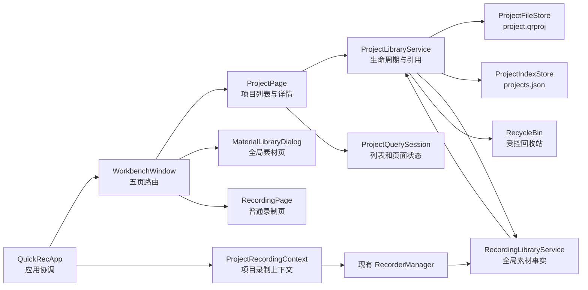
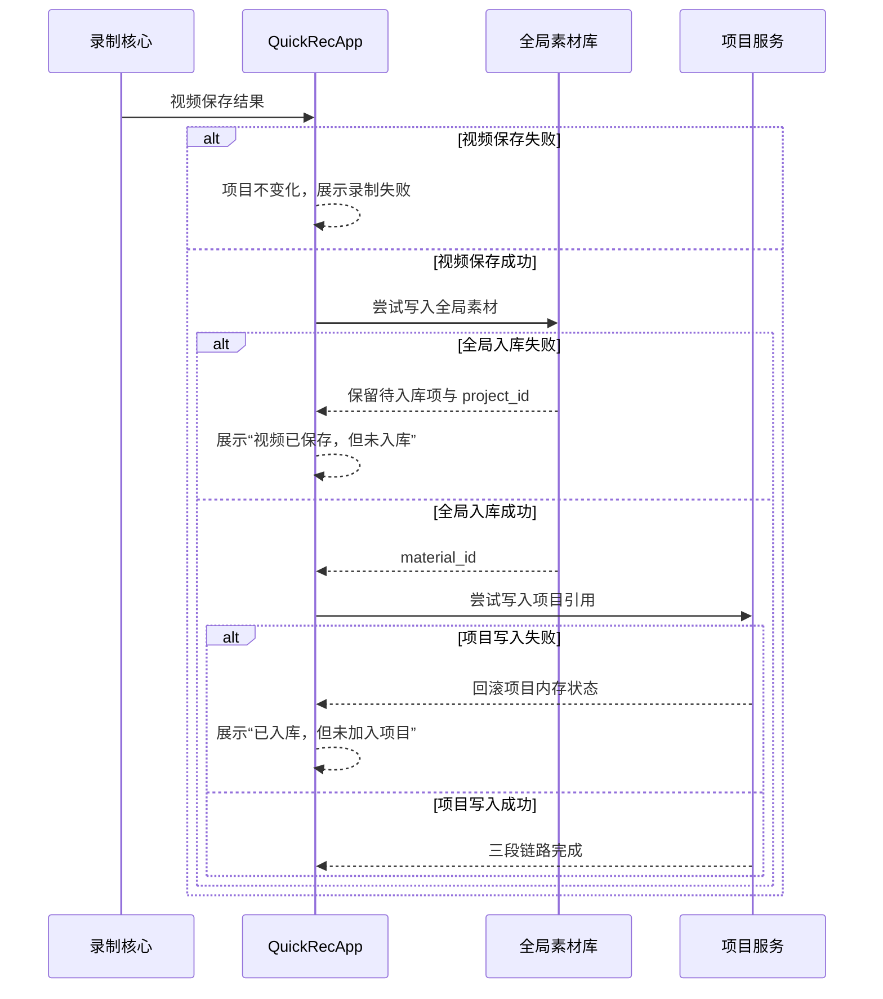
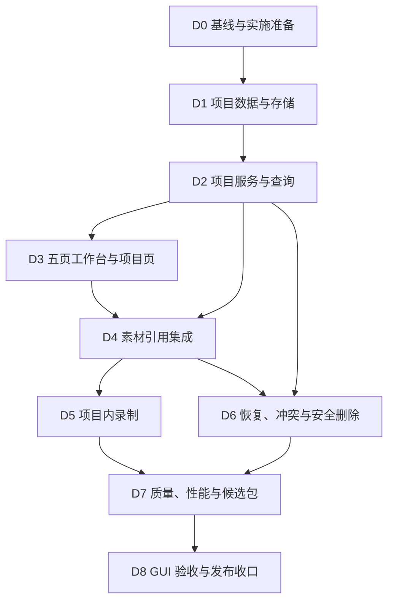

# QuickRec Full v1.9 开发计划

## 0. 追踪信息

| 项目 | 内容 |
| --- | --- |
| 当前状态 | D0-D8 已完成；GUI 手动验收 24/24 通过，已进入正式发布 |
| 目标版本 | QuickRec Full v1.9 |
| 当前正式版本 | v1.9 |
| 上游需求 | `IDEA-001`、`IDEA-010` |
| 需求池 | `doc/archive/ideas/mypm-idea-pool-post-v1.8-2026-07-26.md` |
| 需求事实源 | `doc/releases/v1.9/prd.md` |
| 交互事实源 | `doc/releases/v1.9/prototype/` |
| 状态事实源 | `doc/releases/v1.9/progress.md` |
| 开发日志 | `doc/releases/v1.9/dev_log.md` |
| 缺陷记录 | 验收发现真实缺陷时创建 `doc/releases/v1.9/bugfix-log.md` |
| 当前 Full 路径 | `E:\codex\QuickRec` |
| 当前 Full 分支 | `master`；历史实施分支为本地 `feature/v1.9-project-workspace` |
| 当前基线 | `v1.8` / `57dbc524a31526e5f4ff64b305169c329a200c69` |
| QuickRec Lite | `E:\codex\QuickRec-Lite`，不进入本版范围 |
| PRD 确认 | 已获得（2026-07-26） |
| 原型确认 | 已获得（2026-07-26） |
| 进入业务实现授权 | 已获得（2026-07-26） |
| 最后更新 | 2026-07-27 |

## 1. 执行基线

### 1.1 当前阶段

当前是 **开发承接**，不是需求重新定义，也不是业务实现。本文把已确认的 PRD 和高保真原型转为可执行顺序、影响文件、测试门禁和回退点。

业务实现必须满足：

1. 事实源为 `prd.md`、本文件和 `progress.md`。
2. 严格按 D0-D8 顺序推进；每轮只处理当前授权的任务 ID。
3. 完成任务后同步更新 `progress.md`。
4. 实现过程进入 `dev_log.md`，缺陷进入 `bugfix-log.md`，不写入 progress 主体。
5. 未发现需求契约变化时不重写 PRD。
6. 需求契约、数据安全或删除语义发生变化时，停止实现并返回 PRD 确认。

### 1.2 版本目标

在保持 v1.8 快速录制、中央素材库、120 FPS、设置和诊断行为兼容的前提下：

1. 新增工作台“项目”一级页面。
2. 建立中央项目索引与独立 `.qrproj` 项目文件。
3. 完成项目创建、打开、重命名、归档、恢复和安全删除。
4. 支持一个素材被多个项目引用，不复制或移动视频。
5. 支持从项目内发起全屏、区域和窗口录制。
6. 把“视频保存、全局入库、项目引用”作为三个独立结果。
7. 支持项目缺失、损坏、备份恢复、只读和外部修改冲突。
8. 只做项目所需的最小职责拆分，不全量重写现有大类。

### 1.3 本次不包含

- 素材预览、静态首帧、项目封面、标签、收藏或复杂分类。
- 时间线、多轨、剪辑、导出队列。
- AI、字幕、摘要、章节、云同步或协作。
- 数据库、后台服务或网络 API。
- WGC、多显示器、4K、144/165/240 FPS 正式能力。
- 视频复制到项目目录、永久删除或项目文件关联。
- QuickRec Lite 改动。
- `QuickRecApp`、`WorkbenchWindow`、`MaterialLibraryDialog` 或录制核心的全量重写。

## 2. PRD 对照表

| 需求编号 | PRD 范围 | 开发模块 | 主要任务 | 主要验收 |
| --- | --- | --- | --- | --- |
| REQ-19-01 | 中央索引、`.qrproj`、备份和 schema | D1 项目数据与存储 | D1.1-D1.18 | 创建、加载、原子写入、损坏恢复 |
| REQ-19-02 | 项目生命周期和列表查询 | D2 项目服务与查询 | D2.1-D2.19 | 创建、打开、重命名、归档、恢复 |
| REQ-19-03 | 五页工作台与项目页面 | D3 工作台项目页 | D3.1-D3.23 | 路由、列表、详情、弹窗、DPI |
| REQ-19-04 | 素材多项目引用 | D4 素材引用集成 | D4.1-D4.18 | 加入、移出、共享、待关联 |
| REQ-19-05 | 项目内三类录制和三段结果 | D5 项目录制协调 | D5.1-D5.20 | 视频、入库、项目引用独立反馈 |
| REQ-19-06 | 缺失、损坏、冲突和只读 | D6 恢复与冲突 | D6.1-D6.16 | 正确重定位、备份恢复、禁止覆盖 |
| REQ-19-07 | 安全删除与回收站 | D6 安全删除 | D6.17-D6.29 | 默认不选视频、共享禁删、部分失败 |
| REQ-19-08 | 性能、质量、打包和回归 | D7-D8 | D7.1-D8.24 | 80% 门禁、100/200 样本、GUI 验收 |

## 3. 技术边界

### 3.1 目标模块关系



### 3.2 职责规则

- UI 只收集输入、展示状态和发出信号，不直接读写 JSON。
- 项目文件是项目详情事实源；中央索引是发现、列表和最近状态快照。
- 项目存储负责 schema、原子写入、备份、损坏归档和路径规范化。
- 项目服务负责生命周期、素材引用、共享判定、删除编排和事务回滚。
- 项目查询会话负责搜索、活跃/归档范围、选中状态和分页/长列表状态。
- `QuickRecApp` 只增加项目路由和录制上下文，不承载项目 schema。
- 全局素材库继续是素材事实源，项目仅保存稳定 ID 和最小快照。
- 回收站继续复用 `src/utils/recycle_bin.py`，不新增永久删除路径。

### 3.3 写入顺序

项目内录制成功后的顺序固定为：



## 4. 文件与模块影响

以下为计划影响面，不代表已经授权创建或修改。

### 4.1 计划新增

| 文件 | 责任 |
| --- | --- |
| `src/utils/project_store.py` | 项目模型、中央索引、`.qrproj`、schema、原子写入、备份与损坏归档 |
| `src/services/project_library.py` | 生命周期、引用、共享判定、冲突和安全删除编排 |
| `src/services/project_query.py` | 活跃/归档/健康状态、最近项目和项目素材查询 |
| `src/ui/project_page.py` | 可嵌入项目页、列表、详情和状态展示 |
| `src/ui/project_dialogs.py` | 创建、打开、重命名、素材选择、恢复和安全删除弹窗 |
| `tests/test_project_store.py` | schema、路径、原子写入、备份和损坏恢复 |
| `tests/test_project_library.py` | 生命周期、引用、事务、冲突和删除 |
| `tests/test_project_query.py` | 列表、最近项目、健康和性能样本 |
| `tests/test_project_page.py` | 项目页和弹窗 GUI 契约 |
| `tests/fixtures/v1_9/` | 正常、缺失、损坏、只读、冲突和共享项目夹具 |

实际实现可在不改变职责边界的前提下调整文件名；调整后必须同步本文和 progress。

### 4.2 计划修改

| 文件 | 影响 |
| --- | --- |
| `src/config.py` | 新增 `project_root_path` 默认值和持久化兼容 |
| `src/ui/settings_dialog.py` | 新增默认项目位置，复用显式保存事务 |
| `src/ui/workbench_window.py` | 增加 `PROJECTS` 页面、导航标签和图标 |
| `src/ui/workbench_pages.py` | 录制结果与项目录制摘要的最小协调接口 |
| `src/ui/material_library_dialog.py` | 增加“加入项目”入口，继续复用现有查询会话 |
| `src/ui/design_system.py` | 补齐项目页所需的既有风格组件和图标 |
| `src/main.py` | 注入项目服务、页面路由和项目录制上下文 |
| `src/services/material_ingestion.py` | 待入库项保留可选目标 `project_id` |
| `src/services/pending_recordings.py` | 重试成功后继续项目引用尝试 |
| `src/utils/pending_recording_store.py` | 兼容保存可选项目上下文，不破坏旧记录 |
| `src/utils/recycle_bin.py` | 仅在现有接口不足时增加可判断的分项结果 |
| `tests/test_config.py` | 默认路径、保存失败和升级兼容 |
| `tests/test_workbench_window.py` | 五页路由、页面记忆和脏状态保护 |
| `tests/test_material_library_dialog.py` | 素材加入项目入口和禁用状态 |
| `tests/test_main_workflow.py` | 项目内三类录制和三段结果 |
| `tests/test_pending_recordings.py` | 带项目上下文的重试和幂等 |
| `tests/test_recycle_bin.py` | 项目/视频回收站分项结果 |
| `tests/test_packaging_config.py` | 新模块和资源进入打包产物 |
| `pyproject.toml` | 新模块纳入 ruff、mypy 和 coverage |
| `build_std.spec` | 仅在新增静态资源需要时更新 |
| `.github/workflows/ci.yml` | 保持 master/test/PR/tag 质量和 packaging 门禁 |

### 4.3 明确不修改

- `E:\codex\QuickRec-Lite\**`
- dxcam、音频捕获、视频编码和 120 FPS 核心算法，除非回归测试暴露真实兼容缺陷。
- v1.8 tag、既有发布包和历史 release 文档。
- 全局素材索引 schema，除非 PRD 重新确认。

## 5. 实施顺序



原则：

- D1 未通过前不进入项目 UI。
- D2 未闭合事务语义前不接素材或录制。
- D4 未证明多项目引用安全前不实现项目删除。
- D5 必须先写三段失败测试，再接现有录制链路。
- D6 删除链路是独立高风险批次，必须使用受控文件和真实回收站验证。
- D7 候选包身份锁定后才能进入 D8。

## 6. 模块实施任务

### D0 基线、分支与文档准备

目标：固定 v1.8 基线，获得业务实现授权，并建立可回退的实施环境。

涉及：Git 状态、v1.9 正式文档、`dev_log.md`。

完成标准：

- PRD、原型、dev plan、progress 均确认。
- Full 实施分支从 v1.8 正式基线创建；不直接在 master 开发。
- Lite 状态单独记录且保持干净。
- 全量自动化、静态和 packaging 基线有真实结果。

### D1 项目数据与存储

目标：先建立不依赖 Qt 的、可恢复的本地数据契约。

实施要点：

- 定义 `ProjectFile`、`ProjectMaterialRef`、`ProjectIndexEntry` 和可判断结果类型。
- `project_id` 使用随机稳定 ID；路径比较遵循 Windows 大小写不敏感规范。
- `projects.json` 与 `project.qrproj` 均采用同目录临时文件、刷新、原子替换。
- 每次覆盖有效项目文件前生成 `.bak`。
- 损坏主文件先归档，再显式恢复备份；无备份不创建空项目。
- 中央索引可从备份恢复并可扫描已知项目根目录重建。
- schema 不兼容返回明确状态，不静默迁移或覆盖。
- 中文、空格、长路径、只读和被占用文件纳入测试。

完成标准：

- 存储模块不依赖 Qt。
- 所有写入失败均有阶段化结果，内存和磁盘状态可核对。
- 有效、缺失、损坏、只读和版本不兼容状态可区分。

### D2 项目服务与查询

目标：把生命周期、引用和文件事务从 UI、`QuickRecApp` 中隔离。

实施要点：

- 创建、打开、登记、重命名、归档、恢复均先验证后提交。
- 同 ID 新路径必须返回冲突结果，由 UI 决定更新或取消。
- 写入前检查外部修改指纹；冲突时禁止静默覆盖。
- 项目引用按 `material_id` 去重；一个素材允许属于多个项目。
- 项目写入失败回滚候选内存状态。
- 项目查询支持最近 8 个、活跃、归档、健康和文件名过滤。
- 共享判定扫描所有可读取项目；缺失、损坏或不可读导致“不确定”。
- 单项目写入串行，批量操作返回逐项结果。

完成标准：

- 服务层不依赖具体 Qt 控件。
- 项目生命周期与文件事实一致。
- 共享、独占和不确定三态可测试、可解释。

### D3 五页工作台与项目页面

目标：按已确认原型把项目能力嵌入唯一工作台。

实施要点：

- `WorkbenchPage` 增加 `PROJECTS`，顺序保持录制、素材库、项目、设置、诊断。
- 应用首次打开仍进入录制页；同进程内恢复上次页面。
- 项目页采用同页列表＋详情，不创建第二个主窗口。
- 实现空、正常、归档、缺失、损坏、只读、冲突和部分失败状态。
- 创建表单读取默认项目位置，允许单次覆盖但不反写全局默认。
- 设置页新增默认项目位置并复用显式保存/放弃/取消事务。
- 长名称、中文空格路径、100 项目列表和 960×640 最小窗口可用。
- 所有危险操作使用明确确认，不使用字符图标或风格不一致图标。

完成标准：

- 原型中的项目主链路和状态均有实现映射。
- UI 不直接写 JSON。
- 页面打开、关闭、重开和切页不产生重复实例或脏状态丢失。

### D4 素材多项目引用

目标：安全连接全局素材事实与项目引用。

实施要点：

- 项目页“添加素材”复用现有素材查询和多选能力。
- 素材详情“加入项目”只展示可写、活跃项目。
- 已加入当前项目的素材不可重复添加。
- 缺失素材不可新增引用；共享素材可以加入多个项目。
- “从项目移除”只修改当前项目文件。
- 全局素材重新定位后，项目详情按 `material_id` 使用新路径。
- 全局素材缺失时保留项目快照并显示待关联。
- 批量加入按项目返回成功/失败，不用部分成功冒充全部成功。

完成标准：

- 同一素材加入两个项目、移出一个项目后，另一个项目和视频均不变化。
- 全局素材索引不因项目操作被重写或降级。

### D5 项目内录制协调

目标：复用现有录制能力，并安全保存项目归属。

实施要点：

- 引入最小 `ProjectRecordingContext` 或等价状态，只保存来源和目标项目 ID。
- 项目详情提供全屏、区域、窗口三个平级入口。
- 录制前再次校验项目存在、可写且处于活跃状态。
- 视频保存、全局入库、项目引用分别记录。
- 全局入库失败时，待入库记录保留可选 `project_id`。
- 重试入库成功后，仅在目标项目仍有效时尝试写引用。
- 项目写入失败后提供从素材库手动加入项目的恢复路径。
- 普通录制页、托盘和快捷键不弹出项目选择、不自动归属。
- 120 FPS、区域/窗口 60 FPS 规则完全沿用 v1.8。

完成标准：

- 三种项目内录制均可产生正确三段结果。
- 任一后置失败不改写视频已保存事实。
- 重试操作幂等，不产生重复素材或重复项目引用。

### D6 缺失、损坏、冲突与安全删除

目标：闭合高风险恢复和删除链路。

实施要点：

- 缺失项目重新定位只接受相同 `project_id` 的有效文件。
- 损坏项目保留原文件；有效备份须经确认才恢复。
- 无备份时只提供诊断和从中央列表移除，不伪造空项目。
- 只读项目允许查看，禁用所有写操作。
- 外部修改冲突提供重新加载或取消，禁止静默覆盖。
- 删除对话框默认不选择任何视频。
- 只有可证明独占且存在的素材可以选择移入回收站。
- 共享、不确定和缺失素材禁用视频删除。
- 项目文件与选中视频只进入 Windows 回收站。
- 任何回收站部分失败都保留项目，并展示逐项结果。
- 项目文件成功回收但中央索引移除失败时保留可诊断状态。
- 取消操作不得修改项目、索引或视频。

完成标准：

- 没有永久删除代码路径。
- 无法证明独占时一律不允许删除视频。
- 部分成功被准确表达，且保留恢复可能。

### D7 质量、性能、CI 与候选包

目标：完成自动化、性能、打包和候选身份锁定。

实施要点：

- 新增/修改项目模块语句覆盖率不低于 80%。
- 项目总体覆盖率保持不低于 80%。
- 新模块纳入 ruff、mypy、compileall 和 CI。
- 使用 100 项目、每项目 200 引用的受控夹具测量查询与打开。
- 项目列表和打开项目在本地 SSD 样本中不超过 1 秒。
- 普通项目写操作 500 ms 内给出结果反馈；慢文件操作保持 UI 响应。
- packaging 验证新模块、图标和资源存在。
- 独立生成 v1.9 候选包并记录 EXE、FFmpeg、FFprobe 和目录身份。

完成标准：

- 自动化、静态、覆盖率、性能和 packaging 全部通过。
- 候选包路径、分支、HEAD、时间和 SHA256 被锁定。

### D8 GUI 验收与发布收口

目标：使用锁定候选包完成真实 Windows 桌面证据。

验收范围：

- 五页工作台、项目页单实例和设置默认项目位置。
- 创建、打开、重命名、归档、恢复和删除。
- 同一素材加入多个项目、移出一个项目和全局重新定位。
- 项目内全屏、区域、窗口录制。
- 视频保存、入库、项目引用三段失败注入。
- 缺失、损坏、备份恢复、只读和外部冲突。
- 独占、共享、不确定素材和 Windows 回收站部分失败。
- 100 项目、200 引用和 100%/125%/150% DPI。
- v1.8 三类录制、四类音频、30/60/120 FPS、素材库、设置和诊断回归。
- QuickRec Lite 未修改。

完成标准：

- 所有发布阻塞项有真实候选包证据通过。
- `manual-verification.md`、`verification.md`、`progress.md` 状态一致。
- Acceptance 通过前不得写正式发布、打 tag 或创建 Release。

## 7. 测试与验收计划

### 7.1 定向自动化

对应模块创建后执行：

```powershell
python -m pytest tests/test_project_store.py -q
python -m pytest tests/test_project_library.py tests/test_project_query.py -q
python -m pytest tests/test_project_page.py tests/test_workbench_window.py -q
python -m pytest tests/test_material_library_dialog.py tests/test_recording_library.py -q
python -m pytest tests/test_main_workflow.py tests/test_pending_recordings.py -q
python -m pytest tests/test_recycle_bin.py tests/test_project_library.py -q
```

### 7.2 回归与质量

```powershell
python -m pytest -q
python -m pytest --cov=src --cov-report=term-missing --cov-fail-under=80
python -m pytest -m packaging -q
python -m ruff check src tests scripts
python -m mypy
python -m compileall -q src tests scripts
git diff --check
```

新增测试文件尚未创建时不提前执行对应单文件命令，也不能把“文件不存在”写成产品失败。

### 7.3 原型回归

```powershell
node doc/releases/v1.9/prototype/validation/validate-prototype.js
```

实现发生 UI 取舍时，先更新 PRD/原型映射并获得确认；不得让代码静默偏离原型。

### 7.4 性能样本

建议新增受控脚本或测试夹具，记录：

- 100 个项目的索引加载和首次展示时间。
- 单项目 200 引用的加载、查询和详情构建时间。
- 共享判定扫描时间。
- 单项目普通写入的磁盘耗时和 UI 反馈时间。
- 超时环境、文件占用和只读路径下的失败阶段。

性能结果写入 `verification.md`，不写入 progress 任务流水。

### 7.5 候选包

```powershell
python -m PyInstaller build_std.spec --clean --noconfirm `
  --distpath E:\QRtest\QuickRec-v1.9-dist `
  --workpath E:\QRtest\QuickRec-v1.9-build
```

候选包必须：

- 与当时分支、HEAD 和 dirty 状态绑定。
- 记录 `QuickRec.exe`、包内 FFmpeg/FFprobe 和发布目录 SHA256。
- 使用隔离 APPDATA、项目目录、素材索引、日志和录制输出。
- 不读取、覆盖或删除用户真实项目、素材和视频。

### 7.6 GUI 手动验收

`manual-verification.md` 至少记录：

- 操作时间、候选身份、前置数据和隔离路径。
- 操作、预期、实际、截图、JSON、日志和文件系统证据。
- 结论：通过、部分通过、未通过或待验证。
- 配置、ACL、回收站样本、进程和临时依赖恢复状态。

代码阅读、自动化测试和原型截图不能代替必须实际点击的项目生命周期与回收站证据。

## 8. 开发日志约定

实施开始时创建 `doc/releases/v1.9/dev_log.md`，按批次记录：

- 日期、分支、HEAD 和 dirty 状态。
- 本轮任务 ID、允许范围和实际影响文件。
- 关键实现取舍与数据契约变化。
- 实际运行的测试及结果。
- 未验证项和下一步。

不记录：

- 用户项目描述全文、完整私人路径或视频内容。
- 临时调试输出和大段原始日志。
- progress 已表达的重复 checklist。

真实缺陷单独进入 `bugfix-log.md`，保留复现、证据、严重度、修复和定向复验。

## 9. 风险与回退

| 风险 | 触发条件 | 影响 | 处理与回退 |
| --- | --- | --- | --- |
| 双层数据不一致 | 项目文件成功但索引失败，或反向失败 | 项目发现或详情错位 | 项目文件为详情事实源；索引可重新登记；不删除项目文件 |
| 原子写入不完整 | 进程中断或磁盘替换失败 | 项目损坏 | 保留主文件、临时文件和 `.bak`；停止写入并恢复 |
| 外部修改被覆盖 | 写入前指纹变化未检测 | 用户修改丢失 | 阻塞提交，要求重新加载或取消 |
| 共享素材误判 | 某项目缺失、损坏或不可读 | 误删共享视频 | 判为“不确定”，禁止选择视频 |
| 删除部分失败 | 视频或项目文件部分进入回收站 | 状态不一致 | 保留项目和逐项结果，禁止显示全部成功 |
| 项目写入污染录制结果 | 项目引用失败被当作录制失败 | 用户误判视频丢失 | 三段结果模型；后置失败不改写前置成功 |
| 待入库上下文破坏兼容 | 旧 pending 记录没有 project_id | 启动重试失败 | 新字段可选；旧记录按普通全局入库处理 |
| UI 大类继续膨胀 | 项目事务进入 `main.py` 或 Qt 类 | 维护成本上升 | 回退该批次，恢复服务边界，不扩大重构 |
| 性能样本失真 | UI 在主线程全量扫描文件 | 卡顿 | 查询与文件健康分层；慢操作异步并显示进行中 |
| 回滚后项目不可见 | 回退 v1.8 | 项目归属不可见 | 保留 `projects.json`、`.qrproj` 和视频，v1.8 继续使用全局素材 |

### 9.1 代码回退

- 正式代码回退点：annotated tag `v1.8`。
- 各里程碑建议独立提交，D1/D2、D3/D4、D5、D6、D7 分开，便于定向回退。
- 不通过删除文件或重写 tag 实现回退。

### 9.2 数据回退

- 回退代码不删除 `projects.json`、`.qrproj`、`.bak`、全局素材索引或视频。
- 严重写入缺陷时先禁用项目写操作，允许只读打开和诊断。
- 只有受控测试数据允许清理；真实用户项目不得用于失败注入。

## 10. 开放问题

当前无产品范围开放问题。实施中只有以下情况需要停止并重新确认：

- 项目数据契约需要改变 PRD 中的 schema 或删除语义。
- 现有素材 200 条上限阻断项目功能并需要修改全局索引契约。
- Windows 回收站无法提供项目文件与视频的可判断分项结果。
- 项目内录制需要修改现有录制核心而非增加协调上下文。
- 性能门禁需要数据库或后台服务才能满足。

以上情况不得在开发计划中自行扩大范围。

## 11. 提交与分支建议

获得实现授权后建议：

1. 从 `master@v1.8` 创建 `feature/v1.9-project-workspace`。
2. 在 `test` 或功能分支完成批次集成，不直接修改 master。
3. D1/D2 数据与服务、D3/D4 UI 与引用、D5 录制、D6 安全链路、D7 收口分别提交。
4. Acceptance 通过前不合并 master、不打 v1.9 tag、不创建 Release。
5. 不移动 v1.8 tag，不修改或推送 Lite 分支。

## 12. 停止点

开发承接已确认，当前执行状态：

```text
PRD：已确认
高保真原型：已确认
开发承接文档：已确认
进入业务实现授权：已获得
D0：已完成
D1：已完成
D2：已完成
D3-D4：已完成
```

实施按 `progress.md` 的 D1-D8 顺序推进，发现契约变化时返回 PRD 确认。
