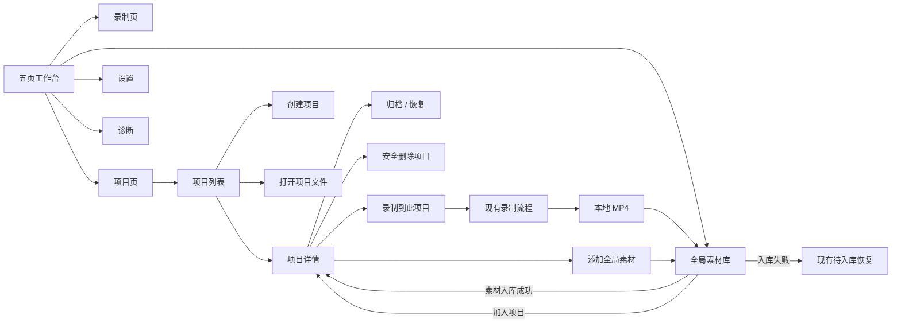
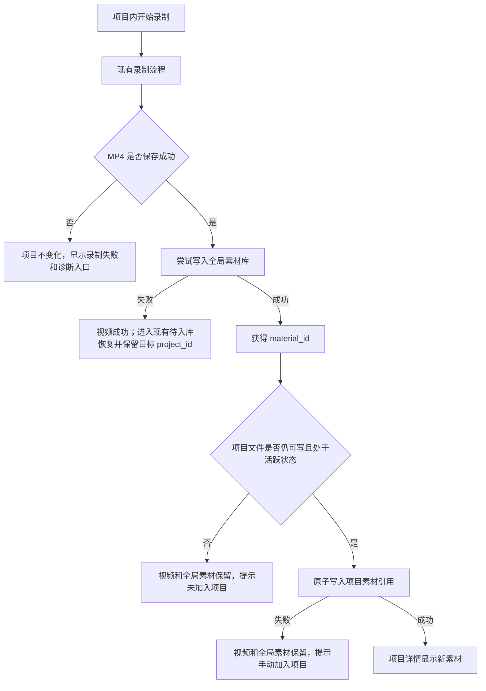
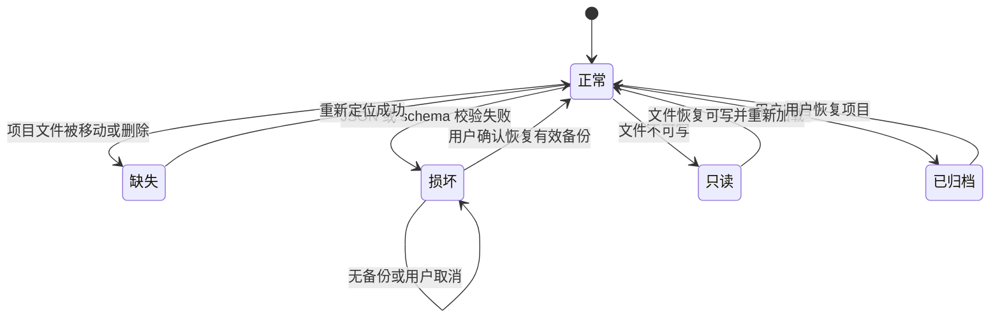
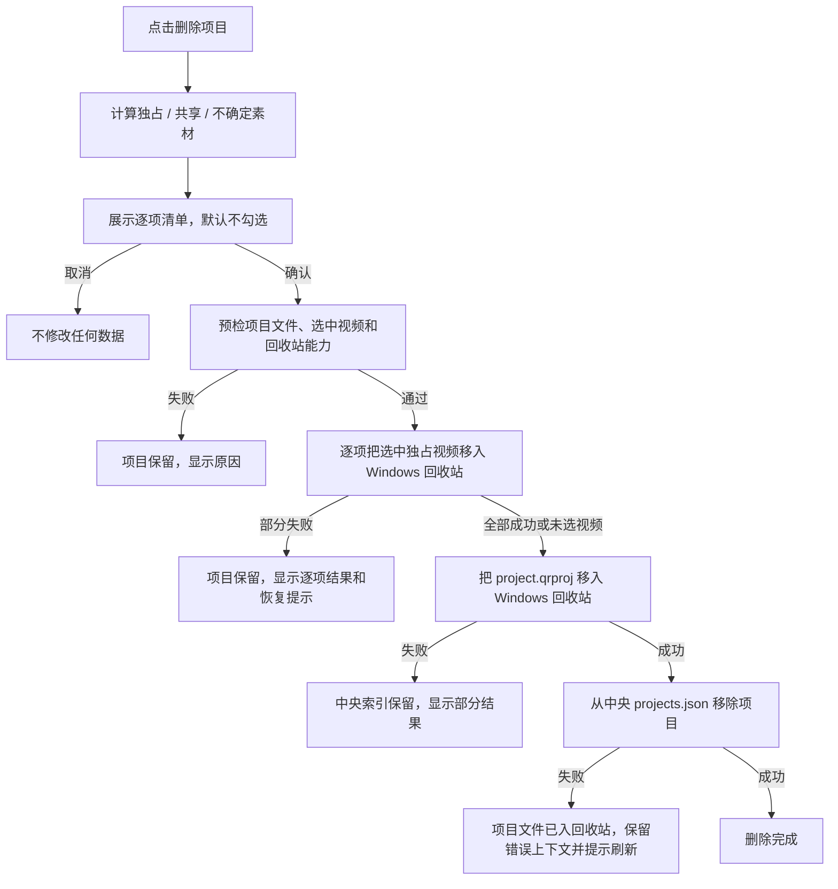
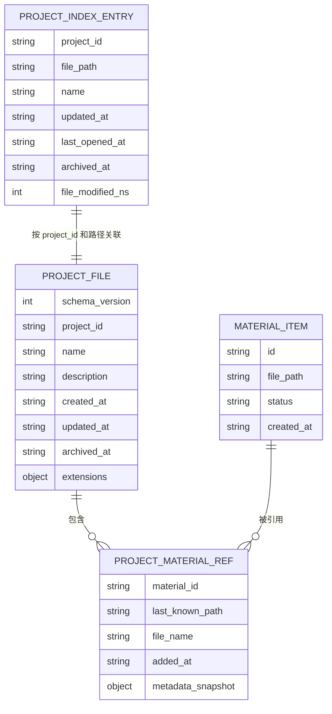
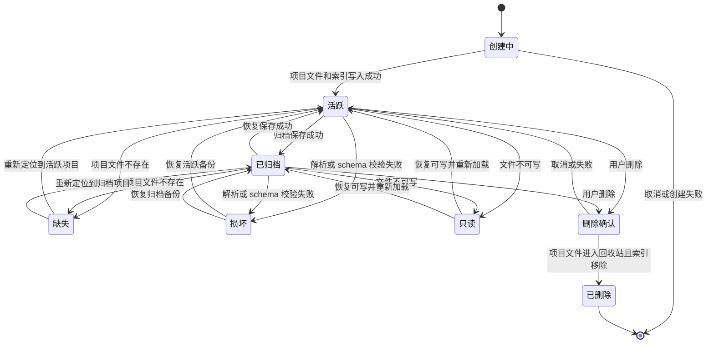

# QuickRec Full v1.9 产品需求文档

## 0. 追踪信息

| 项目 | 内容 |
| --- | --- |
| 产品 | QuickRec Full |
| 目标版本 | v1.9 |
| 文档版本 | PRD v1.0 |
| 当前状态 | PRD、高保真原型与开发承接已确认，已进入实施 |
| PRD 类型 | 正式推进型，包含高保真原型确认门禁 |
| 当前正式版本 | v1.8 |
| 编写日期 | 2026-07-26 |
| 上游来源 | `IDEA-001`、`IDEA-010` |
| 上游需求池 | `doc/archive/ideas/mypm-idea-pool-post-v1.8-2026-07-26.md` |
| 当前事实源 | `README.md`、`doc/current.md`、`doc/releases/v1.8/`、当前代码 |
| 原型输出目录 | `doc/releases/v1.9/prototype/` |
| 下游承接 | `doc/releases/v1.9/dev_plan.md`、`doc/releases/v1.9/progress.md` |
| 产品线边界 | 仅 QuickRec Full；不修改 QuickRec Lite |
| 开发授权 | 开发承接与业务实现授权均已获得（2026-07-26） |

### 0.1 阶段判断

v1.9 是 QuickRec Full 从“统一录制工作台”向“项目化创作工作台”演进的第一个正式版本。当前方向已经通过需求池压力测试并由产品负责人确认，进入正式推进型 PRD。

项目模型会引入新的本地文件、引用关系、归档和删除语义，因此必须先完成高保真交互原型并获得确认，之后才能进入 PyQt 实现。原型确认不是需求价值验证，而是数据安全、页面关系和操作语义的实现门禁。

### 0.2 需求状态

- 需求来源：v1.8 发布后 Review、`IDEA-001` 项目工作区基础、产品负责人对完整工作台路线的明确决策。
- 证据基础：
  - v1.8 已经提供五层基础中的统一工作台壳、中央素材库、录制、设置和诊断能力。
  - 当前中央素材索引无法表达多个录制素材属于同一创作任务。
  - 历史 Full 原型长期包含项目化创作方向。
  - 项目化使用频率仍缺少广泛用户数据，因此 v1.9 必须限制为最小项目闭环。
- 已确认假设：项目是素材引用和创作上下文的容器，不拥有或复制原始视频。
- 待确认问题：无产品范围阻塞；等待开发承接文档确认和业务实现授权。
- 完整 PRD 门禁：文档与高保真原型均已确认。

---

## 1. 版本定位

### 1.1 一句话目标

在不改变 QuickRec 现有快速录制和全局素材库行为的前提下，为创作者提供安全、可迁移、可恢复的本地项目工作区，把多次录制和已有素材组织到同一个创作任务中。

### 1.2 当前版本目标

v1.9 只完成“项目工作区基础”：

1. 在工作台中新增“项目”一级页面。
2. 支持项目创建、打开、重命名、归档、恢复和安全删除。
3. 支持将全局素材引用到一个或多个项目。
4. 支持从项目内发起录制，并把成功素材自动加入当前项目。
5. 建立中央项目索引和独立 `.qrproj` 项目文件。
6. 支持项目文件移动、缺失、损坏、备份恢复和外部修改冲突。
7. 为未来多轨保留稳定 ID、schema 版本和扩展字段，但不提前定义轨道或时间线。
8. 只做支撑本链路的最小职责拆分，不全量重写现有应用。

### 1.3 版本成功定义

v1.9 成功必须同时满足：

- 用户能在五页工作台中完成项目创建、打开和项目素材管理。
- 同一个素材可以安全地被多个项目引用，不产生视频副本。
- 项目内录制成功后，视频先进入全局素材库，再加入目标项目。
- 项目保存或引用写入失败不改写“视频已经保存”的事实。
- 删除项目不会默认删除任何视频，共享视频不能随单个项目删除。
- 项目文件和中央索引均采用原子写入和备份恢复，不把损坏文件静默当作空项目。
- v1.8 的全屏、区域、窗口录制、四类音频、120 FPS、素材库、设置和诊断无回归。
- 高保真原型、自动化、打包程序 GUI、DPI 和文件安全验收全部通过。

---

## 2. 方案收敛与优先级

### 2.1 候选方案

| 方案 | 说明 | 优点 | 代价与风险 | 结论 |
| --- | --- | --- | --- | --- |
| A：仅中央项目索引 | 所有项目都保存在 `%APPDATA%` 的单一文件 | 实现最简单 | 项目不可独立迁移，损坏影响面集中 | 不采用 |
| B：仅独立项目文件 | 每个项目只有独立 `.qrproj`，不维护中央索引 | 文件可迁移 | 最近项目、缺失项目和发现能力较弱 | 不采用 |
| C：中央索引＋独立项目文件 | 中央索引负责发现与最近状态，独立文件保存项目详情 | 兼顾发现、迁移、恢复和未来扩展 | 需要双层一致性和冲突处理 | **采用** |

### 2.2 推荐方案

采用方案 C：

- `%APPDATA%\QuickRec\projects.json` 维护项目入口索引。
- 每个项目使用独立 `project.qrproj` 保存项目详情。
- 项目文件默认位于用户视频目录下，可在设置中修改默认项目根目录，也可在创建单个项目时另选位置。
- 项目只保存素材引用和最小元数据快照，不复制视频。
- 项目与素材是多对多关系。
- 项目文件是项目详情事实源；中央索引只保存发现和列表所需的快照。

### 2.3 优先级表

| 范围 | 优先级 | 进入 v1.9 | 理由 | 主要风险 |
| --- | --- | --- | --- | --- |
| 中央项目索引与独立项目文件 | P0 | 是 | 所有项目能力的数据基础 | 双层一致性、损坏恢复 |
| 项目创建、打开、重命名 | P0 | 是 | 最小可用项目闭环 | 保存失败、路径冲突 |
| 项目归档、恢复、安全删除 | P0 | 是 | 生命周期和数据安全边界 | 误删视频、部分失败 |
| 素材多项目引用 | P0 | 是 | 解决项目化整理问题 | 共享引用判断 |
| 项目内录制自动归属 | P0 | 是 | 项目与录制核心链路 | 入库和项目写入分步失败 |
| 项目文件缺失、损坏和备份恢复 | P0 | 是 | 防止项目数据不可恢复 | 静默覆盖或空项目 |
| 高保真 HTML 原型 | P0 | 是 | PyQt 实现前交互门禁 | 原型与实现偏差 |
| 工作台与素材库最小职责拆分 | P1 | 是 | 控制新功能耦合 | 借机全量重构 |
| 项目列表和项目素材的基础查询 | P1 | 是 | 100 项目和 200 引用下可用 | 查询状态重复 |
| 素材预览、多轨、剪辑和导出 | P3 | 否 | 属于后续完整工作台阶段 | 范围失控 |

### 2.4 v2.0 前路线边界

完整工作台不要求在 v1.9 一次完成，但必须在 v2.0 前闭合，原则上不超过以下版本：

| 版本 | 唯一产品主线 | 不得提前混入 |
| --- | --- | --- |
| v1.9 | 项目工作区基础 | 预览、多轨、剪辑、导出 |
| v1.9.1 | 素材预览 | 多轨、剪辑、导出 |
| v1.9.2 | 多轨时间线基础 | 完整剪辑和导出队列 |
| v1.9.3 | 基础剪辑 | AI、云同步 |
| v1.9.4 | 导出队列和完整链路验收 | AI、云同步 |
| v2.0 | 完整工作台正式版 | 未经重新立项的扩展能力 |

目标是在 v1.9 获得开发授权后约 8～10 周内完成该路线。若某个子版本延期，应优先缩减该子版本的增强项，不继续增加没有边界的新版本。

---

## 3. 背景与问题

### 3.1 当前产品事实

QuickRec Full v1.8 已正式发布：

- 工作台包含录制、素材库、设置、诊断四个一级页面。
- 全局素材库使用 `%APPDATA%\QuickRec\recordings.json`。
- 素材具有稳定 ID、文件路径、时间、录制模式、音频模式、时长、分辨率、FPS、文件大小和状态。
- 全局素材库支持搜索、筛选、排序、迁移、重建、重新定位、仅移除索引和移入回收站。
- 录制结果会先保存 MP4，再尝试写入全局素材库。
- 工作台和素材库尚不存在项目实体或素材归属关系。

### 3.2 问题定义

#### P-01 全局素材库不能表达创作任务

同一教程、演示或课程可能需要多次录制。当前用户只能通过文件名、路径和时间识别素材，无法在 QuickRec 内表达这些素材属于同一个任务。

#### P-02 文件夹替代方案缺少应用内状态

用户可以手工创建文件夹，但文件夹无法表达：

- 同一个素材同时服务多个项目；
- 项目归档状态；
- 素材缺失后的全局恢复；
- 项目内录制自动归属；
- 未来时间线和多轨所需的稳定项目身份。

#### P-03 项目数据存在误删和损坏风险

项目引用真实视频。若项目删除与视频删除语义不清，可能误删被其他项目使用的素材；若项目文件损坏后静默创建空项目，会让用户误以为项目内容已经丢失。

#### P-04 当前大类不适合继续堆叠项目逻辑

`QuickRecApp`、工作台页面和 `MaterialLibraryDialog` 已承担较多协调、状态与 UI 职责。项目模型需要独立的数据和服务边界，但本版不允许借机全量架构重写。

---

## 4. 用户角色与核心场景

| 用户角色 | 核心任务 | v1.9 价值 |
| --- | --- | --- |
| 快速录制用户 | 托盘或快捷键立即录制 | 现有链路不变，不被强制要求选择项目 |
| 内容创作者 | 围绕同一教程或演示多次录制 | 将多个素材归入同一个项目 |
| 素材整理用户 | 从历史素材中组合新的创作任务 | 一个素材可加入多个项目 |
| 项目迁移用户 | 移动或备份项目文件 | 独立 `.qrproj` 可原地打开和重新登记 |
| 排障用户 | 处理项目缺失、损坏或保存失败 | 获得明确状态、备份恢复和诊断入口 |

### 4.1 核心场景

#### SC-01 创建项目并开始录制

用户进入项目页，创建项目，在项目详情选择“录制到此项目”，完成全屏、区域或窗口录制。视频进入全局素材库，并自动成为项目素材。

#### SC-02 把已有素材加入项目

用户在项目详情打开素材选择器，搜索、筛选并多选全局素材；也可以在素材库详情中选择“加入项目”。

#### SC-03 同一素材服务多个项目

用户把一个素材加入两个不同项目。移出其中一个项目只删除该项目中的引用，不改变另一个项目，也不删除视频。

#### SC-04 归档和恢复项目

用户完成阶段性工作后归档项目。项目从活跃列表隐藏并变为只读；恢复后重新允许录制和素材调整。

#### SC-05 安全删除项目

用户删除项目时看到项目引用的视频清单。默认不选择任何视频；独占素材可选择移入回收站，共享素材禁用删除。取消不改变任何数据。

#### SC-06 打开移动后的项目文件

用户通过“打开项目文件”选择外部 `.qrproj`。QuickRec 验证文件后原地登记；相同项目 ID 出现在新路径时，用户确认更新项目位置。

#### SC-07 项目文件损坏恢复

项目文件无法解析时，QuickRec 保留损坏文件并检查 `.bak`。有可用备份时由用户确认恢复；无备份时不创建空项目。

---

## 5. 信息架构

### 5.1 工作台结构

```text
QuickRec Full 工作台
├── 录制
├── 项目
│   ├── 项目列表
│   │   ├── 最近项目
│   │   ├── 全部活跃项目
│   │   └── 已归档项目
│   └── 项目详情
│       ├── 项目信息
│       ├── 录制到此项目
│       ├── 项目素材
│       └── 归档 / 恢复 / 删除
├── 素材库
├── 设置
└── 诊断
```

导航顺序固定为：

```text
录制 -> 项目 -> 素材库 -> 设置 -> 诊断
```

应用启动、工作台首次打开和应用重启后的默认页面仍为“录制”，不得因新增项目页改变 v1.8 快速录制心智。

### 5.2 页面关系图



### 5.3 同进程页面和项目状态

- 工作台继续保持全局单实例。
- 同一进程重新打开工作台时恢复上次一级页面。
- 同一进程重新进入项目页时恢复上次已打开项目。
- 应用重启后，工作台首次进入录制页；用户进入项目页时先展示项目列表，不自动打开上次项目。
- 项目详情和项目列表是同一个一级页面内的两个视图，不新增第二个一级导航项。

---

## 6. 完整功能链路

### 6.1 创建项目

#### 入口

- 项目空状态“创建第一个项目”。
- 项目列表页“新建项目”。

#### 创建表单

| 字段 | 规则 |
| --- | --- |
| 项目名称 | 必填；去除首尾空格后不能为空 |
| 项目描述 | 选填；支持多行文本 |
| 项目位置 | 默认取设置中的项目根目录；本次可单独修改 |

默认项目根目录：

```text
%USERPROFILE%\Videos\QuickRec\Projects
```

单个项目的物理结构：

```text
<项目根目录>\<project-id>\project.qrproj
<项目根目录>\<project-id>\project.qrproj.bak
```

项目目录使用稳定 `project-id`，重命名项目不得自动重命名物理目录。

#### 主流程

1. 用户填写项目名称、描述和位置。
2. QuickRec 检查目标父目录存在或可创建、目录可写、目标项目目录不存在。
3. 生成稳定 `project_id`。
4. 原子写入 `project.qrproj`。
5. 原子更新中央 `projects.json`。
6. 创建成功后进入项目详情。

#### 失败与取消

- 取消：不创建目录、不写项目文件、不更新中央索引。
- 项目文件写入失败：清理本次临时文件，不更新中央索引。
- 项目文件成功但中央索引失败：保留项目文件，明确提示“项目已创建，但未加入最近项目”，提供重新登记入口和文件路径。
- 不允许把失败状态显示为创建成功。

### 6.2 打开和登记项目文件

#### 入口

- 项目列表“打开项目文件”。
- 项目缺失状态“重新定位项目文件”。

#### 主流程

1. 用户选择 `.qrproj` 文件。
2. 验证文件存在、为普通文件、可读取、JSON 可解析、schema 受支持、必填字段完整。
3. 校验 `project_id`。
4. 若中央索引没有该 ID，原地登记该文件。
5. 若中央索引已有相同 ID 且路径相同，直接打开并更新最近打开时间。
6. 若中央索引已有相同 ID 但路径不同，显示原路径和新路径，用户选择“更新项目位置”或“取消”。
7. 更新位置前不得覆盖项目文件或修改素材引用。

#### 边界

- 不复制外部项目文件。
- v1.9 不提供“导入副本”“复制项目”或 Windows 文件关联。
- 外部文件只读时允许只读打开，但禁用重命名、素材调整、归档、删除和项目内录制。
- 文件验证失败时不更新中央索引。

### 6.3 项目列表

项目页列表视图包含：

- 最近项目：最多展示最近打开的 8 个项目。
- 全部活跃项目：按 `last_opened_at`、`updated_at` 倒序。
- 已归档项目：独立折叠区或标签页。
- 新建项目、打开项目文件。

项目卡片至少展示：

- 项目名称；
- 描述摘要；
- 素材数量；
- 最近更新时间；
- 项目文件位置摘要；
- 活跃、已归档、缺失、损坏、只读状态。

状态优先级：

```text
损坏 > 缺失 > 只读 > 已归档 > 可用
```

v1.9 不新增项目标签、收藏、封面或缩略图。

### 6.4 项目详情

项目详情包含：

- 返回项目列表；
- 项目名称和描述；
- 项目状态和文件位置；
- “录制到此项目”主操作；
- “添加素材”；
- 项目素材列表；
- 重命名；
- 归档或恢复；
- 删除项目；
- 缺失、损坏、只读时的恢复入口。

项目素材列表复用全局素材的：

- 文件名和路径；
- 可用、缺失、元数据不完整状态；
- 时长、分辨率、FPS、模式、音频和大小；
- 打开文件、打开目录、复制路径和重新定位能力。

项目列表内允许按文件名进行最小关键词过滤，但不新增标签、收藏、预览或项目内复杂分类。

### 6.5 重命名

1. 用户打开重命名对话框。
2. 默认填入当前名称。
3. 保存前检查去除首尾空格后不为空。
4. 原子保存项目文件。
5. 成功后更新中央索引名称快照。
6. 项目目录和 `project_id` 不变化。

取消不产生修改；保存失败时保持原名称和原文件。

### 6.6 归档与恢复

#### 归档

- 归档只设置 `archived_at`，不移动项目文件，不删除素材引用。
- 归档项目从活跃列表隐藏并进入“已归档项目”。
- 归档项目为只读。
- 仍允许打开素材文件、目录和复制路径。
- 禁止项目内录制、添加/移除素材、重命名和修改描述。
- 允许恢复和删除项目。

#### 恢复

- 清空 `archived_at`。
- 保存成功后回到活跃项目。
- 保存失败时保持归档状态。

### 6.7 添加素材

#### 项目页入口

1. 用户在项目详情点击“添加素材”。
2. 打开可搜索、筛选、多选的全局素材选择器。
3. 已在当前项目中的素材显示已选并不可重复添加。
4. 用户确认后一次提交本次新增引用。
5. 项目保存成功后刷新素材列表。

#### 素材库入口

1. 用户在全局素材详情点击“加入项目”。
2. 打开活跃项目选择器。
3. 允许将同一素材加入一个或多个活跃项目。
4. 已归档、缺失、损坏或只读项目不可选择，并显示原因。

#### 规则

- 只保存引用和最小快照，不复制或移动视频。
- 同一 `material_id` 在同一项目中最多出现一次。
- 同一个素材可以被多个项目引用。
- 项目写入失败时回滚本次界面变化。
- 批量加入允许逐项目返回成功或失败，不能用部分成功冒充全部成功。

### 6.8 从项目移除素材

- 操作名称固定为“从项目移除”。
- 确认文案明确“只移除项目引用，不删除视频，也不移出全局素材库”。
- 确认后只修改当前项目文件。
- 取消不产生任何修改。
- 保存失败时引用保持不变。
- 不得复用“从素材库移除”或“移入回收站”的危险操作语义。

### 6.9 项目内录制

#### 入口

项目详情点击“录制到此项目”，选择：

- 全屏；
- 区域；
- 窗口。

之后完全复用 v1.8 的前置校验、选择器、倒计时、浮动工具栏、保存和素材入库链路。

#### 结果顺序



#### 规则

- 视频保存、全局素材入库、项目引用写入是三个独立结果。
- 后一步失败不得改写前一步成功事实。
- 现有待入库记录允许增加可选 `target_project_id`。
- 待入库重试成功时，若目标项目仍存在、可写且活跃，则继续尝试加入项目。
- 目标项目已归档、缺失、损坏或删除时，素材只进入全局素材库，并记录原因。
- 项目引用失败后，用户始终可以从素材库手动执行“加入项目”。
- 普通录制页、托盘和快捷键发起的录制仍只进入全局素材库，不弹出项目选择。

### 6.10 项目文件缺失和重新定位

- 中央索引中的项目路径不存在时，项目状态为“项目文件缺失”。
- 缺失项目不允许进入可编辑详情。
- 提供重新定位、从列表移除和打开原目录三个动作。
- 重新定位必须先验证候选 `.qrproj`。
- 候选文件的 `project_id` 必须与缺失项目一致。
- 验证失败保持原索引和原状态。
- 成功后更新中央索引路径并打开项目。
- 从列表移除只删除中央项目索引，不删除任何项目文件或视频。

### 6.11 项目文件损坏和备份恢复



规则：

- 每次成功保存前，把当前有效项目文件复制为 `project.qrproj.bak`。
- 主文件损坏时保留原文件，不覆盖、不删除。
- 可额外复制为带时间戳的 `project.corrupt-<timestamp>.qrproj`，最多保留 5 个。
- 有有效 `.bak` 时显示备份时间和恢复确认。
- 用户确认后才以备份恢复主文件。
- 无有效备份时提供打开所在目录、重新定位和查看诊断。
- 不创建空项目，不把损坏项目显示为“0 个素材”的正常项目。

### 6.12 外部修改冲突

- 打开项目时记录项目文件修改时间和内容摘要。
- 任何写入前重新检查文件是否被外部修改。
- 检测到变化后停止写入，提示：
  - 重新加载外部版本；
  - 取消当前操作。
- v1.9 不提供自动合并或强制覆盖。
- 重新加载后刷新项目名称、描述、归档状态和素材引用。
- 单个项目同一时刻只允许一个应用内写入任务。

### 6.13 安全删除项目

#### 删除选项

删除确认页必须展示：

- 项目名称和文件位置；
- 项目素材总数；
- 独占素材数量；
- 共享素材数量；
- 缺失或无法判断共享状态的素材数量；
- “仅删除项目”；
- 可逐项选择的“同时移入回收站”素材清单。

默认不勾选任何视频。

#### 共享判定

- 被两个或以上可读取项目引用的素材为共享素材。
- 中央项目索引存在缺失、损坏或不可读取项目时，只要无法证明素材独占，就按共享素材处理。
- 共享素材、缺失素材和共享状态不确定素材禁止勾选删除。
- 用户必须先从其他项目移除引用，才能在后续独立操作中处理视频。

#### 删除流程



#### 安全约束

- 不提供永久删除。
- 不自动清空 Windows 回收站。
- 项目文件也必须进入回收站，不直接 `unlink`。
- 视频移入回收站时复用经过验证的素材库回收站服务。
- 任何部分失败必须展示真实结果，不得显示“删除成功”。
- 删除项目前后保留可追踪日志。
- 删除项目不移动 `v1.8` 全局素材索引中未选择的视频。

---

## 7. 数据与配置契约

### 7.1 数据地图



### 7.2 中央项目索引

路径：

```text
%APPDATA%\QuickRec\projects.json
```

最小结构：

```json
{
  "schema_version": 1,
  "projects": [
    {
      "project_id": "稳定唯一 ID",
      "file_path": "项目文件绝对路径",
      "name": "项目名称快照",
      "created_at": "ISO 8601",
      "updated_at": "ISO 8601",
      "last_opened_at": "ISO 8601 或 null",
      "archived_at": "ISO 8601 或 null",
      "file_modified_ns": 0
    }
  ],
  "extensions": {}
}
```

规则：

- `project_id` 唯一。
- 相同 ID 不允许同时登记两个路径。
- 不设置产品硬上限。
- 项目状态由生命周期和文件健康两部分组成：
  - 生命周期：活跃、已归档；
  - 文件健康：可用、缺失、损坏、只读。
- 中央索引采用原子写入、有效副本备份和损坏归档。
- 中央索引损坏时优先恢复 `.bak`；无备份时不得删除真实项目文件。
- 可通过扫描已知项目根目录重新登记有效 `.qrproj`，但不自动扫描用户其他目录。

### 7.3 独立项目文件

最小结构：

```json
{
  "schema_version": 1,
  "project_id": "稳定唯一 ID",
  "name": "项目名称",
  "description": "可选描述",
  "created_at": "ISO 8601",
  "updated_at": "ISO 8601",
  "archived_at": null,
  "materials": [
    {
      "material_id": "全局素材 ID",
      "last_known_path": "最后已知绝对路径",
      "file_name": "文件名",
      "added_at": "ISO 8601",
      "metadata_snapshot": {
        "created_at": "ISO 8601",
        "duration_sec": 0,
        "width": 0,
        "height": 0,
        "fps": 0,
        "mode": "fullscreen",
        "audio_source": "none",
        "file_size_bytes": 0
      }
    }
  ],
  "extensions": {}
}
```

规则：

- `materials` 按 `material_id` 去重。
- 元数据快照只用于项目文件迁移、缺失状态展示和重新关联，不替代全局素材索引。
- 全局素材存在时，以全局素材索引为当前事实源。
- 全局素材 ID 不存在时，项目显示“待关联”，不得静默新建素材。
- 重新定位并验证有效 MP4 后，可写入全局素材索引并更新项目引用。
- 不包含 `tracks`、`timeline`、剪辑参数、导出任务、预览缓存或 AI 数据。
- 未来字段通过 `schema_version` 迁移和 `extensions` 增量扩展。

### 7.4 配置

新增配置项：

```text
project_root_path
```

默认值：

```text
%USERPROFILE%\Videos\QuickRec\Projects
```

要求：

- 设置页新增“默认项目位置”，使用目录选择器。
- 设置页继续采用 v1.8 显式保存。
- 修改默认位置不移动现有项目。
- 创建项目时允许为单个项目修改位置。
- 单个项目位置修改不自动改变全局默认值。
- 配置保存失败时保持原有效默认位置。

### 7.5 时间、ID 与编码

- `project_id` 使用随机稳定唯一 ID，不由名称或路径派生。
- 时间使用带时区的 ISO 8601。
- JSON 使用 UTF-8，无 BOM 依赖。
- 用户可见名称支持中文、空格和常见 Windows 合法字符。
- 项目文件名固定为 `project.qrproj`，避免直接把用户名称作为文件名。
- 路径比较沿用 Windows 规范化和大小写不敏感规则。

### 7.6 兼容与迁移

- v1.8 没有项目数据，不执行历史项目迁移。
- 升级到 v1.9 后首次进入项目页显示空状态。
- 现有 `%APPDATA%\QuickRec\recordings.json` schema 保持兼容。
- 不根据保存目录自动创建项目。
- 项目功能不改变现有素材 200 条上限；该上限属于全局素材库现状，后续如需调整必须单独评审。
- v1.9 回滚到 v1.8 时：
  - v1.8 忽略 `project_root_path`；
  - `projects.json` 和 `.qrproj` 保留，不删除；
  - 全局素材和视频仍可由 v1.8 使用；
  - 项目归属在 v1.8 中不可见，但数据不丢失。

---

## 8. 页面与交互要求

### 8.1 项目空状态

展示：

- “还没有项目”；
- 项目用于组织多次录制和已有素材的简短说明；
- “创建第一个项目”主按钮；
- “打开项目文件”次按钮。

不得使用大型营销英雄区或无关插画。

### 8.2 项目列表状态

必须覆盖：

- 正常列表；
- 无活跃项目但有归档项目；
- 项目文件缺失；
- 项目文件损坏；
- 项目文件只读；
- 中央索引加载失败；
- 中央索引从备份恢复；
- 100 个项目的长列表。

### 8.3 项目详情状态

必须覆盖：

- 空项目；
- 有素材项目；
- 素材缺失；
- 素材待关联；
- 项目已归档；
- 项目只读；
- 保存失败；
- 外部修改冲突；
- 项目录制保存成功但未加入项目。

### 8.4 反馈文案原则

必须区分：

- “视频已保存”；
- “视频已加入全局素材库”；
- “视频已加入项目”；
- “视频已保存，但未加入素材库”；
- “视频已入库，但未加入项目”。

任何后续写入失败都不得把视频保存成功改写为录制失败。

### 8.5 按钮与菜单契约

高保真原型中，每个按钮、菜单、输入项和状态入口必须就近说明：

- 触发条件；
- 即时结果；
- 成功反馈；
- 失败反馈；
- 禁用规则；
- 取消和关闭行为；
- 是否影响项目文件、中央索引或真实视频。

---

## 9. 项目生命周期状态机



---

## 10. 工程支撑边界

### 10.1 必须建立的最小职责

建议的职责边界，具体类名由技术设计确认：

| 边界 | 负责 | 不负责 |
| --- | --- | --- |
| 项目存储 | `projects.json`、`.qrproj`、备份、原子写入和 schema 校验 | UI、录制 |
| 项目服务 | 生命周期、素材引用、共享判定、删除编排和冲突处理 | Qt 控件 |
| 项目查询状态 | 项目列表、最近项目、归档和文件健康状态 | 文件写入 |
| 项目页面 | 展示、用户输入和反馈 | 直接写 JSON |
| QuickRecApp | 路由、工作台协调和录制来源 | 项目 schema 和文件事务 |
| 素材库服务 | 全局素材事实、重新定位和回收站 | 项目生命周期 |

### 10.2 禁止扩大

- 不全量重写 `QuickRecApp`。
- 不全量重写 `MaterialLibraryDialog`。
- 不重构无关录制核心。
- 不建立数据库、消息队列或后台服务。
- 不把项目文件写入逻辑放进 UI 类。
- 不复制 Full 之外的产品线代码。

### 10.3 质量要求

- 新增项目存储、服务、查询和页面协调模块语句覆盖率不低于 80%。
- 项目总体覆盖率保持不低于 80%。
- 新增和修改模块纳入 ruff、项目 mypy 门禁和 compileall。
- CI 覆盖 `master`、`test` 和 Pull Request。
- `test`、`master` 和 release tag 继续执行 packaging smoke。
- 不新增无法在打包环境运行的动态依赖。

---

## 11. 影响范围

| 维度 | 影响 |
| --- | --- |
| 前端 / UI | 工作台新增项目页；新增创建、打开、重命名、添加素材、归档、恢复、删除和恢复类弹窗 |
| 前端状态 | 新增项目列表/详情、当前项目、文件健康、外部冲突、批量操作和保存状态 |
| 后端 / API | 不涉及网络 API；新增本地项目服务 |
| 数据库 | 不涉及；继续使用本地 JSON |
| 配置 | 新增 `project_root_path` |
| 文件与存储 | 新增 `projects.json`、`.qrproj`、`.bak` 和损坏归档 |
| 日志 | 新增项目创建、打开、保存、冲突、恢复、删除和项目录制归属事件 |
| 权限与安全 | 本地目录读写、Windows 回收站、只读文件和路径合法性 |
| 任务与异步 | 添加素材、共享判定和删除预检可后台执行；单项目写入串行 |
| 第三方依赖 | 不新增；复用 PyQt5、现有 FFprobe 和 Windows 回收站服务 |
| 打包 | 新模块、图标和原型测试纳入 PyInstaller/packaging 检查 |
| 既有体验 | 快速录制、全局素材库、设置、诊断、120 FPS 和托盘行为必须保持 |
| QuickRec Lite | 不涉及，不修改 |

---

## 12. 日志与诊断

至少记录以下语义事件，字段名称可在技术设计中规范：

| 事件 | 最小上下文 |
| --- | --- |
| 项目创建开始/成功/失败 | `project_id`、阶段、错误码 |
| 项目打开成功/失败 | `project_id`、文件健康状态 |
| 项目保存成功/失败 | `project_id`、操作类型、失败阶段 |
| 项目外部修改冲突 | `project_id`、检测方式 |
| 项目备份恢复 | `project_id`、备份时间、结果 |
| 素材加入/移出项目 | `project_id`、`material_id`、结果 |
| 项目录制归属 | 录制来源、`project_id`、`material_id`、三个结果状态 |
| 项目归档/恢复 | `project_id`、结果 |
| 项目删除预检 | 独占、共享、不确定数量 |
| 视频回收站操作 | `material_id`、结果；沿用现有隐私规则 |
| 项目删除结果 | 项目文件、中央索引和选中视频的分项结果 |

隐私要求：

- 正常日志不输出项目描述全文。
- 诊断摘要不默认输出完整项目路径。
- 允许输出项目 ID、路径哈希、文件名或脱敏目录摘要。
- 不上传项目文件或视频。

---

## 13. 高保真原型门禁

### 13.1 输出

```text
doc/releases/v1.9/prototype/
├── index.html
├── styles.css
├── app.js
├── prototype-design.md
├── reference/
└── validation/
```

### 13.2 必须覆盖

- 五页工作台导航；
- 项目空状态、列表、详情和归档列表；
- 创建、打开、重命名；
- 默认项目位置和单项目位置修改；
- 添加素材选择器和共享素材状态；
- 从项目移除素材；
- 项目内开始三类录制；
- 保存、入库和项目归属三段结果；
- 项目缺失、损坏、只读、备份恢复和外部冲突；
- 归档、恢复和安全删除；
- 删除项目时独占、共享、不确定素材状态；
- 回收站部分失败；
- 100 项目和 200 素材引用的长内容表达；
- 960×640 最小窗口；
- 100%、125%、150% DPI 表达。

### 13.3 原型确认规则

- 延续 v1.8 已确认的设计令牌和组件语言。
- 不重新设计无关录制、设置和诊断页面。
- 每个产品控件具有唯一开发契约。
- 页面关系、状态切换、对话框和取消链路可交互。
- 原型通过用户确认后才能进入 PyQt 项目页实现。

---

## 14. 开发前验收与指标

### 14.1 验收目标

验证 v1.9 能在真实打包程序中安全完成项目全生命周期和项目素材引用，不误删共享视频，不损坏现有中央素材库，并保护 v1.8 全部录制能力。

### 14.2 性能基线

不设置产品硬上限，但必须使用以下受控样本验收：

- 100 个项目；
- 每个项目包含 200 条素材引用；
- 共享素材、缺失素材和中文空格路径混合存在；
- 本地 SSD 环境。

通过标准：

- 项目列表首次展示不超过 1 秒；
- 打开包含 200 条引用的正常项目不超过 1 秒；
- 普通创建、重命名、归档和单次引用操作在 500 ms 内给出结果反馈；
- 外部系统对话框、FFprobe、批量回收站和批量文件操作不纳入 500 ms，但必须显示进行中状态并保持 UI 可响应；
- 超过测试样本时不拒绝用户，只记录性能风险。

### 14.3 验收标准

#### 项目基础

- 创建默认路径项目成功。
- 创建自定义路径项目成功。
- 中文、空格和长名称可用。
- 重命名不改变目录和项目 ID。
- 外部 `.qrproj` 原地打开并登记。
- 相同 ID 新路径必须确认后更新。
- 应用重启后项目仍存在，进入项目页显示项目列表。

#### 素材引用

- 同一素材可加入两个项目。
- 同一素材不能在一个项目中重复。
- 从一个项目移除不影响另一个项目。
- 从项目移除不删除视频和全局索引。
- 全局素材重新定位后所有项目引用恢复。
- 项目文件迁移后，缺少全局素材 ID 的引用显示待关联。

#### 录制归属

- 项目内全屏、区域、窗口录制成功后加入目标项目。
- 普通录制页、托盘和快捷键录制不自动加入项目。
- 视频保存失败时项目不变化。
- 素材入库失败时视频保留并进入现有恢复链路。
- 项目写入失败时视频和全局素材保留，提示手动加入项目。

#### 归档和恢复

- 归档项目进入归档列表并只读。
- 归档项目不能录制或修改素材。
- 恢复后回到活跃列表并可编辑。
- 保存失败不改变原生命周期。

#### 缺失、损坏和冲突

- 项目文件移动后显示缺失。
- 重新定位错误 ID 项目必须失败且不改索引。
- 正确重新定位后恢复。
- 损坏项目不显示为空项目。
- 有效备份可经确认恢复。
- 无备份时保留损坏文件并提供诊断。
- 外部修改后应用内写入被阻止。

#### 删除安全

- 删除确认默认不选择任何视频。
- 共享素材不可勾选删除。
- 无法确认共享状态时按共享处理。
- “仅删除项目”不删除任何视频。
- 选中独占视频只移入 Windows 回收站。
- 取消操作不修改项目、索引或视频。
- 回收站部分失败时项目保留，并显示逐项结果。
- 不出现永久删除路径。

#### 回归

- 全屏、区域、窗口录制通过。
- 无声、系统声音、麦克风、双音频通过。
- 30/60/120 FPS 既有链路通过。
- 素材库搜索、筛选、排序、恢复和文件操作通过。
- 设置保存与诊断导出通过。
- 工作台单实例、关闭隐藏和页面恢复通过。
- QuickRec Lite 无修改。

### 14.4 日志、人工检查与证据

- 单元和集成测试结果；
- 项目 schema 夹具；
- 损坏、缺失、只读和外部冲突夹具；
- Windows 回收站真实受控文件验证；
- 打包程序 GUI 截图；
- 项目文件、中央索引和素材索引前后对比；
- 项目内三类录制 MP4 和 FFprobe 结果；
- 100%、125%、150% DPI 截图；
- 关键日志事件和错误阶段；
- 候选 EXE、FFmpeg、FFprobe 和发布目录 SHA256。

### 14.5 通过标准

以下项目全部闭合后才可进入发布收口：

- 项目创建、打开、重命名、归档、恢复和删除全部通过。
- 多项目共享素材没有误删或引用污染。
- 项目文件和中央索引损坏恢复通过。
- 项目内三类录制归属通过。
- 100 项目和 200 引用性能样本通过。
- 三档 DPI 和关键弹窗通过。
- v1.8 全量回归通过。
- 自动化、coverage、ruff、mypy、compileall、packaging 和 `git diff --check` 通过。
- 没有数据丢失、误删、静默覆盖或错误成功反馈。

### 14.6 不通过处理

- 误删共享视频、永久删除、项目数据丢失：发布阻塞，立即进入 Bugfix，不允许风险接受后发布。
- 项目保存或恢复错误：发布阻塞，修复并定向复验。
- 项目内录制未归属但视频仍安全：功能未通过，修复或经产品决策移出 v1.9；不得冒充通过。
- 性能不达标：先定位查询和加载边界；不得通过设置产品硬上限掩盖问题。
- DPI 非关键视觉问题：记录严重度；关键按钮不可操作时发布阻塞。
- 原型未确认：不得开始 PyQt 项目页实现。

---

## 15. 测试与回归重点

### 15.1 自动化

- 项目索引和项目文件 schema；
- 原子写入、备份、损坏归档和恢复；
- 中文、空格和长路径；
- 创建失败事务；
- 同 ID 不同路径冲突；
- 多项目共享引用；
- 重复加入去重；
- 项目移除只删引用；
- 归档只读；
- 外部修改冲突；
- 项目录制三段结果；
- 删除共享判定；
- 删除取消、部分失败和中央索引失败；
- 100 项目、200 引用性能样本；
- 工作台五页路由和单实例；
- 打包环境资源与模块存在性。

### 15.2 GUI 手动验收

- 五页工作台；
- 创建和打开项目；
- 项目内三类录制；
- 素材选择器和素材库“加入项目”；
- 归档、恢复；
- 缺失、损坏、备份恢复；
- 共享素材安全删除；
- Windows 回收站；
- 中文空格路径；
- 100%、125%、150% DPI；
- v1.8 录制、素材、设置和诊断回归。

### 15.3 验证层级

| 层级 | 用途 |
| --- | --- |
| L0 | schema、状态机、原型契约和静态检查 |
| L1 | 原型角色走查、异常链路和删除红队检查 |
| L2 | 自动化、打包程序、日志、JSON、截图和真实桌面操作 |
| L3 | 产品负责人对原型和候选包的真实任务验收 |
| L4 | v1.9 发布后观察项目损坏、删除和归属失败反馈 |

开发阻塞：PRD 确认、高保真原型确认。

正式发布阻塞：全部 P0 数据安全和 GUI 验收。
进入开发授权：未获得。

---

## 16. 发布阻塞条件

出现任一情况不得发布 v1.9：

- 共享素材可能被单项目删除。
- 存在永久删除项目或视频的路径。
- 项目文件损坏后静默创建空项目。
- 项目写入失败仍显示成功。
- 外部修改会被静默覆盖。
- 项目删除部分失败却显示全部成功。
- 项目内录制失败影响现有视频保存。
- 普通托盘或快捷键录制被强制要求选择项目。
- v1.8 全局素材索引发生不兼容变更。
- v1.8 三类录制、四类音频或 120 FPS 出现回归。
- 高保真原型未确认。
- QuickRec Lite 被修改。

---

## 17. 明确非目标

v1.9 不包含：

- 素材预览或静态首帧；
- 项目封面、收藏、标签和复杂分类；
- 时间线、轨道、多轨实现；
- 视频裁剪、拼接、变速、转场或音频编辑；
- 导出队列；
- AI、字幕、摘要、章节和标签生成；
- 云同步、账号和协作；
- 项目复制、另存为副本和 Windows 文件关联；
- 把视频复制或移动到项目目录；
- 数据库；
- WGC、多显示器和 4K 正式支持；
- 144/165/240 FPS 正式输出；
- QuickRec Lite 改动；
- 全量重写 `QuickRecApp`、`MaterialLibraryDialog` 或录制核心。

---

## 18. 风险与回退

| 风险 | 等级 | 控制方式 |
| --- | --- | --- |
| 共享素材误删 | 高 | 引用扫描、无法确认即按共享、默认不选视频、只进回收站 |
| 双层项目数据不一致 | 高 | 项目文件为详情事实源、中央索引可重建、原子写入和备份 |
| 项目文件外部修改 | 高 | 写入前检测、禁止静默覆盖 |
| 项目录制分步失败 | 高 | 视频、全局素材和项目引用分别表达 |
| 项目文件迁移后素材 ID 不存在 | 中 | 元数据快照、待关联和重新定位 |
| 大类继续膨胀 | 中 | 新存储/服务边界、禁止 UI 直接写文件、禁止全量重构 |
| 100 项目下 UI 变慢 | 中 | 查询状态拆分、性能样本、非阻塞加载 |
| 后续多轨 schema 不兼容 | 中 | 稳定 ID、schema_version、extensions，不提前冻结轨道结构 |

### 18.1 代码回退

- 直接代码回滚点为 `v1.8`。
- v1.9 项目代码应能独立移除，不要求回滚全局素材库。

### 18.2 数据回退

- 回滚到 v1.8 时保留 `projects.json` 和所有 `.qrproj`。
- 不删除项目文件、项目备份、素材索引或视频。
- v1.8 忽略项目配置和项目数据。
- 如 v1.9 项目写入出现严重缺陷，停止项目写入入口，保留只读打开和导出诊断能力，再决定修复或回滚。

---

## 19. 完整 PRD 门禁检查

- [x] 上游 `IDEA-001` 与 `IDEA-010` 已追溯。
- [x] 当前版本目标、路线边界、延后项和非目标已写清。
- [x] 完整入口到出口链路已写清。
- [x] 创建、打开、重命名、归档、恢复和删除语义已写清。
- [x] 保存、取消、关闭、失败、重试和部分成功已写清。
- [x] 项目、中央索引和素材引用数据契约已写清。
- [x] 兼容、回滚和损坏恢复已写清。
- [x] 共享素材删除安全边界已写清。
- [x] 前端、状态、配置、日志、文件、权限、打包和测试影响已写清。
- [x] 高保真原型范围和门禁已写清。
- [x] 开发前验收目标、指标和不通过处理已写清。
- [x] 产品负责人确认本文。
- [x] 高保真 HTML 原型生成并确认。（2026-07-26）
- [x] 获得进入开发承接授权。（2026-07-26）
- [x] 获得进入业务实现授权。（2026-07-26）

---

## 20. 下一阶段

PRD 与原型已确认，下一步：

1. 确认 `doc/releases/v1.9/dev_plan.md`。
2. 确认 `doc/releases/v1.9/progress.md`。
3. 获得明确业务实现授权后，严格按 progress 顺序实施。

实施阶段严格按 `dev_plan.md` 与 `progress.md` 推进：

- 每轮只处理当前授权的任务 ID；
- 不修改 QuickRec Lite；
- Acceptance 通过前不合并 master、不打 tag 或创建 Release。
