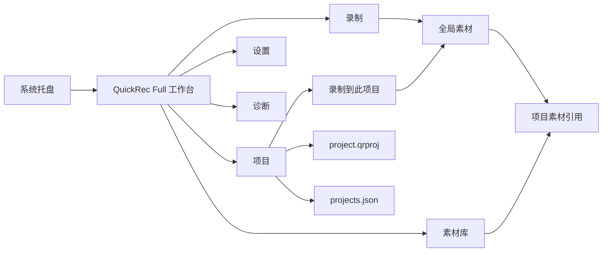

# QuickRec Full v1.9 项目工作区原型说明

## 1. 文档信息

| 项目 | 内容 |
| --- | --- |
| 版本 | QuickRec Full v1.9 |
| 原型类型 | 高保真、可交互、开发契约型 HTML 原型 |
| 当前状态 | 已由产品负责人确认（2026-07-26） |
| 上游需求 | `doc/releases/v1.9/prd.md` |
| 设计基线 | `doc/releases/v1.8/prototype/` |
| 原型入口 | `doc/releases/v1.9/prototype/index.html` |
| 产品线边界 | 仅 QuickRec Full，不修改 QuickRec Lite |
| 开发门禁 | 原型门禁已通过；仍需确认开发承接文档并获得业务实现授权 |

## 2. 原型目标

本原型用于确认 v1.9“项目工作区基础”的信息架构、交互语义和数据安全边界，不用于验证完整工作台、时间线或剪辑能力。

核心目标：

1. 在 v1.8 四页工作台中新增“项目”一级页面。
2. 让项目创建、打开、重命名、归档、恢复和安全删除形成完整闭环。
3. 让全局素材库和项目素材引用保持清晰边界。
4. 让项目内录制复用既有全屏、区域和窗口链路。
5. 让缺失、损坏、只读、外部冲突和部分失败状态可理解、可恢复。
6. 让每个控件具备开发可直接承接的交互契约。

## 3. 打开方式

推荐在项目目录启动本地服务：

```powershell
python -m http.server 8769 --directory E:\codex\QuickRec\doc\releases\v1.9\prototype
```

浏览器访问：

```text
http://127.0.0.1:8769/index.html
```

支持 URL 参数：

```text
?page=projects
?state=project-empty
?state=project-archived
?state=project-missing
?state=project-corrupt
?state=project-conflict
?state=project-delete-failure
?embed=1
```

## 4. 信息架构

工作台维持固定深色侧栏，导航顺序为：

1. 录制
2. 素材库
3. 项目
4. 设置
5. 诊断

录制仍是应用重启后的默认页面。项目页不会取代全局素材库。



## 5. 项目页布局

### 5.1 顶部工具区

从左到右：

- 项目搜索
- 活跃项目 / 已归档分段切换
- 打开项目文件
- 新建项目

搜索只影响当前范围，不修改任何数据。

### 5.2 左侧项目列表

列表展示：

- 项目名称
- 素材数量
- 最近更新时间
- 活跃、归档、缺失等状态
- 默认项目位置和设置入口

同一进程内保留最近选择。应用重启后进入项目页时展示列表，不自动打开陈旧项目。

### 5.3 右侧项目详情

详情展示：

- 项目名称、描述和项目文件路径
- 活跃、归档、缺失、损坏、只读或冲突状态
- 素材数量、共享数量、最近保存和文件健康
- 重命名、归档、恢复、更多和安全删除
- 添加素材和录制到此项目
- 项目素材引用列表

项目列表和详情处于同一个工作台页面，不新增独立项目窗口。

## 6. 核心交互链路

### 6.1 新建项目

表单包含：

- 项目名称：必填
- 项目描述：选填
- 项目位置：默认读取设置，允许本次单独修改

创建成功：

1. 生成稳定 `project_id`。
2. 创建 `<项目根目录>\<project-id>\project.qrproj`。
3. 更新中央 `projects.json`。
4. 打开新项目详情。

单项目位置不会反向修改全局默认项目位置。

### 6.2 打开项目文件

用户选择 `.qrproj` 后先验证：

- 文件存在且可读
- JSON 和 schema 有效
- `project_id` 有效
- 版本兼容

验证成功才在原位置登记。不会复制项目文件或视频。

### 6.3 添加素材

项目页“添加素材”打开可搜索、多选的全局素材选择器。

- 已加入当前项目：不可重复选择
- 文件缺失：不可选择
- 共享素材：允许选择并显示共享状态
- 确认后一次原子保存引用

素材库详情中的“加入项目”允许同一素材加入多个活跃项目。

### 6.4 从项目移除素材

操作名称固定为“从项目移除”。

确认文案必须明确：

- 只移除当前项目引用
- 不删除实际视频
- 不从全局素材库移除
- 不影响其他项目

### 6.5 录制到此项目

模式包括：

- 全屏
- 区域
- 窗口

结果按三段反馈：

1. 视频是否保存成功
2. 是否加入全局素材库
3. 是否加入目标项目

后一步失败不能改写前一步成功事实。

### 6.6 归档和恢复

归档后：

- 项目进入已归档范围
- 项目详情只读
- 允许查看、打开文件和复制路径
- 禁止录制、重命名和调整素材

恢复成功后回到活跃项目。

### 6.7 文件缺失

缺失项目提供：

- 重新定位
- 从中央列表移除
- 打开原目录

重新定位必须验证候选文件 `project_id` 一致。

### 6.8 文件损坏

损坏项目不得显示为正常空项目。

- 保留原损坏文件
- 有有效 `.bak` 时显示备份时间
- 用户确认后恢复
- 无有效备份时提供目录和诊断入口

### 6.9 外部修改冲突

检测到项目文件在应用外修改后：

- 停止本次写入
- 提供重新加载
- 提供取消
- 不自动合并
- 不静默覆盖

### 6.10 安全删除

删除确认页展示：

- 项目素材总数
- 独占素材
- 共享素材
- 归属不确定素材
- 逐项独占视频清单

规则：

- 默认不勾选任何视频
- 共享素材不可勾选
- 归属不确定素材不可勾选
- 不提供永久删除
- 项目文件和选中独占视频只进入 Windows 回收站
- 部分失败必须逐项显示真实结果

## 7. 页面状态

原型工具栏提供以下项目状态：

| 状态 | 目的 |
| --- | --- |
| 项目空状态 | 首次使用、无项目 |
| 项目已归档 | 只读和恢复入口 |
| 项目文件缺失 | 重新定位和 ID 验证 |
| 项目文件损坏 | 备份恢复，不创建空项目 |
| 外部修改冲突 | 禁止静默覆盖 |
| 删除部分失败 | 逐项结果与项目保留 |

v1.8 的录制、素材空状态、素材错误、文件缺失、浮动窗口和 120 FPS 状态继续保留。

## 8. 开发交互契约

点击“开发标注”后，每个带编号控件展示：

- 触发条件
- 即时结果
- 成功反馈
- 失败反馈
- 禁用规则
- 取消 / 关闭行为
- 对项目文件、中央索引和视频的影响

静态和动态弹窗中的控件共用同一契约注册机制。原型加载时若出现未定义契约，应视为验证失败。

## 9. 视觉与组件

延续 v1.8 已确认视觉语言：

- 浅色主工作区
- 深色窄侧栏
- 蓝色主操作色
- 绿色成功
- 黄色警告
- 红色危险
- 小圆角、紧凑间距
- Segoe UI / Microsoft YaHei UI
- 统一线性 SVG 图标

项目页新增组件：

- 项目列表项
- 项目健康状态条
- 项目统计条
- 项目素材引用表
- 活跃 / 归档分段控件
- 素材多选器
- 安全删除逐项清单

不使用大型营销卡片、装饰性插画、主题系统或项目封面。

## 10. 窗口与 DPI

原型继续遵守：

- 默认窗口约 `1200×760`
- 最小窗口 `960×640`
- 单显示器 `100% / 125% / 150% DPI`
- 文本不得裁切或重叠
- 长项目名和中文空格路径必须省略显示，并保留完整数据契约
- 弹窗必须处于可视区域
- 危险操作按钮必须明确且可点击

低高度窗口中允许项目列表和素材引用表内部滚动，不允许底部删除按钮遮挡内容。

## 11. 原型与实现映射

| 原型区域 | 预期实现边界 |
| --- | --- |
| 项目导航与页面 | `WorkbenchWindow` 新页面与协调接口 |
| 项目列表和详情 | 新的可嵌入项目页面 |
| 项目文件与索引 | 独立项目存储服务 |
| 生命周期和引用 | 独立项目业务服务 |
| 项目内录制 | `QuickRecApp` 路由和现有录制链路 |
| 全局素材选择 | 复用素材查询和素材事实 |
| 回收站 | 复用已验证的素材回收站服务 |
| 设置默认项目位置 | 现有显式保存配置页 |

UI 不直接写 JSON；`QuickRecApp` 不承载项目 schema 和文件事务。

## 12. 明确非目标

- 素材预览或静态首帧
- 时间线和多轨
- 剪辑
- 导出队列
- AI、字幕、摘要和标签
- 云同步
- WGC
- 多显示器和 4K 正式能力
- 144 / 165 / 240 FPS 正式输出
- QuickRec Lite 改动
- 全量重写现有工作台或素材库

## 13. 原型确认清单

- [x] 五页工作台导航存在。
- [x] 三种录制模式保持平级，不存在默认选中态。
- [x] 默认项目位置和单项目位置已表达。
- [x] 项目创建、打开和重命名可交互。
- [x] 素材多项目引用和项目内素材选择可交互。
- [x] 项目内三类录制入口可交互。
- [x] 归档、恢复和只读状态可交互。
- [x] 缺失、损坏和外部冲突可交互。
- [x] 安全删除默认不选择视频。
- [x] 共享和不确定素材不可删除。
- [x] 每个项目控件有开发契约。
- [x] 保留 v1.8 已确认页面与浮动窗口。
- [x] 浏览器桌面尺寸验证完成。
- [x] 最小窗口验证完成。
- [x] 产品负责人确认原型。（2026-07-26）

## 14. 确认后的下一步

原型已确认，下一步：

1. 生成 `doc/releases/v1.9/dev_plan.md`。
2. 生成 `doc/releases/v1.9/progress.md`。
3. 按项目存储、项目服务、项目页面和录制协调顺序拆分最小任务。
4. 获得明确业务实现授权后才进入代码实现。

业务实现授权前不修改业务代码，不提交、不推送、不打 tag。
