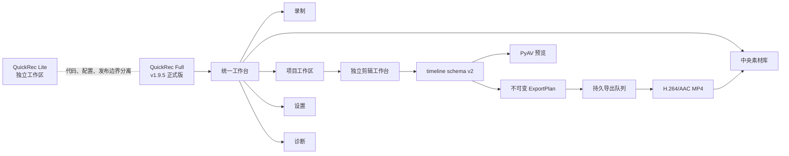
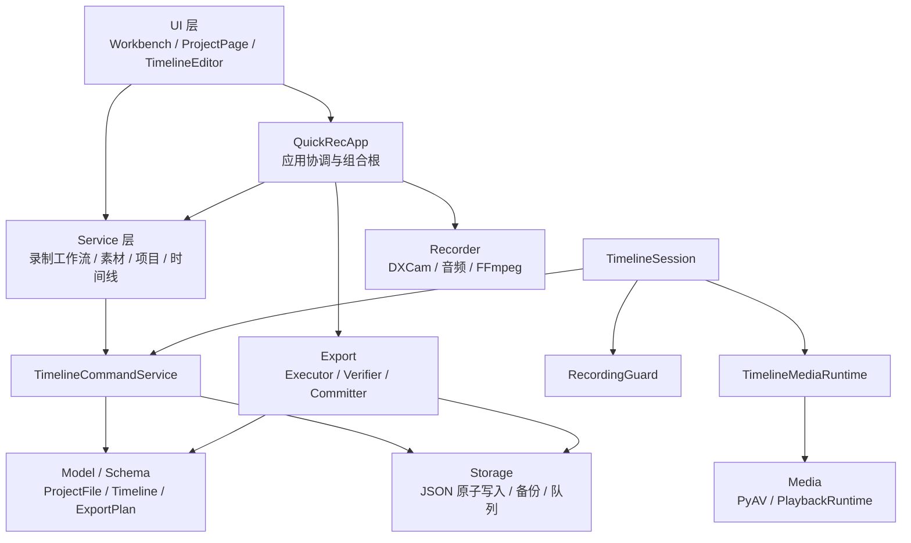

# QuickRec Full v2.0 发布前深度 Review

## 1. 文档信息

| 项目 | 内容 |
| --- | --- |
| 入口判断 | `/review` |
| 审查对象 | QuickRec Full |
| 本地路径 | `E:\codex\QuickRec` |
| 审查日期 | 2026-08-10 |
| 当前正式版 | v1.9.5 |
| 正式发布提交 | `42302a3eb8e592d538e2341db698a30513cd4201` |
| 当前工作分支 | `test` |
| 当前 HEAD | `9c0b9ded4c0e815990b6bf395a331b205ad2d77a` |
| 工作区状态 | 干净；`test` 比 `origin/test` 超前 1 个纯文档提交 |
| 审查边界 | 只读审查；不修改业务代码、Lite、tag 或 Release |
| 总体结论 | **部分通过：v1.9.5 基线稳定，但尚不具备直接命名并发布 v2.0 的完整治理与验收条件** |

### 证据状态说明

- **已验证**：本轮实际运行命令或公开远端页面核对通过。
- **已确认**：代码、正式文档或发布资产直接支持。
- **高可信推断**：静态依赖、调用路径或规模数据支持，但尚无用户故障样本。
- **待验证**：必须通过真实候选包、平台实验或人工操作才能下结论。

## 2. Review 判断

QuickRec Full 已经不是“录屏 Demo”。v1.9.5 已形成完整本地工作流：

```text
录制 -> 中央素材库 -> 项目 -> 多轨时间线 -> 剪辑 -> 持久导出队列 -> MP4
```

当前没有发现需要在 v2.0 前紧急修复的已确认 P0 业务故障，也没有发现明确的高危安全漏洞。项目已有原子写入、备份恢复、外部冲突保护、未知 schema 只读、导出事务与队列恢复等商业桌面软件所需的关键底座。

但“v1.9.5 能稳定使用”不等于“v2.0 已可发布”。v2.0 前仍需完成四类收口：

1. 建立唯一、当前、可验收的 v2.0 产品与发布事实源。
2. 缩小核心协调器的增长风险，不做全量重写。
3. 让质量门禁覆盖真实运行时，而不只是当前选择的 83 个类型检查文件和部分覆盖率边界。
4. 固定发布工具链、候选包身份、贡献归属治理与完整 GUI/硬件验收。

建议把 v2.0 定义为 **完整本地创作链路的稳定化与正式化版本**，不要再塞入 AI、自由画布、新捕获后端或更多高刷档位。

## 3. 产品定位与对象脉络

### 3.1 当前产品能力

| 领域 | 当前能力 | 状态 |
| --- | --- | --- |
| 录制 | 全屏、区域、窗口；30/60/120 FPS；四类音频 | 已发布 |
| 素材 | 中央索引、搜索筛选、迁移恢复、重新定位、安全删除 | 已发布 |
| 项目 | 创建、归档、恢复、只读、冲突与备份 | 已发布 |
| 时间线 | 8 视频轨 + 8 音频轨、100 片段、30 分钟 | 已发布 |
| 剪辑 | 播放、裁剪、分割、全局波纹、解绑/重关联、帧级编辑 | 已发布 |
| 导出 | 不可变计划、持久单工作线程队列、取消/重试/恢复 | 已发布 |
| 诊断 | 本地复制、目录、导出；录制/播放/导出上下文 | 已发布 |
| 自动化 | 独立 `QuickRecCLI.exe` 的 doctor/probe/validate/smoke/export | 已发布 |

### 3.2 产品线关系



### 3.3 工程对象关系



静态 AST 分析覆盖 `119` 个源码模块、`301` 条内部依赖边，未发现静态 import cycle。Service 层没有反向导入 UI，是值得保留的边界。

## 4. 关键发现

### F-01：v2.0 当前没有可作为发布合同的事实源

- **优先级**：P1，发布阻塞。
- **证据状态**：已确认。
- **证据**：
  - 当前事实入口仍明确正式版为 v1.9.5：[current.md](../current.md)。
  - 本地 `test` 比远端多出的提交只增加 4 份技术治理文档，没有 v2.0 PRD、dev plan、progress、verification 或 acceptance。
  - [架构审计报告](QuickRec-架构审计报告.md) 和两份 v2.0 架构文档仍以 v1.9.2 / `91ab91c` 为基线。
  - [架构实施与验证](QuickRec-v2.0-架构优化实施与验证.md) 第 399-410 行仍把“进入 v1.9.3 PRD”作为下一步。
- **判断**：这些文档是有价值的历史架构基线，但不能直接代表 v2.0 当前设计与发布状态。
- **建议**：先进入 `/idea` 固定 v2.0 唯一主线，再产出 `doc/releases/v2.0/`。旧文档应标注“v1.9.2 基线、已部分落地、需按 v1.9.5 复核”，而不是直接删除。

### F-02：公开 README 与本地发布事实源存在直接漂移

- **优先级**：P1，直接治理。
- **证据状态**：已确认、远端已复核。
- **证据**：
  - [README.md](../../README.md) 第 6、7、13 行仍显示 v1.9.4 Release、v1.9.5 RC3 和 v1.9.4 下载链接。
  - 同一 README 后文已经正确声明 v1.9.5 为正式版。
  - [current.md](../current.md) 第 33-36 行引用的 RC3 解压目录和 GUI/CLI 文件已经清理；第 40-41 行正式 ZIP 仍存在。
  - 正式 ZIP 实测存在，大小 `194645832` 字节，SHA256 为 `0B4F90B0202B2F0296B463BFF196B04E7C0BCA6709A245037E390AC1B7185D59`。
  - GitHub v1.9.5 Release、master/test/tag CI 均可访问且状态为 Success。
- **影响**：用户可能从 README 下载旧版本；后续 agent 可能误用已删除的 RC3 路径。
- **建议**：立即修正文档，不等待 v2.0 功能开发。

### F-03：核心协调器继续膨胀，新增 v2 能力时回归半径会快速扩大

- **优先级**：P1，架构治理。
- **证据状态**：高可信推断。
- **证据**：
  - `src/main.py` 约 2226 行，`QuickRecApp` 静态内部依赖数为 49，协调工作台、录制、迁移、素材、时间线、导出、诊断和退出。
  - `src/ui/timeline_editor_window.py` 约 3280 行，承担 UI 构建、素材栏、快捷键、剪辑候选、保存冲突、播放、导出、录制和诊断协调。
  - `src/services/timeline_commands.py` 约 2401 行，承担轨道、片段、剪辑、历史、保存、迁移、恢复与错误状态。
  - UI 仍直接依赖项目/素材存储模型和多个领域服务，例如 `ProjectPage`、`MaterialLibraryDialog`、`TimelineEditorWindow`。
- **判断**：当前没有 import cycle，也没有证据支持全量重写；问题是后续变化会继续集中到三个超大文件。
- **建议**：v2.0 只做“按用例抽离”：
  1. 从 `QuickRecApp` 抽出录制请求、工作台导航、导出协调门面。
  2. 从 `TimelineEditorWindow` 抽出播放控制器、命令绑定器和恢复/冲突呈现器。
  3. 从 `TimelineCommandService` 抽出轨道命令、片段命令和持久化事务协调；公开 API 保持兼容。

### F-04：84.14% 覆盖率与 83 文件 Mypy 均是选择性边界，不是完整运行时门禁

- **优先级**：P1，工程质量阻塞。
- **证据状态**：已验证。
- **证据**：
  - 本轮覆盖率为 `84.14%`，但 `pyproject.toml` 明确排除 `src/main.py`、设置、托盘、录制工具栏、区域/窗口选择器、音频捕获等关键运行时模块。
  - Mypy 清单仅列出 83 个源文件，项目实际有 119 个 Python 源模块。
  - 当前低覆盖高风险模块包括 `timeline_canvas.py` 72%、`timeline_editor_window.py` 76%、`timeline_edit_dialogs.py` 50%、`pyav_playback_backend.py` 75%、`single_instance.py` 51%。
  - `main.py`、`audio_capturer.py` 和若干原生资源清理路径包含较多宽异常捕获，但不在完整类型/覆盖率门禁内。
- **判断**：当前数值真实，但 README 必须明确它是“受控统计边界”；v2.0 应逐步扩大，而不是一次性要求全仓 100%。
- **建议**：优先纳入 `main.py` 的协调器抽离结果、录制完成/失败、退出清理、设置保存、音频错误和选择器取消路径。

### F-05：CI 能验证可构建，但正式发布工具链不可完全复现

- **优先级**：P1，发布工程。
- **证据状态**：已确认。
- **证据**：
  - `.github/workflows/ci.yml` 使用未固定版本的 `choco install ffmpeg`，随后选择首个大于 1 MB 的 `ffmpeg.exe` / `ffprobe.exe`。
  - 正式发布文档记录的是固定 FFmpeg/FFprobe 哈希，两者没有形成同一份机器可校验的工具清单。
  - `pyaudio`、`soundcard`、`winotify` 及全部开发工具仅设置最低版本；没有 lock 或 hashes。
  - CI 完成打包和 frozen CLI smoke，但没有上传可追溯构建产物，也没有与正式媒体工具 manifest 对比。
- **风险**：同一提交在未来可能得到不同依赖或 FFmpeg 版本，导致“CI 通过”与“正式包身份”并不等价。
- **建议**：v2.0 前冻结依赖与媒体工具 manifest，CI 校验版本和 SHA256，并保留候选包 SBOM/清单或最小依赖快照。

### F-06：项目根 schema v1 与 timeline schema v2 合法，但 v2.0 需要完整兼容矩阵

- **优先级**：P1，数据安全。
- **证据状态**：已确认。
- **证据**：
  - `src/utils/project_store.py` 第 24 行：`PROJECT_SCHEMA_VERSION = 1`。
  - `src/utils/timeline_model.py` 第 18-25 行：timeline 使用版本化 extension，当前 schema v2。
  - v1.9.5 已明确警告与 v1.9.4 及更早版本不保证向下编辑兼容。
  - 当前实现支持未知 schema 只读、未知字段保留、原子写入、`.bak` 恢复和外部冲突检测。
- **判断**：不能仅因产品叫 v2.0 就机械提升项目根 schema；应由数据变化决定。
- **建议**：在 v2.0 PRD 中冻结“新建、打开、只读、首次编辑、回滚、损坏恢复、未知字段往返”矩阵，并用 v1.9-v1.9.5 夹具验证。

### F-07：播放查询是 O(n)，但本轮基准未证明它已成为性能瓶颈

- **优先级**：P2，继续验证。
- **证据状态**：代码已确认、性能风险未证实。
- **证据**：
  - `build_playback_plan()` 每次重建轨道/素材映射并扫描全部片段。
  - 播放 tick、snapshot 和 duration 会多次触发 `_plan()`。
  - 本轮纯查询微基准：100 片段 `0.027 ms`、1000 片段 `0.107 ms`、5000 片段 `0.474 ms` 每次。
- **判断**：当前正式承诺为 100 片段，纯查询远低于 16 ms 帧预算，不能把它写成已确认性能缺陷。真正成本更可能来自解码、音频和 GUI 重绘。
- **建议**：先加真实媒体与 GUI profiling；只有总 tick 超预算时再引入编译播放索引或区间索引。

### F-08：撤销历史已有增量优化，但结构命令仍可能在大项目中占用较多内存

- **优先级**：P2，继续验证。
- **证据状态**：已确认设计，缺少大项目内存门禁。
- **证据**：
  - 历史上限为 50 步。
  - move、rename、reorder、lock、trim 使用实体 delta。
  - 测试证明 100 片段 move delta 的序列化体积小于完整 snapshot 的十分之一。
  - split、delete、波纹、建轨等结构变化仍使用 snapshot 适配器。
- **建议**：保留混合历史，不在 v2.0 强推纯 Command Pattern；增加 100/500/1000 片段、50 步结构编辑的峰值内存和撤销时延门禁，再决定继续细化 delta。

### F-09：贡献归属治理是显式 v2.0 门禁，但当前方案仍需平台实验与二次授权

- **优先级**：P1，独立仓库治理门禁。
- **证据状态**：目标已确认，执行方案待验证。
- **证据**：
  - [v2.0 贡献归属治理](v2.0-repository-attribution-governance.md) 要求 v2.0 前移除 GitHub 的 `claude` Contributor 展示，同时不得移动历史 tag、覆盖 Release 或未经授权 force push。
  - GitHub 官方说明 Contributor 图按默认分支统计，也会计入共同作者；历史变化后统计可能需要约 24 小时刷新。
- **判断**：保留历史 tag 与修改默认分支历史不必然冲突，但这是高风险仓库迁移，不是普通文档清理；`.mailmap` 也不能视为已验证解决方案。
- **建议**：独立执行 mirror/bundle/refs/Release 资产审计，在测试仓库验证“新默认分支基线 + 旧 tag 保留”是否满足 GitHub 展示目标，再向用户申请二次授权。不得混入 v2.0 业务提交。

### F-10：v2.0 候选包仍缺一次全链路真实验收

- **优先级**：P1，发布阻塞。
- **证据状态**：v1.9.5 已通过；v2.0 待验证。
- **证据**：
  - v1.9.5 自动化、D9 `31/31` 和 ACC `20/20` 证据完整。
  - 当前没有 v2.0 候选包、锁定 SHA256、manual verification 或 acceptance matrix。
- **建议**：任何架构或门禁修改完成后必须重新打包，不能继承 v1.9.5 GUI 证据直接宣布 v2.0 可发布。

## 5. 意图、实现与验证矩阵

| 目标 | 当前实现 | 当前验证 | v2.0 判断 |
| --- | --- | --- | --- |
| 完整本地创作闭环 | 录制、素材、项目、剪辑、导出已串联 | v1.9.5 D9/ACC 通过 | 已具备产品基础 |
| 项目数据安全 | 原子写入、备份、冲突、只读、迁移 | 单元/集成/GUI 已覆盖 | 需补跨版本矩阵 |
| 大项目可用 | 正式门禁 100 片段/30 分钟/8+8 轨 | 当前规模验证通过 | 更大规模只做 profiling |
| 商业桌面稳定性 | 单实例、诊断、恢复、资源释放 | 有自动化与 GUI 证据 | 需补长时 soak/强退/重启 |
| 可维护架构 | Session/Media/Guard、混合历史、typed events 已落地 | 自动化通过 | 协调器仍需最小拆分 |
| 可复现发布 | CI 可打包、正式包有哈希 | CI 三路 Success | 依赖与 FFmpeg 未完全固定 |
| AI 扩展边界 | 可通过领域命令/CLI 复用服务 | 未做 AI 验证 | 只保留接口，不进入 v2.0 |
| 仓库贡献归属 | 已有治理目标和保护约束 | 未做平台实验 | 独立门禁，待二次授权 |

## 6. 值得保留

1. **数据安全优先的存储设计**：项目、索引和导出事务均有原子提交或恢复机制。
2. **未知 schema 只读与未知字段往返保留**：这是长期兼容的正确方向。
3. **时间线媒体生命周期拆分**：`TimelineSession`、`TimelineMediaRuntime`、`RecordingGuard` 已避免 Session 继续无边界膨胀。
4. **混合撤销历史**：简单高频操作使用 delta，复杂结构操作保留 snapshot，符合当前风险收益。
5. **不可变 ExportPlan 与持久队列**：播放状态变化不会改写已创建导出任务语义。
6. **CLI 与 GUI 共用领域服务**：自动验证没有通过模拟按钮重写业务逻辑。
7. **类型化事件只用于事实广播**：当前没有把所有调用强行改造成全局 EventBus。
8. **Full/Lite 产品线隔离**：本轮 Lite 工作区保持干净。

## 7. v2.0 前建议顺序

### M0：直接治理，不等 PRD

1. 修复 README v1.9.4 下载链接、Release badge 和 RC3 badge。
2. 修复 `doc/current.md` 已删除 RC3 解压目录，保留 ZIP、Release 和哈希事实。
3. 给三份 v1.9.2 基线架构文档增加“历史基线/当前复核入口”标记。
4. 决定本地 `test` 上 `9c0b9de` 的处理方式；在文档校准前不建议直接推送。
5. 把 UTF-8、乱码和当前事实链接检查固化为 CI 文档门禁。

### M1：进入 `/idea`，只选一个 v2.0 主线

推荐唯一产品主线：

> **完整本地创作链路稳定化与正式化**：不新增大功能，统一事实源、数据兼容、错误恢复、资源生命周期、发布身份和端到端验收。

最多两个工程支撑模块：

1. 核心协调器最小职责拆分。
2. 真实运行时质量门禁与可复现发布。

### M2：进入 `/prd`

PRD 至少冻结：

- v2.0 与 v1.9.5 的产品边界；
- 项目/时间线/队列的兼容与回滚矩阵；
- 录制、播放、剪辑、导出和退出的失败合同；
- 候选包、依赖、FFmpeg、哈希和发布资产身份；
- GUI、硬件、DPI、长时和强退恢复验收；
- 贡献归属治理作为独立前置门禁，不混入业务提交。

### M3：进入 `/acceptance`

最终候选包至少覆盖：

- 三种录制模式与四类音频；
- 1080p120 全屏；
- 素材迁移/恢复/重建/重新定位/安全删除；
- 项目创建、冲突、备份、未知版本只读；
- 100 片段、30 分钟、8+8 轨播放与剪辑；
- 30 分钟和 8 路音频导出、取消、失败、重试、强退恢复；
- 100%、125%、150% DPI；
- 应用退出后的 QuickRec、PyAV、FFmpeg、FFprobe、音频线程与计时器清理；
- frozen GUI/CLI 身份、包内容、哈希和正式 ZIP。

## 8. 分流建议

| 事项 | 分流 | 理由 |
| --- | --- | --- |
| README/current/v2 文档校准 | 直接治理 | 已确认事实漂移 |
| 核心协调器最小拆分 | 进入 `/idea` | 有结构证据，需限制范围 |
| 扩大 Mypy/Coverage 到关键运行时 | 进入 `/idea` | 是 v2 可靠性支撑，不是产品功能 |
| 固定依赖/FFmpeg/发布 manifest | 直接治理 + `/idea` | 先固定事实，再设计发布门禁 |
| v1.9-v2.0 数据兼容矩阵 | 进入 `/prd` | 涉及用户项目安全 |
| v2.0 候选包全链路复验 | 进入 `/acceptance` | 不能继承旧包结论 |
| Contributor 归属治理 | 独立技术验证 | 高风险仓库操作，需要二次授权 |
| 播放计划索引优化 | 继续验证 | 当前基准没有证明瓶颈 |
| 纯 Command Pattern 重写历史 | 暂不做 | 混合历史已有效，重写风险高 |
| 全局 EventBus | 暂不做 | 当前 typed event 已足够，命令调用无需事件化 |
| AI、自由画布、WGC、更多高刷档位 | 暂不做 | 会稀释 v2.0 稳定化主线 |
| 数据库/云同步/全量架构重写 | 暂不做 | 没有当前问题证据支持 |

## 9. 使用工具与验证结果

### 本地工具

- `rg`、PowerShell、Git、Python AST：结构、依赖、行号、状态与文档检查。
- `pytest` / `pytest-cov`：全量与覆盖率。
- Ruff、Mypy、Compileall、`git diff --check`。
- 自定义只读微基准：播放计划 100/1000/5000 片段。
- SHA256：正式 v1.9.5 ZIP 身份。

### 本轮结果

| 检查 | 结果 |
| --- | --- |
| 非硬件/非 Packaging 测试 | `1425 passed, 32 deselected, 72 subtests passed` |
| Packaging 测试 | `20 passed, 1437 deselected` |
| Coverage | `84.14%`，通过 80% 门禁；统计边界需在 v2.0 扩大 |
| Ruff | 通过 |
| Mypy | 83 个配置源文件通过 |
| Compileall | 通过 |
| `git diff --check` | 通过 |
| 当前正式文档本地链接 | 通过 |
| 177 个 Markdown UTF-8/乱码扫描 | 通过 |
| 静态 import cycle | 未发现 |
| GitHub v1.9.5 tag/master/test CI | 三者均为 Success |
| 正式 ZIP SHA256 | 与发布文档一致 |

### 外部证据

- GitHub v1.9.5 Release 与 Actions 公共页面。
- GitHub 官方 Contributor 图说明：统计默认分支提交，并包含共同作者；历史变化后可能需要约 24 小时刷新。

## 10. 最终结论

**v1.9.5 可以继续作为稳定正式版；当前不能直接宣布 v2.0 发布准备完成。**

v2.0 前最重要的不是继续加功能，而是把已经很完整的工作流变成一个事实一致、边界可维护、发布可复现、数据可回滚、候选包可完整验收的正式大版本。

建议先完成 M0 文档与发布事实治理，然后进入一次独立 `/idea`，只讨论“v2.0 稳定化主线 + 两个工程支撑”。

## 11. 下一次模型接手摘要

1. v1.9.5 正式提交/tag 为 `42302a3`，本地 `test` 在其后有纯文档提交 `9c0b9de`。
2. 当前没有确认的 P0 业务故障，完整本地创作链路已经成立。
3. v2.0 的主要缺口是事实源、核心协调器、质量覆盖和可复现发布，不是继续堆功能。
4. 三份 v2 架构文档基线仍是 v1.9.2，应先校准再决定是否推送。
5. Contributor 归属治理属于高风险独立门禁，必须先做 mirror/bundle/测试仓库实验并再次授权。

## 12. 审计后工程优化回写

本节记录审计完成后、同一工作区内实际落地的工程优化。它不改变 v1.9.5 的
正式发布身份，也不代表 v2.0 已进入发布阶段。

### 12.1 已完成事项

1. **发布事实统一**：README、`doc/current.md` 与机器可读
   `release-manifest.json` 已统一到 v1.9.5，移除已清理 RC3 解压目录作为事实源。
2. **文档事实门禁**：新增 `scripts/check_repository_facts.py`，检查 Markdown
   UTF-8、常见乱码、相对链接、版本事实及可选媒体工具哈希，并接入 CI。
3. **核心协调器最小拆分**：新增 `WorkbenchNavigationController`，集中处理
   工作台单实例打开、目标页切换、录制状态同步和页面刷新；`QuickRecApp`
   保留应用协调职责，未改录制、项目、时间线或用户数据契约。
4. **发布工具链固定**：新增统一 `scripts/stage_ffmpeg.ps1`，CI 固定安装并校验
   FFmpeg/FFprobe 8.0.1，并在两个任务中核对发布清单 SHA256；GUI 与 CLI
   packaging job 不再维护重复脚本。
5. **依赖可复现性增强**：当前运行时与开发依赖改为精确版本，已用 pip
   dry-run 验证当前 Python 3.12 环境可解析。
6. **质量边界扩展**：工作台协调器纳入 Mypy，并新增独立 90% 增量覆盖率门禁。

### 12.2 测试与门禁证据

| 检查 | 优化后结果 |
| --- | --- |
| 非硬件、非 Packaging 测试 | `1441 passed, 33 deselected, 72 subtests passed` |
| Packaging 测试 | `21 passed, 1453 deselected` |
| 项目 Coverage | `84.16%`，通过 80% 门禁 |
| 新工作台协调器 Coverage | `97.50%`，通过 90% 增量门禁 |
| Ruff | 通过 |
| Mypy | 84 个配置源文件通过 |
| Compileall | 通过 |
| 发布事实与媒体哈希 | 通过 |
| `git diff --check` | 通过 |

全局 `pip check` 仍会报告当前机器中与 QuickRec 无关的历史全局包冲突；本轮没有
修改这些用户级 Python 包。QuickRec 的锁定依赖解析、测试、静态检查和打包配置
检查均独立通过。

### 12.3 边界与剩余事项

- 未修改项目 schema、timeline schema、录制文件、素材索引或发布 tag。
- 未修改 QuickRec Lite。
- 本轮没有执行 commit、push、打包发布或 GitHub Release。
- `TimelineEditorWindow`、`TimelineCommandService` 等大模块仍应在后续按用例渐进拆分；
  当前证据不支持全量重写。
- v2.0 仍需正式需求冻结、候选包全链路验收和独立贡献归属治理门禁。
