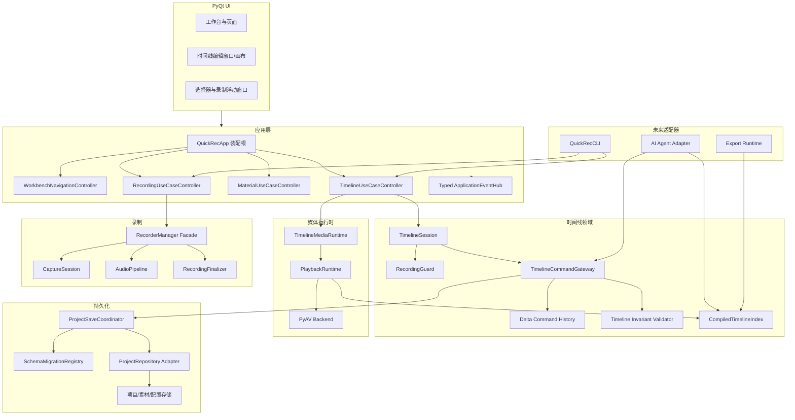
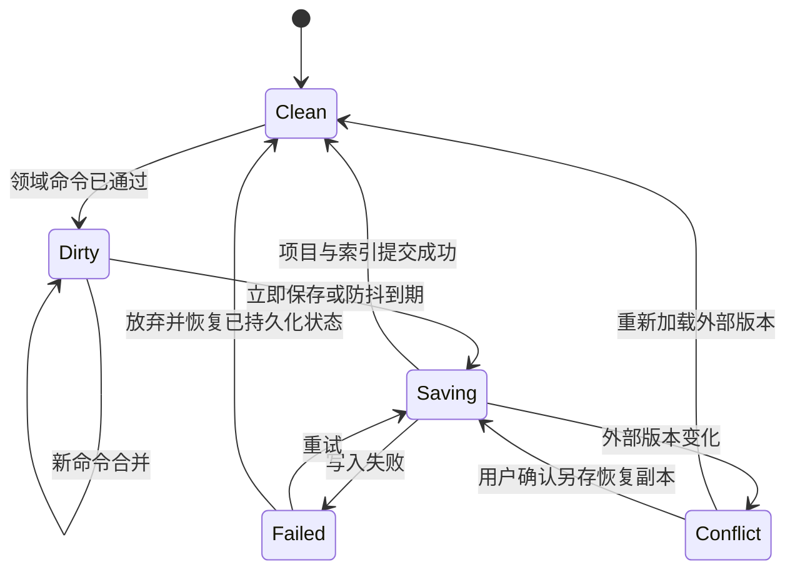
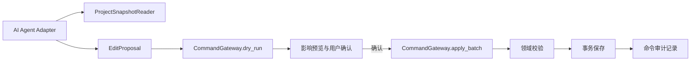

# QuickRec v2.0 架构优化方案

> **历史设计基线说明（2026-08-10）**
>
> 本文形成于 v1.9.2，保留的是首轮架构治理方案及其决策背景，并非当前 v2.0
> 发布范围的最终合同。已经落地的内容需结合当前代码验证；尚未落地的内容仍须重新
> 进入需求与技术评审。当前差距和推荐顺序见
> [QuickRec Full v2.0 发布前深度 Review](QuickRec-Full-v2.0-发布前深度Review-2026-08-10.md)。

## 1. 文档信息

| 项目 | 内容 |
| --- | --- |
| 设计基线 | QuickRec Full v1.9.2 |
| 基线提交 | `91ab91cba324658d9bfadb7016a31f8e4e380efb` |
| 目标 | 在不删除现有能力的前提下，提高扩展性、性能和商业桌面稳定性 |
| 状态 | 设计已确认，首轮 P0/P1 工程优化已实施 |
| 实施状态 | 单实例、会话拆分、保存协调、迁移注册、增量历史和录制完成事件已落地；其余阶段保留 |
| 非目标 | 本文不直接实现 AI、剪辑新功能或全量架构重写 |

本方案基于 [QuickRec 架构审计报告](QuickRec-架构审计报告.md)。实施必须逐模块进行，每个阶段都可以回退到上一个已验证状态。

首轮落地范围、候选包身份和回归证据见
[QuickRec v2.0 架构优化实施与验证](QuickRec-v2.0-架构优化实施与验证.md)。

## 2. 设计原则

1. **行为先于结构**：先以测试固定现有行为，再移动职责。
2. **数据安全不可降级**：保留原子写、备份、外部冲突检测和索引失败回滚。
3. **不以目录搬迁冒充解耦**：先抽接口和用例，再决定物理文件位置。
4. **一个阶段只改变一个核心变量**：拆分、异步保存、历史模型和 schema 迁移不得同时切换。
5. **命令与事件分离**：命令要求结果；事件只表达已经发生的事实。
6. **向后兼容默认开启**：旧项目只读查看不得触发自动改写。
7. **未知版本不覆盖**：无法识别的新 schema 必须只读保留。
8. **AI 不拥有写权限**：AI 只能提出结构化命令，由领域层校验和提交。

## 3. 目标架构



### 3.1 依赖方向

```text
UI -> Application -> Domain
Application -> Infrastructure Port
Infrastructure Adapter -> Domain Model
Recorder/Media -> 明确 Port
AI/CLI -> Application API，不调用 UI，不直接写 Store
```

## 4. 稳定性前置门禁

### 4.1 单实例与跨进程写保护

虽然原需求重点是时间线架构，但稳定性优先级要求先处理 v1.9.2 已知多实例缺口。

建议：

1. 使用 Windows 命名互斥体或 `QLockFile` 建立 Full 产品单实例。
2. 第二实例只发送激活工作台请求，然后退出。
3. 实例身份包含产品线，不能与 QuickRec Lite 共用。
4. 项目、素材、配置等写入继续做乐观冲突检查。
5. 对关键中央索引评估短时跨进程文件锁，避免第三方工具或旧版本并发写。

验收：

- 连续启动同一 EXE 只保留一个进程和托盘图标。
- 第二次启动可激活现有工作台。
- 不丢失项目、素材、配置和时间线写入。
- Lite 与 Full 可以同时运行。

回退：

- 单实例门禁独立提交。
- 失败时恢复旧入口，不触碰项目 schema。

## 5. P0-1 TimelineSession 拆分

### 5.1 当前问题

`TimelineSession` 当前同时管理：

- 项目与时间线命令。
- 瞬时 UI 状态。
- 录制期只读。
- 播放器暂停和释放。

媒体对象以 `Any` 保存，依赖 `getattr` 调用生命周期方法。

### 5.2 目标职责

#### TimelineSession

只负责：

- 项目 ID 与时间线命令上下文。
- 当前项目/时间线只读快照。
- 瞬时 `TimelineViewState`。
- 组合 `RecordingGuard` 和媒体运行时的只读状态查询。

#### TimelineMediaRuntime

负责：

- 持有现有 `PlaybackRuntime`。
- 播放、暂停、跳转和替换时间线。
- 项目切换、页面关闭和应用退出时释放资源。
- 向诊断提供不包含完整素材路径的摘要。

它是现有播放运行时的生命周期包装，不重新实现 PyAV 解码。

#### RecordingGuard

负责：

- 录制开始时进入只读。
- 录制停止或失败后解除只读。
- 提供类型化原因和状态。
- 支持嵌套或重复事件的幂等处理。

建议接口：

```python
class MediaRuntime(Protocol):
    def pause(self) -> None: ...
    def release(self) -> None: ...
    def replace(self, project: ProjectFile, timeline: Timeline) -> None: ...


@dataclass(frozen=True)
class RecordingGuardState:
    active: bool
    reason: str = ""


class RecordingGuard:
    def activate(self, reason: str) -> None: ...
    def release(self) -> None: ...
    def ensure_writable(self) -> None: ...
```

### 5.3 实施顺序

1. 为当前 TimelineSession 生命周期补契约测试。
2. 引入协议和 `RecordingGuard`，先委托现有逻辑。
3. 引入 `TimelineMediaRuntime`，包装现有 `PlaybackRuntime`。
4. 替换 `Any` 和反射调用。
5. 保留旧方法作为一版兼容委托。
6. 所有 GUI、播放、录制锁测试通过后再删除兼容委托。

### 5.4 风险与回退

| 风险 | 保护 |
| --- | --- |
| 项目切换后声音残留 | 资源释放幂等测试、真实听音 |
| 录制结束后仍只读 | 开始/失败/取消/停止事件矩阵 |
| 重复释放崩溃 | `release()` 幂等合同 |
| 窗口关闭与应用退出竞态 | 一个生命周期所有者，其他调用只发请求 |

## 6. P0-2 保存机制优化

### 6.1 事实边界

当前实现不是每个 `mouseMove` 写盘。拖动只在 `mouseRelease` 提交一次离散命令。

因此不建议直接把同步保存替换为简单定时器。推荐引入 `ProjectSaveCoordinator`，先保持行为一致，再渐进启用合并。

### 6.2 保存状态模型



### 6.3 分阶段方案

#### 阶段 A：只抽象，不改变保存时机

- `ProjectSaveCoordinator` 包装现有同步 `commit_project_candidate`。
- 明确 revision、dirty、saving、failed、conflict 状态。
- 记录序列化、项目写、索引写和总耗时。
- UI 反馈保持“命令成功即已保存”。

这是最低风险阶段，必须先完成。

#### 阶段 B：只合并高频连续编辑

满足以下条件后，允许 750 毫秒默认防抖：

- 已有恢复日志或写前命令日志。
- 同一项目只允许一个有序保存队列。
- 关闭项目、切换项目、退出应用、开始录制前强制 Flush。
- 保存失败后禁止继续提交依赖失败状态的新命令。
- 外部冲突在 Flush 前重新检查。

结构性操作可继续立即保存：

- 新增/删除轨道。
- 删除项目素材。
- 项目归档与恢复。
- schema 迁移。

高频编辑可合并：

- 连续移动同一片段。
- 连续缩放或调整同一属性。
- 未来裁剪手柄连续操作。

### 6.4 崩溃保护

有限防抖必须配套轻量恢复日志：

```text
项目修改
-> 生成 revision 与可序列化 ChangeSet
-> 原子追加/替换 recovery journal
-> 标记 dirty
-> 保存项目与索引
-> 校验成功
-> 清理已确认 journal
```

恢复日志不得包含媒体内容，只保存项目 ID、基线指纹和结构化变更。

### 6.5 不推荐方案

- 只设置一个 QTimer，不记录 dirty revision。
- 在后台线程直接操作 Qt 对象。
- 保存失败后继续堆积命令。
- 关闭窗口时静默丢弃待保存修改。
- 为提高速度绕过项目索引回滚。

## 7. P0-3 项目与扩展版本化

### 7.1 当前事实

当前已经存在：

- `PROJECT_SCHEMA_VERSION = 1`
- `PROJECT_INDEX_SCHEMA_VERSION = 1`
- `TIMELINE_SCHEMA_VERSION = 1`

目标不是统一强制升为 2，而是建立独立、可测试的迁移管线。

### 7.2 双层版本策略

| 层级 | 版本归属 | 何时升级 |
| --- | --- | --- |
| 项目容器 | `project.qrproj.schema_version` | 项目顶层结构发生变化 |
| 时间线扩展 | `extensions["quickrec.timeline"].schema_version` | 轨道/片段数据契约变化 |
| 未来字幕 | `extensions["quickrec.captions"].schema_version` | 字幕领域独立演进 |
| 未来 AI | `extensions["quickrec.ai"].schema_version` | AI 建议与标签独立演进 |

时间线升级不应自动迫使项目顶层 schema 同步升级。

### 7.3 Migration Registry

```python
class Migration(Protocol):
    source_version: int
    target_version: int

    def migrate(self, payload: Mapping[str, object]) -> dict[str, object]: ...


class SchemaMigrationRegistry:
    def register(self, namespace: str, migration: Migration) -> None: ...
    def migrate(
        self,
        namespace: str,
        payload: Mapping[str, object],
        target_version: int,
    ) -> MigrationResult: ...
```

迁移要求：

1. 每步只允许 `N -> N+1`。
2. 迁移函数纯化，不读写磁盘。
3. 每步迁移后执行 schema 与领域不变量校验。
4. 未知字段和其他 `extensions` 往返保留。
5. 迁移失败返回只读状态，不覆盖原项目。
6. 落盘前创建有效备份，继续使用原子写。
7. 只查看旧项目不自动改写。
8. 首次成功编辑或用户确认升级时才持久化。

### 7.4 回滚策略

- 旧版遇到未知扩展版本时保留原始扩展并只读。
- 新版写入前保留 `.bak`。
- 需要降级时提供“另存兼容副本”，不原地破坏高版本项目。
- AI、字幕和特效不得直接增加不受版本控制的顶层字段。

## 8. P1-1 Undo/Redo Command Pattern

### 8.1 目标

从完整快照历史逐步迁移到可逆增量命令，同时保持：

- 保存失败零副作用。
- 外部冲突处理。
- 50 步历史上限。
- 关联音视频和同轨不重叠不变量。
- 自动保存成功后才进入正式历史。

### 8.2 命令合同

```python
class TimelineEditCommand(Protocol):
    command_id: str

    def apply(
        self,
        timeline: Timeline,
        project: ProjectFile,
    ) -> ChangeSet: ...

    def revert(
        self,
        timeline: Timeline,
        project: ProjectFile,
        change: ChangeSet,
    ) -> None: ...

    def affected_ids(self) -> AffectedEntities: ...
```

建议命令：

- `MoveClipCommand`
- `AddMaterialCommand`
- `DeleteClipCommand`
- `AddTrackCommand`
- `DeleteTrackCommand`
- `RenameTrackCommand`
- 未来 `TrimClipCommand`
- 未来 `SplitClipCommand`

### 8.3 混合历史策略

不推荐立即将所有命令改为纯逆操作。建议：

1. 新增 `ChangeSet` 与命令协议。
2. 先迁移 `RenameTrack`、`MoveClip` 等低风险命令。
3. 删除轨道、移除项目素材等复杂命令保留快照适配器。
4. 每 10 到 20 步保留一个压缩检查点。
5. Undo 时先执行逆命令，再做完整不变量校验。
6. 保存成功后才移动 undo/redo 指针。
7. 逆命令校验失败时回退检查点并进入诊断状态。

### 8.4 为什么不直接使用“execute/undo 后立即改内存”

当前实现的核心保证是持久化成功前不改变可见状态。新 Command Pattern 也必须遵守：

```text
构造候选
-> apply
-> validate
-> 事务保存
-> 成功后发布新状态和历史
```

不能先修改 UI 内存，再异步假设保存一定成功。

## 9. P1-2 QuickRecApp 与页面职责收窄

### 9.1 保留 QuickRecApp 为装配根

`QuickRecApp` 不需要删除。它应只负责：

- 创建 QApplication。
- 装配依赖。
- 注册托盘、快捷键和顶层窗口。
- 启动与退出收尾。

### 9.2 建议抽出的用例控制器

| 控制器 | 职责 |
| --- | --- |
| `RecordingUseCaseController` | 录制入口、选择器、倒计时、工具栏和结束状态 |
| `RecordingResultController` | 输出保存、素材入库、项目关联、通知和失败降级 |
| `WorkbenchNavigationController` | 单实例工作台、页面切换和窗口恢复 |
| `TimelineUseCaseController` | 时间线会话、录制锁和编辑器生命周期 |
| `MaterialUseCaseController` | 素材查询、待入库重试和文件操作 |

控制器只依赖协议，不能反向导入具体页面。

### 9.3 页面 DTO

UI 不再直接依赖 Store dataclass，逐步改为：

```python
@dataclass(frozen=True)
class MaterialListItemView:
    material_id: str
    display_name: str
    status: str
    duration_text: str
    path_text: str
    actions: MaterialActionState
```

这不是建立第二套业务模型。DTO 只表达页面需要的稳定读模型。

## 10. P1-3 类型化 EventBus

### 10.1 是否需要 Event Bus

结论：需要一个小型、类型化、应用级事件中心，但不建议全局字符串 EventBus。

适合事件：

- `RecordingStarted`
- `RecordingFinished`
- `RecordingFailed`
- `MaterialIngested`
- `MaterialIngestionDeferred`
- `ThumbnailGenerated`
- `ProjectChanged`
- `MediaLoaded`
- 未来 `ExportFinished`

不适合事件：

- `StartRecording`
- `SaveProject`
- `MoveClip`
- `DeleteMaterial`

后者是命令，必须有直接返回结果和权限边界。

### 10.2 事件合同

```python
@dataclass(frozen=True)
class RecordingFinished:
    recording_id: str
    output_path: Path
    metadata: Mapping[str, object]


class ApplicationEventHub:
    def publish(self, event: object) -> None: ...
    def subscribe(
        self,
        event_type: type[EventT],
        handler: Callable[[EventT], None],
    ) -> Subscription: ...
```

约束：

- 默认同步、同线程发布。
- Worker 到 UI 的线程切换通过明确 Qt Bridge。
- Subscription 必须可释放。
- 一个业务事实只发布一次。
- 日志包含事件类型和关联 ID，不包含不必要完整路径。
- 事件处理器失败不能阻止其他处理器，并进入诊断。

### 10.3 迁移顺序

1. 先统一录制 `on_saved` 与 `RecordingEvent`，只保留一条事实源。
2. 将素材入库和项目关联移到 `RecordingResultController`。
3. 逐步替换跨页面通知。
4. 不替换页面内部 Qt 信号。

## 11. P1-4 RecorderManager 渐进拆分

该项回归风险高，不与 Timeline P0 同批。

建议内部组件：

| 组件 | 职责 |
| --- | --- |
| `CaptureSession` | 捕获器、帧循环、窗口区域和 FPS 指标 |
| `AudioPipeline` | 音频预检、捕获、延迟和临时轨 |
| `RecordingFinalizer` | FFmpeg 混流、最终文件、失败保留和清理 |
| `RecordingDiagnostics` | 不含隐私路径的运行摘要 |
| `RecorderManager` | 稳定 Facade、状态机和组件生命周期 |

实施要求：

- 保持 `start_fullscreen/start_region/start_window/pause/resume/stop` API。
- 一次只抽一个组件。
- 每次抽取后跑三类录制、四类音频、窗口移动和取消回归。
- 不同时更换 dxcam、FFmpeg 或音频后端。

## 12. P2 AI 扩展接口

### 12.1 基本原则

AI 不直接：

- 修改 `project.qrproj`。
- 写素材索引。
- 删除或移动媒体文件。
- 操作 PyQt 控件。
- 绕过 Timeline Validator。

### 12.2 建议端口



建议接口：

```python
class ProjectSnapshotReader(Protocol):
    def snapshot(self, project_id: str) -> ProjectSnapshot: ...


class TimelineCommandGateway(Protocol):
    def dry_run(
        self,
        project_id: str,
        expected_revision: str,
        commands: Sequence[TimelineEditCommand],
    ) -> CommandBatchPreview: ...

    def apply_batch(
        self,
        project_id: str,
        expected_revision: str,
        commands: Sequence[TimelineEditCommand],
    ) -> CommandBatchResult: ...
```

### 12.3 未来能力承接

| AI 能力 | 只读输入 | 输出命令 |
| --- | --- | --- |
| 自动剪辑 | 素材元数据、时间线快照、内容分析结果 | Move/Trim/Split/Delete |
| 自动字幕 | 音频分析结果和时间基准 | CaptionTrack 命令 |
| 摘要与标签 | 素材只读描述 | 版本化扩展命令 |
| 精彩片段 | 候选时间范围 | EditProposal，不直接落盘 |

AI 适配器应与未来 CLI 共用应用 API，这样自动化验证和 AI 不会各自复制业务规则。

## 13. 大项目性能路线

### 13.1 编译型时间线查询索引

当前查询在每个 Tick 扫描全部片段。建议在时间线 revision 变化时构建：

- `track_by_id`
- `material_by_id`
- 每轨有序片段数组
- 时间区间搜索索引
- 活动视频层级
- 活动音频源集合

播放 Tick 只查询相关区间，不重新构建全部字典。

触发重建：

- 命令成功提交。
- 项目重新加载。
- 素材重新定位。
- schema 迁移完成。

当前 100 片段规模不要求立即启用该优化。

### 13.2 性能指标

| 指标 | 当前基线/建议门槛 |
| --- | --- |
| 100 片段命令提交 | 不低于 v1.9.2 当前体验 |
| 1000 片段普通命令 UI 阻塞 | 建议低于 50 ms |
| 播放计划 P95 | 建议低于 2 ms |
| 50 步历史内存 | 1000 片段目标低于 40 MB |
| 防抖窗口 | 默认 750 ms，可配置仅供内部验证 |
| 强制 Flush | 关闭、切项目、退出、开始录制前 |
| 保存失败 | 用户状态、内存状态和磁盘状态一致 |

## 14. 分阶段实施计划

### 阶段 0：基线与数据保护

目标：

- 固定 v1.9.2 行为。
- 修复多实例。
- 为后续改造建立指标。

任务：

1. 增加单实例和 Full/Lite 身份隔离测试。
2. 增加项目/索引并发写与冲突测试。
3. 记录命令复制、校验和保存耗时。
4. 固定项目备份、恢复和失败零副作用测试。

停止条件：

- 任何用户数据恢复链路不通过。

### 阶段 1：P0 边界抽取，不改变行为

目标：

- 抽出 `RecordingGuard`。
- 抽出类型化 `TimelineMediaRuntime`。
- 引入同步模式 `ProjectSaveCoordinator`。
- 建立空的 `SchemaMigrationRegistry`。

要求：

- 保存仍是每个离散命令立即完成。
- 项目文件字节语义保持兼容。
- 不改变 Undo 数据结构。

### 阶段 2：保存与历史性能

目标：

- 加入 dirty revision、强制 Flush 和恢复日志。
- 只对确认的高频命令启用有限防抖。
- 迁移第一批低风险可逆命令。

要求：

- 每迁移一个命令就运行全量时间线测试。
- 快照适配器继续可用。
- 真实 1000 片段基准通过后再扩大范围。

### 阶段 3：应用协调和事件

目标：

- 抽出录制结果、工作台导航和时间线控制器。
- 统一录制保存事实事件。
- 页面改用 DTO 和用例端口。

要求：

- `QuickRecApp` 仍是唯一装配根。
- 不改变 UI 流程和文案。
- 不引入全局服务定位器。

### 阶段 4：RecorderManager 内部拆分

目标：

- 按组件逐步收窄录制门面。

要求：

- 独立分支或独立提交序列。
- 真实硬件、三模式、四音频和 120 FPS 逐批验收。

### 阶段 5：AI/CLI 端口

目标：

- 只增加只读 Snapshot 与结构化 Command Gateway。
- 建立 dry-run、用户确认、原子批处理和审计。

要求：

- 不接入模型。
- 不新增用户可见 AI 入口。
- 不修改用户项目数据格式，除非另有正式 PRD。

## 15. 候选修改文件

以下是实施阶段候选，不代表本轮已经修改：

### 新增候选

```text
src/services/recording_guard.py
src/services/timeline_media_runtime.py
src/services/project_save_coordinator.py
src/services/schema_migrations.py
src/services/timeline_history.py
src/services/application_events.py
src/services/recording_result_controller.py
src/services/timeline_use_case_controller.py
src/services/timeline_query_index.py
src/services/ai_timeline_gateway.py
```

### 渐进修改候选

```text
src/main.py
src/services/timeline_session.py
src/services/timeline_commands.py
src/services/timeline_query.py
src/services/playback_runtime.py
src/services/project_library.py
src/utils/project_store.py
src/utils/timeline_model.py
src/recorder/workflow.py
src/recorder/recorder_manager.py
src/ui/timeline_editor_window.py
src/ui/project_page.py
src/ui/material_library_dialog.py
pyproject.toml
.github/workflows/ci.yml
build_std.spec
```

### 测试候选

```text
tests/test_single_instance.py
tests/test_recording_guard.py
tests/test_timeline_media_runtime.py
tests/test_project_save_coordinator.py
tests/test_schema_migrations.py
tests/test_timeline_history.py
tests/test_application_events.py
tests/test_timeline_query_index.py
tests/test_ai_timeline_gateway.py
```

## 16. 每类修改的收益

| 修改 | 为什么改 | 改什么 | 收益 |
| --- | --- | --- | --- |
| 单实例 | 已知多进程和并发写风险 | Windows 实例门禁与激活通道 | 降低数据覆盖、重复托盘和热键冲突 |
| Session 拆分 | 媒体和录制锁混入会话 | 类型化媒体运行时与 Guard | 生命周期可测试，避免 Session 膨胀 |
| 保存协调器 | 同步完整写未来可能阻塞 | dirty/revision/flush/恢复日志 | 为有限防抖和异步写做安全准备 |
| Migration Registry | 有版本字段但无迁移体系 | 分 namespace 的逐版本迁移 | 项目长期兼容，支持字幕/AI/特效 |
| Delta Command | 完整快照内存线性放大 | 可逆 ChangeSet 与混合检查点 | 大项目内存下降，复杂编辑可扩展 |
| 类型化事件 | 回调、信号和订阅路径分散 | 只发布跨功能事实 | 降低 QuickRecApp 耦合并保持可追踪 |
| 页面 DTO | UI 依赖存储模型 | 页面读模型与用例端口 | 降低存储变更对 UI 的影响 |
| 查询索引 | 每 Tick 扫描全部片段 | revision 驱动的编译索引 | 支持更大项目和未来导出 |
| AI Gateway | AI 不能直接写用户文件 | dry-run、校验、确认、批处理 | AI 能力可控、可撤销、可审计 |

## 17. 测试与验收

### 17.1 每个模块完成后

```powershell
python -m pytest <受影响测试> -q
python -m ruff check src tests scripts
python -m mypy
python -m compileall -q src tests scripts
git diff --check
```

### 17.2 P0 完成后

- 全量 Pytest 与覆盖率。
- Packaging smoke。
- 项目 schema v1、未知版本、损坏和备份恢复。
- 保存失败、索引失败、外部冲突和进程异常退出。
- 全屏、区域、窗口录制。
- 无声、系统声、麦克风、双音频。
- 时间线播放、项目切换和媒体释放。
- Full 与 Lite 同时运行身份隔离。

### 17.3 Command 历史专项

- 每种命令 apply/revert 不变量。
- 50 步撤销重做。
- 保存失败不移动历史指针。
- 关联音视频一致。
- 100、1000 片段内存与延迟。
- 混合新命令与旧快照适配器。

### 17.4 Migration 专项

- v1 到目标版本逐步迁移。
- 只打开不写盘。
- 首次编辑后持久化。
- 未知字段和其他 extensions 往返保留。
- 迁移失败保持原文件。
- 回滚旧版只读保留。
- 中文与空格路径。

### 17.5 GUI 和硬件

- 100%、125%、150% DPI。
- 工作台、素材库、项目和剪辑窗口。
- 关闭、切项目、退出后的无残留音频/线程/FFmpeg。
- 打包产物与源码行为一致。

## 18. 质量门禁扩展

建议渐进调整：

1. 新增模块 Ruff、Mypy、Coverage 必须从第一天启用。
2. `QuickRecApp` 与 `RecorderManager` 不要求一次全量达标，但每次修改触及的函数必须纳入。
3. 增加架构依赖测试：
   - UI 不直接导入 `*_store`。
   - AI/CLI 不导入 `ui`。
   - Domain 不导入 PyQt。
   - Store 不导入 UI 或 Recorder。
4. 新增时间线、保存和迁移核心覆盖率不低于 85%。
5. 项目总体覆盖率保持不低于 80%。

## 19. 回滚总策略

| 阶段 | 回滚点 |
| --- | --- |
| 单实例 | 独立提交，关闭新实例门禁即可恢复 |
| Session 拆分 | 兼容委托保留一版 |
| 保存协调器 | 切回同步 immediate 模式 |
| 防抖保存 | 功能开关切回每命令立即保存，恢复日志仍可读取 |
| Migration | 不执行持久化，原项目和 `.bak` 保留 |
| Delta Command | 单命令退回 Snapshot Adapter |
| Event Hub | 兼容回调保留一版，禁止双发 |
| Recorder 拆分 | Facade API 不变，逐组件回退 |
| AI Gateway | 无模型与无持久化副作用，可整体移除适配器 |

## 20. 实施确认点

本方案建议用户确认以下顺序后再进入代码实施：

1. 是否接受把单实例与并发写保护列为 P0-0。
2. 是否接受 P0 第一批只抽边界，保存时机保持立即保存。
3. 是否接受防抖保存必须以后续恢复日志为前置。
4. 是否接受 Undo/Redo 采用混合迁移，而不是一次性删除快照。
5. 是否接受 EventBus 只承载类型化事实，不承载命令。
6. 是否接受 AI 仅建设 Command Gateway，不实现模型和用户入口。

在上述内容确认前，不进入代码修改。
