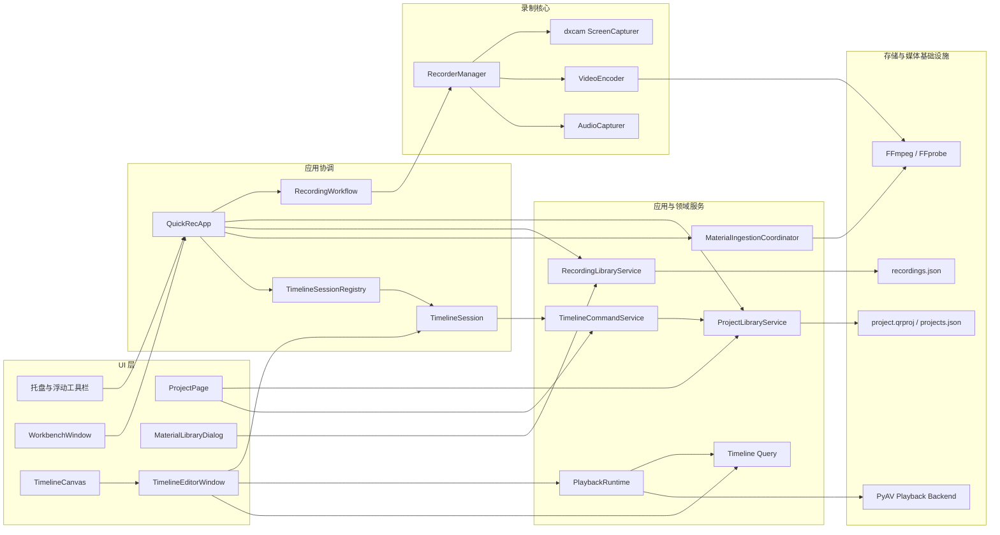
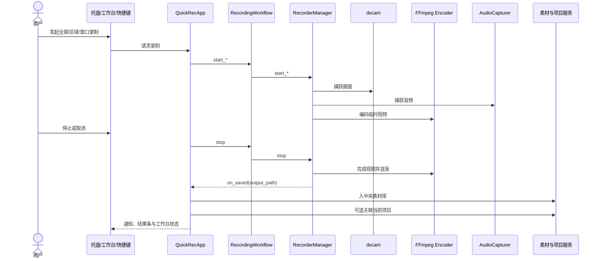
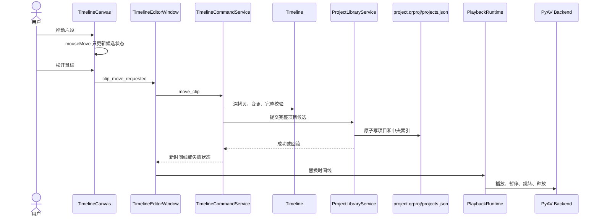

# QuickRec 架构审计报告

## 1. 文档信息

| 项目 | 内容 |
| --- | --- |
| 审计对象 | QuickRec Full |
| 审计基线 | `master` / `91ab91cba324658d9bfadb7016a31f8e4e380efb` |
| 基线标签 | `v1.9.2` |
| 审计日期 | 2026-07-28 |
| 文档状态 | 审计完成，等待优化方案确认 |
| 审计边界 | 只读分析，不修改运行时代码、项目文件、用户数据或发布标签 |

本报告针对已经发布的软件进行工程审计。结论优先级遵循：

```text
用户数据与录制稳定性 > 行为兼容 > 可维护性 > 架构形式
```

### 1.1 证据状态

报告中的结论使用以下状态：

| 状态 | 含义 |
| --- | --- |
| 已确认 | 由当前代码、测试、Git 或发布资料直接证明 |
| 实测 | 本轮通过只读脚本、基准或测试实际取得 |
| 风险推断 | 代码结构支持该风险判断，但尚无真实用户故障证据 |
| 待验证 | 需要真实大项目、硬件或打包 GUI 进一步证明 |

### 1.2 使用工具与证据

- Git：分支、提交、标签和工作区状态。
- `rg`：目录、类、入口、调用关系和配置检索。
- Python AST：77 个源模块、169 条内部静态依赖边的分析。
- `pytest`：项目存储、时间线、播放核心定向回归。
- Ruff、Mypy、Compileall：当前工程门禁复核。
- 合成模型基准：100 与 1000 片段下的深拷贝、历史内存和播放计划查询。
- 当前事实源：`README.md`、`doc/current.md`、`doc/releases/v1.9.2/`。

## 2. 审计摘要

QuickRec v1.9.2 已经不是 Demo。项目具备较完整的录制、素材、项目、时间线和播放链路，并且在项目原子写入、备份恢复、外部冲突检测、失败零副作用和发布验收方面有可靠基础。

当前主要问题不是缺少抽象，而是少数协调类持续吸收新职责，领域、应用、存储和 UI 边界逐渐模糊。主要表现为：

1. `QuickRecApp` 同时承担装配、录制用例、导航、通知、素材入库和项目关联。
2. `TimelineCommandService` 使用完整快照实现撤销重做，每次命令同步深拷贝并写完整项目。
3. 项目与时间线已经包含版本字段，但没有通用迁移注册机制。
4. `TimelineSession` 同时持有项目会话、媒体生命周期和录制期只读状态，媒体接口仍是 `Any`。
5. `RecorderManager` 仍是高风险大类，管理 51 个实例字段和多种线程、音频、编码及窗口状态。
6. UI 层直接依赖部分存储模型和文件系统判断，长期会增加替换成本。
7. 已知多实例缺口与仅进程内锁组合，存在并发写入用户数据的风险。
8. CI 基线可靠，但主要协调类仍处于 Ruff、Mypy 或 Coverage 的排除范围。

### 2.1 需要纠正的四个前提

| 原始假设 | 当前事实 | 结论 |
| --- | --- | --- |
| 项目文件缺少 `schema_version` | 项目、项目索引和时间线扩展均已有版本字段 | 需要的是迁移框架，不是简单补字段 |
| 拖动片段时每次鼠标移动都会写盘 | `mouseMoveEvent` 只更新候选位置，`mouseReleaseEvent` 才提交命令 | 不应以错误前提直接加入防抖 |
| 当前存在循环依赖 | AST 静态分析未发现模块循环依赖 | 问题是扇出和层级泄漏，不是依赖环 |
| `TimelineSession` 已是最大问题 | 该类约 276 行；更重的是 `QuickRecApp`、编辑窗口、命令服务和录制管理器 | 可以拆，但应避免为拆而拆 |

## 3. 目录与分层现状

### 3.1 目录摘要

```text
QuickRec/
├── .github/workflows/       # Windows CI 与 packaging smoke
├── doc/                     # 产品、发布、技术与验收文档
├── ffmpeg/                  # 打包使用的 FFmpeg / FFprobe
├── scripts/                 # 硬件、覆盖率、打包与验证脚本
├── src/
│   ├── main.py              # 应用装配与主要业务协调
│   ├── config.py            # 本地配置及原子保存
│   ├── hotkey/              # 全局快捷键
│   ├── recorder/            # 捕获、编码、音频、状态机和录制门面
│   ├── services/            # 应用服务、领域操作和媒体运行时
│   ├── ui/                  # PyQt 窗口、页面和交互
│   └── utils/               # 工具、领域模型和存储实现的混合目录
├── tests/                   # 单元、UI、硬件和 packaging 测试
└── build_std.spec           # PyInstaller onedir 配置
```

### 3.2 当前实际分层

| 分层 | 当前模块 | 审计判断 |
| --- | --- | --- |
| UI 层 | `src/ui/**` | 页面完整，但部分窗口直接访问服务、存储模型和文件系统 |
| 应用协调层 | `src/main.py`、部分 `services/**` | `QuickRecApp` 承担过多用例协调 |
| Service 层 | `src/services/**` | 同时混有应用服务、领域服务、会话和媒体运行时 |
| Model 层 | `src/utils/project_store.py`、`src/utils/timeline_model.py` | 模型与存储同目录，命名不能准确表达职责 |
| Storage 层 | `project_store`、`recording_library_store`、`pending_recording_store`、`thumbnail_cache` | 原子写与恢复较可靠，但缺少统一版本迁移和跨进程协调 |
| Media 层 | `timeline_query`、`playback_runtime`、`pyav_playback_backend`、`media_metadata`、缩略图服务 | 播放运行时与后端已有较好边界 |
| Recorder 层 | `src/recorder/**` | 状态机和工作流已抽出，但 `RecorderManager` 仍承担大量资源与流程职责 |

`utils` 当前并非单纯工具层。它包含项目领域模型、时间线领域模型及持久化实现，是 UI 和 Service 高扇入的根源之一。

## 4. 当前模块关系



## 5. 核心数据流

### 5.1 录制流程



主要问题位于保存完成后的应用协调。`QuickRecApp._handle_saved` 同时处理 120 FPS 反馈、素材入库、项目关联、通知、工具栏和工作台恢复，业务分支集中。

### 5.2 剪辑流程



## 6. 静态依赖与规模

### 6.1 依赖图结果

| 指标 | 结果 | 证据状态 |
| --- | --- | --- |
| Python 源模块 | 77 | 实测 |
| 内部静态依赖边 | 169 | 实测 |
| 静态强连通环 | 0 | 实测 |
| 最高扇出 | `main`，36 个内部模块 | 实测 |
| 最高扇入 | `utils.project_store` 与 `utils.recording_library_store`，各 12 | 实测 |
| UI 到 Service 依赖 | 20 条 | 实测 |
| UI 到 Utils 依赖 | 12 条 | 实测 |
| Service 到 Utils 依赖 | 34 条 | 实测 |

没有循环依赖是值得保留的基础。风险主要来自高扇出、低层模型被多层直接引用，以及协调类缺少稳定用例边界。

### 6.2 高职责文件

| 文件/类 | 文件行数 | 类方法数 | 其他信号 |
| --- | ---: | ---: | --- |
| `src/main.py` / `QuickRecApp` | 1732 / 类约 1570 | 73 | 65 个 `.connect`，扇出 36 |
| `TimelineEditorWindow` | 文件 1940 / 类约 1581 | 80 | 46 个 `.connect` |
| `ProjectPage` | 文件 1665 / 类约 1586 | 57 | 直接协调项目、素材、预览和时间线 |
| `TimelineCommandService` | 文件 1494 / 类约 1308 | 44 | 领域命令、事务、历史和恢复集中 |
| `MaterialLibraryDialog` | 文件 1107 / 类约 1034 | 58 | 查询、任务、文件操作与渲染集中 |
| `RecorderManager` | 文件 1083 / 类约 1026 | 41 | 构造函数维护 51 个实例字段 |

文件大小不是单独的缺陷，但这些类同时跨越多个变化原因，已经增加回归面。

## 7. 关键发现

### F-01 多实例与进程内锁组合形成数据一致性风险

- 优先级：P0
- 证据状态：已确认风险，真实数据破坏尚未复现
- 证据：
  - v1.9.2 已登记 `BUG-009`，同一 EXE 可创建多个进程和托盘图标。
  - `ProjectLibraryService` 使用 `threading.RLock`，只能协调同一进程内线程。
  - 项目索引、素材索引和配置采用整文件原子替换，不提供跨进程写锁。

影响：

- 两个进程可能基于不同旧快照写回同一 JSON，原子替换可避免半文件，却不能避免最后写入者覆盖前一进程的新数据。
- 快捷键、托盘、配置和项目索引也可能出现并发行为。

建议：

1. v2.0 架构实施前先加入 Windows 单实例门禁。
2. 关键存储保留乐观版本检查，并评估跨进程文件锁。
3. 不应把原子写等同于并发安全。

### F-02 `QuickRecApp` 是主要应用耦合中心

- 优先级：P1
- 证据状态：已确认
- 证据：`src/main.py:146`、`src/main.py:315`、`src/main.py:437`、`src/main.py:1323`。

该类同时负责：

- QApplication、托盘、快捷键和窗口装配。
- 三类录制入口和浮动窗口生命周期。
- 录制结果处理、通知、工作台恢复。
- 素材入库失败降级与重试。
- 项目关联、迁移、缩略图运行时和时间线协调。

风险：

- 任何录制、素材、项目或工作台变化都可能修改同一文件。
- 录制保存后的失败分支难以在不构造大量 UI 对象时独立测试。
- 未来 CLI 与 AI 若复用该类，会被迫依赖 QApplication 和窗口。

建议将其保留为装配根，但逐步抽出用例控制器，不重写入口。

### F-03 撤销历史使用完整项目与时间线快照

- 优先级：P1
- 证据状态：已确认，规模风险已实测
- 证据：
  - `_HistoryEntry` 同时保存前后 Timeline 和前后 ProjectFile。
  - 每个命令在变更前后多次 `deepcopy`。
  - 历史上限为 50。

合成基准：

| 规模 | 项目 JSON | Timeline+Project 深拷贝 | 10 步历史实测内存 | 50 步线性估计 |
| --- | ---: | ---: | ---: | ---: |
| 100 片段 | 31,672 B | 0.870 ms | 2.23 MB | 11.13 MB |
| 1000 片段 | 317,772 B | 9.187 ms | 21.94 MB | 109.71 MB |

说明：

- 基准是合成模型，不代表最终 GUI 延迟。
- 当前正式规模 100 片段下可接受，发布验收也已通过。
- 未来多轨剪辑、字幕或 AI 生成大量命令后，内存和复制成本会线性放大。

建议：

- 使用可逆增量命令逐步替代完整历史。
- 保留周期性检查点和现有事务回滚作为安全网。
- 不应一次性删除快照历史。

### F-04 每个离散编辑命令同步写完整项目与中央索引

- 优先级：P1
- 证据状态：已确认；真实慢盘卡顿待验证
- 证据：
  - 鼠标移动只更新候选，松开后才提交。
  - 命令提交执行完整校验、项目写入、项目索引写入和失败回滚。
  - UI 直接同步调用命令服务。

优点：

- 每次成功反馈都对应已经落盘的状态。
- 崩溃窗口小，保存失败不会污染可见状态。

风险：

- 在网络盘、机械盘、杀毒扫描或大项目下可能阻塞 UI。
- 简单改成 500 到 1000 毫秒防抖会扩大崩溃丢失窗口，并削弱当前成功即持久化语义。

建议采用分阶段保存协调器，先抽象状态和指标，再在具备恢复日志后启用有限防抖。

### F-05 已有版本字段，但缺少项目/扩展迁移注册机制

- 优先级：P1
- 证据状态：已确认
- 证据：
  - 项目 schema、项目索引 schema、时间线 schema 当前均为 1。
  - 未知时间线版本会保留原扩展并只读。
  - 未发现项目与时间线的通用 migration registry。

风险：

- 将来字幕、AI 标签和特效加入时，迁移逻辑容易散落在加载器、UI 和命令中。
- 项目顶层未知字段当前不会往返保留；扩展字段和时间线未知字段已有较好保护。

建议：

- 分开管理顶层项目 schema 与 `quickrec.timeline` 扩展 schema。
- 采用纯函数逐版本迁移、校验、备份、显式持久化。
- 只查看旧项目不自动改写；首次真实编辑或用户确认升级时再落盘。

### F-06 `TimelineSession` 混入媒体生命周期和录制锁，但尚未失控

- 优先级：P1
- 证据状态：已确认
- 证据：`src/services/timeline_session.py:47`、`:173`、`:189`。

当前职责：

- 绑定项目与 `TimelineCommandService`。
- 保存瞬时视图状态。
- 传播录制期只读。
- 用 `Any` 和反射管理播放器暂停与释放。

风险：

- 媒体资源契约缺少类型约束。
- 录制锁、项目只读、保存失败和媒体状态可能继续聚集。

建议：

- 提取类型化 `TimelineMediaRuntime`，复用现有 `PlaybackRuntime`，不重写 PyAV。
- 提取 `RecordingGuard`，将运行时只读原因建模。
- `TimelineSession` 只协调项目、时间线和瞬时视图状态。

### F-07 `RecorderManager` 仍是高风险资源大类

- 优先级：P1，但不建议与时间线 P0 同批改动
- 证据状态：已确认
- 证据：`src/recorder/recorder_manager.py:58`。

该类管理：

- 状态机、捕获、编码和多个线程。
- 音频预检、捕获、时间对齐和混流。
- 临时目录与最终文件。
- 窗口句柄、移动冻结和窗口丢失。
- 120 FPS 指标、磁盘检查和诊断状态。

风险：

- 生命周期顺序难以局部证明。
- 录制是高价值稳定链路，大规模重构的回归成本高。

建议：

- v2.0 先固定门面与公开事件。
- 后续按 `CaptureSession`、`AudioPipeline`、`RecordingFinalizer`、`RecordingDiagnostics` 小步抽出。
- 每次只替换一个内部组件，保留 `RecorderManager` 公共 API。

### F-08 UI 直接接触低层存储模型

- 优先级：P2
- 证据状态：已确认
- 证据：
  - `ProjectPage` 导入 `ProjectFile`、`ProjectMaterialRef` 和素材存储模型。
  - `MaterialLibraryDialog` 导入待入库与素材存储模型，并直接判断文件存在。

风险：

- UI 必须理解存储字段和文件路径语义。
- 数据库、缓存或远程适配器未来难以替换。

建议：

- 引入面向页面的只读 DTO 和用例端口。
- 文件操作、状态判定和事务继续留在应用服务。
- 不要求立即移动所有文件或建立全新目录树。

### F-09 播放计划每个 Tick 扫描完整时间线

- 优先级：P2
- 证据状态：已确认；当前规模不是瓶颈
- 证据：`src/services/timeline_query.py:46` 到 `:81`。

每次播放计划构建会：

- 重建轨道和素材字典。
- 扫描全部片段。
- 排序当前活动片段。
- 对活动素材执行文件存在判断。

合成基准：

| 片段数 | 单次播放计划平均耗时 |
| ---: | ---: |
| 100 | 0.041 ms |
| 1000 | 0.140 ms |
| 10000 | 0.986 ms |

当前 100 片段目标下无须立即优化。为未来大项目可引入按 timeline revision 构建的查询索引，避免每帧重建。

### F-10 事件机制存在重复路径，不能直接扩成全局 EventBus

- 优先级：P2
- 证据状态：已确认
- 证据：
  - `RecorderManager` 同时保留 `on_saved` 与 `on_event`。
  - `RecordingWorkflow` 维护订阅者列表，但当前 `QuickRecApp` 未订阅该列表，保存主链路仍走旧回调。
  - UI 使用大量 Qt 信号，缩略图又使用独立订阅机制。

风险：

- 相同事实可能从回调、Qt 信号和订阅器多次传播。
- 直接加入全局字符串事件总线会隐藏依赖并增加调试难度。

建议：

- 只为跨功能的“已发生事实”提供类型化应用事件。
- 开始录制、保存项目等命令继续使用直接接口。
- 统一线程切换、订阅释放和重复事件策略。

### F-11 质量门禁覆盖面仍与风险分布不一致

- 优先级：P2
- 证据状态：已确认

积极部分：

- CI 覆盖 Python 3.12、Compileall、Ruff、Mypy、Pytest、Coverage 和 Packaging。
- v1.9.2 发布证据为 867 项通过、总体覆盖率 83.56%。
- 本轮定向核心测试 136 项通过。

盲区：

- Coverage 显式排除 `src/main.py` 和部分录制/UI 模块。
- Ruff 排除 `main.py`、部分 UI 和音频捕获模块。
- Mypy 本轮只检查 43 个源文件，高职责 `main.py` 与 `RecorderManager` 未纳入。
- 现有架构边界测试只限制少数录制私有字段，未约束 UI 到 Store、应用层到 UI 的总体方向。

建议：

- 按修改模块增量扩面，不把全仓一次清零作为前置条件。
- 为新控制器、迁移、保存协调器和命令实现设置更高门禁。

### F-12 非零音频 Seek 的边界准确性需要真实媒体证据

- 优先级：P2
- 证据状态：风险推断
- 证据：音频解码器向后 Seek 后将游标直接设为目标时间，当前实现未显式按帧时间戳丢弃目标点之前的采样。

该实现已通过 v1.9.2 当前播放验收，不能据此直接判定为缺陷。未来实现裁剪、分割或 AI 精确剪辑前，需要用非关键帧和非零音频入点样本建立门禁。

## 8. 值得保留

1. **项目原子写与备份**：临时文件、`fsync`、`os.replace` 和 `.bak` 是数据安全基础。
2. **项目与索引事务回滚**：中央索引写失败时恢复原项目字节和时间戳。
3. **外部修改检测**：通过项目指纹阻止静默覆盖外部修改。
4. **命令失败零副作用**：校验或保存失败不会改变可见时间线和历史栈。
5. **未知时间线版本只读保留**：比强制覆盖或重建更安全。
6. **播放运行时与 PyAV 后端分离**：状态机、查询和解码已有可扩展接口。
7. **录制状态机和工作流门面**：已为后续收窄 `RecorderManager` 提供基础。
8. **真实打包与 GUI 验收文化**：硬件、DPI、音频、长时播放和发布包均有事实源。
9. **当前无静态循环依赖**：后续优化应维持该属性。

## 9. 测试与工程化结论

### 9.1 本轮实际检查

| 检查 | 结果 |
| --- | --- |
| 核心项目/时间线/播放测试 | `136 passed in 2.29s` |
| Ruff | 通过 |
| Mypy | `43 source files`，通过 |
| Compileall | 通过 |
| AST 依赖环 | 未发现 |

### 9.2 发布资料证据

| 项目 | v1.9.2 结果 |
| --- | --- |
| 标准全量测试 | 867 passed，27 deselected，56 subtests passed |
| Packaging | 15 passed，879 deselected |
| 总体覆盖率 | 83.56% |
| 时间线核心 | 86.44% |
| 播放/UI 协调 | 82.23% |
| GUI 压力 | 8+8 轨、100 片段、30 分钟、50 步撤销重做 |

## 10. 审计优先级

| 顺序 | 事项 | 原因 |
| ---: | --- | --- |
| P0-0 | 单实例与跨进程写保护 | 直接关联用户数据与商业软件稳定性 |
| P0-1 | TimelineSession 媒体与录制锁拆分 | 边界清晰、风险较低，可为后续改造建立接口 |
| P0-2 | 保存协调器与状态模型 | 先保留即时保存，再为有限防抖和恢复日志准备 |
| P0-3 | 项目/扩展迁移注册机制 | 后续剪辑、字幕与 AI 数据演进前必须建立 |
| P1-1 | 可逆增量 Command 历史 | 控制大项目内存与复制成本 |
| P1-2 | QuickRecApp 用例控制器拆分 | 降低跨录制、素材、项目和 UI 的联动回归 |
| P1-3 | 类型化应用事件 | 统一跨功能事实，避免全局 EventBus |
| P1-4 | RecorderManager 内部渐进拆分 | 高价值但回归面大，应单独推进 |
| P2 | AI Command Gateway 与查询索引 | 先定义边界，不直接实现 AI |

## 11. 最终判断

QuickRec 当前架构可以继续演进，无需全量重写。最安全的路线是：

1. 先关闭多实例与数据并发风险。
2. 以兼容接口抽出媒体运行时、录制锁、保存协调和迁移注册器。
3. 保留现有同步事务语义，通过指标证明后再引入有限防抖。
4. 按命令逐个替换完整历史快照，而不是一次切换整个撤销系统。
5. 使用类型化用例端口和事件事实，为 CLI、导出与未来 AI 复用。

详细实施边界见：

[QuickRec v2.0 架构优化方案](QuickRec-v2.0-架构优化方案.md)
